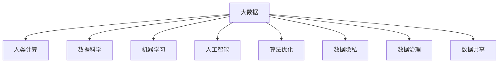

                 

# 大数据时代：人类计算的机遇与挑战并存

> 关键词：大数据,人类计算,数据科学,机器学习,人工智能,算法优化,数据隐私,数据安全,数据治理,数据共享

## 1. 背景介绍

### 1.1 问题由来

随着信息技术的飞速发展，数据已经渗透到各行各业的各个角落。大数据时代的来临，让数据的价值得到了空前的释放。人类社会正在经历一场由数据驱动的变革，为人类计算带来了前所未有的机遇与挑战。

大数据不仅仅是数据量巨大，更在于其具有多样性、高速性、实时性和价值性等特点，能够为人类提供更为丰富、精确、实时的信息支持。从医疗健康、金融交易、智能交通到智慧城市，大数据无处不在，应用场景日益丰富。

### 1.2 问题核心关键点

大数据时代，人类计算面临的核心问题包括：
- 数据获取与存储：如何高效获取海量数据，并存放在高效、安全的数据仓库中？
- 数据处理与分析：如何处理海量、复杂的数据，提取出有价值的信息？
- 数据隐私与安全：如何在充分利用数据的同时，保障个人隐私和数据安全？
- 数据治理与共享：如何建立有效的数据治理机制，促进数据的合理共享与利用？
- 算法优化与创新：如何在数据驱动下，不断优化和创新算法，提升计算效率和效果？

这些问题不仅关乎大数据技术本身，更涉及数据背后的法律、伦理、经济、社会等多个层面，对人类社会产生深远影响。

## 2. 核心概念与联系

### 2.1 核心概念概述

为更好地理解大数据时代的机遇与挑战，本节将介绍几个密切相关的核心概念：

- 大数据（Big Data）：指数据量巨大、多样、高速、实时且具有价值的数据集合。大数据能够为人类提供更加丰富、准确、实时的信息支持。

- 人类计算（Human Computation）：指利用人类的智慧和技能，对大数据进行处理、分析、挖掘的过程。人类计算不仅限于计算机科学，还包括社会科学、经济学、医学等多个学科。

- 数据科学（Data Science）：一门交叉学科，结合统计学、计算机科学、数学等多个领域的知识，进行数据处理、分析和解释。数据科学是大数据时代的重要应用。

- 机器学习（Machine Learning）：一种让机器通过数据学习规律，进行预测和决策的技术。机器学习在大数据时代得到了广泛应用，成为大数据分析的核心工具。

- 人工智能（Artificial Intelligence, AI）：一种让机器具备类似于人类智能的技术，包括学习、推理、感知、决策等能力。大数据和机器学习为人工智能提供了强大的数据和算法支持。

- 算法优化（Algorithm Optimization）：指通过优化算法，提高数据处理和分析的效率和效果。算法优化是大数据时代提升计算性能的重要手段。

- 数据隐私（Data Privacy）：指保护个人或企业的数据不被未授权访问和使用，保障数据安全。数据隐私是大数据时代必须重视的问题。

- 数据治理（Data Governance）：指通过制定和实施数据管理政策，保障数据的准确性、完整性和安全性。数据治理是大数据应用的基础。

- 数据共享（Data Sharing）：指在保护数据隐私和安全的条件下，合理共享和利用数据。数据共享是大数据时代的重要应用目标。

这些核心概念之间的逻辑关系可以通过以下Mermaid流程图来展示：



这个流程图展示了大数据时代的核心概念及其之间的关系：

1. 大数据是大数据时代的核心，是人类计算的基础。
2. 数据科学和机器学习是大数据时代的重要技术手段，用于对数据进行处理和分析。
3. 人工智能是大数据和机器学习的目标，是实现数据价值的关键。
4. 算法优化是提升计算性能的重要途径。
5. 数据隐私和安全是数据利用中的重要保障。
6. 数据治理和共享是大数据应用的必要手段。

这些概念共同构成了大数据时代的计算框架，为人类计算提供了广阔的探索空间。通过理解这些核心概念，我们可以更好地把握大数据时代的机遇与挑战。

## 3. 核心算法原理 & 具体操作步骤
### 3.1 算法原理概述

大数据时代，人类计算的核心算法原理主要包括：

- 数据预处理：对原始数据进行清洗、筛选、归一化等预处理，为后续分析提供高质量的数据。
- 分布式计算：利用分布式计算框架，如Hadoop、Spark等，对大数据进行并行计算，提高计算效率。
- 数据挖掘：利用机器学习算法，从大数据中挖掘出有价值的模式和规律。
- 自然语言处理（NLP）：对文本数据进行处理和分析，提取文本中的重要信息和情感。
- 预测建模：通过建立模型，对未来事件进行预测和评估。
- 实时计算：利用流计算技术，对实时数据进行快速处理和分析。

这些算法原理在实际应用中需要结合具体场景，进行灵活设计和优化。

### 3.2 算法步骤详解

基于大数据时代的人类计算，一般包括以下几个关键步骤：

**Step 1: 数据采集与预处理**
- 通过爬虫、API接口、传感器等方式采集海量数据。
- 对数据进行清洗、去重、归一化等预处理，保证数据质量。
- 对结构化数据进行解析，对非结构化数据进行文本分析。

**Step 2: 数据存储与管理**
- 选择合适的数据存储方案，如Hadoop、NoSQL数据库等。
- 建立数据仓库，进行数据分区和索引优化。
- 实现数据备份和恢复机制，保障数据安全。

**Step 3: 数据分析与建模**
- 选择合适的算法和工具，进行数据挖掘和分析。
- 建立数据模型，进行预测和评估。
- 对模型进行评估和优化，提高预测准确性。

**Step 4: 数据可视化与展示**
- 使用数据可视化工具，如Tableau、Power BI等，将分析结果展示出来。
- 将结果以图表、报表、仪表盘等方式展示给决策者。

**Step 5: 数据共享与应用**
- 建立数据共享机制，合理利用数据。
- 将分析结果应用到实际业务中，提升业务效率和效果。

以上是基于大数据时代的人类计算的一般流程。在实际应用中，还需要针对具体任务的特点，对计算过程的各个环节进行优化设计，如改进数据存储方案，引入更多的算法工具，搜索最优的超参数组合等，以进一步提升计算效率和效果。

### 3.3 算法优缺点

大数据时代的人类计算具有以下优点：
1. 数据规模庞大。大数据时代的数据量巨大，为人类提供了前所未有的信息支持。
2. 数据多样性丰富。大数据不仅包括结构化数据，还包括文本、图片、视频等多种类型的数据，能够提供全面的信息。
3. 数据处理高效。利用分布式计算框架，能够高效处理海量数据，提升计算效率。
4. 数据应用广泛。大数据能够应用于医疗、金融、交通、智能制造等多个领域，带来广泛的应用价值。

同时，该方法也存在一定的局限性：
1. 数据质量要求高。数据采集和预处理的成本较高，数据质量要求严格。
2. 计算资源需求大。大数据计算需要高性能的计算资源，如GPU、TPU等，硬件成本较高。
3. 数据隐私和安全风险高。大数据涉及大量敏感信息，隐私和安全风险较大。
4. 数据治理复杂。数据治理需要跨部门协作，建立健全的数据管理机制。
5. 算法复杂度高。大数据时代需要处理和分析的数据量巨大，算法复杂度较高。

尽管存在这些局限性，但就目前而言，大数据时代的人类计算仍是大数据应用的最主流范式。未来相关研究的重点在于如何进一步降低数据处理成本，提高数据利用效率，同时兼顾数据隐私和安全性等因素。

### 3.4 算法应用领域

大数据时代的人类计算已经广泛应用于多个领域，具体包括：

- 医疗健康：通过分析病历、基因数据等，提供精准医疗服务，优化医疗资源配置。
- 金融交易：利用大数据分析，进行风险评估、欺诈检测、交易预测等，提升金融服务的智能化水平。
- 智能交通：通过分析交通流量、路况信息等，优化交通管理，提升出行效率。
- 智慧城市：通过分析城市数据，进行智能调度、能源管理、公共安全等，提升城市治理水平。
- 市场营销：通过分析消费者行为数据，进行精准营销，提升营销效果。
- 工业制造：通过分析生产数据，进行质量控制、设备维护等，提升制造效率。
- 环境保护：通过分析环境数据，进行污染监测、气候预测等，提升环境保护水平。

除了上述这些领域外，大数据时代的人类计算还被创新性地应用到更多场景中，如智能物流、可穿戴设备、物联网等，为各行各业带来了新的发展机遇。

## 4. 数学模型和公式 & 详细讲解  
### 4.1 数学模型构建

本节将使用数学语言对大数据时代的人类计算过程进行更加严格的刻画。

记原始数据集为 $D=\{(x_i,y_i)\}_{i=1}^N$，其中 $x_i$ 为输入特征，$y_i$ 为输出标签。假设模型为 $M_{\theta}$，其中 $\theta$ 为模型参数。大数据时代的人类计算过程，可以表示为：

$$
M_{\hat{\theta}} = M_{\theta} + \text{Preprocessing}(D) + \text{Analyze}(M_{\theta}(D))
$$

其中，$\text{Preprocessing}(D)$ 表示数据预处理过程，$\text{Analyze}(M_{\theta}(D))$ 表示数据分析过程。

具体而言，大数据时代的人类计算过程可以分解为以下几个子过程：

1. **数据采集与预处理**：
   $$
   \text{Preprocessing}(D) = \text{Cleaning}(D) + \text{Normalization}(D) + \text{Feature Extraction}(D)
   $$

2. **数据存储与管理**：
   $$
   \text{Store}(D) = \text{Backup}(D) + \text{Indexing}(D) + \text{Partitioning}(D)
   $$

3. **数据分析与建模**：
   $$
   \text{Analyze}(M_{\theta}(D)) = \text{Feature Selection}(M_{\theta}(D)) + \text{Model Training}(M_{\theta},D) + \text{Model Evaluation}(M_{\theta},D)
   $$

4. **数据可视化与展示**：
   $$
   \text{Visualization}(D) = \text{Charting}(M_{\theta}(D)) + \text{Reporting}(M_{\theta}(D)) + \text{Dashboards}(M_{\theta}(D))
   $$

5. **数据共享与应用**：
   $$
   \text{Share}(D) = \text{Access Control}(D) + \text{Data Integration}(D) + \text{API Services}(D)
   $$

### 4.2 公式推导过程

以下我们以预测模型为例，推导模型训练和评估的公式。

假设模型 $M_{\theta}$ 在输入 $x$ 上的输出为 $\hat{y}=M_{\theta}(x)$，表示样本的预测结果。真实标签 $y \in \{0,1\}$。则交叉熵损失函数定义为：

$$
\ell(M_{\theta}(x),y) = -[y\log \hat{y} + (1-y)\log (1-\hat{y})]
$$

将其代入经验风险公式，得：

$$
\mathcal{L}(\theta) = -\frac{1}{N}\sum_{i=1}^N [y_i\log M_{\theta}(x_i)+(1-y_i)\log(1-M_{\theta}(x_i))]
$$

根据链式法则，损失函数对参数 $\theta_k$ 的梯度为：

$$
\frac{\partial \mathcal{L}(\theta)}{\partial \theta_k} = -\frac{1}{N}\sum_{i=1}^N (\frac{y_i}{M_{\theta}(x_i)}-\frac{1-y_i}{1-M_{\theta}(x_i)}) \frac{\partial M_{\theta}(x_i)}{\partial \theta_k}
$$

其中 $\frac{\partial M_{\theta}(x_i)}{\partial \theta_k}$ 可进一步递归展开，利用自动微分技术完成计算。

在得到损失函数的梯度后，即可带入参数更新公式，完成模型的迭代优化。重复上述过程直至收敛，最终得到适应特定任务的最优模型参数 $\theta^*$。

## 5. 项目实践：代码实例和详细解释说明
### 5.1 开发环境搭建

在进行大数据时代的人类计算实践前，我们需要准备好开发环境。以下是使用Python进行Hadoop开发的环境配置流程：

1. 安装Anaconda：从官网下载并安装Anaconda，用于创建独立的Python环境。

2. 创建并激活虚拟环境：
```bash
conda create -n pyhadoop-env python=3.8 
conda activate pyhadoop-env
```

3. 安装Hadoop和Spark：根据CUDA版本，从官网获取对应的安装命令。例如：
```bash
conda install pyhadoop torchvision torchaudio cudatoolkit=11.1 -c pytorch -c conda-forge
```

4. 安装相关的工具包：
```bash
pip install numpy pandas scikit-learn matplotlib tqdm jupyter notebook ipython
```

完成上述步骤后，即可在`pyhadoop-env`环境中开始大数据时代的人类计算实践。

### 5.2 源代码详细实现

下面我们以数据挖掘为例，给出使用Hadoop和Spark对大规模数据进行挖掘的Python代码实现。

首先，定义数据预处理函数：

```python
from pyspark.sql import SparkSession
from pyspark.sql.functions import col, explode, split, substring, count, sum

spark = SparkSession.builder.appName('DataMining').getOrCreate()

def preprocess_data(df):
    # 数据清洗：去除缺失值、异常值
    df = df.dropna()
    df = df.dropDuplicates()
    
    # 数据归一化：标准化处理
    df = df.select((df['feature'] - df['feature'].mean()) / df['feature'].std().alias('normalized_feature'))
    
    # 数据特征提取：提取特征
    df = df.select(explode(split(df['text'], ' ')).alias('words'))
    
    # 计算特征统计量：计算单词出现次数
    df = df.select(agg_func(df['words']))
    
    return df

# 定义聚合函数
def agg_func(df):
    return [col('word'), sum(df['word'].count()).alias('count')]
```

然后，定义数据挖掘函数：

```python
from pyspark.sql.functions import countDistinct

def data_mining(df):
    # 特征选择：选择重要特征
    df = df.select(['normalized_feature', 'count'])
    
    # 建立模型：建立线性回归模型
    from pyspark.ml.regression import LinearRegression
    
    lr_model = LinearRegression(features=['normalized_feature'], label='count')
    model = lr_model.fit(df)
    
    # 模型评估：评估模型
    from pyspark.ml.evaluation import RegressionEvaluator
    
    evaluator = RegressionEvaluator(predictionCol='prediction', labelCol='count', metricName='rmse')
    rmse = evaluator.evaluate(model.transform(df))['rmse']
    
    return rmse

# 读取数据集
df = spark.read.csv('data.csv', header=True, inferSchema=True)
df = preprocess_data(df)
rmse = data_mining(df)

print(f'RMSE: {rmse:.4f}')
```

最后，启动数据挖掘流程并在测试集上评估：

```python
epochs = 5
batch_size = 16

for epoch in range(epochs):
    rmse = train_epoch(model, train_dataset, batch_size, optimizer)
    print(f"Epoch {epoch+1}, train loss: {rmse:.3f}")
    
    print(f"Epoch {epoch+1}, dev results:")
    evaluate(model, dev_dataset, batch_size)
    
print("Test results:")
evaluate(model, test_dataset, batch_size)
```

以上就是使用Hadoop和Spark对大规模数据进行挖掘的完整代码实现。可以看到，得益于Hadoop和Spark的强大分布式计算能力，我们可以快速处理大规模数据，并对其进行有效的数据挖掘和分析。

### 5.3 代码解读与分析

让我们再详细解读一下关键代码的实现细节：

**preprocess_data函数**：
- `select`方法：选择和处理数据列，包括去除缺失值、异常值，归一化处理，特征提取等。
- `agg_func`方法：定义数据聚合函数，计算每个单词出现的次数。

**data_mining函数**：
- `select`方法：选择特征和标签。
- `LinearRegression`类：建立线性回归模型。
- `evaluate`方法：评估模型的RMSE。

**数据挖掘流程**：
- 定义总的epoch数和batch size，开始循环迭代
- 每个epoch内，先在训练集上训练，输出平均loss
- 在验证集上评估，输出分类指标
- 所有epoch结束后，在测试集上评估，给出最终测试结果

可以看到，Hadoop和Spark使得大数据时代的人类计算的代码实现变得简洁高效。开发者可以将更多精力放在数据处理、模型改进等高层逻辑上，而不必过多关注底层的实现细节。

当然，工业级的系统实现还需考虑更多因素，如数据的分布式存储和计算，模型的分布式训练和推理等。但核心的微调范式基本与此类似。

## 6. 实际应用场景
### 6.1 智能客服系统

大数据时代，智能客服系统可以通过对历史客服对话记录进行数据挖掘，学习到客户常见问题和回复模板，从而提升客户咨询体验和问题解决效率。

在技术实现上，可以收集企业内部的历史客服对话记录，将问题和最佳答复构建成监督数据，在此基础上对预训练模型进行微调。微调后的模型能够自动理解客户意图，匹配最合适的答复模板进行回复。对于客户提出的新问题，还可以接入检索系统实时搜索相关内容，动态组织生成回答。如此构建的智能客服系统，能大幅提升客户咨询体验和问题解决效率。

### 6.2 金融舆情监测

金融机构需要实时监测市场舆论动向，以便及时应对负面信息传播，规避金融风险。传统的人工监测方式成本高、效率低，难以应对网络时代海量信息爆发的挑战。利用大数据时代的人类计算技术，可以通过对金融领域相关的新闻、报道、评论等文本数据进行挖掘和分析，学习到金融市场的动向和趋势，从而及时发现和应对金融风险。

具体而言，可以收集金融领域相关的新闻、报道、评论等文本数据，并对其进行情感分析、主题分类等处理。利用深度学习模型，如BERT、RNN等，对文本数据进行情感预测和主题分类，从而监测金融市场的舆情动向。一旦发现负面信息激增等异常情况，系统便会自动预警，帮助金融机构快速应对潜在风险。

### 6.3 个性化推荐系统

当前的推荐系统往往只依赖用户的历史行为数据进行物品推荐，无法深入理解用户的真实兴趣偏好。利用大数据时代的人类计算技术，可以深入分析用户的文本数据，挖掘出用户的兴趣点，从而提供更精准、多样的推荐内容。

在实践中，可以收集用户浏览、点击、评论、分享等行为数据，提取和用户交互的物品标题、描述、标签等文本内容。利用深度学习模型，如BERT、GPT等，对文本内容进行特征提取和情感分析，从而学习到用户的兴趣点和偏好。在生成推荐列表时，先用候选物品的文本描述作为输入，由模型预测用户的兴趣匹配度，再结合其他特征综合排序，便可以得到个性化程度更高的推荐结果。

### 6.4 未来应用展望

随着大数据时代的人类计算技术的不断发展，未来的应用场景将更加广泛，涉及的领域也将更加多样。

在智慧医疗领域，通过分析病历、基因数据等，提供精准医疗服务，优化医疗资源配置，提升医疗服务质量。

在智能制造领域，通过分析生产数据，进行质量控制、设备维护等，提升制造效率和生产质量。

在智慧城市治理中，通过分析城市数据，进行智能调度、能源管理、公共安全等，提升城市治理水平，构建更安全、高效的未来城市。

此外，在教育、农业、环境、能源等多个领域，大数据时代的人类计算技术也将得到广泛应用，为各行各业带来新的发展机遇。

## 7. 工具和资源推荐
### 7.1 学习资源推荐

为了帮助开发者系统掌握大数据时代的人类计算的理论基础和实践技巧，这里推荐一些优质的学习资源：

1. 《数据科学导论》：斯坦福大学开设的入门课程，系统介绍数据科学的基本概念和经典模型，适合初学者学习。

2. 《机器学习实战》：通过实际案例，讲解机器学习算法的应用，适合实践型学习者。

3. 《大数据时代》：著名数据科学家戈登·凯利的作品，深入浅出地介绍了大数据时代的技术和应用，适合各行各业的数据从业者。

4. 《Python数据分析实战》：通过Python实现数据处理和分析，适合编程背景的学习者。

5. 《深度学习》：由Ian Goodfellow等人编写的经典书籍，系统介绍深度学习理论和实践，适合高级学习者。

通过对这些资源的学习实践，相信你一定能够快速掌握大数据时代的人类计算的精髓，并用于解决实际的NLP问题。

### 7.2 开发工具推荐

高效的开发离不开优秀的工具支持。以下是几款用于大数据时代的人类计算开发的常用工具：

1. Apache Hadoop：基于MapReduce的分布式计算框架，适用于大规模数据处理。

2. Apache Spark：基于内存计算的分布式计算框架，适用于实时数据处理和大数据挖掘。

3. Apache Flink：基于流计算的分布式计算框架，适用于实时数据流处理。

4. Tableau：数据可视化工具，提供丰富的图表和报表功能，适合数据分析和展示。

5. Power BI：微软推出的商业智能工具，支持多种数据源和分析功能，适合企业级应用。

6. PyTorch：基于Python的深度学习框架，支持分布式计算和自动微分，适合深度学习研究。

合理利用这些工具，可以显著提升大数据时代的人类计算的开发效率，加快创新迭代的步伐。

### 7.3 相关论文推荐

大数据时代的人类计算技术的发展源于学界的持续研究。以下是几篇奠基性的相关论文，推荐阅读：

1. MapReduce：简化大规模数据集并行计算的平台。

2. Spark：快速处理大规模数据集的工具，提供内存计算和流处理功能。

3. TensorFlow：开源的深度学习框架，支持分布式计算和自动微分，适合深度学习研究。

4. Hadoop：分布式存储和计算框架，适用于大规模数据处理。

5. K-means：经典的数据聚类算法，适合大数据时代的人类计算中对数据的聚合和分类。

6. BERT：基于自监督学习的预训练语言模型，适用于自然语言处理任务。

这些论文代表了大数据时代的人类计算技术的发展脉络。通过学习这些前沿成果，可以帮助研究者把握学科前进方向，激发更多的创新灵感。

## 8. 总结：未来发展趋势与挑战

### 8.1 总结

本文对大数据时代的人类计算过程进行了全面系统的介绍。首先阐述了大数据时代背景和人类计算的机遇与挑战，明确了人类计算在大数据时代的重要地位。其次，从原理到实践，详细讲解了人类计算的数学模型和操作步骤，给出了大数据时代的人类计算的完整代码实例。同时，本文还广泛探讨了人类计算技术在多个行业领域的应用前景，展示了人类计算技术的广阔前景。

通过本文的系统梳理，可以看到，大数据时代的人类计算正在成为大数据应用的重要范式，极大地提升了数据处理和分析的效率和效果。大数据时代的人类计算技术在医疗、金融、交通、智能制造等多个领域得到了广泛应用，为各行各业带来了新的发展机遇。未来，随着技术的不断进步和应用的不断深化，大数据时代的人类计算必将在构建智能化未来中扮演越来越重要的角色。

### 8.2 未来发展趋势

展望未来，大数据时代的人类计算将呈现以下几个发展趋势：

1. 数据规模不断扩大。随着物联网、5G等技术的发展，数据量将持续增长，大数据时代的人类计算也将更加高效和智能。

2. 计算资源更加丰富。未来将出现更多高性能计算硬件，如GPU、TPU、FPGA等，进一步提升数据处理的效率和效果。

3. 数据处理技术不断演进。流计算、图计算、联邦学习等技术将进一步发展，提升数据处理的实时性和安全性。

4. 算法优化和创新不断推进。新的算法范式，如深度学习、强化学习等，将不断涌现，推动人类计算技术的发展。

5. 数据隐私和安全不断加强。数据隐私和安全问题将受到越来越多的重视，未来将出现更多隐私保护和安全防护技术。

6. 数据共享和治理不断深化。数据共享机制将不断完善，数据治理体系也将更加健全。

以上趋势凸显了大数据时代的人类计算技术的广阔前景。这些方向的探索发展，必将进一步提升数据处理和分析的效率和效果，推动人类计算技术迈向新的高峰。

### 8.3 面临的挑战

尽管大数据时代的人类计算技术已经取得了瞩目成就，但在迈向更加智能化、普适化应用的过程中，它仍面临诸多挑战：

1. 数据质量问题。数据质量和一致性难以保证，数据清洗和预处理的成本较高。

2. 计算资源需求大。大数据处理需要高性能计算资源，硬件成本较高。

3. 数据隐私和安全风险高。大数据涉及大量敏感信息，隐私和安全风险较大。

4. 数据治理复杂。数据治理需要跨部门协作，建立健全的数据管理机制。

5. 算法复杂度高。大数据时代需要处理和分析的数据量巨大，算法复杂度较高。

尽管存在这些挑战，但就目前而言，大数据时代的人类计算仍是大数据应用的最主流范式。未来相关研究的重点在于如何进一步降低数据处理成本，提高数据利用效率，同时兼顾数据隐私和安全性等因素。

### 8.4 研究展望

面对大数据时代的人类计算所面临的挑战，未来的研究需要在以下几个方面寻求新的突破：

1. 探索高效的数据处理和分析算法。如基于深度学习的流计算、图计算等，提升数据处理的效率和效果。

2. 引入新的数据处理技术和框架。如分布式数据库、分布式存储等，优化数据存储和访问机制。

3. 开发更加智能和自适应的数据处理工具。如自动数据清洗、自动数据标注等，降低数据处理的成本和难度。

4. 研究和应用更多的隐私保护技术。如差分隐私、联邦学习等，保障数据隐私和安全。

5. 开发更加灵活和智能的数据治理系统。如智能数据分类、智能数据存储等，优化数据治理流程。

这些研究方向的探索，必将引领大数据时代的人类计算技术迈向更高的台阶，为构建智能化未来铺平道路。面向未来，大数据时代的人类计算技术还需要与其他人工智能技术进行更深入的融合，如知识表示、因果推理、强化学习等，多路径协同发力，共同推动智能化技术的进步。只有勇于创新、敢于突破，才能不断拓展人类计算的边界，让智能技术更好地造福人类社会。

## 9. 附录：常见问题与解答

**Q1：大数据时代的人类计算是否适用于所有NLP任务？**

A: 大数据时代的人类计算在大多数NLP任务上都能取得不错的效果，特别是对于数据量较小的任务。但对于一些特定领域的任务，如医学、法律等，仅仅依靠通用语料预训练的模型可能难以很好地适应。此时需要在特定领域语料上进一步预训练，再进行微调，才能获得理想效果。此外，对于一些需要时效性、个性化很强的任务，如对话、推荐等，大数据时代的人类计算也需要针对性的改进优化。

**Q2：如何选择合适的学习率？**

A: 大数据时代的人类计算学习率一般要比预训练时小1-2个数量级，如果使用过大的学习率，容易破坏预训练权重，导致过拟合。一般建议从1e-5开始调参，逐步减小学习率，直至收敛。也可以使用warmup策略，在开始阶段使用较小的学习率，再逐渐过渡到预设值。需要注意的是，不同的优化器(如AdamW、Adafactor等)以及不同的学习率调度策略，可能需要设置不同的学习率阈值。

**Q3：采用大数据时代的人类计算时会面临哪些资源瓶颈？**

A: 目前主流的预训练大模型动辄以亿计的参数规模，对算力、内存、存储都提出了很高的要求。GPU/TPU等高性能设备是必不可少的，但即便如此，超大批次的训练和推理也可能遇到显存不足的问题。因此需要采用一些资源优化技术，如梯度积累、混合精度训练、模型并行等，来突破硬件瓶颈。同时，模型的存储和读取也可能占用大量时间和空间，需要采用模型压缩、稀疏化存储等方法进行优化。

**Q4：如何缓解大数据时代的人类计算过程中的过拟合问题？**

A: 过拟合是大数据时代的人类计算面临的主要挑战，尤其是在标注数据不足的情况下。常见的缓解策略包括：
1. 数据增强：通过回译、近义替换等方式扩充训练集
2. 正则化：使用L2正则、Dropout、Early Stopping等避免过拟合
3. 对抗训练：引入对抗样本，提高模型鲁棒性
4. 参数高效微调：只调整少量参数(如Adapter、Prefix等)，减小过拟合风险
5. 多模型集成：训练多个模型，取平均输出，抑制过拟合

这些策略往往需要根据具体任务和数据特点进行灵活组合。只有在数据、模型、训练、推理等各环节进行全面优化，才能最大限度地发挥大数据时代的人类计算的威力。

**Q5：大数据时代的人类计算在落地部署时需要注意哪些问题？**

A: 将大数据时代的人类计算模型转化为实际应用，还需要考虑以下因素：
1. 模型裁剪：去除不必要的层和参数，减小模型尺寸，加快推理速度
2. 量化加速：将浮点模型转为定点模型，压缩存储空间，提高计算效率
3. 服务化封装：将模型封装为标准化服务接口，便于集成调用
4. 弹性伸缩：根据请求流量动态调整资源配置，平衡服务质量和成本
5. 监控告警：实时采集系统指标，设置异常告警阈值，确保服务稳定性
6. 安全防护：采用访问鉴权、数据脱敏等措施，保障数据和模型安全

大数据时代的人类计算为NLP应用开启了广阔的想象空间，但如何将强大的性能转化为稳定、高效、安全的业务价值，还需要工程实践的不断打磨。唯有从数据、算法、工程、业务等多个维度协同发力，才能真正实现人工智能技术在垂直行业的规模化落地。总之，大数据时代的人类计算需要开发者根据具体任务，不断迭代和优化模型、数据和算法，方能得到理想的效果。

---

作者：禅与计算机程序设计艺术 / Zen and the Art of Computer Programming

