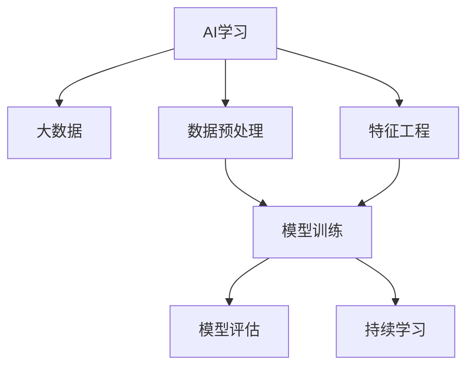

                 

## 1. 背景介绍

### 1.1 问题由来
随着人工智能（AI）技术的不断进步，AI学习已不再局限于传统的学术研究领域，而是逐步向更广泛的实际应用场景拓展。在过去的一段时间里，AI研究者们发现，通过大量数据驱动学习模型，能够在处理各种任务时取得令人瞩目的效果。大数据驱动AI学习，不仅仅是处理海量数据，更重要的是如何有效地利用这些数据来提升AI模型的性能和泛化能力。

### 1.2 问题核心关键点
大数据驱动AI学习成为当前AI领域的焦点，其核心关键点如下：

- **数据规模**：大规模的数据集是构建高性能AI模型的基础。
- **数据质量**：高质量的数据集能够提升AI模型对问题解决的准确性和效率。
- **算法优化**：在大数据背景下，优化算法成为提升AI学习效果的关键。
- **模型评估**：在大数据环境下，选择合适的模型评估指标，确保模型性能。

### 1.3 问题研究意义
大数据驱动AI学习的研究具有重要意义：

- **提升模型精度**：通过利用大数据，可以构建更精确的AI模型，解决复杂问题。
- **泛化能力强**：大数据训练出的AI模型，具有更强的泛化能力，能够适应不同的应用场景。
- **创新驱动**：大数据环境为AI模型的创新提供了更多可能性。
- **产业升级**：AI技术的落地应用，需要大数据的支持，推动产业升级。

## 2. 核心概念与联系

### 2.1 核心概念概述

为更好地理解大数据驱动AI学习的原理和架构，本节将介绍几个关键核心概念：

- **AI学习**：通过数据训练，使得机器能够执行特定任务的过程。
- **大数据**：规模巨大的数据集，通常以TB甚至PB计。
- **数据预处理**：对原始数据进行清洗、转换、归一化等处理，使其适合模型训练。
- **特征工程**：对数据进行特征提取和构造，提升模型性能。
- **模型训练**：利用数据和算法，训练出具有一定性能的AI模型。
- **模型评估**：通过测试集评估模型性能，确保模型有效。
- **持续学习**：模型不断从新数据中学习，保持性能。

这些核心概念之间的逻辑关系可以通过以下Mermaid流程图来展示：



这个流程图展示了大数据驱动AI学习的主要流程：

1. 数据预处理
2. 特征工程
3. 模型训练
4. 模型评估
5. 持续学习

这些概念共同构成了大数据驱动AI学习的基本框架，使AI模型能够在大数据环境下，不断提升性能和泛化能力。

## 3. 核心算法原理 & 具体操作步骤
### 3.1 算法原理概述

大数据驱动AI学习，本质上是将大数据与AI学习相结合的过程。其核心思想是通过大量数据，训练出高性能的AI模型，并在实际应用中不断优化和更新，以适应不同的任务需求。

在具体算法上，常见的方法包括：

- **深度学习**：通过多层神经网络，对大规模数据进行训练，构建深度AI模型。
- **强化学习**：通过与环境的交互，在奖励机制的驱动下，不断优化策略，提升AI模型的性能。
- **迁移学习**：将一个领域学到的知识，迁移应用到另一个相关领域的学习过程。
- **自监督学习**：利用数据中的自相关性，训练出具有一定泛化能力的AI模型。

### 3.2 算法步骤详解

大数据驱动AI学习的一般流程如下：

**Step 1: 数据收集与预处理**
- 收集大规模数据集，并进行数据清洗、去重、归一化等处理。
- 使用特征工程技术，从原始数据中提取和构造有意义的特征。

**Step 2: 模型选择与训练**
- 选择合适的深度学习框架和模型架构，如TensorFlow、PyTorch等。
- 定义损失函数和优化器，如交叉熵、AdamW等。
- 设置训练参数，如学习率、批大小等。
- 进行模型训练，迭代优化模型参数。

**Step 3: 模型评估与调整**
- 使用验证集评估模型性能，如准确率、精确率、召回率等。
- 根据评估结果，调整模型参数和训练策略。
- 使用测试集最终评估模型性能，确保模型有效。

**Step 4: 模型部署与应用**
- 将训练好的模型部署到实际应用环境中。
- 持续收集新数据，对模型进行重新训练和更新。

### 3.3 算法优缺点

大数据驱动AI学习具有以下优点：

1. **精度高**：通过大规模数据训练，模型精度较高，能够有效解决复杂问题。
2. **泛化能力强**：大数据训练的模型，泛化能力较强，能够适应不同数据分布和应用场景。
3. **创新性高**：大数据环境为AI模型的创新提供了更多可能性。
4. **产业应用广泛**：AI模型可以在多个产业领域得到应用，提升产业竞争力。

同时，该方法也存在一些局限性：

1. **数据成本高**：大规模数据集的收集和存储成本较高。
2. **数据隐私问题**：大量数据的收集和使用，可能涉及隐私保护问题。
3. **算法复杂性高**：深度学习等算法的复杂性较高，需要较强的技术背景。
4. **计算资源需求大**：训练大规模模型需要高性能计算资源。

尽管存在这些局限性，但大数据驱动AI学习仍是大数据环境下AI研究的重要方向，能够显著提升AI模型的性能和应用价值。

### 3.4 算法应用领域

大数据驱动AI学习广泛应用于以下领域：

- **自然语言处理（NLP）**：文本分类、情感分析、机器翻译等。
- **计算机视觉（CV）**：图像识别、目标检测、图像分割等。
- **推荐系统**：个性化推荐、内容推荐、广告推荐等。
- **医疗健康**：疾病预测、诊断辅助、医疗影像分析等。
- **金融科技**：信用评分、风险评估、交易预测等。

## 4. 数学模型和公式 & 详细讲解  
### 4.1 数学模型构建

大数据驱动AI学习的数学模型构建，通常涉及以下步骤：

1. **数据表示**：将原始数据表示为模型能够处理的向量形式。
2. **模型定义**：选择合适的深度神经网络模型，如卷积神经网络（CNN）、循环神经网络（RNN）、Transformer等。
3. **损失函数定义**：定义损失函数，如交叉熵、均方误差等。
4. **优化算法选择**：选择优化算法，如随机梯度下降（SGD）、Adam等。
5. **模型评估**：使用评估指标，如准确率、精确率、召回率等。

### 4.2 公式推导过程

以下以深度学习中的神经网络为例，推导模型的训练过程。

假设有一个输入向量 $x \in \mathbb{R}^n$，经过线性变换和激活函数后，得到输出向量 $y \in \mathbb{R}^m$。模型的训练过程可以表示为：

$$
y = f(\theta^T x)
$$

其中，$\theta$ 为模型的权重参数。目标是最小化预测输出 $y$ 与真实标签 $y_{true}$ 之间的损失函数 $L$：

$$
L(y, y_{true}) = \frac{1}{N} \sum_{i=1}^N \|y_i - y_{true_i}\|^2
$$

模型的损失函数可以通过反向传播算法，对模型参数 $\theta$ 进行优化：

$$
\frac{\partial L}{\partial \theta} = \frac{1}{N} \sum_{i=1}^N \frac{\partial L}{\partial y_i} \frac{\partial y_i}{\partial \theta}
$$

在得到损失函数的梯度后，即可带入优化算法进行模型参数更新。常见的优化算法有随机梯度下降（SGD）、Adam、Adagrad等。

### 4.3 案例分析与讲解

以一个简单的文本分类任务为例，进行详细讲解。

假设有一个文本分类任务，训练集包含 1000 个样本，每个样本包含一个文本和对应的标签。首先，对文本进行预处理，将其转换为向量形式。然后，使用卷积神经网络对文本进行特征提取，得到嵌入向量 $x \in \mathbb{R}^d$。最后，使用softmax函数将嵌入向量转换为概率分布 $y \in \mathbb{R}^m$，其中 $m$ 为类别数。模型的训练过程如下：

1. 定义损失函数为交叉熵损失：

$$
L(y, y_{true}) = -\frac{1}{N} \sum_{i=1}^N \sum_{j=1}^m y_{true_i,j} \log y_i,j
$$

2. 使用随机梯度下降（SGD）进行模型参数更新：

$$
\theta \leftarrow \theta - \eta \nabla_{\theta}L(y, y_{true})
$$

其中，$\eta$ 为学习率。

通过以上步骤，可以训练出一个文本分类模型，用于对新的文本进行分类。

## 5. 项目实践：代码实例和详细解释说明
### 5.1 开发环境搭建

在进行大数据驱动AI学习实践前，我们需要准备好开发环境。以下是使用Python进行TensorFlow开发的环境配置流程：

1. 安装Anaconda：从官网下载并安装Anaconda，用于创建独立的Python环境。

2. 创建并激活虚拟环境：
```bash
conda create -n tf-env python=3.8 
conda activate tf-env
```

3. 安装TensorFlow：根据CUDA版本，从官网获取对应的安装命令。例如：
```bash
conda install tensorflow -c pytorch -c conda-forge
```

4. 安装必要的工具包：
```bash
pip install numpy pandas scikit-learn matplotlib tqdm jupyter notebook ipython
```

完成上述步骤后，即可在`tf-env`环境中开始大数据驱动AI学习实践。

### 5.2 源代码详细实现

这里以一个简单的文本分类任务为例，给出使用TensorFlow对卷积神经网络进行训练的代码实现。

```python
import tensorflow as tf
from tensorflow.keras import layers
import numpy as np
import pandas as pd
import matplotlib.pyplot as plt

# 读取数据
data = pd.read_csv('text_data.csv', index_col='id')
texts = data['text'].values
labels = data['label'].values

# 文本向量化
tokenizer = tf.keras.preprocessing.text.Tokenizer()
tokenizer.fit_on_texts(texts)
sequences = tokenizer.texts_to_sequences(texts)
padded_sequences = tf.keras.preprocessing.sequence.pad_sequences(sequences, maxlen=100)

# 定义模型
model = tf.keras.Sequential([
    layers.Embedding(input_dim=len(tokenizer.word_index)+1, output_dim=32),
    layers.Conv1D(filters=64, kernel_size=3, activation='relu'),
    layers.MaxPooling1D(pool_size=2),
    layers.Flatten(),
    layers.Dense(64, activation='relu'),
    layers.Dense(num_classes, activation='softmax')
])

# 编译模型
model.compile(optimizer='adam', loss='sparse_categorical_crossentropy', metrics=['accuracy'])

# 训练模型
history = model.fit(padded_sequences, labels, epochs=10, validation_split=0.2)

# 可视化训练过程
plt.plot(history.history['accuracy'], label='accuracy')
plt.plot(history.history['val_accuracy'], label='val_accuracy')
plt.xlabel('Epoch')
plt.ylabel('Accuracy')
plt.legend()
plt.show()
```

在这个例子中，我们使用了卷积神经网络对文本进行分类。首先，使用Tokenizer将文本转换为向量，使用pad_sequences对向量进行填充。然后，定义卷积神经网络模型，并使用交叉熵损失进行编译。最后，通过fit方法对模型进行训练，并可视化训练过程。

### 5.3 代码解读与分析

让我们再详细解读一下关键代码的实现细节：

**文本向量化**：
- 使用Tokenzier将文本转换为整数序列。
- 使用pad_sequences对序列进行填充，使其长度一致。

**模型定义**：
- 使用Embedding层将整数序列转换为嵌入向量。
- 使用Conv1D层对嵌入向量进行卷积操作，提取特征。
- 使用MaxPooling1D层对特征进行池化操作。
- 使用Dense层对特征进行全连接操作。

**模型编译**：
- 使用adam优化器，并设置交叉熵损失和准确率指标。

**模型训练**：
- 使用fit方法对模型进行训练，设置epoch数和验证集比例。
- 使用plot方法可视化训练过程中的准确率和验证集准确率。

可以看到，TensorFlow提供了强大的API和工具，使得构建和训练AI模型变得简单高效。开发者可以将更多精力放在数据处理、模型改进等高层逻辑上，而不必过多关注底层的实现细节。

当然，工业级的系统实现还需考虑更多因素，如模型的保存和部署、超参数的自动搜索、更灵活的任务适配层等。但核心的训练过程基本与此类似。

## 6. 实际应用场景
### 6.1 智能推荐系统

大数据驱动AI学习在推荐系统中的应用非常广泛。传统的推荐系统往往依赖于用户的历史行为数据，无法充分挖掘用户的兴趣和需求。而通过大数据驱动AI学习，可以更好地理解用户的真实兴趣偏好，从而提供更加个性化和多样化的推荐内容。

在技术实现上，可以收集用户浏览、点击、评论、分享等行为数据，提取和用户交互的物品标题、描述、标签等文本内容。将文本内容作为模型输入，用户的后续行为（如是否点击、购买等）作为监督信号，在此基础上训练出推荐模型。模型能够从文本内容中准确把握用户的兴趣点，并根据新数据不断优化推荐策略，提升用户满意度。

### 6.2 医疗影像分析

医疗影像分析是大数据驱动AI学习的重要应用之一。传统的医疗影像诊断依赖于放射科医生的经验和知识，但医生的经验有限，且难以长时间保持高水平。而通过大数据驱动AI学习，可以构建出具有高精度和高泛化能力的医疗影像分析模型。

在实践过程中，可以收集大量的医疗影像数据，标注出各类病变的特征和位置。利用这些数据训练医疗影像分析模型，使其能够自动识别和标注病变区域，提供辅助诊断和预测结果。模型可以实时处理新的医疗影像数据，提供快速准确的诊断结果，提升医疗服务的效率和准确性。

### 6.3 金融风险管理

金融风险管理是大数据驱动AI学习的另一个重要应用场景。传统的金融风险管理依赖于人工分析和经验判断，难以快速应对市场的变化和风险。而通过大数据驱动AI学习，可以构建出具有高效率和高准确性的金融风险管理模型。

在实践中，可以收集金融市场的历史数据，构建出不同类型金融产品的风险模型。模型能够根据市场数据和历史数据，预测金融产品的风险，并及时预警和应对潜在的风险。模型能够实时处理新数据，提供实时的风险评估和预警，提升金融管理的水平和效率。

### 6.4 未来应用展望

随着大数据驱动AI学习技术的不断发展，其在更多领域的应用前景将更加广阔。

- **智慧城市**：通过大数据驱动AI学习，可以实现智能交通、智能安防、智能医疗等多种智慧城市应用，提升城市管理的智能化水平。
- **智能制造**：通过大数据驱动AI学习，可以实现生产过程的智能监控和优化，提高生产效率和产品质量。
- **智能家居**：通过大数据驱动AI学习，可以实现家居设备的智能控制和优化，提升用户体验。

未来，大数据驱动AI学习必将在更多领域得到应用，为各行各业带来变革性影响。

## 7. 工具和资源推荐
### 7.1 学习资源推荐

为了帮助开发者系统掌握大数据驱动AI学习的方法和工具，这里推荐一些优质的学习资源：

1. 《深度学习》系列博文：由大模型技术专家撰写，深入浅出地介绍了深度学习的基本概念和方法。

2. CS231n《卷积神经网络》课程：斯坦福大学开设的计算机视觉课程，涵盖了卷积神经网络的基础知识和应用。

3. 《TensorFlow实战》书籍：TensorFlow的官方书籍，详细介绍了TensorFlow的API和应用。

4. TensorFlow官方文档：TensorFlow的官方文档，提供了丰富的API文档和样例代码。

5. 《大数据与机器学习》课程：Coursera上由斯坦福大学开设的课程，涵盖了大数据和机器学习的各个方面。

通过对这些资源的学习实践，相信你一定能够快速掌握大数据驱动AI学习的方法和技巧，并用于解决实际的AI问题。

### 7.2 开发工具推荐

高效的开发离不开优秀的工具支持。以下是几款用于大数据驱动AI学习开发的常用工具：

1. TensorFlow：由Google主导开发的深度学习框架，生产部署方便，适合大规模工程应用。

2. PyTorch：基于Python的开源深度学习框架，灵活易用，适合快速迭代研究。

3. Jupyter Notebook：开源的交互式笔记本，支持Python、R等多种语言，便于进行实验和分享。

4. Weights & Biases：模型训练的实验跟踪工具，可以记录和可视化模型训练过程中的各项指标，方便对比和调优。

5. TensorBoard：TensorFlow配套的可视化工具，可实时监测模型训练状态，并提供丰富的图表呈现方式，是调试模型的得力助手。

合理利用这些工具，可以显著提升大数据驱动AI学习的开发效率，加快创新迭代的步伐。

### 7.3 相关论文推荐

大数据驱动AI学习的发展得益于学界的持续研究。以下是几篇奠基性的相关论文，推荐阅读：

1. ImageNet Classification with Deep Convolutional Neural Networks：提出卷积神经网络，在图像分类任务上取得优异表现。

2. Google Brain 的深度学习研究：Google Brain团队发布的一系列深度学习论文，涵盖了从卷积神经网络到深度强化学习等各个方面。

3. AlphaGo Zero：通过自对弈方式训练的AlphaGo，在围棋领域取得突破性进展。

4. Generative Adversarial Networks（GAN）：提出生成对抗网络，在图像生成、数据增强等领域取得显著效果。

这些论文代表了大数据驱动AI学习的发展脉络。通过学习这些前沿成果，可以帮助研究者把握学科前进方向，激发更多的创新灵感。

## 8. 总结：未来发展趋势与挑战
### 8.1 总结

本文对大数据驱动AI学习的方法和实践进行了全面系统的介绍。首先阐述了大数据驱动AI学习的研究背景和意义，明确了其在提升模型性能和泛化能力方面的独特价值。其次，从原理到实践，详细讲解了大数据驱动AI学习的数学模型和关键步骤，给出了大数据驱动AI学习的完整代码实例。同时，本文还广泛探讨了大数据驱动AI学习在推荐系统、医疗影像分析、金融风险管理等多个领域的应用前景，展示了其巨大的潜力。此外，本文精选了大数据驱动AI学习的各类学习资源，力求为读者提供全方位的技术指引。

通过本文的系统梳理，可以看到，大数据驱动AI学习是大数据环境下AI研究的重要方向，能够显著提升AI模型的性能和应用价值。未来，伴随大数据技术和AI学习方法的持续演进，相信大数据驱动AI学习必将在更多领域得到应用，为各行各业带来变革性影响。

### 8.2 未来发展趋势

展望未来，大数据驱动AI学习将呈现以下几个发展趋势：

1. **数据规模更大**：随着数据采集和存储技术的进步，数据规模将进一步扩大，模型训练效果将更加显著。
2. **算法更先进**：随着深度学习等算法的不断优化，AI模型的性能将进一步提升。
3. **模型更复杂**：随着复杂模型结构的不断涌现，AI模型将具备更强的表现能力。
4. **应用更广泛**：大数据驱动AI学习将在更多领域得到应用，提升各行各业的技术水平。
5. **产业落地更快**：随着AI技术的不断成熟，大数据驱动AI学习将在更多产业落地，推动产业升级。

以上趋势凸显了大数据驱动AI学习的广阔前景。这些方向的探索发展，必将进一步提升AI模型的性能和应用价值，推动人工智能技术的不断进步。

### 8.3 面临的挑战

尽管大数据驱动AI学习技术已经取得了显著成就，但在迈向更加智能化、普适化应用的过程中，它仍面临诸多挑战：

1. **数据隐私问题**：大规模数据集的收集和使用，可能涉及隐私保护问题，需要有效的数据治理策略。
2. **算法复杂性高**：深度学习等算法的复杂性较高，需要较强的技术背景。
3. **计算资源需求大**：训练大规模模型需要高性能计算资源，硬件成本较高。
4. **模型泛化能力不足**：模型在新数据上的泛化能力有限，需要进一步优化。
5. **模型解释性差**：大规模AI模型通常难以解释其内部工作机制和决策逻辑，需要更好的可解释性。

这些挑战需要研究人员和工程师共同努力，通过改进算法、优化模型、加强隐私保护等措施，才能进一步推动大数据驱动AI学习的应用和发展。

### 8.4 研究展望

面对大数据驱动AI学习所面临的挑战，未来的研究需要在以下几个方面寻求新的突破：

1. **数据隐私保护**：研究如何在大数据环境下保护用户隐私，避免数据泄露和滥用。
2. **算法优化**：研究更加高效和鲁棒的深度学习算法，提升模型性能和泛化能力。
3. **模型压缩**：研究如何对大规模模型进行压缩和优化，降低计算资源需求。
4. **可解释性提升**：研究如何提高AI模型的可解释性，使其更加透明和可信。
5. **跨领域应用**：研究如何将大数据驱动AI学习应用于更多领域，提升各行各业的技术水平。

这些研究方向的探索，必将引领大数据驱动AI学习技术迈向更高的台阶，为构建更加智能和普适的AI系统铺平道路。面向未来，大数据驱动AI学习需要与其他AI技术进行更深入的融合，如知识表示、因果推理、强化学习等，多路径协同发力，共同推动人工智能技术的发展。

## 9. 附录：常见问题与解答

**Q1：大数据驱动AI学习是否适用于所有AI任务？**

A: 大数据驱动AI学习在大多数AI任务上都能取得不错的效果，特别是对于数据量较大的任务。但对于一些需要高精度和高准确性的任务，大数据驱动AI学习可能无法达到理想效果。此时需要结合其他AI技术，如强化学习和专家知识等，进行协同优化。

**Q2：大数据驱动AI学习需要多少数据？**

A: 大数据驱动AI学习的关键在于数据规模和质量。一般来说，数据量越大，模型的性能越好。但在实践中，需要根据具体任务和模型结构进行合理选择。通常建议数据量在几万到几百万不等，数据规模越大，模型效果越好。

**Q3：大数据驱动AI学习中的特征工程有多重要？**

A: 特征工程在大数据驱动AI学习中非常重要。通过对数据进行特征提取和构造，可以提升模型的性能和泛化能力。特征工程的好坏直接决定了模型的效果，需要投入大量时间和精力进行优化。

**Q4：大数据驱动AI学习中的模型评估有哪些指标？**

A: 模型评估是大数据驱动AI学习的重要环节，常用的评估指标包括：

- 准确率（Accuracy）：模型预测正确的样本数占总样本数的比例。
- 精确率（Precision）：模型预测为正样本且实际为正样本的样本数占所有预测为正样本的样本数的比例。
- 召回率（Recall）：模型预测为正样本且实际为正样本的样本数占所有实际为正样本的样本数的比例。
- F1值（F1-score）：精确率和召回率的调和平均数，用于衡量模型的整体性能。
- ROC曲线（Receiver Operating Characteristic Curve）：评估模型在不同阈值下的性能，绘制出ROC曲线。

**Q5：大数据驱动AI学习的未来发展方向是什么？**

A: 大数据驱动AI学习的未来发展方向包括：

- 数据治理：研究如何在大数据环境下保护用户隐私，避免数据泄露和滥用。
- 模型优化：研究更加高效和鲁棒的深度学习算法，提升模型性能和泛化能力。
- 跨领域应用：研究如何将大数据驱动AI学习应用于更多领域，提升各行各业的技术水平。

这些方向的研究，必将推动大数据驱动AI学习的不断进步，为构建更加智能和普适的AI系统铺平道路。

---

作者：禅与计算机程序设计艺术 / Zen and the Art of Computer Programming

