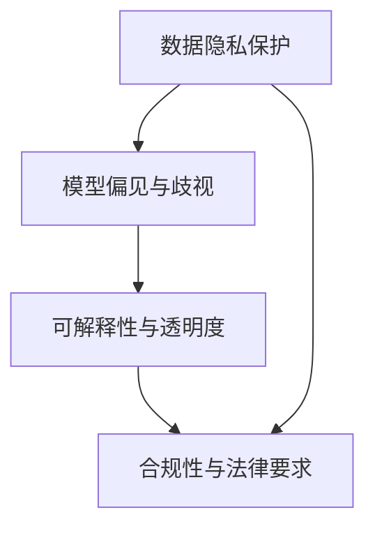

                 

# 大模型企业的数据安全策略

> 关键词：大模型,数据安全策略,企业应用,隐私保护,人工智能风险管理,数据治理,合规要求

## 1. 背景介绍

### 1.1 问题由来
随着人工智能技术的飞速发展，尤其是深度学习大模型的广泛应用，企业在利用大模型进行数据建模、智能推荐、自动化决策等任务时，面临了一系列数据安全问题。这些问题不仅包括传统的网络安全、数据泄露风险，还包括隐私保护、算法偏见、模型可解释性等新挑战。

大模型往往需要大量的数据进行训练，这些数据可能涉及个人隐私、商业机密等敏感信息。一旦数据泄露或被恶意利用，将给企业带来巨大损失。同时，大模型还可能因训练数据的偏见导致输出结果存在歧视，甚至被用于非法目的。因此，企业必须制定严密的数据安全策略，以确保大模型的可靠性和安全性。

### 1.2 问题核心关键点
为了有效应对大模型带来的数据安全风险，本文将重点探讨以下核心问题：

- **数据隐私保护**：如何在保护用户隐私的同时，最大化数据利用价值。
- **模型偏见与歧视**：如何识别和减少模型中潜在的偏见，避免算法歧视。
- **可解释性与透明度**：如何提高模型决策过程的可解释性，增强用户信任。
- **合规性与法律要求**：如何确保大模型应用遵守相关法律法规。

## 2. 核心概念与联系

### 2.1 核心概念概述

为更好地理解大模型企业在数据安全策略的实施过程中涉及的关键概念，本节将详细阐述这些核心概念及其相互之间的联系。

- **数据隐私保护**：指在数据收集、存储、传输和处理过程中，采取措施确保用户数据不被未经授权的第三方访问或利用，同时不损害数据利用价值。
- **模型偏见与歧视**：指模型在训练和应用过程中，因数据不均衡、特征选择不当等因素，导致模型输出对某些群体存在不公平待遇的现象。
- **可解释性与透明度**：指模型决策过程和输出结果的可解释程度，即用户能够理解模型的预测依据和内部逻辑。
- **合规性与法律要求**：指企业在应用大模型时，需要遵守的法律法规，包括但不限于数据保护法、隐私权法、反垄断法等。

这些概念之间的关系可以通过以下Mermaid流程图来展示：



这个流程图展示了大模型企业数据安全策略的核心概念及其相互之间的联系：

1. 数据隐私保护是基础，确保数据在各个环节的安全性。
2. 模型偏见与歧视是应用过程中的常见问题，需要通过特定策略加以解决。
3. 可解释性与透明度是增强用户信任和提高决策可靠性的关键。
4. 合规性与法律要求是企业必须遵守的标准和准则。

## 3. 核心算法原理 & 具体操作步骤

### 3.1 算法原理概述

大模型企业的数据安全策略，通常采用以下核心算法原理：

1. **差分隐私(Differential Privacy)**：在数据收集和处理过程中，通过添加噪声干扰，使得任何个体数据的泄露对模型输出没有明显影响，从而保护用户隐私。
2. **公平性约束**：在模型训练和评估中，通过引入公平性指标，如统计公平性、程序公平性等，减少模型中的偏见与歧视。
3. **可解释性增强**：通过模型蒸馏、特征重要性分析等方法，提高模型决策的可解释性，使用户能够理解模型的输出依据。
4. **法规遵从**：在模型设计和应用过程中，确保遵守相关法律法规，如GDPR、CCPA等，确保数据处理的合法合规。

### 3.2 算法步骤详解

基于上述算法原理，大模型企业的数据安全策略实施流程可以分为以下几个关键步骤：

**Step 1: 数据收集与预处理**

1. **数据收集策略**：制定明确的数据收集策略，确保数据来源合法、合规，避免非法收集和滥用。
2. **数据匿名化与伪匿名化**：采用数据脱敏、数据去标识化等技术，对数据进行匿名化处理，确保数据处理过程中的隐私保护。
3. **数据标准化与清洗**：对数据进行标准化和清洗，去除噪声和异常值，提升数据质量。

**Step 2: 数据存储与传输**

1. **安全存储**：采用加密存储、访问控制等措施，确保数据在存储过程中的安全性。
2. **安全传输**：使用HTTPS、VPN等安全传输协议，确保数据在传输过程中的机密性和完整性。
3. **数据备份与恢复**：定期备份数据，确保数据在意外情况下的快速恢复。

**Step 3: 模型训练与微调**

1. **隐私保护训练**：采用差分隐私技术，在模型训练过程中加入噪声干扰，确保模型训练的隐私性。
2. **偏见与歧视检测与修复**：引入公平性指标，如平衡精度、差异度等，检测和修复模型中的偏见与歧视。
3. **可解释性增强**：采用模型蒸馏、特征重要性分析等方法，提升模型的可解释性。

**Step 4: 模型部署与监控**

1. **模型部署**：将训练好的模型部署到生产环境，确保模型的可用性和稳定性。
2. **模型监控**：实时监控模型的运行状态和性能，及时发现和处理异常情况。
3. **隐私与合规监控**：确保模型应用过程中遵守相关法律法规，防止数据泄露和滥用。

### 3.3 算法优缺点

大模型企业的数据安全策略，具有以下优点：

1. **隐私保护**：通过差分隐私等技术，有效保护用户隐私，减少数据泄露风险。
2. **公平性**：通过公平性约束，减少模型偏见与歧视，提升模型输出质量。
3. **可解释性**：通过可解释性增强方法，提高模型决策的可理解性，增强用户信任。
4. **合规性**：通过严格遵守法律法规，确保数据处理的合法合规。

同时，该策略也存在一定的局限性：

1. **隐私保护成本高**：差分隐私等技术需要增加噪声干扰，可能影响模型性能。
2. **偏见与歧视检测复杂**：模型中的偏见与歧视检测和修复需要深入分析，技术难度较高。
3. **可解释性提升有限**：可解释性增强方法可能无法完全消除模型的复杂性，部分决策过程仍难以解释。
4. **法规遵从难度大**：不同国家和地区的法律法规不同，法规遵从需要持续更新和维护。

尽管存在这些局限性，但通过合理的策略设计和实施，可以最大限度地发挥数据安全策略的优势，减少潜在风险，确保大模型的可靠性和安全性。

### 3.4 算法应用领域

大模型企业的数据安全策略，适用于各种规模和类型的数据应用场景，例如：

- 金融风控：利用大模型进行信用评估、欺诈检测等任务，确保数据隐私和安全。
- 医疗健康：利用大模型进行疾病诊断、个性化治疗等任务，保护患者隐私和数据安全。
- 电子商务：利用大模型进行商品推荐、广告投放等任务，确保用户数据的安全和公平。
- 智能制造：利用大模型进行生产调度、质量检测等任务，确保企业数据的安全和合规。
- 社会治理：利用大模型进行舆情分析、事件预测等任务，确保公众数据的安全和隐私保护。

除了这些典型应用外，大模型在更多领域的应用中，都需要考虑数据安全策略的实施，以确保数据处理的合法合规和安全可靠。

## 4. 数学模型和公式 & 详细讲解 & 举例说明

### 4.1 数学模型构建

为了更好地理解大模型企业的数据安全策略，本节将详细讲解涉及的核心数学模型。

设大模型的输入数据为 $\mathbf{x}$，模型参数为 $\mathbf{\theta}$，训练数据集为 $D=\{(\mathbf{x}_i, y_i)\}_{i=1}^N$，其中 $y_i$ 为真实标签。定义模型在数据集 $D$ 上的经验风险为：

$$
\mathcal{L}(\mathbf{\theta}) = \frac{1}{N}\sum_{i=1}^N \ell(\mathbf{\theta}, \mathbf{x}_i, y_i)
$$

其中 $\ell(\mathbf{\theta}, \mathbf{x}_i, y_i)$ 为损失函数，用于衡量模型在单个数据样本上的预测误差。

在差分隐私约束下，模型训练的目标为：

$$
\min_{\mathbf{\theta}} \mathcal{L}(\mathbf{\theta}) + \frac{\epsilon}{N}\sum_{i=1}^N \mathcal{L}(\mathbf{\theta}, \mathbf{x}_i, y_i) + \frac{\delta}{N}\sum_{i=1}^N D_{\epsilon}(y_i, M_{\mathbf{\theta}}(\mathbf{x}_i))
$$

其中 $\epsilon$ 为隐私预算，$\delta$ 为差分隐私的偏差，$D_{\epsilon}$ 为差分隐私机制。

### 4.2 公式推导过程

以下我们以差分隐私为例，推导模型训练的详细公式。

假设模型 $M_{\mathbf{\theta}}$ 在输入 $\mathbf{x}$ 上的输出为 $\hat{y}=M_{\mathbf{\theta}}(\mathbf{x})$。在差分隐私约束下，模型的目标函数为：

$$
\min_{\mathbf{\theta}} \frac{1}{N}\sum_{i=1}^N \ell(\mathbf{\theta}, \mathbf{x}_i, y_i) + \frac{\epsilon}{N}\sum_{i=1}^N \mathcal{L}(\mathbf{\theta}, \mathbf{x}_i, y_i) + \frac{\delta}{N}\sum_{i=1}^N D_{\epsilon}(y_i, M_{\mathbf{\theta}}(\mathbf{x}_i))
$$

其中 $\ell(\mathbf{\theta}, \mathbf{x}_i, y_i)$ 为损失函数，$\mathcal{L}(\mathbf{\theta}, \mathbf{x}_i, y_i)$ 为差分隐私机制，$D_{\epsilon}$ 为差分隐私的偏差。

在上述目标函数中，第一项为经验风险最小化目标，第二项为隐私损失最小化目标，第三项为差分隐私的偏差控制。

### 4.3 案例分析与讲解

假设我们有一个分类问题，输入数据为 $x$，真实标签为 $y$，模型为二分类模型 $M_{\mathbf{\theta}}$，损失函数为交叉熵损失函数 $\ell(\mathbf{\theta}, x, y)$。在差分隐私约束下，模型的目标函数为：

$$
\min_{\mathbf{\theta}} \frac{1}{N}\sum_{i=1}^N \ell(\mathbf{\theta}, x_i, y_i) + \frac{\epsilon}{N}\sum_{i=1}^N \log(1+\exp(-\ell(\mathbf{\theta}, x_i, y_i))) + \frac{\delta}{N}\sum_{i=1}^N D_{\epsilon}(y_i, M_{\mathbf{\theta}}(x_i))
$$

其中 $\ell(\mathbf{\theta}, x_i, y_i)$ 为交叉熵损失函数，$\log(1+\exp(-\ell(\mathbf{\theta}, x_i, y_i)))$ 为隐私损失函数，$D_{\epsilon}$ 为差分隐私的偏差。

通过上述公式，可以看到，差分隐私在模型训练中加入了噪声干扰，使得模型训练的隐私性得到保证。同时，模型的训练损失和隐私损失均需要最小化，以平衡模型性能和隐私保护。

## 5. 项目实践：代码实例和详细解释说明

### 5.1 开发环境搭建

在进行大模型企业的数据安全策略实践前，我们需要准备好开发环境。以下是使用Python进行TensorFlow和TensorFlow Privacy开发的环境配置流程：

1. 安装Anaconda：从官网下载并安装Anaconda，用于创建独立的Python环境。

2. 创建并激活虚拟环境：
```bash
conda create -n tf-env python=3.8 
conda activate tf-env
```

3. 安装TensorFlow和TensorFlow Privacy：
```bash
conda install tensorflow tensorflow-privacy -c conda-forge
```

4. 安装各类工具包：
```bash
pip install numpy pandas scikit-learn matplotlib tqdm jupyter notebook ipython
```

完成上述步骤后，即可在`tf-env`环境中开始数据安全策略的实践。

### 5.2 源代码详细实现

这里我们以差分隐私为例，给出使用TensorFlow和TensorFlow Privacy进行模型训练的代码实现。

首先，定义差分隐私的噪声机制：

```python
from tensorflow_privacy.tf_privacy import privacy_mechanisms as tf_privacy

# 定义噪声机制，ε-差分隐私
mechanism = tf_privacy.DifferentialPrivacy(
    epsilon=1.0, 
    delta=0.1
)
```

然后，定义模型训练函数：

```python
import tensorflow as tf
from tensorflow.keras import layers

# 定义模型
model = tf.keras.Sequential([
    layers.Dense(64, activation='relu', input_shape=(784,)),
    layers.Dense(10)
])

# 定义损失函数
loss_fn = tf.keras.losses.CategoricalCrossentropy()

# 定义优化器
optimizer = tf.keras.optimizers.Adam()

# 定义训练函数
@tf.function
def train_step((features, labels):
    with tf.GradientTape() as tape:
        logits = model(features, training=True)
        loss_value = loss_fn(labels, logits)
    gradients = tape.gradient(loss_value, model.trainable_variables)
    optimizer.apply_gradients(zip(gradients, model.trainable_variables))

# 定义差分隐私训练函数
@tf.function
def train_with_privacy((features, labels):
    with tf.GradientTape() as tape:
        logits = model(features, training=True)
        loss_value = loss_fn(labels, logits)
    gradients = tape.gradient(loss_value, model.trainable_variables)
    noise_injector = tf_privacy.WhiteNoise(mechanism, features.shape[0])
    gradients = [mechanism.apply_noise_to_grads(g, noise_injector) for g in gradients]
    optimizer.apply_gradients(zip(gradients, model.trainable_variables))

# 定义训练函数
def train(model, features, labels, batch_size, epochs):
    for epoch in range(epochs):
        for batch in range(0, len(features), batch_size):
            features_batch = features[batch:batch+batch_size]
            labels_batch = labels[batch:batch+batch_size]
            train_with_privacy(features_batch, labels_batch)
```

在训练函数中，我们通过差分隐私机制为梯度添加噪声，从而确保模型训练的隐私性。

### 5.3 代码解读与分析

让我们再详细解读一下关键代码的实现细节：

**隐私机制定义**：
- `tf_privacy.DifferentialPrivacy`：定义差分隐私机制，传入参数 `epsilon` 和 `delta`，用于控制隐私预算和差分隐私的偏差。

**模型训练函数**：
- `train_step` 和 `train_with_privacy`：分别定义普通训练函数和差分隐私训练函数，使用不同的优化器（Adam和Adam+噪声）进行模型训练。

**训练函数**：
- `train`：定义完整的训练函数，通过循环迭代，进行差分隐私训练。

可以看到，差分隐私的实现需要修改原生的模型训练函数，通过添加噪声干扰，确保模型训练的隐私性。

## 6. 实际应用场景

### 6.1 金融风控

在金融风控领域，大模型被广泛用于信用评估、欺诈检测等任务。由于涉及到大量用户的敏感数据，如个人信息、交易记录等，数据隐私保护成为首要考虑的问题。通过差分隐私等技术，可以在保护用户隐私的前提下，获得有效的模型输出。

具体而言，金融机构可以在差分隐私约束下，对历史交易数据进行预处理和特征工程，使用差分隐私技术训练大模型，以识别异常交易和潜在欺诈行为。在模型应用过程中，通过合理的权限控制和访问策略，确保模型使用的数据和模型的输出仅限于特定的业务场景，进一步增强数据隐私保护。

### 6.2 医疗健康

医疗健康领域，大模型被应用于疾病诊断、个性化治疗等任务。由于患者数据涉及隐私和敏感信息，数据隐私保护尤为重要。通过差分隐私等技术，可以在模型训练和应用过程中保护患者数据的安全性。

例如，医疗机构可以收集大量患者的临床数据，使用差分隐私技术对数据进行匿名化和去标识化处理，训练大模型进行疾病诊断和治疗方案推荐。在模型应用过程中，通过严格的权限控制和数据访问策略，确保模型使用的数据仅限于特定的医疗场景，避免数据泄露和滥用。

### 6.3 电子商务

在电子商务领域，大模型被应用于商品推荐、广告投放等任务。由于涉及到大量用户的浏览、购买记录等敏感数据，数据隐私保护成为关键问题。通过差分隐私等技术，可以在保护用户隐私的前提下，获得有效的模型输出。

例如，电商平台可以收集用户的浏览记录和购买行为，使用差分隐私技术对数据进行匿名化和去标识化处理，训练大模型进行商品推荐和广告投放。在模型应用过程中，通过合理的权限控制和访问策略，确保模型使用的数据仅限于特定的业务场景，避免数据泄露和滥用。

### 6.4 未来应用展望

随着大模型技术的发展和普及，基于差分隐私等技术的数据安全策略将得到更广泛的应用。未来，随着技术的进步和应用场景的拓展，大模型在更多领域的应用中，将面临更复杂的数据隐私保护问题。例如，在智能制造、智慧城市、智能交通等领域，如何在大规模数据处理和应用中，保证数据隐私和安全，将是未来需要重点关注的问题。

## 7. 工具和资源推荐

### 7.1 学习资源推荐

为了帮助开发者系统掌握大模型企业的数据安全策略，这里推荐一些优质的学习资源：

1. **《差分隐私基础》**：这本书详细介绍了差分隐私的基本概念、算法实现和应用场景，是入门差分隐私的必备教材。
2. **《TensorFlow Privacy》**：这是TensorFlow Privacy库的官方文档，提供了丰富的差分隐私模型实现和应用案例，适合实战练习。
3. **Kaggle竞赛平台**：在Kaggle平台上，可以找到多个差分隐私相关的竞赛和教程，通过实战练习掌握差分隐私的实际应用。
4. **Coursera《数据隐私与法律》课程**：这是斯坦福大学开设的课程，详细讲解了数据隐私保护和法律法规，适合进一步深造学习。

通过对这些资源的学习实践，相信你一定能够快速掌握大模型企业的数据安全策略，并用于解决实际的数据隐私保护问题。

### 7.2 开发工具推荐

高效的开发离不开优秀的工具支持。以下是几款用于大模型企业数据安全策略开发的常用工具：

1. **TensorFlow**：由Google主导开发的深度学习框架，支持差分隐私等隐私保护技术，适合大模型训练和部署。
2. **TensorFlow Privacy**：TensorFlow的隐私保护库，提供了多种差分隐私机制和隐私保护技术，适合差分隐私的实现。
3. **PySyft**：Facebook开源的隐私保护框架，支持联邦学习和大模型隐私保护，适合大规模数据集的保护。
4. **AWS PrivacyGuard**：AWS提供的隐私保护服务，支持差分隐私、加密计算等隐私保护技术，适合云平台应用。
5. **Google Privacy & Ethics Toolkit**：Google提供的隐私保护工具包，包含差分隐私、公平性分析等隐私保护技术，适合企业应用。

合理利用这些工具，可以显著提升大模型企业的数据安全策略开发效率，保障数据隐私和安全。

### 7.3 相关论文推荐

大模型企业的数据安全策略，涉及多个前沿研究领域，以下是几篇奠基性的相关论文，推荐阅读：

1. **《The Privacy-Preserving Learning Paradigm: From Data to Model》**：这篇文章详细介绍了隐私保护的学习范式，包括差分隐私、联邦学习等技术，适合了解隐私保护的基本框架。
2. **《Adversarial Examples Are Not Misclassifications But Conceptual Failures》**：这篇文章提出了对抗性样本的概念，探讨了对抗性样本对隐私保护的影响，适合深入理解隐私保护的实际应用。
3. **《Fairness and Privacy in Data Mining》**：这篇文章讨论了如何在数据挖掘中保护隐私和公平性，适合了解隐私保护在实际应用中的挑战和解决方法。
4. **《Machine Learning with Differential Privacy: An Online and Convex Minimax Theory》**：这篇文章深入分析了差分隐私的数学理论和应用方法，适合进一步学习差分隐私的算法实现。

这些论文代表了大模型企业数据安全策略的研究前沿，通过学习这些前沿成果，可以帮助研究者把握学科前进方向，激发更多的创新灵感。

## 8. 总结：未来发展趋势与挑战

### 8.1 研究成果总结

本文对大模型企业的数据安全策略进行了全面系统的介绍。首先阐述了数据隐私保护、模型偏见与歧视、可解释性增强和合规性等核心问题，明确了企业在应用大模型时面临的主要挑战。其次，详细讲解了差分隐私等隐私保护技术和大模型训练中需要考虑的公平性约束和可解释性增强方法。最后，提供了基于TensorFlow和TensorFlow Privacy的差分隐私模型训练代码实例，帮助读者理解实际应用中的关键细节。

通过本文的系统梳理，可以看到，大模型企业在数据安全策略的实施过程中，需要考虑多方面的因素，并采用多种技术手段进行综合防护。只有从数据采集、存储、训练、应用等多个环节进行全面优化，才能最大限度地保障数据安全和隐私保护。

### 8.2 未来发展趋势

展望未来，大模型企业的数据安全策略将呈现以下几个发展趋势：

1. **隐私保护技术的融合**：随着隐私保护技术的不断进步，差分隐私、联邦学习、同态加密等技术将更加融合，形成一体化的隐私保护框架，提升数据保护的效果。
2. **公平性和透明度的提升**：通过引入更先进的公平性指标和可解释性技术，提高模型的公平性和透明度，增强用户信任和模型的可靠度。
3. **法律法规的动态适应**：随着数据隐私法律法规的不断更新和变化，企业需要持续跟踪和适应新的法律法规要求，确保数据处理的合法合规。
4. **跨领域应用的扩展**：差分隐私等隐私保护技术将在更多领域得到应用，如智能制造、智慧城市、社会治理等，为数据驱动的行业发展提供保障。
5. **隐私计算和隐私治理**：隐私计算和隐私治理技术将得到广泛应用，帮助企业在保护用户隐私的同时，最大化数据利用价值。

以上趋势凸显了大模型企业数据安全策略的广阔前景。这些方向的探索发展，必将进一步提升大模型应用的安全性和可靠性，保障数据隐私和用户权益。

### 8.3 面临的挑战

尽管大模型企业的数据安全策略取得了不少进展，但在迈向更加智能化、普适化应用的过程中，仍面临诸多挑战：

1. **隐私保护技术的复杂性**：差分隐私等隐私保护技术虽然能有效保护数据隐私，但其计算复杂度较高，实现难度较大。如何简化技术实现，提高效率，仍需进一步研究。
2. **公平性约束的难度**：模型偏见与歧视的检测和修复需要深入分析，技术难度较高。如何在模型训练和应用过程中有效消除偏见，仍需进一步探索。
3. **可解释性增强的局限性**：可解释性增强方法可能无法完全消除模型的复杂性，部分决策过程仍难以解释。如何提高模型的可解释性，增强用户信任，仍需进一步研究。
4. **法律法规的动态变化**：不同国家和地区的法律法规不同，企业需要持续跟踪和适应新的法律法规要求，确保数据处理的合法合规。
5. **技术实现的成本**：隐私保护和公平性约束的实现需要增加额外的计算资源和时间成本，如何在不牺牲模型性能的前提下，降低技术实现成本，仍需进一步优化。

尽管存在这些挑战，但通过不断的技术创新和实践优化，相信大模型企业的数据安全策略能够克服这些困难，更好地保障数据隐私和安全。

### 8.4 研究展望

面向未来，大模型企业的数据安全策略需要在以下几个方面寻求新的突破：

1. **跨学科的合作**：隐私保护和公平性约束需要跨学科的合作，结合伦理学、法律学、计算机科学等多领域知识，共同解决复杂的数据安全问题。
2. **隐私保护与业务融合**：隐私保护技术需要在业务应用中得到广泛应用，通过隐私计算、隐私治理等手段，实现隐私保护与业务发展的双赢。
3. **隐私保护的自动化**：探索自动化隐私保护技术，通过自动检测和修复偏见，减少人工干预，提高隐私保护的效果和效率。
4. **隐私保护的可解释性**：在隐私保护过程中，如何提高隐私保护的可解释性，让用户理解隐私保护的方法和目的，增强用户信任。
5. **隐私保护的动态调整**：在模型应用过程中，如何根据用户反馈和法律法规的变化，动态调整隐私保护策略，确保数据隐私的动态保护。

这些研究方向将引领大模型企业的数据安全策略进入新的阶段，为构建安全、可靠、可解释、可控的智能系统铺平道路。面向未来，大模型企业需要在隐私保护、公平性约束、可解释性增强等多个方面持续创新，才能更好地保障数据隐私和安全，推动人工智能技术的发展和应用。

## 9. 附录：常见问题与解答

**Q1：大模型企业的数据安全策略是否适用于所有应用场景？**

A: 大模型企业的数据安全策略适用于大多数涉及数据应用的场景，特别是数据敏感性较高的领域。对于数据使用和处理不涉及隐私或安全风险的场景，企业可以根据实际情况简化或省略部分安全措施。

**Q2：如何评估隐私保护措施的效果？**

A: 隐私保护效果的评估可以从以下几个方面进行：
1. **隐私预算**：通过计算差分隐私的ε和δ参数，评估隐私预算的合理性。
2. **模型性能**：在差分隐私约束下，评估模型训练和应用的效果，确保隐私保护不会显著降低模型性能。
3. **数据泄露风险**：通过模拟攻击和威胁模型，评估隐私保护机制的抵抗能力，确保数据安全。
4. **用户满意度**：通过用户调查和反馈，评估隐私保护措施的用户接受度和满意度。

**Q3：如何平衡隐私保护和模型性能？**

A: 隐私保护和模型性能的平衡通常需要通过多次实验和调参进行。以下是一些常见的平衡策略：
1. **调整隐私预算**：适当调整差分隐私的ε和δ参数，在隐私保护和模型性能之间找到最佳平衡点。
2. **优化模型设计**：通过特征选择和模型优化，减少对数据的依赖，提升模型的泛化性能。
3. **分阶段隐私保护**：在模型训练和应用的不同阶段，采取不同的隐私保护策略，根据场景和需求动态调整隐私保护级别。
4. **隐私计算技术**：引入隐私计算技术，如差分隐私、同态加密等，提升隐私保护的效率和效果。

**Q4：在数据安全策略实施过程中，如何处理隐私与合规的冲突？**

A: 隐私与合规的冲突需要通过多方面协调和优化解决：
1. **合规优先**：在确保遵守法律法规的前提下，尽可能优化隐私保护措施。
2. **数据最小化**：在遵守合规要求的前提下，尽量减少数据的收集和使用，降低隐私风险。
3. **透明与信任**：在合规的前提下，通过透明的隐私保护措施，增强用户和监管机构的信任。
4. **法律咨询**：在处理隐私与合规冲突时，寻求法律专家的咨询和指导，确保合规性和隐私保护措施的合法性。

**Q5：如何处理隐私保护技术实现中的计算成本问题？**

A: 隐私保护技术的计算成本问题需要通过技术优化和资源调度解决：
1. **优化算法实现**：通过算法优化和代码改进，减少隐私保护技术实现的计算成本。
2. **分布式计算**：通过分布式计算和并行处理，提升隐私保护技术的计算效率。
3. **硬件加速**：通过引入GPU、TPU等硬件加速器，提升隐私保护技术的计算性能。
4. **资源共享**：通过资源共享和优化调度，合理利用计算资源，降低隐私保护技术的计算成本。

这些问题的解答，希望能帮助企业在实施数据安全策略时，更好地平衡隐私保护和模型性能，确保合规性的同时，保障数据隐私和安全。

---

作者：禅与计算机程序设计艺术 / Zen and the Art of Computer Programming

