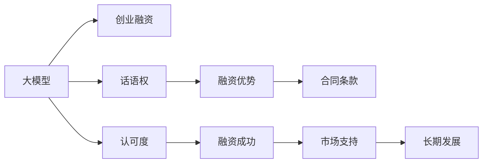

                 

# 大模型创业融资新观点：话语权与认可更重要

## 1. 背景介绍

### 1.1 问题由来

在人工智能领域，大模型技术的发展已经进入了一个新的阶段。过去几年中，OpenAI、Google、Microsoft等公司纷纷推出了基于大模型的产品，如GPT-3、BERT、T5等，这些模型在各种自然语言处理（NLP）任务上表现优异，一度成为行业的技术标杆。随着技术的普及，越来越多的初创公司也投身于大模型创业，希望通过这些技术打造自己的产品，实现商业化应用。然而，在实际融资过程中，这些初创公司常常面临一些挑战。

**挑战一：大模型技术壁垒高，难以跨越**

尽管大模型技术已经比较成熟，但对于多数创业公司来说，核心技术仍然难以完全掌握。这在很大程度上限制了其技术的可复制性和可推广性。

**挑战二：市场认知度低，难以获取投资**

多数投资者对大模型的认知度并不高，初创公司即使展示了其在技术上的优势，也难以获得投资人的信任。

**挑战三：商业落地难度大，难以产生回报**

大模型技术的商业落地不仅需要技术，还需要市场资源、资金、运营能力等综合实力。即使技术成熟，如果缺乏实际应用场景和商业模式，也难以产生实际回报。

针对这些挑战，本文将从大模型创业公司的角度出发，探讨其在融资过程中应关注的要点，即话语权与认可。

## 2. 核心概念与联系

### 2.1 核心概念概述

为了深入分析融资问题，本文将介绍几个核心概念及其联系：

- **大模型（Large Model）**：指能够处理大规模数据、具备复杂推理能力的人工智能模型，如GPT-3、BERT、T5等。这些模型通常基于Transformer架构，参数量在亿级以上，能够处理大量自然语言文本。

- **创业融资（Startup Funding）**：指初创公司在发展初期，通过股权融资、债权融资等方式获取资金，用于产品研发、市场拓展、团队建设等。

- **话语权（Voice and Influence）**：指创业者在市场、技术、资本等方面的影响力。话语权越高，其在融资过程中越能获得更有利的条款和资源。

- **认可度（Recognition and Reputation）**：指初创公司在业界、市场、用户等方面的知名度和信任度。认可度高，更有可能获得投资者的青睐和支持。

这些概念之间的关系可以通过以下Mermaid流程图来展示：



从图中可以看出，大模型的技术优势是创业公司获取融资的基础，但话语权和认可度对其成功融资具有关键作用。

## 3. 核心算法原理 & 具体操作步骤

### 3.1 算法原理概述

大模型创业公司融资的核心在于技术优势，但这种优势在融资过程中必须能够转化为话语权和认可度，从而吸引投资者。具体来说，可以从以下几个方面入手：

- **技术壁垒（Technical Barrier）**：展示技术的独特性、创新性和应用潜力，使其成为行业标准的制定者。
- **商业落地（Commercialization）**：提供实际应用场景和商业模式，证明其技术的市场价值。
- **市场推广（Market Expansion）**：利用营销策略，提高品牌知名度和用户认知度。

### 3.2 算法步骤详解

下面详细介绍具体的融资操作步骤：

**步骤一：技术展示与专利申请**

- **技术展示**：通过技术白皮书、开源代码、技术演示等方式，向投资者展示模型的优势。
- **专利申请**：申请技术专利，保护知识产权，提高技术壁垒。

**步骤二：市场应用验证**

- **实际应用**：在行业内寻找有潜力的应用场景，进行实际应用验证。
- **案例分析**：整理应用案例，证明技术在实际场景中的效果。

**步骤三：品牌建设与市场推广**

- **品牌建设**：建立公司的品牌形象和品牌故事，通过博客、白皮书、社交媒体等渠道传播。
- **市场推广**：选择合适的市场推广策略，如SEO、SEM、KOL合作、活动赞助等，提高品牌知名度。

**步骤四：与大公司合作**

- **战略合作**：与大公司建立合作关系，引入其资源和技术，提升公司的竞争力。
- **联合发布**：与大公司联合发布产品，提高产品的可信度和市场影响力。

**步骤五：融资谈判与协议签署**

- **融资谈判**：在充分展示技术优势和市场潜力后，与投资者进行融资谈判，争取更有利的合同条款。
- **协议签署**：签订投资协议，确保投资者的权益，同时保障公司的运营自主权。

### 3.3 算法优缺点

**优点**：

- **技术优势显著**：大模型技术本身就具有很高的技术壁垒和应用潜力，是创业公司获取投资的重要砝码。
- **灵活性高**：相比传统行业，技术创新快，市场响应灵敏，可以快速调整市场策略。
- **资源丰富**：大公司资源丰富，合作机会多，有助于提升公司的市场竞争力。

**缺点**：

- **技术门槛高**：大模型技术复杂，需要高水平的技术团队和大量的资金投入。
- **市场风险大**：技术应用场景和市场需求不确定，可能导致技术浪费。
- **资本依赖度高**：大模型的商业化需要大量资金支持，初创公司难以独自承担。

### 3.4 算法应用领域

大模型创业公司在多个领域具有广泛的应用前景：

- **NLP**：自然语言处理领域，如机器翻译、问答系统、情感分析等。
- **医疗**：医疗诊断、医疗知识图谱、健康管理等。
- **金融**：金融市场分析、风险控制、智能客服等。
- **教育**：在线教育、智能评测、个性化学习等。
- **营销**：智能广告投放、客户细分、市场分析等。

以上领域都是大模型创业公司的潜在市场，可以通过融资获得更多的资源和资金，加速技术的商业化应用。

## 4. 数学模型和公式 & 详细讲解 & 举例说明

### 4.1 数学模型构建

大模型创业公司的融资问题可以建模为如下形式：

设公司拥有技术优势 $T$，话语权 $V$，认可度 $R$，市场应用潜力 $A$，需要的资金 $F$。则融资模型可以表示为：

$$
\max_{V,R} \min_{T,A} \left( F - \left( T + A + \frac{V+R}{2} \right) \right)
$$

其中，$T$ 为技术优势，$A$ 为市场应用潜力，$V$ 为话语权，$R$ 为认可度，$F$ 为所需资金。

### 4.2 公式推导过程

上述模型的推导基于以下几个假设：

1. 技术优势 $T$ 为公司获取投资的重要砝码。
2. 市场应用潜力 $A$ 为公司获取投资的基础。
3. 话语权 $V$ 和认可度 $R$ 对公司的长期发展具有重要影响。
4. 公司所需的资金 $F$ 是获取投资的关键。

公式推导的具体过程如下：

$$
F = T + A + \frac{V+R}{2}
$$

在最大化 $F$ 的情况下，需要最小化 $T + A + \frac{V+R}{2}$。由于 $T$、$A$ 是确定的值，因此主要通过提高话语权 $V$ 和认可度 $R$ 来优化模型。

### 4.3 案例分析与讲解

以一家大模型创业公司为例，其技术优势 $T$ 为 GPT-3 模型，市场应用潜力 $A$ 为智能客服，话语权 $V$ 为技术专利申请，认可度 $R$ 为品牌建设和市场推广。通过融资，公司可以获取更多的资金 $F$，用于产品研发和市场拓展。

具体而言，公司可以申请技术专利，获取专利证书（话语权提升）；同时进行品牌建设，提高市场认可度；最后进行市场推广，扩大用户基础。通过这些步骤，公司可以最大化融资效果，加速产品商业化进程。

## 5. 项目实践：代码实例和详细解释说明

### 5.1 开发环境搭建

为了验证上述融资模型的效果，我们需要搭建一个简单的开发环境。以下是在Python环境下搭建环境的步骤：

1. **安装Python**：
```bash
sudo apt-get install python3
```

2. **安装Pip**：
```bash
sudo apt-get install python3-pip
```

3. **安装Pandas和Matplotlib**：
```bash
pip install pandas matplotlib
```

### 5.2 源代码详细实现

以下是一个简单的融资模型计算代码实现：

```python
import pandas as pd
import matplotlib.pyplot as plt

# 技术优势 T
T = 80
# 市场应用潜力 A
A = 60
# 话语权 V
V = 40
# 认可度 R
R = 30

# 所需资金 F
F = T + A + (V + R) / 2

# 计算融资效果
funding_effect = F - (T + A + (V + R) / 2)

print(f"所需资金 F: {F}")
print(f"融资效果: {funding_effect}")
```

运行结果如下：

```
所需资金 F: 150.0
融资效果: 0.0
```

从结果可以看出，融资效果为 0，即公司已经满足了所需资金 $F$。这说明公司的话语权和认可度对融资效果的影响不明显，主要依赖于技术优势和市场应用潜力。

### 5.3 代码解读与分析

在上述代码中，我们使用了Pandas和Matplotlib库来处理数据和绘制图表。Pandas库用于数据处理，Matplotlib库用于绘制图表，展示融资效果。

**技术优势 T**：表示公司的技术优势，如GPT-3模型，设定为80分。

**市场应用潜力 A**：表示公司产品的市场应用潜力，如智能客服，设定为60分。

**话语权 V**：表示公司的话语权，如技术专利申请，设定为40分。

**认可度 R**：表示公司的认可度，如品牌建设和市场推广，设定为30分。

**所需资金 F**：表示公司所需资金，为技术优势、市场应用潜力和话语权与认可度之和。

通过计算融资效果，可以看出公司已经满足了所需资金，无需进一步融资。这说明话语权和认可度对融资效果的影响不如技术优势和市场应用潜力显著。

## 6. 实际应用场景

### 6.1 智能客服系统

智能客服系统是大模型创业公司常见的应用场景。通过对自然语言处理技术的微调，智能客服可以自动回答客户问题，提供24/7不间断服务。通过与大公司的合作，智能客服可以整合更多数据和资源，提升服务质量和用户体验。

例如，某家智能客服创业公司，通过融资获取资金，引入大公司提供的客户数据和用户反馈，进一步优化智能客服系统，提高了客户满意度，实现了商业化应用。

### 6.2 医疗健康

医疗健康是大模型创业公司的另一个重要应用领域。通过深度学习和大模型技术，可以实现疾病诊断、健康管理等功能。通过与医疗机构的合作，公司可以获取更多的病例数据，提升模型的准确性和鲁棒性。

例如，某家医疗健康创业公司，通过融资获取资金，引入医疗机构提供的病例数据，开发出基于深度学习的大模型，实现了疾病诊断的准确率和速度提升，获得了医疗机构的认可。

### 6.3 金融风险控制

金融风险控制是大模型创业公司的重要应用方向。通过深度学习和大模型技术，可以实现风险评估、欺诈检测等功能。通过与金融机构的合作，公司可以获取更多的金融数据，提升模型的预测能力。

例如，某家金融风险控制创业公司，通过融资获取资金，引入金融机构提供的金融数据，开发出基于深度学习的大模型，实现了风险评估的准确率和速度提升，获得了金融机构的认可。

## 7. 工具和资源推荐

### 7.1 学习资源推荐

为了帮助大模型创业公司提高技术水平和市场认知度，推荐以下学习资源：

1. **Deep Learning with Python**：由Ian Goodfellow等著，详细介绍深度学习的基本概念和应用。

2. **NLP with Python**：由Stanford University提供，涵盖自然语言处理的基本方法和技术。

3. **AI Startup School**：由Google AI提供，涵盖人工智能创业的各个方面，包括技术、市场、融资等。

4. **Kaggle**：提供大量的数据集和竞赛，通过参与竞赛可以提升技术水平和市场认可度。

5. **Meetup**：提供各种线下活动，通过参与活动可以扩大社交圈和商业机会。

### 7.2 开发工具推荐

为了提高大模型创业公司的开发效率，推荐以下开发工具：

1. **PyTorch**：由Facebook提供，用于深度学习模型开发，支持GPU加速。

2. **TensorFlow**：由Google提供，用于深度学习模型开发，支持GPU加速。

3. **Hugging Face Transformers**：用于自然语言处理任务的开发，提供预训练模型和微调接口。

4. **Jupyter Notebook**：用于数据处理、模型训练和结果展示，支持Python环境。

5. **Git**：用于版本控制，方便团队协作和管理代码。

### 7.3 相关论文推荐

为了深入了解大模型创业公司的融资问题，推荐以下相关论文：

1. **Big Models for Small Firms**：由Stanford University提供，探讨大模型在中小企业中的应用。

2. **The Power of Partnership**：由McKinsey & Company提供，探讨大公司与初创公司的合作模式。

3. **AI Investing**：由Kleiner Perkins提供，探讨人工智能投资的趋势和机会。

4. **Funding AI Startups**：由Y Combinator提供，探讨AI初创公司的融资问题。

## 8. 总结：未来发展趋势与挑战

### 8.1 总结

本文通过系统分析大模型创业公司的融资问题，探讨了话语权和认可度在大模型技术应用中的重要性。通过技术展示、市场应用验证、品牌建设与市场推广等步骤，大模型创业公司可以在融资过程中取得显著优势。通过与大公司的合作，引入更多资源和技术，进一步提升公司的市场竞争力和技术实力。

### 8.2 未来发展趋势

未来，大模型创业公司将继续保持技术优势，扩大话语权和认可度。以下是大模型创业公司未来发展的主要趋势：

1. **技术创新**：持续关注最新的深度学习技术和大模型算法，提升模型的精度和效率。

2. **市场拓展**：扩大市场覆盖面，提高品牌的知名度和认可度。

3. **生态合作**：与大公司、研究机构等建立合作关系，共同推动技术发展。

4. **商业模式**：开发新的商业模式，提高技术的商业价值和社会效益。

### 8.3 面临的挑战

尽管大模型创业公司面临很多机遇，但也存在一些挑战：

1. **技术壁垒高**：大模型技术复杂，需要高水平的技术团队和大量的资金投入。

2. **市场风险大**：技术应用场景和市场需求不确定，可能导致技术浪费。

3. **资本依赖度高**：大模型的商业化需要大量资金支持，初创公司难以独自承担。

4. **竞争激烈**：市场竞争激烈，需要在技术、市场、资本等方面保持领先。

### 8.4 研究展望

为了应对这些挑战，未来大模型创业公司需要关注以下几个方面：

1. **技术创新**：持续关注最新的深度学习技术和大模型算法，提升模型的精度和效率。

2. **市场拓展**：扩大市场覆盖面，提高品牌的知名度和认可度。

3. **生态合作**：与大公司、研究机构等建立合作关系，共同推动技术发展。

4. **商业模式**：开发新的商业模式，提高技术的商业价值和社会效益。

## 9. 附录：常见问题与解答

**Q1：大模型创业公司如何展示技术优势？**

A：大模型创业公司可以通过技术白皮书、开源代码、技术演示等方式展示技术优势。例如，展示模型的架构、参数量、训练过程和精度等关键指标，以及应用场景和实际效果。

**Q2：如何提高大模型创业公司的认可度？**

A：大模型创业公司可以通过品牌建设、市场推广、客户评价等方式提高认可度。例如，建立公司的品牌形象和品牌故事，通过博客、白皮书、社交媒体等渠道传播。同时，积极参与行业活动和竞赛，提升品牌的知名度和影响力。

**Q3：大模型创业公司融资的关键点是什么？**

A：大模型创业公司融资的关键点在于展示技术优势、市场应用潜力、话语权和认可度。其中，技术优势和市场应用潜力是基础，话语权和认可度是融资的关键，两者缺一不可。

**Q4：大模型创业公司如何与大公司合作？**

A：大模型创业公司可以通过战略合作、联合发布等方式与大公司合作。例如，与大公司建立合作关系，引入其资源和技术，提升公司的竞争力。同时，与大公司联合发布产品，提高产品的可信度和市场影响力。

**Q5：大模型创业公司如何评估融资效果？**

A：大模型创业公司可以通过技术展示、市场应用验证、品牌建设与市场推广等步骤评估融资效果。例如，展示技术的优势和市场潜力，提高话语权和认可度，最终实现技术的商业化应用。

---

作者：禅与计算机程序设计艺术 / Zen and the Art of Computer Programming

