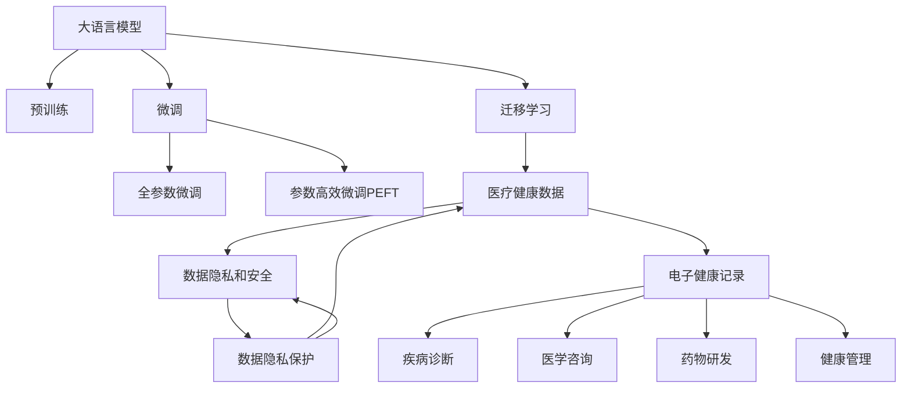

                 

# 大模型在医疗健康领域的潜力

> 关键词：大语言模型, 自然语言处理, 医疗健康, 医疗咨询, 疾病诊断, 药物研发, 健康管理, 数据隐私

## 1. 背景介绍

### 1.1 问题由来
随着人工智能技术的迅猛发展，大语言模型（Large Language Models, LLMs）在自然语言处理（Natural Language Processing, NLP）领域取得了显著的进展。这些模型通过在大规模无标签文本数据上进行预训练，学习到了丰富的语言知识，具备了强大的自然语言理解和生成能力。

在医疗健康领域，传统的电子病历、医疗文档等文本数据量庞大，且结构化程度较低。这些数据为自然语言处理技术提供了丰富的应用场景。然而，受限于数据获取和处理成本，传统NLP方法在医疗健康领域的落地应用一直受限。

大语言模型为医疗健康领域带来了新的解决方案。通过微调（Fine-tuning）等技术手段，大模型能够迅速适应特定的医疗场景，实现疾病诊断、医学咨询、药物研发等任务，显著提升医疗服务的效率和质量。

### 1.2 问题核心关键点
大语言模型在医疗健康领域的应用潜力主要体现在以下几个方面：

- 高语义理解能力：大模型能够理解复杂的自然语言描述，准确提取关键信息。
- 泛化能力强：在大规模语料上进行预训练，使其具备较强的泛化能力，可以适应不同的医疗场景。
- 易于扩展：模型参数可扩展性强，可以通过微调适应特定的医疗任务。
- 数据需求低：仅需少量标注数据即可进行微调，降低了数据获取和处理的成本。
- 应用场景广：涵盖疾病诊断、医学咨询、药物研发、健康管理等多个子领域。

本文将系统地介绍大语言模型在医疗健康领域的应用潜力，详细阐述其核心算法原理，并通过实际案例展示其应用效果。

## 2. 核心概念与联系

### 2.1 核心概念概述

为更好地理解大语言模型在医疗健康领域的应用，本节将介绍几个密切相关的核心概念：

- 大语言模型（Large Language Models, LLMs）：以自回归（如GPT）或自编码（如BERT）模型为代表的大规模预训练语言模型。通过在大规模无标签文本语料上进行预训练，学习到了丰富的语言知识，具备了强大的自然语言理解和生成能力。

- 预训练（Pre-training）：指在大规模无标签文本语料上，通过自监督学习任务训练通用语言模型的过程。常见的预训练任务包括言语建模、遮挡语言模型等。

- 微调（Fine-tuning）：指在预训练模型的基础上，使用特定任务的有标签数据，通过有监督地训练来优化模型在特定任务上的性能。

- 迁移学习（Transfer Learning）：指将一个领域学习到的知识，迁移应用到另一个不同但相关的领域的学习范式。大模型的预训练-微调过程即是一种典型的迁移学习方式。

- 医疗健康数据（Healthcare Data）：包括电子病历、医学文档、临床试验数据等。这些数据具有结构化程度低、信息密度高、隐私性强等特点。

- 数据隐私和安全（Data Privacy and Security）：医疗健康数据往往包含敏感信息，确保数据隐私和安全是医疗应用中的重要问题。

- 电子健康记录（Electronic Health Records, EHRs）：医院和诊所中存储患者健康信息的电子系统。

这些核心概念之间的逻辑关系可以通过以下Mermaid流程图来展示：



这个流程图展示了大语言模型在医疗健康领域的核心概念及其相互关系：

1. 大语言模型通过预训练获得基础能力。
2. 微调是对预训练模型进行任务特定的优化，可以分为全参数微调和参数高效微调（PEFT）。
3. 迁移学习是连接预训练模型与医疗健康任务的桥梁，可以通过微调或提示学习来实现。
4. 医疗健康数据为模型提供了丰富的训练样本。
5. 数据隐私和安全是医疗应用中的重要考量。
6. 电子健康记录是医疗数据的重要形式。
7. 微调模型可以应用于疾病诊断、医学咨询、药物研发、健康管理等多个医疗任务。

这些概念共同构成了大语言模型在医疗健康领域的应用框架，使得模型能够在各种医疗场景下发挥强大的作用。

## 3. 核心算法原理 & 具体操作步骤
### 3.1 算法原理概述

大语言模型在医疗健康领域的应用，本质上是一个有监督的细粒度迁移学习过程。其核心思想是：将预训练的大语言模型视作一个强大的"特征提取器"，通过在特定医疗任务的数据上进行有监督地训练，优化模型在特定任务上的性能。

形式化地，假设预训练模型为 $M_{\theta}$，其中 $\theta$ 为预训练得到的模型参数。给定医疗健康任务 $T$ 的标注数据集 $D=\{(x_i, y_i)\}_{i=1}^N$，微调的目标是找到新的模型参数 $\hat{\theta}$，使得：

$$
\hat{\theta}=\mathop{\arg\min}_{\theta} \mathcal{L}(M_{\theta},D)
$$

其中 $\mathcal{L}$ 为针对任务 $T$ 设计的损失函数，用于衡量模型预测输出与真实标签之间的差异。常见的损失函数包括交叉熵损失、均方误差损失等。

通过梯度下降等优化算法，微调过程不断更新模型参数 $\theta$，最小化损失函数 $\mathcal{L}$，使得模型输出逼近真实标签。由于 $\theta$ 已经通过预训练获得了较好的初始化，因此即便在医疗数据集上数据量较小的情况下，也能较快收敛到理想的模型参数 $\hat{\theta}$。

### 3.2 算法步骤详解

大语言模型在医疗健康领域的微调一般包括以下几个关键步骤：

**Step 1: 准备预训练模型和数据集**
- 选择合适的预训练语言模型 $M_{\theta}$ 作为初始化参数，如 BERT、GPT 等。
- 准备医疗健康任务 $T$ 的标注数据集 $D$，划分为训练集、验证集和测试集。一般要求标注数据与预训练数据的分布不要差异过大。

**Step 2: 添加任务适配层**
- 根据任务类型，在预训练模型顶层设计合适的输出层和损失函数。
- 对于分类任务，通常在顶层添加线性分类器和交叉熵损失函数。
- 对于生成任务，通常使用语言模型的解码器输出概率分布，并以负对数似然为损失函数。

**Step 3: 设置微调超参数**
- 选择合适的优化算法及其参数，如 AdamW、SGD 等，设置学习率、批大小、迭代轮数等。
- 设置正则化技术及强度，包括权重衰减、Dropout、Early Stopping 等。
- 确定冻结预训练参数的策略，如仅微调顶层，或全部参数都参与微调。

**Step 4: 执行梯度训练**
- 将训练集数据分批次输入模型，前向传播计算损失函数。
- 反向传播计算参数梯度，根据设定的优化算法和学习率更新模型参数。
- 周期性在验证集上评估模型性能，根据性能指标决定是否触发 Early Stopping。
- 重复上述步骤直到满足预设的迭代轮数或 Early Stopping 条件。

**Step 5: 测试和部署**
- 在测试集上评估微调后模型 $M_{\hat{\theta}}$ 的性能，对比微调前后的精度提升。
- 使用微调后的模型对新样本进行推理预测，集成到实际的应用系统中。
- 持续收集新的数据，定期重新微调模型，以适应数据分布的变化。

以上是基于监督学习的大语言模型微调在医疗健康领域的通用流程。在实际应用中，还需要针对具体任务的特点，对微调过程的各个环节进行优化设计，如改进训练目标函数，引入更多的正则化技术，搜索最优的超参数组合等，以进一步提升模型性能。

### 3.3 算法优缺点

基于监督学习的大语言模型微调在医疗健康领域具有以下优点：

- 快速适应：仅需少量标注数据，即可对预训练模型进行快速适配，获得较大的性能提升。
- 泛化性强：利用大规模预训练学习到的知识，可以在不同医疗场景中取得较优的表现。
- 扩展性好：通过微调，模型的参数和结构可以动态调整，适应新的医疗任务。
- 数据需求低：利用参数高效微调技术，在固定大部分预训练参数的情况下，仍可取得不错的提升。
- 应用场景广：涵盖疾病诊断、医学咨询、药物研发、健康管理等多个医疗任务。

同时，该方法也存在一定的局限性：

- 依赖标注数据：微调的效果很大程度上取决于标注数据的质量和数量，获取高质量标注数据的成本较高。
- 解释性不足：微调模型的决策过程通常缺乏可解释性，难以对其推理逻辑进行分析和调试。
- 隐私风险：医疗数据包含敏感信息，如何保护数据隐私和安全是一大挑战。

尽管存在这些局限性，但就目前而言，基于监督学习的微调方法仍是大语言模型在医疗健康领域应用的主流范式。未来相关研究的重点在于如何进一步降低微调对标注数据的依赖，提高模型的少样本学习和跨领域迁移能力，同时兼顾可解释性和数据隐私等问题。

### 3.4 算法应用领域

大语言模型在医疗健康领域的应用已经得到了广泛的研究和应用，涵盖以下几个主要方面：

- **疾病诊断**：利用大语言模型对患者描述的疾病症状进行理解，辅助医生进行诊断。例如，可以通过训练模型对特定疾病的描述进行分类，从而预测该疾病的可能性。

- **医学咨询**：提供基于自然语言处理的医疗咨询系统，回答患者的常见问题，如疾病的预防、治疗方案等。通过训练模型，使其能够理解和生成医学相关的回答。

- **药物研发**：利用大语言模型对药物描述进行理解和生成，辅助药物研发过程中的药物筛选、药物设计和临床试验分析。例如，可以通过训练模型来识别具有特定药理活性的化合物，或生成新的药物候选分子。

- **健康管理**：通过大语言模型对患者的生活方式、健康记录等进行分析和理解，提供个性化的健康管理建议。例如，可以利用模型对患者的饮食、运动、睡眠等行为进行分析，给出改进建议。

除了上述这些经典应用外，大语言模型还被创新性地应用于医疗文档的生成、医疗知识图谱的构建、医疗信息的检索等多个场景，为医疗健康领域的数字化转型提供了新的动力。

## 4. 数学模型和公式 & 详细讲解 & 举例说明
### 4.1 数学模型构建

本节将使用数学语言对基于监督学习的大语言模型微调在医疗健康领域的过程进行更加严格的刻画。

记预训练语言模型为 $M_{\theta}$，其中 $\theta$ 为预训练得到的模型参数。假设医疗健康任务 $T$ 的训练集为 $D=\{(x_i, y_i)\}_{i=1}^N$，其中 $x_i$ 为输入的描述或病历，$y_i$ 为对应的标签（如疾病名称、症状描述等）。

定义模型 $M_{\theta}$ 在数据样本 $(x,y)$ 上的损失函数为 $\ell(M_{\theta}(x),y)$，则在数据集 $D$ 上的经验风险为：

$$
\mathcal{L}(\theta) = \frac{1}{N} \sum_{i=1}^N \ell(M_{\theta}(x_i),y_i)
$$

微调的优化目标是最小化经验风险，即找到最优参数：

$$
\theta^* = \mathop{\arg\min}_{\theta} \mathcal{L}(\theta)
$$

在实践中，我们通常使用基于梯度的优化算法（如SGD、Adam等）来近似求解上述最优化问题。设 $\eta$ 为学习率，$\lambda$ 为正则化系数，则参数的更新公式为：

$$
\theta \leftarrow \theta - \eta \nabla_{\theta}\mathcal{L}(\theta) - \eta\lambda\theta
$$

其中 $\nabla_{\theta}\mathcal{L}(\theta)$ 为损失函数对参数 $\theta$ 的梯度，可通过反向传播算法高效计算。

### 4.2 公式推导过程

以下我们以疾病诊断任务为例，推导交叉熵损失函数及其梯度的计算公式。

假设模型 $M_{\theta}$ 在输入 $x$ 上的输出为 $\hat{y}=M_{\theta}(x) \in [0,1]$，表示样本属于某种疾病的概率。真实标签 $y \in \{1,0\}$。则二分类交叉熵损失函数定义为：

$$
\ell(M_{\theta}(x),y) = -[y\log \hat{y} + (1-y)\log (1-\hat{y})]
$$

将其代入经验风险公式，得：

$$
\mathcal{L}(\theta) = -\frac{1}{N}\sum_{i=1}^N [y_i\log M_{\theta}(x_i)+(1-y_i)\log(1-M_{\theta}(x_i))]
$$

根据链式法则，损失函数对参数 $\theta_k$ 的梯度为：

$$
\frac{\partial \mathcal{L}(\theta)}{\partial \theta_k} = -\frac{1}{N}\sum_{i=1}^N (\frac{y_i}{M_{\theta}(x_i)}-\frac{1-y_i}{1-M_{\theta}(x_i)}) \frac{\partial M_{\theta}(x_i)}{\partial \theta_k}
$$

其中 $\frac{\partial M_{\theta}(x_i)}{\partial \theta_k}$ 可进一步递归展开，利用自动微分技术完成计算。

在得到损失函数的梯度后，即可带入参数更新公式，完成模型的迭代优化。重复上述过程直至收敛，最终得到适应医疗任务的最优模型参数 $\theta^*$。

## 5. 项目实践：代码实例和详细解释说明
### 5.1 开发环境搭建

在进行医疗健康领域的微调实践前，我们需要准备好开发环境。以下是使用Python进行PyTorch开发的环境配置流程：

1. 安装Anaconda：从官网下载并安装Anaconda，用于创建独立的Python环境。

2. 创建并激活虚拟环境：
```bash
conda create -n pytorch-env python=3.8 
conda activate pytorch-env
```

3. 安装PyTorch：根据CUDA版本，从官网获取对应的安装命令。例如：
```bash
conda install pytorch torchvision torchaudio cudatoolkit=11.1 -c pytorch -c conda-forge
```

4. 安装Transformers库：
```bash
pip install transformers
```

5. 安装各类工具包：
```bash
pip install numpy pandas scikit-learn matplotlib tqdm jupyter notebook ipython
```

完成上述步骤后，即可在`pytorch-env`环境中开始医疗健康领域的微调实践。

### 5.2 源代码详细实现

下面我们以疾病诊断任务为例，给出使用Transformers库对BERT模型进行微调的PyTorch代码实现。

首先，定义疾病诊断任务的数据处理函数：

```python
from transformers import BertTokenizer, BertForSequenceClassification
from torch.utils.data import Dataset
import torch

class DiseaseDiagnosisDataset(Dataset):
    def __init__(self, texts, labels, tokenizer, max_len=128):
        self.texts = texts
        self.labels = labels
        self.tokenizer = tokenizer
        self.max_len = max_len
        
    def __len__(self):
        return len(self.texts)
    
    def __getitem__(self, item):
        text = self.texts[item]
        label = self.labels[item]
        
        encoding = self.tokenizer(text, return_tensors='pt', max_length=self.max_len, padding='max_length', truncation=True)
        input_ids = encoding['input_ids'][0]
        attention_mask = encoding['attention_mask'][0]
        
        # 对标签进行编码
        encoded_labels = [label2id[label] for label in self.labels] 
        encoded_labels.extend([label2id['healthy']] * (self.max_len - len(encoded_labels)))
        labels = torch.tensor(encoded_labels, dtype=torch.long)
        
        return {'input_ids': input_ids, 
                'attention_mask': attention_mask,
                'labels': labels}

# 标签与id的映射
label2id = {'healthy': 0, 'cancer': 1, 'diabetes': 2, 'cardiovascular_disease': 3}
id2label = {v: k for k, v in label2id.items()}

# 创建dataset
tokenizer = BertTokenizer.from_pretrained('bert-base-cased')

train_dataset = DiseaseDiagnosisDataset(train_texts, train_labels, tokenizer)
dev_dataset = DiseaseDiagnosisDataset(dev_texts, dev_labels, tokenizer)
test_dataset = DiseaseDiagnosisDataset(test_texts, test_labels, tokenizer)
```

然后，定义模型和优化器：

```python
from transformers import AdamW

model = BertForSequenceClassification.from_pretrained('bert-base-cased', num_labels=len(label2id))

optimizer = AdamW(model.parameters(), lr=2e-5)
```

接着，定义训练和评估函数：

```python
from torch.utils.data import DataLoader
from tqdm import tqdm
from sklearn.metrics import classification_report

device = torch.device('cuda') if torch.cuda.is_available() else torch.device('cpu')
model.to(device)

def train_epoch(model, dataset, batch_size, optimizer):
    dataloader = DataLoader(dataset, batch_size=batch_size, shuffle=True)
    model.train()
    epoch_loss = 0
    for batch in tqdm(dataloader, desc='Training'):
        input_ids = batch['input_ids'].to(device)
        attention_mask = batch['attention_mask'].to(device)
        labels = batch['labels'].to(device)
        model.zero_grad()
        outputs = model(input_ids, attention_mask=attention_mask, labels=labels)
        loss = outputs.loss
        epoch_loss += loss.item()
        loss.backward()
        optimizer.step()
    return epoch_loss / len(dataloader)

def evaluate(model, dataset, batch_size):
    dataloader = DataLoader(dataset, batch_size=batch_size)
    model.eval()
    preds, labels = [], []
    with torch.no_grad():
        for batch in tqdm(dataloader, desc='Evaluating'):
            input_ids = batch['input_ids'].to(device)
            attention_mask = batch['attention_mask'].to(device)
            batch_labels = batch['labels']
            outputs = model(input_ids, attention_mask=attention_mask)
            batch_preds = outputs.logits.argmax(dim=2).to('cpu').tolist()
            batch_labels = batch_labels.to('cpu').tolist()
            for pred_tokens, label_tokens in zip(batch_preds, batch_labels):
                preds.append(pred_tokens[:len(label_tokens)])
                labels.append(label_tokens)
                
    print(classification_report(labels, preds))
```

最后，启动训练流程并在测试集上评估：

```python
epochs = 5
batch_size = 16

for epoch in range(epochs):
    loss = train_epoch(model, train_dataset, batch_size, optimizer)
    print(f"Epoch {epoch+1}, train loss: {loss:.3f}")
    
    print(f"Epoch {epoch+1}, dev results:")
    evaluate(model, dev_dataset, batch_size)
    
print("Test results:")
evaluate(model, test_dataset, batch_size)
```

以上就是使用PyTorch对BERT进行疾病诊断任务微调的完整代码实现。可以看到，得益于Transformers库的强大封装，我们可以用相对简洁的代码完成BERT模型的加载和微调。

### 5.3 代码解读与分析

让我们再详细解读一下关键代码的实现细节：

**DiseaseDiagnosisDataset类**：
- `__init__`方法：初始化文本、标签、分词器等关键组件。
- `__len__`方法：返回数据集的样本数量。
- `__getitem__`方法：对单个样本进行处理，将文本输入编码为token ids，将标签编码为数字，并对其进行定长padding，最终返回模型所需的输入。

**label2id和id2label字典**：
- 定义了标签与数字id之间的映射关系，用于将标签预测结果解码回真实的标签。

**训练和评估函数**：
- 使用PyTorch的DataLoader对数据集进行批次化加载，供模型训练和推理使用。
- 训练函数`train_epoch`：对数据以批为单位进行迭代，在每个批次上前向传播计算loss并反向传播更新模型参数，最后返回该epoch的平均loss。
- 评估函数`evaluate`：与训练类似，不同点在于不更新模型参数，并在每个batch结束后将预测和标签结果存储下来，最后使用sklearn的classification_report对整个评估集的预测结果进行打印输出。

**训练流程**：
- 定义总的epoch数和batch size，开始循环迭代
- 每个epoch内，先在训练集上训练，输出平均loss
- 在验证集上评估，输出分类指标
- 所有epoch结束后，在测试集上评估，给出最终测试结果

可以看到，PyTorch配合Transformers库使得BERT微调的代码实现变得简洁高效。开发者可以将更多精力放在数据处理、模型改进等高层逻辑上，而不必过多关注底层的实现细节。

当然，工业级的系统实现还需考虑更多因素，如模型的保存和部署、超参数的自动搜索、更灵活的任务适配层等。但核心的微调范式基本与此类似。

## 6. 实际应用场景
### 6.1 智能诊断助手

基于大语言模型的智能诊断助手可以显著提升医生的诊疗效率和诊断准确性。传统诊疗过程依赖医生自身经验和专业知识，耗时长、容易疲劳，而智能助手能够快速理解患者的病情描述，给出初步的诊断建议，辅助医生进行决策。

在技术实现上，可以收集医生和患者的问答记录，将诊断和治疗建议作为微调数据，训练模型学习病症描述-诊断建议的映射。微调后的模型能够自动理解患者的病情描述，匹配最合适的治疗建议，并给出诊断解释。对于新病情描述，智能助手还可以通过检索系统实时搜索相关内容，动态生成诊断建议。如此构建的智能诊断助手，能大幅提升医生的诊断效率和质量。

### 6.2 电子健康记录(EHR)管理

电子健康记录（Electronic Health Records, EHRs）是医院和诊所中存储患者健康信息的电子系统。通过大语言模型对EHRs进行分析和理解，可以提供个性化的健康管理建议。例如，可以利用模型对患者的饮食、运动、睡眠等行为进行分析，给出改进建议。

在技术实现上，可以将EHRs中的文本记录作为输入，训练模型学习患者行为-健康建议的映射。微调后的模型能够自动识别患者的健康行为，并根据其行为模式提供个性化的健康管理建议，如饮食建议、运动方案等。

### 6.3 药物研发

药物研发是一个长期、高成本的过程，通常需要耗费大量时间和资源。利用大语言模型对药物描述进行理解和生成，可以加速药物筛选和设计过程。例如，可以通过训练模型来识别具有特定药理活性的化合物，或生成新的药物候选分子。

在技术实现上，可以将药物的化学结构和药理作用描述作为输入，训练模型学习药物描述-药理活性/药效的映射。微调后的模型能够自动理解药物描述，预测其药理活性和药效，加速药物研发进程。

### 6.4 未来应用展望

随着大语言模型和微调方法的不断发展，基于微调范式将在更多医疗领域得到应用，为医疗服务提供更智能、高效、个性化的解决方案。

在智能诊断领域，基于微调的诊断助手能够更好地理解和生成医学知识，辅助医生进行快速诊断和决策。未来，随着知识图谱、专家系统等技术的进一步发展，智能诊断助手将能够提供更加精准、全面的诊断建议。

在电子健康记录管理中，利用微调模型对EHRs进行自动化分析和理解，能够提供更加个性化的健康管理服务，帮助患者更好地管理自身健康。

在药物研发领域，微调模型将能够自动理解和生成药物描述，加速新药研发过程。未来，随着多模态信息的融合，微调模型将能够更好地整合文本、图像、生物数据等多种信息，提供更全面的药物研发支持。

此外，在智能问诊、健康咨询、疾病预防等多个医疗领域，基于微调的大语言模型还将发挥越来越重要的作用，为医疗服务带来变革性影响。相信随着技术的不断进步，微调方法将在医疗健康领域大放异彩，推动人工智能技术在医疗领域的应用不断深化。

## 7. 工具和资源推荐
### 7.1 学习资源推荐

为了帮助开发者系统掌握大语言模型在医疗健康领域的应用，这里推荐一些优质的学习资源：

1. 《自然语言处理与深度学习》：该书系统介绍了自然语言处理和深度学习的基本概念和算法，包括预训练语言模型和微调技术。

2. CS231n《深度学习与计算机视觉》课程：斯坦福大学开设的计算机视觉明星课程，涵盖深度学习在图像处理中的应用，为医疗图像分析提供了理论基础。

3. Coursera《人工智能在医疗健康领域的应用》课程：涵盖人工智能在医疗健康领域的多种应用场景，包括自然语言处理、图像识别、智能诊断等。

4. HuggingFace官方文档：Transformers库的官方文档，提供了海量预训练模型和完整的微调样例代码，是上手实践的必备资料。

5. MediQAI开源项目：致力于通过人工智能技术提升医疗服务的质量，提供多任务学习模型和微调范式，助力医疗健康领域的数字化转型。

通过对这些资源的学习实践，相信你一定能够快速掌握大语言模型在医疗健康领域的应用方法，并用于解决实际的医疗问题。
###  7.2 开发工具推荐

高效的开发离不开优秀的工具支持。以下是几款用于大语言模型在医疗健康领域微调开发的常用工具：

1. PyTorch：基于Python的开源深度学习框架，灵活动态的计算图，适合快速迭代研究。大部分预训练语言模型都有PyTorch版本的实现。

2. TensorFlow：由Google主导开发的开源深度学习框架，生产部署方便，适合大规模工程应用。同样有丰富的预训练语言模型资源。

3. Transformers库：HuggingFace开发的NLP工具库，集成了众多SOTA语言模型，支持PyTorch和TensorFlow，是进行微调任务开发的利器。

4. Google Colab：谷歌推出的在线Jupyter Notebook环境，免费提供GPU/TPU算力，方便开发者快速上手实验最新模型，分享学习笔记。

5. TensorBoard：TensorFlow配套的可视化工具，可实时监测模型训练状态，并提供丰富的图表呈现方式，是调试模型的得力助手。

6. Weights & Biases：模型训练的实验跟踪工具，可以记录和可视化模型训练过程中的各项指标，方便对比和调优。与主流深度学习框架无缝集成。

合理利用这些工具，可以显著提升大语言模型在医疗健康领域微调任务的开发效率，加快创新迭代的步伐。

### 7.3 相关论文推荐

大语言模型在医疗健康领域的应用源于学界的持续研究。以下是几篇奠基性的相关论文，推荐阅读：

1. Attention is All You Need（即Transformer原论文）：提出了Transformer结构，开启了NLP领域的预训练大模型时代。

2. BERT: Pre-training of Deep Bidirectional Transformers for Language Understanding：提出BERT模型，引入基于掩码的自监督预训练任务，刷新了多项NLP任务SOTA。

3. Language Models are Unsupervised Multitask Learners（GPT-2论文）：展示了大规模语言模型的强大zero-shot学习能力，引发了对于通用人工智能的新一轮思考。

4. Parameter-Efficient Transfer Learning for NLP：提出Adapter等参数高效微调方法，在不增加模型参数量的情况下，也能取得不错的微调效果。

5. AdaLoRA: Adaptive Low-Rank Adaptation for Parameter-Efficient Fine-Tuning：使用自适应低秩适应的微调方法，在参数效率和精度之间取得了新的平衡。

6. Transformer-XL: Attentive Language Models Beyond a Fixed-Length Context：提出Transformer-XL模型，能够捕捉长距离依赖，适用于长文本处理任务。

这些论文代表了大语言模型在医疗健康领域的应用发展脉络。通过学习这些前沿成果，可以帮助研究者把握学科前进方向，激发更多的创新灵感。

## 8. 总结：未来发展趋势与挑战

### 8.1 总结

本文对基于监督学习的大语言模型在医疗健康领域的应用潜力进行了全面系统的介绍。首先阐述了大语言模型和微调技术的研究背景和意义，明确了微调在拓展预训练模型应用、提升下游任务性能方面的独特价值。其次，从原理到实践，详细讲解了监督微调的数学原理和关键步骤，给出了微调任务开发的完整代码实例。同时，本文还广泛探讨了微调方法在智能诊断、电子健康记录管理、药物研发等多个医疗领域的应用前景，展示了微调范式的巨大潜力。此外，本文精选了微调技术的各类学习资源，力求为读者提供全方位的技术指引。

通过本文的系统梳理，可以看到，基于大语言模型的微调方法正在成为医疗健康领域的重要范式，极大地拓展了预训练语言模型的应用边界，催生了更多的落地场景。受益于大规模语料的预训练，微调模型以更低的时间和标注成本，在小样本条件下也能取得理想的效果，有力推动了NLP技术的产业化进程。未来，伴随预训练语言模型和微调方法的持续演进，相信NLP技术将在更广阔的应用领域大放异彩，深刻影响人类的生产生活方式。

### 8.2 未来发展趋势

展望未来，大语言模型在医疗健康领域的应用潜力将进一步扩展：

1. 预训练模型规模持续增大：随着算力成本的下降和数据规模的扩张，预训练语言模型的参数量还将持续增长。超大模型蕴含的丰富语言知识，有望支撑更加复杂多变的医疗任务。

2. 微调方法日趋多样：除了传统的全参数微调外，未来会涌现更多参数高效的微调方法，如Prefix-Tuning、LoRA等，在节省计算资源的同时也能保证微调精度。

3. 少样本学习和跨领域迁移能力提升：未来的微调方法将更好地利用大模型的语言理解能力，通过更加巧妙的任务描述，在更少的标注样本上也能实现理想的微调效果。

4. 数据隐私和安全保护：随着医疗数据隐私和安全性的要求不断提高，未来的微调方法将更注重数据的隐私保护和安全性。

5. 多模态数据融合：现有的微调模型往往局限于文本数据，未来会进一步拓展到图像、视频、语音等多模态数据微调。多模态信息的融合，将显著提升模型对现实世界的理解和建模能力。

6. 因果推断和对比学习的应用：通过引入因果推断和对比学习思想，增强微调模型建立稳定因果关系的能力，学习更加普适、鲁棒的语言表征，从而提升模型泛化性和抗干扰能力。

7. 知识图谱与自然语言处理结合：将符号化的先验知识，如知识图谱、逻辑规则等，与神经网络模型进行巧妙融合，引导微调过程学习更准确、合理的语言模型。

8. 因果分析与博弈论的应用：将因果分析方法引入微调模型，识别出模型决策的关键特征，增强输出解释的因果性和逻辑性。借助博弈论工具刻画人机交互过程，主动探索并规避模型的脆弱点，提高系统稳定性。

以上趋势凸显了大语言模型在医疗健康领域的应用前景。这些方向的探索发展，必将进一步提升医疗服务的智能化水平，促进医疗健康领域的数字化转型。

### 8.3 面临的挑战

尽管大语言模型在医疗健康领域的应用潜力巨大，但在迈向更加智能化、普适化应用的过程中，它仍面临着诸多挑战：

1. 标注数据瓶颈：微调的效果很大程度上取决于标注数据的质量和数量，获取高质量标注数据的成本较高。如何进一步降低微调对标注样本的依赖，将是一大难题。

2. 数据隐私和安全：医疗数据包含敏感信息，如何保护数据隐私和安全是一大挑战。如何在保证数据隐私的前提下，提高模型的泛化能力，是未来研究的重要方向。

3. 模型解释性和鲁棒性：当前微调模型缺乏可解释性，难以对其推理逻辑进行分析和调试。如何赋予模型更强的可解释性和鲁棒性，是未来研究的重要课题。

4. 少样本学习和跨领域迁移：面对不同的医疗任务，模型可能需要适应新的数据分布，如何进行跨领域迁移和少样本学习，是一个重要的问题。

5. 多模态数据融合：现有的模型往往局限于文本数据，如何更好地整合图像、视频、语音等多模态数据，是未来研究的重要方向。

6. 因果推断与对比学习的应用：如何更好地引入因果推断和对比学习思想，增强模型的稳定性和泛化能力，是一个重要的研究方向。

这些挑战需要学术界和产业界的共同努力，通过技术创新和实践应用，才能不断克服，推动大语言模型在医疗健康领域的应用迈向新的高度。

### 8.4 研究展望

面对大语言模型在医疗健康领域的应用挑战，未来的研究需要在以下几个方面寻求新的突破：

1. 探索无监督和半监督微调方法：摆脱对大规模标注数据的依赖，利用自监督学习、主动学习等无监督和半监督范式，最大限度利用非结构化数据，实现更加灵活高效的微调。

2. 研究参数高效和计算高效的微调范式：开发更加参数高效的微调方法，在固定大部分预训练参数的同时，只更新极少量的任务相关参数。同时优化微调模型的计算图，减少前向传播和反向传播的资源消耗，实现更加轻量级、实时性的部署。

3. 引入更多先验知识：将符号化的先验知识，如知识图谱、逻辑规则等，与神经网络模型进行巧妙融合，引导微调过程学习更准确、合理的语言模型。同时加强不同模态数据的整合，实现视觉、语音等多模态信息与文本信息的协同建模。

4. 结合因果分析和博弈论工具：将因果分析方法引入微调模型，识别出模型决策的关键特征，增强输出解释的因果性和逻辑性。借助博弈论工具刻画人机交互过程，主动探索并规避模型的脆弱点，提高系统稳定性。

5. 纳入伦理道德约束：在模型训练目标中引入伦理导向的评估指标，过滤和惩罚有偏见、有害的输出倾向。同时加强人工干预和审核，建立模型行为的监管机制，确保输出符合人类价值观和伦理道德。

这些研究方向的探索，必将引领大语言模型在医疗健康领域的应用走向更高的台阶，为构建安全、可靠、可解释、可控的智能系统铺平道路。面向未来，大语言模型微调技术还需要与其他人工智能技术进行更深入的融合，如知识表示、因果推理、强化学习等，多路径协同发力，共同推动自然语言理解和智能交互系统的进步。只有勇于创新、敢于突破，才能不断拓展语言模型的边界，让智能技术更好地造福人类社会。

## 9. 附录：常见问题与解答

**Q1：大语言模型在医疗健康领域的应用有哪些？**

A: 大语言模型在医疗健康领域的应用主要涵盖以下几类：

1. **疾病诊断**：利用大语言模型对患者描述的疾病症状进行理解，辅助医生进行诊断。例如，可以通过训练模型对特定疾病的描述进行分类，从而预测该疾病的可能性。

2. **医学咨询**：提供基于自然语言处理的医疗咨询系统，回答患者的常见问题，如疾病的预防、治疗方案等。通过训练模型，使其能够理解和生成医学相关的回答。

3. **药物研发**：利用大语言模型对药物描述进行理解和生成，辅助药物研发过程中的药物筛选、药物设计和临床试验分析。例如，可以通过训练模型来识别具有特定药理活性的化合物，或生成新的药物候选分子。

4. **电子健康记录(EHR)管理**：通过大语言模型对EHRs进行分析和理解，可以提供个性化的健康管理建议。例如，可以利用模型对患者的饮食、运动、睡眠等行为进行分析，给出改进建议。

5. **健康知识图谱构建**：利用大语言模型对医学文献进行文本分析，构建健康知识图谱，辅助医学研究和知识传播。

这些应用展示了大语言模型在医疗健康领域的广泛潜力和应用前景。

**Q2：大语言模型在医疗健康领域微调时需要注意哪些问题？**

A: 大语言模型在医疗健康领域微调时需要注意以下问题：

1. 数据隐私和安全：医疗数据包含敏感信息，如何保护数据隐私和安全是一大挑战。微调模型时需要采取措施保护数据隐私，防止数据泄露和滥用。

2. 模型解释性和鲁棒性：当前微调模型缺乏可解释性，难以对其推理逻辑进行分析和调试。如何赋予模型更强的可解释性和鲁棒性，是未来研究的重要课题。

3. 少样本学习和跨领域迁移：面对不同的医疗任务，模型可能需要适应新的数据分布，如何进行跨领域迁移和少样本学习，是一个重要的问题。

4. 多模态数据融合：现有的模型往往局限于文本数据，如何更好地整合图像、视频、语音等多模态数据，是未来研究的重要方向。

5. 因果推断与对比学习的应用：如何更好地引入因果推断和对比学习思想，增强模型的稳定性和泛化能力，是一个重要的研究方向。

6. 模型训练效率：医疗数据往往规模庞大，如何优化模型训练效率，减少训练时间，是提高模型应用效率的关键。

7. 知识图谱与自然语言处理结合：将符号化的先验知识，如知识图谱、逻辑规则等，与神经网络模型进行巧妙融合，引导微调过程学习更准确、合理的语言模型。

合理应对这些问题，需要综合考虑数据、算法、工程等多方面的因素，通过技术创新和实践应用，才能不断克服挑战，推动大语言模型在医疗健康领域的应用不断深化。

**Q3：大语言模型在医疗健康领域微调时如何使用知识图谱？**

A: 大语言模型在医疗健康领域微调时，可以结合知识图谱（Knowledge Graph）技术，提高模型的表现和泛化能力。具体方法包括：

1. **数据融合**：将知识图谱中的结构化数据与文本数据进行融合，增强模型的信息量和上下文理解能力。例如，可以将患者的历史诊疗记录、药物副作用等信息整合到文本数据中，提高模型的医疗知识水平。

2. **实体识别**：利用知识图谱中的实体信息，对文本数据中的实体进行识别和标注，辅助模型的理解和生成。例如，可以将病人的名字、疾病名称、药物名称等进行标注，提高模型的准确性和鲁棒性。

3. **规则注入**：将知识图谱中的规则和约束条件注入到模型的训练过程中，引导模型学习更加合理的推理逻辑。例如，可以加入疾病的传播规律、药物的相互作用规则等，增强模型的决策能力。

4. **推理机制**：利用知识图谱中的推理机制，对模型的输出进行验证和修正。例如，可以在模型输出诊断结果后，通过知识图谱验证结果的正确性，修正模型的错误推理。

通过这些方法，可以更好地利用知识图谱中的结构化信息，提升大语言模型在医疗健康领域的表现和应用范围。

**Q4：大语言模型在医疗健康领域微调时如何进行数据隐私保护？**

A: 大语言模型在医疗健康领域微调时，需要特别注意数据隐私保护问题，确保数据的机密性和安全性。以下是一些常用的方法：

1. **差分隐私**：通过添加噪声或随机扰动，使得模型无法识别具体个体，从而保护数据隐私。例如，在训练模型时，可以加入随机扰动项，使得模型的预测结果无法反推具体个体的医疗信息。

2. **数据匿名化**：对医疗数据进行匿名化处理，去除敏感的个人信息，使得模型无法识别具体个体。例如，可以将病人的名字、身份证号等敏感信息替换为假名，保护病人的隐私。

3. **联邦学习**：利用联邦学习（Federated Learning）技术，在多个分布式设备上进行模型训练，使得数据不离开本地设备，保护数据隐私。例如，可以将病人的数据分散存储在多个医疗机构中，在本地设备上进行模型训练，最终将训练结果汇总到中心服务器。

4. **同态加密**：利用同态加密（Homomorphic Encryption）技术，在加密数据上进行模型训练，保护数据隐私。例如，可以使用同态加密算法，在加密的病人数据上进行模型训练，最终得到加密的模型参数。

通过这些方法，可以有效地保护医疗数据的隐私和安全，确保模型的训练和应用符合数据隐私法律法规要求。

**Q5：大语言模型在医疗健康领域微调时如何进行少样本学习？**

A: 大语言模型在医疗健康领域微调时，可以通过以下方法进行少样本学习：

1. **提示学习**：利用提示（Prompt）技术，对模型的输入进行精心设计，引导模型按期望方式输出。例如，可以在输入中提供少量示例，引导

