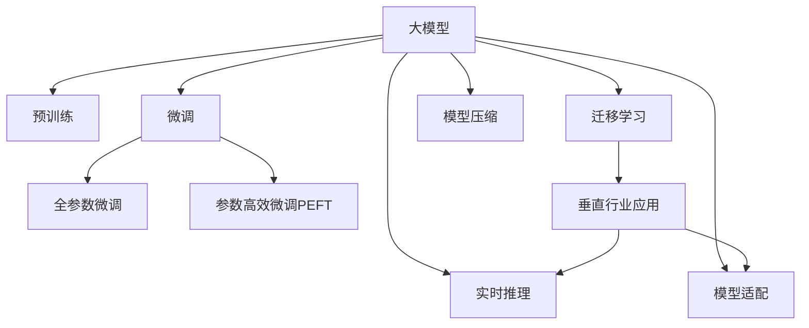

                 

# 大模型在垂直行业的落地挑战

> 关键词：大模型,微调,Fine-tuning,垂直行业,落地挑战,自然语言处理,NLP

## 1. 背景介绍

### 1.1 问题由来
近年来，随着深度学习技术的飞速发展，大模型在自然语言处理(NLP)领域取得了巨大的突破。这些大模型通过在海量无标签文本数据上进行预训练，学习到了丰富的语言知识和常识，可以在多个NLP任务上获得优异的性能。

然而，由于预训练模型在通用性方面的局限，其在特定垂直行业领域的落地应用面临着诸多挑战。这些问题包括：数据标注成本高、模型泛化能力不足、计算资源消耗大、推理速度慢等。这些问题亟需通过深度学习和相关技术创新来解决。

### 1.2 问题核心关键点
垂直行业应用中，大模型落地面临的核心关键点包括：

1. **数据标注成本**：垂直行业数据分布多样，标注成本高昂，且获取高质量标注数据困难。
2. **模型泛化能力**：通用预训练模型在垂直行业领域泛化能力有限，难以适应特定行业的特殊需求。
3. **计算资源消耗**：大模型参数量大，计算资源消耗高，推理速度慢，难以在实时应用中得到推广。
4. **模型鲁棒性**：垂直行业数据存在复杂性和多样性，模型对噪声、语境变化和异常值等鲁棒性要求高。
5. **实际落地难度**：技术实现复杂，涉及数据预处理、模型适配、接口封装等多个环节，落地难度大。

这些问题都需要在技术层面进行深入研究，以提升大模型在垂直行业的落地效果和应用范围。

## 2. 核心概念与联系

### 2.1 核心概念概述

为更好地理解大模型在垂直行业中的落地应用，本节将介绍几个核心概念及其相互联系：

- **大模型(Large Model)**：基于深度学习的大规模语言模型，如BERT、GPT-3等，通过预训练学习通用语言表示。
- **微调(Fine-tuning)**：在大模型基础上，通过特定任务的数据进行微调，调整模型参数以适应新任务。
- **垂直行业(Vertical Industry)**：指具有特定领域特征和技术需求的行业，如金融、医疗、教育等。
- **预训练(Pre-training)**：在大规模无标签数据上对模型进行自监督学习，提取通用语言表示。
- **迁移学习(Transfer Learning)**：利用预训练模型在特定任务上进行微调，以实现模型在垂直行业中的应用。
- **模型压缩(Compression)**：通过剪枝、量化、蒸馏等方法，减少模型参数，提升计算效率。
- **实时推理(Real-time Inference)**：在大规模模型上实现高效推理，提升模型在实际应用中的实时性。
- **模型适配(Model Adaptation)**：通过特定任务的微调、结构优化等方式，使模型更好地适应垂直行业应用。

这些概念之间的逻辑关系可以通过以下Mermaid流程图来展示：



这个流程图展示了从预训练到微调，再到模型适配和压缩的整个流程，以及模型在垂直行业中的应用。

## 3. 核心算法原理 & 具体操作步骤
### 3.1 算法原理概述

大模型在垂直行业中的落地应用，主要基于微调、迁移学习、模型压缩、实时推理等算法原理。这些原理在大规模模型基础上，通过特定任务的数据微调，调整模型参数以适应新任务，同时优化模型结构和推理流程，以提升在垂直行业的落地效果。

形式化地，假设大模型为 $M_{\theta}$，其中 $\theta$ 为预训练得到的模型参数。假设垂直行业任务 $T$ 的标注数据集为 $D=\{(x_i, y_i)\}_{i=1}^N, x_i \in \mathcal{X}, y_i \in \mathcal{Y}$。微调的目标是找到新的模型参数 $\hat{\theta}$，使得：

$$
\hat{\theta}=\mathop{\arg\min}_{\theta} \mathcal{L}(M_{\theta},D)
$$

其中 $\mathcal{L}$ 为针对任务 $T$ 设计的损失函数，用于衡量模型预测输出与真实标签之间的差异。常见的损失函数包括交叉熵损失、均方误差损失等。

### 3.2 算法步骤详解

基于微调和大模型的垂直行业应用，主要包括以下几个关键步骤：

**Step 1: 准备垂直行业数据**
- 收集垂直行业任务的数据集，划分为训练集、验证集和测试集。数据集应尽可能覆盖垂直行业的所有场景和特征。
- 清洗和预处理数据，使其符合模型的输入格式和要求。

**Step 2: 数据适配**
- 对垂直行业数据进行微调模型的适配，使其能够更好地适应垂直行业数据的特征和分布。例如，通过数据增强、归一化等方式，优化模型的输入。
- 根据任务特点，设计适当的损失函数和优化算法。例如，在文本分类任务中，可以使用交叉熵损失；在图像识别任务中，可以使用均方误差损失。

**Step 3: 模型微调**
- 在垂直行业数据上，对预训练模型进行微调，调整模型参数以适应特定任务。通常，只有模型顶层需要微调，以减少计算资源消耗。
- 采用参数高效微调方法，如Adapter、Prefix-Tuning等，在不增加模型参数的情况下，取得较好的微调效果。

**Step 4: 模型压缩和推理优化**
- 对微调后的模型进行压缩，减少模型参数，提升计算效率。例如，使用剪枝、量化、蒸馏等方法，将大模型压缩为轻量级模型。
- 优化模型的推理流程，提升推理速度。例如，采用优化推理图、异步计算等技术，减少推理时间。

**Step 5: 模型部署**
- 将优化后的模型部署到实际应用中，进行实时推理。例如，使用API接口、微服务架构等方式，使模型能够快速响应业务请求。
- 持续监控模型性能，根据业务需求调整模型参数和推理流程。

### 3.3 算法优缺点

基于大模型的微调方法在垂直行业应用中，具有以下优点：

1. **提升模型精度**：通过垂直行业数据的微调，模型能够更好地适应垂直行业的特定需求，提升模型的预测精度。
2. **降低成本**：微调方法可以降低数据标注和计算资源的投入，减少开发和运营成本。
3. **灵活适配**：大模型具备良好的通用性，通过微调和适配，可以轻松应对不同垂直行业的特殊需求。

同时，这些方法也存在一些局限：

1. **数据依赖**：微调方法依赖于垂直行业数据，如果数据量不足或分布不均，模型效果可能不佳。
2. **过拟合风险**：垂直行业数据规模较小，模型容易过拟合，泛化能力有限。
3. **计算资源消耗**：微调和压缩过程需要大量计算资源，模型推理速度较慢。
4. **可解释性不足**：大模型通常是黑盒系统，难以解释其内部工作机制。

尽管存在这些局限，但通过合理的技术方案和应用策略，大模型微调在垂直行业中的应用前景广阔。

### 3.4 算法应用领域

基于大模型的微调方法，在垂直行业中的应用领域包括但不限于：

1. **金融行业**：用于信用评估、风险控制、客户服务等多个场景。通过微调和模型适配，提升模型在金融数据分析和决策中的应用效果。
2. **医疗行业**：用于病历分析、临床诊断、健康管理等多个领域。通过微调和多模态数据融合，提升医疗系统的智能化和精准度。
3. **教育行业**：用于智能推荐、作业批改、学情分析等多个环节。通过微调和知识图谱整合，提升教育系统的个性化和智能化水平。
4. **制造业**：用于设备维护、质量控制、供应链管理等多个场景。通过微调和实时推理，提升制造业的自动化和智能化程度。
5. **公共安全**：用于视频监控、情报分析、应急响应等多个领域。通过微调和跨模态数据融合，提升公共安全系统的实时性和精准度。

## 4. 数学模型和公式 & 详细讲解 & 举例说明

### 4.1 数学模型构建

假设垂直行业任务为文本分类，使用BERT模型作为基础模型，微调后的模型参数为 $\hat{\theta}$。定义模型在输入 $x$ 上的输出为 $\hat{y}=M_{\theta}(x) \in [0,1]$，表示样本属于正类的概率。定义垂直行业任务的损失函数为：

$$
\ell(M_{\theta}(x),y) = -[y\log \hat{y} + (1-y)\log (1-\hat{y})]
$$

在垂直行业数据集 $D=\{(x_i, y_i)\}_{i=1}^N$ 上，经验风险为：

$$
\mathcal{L}(\theta) = -\frac{1}{N}\sum_{i=1}^N [y_i\log M_{\theta}(x_i)+(1-y_i)\log(1-M_{\theta}(x_i))]
$$

微调的目标是最小化经验风险，即找到最优参数：

$$
\hat{\theta} = \mathop{\arg\min}_{\theta} \mathcal{L}(\theta)
$$

在实践中，我们通常使用基于梯度的优化算法（如AdamW、SGD等）来近似求解上述最优化问题。设 $\eta$ 为学习率，$\lambda$ 为正则化系数，则参数的更新公式为：

$$
\theta \leftarrow \theta - \eta \nabla_{\theta}\mathcal{L}(\theta) - \eta\lambda\theta
$$

其中 $\nabla_{\theta}\mathcal{L}(\theta)$ 为损失函数对参数 $\theta$ 的梯度，可通过反向传播算法高效计算。

### 4.2 公式推导过程

以下以文本分类任务为例，推导微调的损失函数和梯度计算公式。

假设模型在输入 $x$ 上的输出为 $\hat{y}=M_{\theta}(x) \in [0,1]$，表示样本属于正类的概率。真实标签 $y \in \{0,1\}$。则二分类交叉熵损失函数定义为：

$$
\ell(M_{\theta}(x),y) = -[y\log \hat{y} + (1-y)\log (1-\hat{y})]
$$

将其代入经验风险公式，得：

$$
\mathcal{L}(\theta) = -\frac{1}{N}\sum_{i=1}^N [y_i\log M_{\theta}(x_i)+(1-y_i)\log(1-M_{\theta}(x_i))]
$$

根据链式法则，损失函数对参数 $\theta_k$ 的梯度为：

$$
\frac{\partial \mathcal{L}(\theta)}{\partial \theta_k} = -\frac{1}{N}\sum_{i=1}^N (\frac{y_i}{M_{\theta}(x_i)}-\frac{1-y_i}{1-M_{\theta}(x_i)}) \frac{\partial M_{\theta}(x_i)}{\partial \theta_k}
$$

其中 $\frac{\partial M_{\theta}(x_i)}{\partial \theta_k}$ 可进一步递归展开，利用自动微分技术完成计算。

### 4.3 案例分析与讲解

**案例：金融信用评估**

金融信用评估任务涉及大量非结构化数据，包括个人履历、交易记录、社交媒体等。使用BERT等预训练模型作为基础，在标注的金融信用数据上进行微调，可以实现个性化的信用评估。

具体而言，可以收集金融领域相关的数据集，如LoanDataset、CreditReport等，通过微调BERT模型，使其能够自动理解文本中的关键信息，如收入、负债、信用历史等，并预测用户信用评分。

在微调过程中，可以采用以下策略：

1. **数据预处理**：对原始数据进行清洗、归一化、标注等预处理，使其符合BERT模型的输入格式。
2. **任务适配**：设计合适的输出层和损失函数，如分类损失、回归损失等。
3. **微调参数**：仅微调模型的顶层分类器，固定预训练权重，以减少计算资源消耗。
4. **模型压缩**：使用剪枝、量化、蒸馏等方法，将模型压缩为轻量级模型，提升推理速度。
5. **实时推理**：将微调后的模型部署为API接口，实现实时推理，提升服务响应速度。

通过上述步骤，金融信用评估系统可以实现高效、准确的信用评分预测，提升金融服务质量。

## 5. 项目实践：代码实例和详细解释说明

### 5.1 开发环境搭建

在进行垂直行业应用的大模型微调时，我们需要准备好开发环境。以下是使用Python进行PyTorch开发的环境配置流程：

1. 安装Anaconda：从官网下载并安装Anaconda，用于创建独立的Python环境。

2. 创建并激活虚拟环境：
```bash
conda create -n pytorch-env python=3.8 
conda activate pytorch-env
```

3. 安装PyTorch：根据CUDA版本，从官网获取对应的安装命令。例如：
```bash
conda install pytorch torchvision torchaudio cudatoolkit=11.1 -c pytorch -c conda-forge
```

4. 安装Transformers库：
```bash
pip install transformers
```

5. 安装各类工具包：
```bash
pip install numpy pandas scikit-learn matplotlib tqdm jupyter notebook ipython
```

完成上述步骤后，即可在`pytorch-env`环境中开始微调实践。

### 5.2 源代码详细实现

下面我们以金融信用评估任务为例，给出使用Transformers库对BERT模型进行微调的PyTorch代码实现。

首先，定义数据处理函数：

```python
from transformers import BertTokenizer
from torch.utils.data import Dataset
import torch

class FinancialCreditDataset(Dataset):
    def __init__(self, texts, labels, tokenizer, max_len=128):
        self.texts = texts
        self.labels = labels
        self.tokenizer = tokenizer
        self.max_len = max_len
        
    def __len__(self):
        return len(self.texts)
    
    def __getitem__(self, item):
        text = self.texts[item]
        label = self.labels[item]
        
        encoding = self.tokenizer(text, return_tensors='pt', max_length=self.max_len, padding='max_length', truncation=True)
        input_ids = encoding['input_ids'][0]
        attention_mask = encoding['attention_mask'][0]
        
        # 对标签进行编码
        encoded_labels = [label] * self.max_len
        labels = torch.tensor(encoded_labels, dtype=torch.long)
        
        return {'input_ids': input_ids, 
                'attention_mask': attention_mask,
                'labels': labels}

# 标签与id的映射
label2id = {0: 0, 1: 1, 2: 2, 3: 3, 4: 4, 5: 5}
id2label = {v: k for k, v in label2id.items()}

# 创建dataset
tokenizer = BertTokenizer.from_pretrained('bert-base-cased')

train_dataset = FinancialCreditDataset(train_texts, train_labels, tokenizer)
dev_dataset = FinancialCreditDataset(dev_texts, dev_labels, tokenizer)
test_dataset = FinancialCreditDataset(test_texts, test_labels, tokenizer)
```

然后，定义模型和优化器：

```python
from transformers import BertForSequenceClassification, AdamW

model = BertForSequenceClassification.from_pretrained('bert-base-cased', num_labels=6)

optimizer = AdamW(model.parameters(), lr=2e-5)
```

接着，定义训练和评估函数：

```python
from torch.utils.data import DataLoader
from tqdm import tqdm
from sklearn.metrics import classification_report

device = torch.device('cuda') if torch.cuda.is_available() else torch.device('cpu')
model.to(device)

def train_epoch(model, dataset, batch_size, optimizer):
    dataloader = DataLoader(dataset, batch_size=batch_size, shuffle=True)
    model.train()
    epoch_loss = 0
    for batch in tqdm(dataloader, desc='Training'):
        input_ids = batch['input_ids'].to(device)
        attention_mask = batch['attention_mask'].to(device)
        labels = batch['labels'].to(device)
        model.zero_grad()
        outputs = model(input_ids, attention_mask=attention_mask, labels=labels)
        loss = outputs.loss
        epoch_loss += loss.item()
        loss.backward()
        optimizer.step()
    return epoch_loss / len(dataloader)

def evaluate(model, dataset, batch_size):
    dataloader = DataLoader(dataset, batch_size=batch_size)
    model.eval()
    preds, labels = [], []
    with torch.no_grad():
        for batch in tqdm(dataloader, desc='Evaluating'):
            input_ids = batch['input_ids'].to(device)
            attention_mask = batch['attention_mask'].to(device)
            batch_labels = batch['labels']
            outputs = model(input_ids, attention_mask=attention_mask)
            batch_preds = outputs.logits.argmax(dim=2).to('cpu').tolist()
            batch_labels = batch_labels.to('cpu').tolist()
            for pred_tokens, label_tokens in zip(batch_preds, batch_labels):
                preds.append(pred_tokens[:len(label_tokens)])
                labels.append(label_tokens)
                
    print(classification_report(labels, preds))
```

最后，启动训练流程并在测试集上评估：

```python
epochs = 5
batch_size = 16

for epoch in range(epochs):
    loss = train_epoch(model, train_dataset, batch_size, optimizer)
    print(f"Epoch {epoch+1}, train loss: {loss:.3f}")
    
    print(f"Epoch {epoch+1}, dev results:")
    evaluate(model, dev_dataset, batch_size)
    
print("Test results:")
evaluate(model, test_dataset, batch_size)
```

以上就是使用PyTorch对BERT进行金融信用评估任务微调的完整代码实现。可以看到，得益于Transformers库的强大封装，我们可以用相对简洁的代码完成BERT模型的加载和微调。

### 5.3 代码解读与分析

让我们再详细解读一下关键代码的实现细节：

**FinancialCreditDataset类**：
- `__init__`方法：初始化文本、标签、分词器等关键组件。
- `__len__`方法：返回数据集的样本数量。
- `__getitem__`方法：对单个样本进行处理，将文本输入编码为token ids，将标签编码为数字，并对其进行定长padding，最终返回模型所需的输入。

**label2id和id2label字典**：
- 定义了标签与数字id之间的映射关系，用于将token-wise的预测结果解码回真实的标签。

**训练和评估函数**：
- 使用PyTorch的DataLoader对数据集进行批次化加载，供模型训练和推理使用。
- 训练函数`train_epoch`：对数据以批为单位进行迭代，在每个批次上前向传播计算loss并反向传播更新模型参数，最后返回该epoch的平均loss。
- 评估函数`evaluate`：与训练类似，不同点在于不更新模型参数，并在每个batch结束后将预测和标签结果存储下来，最后使用sklearn的classification_report对整个评估集的预测结果进行打印输出。

**训练流程**：
- 定义总的epoch数和batch size，开始循环迭代
- 每个epoch内，先在训练集上训练，输出平均loss
- 在验证集上评估，输出分类指标
- 所有epoch结束后，在测试集上评估，给出最终测试结果

可以看到，PyTorch配合Transformers库使得BERT微调的代码实现变得简洁高效。开发者可以将更多精力放在数据处理、模型改进等高层逻辑上，而不必过多关注底层的实现细节。

当然，工业级的系统实现还需考虑更多因素，如模型的保存和部署、超参数的自动搜索、更灵活的任务适配层等。但核心的微调范式基本与此类似。

## 6. 实际应用场景

### 6.1 智能客服系统

基于大模型微调的对话技术，可以广泛应用于智能客服系统的构建。传统客服往往需要配备大量人力，高峰期响应缓慢，且一致性和专业性难以保证。而使用微调后的对话模型，可以7x24小时不间断服务，快速响应客户咨询，用自然流畅的语言解答各类常见问题。

在技术实现上，可以收集企业内部的历史客服对话记录，将问题和最佳答复构建成监督数据，在此基础上对预训练对话模型进行微调。微调后的对话模型能够自动理解用户意图，匹配最合适的答案模板进行回复。对于客户提出的新问题，还可以接入检索系统实时搜索相关内容，动态组织生成回答。如此构建的智能客服系统，能大幅提升客户咨询体验和问题解决效率。

### 6.2 金融舆情监测

金融机构需要实时监测市场舆论动向，以便及时应对负面信息传播，规避金融风险。传统的人工监测方式成本高、效率低，难以应对网络时代海量信息爆发的挑战。基于大语言模型微调的文本分类和情感分析技术，为金融舆情监测提供了新的解决方案。

具体而言，可以收集金融领域相关的新闻、报道、评论等文本数据，并对其进行主题标注和情感标注。在此基础上对预训练语言模型进行微调，使其能够自动判断文本属于何种主题，情感倾向是正面、中性还是负面。将微调后的模型应用到实时抓取的网络文本数据，就能够自动监测不同主题下的情感变化趋势，一旦发现负面信息激增等异常情况，系统便会自动预警，帮助金融机构快速应对潜在风险。

### 6.3 个性化推荐系统

当前的推荐系统往往只依赖用户的历史行为数据进行物品推荐，无法深入理解用户的真实兴趣偏好。基于大语言模型微调技术，个性化推荐系统可以更好地挖掘用户行为背后的语义信息，从而提供更精准、多样的推荐内容。

在实践中，可以收集用户浏览、点击、评论、分享等行为数据，提取和用户交互的物品标题、描述、标签等文本内容。将文本内容作为模型输入，用户的后续行为（如是否点击、购买等）作为监督信号，在此基础上微调预训练语言模型。微调后的模型能够从文本内容中准确把握用户的兴趣点。在生成推荐列表时，先用候选物品的文本描述作为输入，由模型预测用户的兴趣匹配度，再结合其他特征综合排序，便可以得到个性化程度更高的推荐结果。

### 6.4 未来应用展望

随着大语言模型微调技术的发展，基于微调范式将在更多领域得到应用，为传统行业带来变革性影响。

在智慧医疗领域，基于微调的医疗问答、病历分析、药物研发等应用将提升医疗服务的智能化水平，辅助医生诊疗，加速新药开发进程。

在智能教育领域，微调技术可应用于作业批改、学情分析、知识推荐等方面，因材施教，促进教育公平，提高教学质量。

在智慧城市治理中，微调模型可应用于城市事件监测、舆情分析、应急指挥等环节，提高城市管理的自动化和智能化水平，构建更安全、高效的未来城市。

此外，在企业生产、社会治理、文娱传媒等众多领域，基于大模型微调的人工智能应用也将不断涌现，为经济社会发展注入新的动力。相信随着技术的日益成熟，微调方法将成为人工智能落地应用的重要范式，推动人工智能技术向更广阔的领域加速渗透。

## 7. 工具和资源推荐
### 7.1 学习资源推荐

为了帮助开发者系统掌握大模型微调的理论基础和实践技巧，这里推荐一些优质的学习资源：

1. 《Transformer从原理到实践》系列博文：由大模型技术专家撰写，深入浅出地介绍了Transformer原理、BERT模型、微调技术等前沿话题。

2. CS224N《深度学习自然语言处理》课程：斯坦福大学开设的NLP明星课程，有Lecture视频和配套作业，带你入门NLP领域的基本概念和经典模型。

3. 《Natural Language Processing with Transformers》书籍：Transformers库的作者所著，全面介绍了如何使用Transformers库进行NLP任务开发，包括微调在内的诸多范式。

4. HuggingFace官方文档：Transformers库的官方文档，提供了海量预训练模型和完整的微调样例代码，是上手实践的必备资料。

5. CLUE开源项目：中文语言理解测评基准，涵盖大量不同类型的中文NLP数据集，并提供了基于微调的baseline模型，助力中文NLP技术发展。

通过对这些资源的学习实践，相信你一定能够快速掌握大模型微调的精髓，并用于解决实际的NLP问题。
###  7.2 开发工具推荐

高效的开发离不开优秀的工具支持。以下是几款用于大语言模型微调开发的常用工具：

1. PyTorch：基于Python的开源深度学习框架，灵活动态的计算图，适合快速迭代研究。大部分预训练语言模型都有PyTorch版本的实现。

2. TensorFlow：由Google主导开发的开源深度学习框架，生产部署方便，适合大规模工程应用。同样有丰富的预训练语言模型资源。

3. Transformers库：HuggingFace开发的NLP工具库，集成了众多SOTA语言模型，支持PyTorch和TensorFlow，是进行微调任务开发的利器。

4. Weights & Biases：模型训练的实验跟踪工具，可以记录和可视化模型训练过程中的各项指标，方便对比和调优。与主流深度学习框架无缝集成。

5. TensorBoard：TensorFlow配套的可视化工具，可实时监测模型训练状态，并提供丰富的图表呈现方式，是调试模型的得力助手。

6. Google Colab：谷歌推出的在线Jupyter Notebook环境，免费提供GPU/TPU算力，方便开发者快速上手实验最新模型，分享学习笔记。

合理利用这些工具，可以显著提升大语言模型微调任务的开发效率，加快创新迭代的步伐。

### 7.3 相关论文推荐

大语言模型和微调技术的发展源于学界的持续研究。以下是几篇奠基性的相关论文，推荐阅读：

1. Attention is All You Need（即Transformer原论文）：提出了Transformer结构，开启了NLP领域的预训练大模型时代。

2. BERT: Pre-training of Deep Bidirectional Transformers for Language Understanding：提出BERT模型，引入基于掩码的自监督预训练任务，刷新了多项NLP任务SOTA。

3. Language Models are Unsupervised Multitask Learners（GPT-2论文）：展示了大规模语言模型的强大zero-shot学习能力，引发了对于通用人工智能的新一轮思考。

4. Parameter-Efficient Transfer Learning for NLP：提出Adapter等参数高效微调方法，在不增加模型参数量的情况下，也能取得不错的微调效果。

5. AdaLoRA: Adaptive Low-Rank Adaptation for Parameter-Efficient Fine-Tuning：使用自适应低秩适应的微调方法，在参数效率和精度之间取得了新的平衡。

6. Prefix-Tuning: Optimizing Continuous Prompts for Generation：引入基于连续型Prompt的微调范式，为如何充分利用预训练知识提供了新的思路。

这些论文代表了大语言模型微调技术的发展脉络。通过学习这些前沿成果，可以帮助研究者把握学科前进方向，激发更多的创新灵感。

## 8. 总结：未来发展趋势与挑战

### 8.1 总结

本文对大模型在垂直行业的落地应用进行了全面系统的介绍。首先阐述了垂直行业数据特征和技术需求，明确了微调在垂直行业应用中的必要性和挑战。其次，从原理到实践，详细讲解了微调和大模型在垂直行业中的应用流程和关键步骤，给出了微调任务开发的完整代码实例。同时，本文还广泛探讨了微调方法在智能客服、金融舆情、个性化推荐等多个领域的应用前景，展示了微调范式的巨大潜力。此外，本文精选了微调技术的各类学习资源，力求为读者提供全方位的技术指引。

通过本文的系统梳理，可以看到，大模型微调在垂直行业中的应用前景广阔，但要实现高效、可靠、安全的大模型落地，还需要在多个方面进行深入研究和技术优化。

### 8.2 未来发展趋势

展望未来，大模型在垂直行业的应用将呈现以下几个发展趋势：

1. **更高效的微调算法**：未来将探索更多参数高效和计算高效的微调方法，如Prefix-Tuning、LoRA等，以适应垂直行业对计算资源的需求。

2. **更强大的多模态融合**：多模态数据融合将成为垂直行业微调的重要方向，如图像、视频、语音等多模态信息与文本信息的协同建模。

3. **更灵活的模型适配**：针对垂直行业特殊需求，将开发更多定制化的模型结构和适配策略，提升模型在垂直行业的适用性。

4. **更智能的知识整合**：未来将探索更多将符号化的先验知识与神经网络模型融合的方法，提升模型的智能水平。

5. **更全面的实时推理**：针对垂直行业实时性要求，将开发更多高效的推理引擎和模型压缩技术，提升模型的实时性和计算效率。

6. **更稳健的模型鲁棒性**：针对垂直行业数据复杂性和多样性，将开发更多鲁棒性提升方法，提升模型的泛化能力和抗干扰性。

这些趋势凸显了大模型微调技术在垂直行业的广泛应用前景，将进一步提升模型的性能和应用范围。

### 8.3 面临的挑战

尽管大模型微调技术在垂直行业中的应用前景广阔，但在迈向更加智能化、普适化应用的过程中，仍面临诸多挑战：

1. **数据标注成本高**：垂直行业数据分布多样，标注成本高昂，且获取高质量标注数据困难。
2. **模型泛化能力有限**：通用预训练模型在垂直行业领域泛化能力有限，难以适应特定行业的特殊需求。
3. **计算资源消耗大**：大模型参数量大，计算资源消耗高，推理速度慢，难以在实时应用中得到推广。
4. **模型鲁棒性不足**：垂直行业数据存在复杂性和多样性，模型对噪声、语境变化和异常值等鲁棒性要求高。
5. **实际落地难度大**：技术实现复杂，涉及数据预处理、模型适配、接口封装等多个环节，落地难度大。

尽管存在这些挑战，但通过合理的技术方案和应用策略，大模型微调在垂直行业中的应用前景广阔。

### 8.4 研究展望

面对大模型微调所面临的诸多挑战，未来的研究需要在以下几个方面寻求新的突破：

1. **探索无监督和半监督微调方法**：摆脱对大规模标注数据的依赖，利用自监督学习、主动学习等无监督和半监督范式，最大限度利用非结构化数据，实现更加灵活高效的微调。

2. **研究参数高效和计算高效的微调范式**：开发更加参数高效的微调方法，在固定大部分预训练参数的情况下，只更新极少量的任务相关参数。同时优化微调模型的计算图，减少前向传播和反向传播的资源消耗，实现更加轻量级、实时性的部署。

3. **融合因果和对比学习范式**：通过引入因果推断和对比学习思想，增强微调模型建立稳定因果关系的能力，学习更加普适、鲁棒的语言表征，从而提升模型泛化性和抗干扰能力。

4. **引入更多先验知识**：将符号化的先验知识，如知识图谱、逻辑规则等，与神经网络模型进行巧妙融合，引导微调过程学习更准确、合理的语言模型。同时加强不同模态数据的整合，实现视觉、语音等多模态信息与文本信息的协同建模。

5. **结合因果分析和博弈论工具**：将因果分析方法引入微调模型，识别出模型决策的关键特征，增强输出解释的因果性和逻辑性。借助博弈论工具刻画人机交互过程，主动探索并规避模型的脆弱点，提高系统稳定性。

6. **纳入伦理道德约束**：在模型训练目标中引入伦理导向的评估指标，过滤和惩罚有偏见、有害的输出倾向。同时加强人工干预和审核，建立模型行为的监管机制，确保输出符合人类价值观和伦理道德。

这些研究方向的探索，必将引领大模型微调技术迈向更高的台阶，为构建安全、可靠、可解释、可控的智能系统铺平道路。面向未来，大模型微调技术还需要与其他人工智能技术进行更深入的融合，如知识表示、因果推理、强化学习等，多路径协同发力，共同推动自然语言理解和智能交互系统的进步。只有勇于创新、敢于突破，才能不断拓展语言模型的边界，让智能技术更好地造福人类社会。

## 9. 附录：常见问题与解答

**Q1：大模型微调在垂直行业中的主要挑战是什么？**

A: 大模型微调在垂直行业中的主要挑战包括数据标注成本高、模型泛化能力有限、计算资源消耗大、模型鲁棒性不足以及实际落地难度大等。这些问题都需要在技术层面进行深入研究，以提升大模型在垂直行业的落地效果和应用范围。

**Q2：如何降低垂直行业数据标注成本？**

A: 降低垂直行业数据标注成本的关键在于提高数据质量和使用自动化的标注工具。以下是一些具体的策略：
1. 数据清洗与预处理：去除噪声数据，提高数据质量。
2. 主动学习与半监督学习：利用少量标注数据，自动生成高质量的标注数据。
3. 自动化标注工具：使用自动化标注工具，如自然语言处理技术，减少人工标注工作量。
4. 众包标注：利用众包平台，快速获取大量标注数据。

通过这些策略，可以有效降低垂直行业数据标注成本，提升数据质量和标注效率。

**Q3：如何提高大模型在垂直行业的泛化能力？**

A: 提高大模型在垂直行业的泛化能力，可以从以下几个方面入手：
1. 数据增强：通过对训练数据进行扩充和变形，增强模型对不同数据分布的适应能力。
2. 迁移学习：利用通用预训练模型在垂直行业数据上进行微调，利用已有知识提升模型泛化能力。
3. 多任务学习：将多个垂直行业任务联合训练，提升模型在不同任务间的泛化能力。
4. 模型适配：针对垂直行业特点，设计合适的任务适配层，增强模型对特定任务的适应能力。

这些策略可以帮助提高大模型在垂直行业的泛化能力，使其在实际应用中表现更加稳定和可靠。

**Q4：如何提升大模型在垂直行业的实时推理性能？**

A: 提升大模型在垂直行业的实时推理性能，可以从以下几个方面入手：
1. 模型压缩：通过剪枝、量化、蒸馏等方法，减少模型参数，提升计算效率。
2. 推理优化：优化推理流程，减少推理时间，如使用异步计算、分布式推理等技术。
3. 硬件加速：利用GPU/TPU等高性能硬件，提升推理速度。
4. 缓存机制：采用缓存机制，减少重复计算，提高推理效率。

通过这些策略，可以有效提升大模型在垂直行业的实时推理性能，满足实际应用中的实时性需求。

**Q5：如何确保大模型在垂直行业中的鲁棒性？**

A: 确保大模型在垂直行业中的鲁棒性，可以从以下几个方面入手：
1. 数据增强：通过对抗样本、噪声注入等方式，增强模型对异常输入的鲁棒性。
2. 多模态融合：利用多模态数据融合技术，提升模型对复杂场景的适应能力。
3. 对抗训练：在训练过程中引入对抗样本，增强模型对攻击的鲁棒性。
4. 模型验证：通过模型验证和评估，检测模型对噪声和异常输入的鲁棒性，并进行针对性的优化。

通过这些策略，可以有效提升大模型在垂直行业中的鲁棒性，提高其在实际应用中的稳定性和可靠性。

**Q6：如何在垂直行业中部署大模型微调系统？**

A: 在垂直行业中部署大模型微调系统，需要考虑以下几个关键环节：
1. 数据预处理：对原始数据进行清洗、归一化、标注等预处理，使其符合模型的输入格式。
2. 模型微调：根据垂直行业任务，对预训练模型进行微调，调整模型参数以适应新任务。
3. 模型压缩：通过剪枝、量化、蒸馏等方法，将大模型压缩为轻量级模型，提升计算效率。
4. 接口封装：将微调后的模型封装为标准化服务接口，便于集成调用。
5. 服务化部署：利用微服务架构，实现模型的弹性伸缩和自动化部署。
6. 监控告警：实时采集系统指标，设置异常告警阈值，确保服务稳定性。

通过这些环节，可以实现大模型在垂直行业的成功部署和落地应用，满足业务需求，提升用户体验。

---

作者：禅与计算机程序设计艺术 / Zen and the Art of Computer Programming

