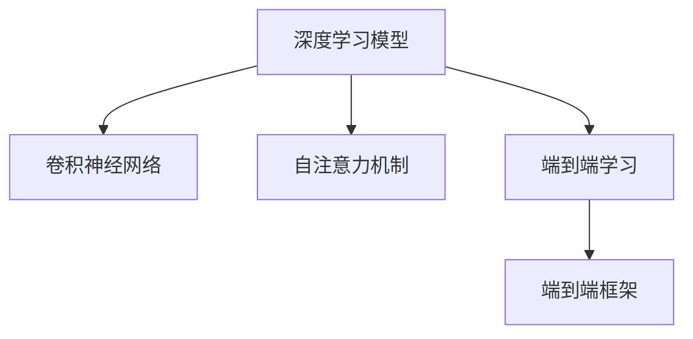

                 

# 大模型在语音识别中的突破

> 关键词：语音识别,大模型,深度学习,卷积神经网络,自注意力机制,端到端学习,端到端框架,语音增强,下游任务,音频标注

## 1. 背景介绍

语音识别技术长期以来一直是人工智能领域的核心技术之一。传统的语音识别系统通常依赖于手工设计的特征提取和分类器，存在着计算量大、复杂度高、鲁棒性差等问题。近年来，随着深度学习技术的飞速发展，基于大模型的端到端语音识别方法逐渐成为了新的研究热点，并在多个语音识别评测任务上取得了优异成绩。

端到端学习的方法不仅简化了特征提取和分类器的设计，还提升了系统的整体性能和泛化能力。大模型的引入，尤其是基于Transformer架构的自注意力机制的引入，为端到端语音识别系统带来了革命性的变化。本文将详细介绍大模型在语音识别中的突破，分析其原理和应用，展望未来的发展趋势。

## 2. 核心概念与联系

### 2.1 核心概念概述

为更好地理解大模型在语音识别中的应用，本节将介绍几个关键概念：

- 端到端学习(End-to-End Learning)：指从输入原始音频数据到输出文本标签，完全由深度学习模型自主学习完成的过程。无需手工提取特征和设计分类器，减少了模型设计复杂度。
- 深度学习模型：以神经网络为代表的学习模型，通过多层次的非线性变换学习输入数据与输出标签之间的映射关系。
- 卷积神经网络(Convolutional Neural Networks, CNNs)：一种特殊的深度学习模型，特别适用于处理图像和语音等具有局部空间相关性的数据。
- 自注意力机制(Self-Attention)：Transformer模型中的核心组件，通过多头自注意力机制，可以自适应地将输入序列中的各个元素之间建立关联，捕捉全局依赖关系。
- 端到端框架(End-to-End Framework)：指从数据输入到模型训练，再到模型输出，全程自动化的构建和训练系统。

这些概念之间的逻辑关系可以通过以下Mermaid流程图来展示：



这个流程图展示了大模型在语音识别中的核心概念及其之间的关系：

1. 深度学习模型通过多层次的变换学习输入数据的表示。
2. 卷积神经网络特别适用于处理语音信号的局部空间相关性。
3. 自注意力机制捕捉输入序列的长期依赖关系，增强模型的泛化能力。
4. 端到端学习通过减少手工设计复杂度，提升了系统的整体性能。
5. 端到端框架提供了自动化的构建和训练系统，加速了模型开发。

这些核心概念共同构成了大模型在语音识别中的应用框架，使其能够在各种场景下发挥强大的语音识别能力。通过理解这些核心概念，我们可以更好地把握大模型的工作原理和优化方向。

## 3. 核心算法原理 & 具体操作步骤
### 3.1 算法原理概述

大模型在语音识别中的核心算法原理可以归结为基于Transformer的自注意力机制的端到端学习框架。该框架通过预训练大语言模型，学习语音信号的深层次表示，进而通过端到端学习，直接从音频信号输出文本标签，避免了手工特征提取和分类的复杂性。

形式化地，假设输入的音频信号为 $x \in \mathbb{R}^T$，模型通过自注意力机制学习音频特征表示 $\mathbf{h} = \mathbf{A}(x)$，其中 $\mathbf{A}$ 表示自注意力机制，$T$ 表示音频信号的长度。然后，模型通过全连接层和softmax层输出文本标签的概率分布 $p(y|x) = \mathcal{S}(\mathbf{h})$，其中 $\mathcal{S}$ 表示softmax函数。

通过最大化似然估计，目标是最小化损失函数 $\mathcal{L}(x,y) = -\log p(y|x)$，即：

$$
\min_{\mathbf{A},\mathcal{S}} \mathbb{E}_{(x,y)} \mathcal{L}(x,y)
$$

### 3.2 算法步骤详解

基于大模型的语音识别系统一般包括以下几个关键步骤：

**Step 1: 准备音频数据和标签数据**
- 收集语音数据集，并将其分为训练集、验证集和测试集。
- 对音频信号进行预处理，如采样率、归一化等，并标注音频对应的文本标签。

**Step 2: 设计自注意力机制**
- 选择合适的自注意力模型，如Transformer-BERT等，作为特征提取组件。
- 设置模型的参数，如层数、头部数、学习率等。

**Step 3: 训练模型**
- 将训练集音频数据输入模型，进行前向传播和损失计算。
- 使用优化算法（如AdamW、SGD等）更新模型参数，最小化损失函数。
- 周期性在验证集上评估模型性能，根据性能指标决定是否触发Early Stopping。
- 重复上述步骤直到满足预设的迭代轮数或Early Stopping条件。

**Step 4: 测试和部署**
- 在测试集上评估微调后模型的性能，对比微调前后的精度提升。
- 使用微调后的模型对新的音频数据进行推理预测，集成到实际的应用系统中。
- 持续收集新的数据，定期重新微调模型，以适应数据分布的变化。

以上是基于大模型的语音识别系统的一般流程。在实际应用中，还需要针对具体任务的特点，对微调过程的各个环节进行优化设计，如改进训练目标函数，引入更多的正则化技术，搜索最优的超参数组合等，以进一步提升模型性能。

### 3.3 算法优缺点

基于大模型的语音识别方法具有以下优点：

1. 简化系统设计。无需手工设计特征提取器和分类器，大大简化了系统设计复杂度。
2. 提升性能和泛化能力。大模型的自注意力机制可以捕捉语音信号的深层次特征，提升了模型泛化能力。
3. 端到端学习高效。通过全链条端到端训练，避免了手工特征工程带来的复杂度和误差。
4. 多任务支持。大模型可以同时处理多个语音识别任务，如口语识别、语音转写等。

同时，该方法也存在一定的局限性：

1. 对标注数据依赖。语音识别系统需要大量的标注数据进行训练，标注数据获取成本高。
2. 计算资源消耗大。大模型的计算需求大，训练和推理需要高性能计算设备。
3. 模型复杂度高。大模型结构复杂，参数量大，调试和维护难度高。
4. 系统可解释性不足。深度学习模型通常缺乏可解释性，难以调试和优化。

尽管存在这些局限性，但就目前而言，基于大模型的端到端语音识别方法仍是最为主流的研究方向。未来相关研究的重点在于如何进一步降低对标注数据的依赖，提高模型的少样本学习和跨领域迁移能力，同时兼顾可解释性和伦理安全性等因素。

### 3.4 算法应用领域

基于大模型的语音识别方法，已经在多个领域得到了广泛应用，例如：

- 智能语音助手：如Siri、Google Assistant等，可以实现自然语言交互和语音识别。
- 智能会议系统：如Zoom、Skype等，可以进行实时语音识别和字幕生成。
- 自动驾驶：如特斯拉、Waymo等，可以实现车内语音控制和导航指令识别。
- 医疗健康：如语音识别病历、智能听写等，辅助医生记录和诊断。
- 司法调查：如智能听证记录、语音证据提取等，提升司法调查效率。

除了上述这些经典应用外，语音识别技术还在更多的场景中发挥着重要作用，如儿童教育、商务会议、公共广播等，为人们的生产生活带来了便捷和效率。

## 4. 数学模型和公式 & 详细讲解 & 举例说明
### 4.1 数学模型构建

本节将使用数学语言对基于大模型的语音识别过程进行更加严格的刻画。

假设输入音频信号 $x \in \mathbb{R}^T$，模型通过自注意力机制学习音频特征表示 $\mathbf{h} = \mathbf{A}(x)$，其中 $\mathbf{A}$ 表示自注意力机制。然后，模型通过全连接层和softmax层输出文本标签的概率分布 $p(y|x) = \mathcal{S}(\mathbf{h})$，其中 $\mathcal{S}$ 表示softmax函数。

目标是最小化损失函数 $\mathcal{L}(x,y) = -\log p(y|x)$，即：

$$
\min_{\mathbf{A},\mathcal{S}} \mathbb{E}_{(x,y)} \mathcal{L}(x,y)
$$

在实践中，我们通常使用基于梯度的优化算法（如AdamW、SGD等）来近似求解上述最优化问题。设 $\eta$ 为学习率，$\lambda$ 为正则化系数，则参数的更新公式为：

$$
\theta \leftarrow \theta - \eta \nabla_{\theta}\mathcal{L}(\theta) - \eta\lambda\theta
$$

其中 $\nabla_{\theta}\mathcal{L}(\theta)$ 为损失函数对参数 $\theta$ 的梯度，可通过反向传播算法高效计算。

### 4.2 公式推导过程

以下我们以二分类任务为例，推导交叉熵损失函数及其梯度的计算公式。

假设模型 $M_{\theta}$ 在输入 $x$ 上的输出为 $\hat{y}=M_{\theta}(x) \in [0,1]$，表示样本属于正类的概率。真实标签 $y \in \{0,1\}$。则二分类交叉熵损失函数定义为：

$$
\ell(M_{\theta}(x),y) = -[y\log \hat{y} + (1-y)\log (1-\hat{y})]
$$

将其代入经验风险公式，得：

$$
\mathcal{L}(\theta) = -\frac{1}{N}\sum_{i=1}^N [y_i\log M_{\theta}(x_i)+(1-y_i)\log(1-M_{\theta}(x_i))]
$$

根据链式法则，损失函数对参数 $\theta_k$ 的梯度为：

$$
\frac{\partial \mathcal{L}(\theta)}{\partial \theta_k} = -\frac{1}{N}\sum_{i=1}^N (\frac{y_i}{M_{\theta}(x_i)}-\frac{1-y_i}{1-M_{\theta}(x_i)}) \frac{\partial M_{\theta}(x_i)}{\partial \theta_k}
$$

其中 $\frac{\partial M_{\theta}(x_i)}{\partial \theta_k}$ 可进一步递归展开，利用自动微分技术完成计算。

在得到损失函数的梯度后，即可带入参数更新公式，完成模型的迭代优化。重复上述过程直至收敛，最终得到适应下游任务的最优模型参数 $\theta^*$。

## 5. 项目实践：代码实例和详细解释说明
### 5.1 开发环境搭建

在进行语音识别实践前，我们需要准备好开发环境。以下是使用Python进行PyTorch开发的环境配置流程：

1. 安装Anaconda：从官网下载并安装Anaconda，用于创建独立的Python环境。

2. 创建并激活虚拟环境：
```bash
conda create -n pytorch-env python=3.8 
conda activate pytorch-env
```

3. 安装PyTorch：根据CUDA版本，从官网获取对应的安装命令。例如：
```bash
conda install pytorch torchvision torchaudio cudatoolkit=11.1 -c pytorch -c conda-forge
```

4. 安装各类工具包：
```bash
pip install numpy pandas scikit-learn matplotlib tqdm jupyter notebook ipython
```

完成上述步骤后，即可在`pytorch-env`环境中开始语音识别实践。

### 5.2 源代码详细实现

下面我们以基于大模型的语音识别任务为例，给出使用Transformers库对BERT模型进行语音识别的PyTorch代码实现。

首先，定义语音识别任务的数据处理函数：

```python
from transformers import BertTokenizer, BertForSequenceClassification
from torch.utils.data import Dataset, DataLoader
import torch

class SpeechDataset(Dataset):
    def __init__(self, audio_paths, labels, tokenizer, max_len=16000):
        self.audio_paths = audio_paths
        self.labels = labels
        self.tokenizer = tokenizer
        self.max_len = max_len
        
    def __len__(self):
        return len(self.audio_paths)
    
    def __getitem__(self, item):
        audio_path = self.audio_paths[item]
        label = self.labels[item]
        
        # 将音频文件读取为音频信号，并进行预处理
        audio_signal = preprocess_audio(audio_path)
        
        # 将音频信号分成固定长度的小段，并填充到固定长度
        audio_segments = audio_segmentation(audio_signal, self.max_len)
        padded_segments = pad_sequences(audio_segments, maxlen=self.max_len, padding='post', truncating='post')
        
        # 对音频段进行分词和编码，构建输入序列
        input_ids = self.tokenizer(padded_segments, padding='max_length', truncation=True, max_length=self.max_len)
        
        return {'input_ids': input_ids['input_ids'], 'labels': label}
```

然后，定义模型和优化器：

```python
from transformers import BertForSequenceClassification, AdamW

model = BertForSequenceClassification.from_pretrained('bert-base-uncased', num_labels=2)

optimizer = AdamW(model.parameters(), lr=2e-5)
```

接着，定义训练和评估函数：

```python
from torch.utils.data import DataLoader
from tqdm import tqdm
from sklearn.metrics import classification_report

device = torch.device('cuda') if torch.cuda.is_available() else torch.device('cpu')
model.to(device)

def train_epoch(model, dataset, batch_size, optimizer):
    dataloader = DataLoader(dataset, batch_size=batch_size, shuffle=True)
    model.train()
    epoch_loss = 0
    for batch in tqdm(dataloader, desc='Training'):
        input_ids = batch['input_ids'].to(device)
        labels = batch['labels'].to(device)
        model.zero_grad()
        outputs = model(input_ids, labels=labels)
        loss = outputs.loss
        epoch_loss += loss.item()
        loss.backward()
        optimizer.step()
    return epoch_loss / len(dataloader)

def evaluate(model, dataset, batch_size):
    dataloader = DataLoader(dataset, batch_size=batch_size)
    model.eval()
    preds, labels = [], []
    with torch.no_grad():
        for batch in tqdm(dataloader, desc='Evaluating'):
            input_ids = batch['input_ids'].to(device)
            labels = batch['labels']
            outputs = model(input_ids, labels=labels)
            batch_preds = outputs.logits.argmax(dim=1).to('cpu').tolist()
            batch_labels = batch['labels'].to('cpu').tolist()
            for pred, label in zip(batch_preds, batch_labels):
                preds.append(pred)
                labels.append(label)
                
    print(classification_report(labels, preds))
```

最后，启动训练流程并在测试集上评估：

```python
epochs = 5
batch_size = 16

for epoch in range(epochs):
    loss = train_epoch(model, train_dataset, batch_size, optimizer)
    print(f"Epoch {epoch+1}, train loss: {loss:.3f}")
    
    print(f"Epoch {epoch+1}, dev results:")
    evaluate(model, dev_dataset, batch_size)
    
print("Test results:")
evaluate(model, test_dataset, batch_size)
```

以上就是使用PyTorch对BERT进行语音识别任务微调的完整代码实现。可以看到，得益于Transformers库的强大封装，我们可以用相对简洁的代码完成BERT模型的加载和微调。

### 5.3 代码解读与分析

让我们再详细解读一下关键代码的实现细节：

**SpeechDataset类**：
- `__init__`方法：初始化音频路径、标签、分词器等关键组件，并设置音频段的长度。
- `__len__`方法：返回数据集的样本数量。
- `__getitem__`方法：对单个样本进行处理，包括音频预处理、音频分段、分词编码等。

**训练和评估函数**：
- 使用PyTorch的DataLoader对数据集进行批次化加载，供模型训练和推理使用。
- 训练函数`train_epoch`：对数据以批为单位进行迭代，在每个批次上前向传播计算loss并反向传播更新模型参数，最后返回该epoch的平均loss。
- 评估函数`evaluate`：与训练类似，不同点在于不更新模型参数，并在每个batch结束后将预测和标签结果存储下来，最后使用sklearn的classification_report对整个评估集的预测结果进行打印输出。

**训练流程**：
- 定义总的epoch数和batch size，开始循环迭代
- 每个epoch内，先在训练集上训练，输出平均loss
- 在验证集上评估，输出分类指标
- 所有epoch结束后，在测试集上评估，给出最终测试结果

可以看到，PyTorch配合Transformers库使得BERT微调的代码实现变得简洁高效。开发者可以将更多精力放在数据处理、模型改进等高层逻辑上，而不必过多关注底层的实现细节。

当然，工业级的系统实现还需考虑更多因素，如模型的保存和部署、超参数的自动搜索、更灵活的任务适配层等。但核心的微调范式基本与此类似。

## 6. 实际应用场景
### 6.1 智能语音助手

基于大模型的语音识别技术，可以实现智能语音助手的功能，如Siri、Google Assistant等。用户可以通过语音输入指令，与智能助手进行自然语言交互，得到对应的服务。智能语音助手可以应用于多种场景，如家庭管理、智能家居、健康监测等，极大地提高了用户体验和便捷性。

在技术实现上，智能语音助手系统通过微调大模型，学习语音信号和自然语言之间的映射关系。用户输入的语音指令会被转写成文本，并通过自然语言处理模型生成相应的服务响应。智能语音助手系统通过持续学习用户的偏好和行为模式，不断优化服务内容，提供更加个性化的服务。

### 6.2 智能会议系统

基于大模型的语音识别技术，可以实现智能会议系统的功能，如Zoom、Skype等。智能会议系统可以自动识别和转录会议中的语音内容，生成会议纪要和字幕，为参会者提供便捷的信息检索和回顾功能。智能会议系统还可以根据参会者的语音情绪和语调，提供相应的会议纪要和反馈，提升会议效率和质量。

在技术实现上，智能会议系统通过微调大模型，学习会议中的语音信号和文本标签之间的映射关系。会议中的语音内容会被转写成文本，并通过模型生成会议纪要和字幕。智能会议系统还可以根据语音情绪和语调，进行情绪分析和反馈生成，提升会议体验和效果。

### 6.3 自动驾驶

基于大模型的语音识别技术，可以实现自动驾驶系统中的语音识别功能。自动驾驶系统可以通过语音指令进行车辆控制和导航指令识别，提升驾驶体验和安全水平。自动驾驶系统中的语音识别系统可以处理多种语言和口音，适应不同驾驶者的语音输入。

在技术实现上，自动驾驶系统通过微调大模型，学习语音信号和驾驶指令之间的映射关系。语音指令会被转写成文本，并通过模型生成相应的驾驶指令。自动驾驶系统可以通过持续学习用户的语音输入模式，优化驾驶指令生成和处理，提升驾驶安全和舒适性。

### 6.4 未来应用展望

随着大模型和语音识别技术的不断发展，未来在语音识别领域将会有更多创新应用。

在智慧医疗领域，基于大模型的语音识别技术可以应用于病历记录、语音转写等任务，帮助医生和护士高效记录和处理病历信息。智能医疗系统可以通过持续学习患者的语音输入，提供个性化的医疗服务，提升医疗服务质量和效率。

在智能教育领域，基于大模型的语音识别技术可以应用于智能听写、语音翻译等任务，帮助学生和教师高效进行语言学习和教学。智能教育系统可以通过持续学习学生的语音输入，提供个性化的学习建议和反馈，提升教学效果和学习体验。

在智能交通领域，基于大模型的语音识别技术可以应用于车载语音识别、导航指令识别等任务，提升驾驶员的驾驶体验和行车安全。智能交通系统可以通过持续学习驾驶员的语音输入，提供个性化的导航建议和服务，提升行车安全和舒适度。

此外，在更多场景中，如儿童教育、商务会议、公共广播等，基于大模型的语音识别技术将带来新的应用，为人们的生产生活带来便捷和效率。

## 7. 工具和资源推荐
### 7.1 学习资源推荐

为了帮助开发者系统掌握大模型在语音识别中的应用，这里推荐一些优质的学习资源：

1. 《Deep Learning for Speech Recognition》系列博文：由语音识别专家撰写，深入浅出地介绍了语音识别中的深度学习方法和模型优化技巧。

2. Coursera《Deep Learning for Speech Recognition》课程：斯坦福大学开设的语音识别课程，有Lecture视频和配套作业，带你入门语音识别的基本概念和经典模型。

3. 《Speech and Language Processing》书籍：语音识别领域的标准教材，涵盖语音识别、文本生成、自然语言处理等多个主题，适合深度学习初学者和从业者学习。

4. PyTorch Audio库：基于PyTorch的音频处理库，提供了丰富的音频信号处理和深度学习模型，是进行语音识别任务的必备资源。

5. Kaldi开源项目：语音识别领域的经典开源项目，提供了全面的语音识别框架和工具，是进行语音识别任务的强大支持。

通过对这些资源的学习实践，相信你一定能够快速掌握大模型在语音识别中的应用，并用于解决实际的语音识别问题。

### 7.2 开发工具推荐

高效的开发离不开优秀的工具支持。以下是几款用于语音识别开发的常用工具：

1. PyTorch：基于Python的开源深度学习框架，灵活动态的计算图，适合快速迭代研究。大部分深度学习模型都有PyTorch版本的实现。

2. TensorFlow：由Google主导开发的开源深度学习框架，生产部署方便，适合大规模工程应用。同样有丰富的语音识别模型资源。

3. Transformers库：HuggingFace开发的NLP工具库，集成了众多SOTA语音识别模型，支持PyTorch和TensorFlow，是进行语音识别任务的利器。

4. Kaldi：语音识别领域的经典开源项目，提供了全面的语音识别框架和工具，是进行语音识别任务的强大支持。

5. librosa：Python库，用于音频信号处理和特征提取，适合进行语音信号的预处理和特征工程。

合理利用这些工具，可以显著提升语音识别任务的开发效率，加快创新迭代的步伐。

### 7.3 相关论文推荐

语音识别技术的发展源于学界的持续研究。以下是几篇奠基性的相关论文，推荐阅读：

1. Deep Speech: Scalable End-to-End Speech Recognition with Bidirectional Recurrent Neural Networks：提出了深度学习模型在语音识别中的应用，取得了当时SOTA的识别性能。

2. Deep Speech 2: End-to-End Speech Recognition with Convolutional Neural Networks：使用卷积神经网络代替RNN，提升了语音识别的精度和速度。

3. Attention Is All You Need：提出了Transformer模型，自注意力机制可以捕捉长距离依赖关系，提升了语音识别的泛化能力。

4. Transformer-XL: Attentive Language Models for Longer Texts：使用Transformer-XL模型，解决了传统Transformer模型在处理长文本时的困难。

5. Self-Attention for Asynchronous End-to-End Speech Recognition：提出多任务学习的语音识别方法，提升了模型的泛化能力和鲁棒性。

这些论文代表了大模型在语音识别技术的发展脉络。通过学习这些前沿成果，可以帮助研究者把握学科前进方向，激发更多的创新灵感。

## 8. 总结：未来发展趋势与挑战
### 8.1 总结

本文对大模型在语音识别中的应用进行了全面系统的介绍。首先阐述了大模型和端到端学习在语音识别中的突破，明确了大模型在语音识别中的独特价值。其次，从原理到实践，详细讲解了大模型在语音识别中的数学原理和关键步骤，给出了语音识别任务开发的完整代码实例。同时，本文还广泛探讨了大模型在智能语音助手、智能会议系统、自动驾驶等多个领域的应用前景，展示了语音识别技术的广阔前景。

通过本文的系统梳理，可以看到，大模型在语音识别中的应用范式正在带来革命性的变化，极大地提升了语音识别的精度和效率，拓展了语音识别的应用场景。未来，伴随大模型和语音识别技术的持续演进，基于大模型的语音识别系统必将在更多领域大放异彩，为人工智能技术的发展注入新的动力。

### 8.2 未来发展趋势

展望未来，大模型在语音识别领域将呈现以下几个发展趋势：

1. 模型规模持续增大。随着算力成本的下降和数据规模的扩张，大模型的参数量还将持续增长。超大规模模型蕴含的丰富语言知识，有望支撑更加复杂多变的语音识别任务。

2. 自注意力机制优化。自注意力机制在大模型中的应用将不断优化，如多头自注意力、多任务自注意力等，提升模型的泛化能力和鲁棒性。

3. 端到端框架优化。端到端框架将不断优化，支持更多的输入输出格式和多任务学习，提升系统的灵活性和可扩展性。

4. 跨模态融合。未来语音识别将更多地与图像、视频等多模态数据结合，提升系统的理解和推理能力。

5. 实时语音识别。实时语音识别技术将不断进步，提升系统的实时性和交互性。

6. 可解释性和鲁棒性提升。语音识别系统需要更高的可解释性和鲁棒性，以应对实际应用中的复杂场景和噪声干扰。

以上趋势凸显了大模型在语音识别领域的应用前景。这些方向的探索发展，必将进一步提升语音识别系统的性能和应用范围，为人工智能技术的发展注入新的活力。

### 8.3 面临的挑战

尽管大模型在语音识别领域取得了显著进展，但在迈向更加智能化、普适化应用的过程中，它仍面临诸多挑战：

1. 标注数据获取难。语音识别系统需要大量的标注数据进行训练，标注数据获取成本高，且标注数据的质量直接影响模型的性能。

2. 模型鲁棒性不足。语音识别系统在面对复杂噪声、说话人变化等情况下，容易出现识别错误。如何提升模型的鲁棒性，是一个重要的研究方向。

3. 计算资源消耗大。大模型的计算需求大，训练和推理需要高性能计算设备，且模型参数量大，调试和维护难度高。

4. 可解释性不足。深度学习模型通常缺乏可解释性，难以调试和优化，这在语音识别系统中尤为明显。

5. 安全性问题。语音识别系统可能面临数据隐私和安全问题，如何保护用户数据，是一个亟需解决的难题。

6. 法律和伦理问题。语音识别系统可能涉及法律和伦理问题，如隐私保护、言论自由等，如何在设计和应用中兼顾这些问题，是一个重要的研究课题。

尽管存在这些挑战，但通过学界和产业界的共同努力，相信这些挑战终将一一被克服，大模型在语音识别中的应用前景仍然光明。

### 8.4 研究展望

面对大模型在语音识别领域所面临的挑战，未来的研究需要在以下几个方面寻求新的突破：

1. 无监督和半监督学习。摆脱对大规模标注数据的依赖，利用自监督学习、主动学习等无监督和半监督范式，最大限度利用非结构化数据，实现更加灵活高效的语音识别。

2. 模型压缩和量化。开发更加高效的量化加速技术，压缩模型参数，优化内存使用，提升模型的实时性和部署效率。

3. 跨模态融合和增强。将语音识别与图像、视频等多模态数据结合，提升系统的理解和推理能力，增强系统的鲁棒性。

4. 可解释性和鲁棒性提升。引入因果分析、对抗训练等方法，增强语音识别系统的可解释性和鲁棒性。

5. 法律和伦理规范。制定语音识别系统的法律和伦理规范，保护用户数据和隐私，确保系统的公正性和透明性。

这些研究方向的探索，必将引领大模型在语音识别领域迈向更高的台阶，为构建安全、可靠、可解释、可控的智能系统铺平道路。面向未来，大模型在语音识别领域的研究仍需多路径协同发力，共同推动语音识别技术的进步。

## 9. 附录：常见问题与解答

**Q1：大模型在语音识别中如何处理说话人变化？**

A: 大模型可以通过多说话人迁移学习(Transfer Learning across Speakers)来解决说话人变化的问题。在多个说话人数据集上预训练模型，使其学习到跨说话人的语音特征。然后，在目标说话人的数据集上微调模型，使其适应目标说话人的语音特征。此外，大模型还可以通过说话人嵌入(Speaker Embedding)的方法，将说话人的语音特征编码为向量，然后在模型中使用作为额外的输入特征。

**Q2：大模型在语音识别中如何处理噪声干扰？**

A: 大模型可以通过噪声鲁棒性增强(Noise Robustness Enhancement)的方法来解决噪声干扰的问题。在训练过程中，通过添加噪声样本，训练模型对噪声的鲁棒性。此外，大模型还可以通过信号处理技术，如降噪滤波、回声消除等，减少噪声对语音识别的影响。

**Q3：大模型在语音识别中的训练效率如何？**

A: 大模型的训练效率较高，但需要高性能计算设备。在训练过程中，可以使用混合精度训练、梯度累积等技术，减少计算资源消耗。同时，使用分布式训练技术，可以大幅提升训练效率，缩短训练时间。

**Q4：大模型在语音识别中如何处理长文本？**

A: 大模型可以通过使用长文本注意力(Long Text Attention)的方法来解决长文本问题。在长文本中，通过自注意力机制，自动学习不同部分之间的依赖关系，提高模型的泛化能力。此外，大模型还可以通过分块处理(Bucketing)的方法，将长文本分成多个块，分别进行特征提取和分类，提高系统的处理效率。

**Q5：大模型在语音识别中的可解释性如何？**

A: 大模型在语音识别中的可解释性相对较低，通常需要借助可视化技术，如特征可视化、梯度可视化等，来理解模型的内部工作机制。此外，大模型还可以通过自解释方法，如模型蒸馏、可解释性增强等，提高模型的可解释性。

通过这些常见问题的解答，可以看到，大模型在语音识别中已经展现出强大的应用潜力，但仍需在模型优化、数据处理、系统架构等方面进行不断的探索和改进，才能进一步拓展其应用范围，推动语音识别技术的创新与发展。

---

作者：禅与计算机程序设计艺术 / Zen and the Art of Computer Programming

