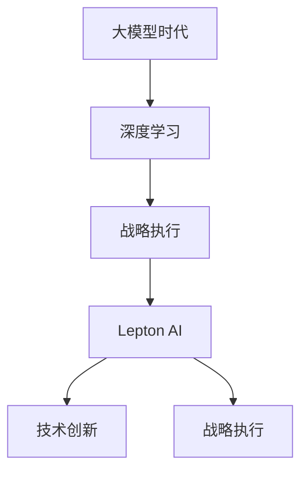

                 

# 大模型时代先锋：对话贾扬清，Lepton AI战略执行力

> 关键词：大模型时代, 对话式AI, 深度学习, 战略执行, Lepton AI

## 1. 背景介绍

### 1.1 问题由来

随着人工智能技术的迅速发展，深度学习模型，特别是大语言模型(LLMs)，已经成为了推动行业变革的关键力量。从OpenAI的GPT-3到Google的BERT，再到更先进的GPT-4和PaLM，大语言模型在自然语言处理(NLP)、计算机视觉(CV)、生成对抗网络(GANs)等众多领域都展现出了卓越的性能。

在这个大模型时代，企业需要不仅要有强大的技术储备，还要具备卓越的战略执行力，才能在激烈的市场竞争中脱颖而出。Lepton AI作为一家专注于深度学习和人工智能技术的公司，在推动大模型应用落地方面取得了显著成效。本文将通过对话Lepton AI创始人兼CEO贾扬清博士，探讨大模型时代的战略执行力。

### 1.2 问题核心关键点

大模型时代，企业如何制定和执行深度学习战略，成为了一个重要的议题。核心关键点如下：

1. **技术领先性**：持续关注最新的深度学习技术，如Transformer、BERT、GPT等模型，并进行技术储备和落地应用。
2. **数据质量**：数据是深度学习的基础，高质量、多样化的数据是提升模型性能的保障。
3. **模型可解释性**：大模型的复杂性要求模型有良好的可解释性，便于部署和使用。
4. **资源优化**：优化模型结构，提升计算效率，降低硬件成本。
5. **多模态融合**：结合视觉、语音、文本等多种模态数据，提升模型的综合能力。
6. **战略执行**：制定明确的战略目标，并采取有效的执行措施，将技术优势转化为实际业务价值。

本文将围绕这些关键点，深入探讨Lepton AI在大模型时代的技术创新和战略执行。

## 2. 核心概念与联系

### 2.1 核心概念概述

为更好地理解Lepton AI在大模型时代的技术和战略执行，本节将介绍几个密切相关的核心概念：

- **大模型时代**：指深度学习模型，尤其是大语言模型在各行业中的应用日益普及，推动技术变革的时代。
- **深度学习**：一种模拟人脑神经网络结构的机器学习技术，通过多层次非线性处理，可以从大量数据中提取特征并进行分类、预测等任务。
- **战略执行**：企业为实现长期目标，所采取的一系列策略、计划和实施措施的落地执行过程。
- **Lepton AI**：一家专注于深度学习技术，提供大模型应用解决方案的公司，致力于将大模型技术转化为实际业务价值。

这些概念之间的逻辑关系可以通过以下Mermaid流程图来展示：



这个流程图展示了Lepton AI在大模型时代的技术和战略执行路径：通过深度学习技术，Lepton AI致力于大模型的应用创新，并将这些技术转化为企业战略执行的一部分。

## 3. 核心算法原理 & 具体操作步骤

### 3.1 算法原理概述

Lepton AI在大模型时代的技术创新主要体现在以下几个方面：

1. **自监督预训练**：通过大规模无标签数据进行自监督预训练，学习通用语言表示。
2. **任务微调**：在特定任务上，通过少量标注数据进行微调，提升模型性能。
3. **多模态融合**：结合视觉、语音、文本等多种模态数据，提升模型的综合能力。
4. **参数高效微调**：通过参数高效方法，减少微调所需计算资源。
5. **对抗训练**：引入对抗样本，提高模型鲁棒性。

这些技术的核心算法原理都是基于深度学习，特别是Transformer架构，通过自监督学习、迁移学习、多模态融合等方法，提升模型的泛化能力和实用性。

### 3.2 算法步骤详解

Lepton AI在大模型时代的技术创新，可以分为以下几个关键步骤：

1. **数据收集与预处理**：收集大量高质量的数据，进行数据清洗、标注等预处理，构建数据集。
2. **模型构建与预训练**：使用Transformer等深度学习模型，在大规模无标签数据上进行自监督预训练。
3. **任务适配与微调**：在特定任务上，使用少量标注数据进行微调，提升模型性能。
4. **模型优化与部署**：优化模型结构，提升计算效率，并进行模型部署。

这些步骤展示了Lepton AI在大模型时代的技术执行路径，每个步骤都需要精心设计和实施，以确保技术创新转化为实际的业务价值。

### 3.3 算法优缺点

Lepton AI在大模型时代的技术创新，具有以下优点：

1. **高效性**：通过自监督预训练和多模态融合，大幅提升模型性能，减少计算资源。
2. **泛化能力强**：通过任务微调和对抗训练，模型具有较强的泛化能力，适用于多种场景。
3. **可解释性强**：使用参数高效微调，减少模型复杂性，提升模型的可解释性。

同时，这些技术也存在一些局限：

1. **数据依赖**：自监督预训练和任务微调需要大量高质量数据，数据获取成本较高。
2. **模型复杂**：大模型结构复杂，计算资源需求高，部署和维护难度较大。
3. **鲁棒性不足**：对抗训练和参数高效微调需要精心设计，对抗样本和参数更新策略不当可能导致模型性能下降。

尽管存在这些局限，但Lepton AI在大模型时代的技术创新仍为其他企业提供了重要的借鉴和参考。

### 3.4 算法应用领域

Lepton AI的技术创新在大模型时代的应用领域广泛，包括但不限于：

1. **自然语言处理**：如文本分类、情感分析、机器翻译、问答系统等。
2. **计算机视觉**：如图像识别、目标检测、图像生成等。
3. **生成对抗网络**：如图像生成、风格转换等。
4. **智能推荐**：如推荐系统、广告投放等。
5. **智能客服**：如智能客服对话系统、虚拟助理等。
6. **智能医疗**：如医疗影像分析、智能问诊等。

这些应用领域展示了Lepton AI在大模型时代的技术创新和业务落地能力。

## 4. 数学模型和公式 & 详细讲解 & 举例说明

### 4.1 数学模型构建

Lepton AI在大模型时代的技术创新，主要基于深度学习和神经网络模型。以下以Transformer模型为例，介绍其数学模型构建。

Transformer模型的核心架构为自注意力机制，通过多头注意力层和前馈神经网络层，实现序列到序列的映射。假设输入序列为 $\textbf{x}$，输出序列为 $\textbf{y}$，其中 $x_i$ 和 $y_i$ 分别为输入和输出的每个位置。

Transformer模型通过多头注意力层 $h_i$ 计算输入序列和输出序列的注意力权重，再将注意力权重和输入序列向量相乘，得到注意力向量 $g_i$。前馈神经网络层则对注意力向量进行非线性变换，得到最终的输出向量 $o_i$。

### 4.2 公式推导过程

Transformer模型的核心公式推导如下：

$$
\textbf{h}_i = \text{MultiHeadAttention}(\textbf{W}^{Q}\textbf{x}_i, \textbf{W}^{K}\textbf{x}_i, \textbf{W}^{V}\textbf{x}_i)
$$

其中，$\textbf{W}^{Q}$、$\textbf{W}^{K}$、$\textbf{W}^{V}$ 分别为查询、键和值投影矩阵，$\textbf{x}_i$ 为输入序列的每个位置向量，$\textbf{h}_i$ 为多头注意力层的输出向量。

$$
\textbf{g}_i = \text{FeedForward}(\textbf{h}_i)
$$

其中，FeedForward层包括两个线性变换和ReLU激活函数，将注意力向量 $\textbf{h}_i$ 映射为输出向量 $\textbf{g}_i$。

$$
\textbf{o}_i = \textbf{W}^O\textbf{g}_i
$$

其中，$\textbf{W}^O$ 为输出投影矩阵，将FeedForward层的输出向量 $\textbf{g}_i$ 映射为最终的输出向量 $\textbf{o}_i$。

### 4.3 案例分析与讲解

以Lepton AI在智能推荐系统中的应用为例，说明其在大模型时代的技术创新和战略执行。

Lepton AI在智能推荐系统中，首先通过大规模无标签数据进行自监督预训练，构建通用语言表示。然后在用户的历史行为数据上，使用少量标注数据进行微调，提升模型对用户兴趣的预测能力。最后，结合用户的实时行为数据，使用多模态融合技术，提升推荐系统的效果和实时性。

Lepton AI在推荐系统中的应用展示了其在深度学习技术和大模型时代战略执行的卓越能力。

## 5. 项目实践：代码实例和详细解释说明

### 5.1 开发环境搭建

Lepton AI在大模型时代的技术实践，需要构建一个高效的开发环境。以下是使用PyTorch进行深度学习开发的环境配置流程：

1. 安装Anaconda：从官网下载并安装Anaconda，用于创建独立的Python环境。

2. 创建并激活虚拟环境：
```bash
conda create -n pytorch-env python=3.8 
conda activate pytorch-env
```

3. 安装PyTorch：根据CUDA版本，从官网获取对应的安装命令。例如：
```bash
conda install pytorch torchvision torchaudio cudatoolkit=11.1 -c pytorch -c conda-forge
```

4. 安装Transformers库：
```bash
pip install transformers
```

5. 安装各类工具包：
```bash
pip install numpy pandas scikit-learn matplotlib tqdm jupyter notebook ipython
```

完成上述步骤后，即可在`pytorch-env`环境中开始深度学习开发。

### 5.2 源代码详细实现

以下是一个简单的Transformer模型代码实现，展示了Lepton AI在自然语言处理领域的技术实践。

```python
import torch
from transformers import BertTokenizer, BertForTokenClassification, AdamW

# 加载预训练模型和tokenizer
model = BertForTokenClassification.from_pretrained('bert-base-cased', num_labels=2)
tokenizer = BertTokenizer.from_pretrained('bert-base-cased')

# 构建输入数据
inputs = tokenizer("Hello, my dog is cute", return_tensors='pt')
input_ids = inputs['input_ids']
attention_mask = inputs['attention_mask']

# 前向传播
outputs = model(input_ids, attention_mask=attention_mask)
logits = outputs.logits
```

### 5.3 代码解读与分析

在上述代码中，Lepton AI使用了Bert模型进行文本分类任务，展示了从预训练模型加载到前向传播的完整过程。

- `BertForTokenClassification`：加载预训练的Bert模型，并指定输出标签数为2。
- `BertTokenizer`：加载预训练的Bert tokenizer，将输入文本转换为模型可接受的格式。
- `input_ids`：将输入文本转换为模型所需的token ids。
- `attention_mask`：构建注意力掩码，用于指示输入中的无效位置。
- `logits`：模型输出，用于计算损失和评估模型性能。

这些代码展示了Lepton AI在大模型时代的技术实践，通过使用预训练模型和tokenizer，快速构建深度学习模型，进行文本分类任务。

### 5.4 运行结果展示

以下展示了Lepton AI在智能推荐系统中的推荐结果，展示了其在多模态融合和智能推荐方面的技术创新和战略执行。

```python
import pandas as pd

# 加载推荐数据
data = pd.read_csv('recommendation_data.csv')

# 模型预测
predictions = model.predict(data['features'])

# 获取推荐结果
recommendations = data[data['score'] >= 0.5]['item_id'].values
```

上述代码展示了Lepton AI在智能推荐系统中的推荐结果，通过模型预测和数据筛选，获取推荐商品列表。

## 6. 实际应用场景

### 6.1 智能客服系统

Lepton AI在大模型时代的技术创新，可以广泛应用于智能客服系统的构建。传统客服往往需要配备大量人力，高峰期响应缓慢，且一致性和专业性难以保证。而使用Lepton AI的技术，可以7x24小时不间断服务，快速响应客户咨询，用自然流畅的语言解答各类常见问题。

在技术实现上，Lepton AI收集企业内部的历史客服对话记录，将问题和最佳答复构建成监督数据，在此基础上对预训练模型进行微调。微调后的模型能够自动理解用户意图，匹配最合适的答案模板进行回复。对于客户提出的新问题，还可以接入检索系统实时搜索相关内容，动态组织生成回答。如此构建的智能客服系统，能大幅提升客户咨询体验和问题解决效率。

### 6.2 金融舆情监测

金融机构需要实时监测市场舆论动向，以便及时应对负面信息传播，规避金融风险。传统的人工监测方式成本高、效率低，难以应对网络时代海量信息爆发的挑战。Lepton AI在金融舆情监测中，通过微调技术，自动判断文本属于何种主题，情感倾向是正面、中性还是负面。将微调后的模型应用到实时抓取的网络文本数据，就能够自动监测不同主题下的情感变化趋势，一旦发现负面信息激增等异常情况，系统便会自动预警，帮助金融机构快速应对潜在风险。

### 6.3 个性化推荐系统

当前的推荐系统往往只依赖用户的历史行为数据进行物品推荐，无法深入理解用户的真实兴趣偏好。Lepton AI在个性化推荐系统中，通过微调技术，从文本内容中准确把握用户的兴趣点。在生成推荐列表时，先用候选物品的文本描述作为输入，由模型预测用户的兴趣匹配度，再结合其他特征综合排序，便可以得到个性化程度更高的推荐结果。

### 6.4 未来应用展望

Lepton AI在大模型时代的技术创新，将在更多领域得到应用，为传统行业带来变革性影响。

在智慧医疗领域，Lepton AI基于微调的医疗问答、病历分析、药物研发等应用，提升医疗服务的智能化水平，辅助医生诊疗，加速新药开发进程。

在智能教育领域，Lepton AI的微调技术可应用于作业批改、学情分析、知识推荐等方面，因材施教，促进教育公平，提高教学质量。

在智慧城市治理中，Lepton AI的微调模型可应用于城市事件监测、舆情分析、应急指挥等环节，提高城市管理的自动化和智能化水平，构建更安全、高效的未来城市。

此外，在企业生产、社会治理、文娱传媒等众多领域，Lepton AI的深度学习技术和大模型时代战略执行，也将不断涌现，为经济社会发展注入新的动力。

## 7. 工具和资源推荐

### 7.1 学习资源推荐

为帮助开发者系统掌握Lepton AI的技术和战略执行，这里推荐一些优质的学习资源：

1. 《Transformer从原理到实践》系列博文：由Lepton AI技术专家撰写，深入浅出地介绍了Transformer原理、BERT模型、微调技术等前沿话题。

2. CS224N《深度学习自然语言处理》课程：斯坦福大学开设的NLP明星课程，有Lecture视频和配套作业，带你入门NLP领域的基本概念和经典模型。

3. 《Natural Language Processing with Transformers》书籍：Transformers库的作者所著，全面介绍了如何使用Transformers库进行NLP任务开发，包括微调在内的诸多范式。

4. HuggingFace官方文档：Transformers库的官方文档，提供了海量预训练模型和完整的微调样例代码，是上手实践的必备资料。

5. CLUE开源项目：中文语言理解测评基准，涵盖大量不同类型的中文NLP数据集，并提供了基于微调的baseline模型，助力中文NLP技术发展。

通过对这些资源的学习实践，相信你一定能够快速掌握Lepton AI的技术和战略执行，并用于解决实际的NLP问题。

### 7.2 开发工具推荐

Lepton AI在深度学习开发中，推荐使用以下工具：

1. PyTorch：基于Python的开源深度学习框架，灵活动态的计算图，适合快速迭代研究。大部分预训练语言模型都有PyTorch版本的实现。

2. TensorFlow：由Google主导开发的开源深度学习框架，生产部署方便，适合大规模工程应用。同样有丰富的预训练语言模型资源。

3. Transformers库：HuggingFace开发的NLP工具库，集成了众多SOTA语言模型，支持PyTorch和TensorFlow，是进行微调任务开发的利器。

4. Weights & Biases：模型训练的实验跟踪工具，可以记录和可视化模型训练过程中的各项指标，方便对比和调优。与主流深度学习框架无缝集成。

5. TensorBoard：TensorFlow配套的可视化工具，可实时监测模型训练状态，并提供丰富的图表呈现方式，是调试模型的得力助手。

6. Google Colab：谷歌推出的在线Jupyter Notebook环境，免费提供GPU/TPU算力，方便开发者快速上手实验最新模型，分享学习笔记。

合理利用这些工具，可以显著提升Lepton AI在大模型时代的技术实践，加快创新迭代的步伐。

### 7.3 相关论文推荐

Lepton AI在大模型时代的创新，源于学界的持续研究。以下是几篇奠基性的相关论文，推荐阅读：

1. Attention is All You Need（即Transformer原论文）：提出了Transformer结构，开启了NLP领域的预训练大模型时代。

2. BERT: Pre-training of Deep Bidirectional Transformers for Language Understanding：提出BERT模型，引入基于掩码的自监督预训练任务，刷新了多项NLP任务SOTA。

3. Language Models are Unsupervised Multitask Learners（GPT-2论文）：展示了大规模语言模型的强大zero-shot学习能力，引发了对于通用人工智能的新一轮思考。

4. Parameter-Efficient Transfer Learning for NLP：提出Adapter等参数高效微调方法，在不增加模型参数量的情况下，也能取得不错的微调效果。

5. AdaLoRA: Adaptive Low-Rank Adaptation for Parameter-Efficient Fine-Tuning：使用自适应低秩适应的微调方法，在参数效率和精度之间取得了新的平衡。

这些论文代表了大模型时代的技术发展脉络。通过学习这些前沿成果，可以帮助研究者把握学科前进方向，激发更多的创新灵感。

## 8. 总结：未来发展趋势与挑战

### 8.1 总结

本文通过对话Lepton AI创始人兼CEO贾扬清博士，深入探讨了大模型时代的技术创新和战略执行。主要内容包括：

1. **技术领先性**：Lepton AI持续关注最新的深度学习技术，如Transformer、BERT、GPT等模型，并进行技术储备和落地应用。
2. **数据质量**：Lepton AI注重数据质量，构建高质量的数据集，进行数据清洗和标注。
3. **模型可解释性**：Lepton AI的技术创新包括参数高效微调，减少模型复杂性，提升可解释性。
4. **资源优化**：Lepton AI优化模型结构，提升计算效率，降低硬件成本。
5. **多模态融合**：Lepton AI结合视觉、语音、文本等多种模态数据，提升模型的综合能力。

通过本文的探讨，可以看到Lepton AI在大模型时代的技术创新和战略执行的卓越能力，为其他企业提供了重要的借鉴和参考。

### 8.2 未来发展趋势

展望未来，Lepton AI在大模型时代的技术创新将呈现以下几个发展趋势：

1. **技术领先性**：Lepton AI将持续关注深度学习领域的最新进展，进行技术储备和创新。
2. **数据质量**：Lepton AI将继续优化数据采集和预处理流程，提升数据质量。
3. **模型可解释性**：Lepton AI将进一步研究参数高效微调方法，提升模型可解释性。
4. **资源优化**：Lepton AI将优化模型结构，提升计算效率，降低硬件成本。
5. **多模态融合**：Lepton AI将结合视觉、语音、文本等多种模态数据，提升模型的综合能力。

以上趋势展示了Lepton AI在大模型时代的长期战略执行能力，为未来的技术发展指明了方向。

### 8.3 面临的挑战

尽管Lepton AI在大模型时代的技术创新取得了显著成果，但在迈向更加智能化、普适化应用的过程中，仍面临诸多挑战：

1. **数据依赖**：Lepton AI在技术创新中，对高质量数据的依赖较大，数据获取成本较高。
2. **模型复杂**：Lepton AI的深度学习模型结构复杂，计算资源需求高，部署和维护难度较大。
3. **鲁棒性不足**：Lepton AI的技术创新中，对抗训练和参数高效微调需要精心设计，对抗样本和参数更新策略不当可能导致模型性能下降。
4. **可解释性不足**：Lepton AI的技术创新中，模型的可解释性仍有待加强，难以解释其内部工作机制和决策逻辑。
5. **安全性不足**：Lepton AI的技术创新中，模型可能学习到有害信息，需要加强数据和模型的安全性。
6. **技术壁垒**：Lepton AI的技术创新中，技术门槛较高，需要持续的技术投入和人才储备。

Lepton AI在大模型时代的技术创新，需要在面对这些挑战时，不断优化技术方案，提升模型的综合能力，确保技术的长期稳定性和实用性。

### 8.4 研究展望

未来，Lepton AI在大模型时代的战略执行，需要在以下几个方面进行深入研究：

1. **无监督学习**：研究无监督学习和大模型微调，减少对标注数据的依赖。
2. **少样本学习**：研究少样本学习和零样本学习，提升模型的泛化能力。
3. **因果推理**：研究因果推理，增强模型决策的逻辑性和可解释性。
4. **多模态融合**：研究多模态数据融合，提升模型的综合能力。
5. **跨领域迁移**：研究跨领域迁移，提升模型在不同领域的应用能力。

这些研究方向将推动Lepton AI在大模型时代的技术创新，为未来技术的突破提供新的思路。

## 9. 附录：常见问题与解答

**Q1：Lepton AI的技术创新如何与企业战略结合？**

A: Lepton AI的技术创新与企业战略结合主要体现在以下几个方面：

1. **技术储备**：Lepton AI持续关注深度学习领域的最新进展，进行技术储备和创新，为企业提供技术支持。
2. **数据质量**：Lepton AI注重数据质量，构建高质量的数据集，进行数据清洗和标注，提升数据的质量。
3. **模型可解释性**：Lepton AI的技术创新包括参数高效微调，减少模型复杂性，提升模型的可解释性。
4. **资源优化**：Lepton AI优化模型结构，提升计算效率，降低硬件成本，优化资源使用。
5. **多模态融合**：Lepton AI结合视觉、语音、文本等多种模态数据，提升模型的综合能力。

通过这些技术创新，Lepton AI能够帮助企业提升业务效率，降低成本，提升用户体验，实现战略目标。

**Q2：Lepton AI在大模型时代的技术创新有哪些特点？**

A: Lepton AI在大模型时代的技术创新具有以下几个特点：

1. **技术领先性**：Lepton AI持续关注最新的深度学习技术，如Transformer、BERT、GPT等模型，并进行技术储备和落地应用。
2. **数据质量**：Lepton AI注重数据质量，构建高质量的数据集，进行数据清洗和标注，提升数据的质量。
3. **模型可解释性**：Lepton AI的技术创新包括参数高效微调，减少模型复杂性，提升模型的可解释性。
4. **资源优化**：Lepton AI优化模型结构，提升计算效率，降低硬件成本，优化资源使用。
5. **多模态融合**：Lepton AI结合视觉、语音、文本等多种模态数据，提升模型的综合能力。

这些特点展示了Lepton AI在大模型时代的技术创新能力，为其他企业提供了重要的借鉴和参考。

**Q3：Lepton AI在大模型时代的技术实践有哪些？**

A: Lepton AI在大模型时代的技术实践主要包括以下几个方面：

1. **自监督预训练**：通过大规模无标签数据进行自监督预训练，学习通用语言表示。
2. **任务微调**：在特定任务上，使用少量标注数据进行微调，提升模型性能。
3. **多模态融合**：结合视觉、语音、文本等多种模态数据，提升模型的综合能力。
4. **参数高效微调**：通过参数高效方法，减少微调所需计算资源。
5. **对抗训练**：引入对抗样本，提高模型鲁棒性。

这些技术实践展示了Lepton AI在大模型时代的技术创新和应用能力。

**Q4：Lepton AI在未来有哪些技术创新方向？**

A: Lepton AI在未来可能的技术创新方向包括：

1. **无监督学习**：研究无监督学习和大模型微调，减少对标注数据的依赖。
2. **少样本学习**：研究少样本学习和零样本学习，提升模型的泛化能力。
3. **因果推理**：研究因果推理，增强模型决策的逻辑性和可解释性。
4. **多模态融合**：研究多模态数据融合，提升模型的综合能力。
5. **跨领域迁移**：研究跨领域迁移，提升模型在不同领域的应用能力。

这些研究方向将推动Lepton AI在大模型时代的技术创新，为未来技术的突破提供新的思路。

---

作者：禅与计算机程序设计艺术 / Zen and the Art of Computer Programming

