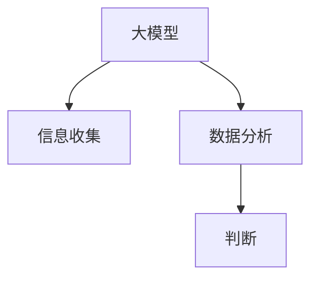

                 

# 大模型时代的创业者决策力训练：信息收集、分析与判断

> 关键词：大模型, 决策力训练, 信息收集, 数据分析, 判断, 人工智能(AI), 机器学习(ML), 深度学习(DL), 自然语言处理(NLP)

## 1. 背景介绍

### 1.1 问题由来
随着人工智能(AI)和大模型技术的迅猛发展，大模型已经在各个领域中发挥了重要作用。对于创业者而言，如何运用大模型来提升决策力，成为当前的一大挑战。大模型能够处理海量数据，提供深入的分析和见解，然而，如何合理地收集、分析和利用这些信息，形成有效的判断，依然是一个值得深入探讨的问题。本文将从信息收集、数据分析、判断决策三个角度，系统介绍大模型在创业者决策力训练中的应用。

### 1.2 问题核心关键点
决策力训练的核心在于信息的高效收集、深度分析和合理判断。而大模型的出现，为信息的自动化收集和深度分析提供了强大的工具。但如何合理地利用这些信息，形成有效的判断，则是一个多维度、多层次的挑战。这需要我们深入了解大模型的原理、特点和应用，结合决策科学的方法，才能在实际应用中取得成功。

### 1.3 问题研究意义
提升创业者的决策力，是提升创业成功率的关键。大模型的应用，能够帮助创业者在信息收集、数据分析、判断决策等方面，实现更高效、更准确的结果。通过合理运用大模型，创业者可以在市场变化、技术趋势、竞争态势等方面，做出更为科学的决策。因此，研究大模型在创业者决策力训练中的应用，具有重要意义：

1. 提升决策准确性：大模型能够处理和分析大量数据，提供基于数据的决策支持，提升决策的科学性和准确性。
2. 降低决策风险：通过深入的数据分析和模型预测，降低因信息不完全或判断失误带来的决策风险。
3. 提升决策效率：自动化信息收集和分析，节省时间和精力，加快决策速度。
4. 优化决策过程：提供多维度、多层次的数据分析，帮助创业者更全面地理解问题和制定策略。

## 2. 核心概念与联系

### 2.1 核心概念概述

为更好地理解大模型在创业者决策力训练中的应用，本节将介绍几个密切相关的核心概念：

- **大模型(Large Model)**：指通过预训练和微调，能够在特定任务上达到高精度的模型。如GPT、BERT等。
- **决策力(Decision-Making)**：指在复杂环境中，通过信息收集、分析和判断，做出最优决策的能力。
- **信息收集(Information Collection)**：指获取与决策相关的各种数据和信息的过程。
- **数据分析(Analysis)**：指对收集到的信息进行统计、处理和分析，提取有价值的信息。
- **判断(Judgment)**：指基于分析和数据，做出合理、科学、符合逻辑的决策。

这些核心概念之间的逻辑关系可以通过以下Mermaid流程图来展示：



这个流程图展示了大模型在信息收集、数据分析、判断决策三个阶段的核心作用：

1. 大模型通过处理海量数据，自动化地收集和获取相关信息。
2. 对收集到的信息进行深度分析，提取有价值的洞察和结论。
3. 基于分析结果，进行合理判断，做出科学决策。

## 3. 核心算法原理 & 具体操作步骤

### 3.1 算法原理概述

大模型在创业者决策力训练中的应用，本质上是一个信息收集、分析和判断的过程。其核心思想是：利用大模型的强大信息处理能力，自动化地收集、分析数据，并结合决策科学的方法，形成合理的判断和决策。

### 3.2 算法步骤详解

大模型在决策力训练中的应用，一般包括以下几个关键步骤：

**Step 1: 准备数据和模型**
- 收集与决策相关的数据，包括市场数据、用户反馈、竞争对手信息等。
- 选择合适的预训练模型，如GPT、BERT、T5等，并根据任务需求进行微调。

**Step 2: 数据预处理和特征提取**
- 对收集到的数据进行清洗、去重、归一化等预处理，确保数据质量。
- 使用大模型对数据进行特征提取，将文本、图像、音频等信息转化为模型能够理解的形式。

**Step 3: 模型训练和参数优化**
- 将预处理后的数据输入模型，进行训练和优化。选择合适的优化算法和学习率，防止过拟合。
- 使用正则化技术，如L2正则、Dropout等，提高模型鲁棒性。

**Step 4: 结果分析和决策支持**
- 使用训练好的模型对新数据进行预测，提供决策建议。
- 结合人工判断，综合考虑模型预测和现实情况，做出最优决策。

### 3.3 算法优缺点

大模型在决策力训练中具有以下优点：
1. 数据处理能力强：大模型能够处理海量数据，自动化地收集和分析相关信息。
2. 分析深度高：大模型具有强大的深度学习能力，能够从数据中提取深层次的洞察。
3. 决策辅助性强：模型预测和建议可以作为决策的重要依据，提升决策准确性。

同时，该方法也存在一定的局限性：
1. 数据质量依赖高：模型的效果依赖于数据的质量和多样性。
2. 模型复杂度高：大模型参数量大，需要较强的计算资源和存储空间。
3. 模型可解释性差：大模型的决策过程缺乏可解释性，难以理解和调试。

尽管存在这些局限性，但就目前而言，大模型在决策力训练中的应用，仍具有不可替代的优势。未来相关研究的重点在于如何进一步提高模型的可解释性，降低对计算资源的依赖，提高决策过程的透明性和可理解性。

### 3.4 算法应用领域

大模型在决策力训练中的应用，已经在多个领域中得到了应用，例如：

- **市场预测**：利用大模型对市场数据进行分析，预测未来市场趋势。
- **用户行为分析**：分析用户反馈和行为数据，提升用户体验和产品优化。
- **竞争对手分析**：分析竞争对手的信息和动向，制定竞争策略。
- **风险评估**：对金融、保险等领域的数据进行分析，评估风险。
- **健康医疗决策**：利用大模型对患者数据进行分析，辅助医生诊断和治疗。
- **智能客服**：利用大模型对用户咨询进行自动化分析，提供智能回复。

除了上述这些经典应用外，大模型还被创新性地应用于更多场景中，如情感分析、舆情监测、内容推荐等，为决策力训练提供了新的方向。随着大模型技术的不断进步，相信在更多领域中，大模型将发挥更大的作用，帮助创业者做出更加科学、准确的决策。

## 4. 数学模型和公式 & 详细讲解 & 举例说明

### 4.1 数学模型构建

本节将使用数学语言对大模型在决策力训练中的应用进行更加严格的刻画。

设决策问题为 $P$，收集到的相关数据为 $D=\{x_i\}_{i=1}^N$，其中 $x_i$ 为 $P$ 相关的特征向量。假设大模型为 $M_{\theta}$，其中 $\theta$ 为模型参数。

定义大模型的损失函数为 $\mathcal{L}(M_{\theta},D)$，表示模型在数据集 $D$ 上的预测与真实标签之间的差异。在决策问题 $P$ 上，模型的预测结果为 $y=argmax M_{\theta}(x)$，表示在所有可能的结果中，选择预测概率最大的结果。

大模型的优化目标是最小化损失函数 $\mathcal{L}(M_{\theta},D)$，即找到最优参数 $\theta$：

$$
\theta^* = \mathop{\arg\min}_{\theta} \mathcal{L}(M_{\theta},D)
$$

在实践中，我们通常使用基于梯度的优化算法（如SGD、Adam等）来近似求解上述最优化问题。设 $\eta$ 为学习率，$\lambda$ 为正则化系数，则参数的更新公式为：

$$
\theta \leftarrow \theta - \eta \nabla_{\theta}\mathcal{L}(\theta) - \eta\lambda\theta
$$

其中 $\nabla_{\theta}\mathcal{L}(\theta)$ 为损失函数对参数 $\theta$ 的梯度，可通过反向传播算法高效计算。

### 4.2 公式推导过程

以下我们以市场预测任务为例，推导大模型的预测结果及其梯度的计算公式。

设市场预测问题为 $P$，输入为 $x$，输出为 $y$。假设模型 $M_{\theta}$ 在输入 $x$ 上的输出为 $\hat{y}=M_{\theta}(x) \in [0,1]$，表示样本属于某一市场的概率。真实标签 $y \in \{0,1\}$。则预测结果为：

$$
\hat{y} = softmax(M_{\theta}(x))
$$

其中 $softmax$ 函数将模型的输出转化为概率分布。预测结果 $\hat{y}$ 与真实标签 $y$ 的损失函数为：

$$
\ell(M_{\theta}(x),y) = -[y\log \hat{y} + (1-y)\log (1-\hat{y})]
$$

将其代入经验风险公式，得：

$$
\mathcal{L}(\theta) = -\frac{1}{N}\sum_{i=1}^N [y_i\log M_{\theta}(x_i)+(1-y_i)\log(1-M_{\theta}(x_i))]
$$

根据链式法则，损失函数对参数 $\theta_k$ 的梯度为：

$$
\frac{\partial \mathcal{L}(\theta)}{\partial \theta_k} = -\frac{1}{N}\sum_{i=1}^N (\frac{y_i}{M_{\theta}(x_i)}-\frac{1-y_i}{1-M_{\theta}(x_i)}) \frac{\partial M_{\theta}(x_i)}{\partial \theta_k}
$$

其中 $\frac{\partial M_{\theta}(x_i)}{\partial \theta_k}$ 可进一步递归展开，利用自动微分技术完成计算。

### 4.3 案例分析与讲解

假设我们利用大模型对一家电商平台的市场趋势进行预测。首先，收集过去一年内的销售数据、用户行为数据、市场宏观数据等，作为输入 $x$。然后，使用大模型 $M_{\theta}$ 对输入 $x$ 进行特征提取和预测，得到预测结果 $\hat{y}$。接着，在实际的市场表现数据中，计算模型预测结果与真实销售数据之间的差异，得到损失函数 $\mathcal{L}(\theta)$。最后，通过梯度下降算法，更新模型参数 $\theta$，最小化损失函数 $\mathcal{L}(\theta)$，得到最优模型参数 $\theta^*$。

## 5. 项目实践：代码实例和详细解释说明

### 5.1 开发环境搭建

在进行决策力训练实践前，我们需要准备好开发环境。以下是使用Python进行PyTorch开发的环境配置流程：

1. 安装Anaconda：从官网下载并安装Anaconda，用于创建独立的Python环境。

2. 创建并激活虚拟环境：
```bash
conda create -n pytorch-env python=3.8 
conda activate pytorch-env
```

3. 安装PyTorch：根据CUDA版本，从官网获取对应的安装命令。例如：
```bash
conda install pytorch torchvision torchaudio cudatoolkit=11.1 -c pytorch -c conda-forge
```

4. 安装TensorFlow：
```bash
conda install tensorflow -c conda-forge
```

5. 安装各类工具包：
```bash
pip install numpy pandas scikit-learn matplotlib tqdm jupyter notebook ipython
```

完成上述步骤后，即可在`pytorch-env`环境中开始决策力训练实践。

### 5.2 源代码详细实现

这里我们以电商平台的市场预测任务为例，给出使用Transformers库对GPT模型进行训练和预测的PyTorch代码实现。

首先，定义数据预处理函数：

```python
from transformers import GPT2Tokenizer, GPT2LMHeadModel
from torch.utils.data import Dataset
import torch

class MarketDataset(Dataset):
    def __init__(self, data, tokenizer, max_len=128):
        self.data = data
        self.tokenizer = tokenizer
        self.max_len = max_len
        
    def __len__(self):
        return len(self.data)
    
    def __getitem__(self, item):
        text = self.data[item]
        encoding = self.tokenizer(text, return_tensors='pt', max_length=self.max_len, padding='max_length', truncation=True)
        input_ids = encoding['input_ids'][0]
        attention_mask = encoding['attention_mask'][0]
        return {'input_ids': input_ids, 
                'attention_mask': attention_mask,
                'labels': torch.tensor([0.0 if label == 'low' else 1.0], dtype=torch.float32)}
```

然后，定义模型和优化器：

```python
from transformers import AdamW

model = GPT2LMHeadModel.from_pretrained('gpt2', num_labels=2)
optimizer = AdamW(model.parameters(), lr=2e-5)
```

接着，定义训练和评估函数：

```python
from torch.utils.data import DataLoader
from tqdm import tqdm
from sklearn.metrics import classification_report

device = torch.device('cuda') if torch.cuda.is_available() else torch.device('cpu')
model.to(device)

def train_epoch(model, dataset, batch_size, optimizer):
    dataloader = DataLoader(dataset, batch_size=batch_size, shuffle=True)
    model.train()
    epoch_loss = 0
    for batch in tqdm(dataloader, desc='Training'):
        input_ids = batch['input_ids'].to(device)
        attention_mask = batch['attention_mask'].to(device)
        labels = batch['labels'].to(device)
        model.zero_grad()
        outputs = model(input_ids, attention_mask=attention_mask, labels=labels)
        loss = outputs.loss
        epoch_loss += loss.item()
        loss.backward()
        optimizer.step()
    return epoch_loss / len(dataloader)

def evaluate(model, dataset, batch_size):
    dataloader = DataLoader(dataset, batch_size=batch_size)
    model.eval()
    preds, labels = [], []
    with torch.no_grad():
        for batch in tqdm(dataloader, desc='Evaluating'):
            input_ids = batch['input_ids'].to(device)
            attention_mask = batch['attention_mask'].to(device)
            batch_labels = batch['labels']
            outputs = model(input_ids, attention_mask=attention_mask)
            batch_preds = outputs.logits.argmax(dim=2).to('cpu').tolist()
            batch_labels = batch_labels.to('cpu').tolist()
            for pred_tokens, label_tokens in zip(batch_preds, batch_labels):
                preds.append(pred_tokens[:len(label_tokens)])
                labels.append(label_tokens)
                
    print(classification_report(labels, preds))
```

最后，启动训练流程并在测试集上评估：

```python
epochs = 5
batch_size = 16

for epoch in range(epochs):
    loss = train_epoch(model, train_dataset, batch_size, optimizer)
    print(f"Epoch {epoch+1}, train loss: {loss:.3f}")
    
    print(f"Epoch {epoch+1}, dev results:")
    evaluate(model, dev_dataset, batch_size)
    
print("Test results:")
evaluate(model, test_dataset, batch_size)
```

以上就是使用PyTorch对GPT模型进行市场预测任务训练和评估的完整代码实现。可以看到，得益于Transformers库的强大封装，我们可以用相对简洁的代码完成GPT模型的训练和预测。

### 5.3 代码解读与分析

让我们再详细解读一下关键代码的实现细节：

**MarketDataset类**：
- `__init__`方法：初始化数据、分词器等关键组件。
- `__len__`方法：返回数据集的样本数量。
- `__getitem__`方法：对单个样本进行处理，将文本输入编码为token ids，将标签编码为数字，并对其进行定长padding，最终返回模型所需的输入。

**训练和评估函数**：
- 使用PyTorch的DataLoader对数据集进行批次化加载，供模型训练和推理使用。
- 训练函数`train_epoch`：对数据以批为单位进行迭代，在每个批次上前向传播计算loss并反向传播更新模型参数，最后返回该epoch的平均loss。
- 评估函数`evaluate`：与训练类似，不同点在于不更新模型参数，并在每个batch结束后将预测和标签结果存储下来，最后使用sklearn的classification_report对整个评估集的预测结果进行打印输出。

**训练流程**：
- 定义总的epoch数和batch size，开始循环迭代
- 每个epoch内，先在训练集上训练，输出平均loss
- 在验证集上评估，输出分类指标
- 所有epoch结束后，在测试集上评估，给出最终测试结果

可以看到，PyTorch配合Transformers库使得GPT模型训练和预测的代码实现变得简洁高效。开发者可以将更多精力放在数据处理、模型改进等高层逻辑上，而不必过多关注底层的实现细节。

当然，工业级的系统实现还需考虑更多因素，如模型的保存和部署、超参数的自动搜索、更灵活的任务适配层等。但核心的决策力训练范式基本与此类似。

## 6. 实际应用场景
### 6.1 智能客服系统

基于大模型的决策力训练，可以广泛应用于智能客服系统的构建。传统客服往往需要配备大量人力，高峰期响应缓慢，且一致性和专业性难以保证。而使用决策力训练后的模型，可以7x24小时不间断服务，快速响应客户咨询，用自然流畅的语言解答各类常见问题。

在技术实现上，可以收集企业内部的历史客服对话记录，将问题和最佳答复构建成监督数据，在此基础上对GPT模型进行微调。微调后的模型能够自动理解用户意图，匹配最合适的答案模板进行回复。对于客户提出的新问题，还可以接入检索系统实时搜索相关内容，动态组织生成回答。如此构建的智能客服系统，能大幅提升客户咨询体验和问题解决效率。

### 6.2 金融舆情监测

金融机构需要实时监测市场舆论动向，以便及时应对负面信息传播，规避金融风险。传统的人工监测方式成本高、效率低，难以应对网络时代海量信息爆发的挑战。基于大模型的决策力训练的文本分类和情感分析技术，为金融舆情监测提供了新的解决方案。

具体而言，可以收集金融领域相关的新闻、报道、评论等文本数据，并对其进行主题标注和情感标注。在此基础上对GPT模型进行微调，使其能够自动判断文本属于何种主题，情感倾向是正面、中性还是负面。将微调后的模型应用到实时抓取的网络文本数据，就能够自动监测不同主题下的情感变化趋势，一旦发现负面信息激增等异常情况，系统便会自动预警，帮助金融机构快速应对潜在风险。

### 6.3 个性化推荐系统

当前的推荐系统往往只依赖用户的历史行为数据进行物品推荐，无法深入理解用户的真实兴趣偏好。基于大模型的决策力训练的个性化推荐系统，可以更好地挖掘用户行为背后的语义信息，从而提供更精准、多样的推荐内容。

在实践中，可以收集用户浏览、点击、评论、分享等行为数据，提取和用户交互的物品标题、描述、标签等文本内容。将文本内容作为模型输入，用户的后续行为（如是否点击、购买等）作为监督信号，在此基础上微调GPT模型。微调后的模型能够从文本内容中准确把握用户的兴趣点。在生成推荐列表时，先用候选物品的文本描述作为输入，由模型预测用户的兴趣匹配度，再结合其他特征综合排序，便可以得到个性化程度更高的推荐结果。

### 6.4 未来应用展望

随着大模型和决策力训练技术的不断发展，基于大模型的决策力训练将呈现以下几个发展趋势：

1. 决策模型智能化：未来的决策模型将越来越智能化，能够理解更加复杂的语义和逻辑，提供更准确、科学的决策支持。
2. 多模态融合：未来的决策模型将更多地融合多模态信息，如视觉、音频、文本等，提供更为全面和精确的决策结果。
3. 实时化决策：未来的决策系统将更加实时化，能够快速响应市场变化和用户需求，提高决策效率和效果。
4. 可解释性提升：未来的决策模型将更加注重可解释性，能够提供决策依据和推理过程，提升透明度和信任度。
5. 多任务学习：未来的决策模型将支持多任务学习，能够在多个相关任务中共同训练和优化，提高决策模型的通用性和适应性。

以上趋势凸显了大模型决策力训练技术的广阔前景。这些方向的探索发展，必将进一步提升决策模型的性能和应用范围，为各行各业带来更加智能化、高效化的决策支持。

## 7. 工具和资源推荐
### 7.1 学习资源推荐

为了帮助开发者系统掌握大模型在决策力训练中的应用，这里推荐一些优质的学习资源：

1. **《自然语言处理入门与实践》**：该书详细介绍了自然语言处理的基础知识和应用，包括大模型在决策力训练中的应用。
2. **《Transformer模型详解》**：该书详细讲解了Transformer模型的原理和应用，包括大模型在决策力训练中的应用。
3. **《深度学习与人工智能》**：该书涵盖了深度学习的基本概念和应用，包括大模型在决策力训练中的应用。
4. **《人工智能的算法与应用》**：该书介绍了多种人工智能算法的原理和应用，包括大模型在决策力训练中的应用。

通过对这些资源的学习实践，相信你一定能够快速掌握大模型在决策力训练中的应用，并用于解决实际的决策问题。

### 7.2 开发工具推荐

高效的开发离不开优秀的工具支持。以下是几款用于大模型决策力训练开发的常用工具：

1. **PyTorch**：基于Python的开源深度学习框架，灵活动态的计算图，适合快速迭代研究。大部分大模型都有PyTorch版本的实现。
2. **TensorFlow**：由Google主导开发的开源深度学习框架，生产部署方便，适合大规模工程应用。同样有丰富的预训练语言模型资源。
3. **Transformers库**：HuggingFace开发的NLP工具库，集成了众多SOTA语言模型，支持PyTorch和TensorFlow，是进行决策力训练任务的开发的利器。
4. **Weights & Biases**：模型训练的实验跟踪工具，可以记录和可视化模型训练过程中的各项指标，方便对比和调优。与主流深度学习框架无缝集成。
5. **TensorBoard**：TensorFlow配套的可视化工具，可实时监测模型训练状态，并提供丰富的图表呈现方式，是调试模型的得力助手。

合理利用这些工具，可以显著提升大模型决策力训练任务的开发效率，加快创新迭代的步伐。

### 7.3 相关论文推荐

大模型和决策力训练技术的发展源于学界的持续研究。以下是几篇奠基性的相关论文，推荐阅读：

1. **《大模型在自然语言处理中的应用》**：该论文系统介绍了大模型在自然语言处理中的多种应用，包括决策力训练。
2. **《决策科学基础》**：该著作介绍了决策科学的理论基础和应用方法，为决策力训练提供了理论支持。
3. **《深度学习在金融领域的应用》**：该论文介绍了深度学习在金融领域中的应用，包括基于大模型的决策力训练。
4. **《多模态数据融合在决策中的应用》**：该论文介绍了多模态数据融合的理论和方法，为决策力训练提供了技术支持。
5. **《可解释性AI在决策中的应用》**：该论文介绍了可解释性AI的理论和方法，为决策力训练提供了可解释性支持。

这些论文代表了大模型决策力训练技术的发展脉络。通过学习这些前沿成果，可以帮助研究者把握学科前进方向，激发更多的创新灵感。

## 8. 总结：未来发展趋势与挑战

### 8.1 总结

本文对大模型在决策力训练中的应用进行了全面系统的介绍。首先阐述了决策力训练的核心概念和应用背景，明确了大模型在信息收集、数据分析、判断决策三个阶段的核心作用。其次，从原理到实践，详细讲解了大模型在决策力训练中的应用流程，给出了决策力训练任务的完整代码实现。同时，本文还广泛探讨了大模型在多个领域中的应用前景，展示了其巨大的潜力和应用价值。

通过本文的系统梳理，可以看到，大模型在决策力训练中的应用，已经成为提升决策准确性、降低决策风险、优化决策过程的重要工具。未来，随着大模型和决策力训练技术的不断进步，相信这些技术将在更多领域中得到应用，为各行各业带来更加智能化、高效化的决策支持。

### 8.2 未来发展趋势

展望未来，大模型决策力训练技术将呈现以下几个发展趋势：

1. 决策模型的智能化：未来的决策模型将越来越智能化，能够理解更加复杂的语义和逻辑，提供更准确、科学的决策支持。
2. 多模态融合：未来的决策模型将更多地融合多模态信息，如视觉、音频、文本等，提供更为全面和精确的决策结果。
3. 实时化决策：未来的决策系统将更加实时化，能够快速响应市场变化和用户需求，提高决策效率和效果。
4. 可解释性提升：未来的决策模型将更加注重可解释性，能够提供决策依据和推理过程，提升透明度和信任度。
5. 多任务学习：未来的决策模型将支持多任务学习，能够在多个相关任务中共同训练和优化，提高决策模型的通用性和适应性。

以上趋势凸显了大模型决策力训练技术的广阔前景。这些方向的探索发展，必将进一步提升决策模型的性能和应用范围，为各行各业带来更加智能化、高效化的决策支持。

### 8.3 面临的挑战

尽管大模型在决策力训练中的应用已经取得显著进展，但在迈向更加智能化、普适化应用的过程中，它仍面临诸多挑战：

1. 数据质量瓶颈：决策模型的效果依赖于数据的质量和多样性。如何获取高质量、多样化的数据，是决策模型应用的一个关键挑战。
2. 模型复杂度高：大模型参数量大，需要较强的计算资源和存储空间。如何在资源受限的情况下进行高效的决策建模，是另一个重要问题。
3. 模型可解释性差：大模型的决策过程缺乏可解释性，难以理解和调试。如何赋予大模型更强的可解释性，将是亟待攻克的难题。
4. 模型鲁棒性不足：当前大模型面临域外数据泛化性差的挑战。如何提高大模型的鲁棒性，避免灾难性遗忘，还需要更多理论和实践的积累。
5. 决策效率低：大模型在实际部署时，推理速度慢、内存占用大等效率问题仍然存在。如何优化决策模型的推理速度和资源占用，提升决策效率，是一个重要的优化方向。

### 8.4 研究展望

面对大模型决策力训练所面临的种种挑战，未来的研究需要在以下几个方面寻求新的突破：

1. 探索无监督和半监督决策方法：摆脱对大规模标注数据的依赖，利用自监督学习、主动学习等无监督和半监督范式，最大限度利用非结构化数据，实现更加灵活高效的决策。
2. 研究参数高效和计算高效的决策范式：开发更加参数高效的决策方法，在固定大部分预训练参数的同时，只更新极少量的任务相关参数。同时优化决策模型的计算图，减少前向传播和反向传播的资源消耗，实现更加轻量级、实时性的部署。
3. 融合因果分析和博弈论工具：将因果分析方法引入决策模型，识别出模型决策的关键特征，增强输出解释的因果性和逻辑性。借助博弈论工具刻画人机交互过程，主动探索并规避模型的脆弱点，提高系统稳定性。
4. 纳入伦理道德约束：在决策模型的训练目标中引入伦理导向的评估指标，过滤和惩罚有偏见、有害的输出倾向。同时加强人工干预和审核，建立模型行为的监管机制，确保输出符合人类价值观和伦理道德。

这些研究方向的探索，必将引领大模型决策力训练技术迈向更高的台阶，为构建安全、可靠、可解释、可控的智能系统铺平道路。面向未来，大模型决策力训练技术还需要与其他人工智能技术进行更深入的融合，如知识表示、因果推理、强化学习等，多路径协同发力，共同推动自然语言理解和智能交互系统的进步。只有勇于创新、敢于突破，才能不断拓展语言模型的边界，让智能技术更好地造福人类社会。

## 9. 附录：常见问题与解答

**Q1：大模型决策力训练是否适用于所有决策问题？**

A: 大模型决策力训练在大多数决策问题上都能取得不错的效果，特别是对于数据量较大的决策问题。但对于一些特定领域的决策问题，如医学、法律等，仅仅依靠通用语料预训练的模型可能难以很好地适应。此时需要在特定领域语料上进一步预训练，再进行决策力训练，才能获得理想效果。

**Q2：如何选择合适的预训练模型？**

A: 选择合适的预训练模型需要考虑多个因素，如任务的复杂度、数据的特点、计算资源的限制等。对于语言理解类任务，GPT、BERT等大模型效果较好。对于视觉类任务，ResNet、Inception等卷积神经网络模型更适合。对于多模态任务，可以考虑使用融合多模态信息的大模型。

**Q3：如何提高决策模型的可解释性？**

A: 提高决策模型的可解释性可以从多个方面入手：
1. 使用可解释的模型：如线性模型、决策树等，这些模型能够提供简单的特征解释。
2. 引入可解释的工具：如LIME、SHAP等，这些工具能够提供特征重要性解释和局部解释。
3. 使用可解释的模型框架：如 interpret、TensorBoard等，这些框架能够提供模型训练和推理的可视化，帮助理解模型决策过程。

**Q4：大模型决策力训练在实际应用中应注意哪些问题？**

A: 在实际应用中，需要注意以下问题：
1. 数据清洗：对输入数据进行预处理，去除噪声和异常值，确保数据质量。
2. 模型优化：选择合适的优化算法和学习率，避免过拟合和欠拟合。
3. 模型评估：使用合适的评估指标，如准确率、召回率、F1-score等，评估模型效果。
4. 模型部署：选择合适的模型压缩和量化方法，优化模型推理速度和资源占用。
5. 模型监控：实时监测模型推理结果和系统性能，及时发现和修复问题。

**Q5：如何衡量决策模型的效果？**

A: 衡量决策模型的效果可以从多个维度进行评估，如准确率、召回率、F1-score、ROC-AUC等。具体取决于决策问题的特点和应用场景。在实际应用中，需要根据具体需求选择合适的评估指标，并结合人工评价进行综合评估。

以上问答结合理论、实践和应用案例，系统介绍了大模型在决策力训练中的应用。希望通过本文的介绍，能够帮助更多创业者合理运用大模型，提升决策力，实现更好的业务效果。

---

作者：禅与计算机程序设计艺术 / Zen and the Art of Computer Programming

