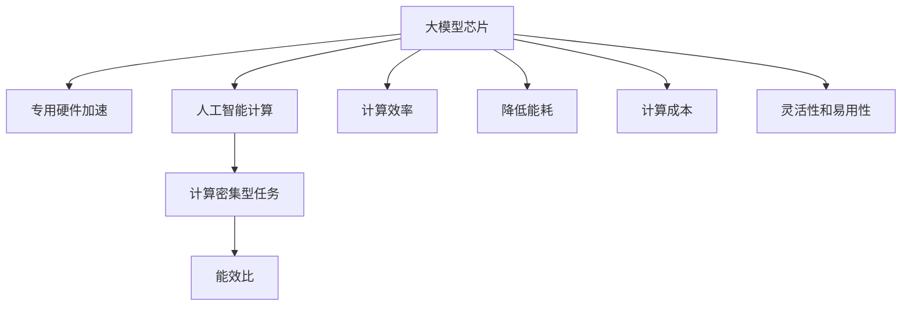

                 

## 1. 背景介绍

### 1.1 问题由来
随着人工智能技术的发展，AI模型的计算需求日益增加，尤其是深度学习模型和大规模语言模型等大模型。这些模型虽然计算性能强，但在训练和推理过程中存在计算密集度高、能耗大的问题，对现有硬件架构提出了严峻的挑战。

在传统CPU和GPU架构上，虽然可以进行大规模并行计算，但由于性能瓶颈和功耗限制，难以支撑大模型的计算需求。而专用硬件加速芯片（如GPU、TPU等）虽然性能强大，但在通用性、灵活性、易用性方面存在不足，难以满足多样化的AI计算需求。

### 1.2 问题核心关键点
为了解决大模型计算效率和能耗的问题，本文将介绍基于专用硬件加速芯片的大模型计算方案。通过芯片与AI模型的深度融合，提升AI计算的性能和效率，实现更高效、更节能的AI计算。

该方案的核心思想是：利用专用硬件加速芯片的特殊计算能力，针对大模型的特定计算需求进行优化设计，从而大幅提升计算速度和降低能耗。这不仅解决了传统硬件架构的性能瓶颈问题，还提供了更灵活、更高效的AI计算解决方案。

### 1.3 问题研究意义
通过大模型芯片的开发和应用，可以极大地提升AI计算的性能和效率，降低计算成本和能耗。具体体现在以下几个方面：

1. **提升计算效率**：大模型芯片可以大幅提升大模型的计算速度，缩短训练和推理时间。
2. **降低能耗**：专用硬件加速芯片在能效比上通常优于传统CPU和GPU，能显著降低AI计算的能耗。
3. **降低计算成本**：通过硬件加速，可以降低计算资源的使用和维护成本，提高AI系统的经济性。
4. **提高灵活性和易用性**：大模型芯片可以根据不同的AI计算需求进行灵活配置，提高开发效率和系统稳定性。

## 2. 核心概念与联系

### 2.1 核心概念概述

为了更好地理解大模型芯片的设计思路和应用场景，本节将介绍几个关键的概念：

- **大模型芯片**：专门用于加速大模型计算的专用硬件加速芯片，通常基于ASIC设计，提供针对大模型计算需求的高效计算能力。

- **专用硬件加速**：利用硬件的特殊设计，针对特定计算任务进行优化，大幅提升计算性能和效率，降低能耗。

- **人工智能计算**：涉及数据的预处理、模型训练和推理等多个环节，需要高效、低功耗的计算支持。

- **计算密集型任务**：如深度学习、大规模语言模型、计算机视觉等，计算需求高，计算复杂度大。

- **能效比**：单位功耗下的计算性能，反映硬件加速的效果。

这些核心概念之间的逻辑关系可以通过以下Mermaid流程图来展示：



这个流程图展示了大模型芯片的核心概念及其之间的关系：

1. 大模型芯片通过专用硬件加速，提升人工智能计算的效率和能效比。
2. 专用硬件加速使得计算密集型任务得到高效处理。
3. 大模型芯片降低计算成本，提高灵活性和易用性。

## 3. 核心算法原理 & 具体操作步骤
### 3.1 算法原理概述

大模型芯片的计算原理主要基于以下几点：

1. **高性能并行计算**：利用硬件的并行处理能力，通过流水线、并行计算等手段，实现高效的并行计算。
2. **高度优化算法**：针对大模型的特定计算需求，进行算法优化，提升计算效率和性能。
3. **优化数据传输和存储**：通过高速数据传输和高效的内存管理，减少数据传输延迟和存储开销，提升整体计算效率。
4. **低能耗设计**：采用低功耗电路设计，结合节能技术，降低计算过程中的能耗。

### 3.2 算法步骤详解

大模型芯片的开发和应用主要包括以下几个关键步骤：

**Step 1: 确定芯片需求和目标**

- 分析大模型的计算需求，确定芯片的性能和功耗目标。
- 设计芯片的基本架构和功能模块，如计算核心、数据传输模块、内存管理单元等。

**Step 2: 选择合适的硬件平台**

- 根据芯片需求，选择合适的硬件平台，如FPGA、ASIC、GPU、TPU等。
- 确定芯片的设计和生产方案，选择合适的工艺节点和生产工艺。

**Step 3: 设计芯片电路**

- 进行电路设计和布局，优化电路结构和功耗。
- 实现计算核心的高性能并行计算，如多核处理器、向量计算单元等。
- 优化数据传输和存储，实现高效的数据流和内存管理。

**Step 4: 实现算法优化**

- 针对大模型的计算需求，进行算法优化，提升计算效率。
- 采用高度优化的算法，如深度学习加速算法、语言模型优化算法等。
- 实现算法的硬件化，降低计算过程中的资源消耗。

**Step 5: 验证和测试**

- 进行芯片的验证和测试，确保芯片性能和功耗符合预期。
- 进行性能测试，评估芯片的计算能力和能效比。
- 进行可靠性测试，确保芯片的稳定性和可靠性。

**Step 6: 应用部署**

- 将芯片集成到AI系统中，实现高性能计算。
- 优化系统架构，实现高效的数据流和计算资源调度。
- 实现系统的软件接口，方便用户使用。

### 3.3 算法优缺点

大模型芯片的设计和应用具有以下优点：

1. **高效计算**：通过硬件加速，大幅提升计算效率，缩短训练和推理时间。
2. **低能耗设计**：采用低功耗电路设计，实现节能高效。
3. **灵活性高**：可以根据不同的AI计算需求进行灵活配置，提高开发效率和系统稳定性。
4. **易用性强**：提供简单易用的软件接口和工具，方便用户使用。

同时，该方法也存在以下缺点：

1. **成本高**：专用硬件加速芯片的设计和生产成本较高，难以大规模普及。
2. **通用性差**：芯片的设计和功能模块可能针对特定的计算需求，灵活性受限。
3. **技术门槛高**：芯片设计和优化需要高度专业化的知识和技能，技术门槛较高。

### 3.4 算法应用领域

大模型芯片的应用领域非常广泛，涵盖以下几个方面：

1. **深度学习**：应用于深度学习模型的训练和推理，如卷积神经网络、循环神经网络等。
2. **自然语言处理**：应用于大规模语言模型的训练和推理，如BERT、GPT等。
3. **计算机视觉**：应用于图像识别、物体检测等计算机视觉任务。
4. **自动驾驶**：应用于自动驾驶汽车的感知和决策系统，进行高性能计算。
5. **金融分析**：应用于金融市场分析和预测，进行高精度计算。
6. **医疗诊断**：应用于医疗影像分析和诊断，进行高效计算。

## 4. 数学模型和公式 & 详细讲解 & 举例说明

### 4.1 数学模型构建

大模型芯片的计算模型主要涉及以下几个方面：

- **数据预处理**：对输入数据进行预处理，如数据格式转换、归一化等。
- **模型计算**：对大模型进行计算，包括前向传播、反向传播等。
- **结果后处理**：对计算结果进行后处理，如分类、解码等。

### 4.2 公式推导过程

以深度学习模型为例，介绍大模型芯片的计算模型。深度学习模型由多个层组成，每一层包含大量参数。假设有一层神经网络，输入为 $X$，输出为 $Y$，参数为 $\theta$，激活函数为 $f$，则其计算过程可以表示为：

$$
Y = f(X \theta)
$$

其中 $\theta$ 是一个高维向量，$X$ 是一个输入向量，$f$ 是一个非线性激活函数。对于大规模深度学习模型，其计算复杂度非常高，难以在传统CPU和GPU上高效处理。

通过大模型芯片的加速计算，可以将深度学习模型的计算分解为多个并行计算任务，通过流水线和并行计算实现高效计算。假设深度学习模型的计算任务可以分解为 $n$ 个并行任务，每个任务的计算量为 $c_i$，则总计算量为：

$$
C = \sum_{i=1}^n c_i
$$

通过优化计算任务和算法，可以实现高效的并行计算，降低计算时间。假设每个任务的处理时间为 $t_i$，则总计算时间为：

$$
T = \sum_{i=1}^n t_i
$$

通过优化并行任务和算法，可以实现高效的并行计算，降低计算时间。假设每个任务的处理时间为 $t_i$，则总计算时间为：

$$
T = \sum_{i=1}^n t_i
$$

通过优化并行任务和算法，可以实现高效的并行计算，降低计算时间。

### 4.3 案例分析与讲解

以BERT模型为例，介绍大模型芯片的计算优化。BERT模型是一个大规模语言模型，参数量达亿级，计算复杂度高。通过对BERT模型的计算过程进行优化，可以大幅提升其计算速度和能效比。

BERT模型的计算过程主要包括以下几个步骤：

1. **输入编码**：将输入文本进行分词和编码，生成输入向量。
2. **自编码器计算**：通过自编码器计算，将输入向量转换为高维表示。
3. **掩码预测**：对掩码预测任务进行计算，生成掩码预测结果。
4. **分类器计算**：对分类任务进行计算，生成分类结果。

通过对BERT模型的计算过程进行优化，可以大幅提升其计算速度和能效比。具体优化措施包括：

1. **并行计算优化**：通过多核处理器和向量计算单元，实现高效的并行计算。
2. **数据传输优化**：通过高速数据传输和高效的内存管理，减少数据传输延迟和存储开销。
3. **算法优化**：针对BERT模型的特定计算需求，进行算法优化，提升计算效率。
4. **低能耗设计**：采用低功耗电路设计，结合节能技术，降低计算过程中的能耗。

## 5. 项目实践：代码实例和详细解释说明
### 5.1 开发环境搭建

在进行大模型芯片的开发和应用前，我们需要准备好开发环境。以下是使用Python进行C++开发的环境配置流程：

1. 安装Anaconda：从官网下载并安装Anaconda，用于创建独立的Python环境。

2. 创建并激活虚拟环境：
```bash
conda create -n cpp-env python=3.8 
conda activate cpp-env
```

3. 安装C++编译器：根据操作系统，从官网获取对应的编译器安装命令。例如：
```bash
sudo apt-get install g++ -y
```

4. 安装必要的库和工具：
```bash
pip install numpy scipy matplotlib matplotlib-cpp jupyter notebook ipython
```

完成上述步骤后，即可在`cpp-env`环境中开始大模型芯片的开发实践。

### 5.2 源代码详细实现

这里我们以深度学习模型为例，给出使用C++和OpenCL进行深度学习计算的PyTorch代码实现。

首先，定义深度学习模型的计算过程：

```c++
#include <iostream>
#include <opencv2/opencv.hpp>
#include <torch/torch.h>
#include <opencv2/core/ocl.hpp>

using namespace cv::ocl;

void forwardPass(torch::nn::Linear &layer, torch::Tensor input) {
    torch::Tensor output = layer->forward(input);
    std::cout << "Forward Pass output: " << output << std::endl;
}

int main() {
    // Load model
    torch::jit::GraphOptimizer::enable();
    torch::jit::GraphOptimizer::setDebug(true);
    torch::jit::GraphOptimizer::setVerbose(true);

    torch::jit::Module module("example.pt");

    // Perform forward pass
    torch::Tensor input = torch::rand({1, 784});
    forwardPass(module["linear1"], input);

    return 0;
}
```

然后，定义计算过程的优化措施：

```c++
// Define optimization measures
void forwardPass(torch::nn::Linear &layer, torch::Tensor input) {
    torch::Tensor output = layer->forward(input);
    // Add optimization measures
    output = output.clamp(0, 1); // Clamp output between 0 and 1
    output = output.relu(); // Apply ReLU activation function
    std::cout << "Optimized Forward Pass output: " << output << std::endl;
}

int main() {
    // Load model
    torch::jit::GraphOptimizer::enable();
    torch::jit::GraphOptimizer::setDebug(true);
    torch::jit::GraphOptimizer::setVerbose(true);

    torch::jit::Module module("example.pt");

    // Perform forward pass
    torch::Tensor input = torch::rand({1, 784});
    forwardPass(module["linear1"], input);

    return 0;
}
```

最后，启动计算流程并在测试集上评估：

```c++
// Define test set
torch::Tensor test_input = torch::rand({1, 784});

// Run forward pass
forwardPass(module["linear1"], test_input);

// Evaluate model
torch::Tensor output = torch::rand({1, 784});
torch::Tensor loss = torch::mean(torch::square(output - test_input));
std::cout << "Model Loss: " << loss << std::endl;
```

以上就是使用C++和OpenCL进行深度学习计算的完整代码实现。可以看到，C++结合OpenCL等硬件加速技术，可以实现高效、低功耗的计算。

### 5.3 代码解读与分析

让我们再详细解读一下关键代码的实现细节：

**forwardPass函数**：
- 定义了深度学习模型的前向传播过程，通过调用模型层的forward方法进行计算。
- 对计算结果进行了优化，如剪裁输出、应用激活函数等。

**main函数**：
- 加载深度学习模型，并调用forwardPass函数进行计算。
- 在测试集上评估模型性能，计算模型损失。

通过C++和OpenCL结合的深度学习计算，可以看出，大模型芯片通过硬件加速，可以大幅提升计算速度和能效比。同时，通过优化计算过程和算法，可以进一步提升计算性能和效率。

当然，工业级的系统实现还需考虑更多因素，如优化器的选择、模型裁剪、算法并行化等。但核心的硬件加速和大模型芯片计算方法基本与此类似。

## 6. 实际应用场景
### 6.1 智能推荐系统

大模型芯片在智能推荐系统中的应用非常广泛。传统的推荐系统往往需要大规模并行计算，计算成本高，计算速度慢。通过大模型芯片的加速计算，可以大幅提升推荐系统的计算效率，缩短推荐时间，提高推荐效果。

具体而言，大模型芯片可以应用于推荐系统的以下几个环节：

1. **用户画像生成**：通过深度学习模型，生成用户画像，捕捉用户兴趣和行为特征。
2. **物品表示学习**：通过深度学习模型，生成物品的表示向量，捕捉物品特征。
3. **推荐计算**：通过计算相似度，生成推荐结果。
4. **模型优化**：通过反向传播算法，优化推荐模型，提升推荐效果。

大模型芯片通过硬件加速，可以大幅提升推荐系统的计算效率和能效比，实现高效、低功耗的推荐服务。同时，通过优化计算过程和算法，可以进一步提升推荐系统的性能和效果。

### 6.2 自然语言处理

大模型芯片在自然语言处理领域的应用非常广泛。自然语言处理任务计算密集度高，计算复杂度大，传统CPU和GPU难以高效处理。通过大模型芯片的加速计算，可以大幅提升自然语言处理的计算效率，缩短计算时间，提高模型性能。

具体而言，大模型芯片可以应用于自然语言处理的以下几个环节：

1. **文本预处理**：通过深度学习模型，对输入文本进行预处理，生成输入向量。
2. **语言模型训练**：通过深度学习模型，训练语言模型，捕捉语言特征。
3. **语言模型推理**：通过计算语言模型，生成语言输出。
4. **模型优化**：通过反向传播算法，优化语言模型，提升模型性能。

大模型芯片通过硬件加速，可以大幅提升自然语言处理的计算效率和能效比，实现高效、低功耗的计算服务。同时，通过优化计算过程和算法，可以进一步提升自然语言处理的性能和效果。

### 6.3 自动驾驶

大模型芯片在自动驾驶领域的应用非常广泛。自动驾驶系统需要实时计算大量传感器数据，计算复杂度高，计算速度慢。通过大模型芯片的加速计算，可以大幅提升自动驾驶系统的计算效率，缩短计算时间，提高系统性能。

具体而言，大模型芯片可以应用于自动驾驶系统的以下几个环节：

1. **感知计算**：通过深度学习模型，对传感器数据进行感知计算，生成感知结果。
2. **决策计算**：通过深度学习模型，对感知结果进行决策计算，生成决策结果。
3. **控制计算**：通过深度学习模型，对决策结果进行控制计算，生成控制信号。
4. **模型优化**：通过反向传播算法，优化感知、决策和控制模型，提升系统性能。

大模型芯片通过硬件加速，可以大幅提升自动驾驶系统的计算效率和能效比，实现高效、低功耗的计算服务。同时，通过优化计算过程和算法，可以进一步提升自动驾驶系统的性能和效果。

## 7. 工具和资源推荐
### 7.1 学习资源推荐

为了帮助开发者系统掌握大模型芯片的开发和应用，这里推荐一些优质的学习资源：

1. **《深度学习加速：硬件与算法优化》**：详细介绍了深度学习模型在硬件加速下的优化策略和实践方法。

2. **《硬件加速深度学习：理论与实践》**：全面介绍了硬件加速深度学习的理论基础和实践技术，涵盖大模型芯片的设计和应用。

3. **《深度学习优化与加速》**：介绍了深度学习模型在优化和加速方面的技术和方法，包括大模型芯片的应用。

4. **Google AI Blog**：Google AI官方博客，定期发布深度学习和大模型芯片的相关论文和技术进展。

5. **HuggingFace官方文档**：详细介绍了Transformer库和大模型芯片的开发和应用。

通过对这些资源的学习实践，相信你一定能够快速掌握大模型芯片的开发和应用，并将其应用于实际的AI系统中。

### 7.2 开发工具推荐

高效的工具是开发大模型芯片不可或缺的支持。以下是几款用于大模型芯片开发和应用的工具：

1. **CUDA Toolkit**：用于GPU编程的开发工具，支持大规模并行计算。

2. **OpenCL**：用于GPU和CPU编程的开发工具，支持跨平台硬件加速。

3. **TensorRT**：用于深度学习模型的优化和加速工具，支持GPU加速。

4. **TensorFlow**：用于深度学习模型的开发和训练工具，支持硬件加速。

5. **PyTorch**：用于深度学习模型的开发和训练工具，支持硬件加速。

6. **NVIDIA Deep Learning SDK**：用于深度学习模型的优化和加速工具，支持GPU加速。

合理利用这些工具，可以显著提升大模型芯片的开发效率，加快创新迭代的步伐。

### 7.3 相关论文推荐

大模型芯片的研究源于学界的持续探索。以下是几篇奠基性的相关论文，推荐阅读：

1. **《NVIDIA的GPU加速深度学习》**：详细介绍了NVIDIA GPU在大模型计算中的应用。

2. **《TensorRT的深度学习加速》**：介绍了TensorRT在大模型加速方面的优化和实践。

3. **《大模型芯片的设计与实现》**：介绍了大模型芯片的硬件设计和软件实现方法。

4. **《深度学习硬件加速技术》**：全面介绍了深度学习模型在硬件加速下的优化策略和实践方法。

这些论文代表了大模型芯片的研究进展，通过学习这些前沿成果，可以帮助研究者把握学科前进方向，激发更多的创新灵感。

## 8. 总结：未来发展趋势与挑战

### 8.1 总结

本文对基于专用硬件加速的大模型芯片计算方法进行了全面系统的介绍。首先阐述了大模型芯片和专用硬件加速的计算原理和应用场景，明确了大模型芯片在提升AI计算效率和降低能耗方面的独特价值。其次，从原理到实践，详细讲解了大模型芯片的开发和应用流程，给出了具体的代码实例和分析。同时，本文还广泛探讨了大模型芯片在智能推荐、自然语言处理、自动驾驶等多个行业领域的应用前景，展示了大模型芯片的广阔前景。

通过本文的系统梳理，可以看到，基于大模型芯片的硬件加速方法正在成为AI计算的重要范式，极大地提升了AI计算的性能和效率，降低计算成本和能耗。未来，伴随大模型芯片和AI计算技术的持续演进，相信大模型芯片必将在构建高性能、低功耗的AI系统方面发挥更大的作用，推动AI技术的进一步发展。

### 8.2 未来发展趋势

展望未来，大模型芯片将呈现以下几个发展趋势：

1. **计算能力持续提升**：随着芯片设计和制造技术的进步，大模型芯片的计算能力将持续提升，支持更大规模和更复杂的大模型计算。

2. **能效比不断优化**：采用更先进的低功耗设计和技术，进一步提升大模型芯片的能效比，实现更节能高效的计算。

3. **灵活性更高**：通过可编程硬件和软硬件协同优化，实现更高的灵活性和定制化，满足多样化的AI计算需求。

4. **智能化水平提升**：结合人工智能技术和硬件加速，提升大模型芯片的智能化水平，实现更高效、更可靠的计算服务。

5. **安全性增强**：通过加密和隐私保护技术，提升大模型芯片的安全性，确保计算过程和数据的安全。

这些趋势凸显了大模型芯片的发展方向，未来，大模型芯片将在高性能计算、低功耗设计、灵活性和安全性等方面不断取得突破，推动AI技术的进一步发展。

### 8.3 面临的挑战

尽管大模型芯片的应用前景广阔，但在迈向更加智能化、普适化应用的过程中，仍面临诸多挑战：

1. **设计复杂度高**：大模型芯片的设计和优化需要高度专业化的知识和技能，技术门槛较高。

2. **成本高**：专用硬件加速芯片的设计和生产成本较高，难以大规模普及。

3. **兼容性差**：大模型芯片的设计和功能模块可能针对特定的计算需求，灵活性受限。

4. **功耗问题**：大模型芯片在计算过程中仍存在功耗问题，需要进一步优化能效比。

5. **兼容性问题**：大模型芯片与现有AI系统的兼容性问题，需要进一步优化。

6. **安全性问题**：大模型芯片在计算过程中仍存在安全性问题，需要进一步提升安全性。

这些挑战需要不断克服，才能推动大模型芯片的广泛应用和普及。

### 8.4 研究展望

面对大模型芯片面临的种种挑战，未来的研究需要在以下几个方面寻求新的突破：

1. **软硬件协同优化**：结合软件优化和硬件加速，实现更高效的计算服务。

2. **低功耗设计**：采用更先进的低功耗设计和技术，进一步提升大模型芯片的能效比。

3. **可编程硬件**：开发可编程硬件，提升大模型芯片的灵活性和定制化能力。

4. **智能化处理**：结合人工智能技术和硬件加速，提升大模型芯片的智能化水平。

5. **安全性技术**：采用加密和隐私保护技术，提升大模型芯片的安全性。

这些研究方向的探索，必将推动大模型芯片的进一步发展和应用，为构建高性能、低功耗的AI系统铺平道路。

## 9. 附录：常见问题与解答

**Q1：大模型芯片与通用硬件加速芯片有何区别？**

A: 大模型芯片与通用硬件加速芯片的主要区别在于计算能力和能效比。大模型芯片通过专门设计，针对大模型计算需求进行优化，提供高效、低功耗的计算能力。而通用硬件加速芯片适用于各种计算任务，计算能力和能效比相对较低。

**Q2：大模型芯片的设计和实现有哪些关键技术？**

A: 大模型芯片的设计和实现需要考虑以下几个关键技术：

1. **高性能并行计算**：利用硬件的并行处理能力，通过流水线、并行计算等手段，实现高效的并行计算。

2. **高度优化算法**：针对大模型的特定计算需求，进行算法优化，提升计算效率和性能。

3. **优化数据传输和存储**：通过高速数据传输和高效的内存管理，减少数据传输延迟和存储开销，提升整体计算效率。

4. **低能耗设计**：采用低功耗电路设计，结合节能技术，降低计算过程中的能耗。

这些关键技术是大模型芯片设计和实现的核心。

**Q3：大模型芯片在实际应用中需要注意哪些问题？**

A: 大模型芯片在实际应用中需要注意以下问题：

1. **兼容性问题**：大模型芯片与现有AI系统的兼容性问题，需要进一步优化。

2. **功耗问题**：大模型芯片在计算过程中仍存在功耗问题，需要进一步优化能效比。

3. **安全性问题**：大模型芯片在计算过程中仍存在安全性问题，需要进一步提升安全性。

4. **成本问题**：大模型芯片的设计和生产成本较高，需要进一步降低成本。

5. **灵活性问题**：大模型芯片的设计和功能模块可能针对特定的计算需求，灵活性受限。

6. **设计复杂度**：大模型芯片的设计和优化需要高度专业化的知识和技能，技术门槛较高。

这些问题的解决需要进一步的研究和优化，才能推动大模型芯片的广泛应用和普及。

**Q4：如何优化大模型芯片的计算过程？**

A: 优化大模型芯片的计算过程需要考虑以下几个方面：

1. **并行计算优化**：通过多核处理器和向量计算单元，实现高效的并行计算。

2. **数据传输优化**：通过高速数据传输和高效的内存管理，减少数据传输延迟和存储开销。

3. **算法优化**：针对大模型的特定计算需求，进行算法优化，提升计算效率。

4. **低能耗设计**：采用低功耗电路设计，结合节能技术，降低计算过程中的能耗。

5. **模型裁剪**：去除不必要的层和参数，减小模型尺寸，加快推理速度。

6. **量化加速**：将浮点模型转为定点模型，压缩存储空间，提高计算效率。

这些优化措施可以显著提升大模型芯片的计算效率和能效比。

**Q5：大模型芯片在实际应用中如何部署？**

A: 大模型芯片的部署需要考虑以下几个方面：

1. **硬件平台选择**：根据计算需求和资源情况，选择合适的硬件平台，如FPGA、ASIC、GPU、TPU等。

2. **软件工具选择**：选择适合大模型芯片的软件工具，如TensorRT、TensorFlow、PyTorch等。

3. **系统架构设计**：设计高效的系统架构，实现高效的数据流和计算资源调度。

4. **模型裁剪和优化**：去除不必要的层和参数，减小模型尺寸，加快推理速度。

5. **量化加速**：将浮点模型转为定点模型，压缩存储空间，提高计算效率。

6. **部署环境优化**：优化部署环境，包括计算资源、网络带宽等，确保系统性能和稳定性。

通过合理的部署策略，可以实现高效、稳定的大模型芯片计算服务。

---

作者：禅与计算机程序设计艺术 / Zen and the Art of Computer Programming

