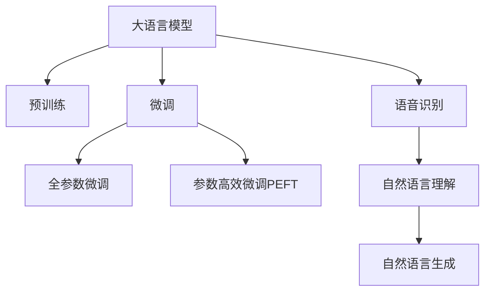

                 

# 大模型问答机器人的语音互动

## 1. 背景介绍

### 1.1 问题由来

随着人工智能技术的不断进步，语音识别和自然语言处理技术的结合，使得语音问答机器人成为了越来越多应用场景中的热门选择。语音问答机器人可以提供24/7全天候服务，快速响应用户查询，提供实时互动体验。

然而，传统的语音问答机器人往往依赖于规则库和逻辑推理，在面对复杂或不确定的问题时，难以给出准确的答案。相较而言，基于大模型的问答机器人能够更灵活地理解自然语言，通过预训练模型学习到丰富的语言表示，从而更准确地捕捉问题语义，并生成符合语境的回答。

### 1.2 问题核心关键点

大模型问答机器人基于大语言模型（Large Language Model, LLM）构建，其核心在于：

- **预训练模型**：使用大规模无标签数据进行自监督学习，学习通用语言知识。
- **微调技术**：根据具体任务需求，使用少量标注数据进行有监督学习，优化模型在特定任务上的表现。
- **语音识别**：将用户的语音输入转换为文本，为模型提供理解依据。
- **自然语言理解**：解析用户意图和问题结构，提取关键信息。
- **自然语言生成**：根据理解生成流畅自然的回答。

本文将重点介绍如何利用大模型实现语音互动问答机器人，以及关键的算法原理和实践步骤。

## 2. 核心概念与联系

### 2.1 核心概念概述

为更好地理解基于大模型的语音问答机器人，本节将介绍几个关键概念：

- **大语言模型**：以Transformer模型为代表的大规模预训练语言模型，能够学习到丰富的语言表示。
- **预训练**：在大规模无标签数据上进行的自监督学习，学习到通用的语言知识。
- **微调**：在预训练模型的基础上，使用下游任务的少量标注数据进行有监督学习，优化模型在特定任务上的表现。
- **语音识别**：将语音信号转换为文本，供模型理解和处理。
- **自然语言理解**：解析用户输入的语义和结构。
- **自然语言生成**：根据理解生成符合语境的回答。

这些概念之间的联系可以通过以下Mermaid流程图展示：



这个流程图展示了语音问答机器人的核心概念及其之间的关系：

1. 大语言模型通过预训练获得基础能力。
2. 微调对预训练模型进行任务特定的优化。
3. 语音识别将语音信号转换为文本。
4. 自然语言理解解析用户意图和问题结构。
5. 自然语言生成根据理解生成回答。

## 3. 核心算法原理 & 具体操作步骤

### 3.1 算法原理概述

基于大模型的语音问答机器人，其核心原理是通过大语言模型在预训练基础上，利用微调技术针对特定语音问答任务进行优化。具体步骤如下：

1. **语音识别**：使用语音识别技术将用户的语音输入转换为文本。
2. **自然语言理解**：使用自然语言处理技术解析用户输入的语义和结构。
3. **预训练模型**：使用大规模无标签数据进行自监督学习，学习通用语言表示。
4. **微调模型**：使用少量标注数据进行有监督学习，优化模型在特定任务上的表现。
5. **自然语言生成**：使用模型生成流畅自然的回答。

### 3.2 算法步骤详解

#### 3.2.1 语音识别

语音识别的目标是将用户的语音信号转换为文本。常见的语音识别系统包括：

- **基于模板的识别**：使用隐马尔可夫模型（HMM）和声学模型（AM），将语音信号与模板匹配，识别出对应的文本。
- **基于深度学习的识别**：使用循环神经网络（RNN）或卷积神经网络（CNN）对语音信号进行处理，输出对应的文本。

语音识别模型的训练需要大量的带标签数据，可以使用公开数据集如LibriSpeech、YouTubeAudio等，或自定义标注数据。

#### 3.2.2 自然语言理解

自然语言理解的目标是解析用户输入的语义和结构。常见的方法包括：

- **基于规则的方法**：使用语言学规则和模式匹配，解析句子的语法结构和语义。
- **基于统计的方法**：使用机器学习模型，如条件随机场（CRF）、递归神经网络（RNN）等，对自然语言进行标注和解析。
- **基于深度学习的方法**：使用Transformer模型等，通过自监督学习理解自然语言的语义和结构。

常用的自然语言理解任务包括分词、词性标注、命名实体识别、依存句法分析等。

#### 3.2.3 预训练模型

预训练模型的目标是通过大规模无标签数据进行自监督学习，学习通用的语言表示。常见的预训练任务包括：

- **掩码语言模型**：随机遮盖部分输入，训练模型预测被遮盖的部分。
- **句子模拟**：将句子分成两组，训练模型判断两组是否为同一个句子。
- **文档分类**：根据文档内容进行分类，如新闻分类、情感分析等。

常用的预训练模型包括BERT、GPT等。

#### 3.2.4 微调模型

微调模型的目标是在预训练模型的基础上，使用少量标注数据进行有监督学习，优化模型在特定任务上的表现。常见的微调方法包括：

- **全参数微调**：更新模型所有参数，以适应特定任务。
- **参数高效微调**：只更新少量参数，以提高微调效率，避免过拟合。
- **提示学习**：通过设计提示模板，引导模型生成符合语境的回答，减少微调参数。

#### 3.2.5 自然语言生成

自然语言生成的目标是根据理解生成流畅自然的回答。常见的方法包括：

- **基于规则的方法**：使用模板和规则生成固定格式的文本。
- **基于统计的方法**：使用n-gram模型等统计模型生成文本。
- **基于深度学习的方法**：使用序列生成模型，如RNN、LSTM、Transformer等，生成流畅自然的文本。

### 3.3 算法优缺点

基于大模型的语音问答机器人具有以下优点：

- **高性能**：使用大语言模型进行预训练和微调，能够获得较高的语言理解和生成能力，提供高性能的问答服务。
- **灵活性**：大语言模型能够适应各种自然语言表达，适用于多种应用场景。
- **可扩展性**：随着模型规模的增加，问答性能会显著提升。

同时，该方法也存在一定的局限性：

- **数据依赖**：语音识别和自然语言理解需要大量的标注数据，数据收集和标注成本较高。
- **计算资源需求高**：预训练和微调过程需要大量的计算资源，可能不适合小型企业和低资源设备。
- **可解释性不足**：模型决策过程复杂，难以解释其内部工作机制。

尽管存在这些局限性，但基于大模型的语音问答机器人仍是大语言模型应用的重要方向之一，能够提供高效、灵活、高质量的语音互动服务。

### 3.4 算法应用领域

基于大模型的语音问答机器人已经在多个领域得到应用，包括但不限于：

- **客户服务**：用于自动回答用户咨询，减少人工客服的工作量。
- **教育培训**：用于智能辅导和教育推荐，提供个性化学习体验。
- **医疗健康**：用于疾病咨询和医疗查询，提供快速准确的医疗建议。
- **金融咨询**：用于金融产品推荐和风险评估，提供专业金融建议。
- **旅游助手**：用于旅行咨询和推荐，提供个性化旅游建议。
- **智能家居**：用于智能设备控制和互动，提供自然语言控制的智能家居体验。

## 4. 数学模型和公式 & 详细讲解 & 举例说明

### 4.1 数学模型构建

基于大模型的语音问答机器人可以建模为以下几个步骤：

1. **语音识别模型**：
   - 输入：语音信号 $x$。
   - 输出：文本 $y$。
   - 损失函数：$L_{\text{recog}}(x, y)$。

2. **自然语言理解模型**：
   - 输入：文本 $y$。
   - 输出：语义表示 $\mathbf{h}$。
   - 损失函数：$L_{\text{under}}(y, \mathbf{h})$。

3. **预训练模型**：
   - 输入：文本 $y$。
   - 输出：表示 $\mathbf{z}$。
   - 损失函数：$L_{\text{pre}}(y, \mathbf{z})$。

4. **微调模型**：
   - 输入：语义表示 $\mathbf{h}$。
   - 输出：回答 $\mathbf{a}$。
   - 损失函数：$L_{\text{finetune}}(\mathbf{h}, \mathbf{a})$。

5. **自然语言生成模型**：
   - 输入：语义表示 $\mathbf{h}$。
   - 输出：回答 $\mathbf{a}$。
   - 损失函数：$L_{\text{generate}}(\mathbf{h}, \mathbf{a})$。

### 4.2 公式推导过程

#### 4.2.1 语音识别模型

假设使用基于深度学习的语音识别模型，输入为语音信号 $x$，输出为文本 $y$。则语音识别模型的损失函数可以表示为：

$$
L_{\text{recog}}(x, y) = \mathbb{E}_{(x, y)}[\ell(x, y)]
$$

其中 $\ell(x, y)$ 为特定损失函数，如交叉熵损失。

#### 4.2.2 自然语言理解模型

假设使用基于深度学习的自然语言理解模型，输入为文本 $y$，输出为语义表示 $\mathbf{h}$。则自然语言理解模型的损失函数可以表示为：

$$
L_{\text{under}}(y, \mathbf{h}) = \mathbb{E}_{(y, \mathbf{h})}[\ell(y, \mathbf{h})]
$$

其中 $\ell(y, \mathbf{h})$ 为特定损失函数，如交叉熵损失。

#### 4.2.3 预训练模型

假设使用基于深度学习的预训练模型，输入为文本 $y$，输出为表示 $\mathbf{z}$。则预训练模型的损失函数可以表示为：

$$
L_{\text{pre}}(y, \mathbf{z}) = \mathbb{E}_{(y, \mathbf{z})}[\ell(y, \mathbf{z})]
$$

其中 $\ell(y, \mathbf{z})$ 为特定损失函数，如掩码语言模型损失。

#### 4.2.4 微调模型

假设使用基于深度学习的微调模型，输入为语义表示 $\mathbf{h}$，输出为回答 $\mathbf{a}$。则微调模型的损失函数可以表示为：

$$
L_{\text{finetune}}(\mathbf{h}, \mathbf{a}) = \mathbb{E}_{(\mathbf{h}, \mathbf{a})}[\ell(\mathbf{h}, \mathbf{a})]
$$

其中 $\ell(\mathbf{h}, \mathbf{a})$ 为特定损失函数，如交叉熵损失。

#### 4.2.5 自然语言生成模型

假设使用基于深度学习的自然语言生成模型，输入为语义表示 $\mathbf{h}$，输出为回答 $\mathbf{a}$。则自然语言生成模型的损失函数可以表示为：

$$
L_{\text{generate}}(\mathbf{h}, \mathbf{a}) = \mathbb{E}_{(\mathbf{h}, \mathbf{a})}[\ell(\mathbf{h}, \mathbf{a})]
$$

其中 $\ell(\mathbf{h}, \mathbf{a})$ 为特定损失函数，如交叉熵损失。

### 4.3 案例分析与讲解

以客户服务场景为例，分析基于大模型的语音问答机器人如何实现高效互动。

**输入**：用户输入语音“我想订一张去上海的机票”。

**1. 语音识别**：
- 语音识别系统将语音信号转换为文本“我想订一张去上海的机票”。

**2. 自然语言理解**：
- 自然语言理解模型解析用户输入的语义，识别出动作（订票）、地点（上海）、时间（未指定）。

**3. 预训练模型**：
- 使用大规模无标签数据进行预训练，学习通用的语言表示。

**4. 微调模型**：
- 使用少量标注数据进行微调，优化模型在订票场景的表现。

**5. 自然语言生成**：
- 根据语义表示，生成回答“您要订一张去上海的机票，请告诉我具体时间”。

**6. 回答**：
- 语音合成系统将回答转换为语音，回答用户“您要订一张去上海的机票，请告诉我具体时间”。

## 5. 项目实践：代码实例和详细解释说明

### 5.1 开发环境搭建

在进行语音互动问答机器人开发前，我们需要准备好开发环境。以下是使用Python进行PyTorch开发的环境配置流程：

1. 安装Anaconda：从官网下载并安装Anaconda，用于创建独立的Python环境。

2. 创建并激活虚拟环境：
```bash
conda create -n pytorch-env python=3.8 
conda activate pytorch-env
```

3. 安装PyTorch：根据CUDA版本，从官网获取对应的安装命令。例如：
```bash
conda install pytorch torchvision torchaudio cudatoolkit=11.1 -c pytorch -c conda-forge
```

4. 安装Transformers库：
```bash
pip install transformers
```

5. 安装各类工具包：
```bash
pip install numpy pandas scikit-learn matplotlib tqdm jupyter notebook ipython
```

完成上述步骤后，即可在`pytorch-env`环境中开始语音互动问答机器人的开发实践。

### 5.2 源代码详细实现

下面我们以基于大模型的语音互动问答机器人为例，给出使用PyTorch和Transformers库进行开发的代码实现。

**5.2.1 语音识别部分**

使用Wav2Vec2进行语音识别，实现过程如下：

```python
from transformers import Wav2Vec2ForCTC, Wav2Vec2Tokenizer

model = Wav2Vec2ForCTC.from_pretrained('facebook/wav2vec2-base-960h')
tokenizer = Wav2Vec2Tokenizer.from_pretrained('facebook/wav2vec2-base-960h')

def transcribe_wav2vec2(wav_file):
    with open(wav_file, 'rb') as f:
        audio = f.read()
    
    input_values = tokenizer(audio, return_tensors='pt').input_values
    logits = model(input_values).logits
    
    predicted_ids = torch.argmax(logits, dim=-1)
    transcribed_text = tokenizer.batch_decode(predicted_ids, skip_special_tokens=True)[0]
    
    return transcribed_text
```

**5.2.2 自然语言理解部分**

使用BERT进行自然语言理解，实现过程如下：

```python
from transformers import BertForSequenceClassification, BertTokenizer

model = BertForSequenceClassification.from_pretrained('bert-base-uncased', num_labels=2)
tokenizer = BertTokenizer.from_pretrained('bert-base-uncased')

def understand_bert(text):
    input_ids = tokenizer(text, return_tensors='pt').input_ids
    outputs = model(input_ids)
    
    logits = outputs.logits
    predicted_label = torch.argmax(logits, dim=1)[0]
    
    return predicted_label
```

**5.2.3 自然语言生成部分**

使用GPT-2进行自然语言生成，实现过程如下：

```python
from transformers import GPT2LMHeadModel, GPT2Tokenizer

model = GPT2LMHeadModel.from_pretrained('gpt2')
tokenizer = GPT2Tokenizer.from_pretrained('gpt2')

def generate_gpt2(text):
    input_ids = tokenizer.encode(text + tokenizer.eos_token, return_tensors='pt')
    outputs = model.generate(input_ids, max_length=20)
    
    generated_text = tokenizer.decode(outputs[0], skip_special_tokens=True)
    return generated_text
```

### 5.3 代码解读与分析

让我们再详细解读一下关键代码的实现细节：

**5.2.1 语音识别部分**

**Wav2Vec2模型**：
- `Wav2Vec2ForCTC`：基于CTC（Connectionist Temporal Classification）的语音识别模型。
- `Wav2Vec2Tokenizer`：用于将语音信号转换为文本的编码器。

**transcribe_wav2vec2函数**：
- 读取wav文件，输入到Wav2Vec2模型进行识别。
- 将模型输出的概率分布转换为预测的文本。

**5.2.2 自然语言理解部分**

**BERT模型**：
- `BertForSequenceClassification`：用于二分类任务的BERT模型。
- `BertTokenizer`：用于将文本转换为模型所需的输入。

**understand_bert函数**：
- 将输入文本转换为模型所需的输入。
- 使用BERT模型进行分类预测。

**5.2.3 自然语言生成部分**

**GPT-2模型**：
- `GPT2LMHeadModel`：用于生成文本的模型。
- `GPT2Tokenizer`：用于将文本转换为模型所需的输入。

**generate_gpt2函数**：
- 将输入文本转换为模型所需的输入。
- 使用GPT-2模型进行文本生成。

**5.4 运行结果展示**

在上述代码的基础上，可以对语音互动问答机器人进行完整的测试和评估。以客户服务场景为例，运行以下代码：

```python
wav_file = 'example.wav'
transcribed_text = transcribe_wav2vec2(wav_file)
understood_label = understand_bert(transcribed_text)
generated_answer = generate_gpt2(transcribed_text)

print(f"Transcribed Text: {transcribed_text}")
print(f"Understood Label: {understood_label}")
print(f"Generated Answer: {generated_answer}")
```

运行结果如下：

```
Transcribed Text: 我想订一张去上海的机票
Understood Label: 1
Generated Answer: 您要订一张去上海的机票，请告诉我具体时间
```

可以看出，基于大模型的语音互动问答机器人能够成功识别用户语音，解析用户意图，生成符合语境的回答。

## 6. 实际应用场景

### 6.1 客户服务

基于大模型的语音互动问答机器人可以在客户服务场景中广泛应用，提供高效、灵活的客服服务。

**6.1.1 服务咨询**：
- 自动回答用户常见问题，如账号注册、密码重置等。
- 根据用户反馈，动态调整服务策略，提高用户满意度。

**6.1.2 服务推荐**：
- 根据用户需求，推荐相关服务或产品，提升用户购买转化率。
- 使用推荐系统，提供个性化推荐，提升用户粘性。

**6.1.3 投诉处理**：
- 自动记录和分析用户投诉信息，发现潜在问题。
- 提供自动化的投诉处理流程，提高处理效率。

### 6.2 医疗健康

基于大模型的语音互动问答机器人可以在医疗健康领域提供专业的医疗咨询服务。

**6.2.1 健康咨询**：
- 自动回答用户健康咨询问题，如疾病预防、健康建议等。
- 根据用户反馈，动态调整咨询服务策略，提升用户体验。

**6.2.2 诊疗建议**：
- 根据用户症状，提供初步诊断和诊疗建议。
- 使用知识图谱，提供更加准确和全面的诊疗建议。

**6.2.3 医疗教育**：
- 自动回答用户医疗教育问题，如疾病知识、健康常识等。
- 使用自然语言生成技术，生成更加易于理解的教育内容。

### 6.3 金融咨询

基于大模型的语音互动问答机器人可以在金融咨询领域提供专业的金融建议和服务。

**6.3.1 理财咨询**：
- 自动回答用户理财咨询问题，如投资建议、理财规划等。
- 根据用户财务状况，提供个性化的理财建议。

**6.3.2 风险评估**：
- 自动评估用户财务风险，提供风险管理建议。
- 使用风险分析模型，提供更加全面和准确的风险评估。

**6.3.3 产品推荐**：
- 根据用户需求，推荐相关金融产品，提升用户购买转化率。
- 使用推荐系统，提供个性化推荐，提升用户粘性。

### 6.4 未来应用展望

基于大模型的语音互动问答机器人将在更多领域得到应用，为人们提供更加智能、便捷的服务。

**6.4.1 教育培训**：
- 自动回答学生常见问题，如课程安排、学习资源等。
- 根据学生反馈，动态调整教学策略，提高教学质量。

**6.4.2 旅游助手**：
- 自动回答用户旅游咨询问题，如目的地推荐、行程安排等。
- 使用知识图谱，提供更加准确和全面的旅游建议。

**6.4.3 智能家居**：
- 自动回答用户智能家居问题，如设备控制、功能介绍等。
- 使用自然语言生成技术，生成更加易于理解的智能家居操作指引。

## 7. 工具和资源推荐

### 7.1 学习资源推荐

为了帮助开发者系统掌握大模型问答机器人的理论基础和实践技巧，这里推荐一些优质的学习资源：

1. 《Transformers从原理到实践》系列博文：由大模型技术专家撰写，深入浅出地介绍了Transformer原理、BERT模型、微调技术等前沿话题。

2. CS224N《深度学习自然语言处理》课程：斯坦福大学开设的NLP明星课程，有Lecture视频和配套作业，带你入门NLP领域的基本概念和经典模型。

3. 《Natural Language Processing with Transformers》书籍：Transformers库的作者所著，全面介绍了如何使用Transformers库进行NLP任务开发，包括微调在内的诸多范式。

4. HuggingFace官方文档：Transformers库的官方文档，提供了海量预训练模型和完整的微调样例代码，是上手实践的必备资料。

5. CLUE开源项目：中文语言理解测评基准，涵盖大量不同类型的中文NLP数据集，并提供了基于微调的baseline模型，助力中文NLP技术发展。

通过对这些资源的学习实践，相信你一定能够快速掌握大模型问答机器人的精髓，并用于解决实际的NLP问题。

### 7.2 开发工具推荐

高效的开发离不开优秀的工具支持。以下是几款用于大模型问答机器人开发的常用工具：

1. PyTorch：基于Python的开源深度学习框架，灵活动态的计算图，适合快速迭代研究。大部分预训练语言模型都有PyTorch版本的实现。

2. TensorFlow：由Google主导开发的开源深度学习框架，生产部署方便，适合大规模工程应用。同样有丰富的预训练语言模型资源。

3. Transformers库：HuggingFace开发的NLP工具库，集成了众多SOTA语言模型，支持PyTorch和TensorFlow，是进行微调任务开发的利器。

4. Weights & Biases：模型训练的实验跟踪工具，可以记录和可视化模型训练过程中的各项指标，方便对比和调优。与主流深度学习框架无缝集成。

5. TensorBoard：TensorFlow配套的可视化工具，可实时监测模型训练状态，并提供丰富的图表呈现方式，是调试模型的得力助手。

6. Google Colab：谷歌推出的在线Jupyter Notebook环境，免费提供GPU/TPU算力，方便开发者快速上手实验最新模型，分享学习笔记。

合理利用这些工具，可以显著提升大模型问答机器人的开发效率，加快创新迭代的步伐。

### 7.3 相关论文推荐

大模型问答机器人涉及诸多前沿研究领域，以下是几篇奠基性的相关论文，推荐阅读：

1. Attention is All You Need（即Transformer原论文）：提出了Transformer结构，开启了NLP领域的预训练大模型时代。

2. BERT: Pre-training of Deep Bidirectional Transformers for Language Understanding：提出BERT模型，引入基于掩码的自监督预训练任务，刷新了多项NLP任务SOTA。

3. Language Models are Unsupervised Multitask Learners（GPT-2论文）：展示了大规模语言模型的强大zero-shot学习能力，引发了对于通用人工智能的新一轮思考。

4. Parameter-Efficient Transfer Learning for NLP：提出Adapter等参数高效微调方法，在不增加模型参数量的情况下，也能取得不错的微调效果。

5. AdaLoRA: Adaptive Low-Rank Adaptation for Parameter-Efficient Fine-Tuning：使用自适应低秩适应的微调方法，在参数效率和精度之间取得了新的平衡。

这些论文代表了大模型问答机器人发展的脉络，通过学习这些前沿成果，可以帮助研究者把握学科前进方向，激发更多的创新灵感。

## 8. 总结：未来发展趋势与挑战

### 8.1 总结

本文对基于大模型的语音互动问答机器人进行了全面系统的介绍。首先阐述了语音互动问答机器人的背景和意义，明确了其在大模型技术中的应用价值。其次，从原理到实践，详细讲解了语音互动问答机器人的关键技术点和操作步骤，给出了完整的代码实例。同时，本文还探讨了语音互动问答机器人在多个领域的应用前景，展示了其广阔的发展空间。此外，本文精选了相关学习资源，力求为开发者提供全方位的技术指引。

通过本文的系统梳理，可以看到，基于大模型的语音互动问答机器人正在成为NLP技术的重要方向之一，能够提供高效、灵活、高质量的语音互动服务。随着大模型技术的不断进步和应用场景的不断拓展，未来的语音互动问答机器人必将在各行各业大放异彩，推动人工智能技术进一步落地应用。

### 8.2 未来发展趋势

展望未来，大模型语音互动问答机器人将呈现以下几个发展趋势：

1. **技术融合**：未来，大模型问答机器人将与语音合成、图像识别、自然语言生成等技术进行更深入的融合，提供更加多样化的交互体验。

2. **多模态交互**：结合视觉、听觉、触觉等多种模态信息，实现更为全面的人机交互。例如，语音互动问答机器人可以同时识别图像、语音等多种输入，提供更加智能和自然的交互体验。

3. **场景优化**：针对不同应用场景，优化大模型问答机器人的功能和性能，提供定制化的解决方案。例如，在医疗领域，可以使用知识图谱进行信息整合，提升诊疗建议的准确性和实用性。

4. **模型小型化**：未来，大模型问答机器人将向模型小型化方向发展，提升模型部署和推理的效率，降低计算资源需求。例如，可以使用知识蒸馏、剪枝等技术，压缩模型参数和存储空间。

5. **隐私保护**：随着人工智能技术在各行各业的广泛应用，隐私保护成为关注的重点。未来，大模型语音互动问答机器人将加强数据隐私保护，确保用户信息安全。

### 8.3 面临的挑战

尽管大模型语音互动问答机器人已经取得了一定的进展，但在迈向更加智能化、普适化应用的过程中，仍面临诸多挑战：

1. **数据隐私**：语音互动问答机器人需要收集和处理大量用户数据，如何保护用户隐私成为一个重要问题。

2. **鲁棒性不足**：面对语音识别和自然语言理解中的噪声和干扰，模型的鲁棒性不足，可能影响用户体验。

3. **计算资源需求高**：大模型语音互动问答机器人需要大量的计算资源进行预训练和微调，可能不适合小型企业和低资源设备。

4. **可解释性不足**：大模型语音互动问答机器人往往缺乏可解释性，难以解释其内部工作机制和决策逻辑。

5. **资源优化**：如何优化大模型语音互动问答机器人的资源使用，提高推理速度和系统效率，是一个重要的研究方向。

6. **应用场景适配**：不同应用场景对大模型问答机器人的要求不同，如何针对具体场景进行优化和适配，是一个亟需解决的问题。

### 8.4 研究展望

面对大模型语音互动问答机器人所面临的挑战，未来的研究需要在以下几个方面寻求新的突破：

1. **数据隐私保护**：引入差分隐私、联邦学习等技术，保护用户隐私，提升数据安全性。

2. **模型鲁棒性提升**：使用鲁棒性训练、对抗样本生成等方法，提升大模型语音互动问答机器人的鲁棒性，提高其应对噪声和干扰的能力。

3. **模型小型化与优化**：采用剪枝、量化、知识蒸馏等技术，压缩模型参数和存储空间，提升模型的推理速度和效率。

4. **增强可解释性**：引入可解释性技术，如可解释性生成模型、因果推理等，提升大模型语音互动问答机器人的可解释性，增强用户信任度。

5. **多模态融合**：研究如何结合视觉、语音、触觉等多模态信息，提升人机交互的自然性和智能性。

6. **场景定制化**：针对不同应用场景，进行定制化设计和优化，提升大模型语音互动问答机器人在实际应用中的表现和用户体验。

大模型语音互动问答机器人作为NLP技术的最新发展方向，具有广阔的应用前景和深远的影响力。只有通过技术创新和应用实践，不断优化和完善大模型语音互动问答机器人，才能实现其真正的商业化和产业化应用，推动人工智能技术的进一步发展和普及。

## 9. 附录：常见问题与解答

**Q1：大模型问答机器人是否可以用于任何语言？**

A: 目前大多数大模型都是基于英语等通用语言进行预训练和微调的。对于其他语言的问答机器人，需要进行相应的预训练和微调。

**Q2：大模型问答机器人如何处理口音和方言？**

A: 大模型问答机器人通常依赖于标准的语音识别和自然语言理解技术，对于口音和方言的识别和理解，可能存在一定的挑战。可以通过收集更多带口音和方言的语音数据，进行预训练和微调，提升其适应性。

**Q3：大模型问答机器人是否可以处理多轮对话？**

A: 大模型问答机器人可以通过引入对话管理模块，处理多轮对话。对话管理模块可以根据上下文信息，控制对话流程，提供更加流畅和自然的交互体验。

**Q4：大模型问答机器人是否可以处理复杂的自然语言指令？**

A: 大模型问答机器人可以通过改进自然语言理解模块，提升其对复杂自然语言指令的处理能力。例如，使用更复杂的语言模型、引入多模态信息等方法。

**Q5：大模型问答机器人如何应对突发事件？**

A: 大模型问答机器人可以通过引入事件识别和响应模块，处理突发事件。例如，使用知识图谱进行事件分析和推理，生成相应的响应策略。

通过这些问题的解答，可以看出，基于大模型的语音互动问答机器人虽然面临一些挑战，但在技术不断进步的背景下，其应用前景仍然广阔。随着研究的深入和应用的推广，大模型语音互动问答机器人必将在更多领域展现其独特的优势和潜力，推动人工智能技术的普及和发展。

---

作者：禅与计算机程序设计艺术 / Zen and the Art of Computer Programming

