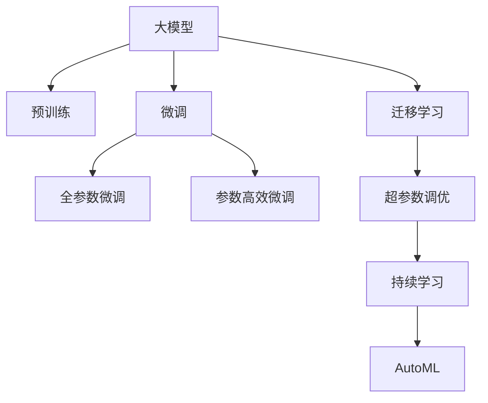

                 

## 1. 背景介绍

### 1.1 问题由来
随着人工智能技术的发展，特别是深度学习和神经网络的突破，大模型（Large Model）成为了新一轮科技革命的引擎。从语言模型到视觉模型，再到多模态模型，大模型正在以前所未有的速度，解锁人类知识的边界。这些模型以百亿乃至千亿参数的量级，展示了惊人的学习和推理能力。

然而，尽管大模型在学术研究中取得了巨大成功，但如何将其应用到商业场景，实现真正的价值落地，依然是行业内外热议的话题。本文将从商业的角度，探讨大模型的核心概念、关键技术、实际应用和未来展望，揭示大模型如何在商业领域成为新引擎的底层逻辑。

### 1.2 问题核心关键点
大模型在商业应用中的核心在于其强大的泛化能力和适应性，能够从大规模数据中学习到丰富的语言、视觉或跨模态知识，从而在各种复杂的商业场景中展现其价值。关键点包括：

- 泛化能力：大模型能够将学习到的知识迁移到新的任务和场景中，提高模型在不同环境下的适应性和准确性。
- 计算效率：尽管参数众多，但通过优化算法和模型结构，大模型依然能够保持较低的计算复杂度和存储需求。
- 应用场景：从自然语言处理到计算机视觉，再到多模态融合，大模型在多个商业领域都有广泛的应用前景。
- 商业价值：通过提升决策效率、降低成本、增强用户互动，大模型为各类企业带来了显著的商业价值。

## 2. 核心概念与联系

### 2.1 核心概念概述
为了更好地理解大模型在商业领域的应用，本文将介绍以下几个核心概念：

- **大模型（Large Model）**：以深度神经网络为代表的，具有数十亿甚至上千亿参数的模型，如BERT、GPT-3、DALL-E等。
- **迁移学习（Transfer Learning）**：通过在大规模数据上预训练模型，并在特定任务上微调（Fine-Tuning），使得模型能够在新的任务上表现优异。
- **微调（Fine-Tuning）**：在预训练模型的基础上，使用特定任务的标注数据进行有监督学习，优化模型在该任务上的性能。
- **超参数调优（Hyperparameter Tuning）**：通过调整学习率、批大小、优化器等超参数，使得模型在特定任务上达到最佳性能。
- **持续学习（Continual Learning）**：模型能够在不断的学习过程中，保持已学知识的同时，适应新数据，避免灾难性遗忘。
- **自动机器学习（AutoML）**：自动化机器学习技术，通过自动化超参数调优和模型选择，减少人工干预，提升模型开发的效率。

这些概念之间有着紧密的联系，共同构成了大模型在商业领域应用的理论框架。以下通过一个简单的Mermaid流程图，展示这些概念之间的逻辑关系：



这个流程图展示了大模型的核心概念及其之间的关系：

1. 大模型通过预训练获得基础能力。
2. 微调是对预训练模型进行任务特定的优化，可以分为全参数微调和参数高效微调（PEFT）。
3. 超参数调优用于寻找最佳参数组合，提升微调效果。
4. 持续学习保证模型能够不断学习新知识，适应新环境。
5. AutoML自动化超参数优化，提高模型开发效率。

这些概念共同构成了大模型在商业应用的理论基础，为其在实际场景中的广泛应用提供了科学依据。

## 3. 核心算法原理 & 具体操作步骤

### 3.1 算法原理概述

大模型在商业应用中的核心算法原理，主要是基于迁移学习和微调的范式。即先在大规模数据上进行预训练，学习通用的知识表示；再在特定任务上通过微调，调整模型的参数，使得模型在该任务上表现更好。

具体而言，大模型在商业应用中的迁移学习过程可以概括为以下步骤：

1. **预训练**：在大规模无标签数据上，使用自监督任务（如语言建模、视觉识别等）训练模型，学习通用的语言或视觉表示。
2. **微调**：在特定任务的有标签数据上，使用有监督学习任务（如分类、匹配、生成等）对模型进行微调，调整模型参数，使得模型在该任务上表现最优。
3. **超参数调优**：调整模型的学习率、批大小、优化器等超参数，提升模型的性能和泛化能力。
4. **持续学习**：不断获取新数据，更新模型，确保模型能够适应数据分布的变化。

### 3.2 算法步骤详解

#### 3.2.1 预训练阶段
预训练阶段的主要任务是学习模型通用的表示能力。以下是一个典型的预训练流程：

1. **数据准备**：收集大规模的无标签数据，如大规模的文本、图像数据集。
2. **模型初始化**：选择合适的大模型作为初始化参数，如BERT、GPT等。
3. **自监督学习**：使用自监督任务，如语言建模、视觉识别等，训练模型。
4. **参数更新**：使用优化算法（如Adam、SGD等）更新模型参数，最小化训练损失。
5. **验证评估**：在验证集上评估模型性能，避免过拟合。

#### 3.2.2 微调阶段
微调阶段的主要任务是优化模型在特定任务上的性能。以下是一个典型的微调流程：

1. **任务适配**：根据任务类型，设计合适的任务适配层和损失函数。
2. **模型初始化**：将预训练模型加载到微调任务上。
3. **数据加载**：加载训练集和验证集，设置批大小。
4. **训练循环**：在每个epoch上，前向传播计算损失，反向传播更新参数，并在验证集上评估模型性能。
5. **超参数调优**：根据验证集性能，调整学习率、批大小等超参数。
6. **模型保存**：保存最优模型参数，供后续使用。

#### 3.2.3 部署阶段
部署阶段的主要任务是将微调后的模型应用到实际业务场景中。以下是一个典型的部署流程：

1. **模型加载**：加载微调后的模型，设置运行环境。
2. **输入预处理**：对输入数据进行格式转换和标准化处理。
3. **模型推理**：将输入数据输入模型，得到推理结果。
4. **结果后处理**：对推理结果进行后处理，如解码、评分等。
5. **接口集成**：将模型集成到业务系统中，提供API接口。

### 3.3 算法优缺点

大模型在商业应用中的优点包括：

- **泛化能力**：预训练模型已经在大规模数据上学习到了丰富的知识，微调可以进一步提高其在特定任务上的性能。
- **计算效率**：通过迁移学习和微调，大模型可以显著减少从头训练所需的时间和计算资源。
- **应用灵活性**：大模型能够适应多种任务和应用场景，易于部署和集成。
- **业务价值**：通过提升决策效率、降低成本、增强用户体验，大模型能够为企业带来显著的商业价值。

然而，大模型在商业应用中也存在一些缺点：

- **数据依赖**：微调效果很大程度上依赖于特定任务的数据质量，标注数据获取成本较高。
- **模型复杂度**：大模型的参数量庞大，需要高性能的计算资源。
- **部署难度**：将大模型部署到实际业务系统中，需要考虑模型压缩、推理加速等问题。
- **隐私安全**：大模型需要大量的数据进行训练，数据隐私和安全问题不容忽视。

尽管存在这些缺点，但大模型在商业领域的应用前景依然广阔，关键在于如何有效应对其缺点，充分发挥其优势。

### 3.4 算法应用领域

大模型在商业领域的应用涵盖了多个领域，包括但不限于：

- **自然语言处理**：如智能客服、文本分类、情感分析等，通过微调提升语言理解和生成能力。
- **计算机视觉**：如图像分类、目标检测、图像生成等，通过迁移学习和微调优化视觉模型。
- **推荐系统**：如个性化推荐、广告推荐等，通过大模型学习用户行为和偏好，提升推荐效果。
- **金融分析**：如风险评估、信用评分等，通过微调提高金融数据的分析和预测能力。
- **医疗健康**：如疾病诊断、基因分析等，通过迁移学习和大模型提高医疗决策的科学性和准确性。

这些应用场景展示了大模型在商业领域的多样性和潜力，为各类企业带来了显著的商业价值和社会效益。

## 4. 数学模型和公式 & 详细讲解 & 举例说明

### 4.1 数学模型构建

大模型在商业应用中的数学模型构建，主要基于监督学习和微调的框架。以下以自然语言处理（NLP）任务为例，展示其数学模型构建过程：

1. **输入表示**：将输入文本转换为模型能够处理的数值形式，如单词嵌入（Word Embedding）。
2. **模型定义**：定义大模型（如Transformer），包括编码器、解码器等结构。
3. **损失函数**：根据具体任务，设计合适的损失函数，如交叉熵损失、均方误差损失等。
4. **优化器**：选择优化算法（如Adam、SGD等），设置学习率、批大小等超参数。
5. **训练循环**：在每个epoch上，前向传播计算损失，反向传播更新参数，并在验证集上评估模型性能。

### 4.2 公式推导过程

以下以二分类任务为例，展示大模型在NLP中的训练过程：

假设输入文本为 $x$，预训练模型的输出为 $h(x)$，模型在输入 $x$ 上的输出为 $y=\sigma(W^Tx+b)$，其中 $W$ 和 $b$ 为可学习的权重和偏置。

1. **输入表示**：使用BERT等预训练模型，将文本转换为数值形式 $x \in \mathbb{R}^d$。
2. **模型前向传播**：通过预训练模型 $h(x)$，得到中间表示 $h(x) \in \mathbb{R}^h$。
3. **输出计算**：使用全连接层 $y=\sigma(W^Th(x)+b)$，输出分类概率 $y \in [0,1]$。
4. **损失计算**：根据真实标签 $y_t \in \{0,1\}$，计算二分类交叉熵损失 $\ell(y,y_t)=-y_t\log y+(1-y_t)\log(1-y)$。
5. **优化器更新**：使用优化算法（如Adam），更新模型参数 $W$ 和 $b$。

### 4.3 案例分析与讲解

以自然语言处理（NLP）任务为例，展示大模型在商业应用中的具体案例。假设我们要构建一个情感分析系统，用于分析用户对产品的评价。

1. **数据准备**：收集用户评价数据，将其分为训练集和验证集。
2. **预训练模型加载**：加载预训练的BERT模型。
3. **任务适配**：在模型顶层添加全连接层和二分类交叉熵损失函数。
4. **超参数调优**：调整学习率、批大小等超参数，确保模型收敛。
5. **微调训练**：在训练集上进行有监督学习，最小化交叉熵损失。
6. **验证评估**：在验证集上评估模型性能，调整超参数。
7. **模型部署**：将微调后的模型部署到实际系统中，提供API接口。

## 5. 项目实践：代码实例和详细解释说明

### 5.1 开发环境搭建

以下是在PyTorch框架下搭建大模型微调开发环境的详细步骤：

1. **环境安装**：安装Anaconda、PyTorch、Transformer等工具。
2. **环境配置**：创建虚拟环境，设置GPU/TPU资源。
3. **数据准备**：收集并处理输入数据，将其转换为模型能够处理的格式。
4. **模型加载**：加载预训练模型，如BERT、GPT等。
5. **任务适配**：根据具体任务，设计任务适配层和损失函数。
6. **超参数调优**：调整学习率、批大小等超参数。
7. **模型训练**：在训练集上进行微调训练，最小化损失函数。
8. **验证评估**：在验证集上评估模型性能，调整超参数。
9. **模型部署**：将微调后的模型部署到实际系统中，提供API接口。

### 5.2 源代码详细实现

以下是在PyTorch框架下实现自然语言处理（NLP）任务微调的代码实现：

```python
import torch
import torch.nn as nn
from transformers import BertTokenizer, BertForSequenceClassification
from torch.utils.data import DataLoader
from sklearn.metrics import accuracy_score

# 数据准备
tokenizer = BertTokenizer.from_pretrained('bert-base-cased')
train_dataset = ...
dev_dataset = ...
test_dataset = ...

# 模型定义
model = BertForSequenceClassification.from_pretrained('bert-base-cased', num_labels=2)

# 超参数设置
optimizer = torch.optim.Adam(model.parameters(), lr=2e-5)
device = torch.device('cuda' if torch.cuda.is_available() else 'cpu')

# 训练循环
def train_epoch(model, dataset, batch_size, optimizer):
    dataloader = DataLoader(dataset, batch_size=batch_size, shuffle=True)
    model.train()
    for batch in dataloader:
        input_ids = batch['input_ids'].to(device)
        attention_mask = batch['attention_mask'].to(device)
        labels = batch['labels'].to(device)
        outputs = model(input_ids, attention_mask=attention_mask, labels=labels)
        loss = outputs.loss
        optimizer.zero_grad()
        loss.backward()
        optimizer.step()
        if (epoch+1) % 10 == 0:
            print(f'Epoch {epoch+1}, train loss: {loss.item()}')
    
# 验证评估
def evaluate(model, dataset, batch_size):
    dataloader = DataLoader(dataset, batch_size=batch_size)
    model.eval()
    preds, labels = [], []
    for batch in dataloader:
        input_ids = batch['input_ids'].to(device)
        attention_mask = batch['attention_mask'].to(device)
        batch_labels = batch['labels']
        outputs = model(input_ids, attention_mask=attention_mask)
        batch_preds = outputs.logits.argmax(dim=1).to('cpu').tolist()
        batch_labels = batch_labels.to('cpu').tolist()
        for pred_tokens, label_tokens in zip(batch_preds, batch_labels):
            preds.append(pred_tokens)
            labels.append(label_tokens)
    print(f'Validation Accuracy: {accuracy_score(labels, preds)}')
    
# 模型训练和评估
epochs = 5
batch_size = 16
for epoch in range(epochs):
    train_epoch(model, train_dataset, batch_size, optimizer)
    evaluate(model, dev_dataset, batch_size)
```

### 5.3 代码解读与分析

以下是对代码实现过程的详细解读：

1. **数据准备**：使用BERTTokenizer将输入文本转换为数值形式，并构建训练集、验证集和测试集。
2. **模型定义**：加载预训练的BERT模型，并添加任务适配层（全连接层）和损失函数（二分类交叉熵）。
3. **超参数设置**：设置优化器（Adam）和GPU/TPU资源。
4. **训练循环**：在每个epoch上，前向传播计算损失，反向传播更新参数，并在验证集上评估模型性能。
5. **验证评估**：在验证集上评估模型性能，调整超参数。
6. **模型训练和评估**：通过多次epoch训练和验证，微调模型，并在测试集上评估最终性能。

## 6. 实际应用场景

### 6.1 智能客服系统

智能客服系统是大模型在商业应用中的典型场景之一。通过微调大模型，可以构建7x24小时不间断的智能客服，快速响应客户咨询，提供自然流畅的语言服务。

具体而言，可以收集企业的历史客服对话记录，将问题和最佳答复构建成监督数据，在此基础上对预训练对话模型进行微调。微调后的对话模型能够自动理解用户意图，匹配最合适的答案模板进行回复。对于客户提出的新问题，还可以接入检索系统实时搜索相关内容，动态组织生成回答。

### 6.2 金融舆情监测

金融舆情监测是大模型在商业应用中的另一个重要场景。金融机构需要实时监测市场舆论动向，以便及时应对负面信息传播，规避金融风险。

通过微调大模型，可以实现实时抓取网络文本数据，自动判断文本属于何种主题，情感倾向是正面、中性还是负面。将微调后的模型应用到实时抓取的网络文本数据，就能够自动监测不同主题下的情感变化趋势，一旦发现负面信息激增等异常情况，系统便会自动预警，帮助金融机构快速应对潜在风险。

### 6.3 个性化推荐系统

个性化推荐系统是大模型在商业应用中的重要应用之一。通过微调大模型，可以构建更加智能、高效的推荐系统。

具体而言，可以收集用户浏览、点击、评论、分享等行为数据，提取和用户交互的物品标题、描述、标签等文本内容。将文本内容作为模型输入，用户的后续行为（如是否点击、购买等）作为监督信号，在此基础上微调预训练语言模型。微调后的模型能够从文本内容中准确把握用户的兴趣点。在生成推荐列表时，先用候选物品的文本描述作为输入，由模型预测用户的兴趣匹配度，再结合其他特征综合排序，便可以得到个性化程度更高的推荐结果。

### 6.4 未来应用展望

未来，随着大模型和微调技术的不断发展，其在商业领域的应用将更加广泛和深入。以下是几个可能的未来应用方向：

1. **智慧医疗**：通过微调大模型，可以实现疾病诊断、基因分析、医疗推荐等功能，提高医疗决策的科学性和准确性。
2. **智能教育**：通过微调大模型，可以构建智能作业批改、学情分析、知识推荐等系统，因材施教，促进教育公平，提高教学质量。
3. **智慧城市治理**：通过微调大模型，可以实现城市事件监测、舆情分析、应急指挥等环节，提高城市管理的自动化和智能化水平。
4. **企业生产**：通过微调大模型，可以实现供应链优化、设备故障预测、质量控制等功能，提升生产效率和质量。
5. **社会治理**：通过微调大模型，可以实现舆情分析、公共安全预测、政策建议等功能，支持社会治理。

## 7. 工具和资源推荐

### 7.1 学习资源推荐

为了帮助开发者系统掌握大模型的核心技术，这里推荐一些优质的学习资源：

1. **《Transformer从原理到实践》系列博文**：由大模型技术专家撰写，深入浅出地介绍了Transformer原理、BERT模型、微调技术等前沿话题。
2. **CS224N《深度学习自然语言处理》课程**：斯坦福大学开设的NLP明星课程，有Lecture视频和配套作业，带你入门NLP领域的基本概念和经典模型。
3. **《Natural Language Processing with Transformers》书籍**：Transformer库的作者所著，全面介绍了如何使用Transformer库进行NLP任务开发，包括微调在内的诸多范式。
4. **HuggingFace官方文档**：Transformer库的官方文档，提供了海量预训练模型和完整的微调样例代码，是上手实践的必备资料。
5. **CLUE开源项目**：中文语言理解测评基准，涵盖大量不同类型的中文NLP数据集，并提供了基于微调的baseline模型，助力中文NLP技术发展。

### 7.2 开发工具推荐

高效的开发离不开优秀的工具支持。以下是几款用于大模型微调开发的常用工具：

1. **PyTorch**：基于Python的开源深度学习框架，灵活动态的计算图，适合快速迭代研究。
2. **TensorFlow**：由Google主导开发的开源深度学习框架，生产部署方便，适合大规模工程应用。
3. **Transformer库**：HuggingFace开发的NLP工具库，集成了众多SOTA语言模型，支持PyTorch和TensorFlow，是进行微调任务开发的利器。
4. **Weights & Biases**：模型训练的实验跟踪工具，可以记录和可视化模型训练过程中的各项指标，方便对比和调优。
5. **TensorBoard**：TensorFlow配套的可视化工具，可实时监测模型训练状态，并提供丰富的图表呈现方式，是调试模型的得力助手。
6. **Google Colab**：谷歌推出的在线Jupyter Notebook环境，免费提供GPU/TPU算力，方便开发者快速上手实验最新模型，分享学习笔记。

### 7.3 相关论文推荐

大模型和微调技术的发展源于学界的持续研究。以下是几篇奠基性的相关论文，推荐阅读：

1. **Attention is All You Need**：提出了Transformer结构，开启了NLP领域的预训练大模型时代。
2. **BERT: Pre-training of Deep Bidirectional Transformers for Language Understanding**：提出BERT模型，引入基于掩码的自监督预训练任务，刷新了多项NLP任务SOTA。
3. **Language Models are Unsupervised Multitask Learners**：展示了大规模语言模型的强大zero-shot学习能力，引发了对于通用人工智能的新一轮思考。
4. **Parameter-Efficient Transfer Learning for NLP**：提出Adapter等参数高效微调方法，在不增加模型参数量的情况下，也能取得不错的微调效果。
5. **Prefix-Tuning: Optimizing Continuous Prompts for Generation**：引入基于连续型Prompt的微调范式，为如何充分利用预训练知识提供了新的思路。
6. **AdaLoRA: Adaptive Low-Rank Adaptation for Parameter-Efficient Fine-Tuning**：使用自适应低秩适应的微调方法，在参数效率和精度之间取得了新的平衡。

这些论文代表了大模型微调技术的发展脉络。通过学习这些前沿成果，可以帮助研究者把握学科前进方向，激发更多的创新灵感。

## 8. 总结：未来发展趋势与挑战

### 8.1 总结

本文对大模型在商业领域的应用进行了全面系统的介绍。首先阐述了大模型和微调技术的研究背景和意义，明确了微调在拓展预训练模型应用、提升下游任务性能方面的独特价值。其次，从原理到实践，详细讲解了监督微调的数学原理和关键步骤，给出了微调任务开发的完整代码实例。同时，本文还广泛探讨了微调方法在多个行业领域的应用前景，展示了微调范式的巨大潜力。此外，本文精选了微调技术的各类学习资源，力求为读者提供全方位的技术指引。

通过本文的系统梳理，可以看到，大模型微调技术正在成为商业领域的重要范式，极大地拓展了预训练语言模型的应用边界，催生了更多的落地场景。受益于大规模语料的预训练，微调模型以更低的时间和标注成本，在小样本条件下也能取得不俗的效果，有力推动了商业智能的产业化进程。未来，伴随预训练语言模型和微调方法的持续演进，相信NLP技术将在更广阔的应用领域大放异彩，深刻影响人类的生产生活方式。

### 8.2 未来发展趋势

展望未来，大模型微调技术将呈现以下几个发展趋势：

1. **模型规模持续增大**：随着算力成本的下降和数据规模的扩张，预训练语言模型的参数量还将持续增长。超大规模语言模型蕴含的丰富语言知识，有望支撑更加复杂多变的下游任务微调。
2. **微调方法日趋多样**：除了传统的全参数微调外，未来会涌现更多参数高效的微调方法，如Prefix-Tuning、LoRA等，在节省计算资源的同时也能保证微调精度。
3. **持续学习成为常态**：随着数据分布的不断变化，微调模型也需要持续学习新知识以保持性能。如何在不遗忘原有知识的同时，高效吸收新样本信息，将成为重要的研究课题。
4. **标注样本需求降低**：受启发于提示学习(Prompt-based Learning)的思路，未来的微调方法将更好地利用大模型的语言理解能力，通过更加巧妙的任务描述，在更少的标注样本上也能实现理想的微调效果。
5. **多模态微调崛起**：当前微调主要聚焦于纯文本数据，未来会进一步拓展到图像、视频、语音等多模态数据微调。多模态信息的融合，将显著提升语言模型对现实世界的理解和建模能力。
6. **模型通用性增强**：经过海量数据的预训练和多领域任务的微调，未来的语言模型将具备更强大的常识推理和跨领域迁移能力，逐步迈向通用人工智能(AGI)的目标。

以上趋势凸显了大模型微调技术的广阔前景。这些方向的探索发展，必将进一步提升NLP系统的性能和应用范围，为人类认知智能的进化带来深远影响。

### 8.3 面临的挑战

尽管大模型微调技术已经取得了瞩目成就，但在迈向更加智能化、普适化应用的过程中，它仍面临着诸多挑战：

1. **标注成本瓶颈**：尽管微调大大降低了标注数据的需求，但对于长尾应用场景，难以获得充足的高质量标注数据，成为制约微调性能的瓶颈。如何进一步降低微调对标注样本的依赖，将是一大难题。
2. **模型鲁棒性不足**：当前微调模型面对域外数据时，泛化性能往往大打折扣。对于测试样本的微小扰动，微调模型的预测也容易发生波动。如何提高微调模型的鲁棒性，避免灾难性遗忘，还需要更多理论和实践的积累。
3. **推理效率有待提高**：大规模语言模型虽然精度高，但在实际部署时往往面临推理速度慢、内存占用大等效率问题。如何在保证性能的同时，简化模型结构，提升推理速度，优化资源占用，将是重要的优化方向。
4. **可解释性亟需加强**：当前微调模型更像是"黑盒"系统，难以解释其内部工作机制和决策逻辑。对于医疗、金融等高风险应用，算法的可解释性和可审计性尤为重要。如何赋予微调模型更强的可解释性，将是亟待攻克的难题。
5. **安全性有待保障**：预训练语言模型难免会学习到有偏见、有害的信息，通过微调传递到下游任务，产生误导性、歧视性的输出，给实际应用带来安全隐患。如何从数据和算法层面消除模型偏见，避免恶意用途，确保输出的安全性，也将是重要的研究课题。
6. **知识整合能力不足**：现有的微调模型往往局限于任务内数据，难以灵活吸收和运用更广泛的先验知识。如何让微调过程更好地与外部知识库、规则库等专家知识结合，形成更加全面、准确的信息整合能力，还有很大的想象空间。

正视微调面临的这些挑战，积极应对并寻求突破，将是大模型微调走向成熟的必由之路。相信随着学界和产业界的共同努力，这些挑战终将一一被克服，大模型微调必将在构建安全、可靠、可解释、可控的智能系统铺平道路。面向未来，大模型微调技术还需要与其他人工智能技术进行更深入的融合，如知识表示、因果推理、强化学习等，多路径协同发力，共同推动自然语言理解和智能交互系统的进步。只有勇于创新、敢于突破，才能不断拓展语言模型的边界，让智能技术更好地造福人类社会。

### 8.4 研究展望

面对大模型微调所面临的种种挑战，未来的研究需要在以下几个方面寻求新的突破：

1. **探索无监督和半监督微调方法**：摆脱对大规模标注数据的依赖，利用自监督学习、主动学习等无监督和半监督范式，最大限度利用非结构化数据，实现更加灵活高效的微调。
2. **研究参数高效和计算高效的微调范式**：开发更加参数高效的微调方法，在固定大部分预训练参数的同时，只更新极少量的任务相关参数。同时优化微调模型的计算图，减少前向传播和反向传播的资源消耗，实现更加轻量级、实时性的部署。
3. **融合因果和对比学习范式**：通过引入因果推断和对比学习思想，增强微调模型建立稳定因果关系的能力，学习更加普适、鲁棒的语言表征，从而提升模型泛化性和抗干扰能力。
4. **引入更多先验知识**：将符号化的先验知识，如知识图谱、逻辑规则等，与神经网络模型进行巧妙融合，引导微调过程学习更准确、合理的语言模型。同时加强不同模态数据的整合，实现视觉、语音等多模态信息与文本信息的协同建模。
5. **结合因果分析和博弈论工具**：将因果分析方法引入微调模型，识别出模型决策的关键特征，增强输出解释的因果性和逻辑性。借助博弈论工具刻画人机交互过程，主动探索并规避模型的脆弱点，提高系统稳定性。
6. **纳入伦理道德约束**：在模型训练目标中引入伦理导向的评估指标，过滤和惩罚有偏见、有害的输出倾向。同时加强人工干预和审核，建立模型行为的监管机制，确保输出符合人类价值观和伦理道德。

这些研究方向的探索，必将引领大模型微调技术迈向更高的台阶，为构建安全、可靠、可解释、可控的智能系统铺平道路。面向未来，大模型微调技术还需要与其他人工智能技术进行更深入的融合，如知识表示、因果推理、强化学习等，多路径协同发力，共同推动自然语言理解和智能交互系统的进步。只有勇于创新、敢于突破，才能不断拓展语言模型的边界，让智能技术更好地造福人类社会。

## 9. 附录：常见问题与解答

**Q1：大模型微调是否适用于所有NLP任务？**

A: 大模型微调在大多数NLP任务上都能取得不错的效果，特别是对于数据量较小的任务。但对于一些特定领域的任务，如医学、法律等，仅仅依靠通用语料预训练的模型可能难以很好地适应。此时需要在特定领域语料上进一步预训练，再进行微调，才能获得理想效果。此外，对于一些需要时效性、个性化很强的任务，如对话、推荐等，微调方法也需要针对性的改进优化。

**Q2：微调过程中如何选择合适的学习率？**

A: 微调的学习率一般要比预训练时小1-2个数量级，如果使用过大的学习率，容易破坏预训练权重，导致过拟合。一般建议从1e-5开始调参，逐步减小学习率，直至收敛。也可以使用warmup策略，在开始阶段使用较小的学习率，再逐渐过渡到预设值。需要注意的是，不同的优化器(如AdamW、Adafactor等)以及不同的学习率调度策略，可能需要设置不同的学习率阈值。

**Q3：采用大模型微调时会面临哪些资源瓶颈？**

A: 目前主流的预训练大模型动辄以亿计的参数规模，对算力、内存、存储都提出了很高的要求。GPU/TPU等高性能设备是必不可少的，但即便如此，超大批次的训练和推理也可能遇到显存不足的问题。因此需要采用一些资源优化技术，如梯度积累、混合精度训练、模型并行等，来突破硬件瓶颈。同时，模型的存储和读取也可能占用大量时间和空间，需要采用模型压缩、稀疏化存储等方法进行优化。

**Q4：如何缓解微调过程中的过拟合问题？**

A: 过拟合是微调面临的主要挑战，尤其是在标注数据不足的情况下。常见的缓解策略包括：
1. 数据增强：通过回译、近义替换等方式扩充训练集
2. 正则化：使用L2正则、Dropout、Early Stopping等避免过拟合
3. 对抗训练：引入对抗样本，提高模型鲁棒性
4. 参数高效微调：只调整少量参数(如Adapter、Prefix等)，减小过拟合风险
5. 多模型集成：训练多个微调模型，取平均输出，抑制过拟合

这些策略往往需要根据具体任务和数据特点进行灵活组合。只有在数据、模型、训练、推理等各环节进行全面优化，才能最大限度地发挥大模型微调的威力。

**Q5：微调模型在落地部署时需要注意哪些问题？**

A: 将微调模型转化为实际业务系统，还需要考虑以下因素：
1. 模型裁剪：去除不必要的层和参数，减小模型尺寸，加快推理速度
2. 量化加速：将浮点模型转为定点模型，压缩存储空间，提高计算效率
3. 服务化封装：将模型封装为标准化服务接口，便于集成调用
4. 弹性伸缩：根据请求流量动态调整资源配置，平衡服务质量和成本
5. 监控告警：实时采集系统指标，设置异常告警阈值，确保服务稳定性
6. 安全防护：采用访问鉴权、数据脱敏等措施，保障数据和模型安全

大模型微调为NLP应用开启了广阔的想象空间，但如何将强大的性能转化为稳定、高效、安全的业务价值，还需要工程实践的不断打磨。唯有从数据、算法、工程、业务等多个维度协同发力，才能真正实现人工智能技术在垂直行业的规模化落地。总之，微调需要开发者根据具体任务，不断迭代和优化模型、数据和算法，方能得到理想的效果。

---

作者：禅与计算机程序设计艺术 / Zen and the Art of Computer Programming

