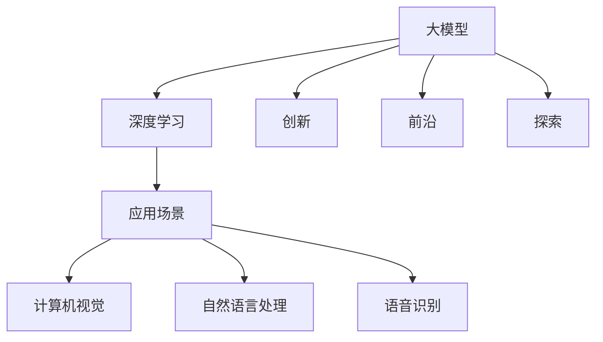

                 

# 大模型：科技创新的前沿探索

> 关键词：大模型,深度学习,创新,前沿,探索

## 1. 背景介绍

在当今科技迅猛发展的时代，大模型（Large Models）无疑是人工智能（AI）领域最为前沿和颠覆性的技术之一。作为深度学习领域的重要里程碑，大模型凭借其海量参数和强大泛化能力，成功地在计算机视觉、自然语言处理、语音识别等多个领域刷新了性能记录，展示了令人瞩目的创新潜力。本文将深入探讨大模型的原理、技术发展与应用场景，全面剖析这一领域的前沿探索与未来趋势。

## 2. 核心概念与联系

### 2.1 核心概念概述

- **大模型（Large Models）**：指具有亿级乃至万亿级参数的深度神经网络模型。这些模型通过大规模数据训练，具备了强大的特征提取与泛化能力，能够处理极其复杂的数据和任务。

- **深度学习（Deep Learning）**：一种基于神经网络的机器学习范式，通过多层次的非线性变换，从原始数据中学习到高级抽象特征，进而实现各类复杂的模式识别、预测与生成任务。

- **创新（Innovation）**：大模型推动了AI技术的飞跃式发展，不仅在模型结构、训练方法、应用场景等方面进行了大量创新，更在算法复杂性、计算资源需求、训练效率等方面实现了突破。

- **前沿（Frontier）**：大模型代表当前AI研究的最高水平，其发展的每一步都可能引领技术进步的新方向，开辟全新的研究领域。

- **探索（Exploration）**：面对大模型的广泛应用前景和潜在风险，科研与工程界在理论、算法、应用等多维度展开深入探索，力求实现技术的可持续发展和广泛应用。

这些核心概念通过以下Mermaid流程图展示了它们之间的联系：



这个流程图说明了大模型通过深度学习技术，推动了AI领域的创新与前沿探索，并在多个应用场景中展现出强大的能力。

## 3. 核心算法原理 & 具体操作步骤

### 3.1 算法原理概述

大模型的核心原理在于利用多层次的非线性变换，从原始数据中自动学习出高级特征，从而实现复杂的任务识别与生成。以深度卷积神经网络（CNN）为例，模型通过卷积层、池化层和全连接层等组件，逐步提取图像的局部特征与全局特征，并输出最终的分类或回归结果。而Transformer等大模型则通过自注意力机制和多层跨层连接，在序列数据上实现了更强的特征捕捉和表达能力。

### 3.2 算法步骤详解

大模型的训练通常包括以下几个关键步骤：

1. **数据准备**：选择合适的训练数据集，并进行预处理、分批处理等操作，确保数据的多样性与高质量。
   
2. **模型构建**：基于深度学习框架，设计适合任务的模型结构，如卷积神经网络（CNN）、循环神经网络（RNN）、Transformer等。

3. **损失函数定义**：根据任务类型，选择合适的损失函数，如交叉熵损失、均方误差损失等，用于衡量模型预测结果与真实标签之间的差距。

4. **反向传播优化**：利用梯度下降等优化算法，反向传播计算模型参数的梯度，并更新参数以最小化损失函数。

5. **模型评估与验证**：在验证集上评估模型的性能，使用准确率、精确度、召回率等指标衡量模型效果。

6. **参数微调**：根据验证结果，调整模型参数，如学习率、批大小、正则化系数等，以优化模型性能。

### 3.3 算法优缺点

大模型具有以下优点：

- **高泛化能力**：由于模型参数众多，大模型具备更强的特征学习能力，能够在各种复杂的场景下取得优异表现。
- **适应性强**：适用于多种任务，如图像识别、自然语言处理、语音识别等，模型结构高度可复用。
- **推动创新**：推动了深度学习与AI技术的新一轮发展，激发了更多前沿探索。

同时，大模型也存在一些缺点：

- **计算资源需求高**：模型参数庞大，训练和推理耗时较长，对硬件要求高。
- **过拟合风险大**：模型复杂度高，易产生过拟合，需要精心设计正则化技术。
- **可解释性差**：作为"黑盒"模型，大模型的决策过程缺乏透明度，难以解释。

### 3.4 算法应用领域

大模型在计算机视觉、自然语言处理、语音识别、推荐系统等多个领域得到了广泛应用：

- **计算机视觉**：大模型如ResNet、Inception等在图像分类、物体检测、图像生成等方面取得了突破性进展。
- **自然语言处理**：BERT、GPT等大模型在文本分类、语言翻译、情感分析、机器翻译等方面展示了强大的能力。
- **语音识别**：大模型如Wav2Vec等在语音识别、语音合成、语音情感分析等方面取得了重要进展。
- **推荐系统**：大模型如DeepFM、Wide & Deep等在个性化推荐、广告推荐等方面展示了高效的推荐能力。

## 4. 数学模型和公式 & 详细讲解 & 举例说明

### 4.1 数学模型构建

以自然语言处理任务为例，大模型通常采用Transformer架构，其数学模型可以表示为：

$$
M = M_{\text{Transformer}} = FFN \times \text{Multi-Head Self-Attention} \times \text{Positional Encoding} \times \text{Layer Normalization} \times \text{Positional Encoding}
$$

其中，$M$表示模型，$M_{\text{Transformer}}$表示Transformer模型，$FFN$表示全连接层，$\text{Multi-Head Self-Attention}$表示多头自注意力机制，$\text{Positional Encoding}$表示位置编码，$\text{Layer Normalization}$表示归一化层。

### 4.2 公式推导过程

以Transformer模型为例，自注意力机制的公式推导如下：

- **查询-键-值矩阵计算**：

  $$
  Q = \text{Linear}(K^T) = QK^T
  $$

  $$
  A = \text{Softmax}(QK^T / \sqrt{d_k})
  $$

- **注意力权重计算**：

  $$
  C = A \times V = \text{Softmax}(QK^T / \sqrt{d_k}) \times V
  $$

  其中，$K$和$V$是经过线性变换的查询矩阵和值矩阵，$d_k$是注意力头的维度。

- **多头注意力计算**：

  $$
  H = \text{Concat}(\text{head}_1, \text{head}_2, ..., \text{head}_h)
  $$

  $$
  \text{Attention} = \text{Softmax}(QK^T / \sqrt{d_k}) \times V
  $$

通过上述公式，Transformer模型能够自动学习输入序列中的相关性，并生成高质量的特征表示。

### 4.3 案例分析与讲解

以BERT为例，BERT通过在大规模无标签文本数据上进行预训练，学习到丰富的语言知识。其核心技术包括：

- **遮掩语言模型（Masked Language Model, MLM）**：随机遮盖部分输入词，并预测被遮盖词的上下文信息。

  $$
  \text{MLM} = \text{MaskedToken} \times \text{Non-MaskedToken}
  $$

- **下一句预测（Next Sentence Prediction, NSP）**：随机配对两句话，并预测它们是否来自同一个段落。

  $$
  \text{NSP} = \text{SentencePair} \times \text{BinaryLabel}
  $$

通过上述预训练任务，BERT模型在各种下游任务上取得了显著的性能提升。

## 5. 项目实践：代码实例和详细解释说明

### 5.1 开发环境搭建

以TensorFlow为例，搭建深度学习模型的开发环境：

1. 安装Python：`pip install python`
2. 安装TensorFlow：`pip install tensorflow`
3. 安装相关库：`pip install numpy scipy matplotlib scikit-learn`

### 5.2 源代码详细实现

以图像分类为例，使用TensorFlow构建卷积神经网络模型：

```python
import tensorflow as tf
from tensorflow.keras import layers

model = tf.keras.Sequential([
    layers.Conv2D(32, (3, 3), activation='relu', input_shape=(28, 28, 1)),
    layers.MaxPooling2D((2, 2)),
    layers.Conv2D(64, (3, 3), activation='relu'),
    layers.MaxPooling2D((2, 2)),
    layers.Flatten(),
    layers.Dense(64, activation='relu'),
    layers.Dense(10, activation='softmax')
])

model.compile(optimizer='adam',
              loss=tf.keras.losses.SparseCategoricalCrossentropy(from_logits=True),
              metrics=['accuracy'])
```

### 5.3 代码解读与分析

上述代码实现了卷积神经网络的基本结构，包括卷积层、池化层和全连接层。模型构建过程中，首先定义了两个卷积层，每个卷积层后接一个池化层，将特征图尺寸减半。最后，通过Flatten层将特征图展平，并通过全连接层输出分类结果。

### 5.4 运行结果展示

在CIFAR-10数据集上进行训练和验证：

```python
model.fit(train_images, train_labels, epochs=10, validation_data=(test_images, test_labels))
```

训练完成后，在测试集上进行评估：

```python
test_loss, test_acc = model.evaluate(test_images, test_labels)
print('Test accuracy:', test_acc)
```

## 6. 实际应用场景

### 6.1 智能交通系统

大模型在智能交通系统中展示了强大的应用潜力。通过实时处理摄像头拍摄的交通视频，大模型能够识别出车辆、行人等目标，并预测其运动轨迹。例如，大模型可以在实时交通监控中，自动检测并报警异常行为，提升交通安全性。

### 6.2 健康医疗

大模型在健康医疗领域的应用同样广阔。通过自然语言处理技术，大模型能够自动分析病历记录、医学文献等文本数据，辅助医生进行疾病诊断和治疗方案推荐。例如，大模型可以解析患者症状描述，快速匹配潜在疾病并给出诊断建议。

### 6.3 自动驾驶

自动驾驶技术是当前AI研究的热点之一。大模型在自动驾驶中可用于实时环境感知与决策，通过处理传感器数据，识别道路、车辆、行人等关键信息，并生成驾驶决策。例如，大模型可以基于实时环境信息，优化驾驶策略，提高行车安全与效率。

### 6.4 未来应用展望

未来，大模型将在更多领域展现出其创新潜力：

- **生物医学**：大模型可辅助药物发现、基因组学研究等，推动医学科技进步。
- **环境保护**：大模型可用于气候变化预测、环境监测等，提升环境保护水平。
- **智慧城市**：大模型在智能交通、公共安全、城市管理等方面展现出广泛的应用前景。
- **教育领域**：大模型可辅助个性化学习、智能辅助教学等，提升教育质量和效率。

## 7. 工具和资源推荐

### 7.1 学习资源推荐

- **《Deep Learning》 by Ian Goodfellow, Yoshua Bengio, Aaron Courville**：深度学习领域的经典教材，全面介绍了深度学习的基本原理与算法。
- **《Hands-On Machine Learning with Scikit-Learn and TensorFlow》 by Aurélien Géron**：实战导向的机器学习指南，详细讲解了TensorFlow等工具的使用方法。
- **Coursera《深度学习专项课程》 by Andrew Ng**：斯坦福大学的深度学习课程，涵盖深度学习基础与高级应用，适合初学者学习。

### 7.2 开发工具推荐

- **TensorFlow**：谷歌开源的深度学习框架，支持分布式训练、自动微分等高级功能，适合大规模模型开发。
- **PyTorch**：Facebook开源的深度学习框架，易于使用，支持动态计算图，适合研究和原型开发。
- **MXNet**：亚马逊开源的深度学习框架，支持多种编程语言和分布式训练，适合工业级应用。

### 7.3 相关论文推荐

- **"Attention is All You Need" by Ashish Vaswani et al.**：Transformer模型的经典论文，详细介绍了自注意力机制的应用。
- **"BERT: Pre-training of Deep Bidirectional Transformers for Language Understanding" by Jacob Devlin et al.**：BERT模型的经典论文，展示了预训练语言模型的强大能力。
- **"GPT-3: Language Models are Unsupervised Multitask Learners" by OpenAI**：GPT-3模型的介绍，展示了大模型的零样本学习能力。

## 8. 总结：未来发展趋势与挑战

### 8.1 研究成果总结

本文详细介绍了大模型的原理、技术发展与应用场景，展示了其在多个领域的创新潜力。通过卷积神经网络、Transformer等深度学习模型的构建与优化，大模型在图像处理、自然语言处理、语音识别等领域取得了突破性进展。同时，大模型在智能交通、健康医疗、自动驾驶等实际应用中展示了广阔的应用前景。

### 8.2 未来发展趋势

未来，大模型将进一步推动AI技术的发展，其趋势包括：

- **模型规模扩大**：随着计算资源的提升，大模型的参数量将继续增加，学习更多复杂特征。
- **算法与架构创新**：更多高效的深度学习算法与模型架构将被提出，提升模型训练与推理效率。
- **跨领域应用扩展**：大模型将在更多领域得到应用，提升各行业的智能化水平。
- **伦理与隐私保护**：大模型在应用过程中需考虑伦理与隐私保护，建立合规的使用机制。

### 8.3 面临的挑战

大模型在发展过程中面临以下挑战：

- **计算资源需求高**：大模型训练与推理耗时较长，对硬件要求高。
- **过拟合风险大**：模型复杂度高，易产生过拟合，需精心设计正则化技术。
- **可解释性差**：大模型作为"黑盒"模型，缺乏透明度，难以解释。
- **伦理与隐私问题**：大模型在应用过程中需考虑伦理与隐私保护，建立合规的使用机制。

### 8.4 研究展望

未来研究应关注以下几个方向：

- **高效训练与推理**：开发更高效的深度学习算法与模型架构，提升训练与推理效率。
- **跨领域迁移学习**：研究更多跨领域的迁移学习方法，提升模型的通用性与泛化能力。
- **模型解释与可解释性**：开发更透明的大模型，增强其可解释性，提升用户信任度。
- **伦理与隐私保护**：建立大模型应用的伦理与隐私保护机制，确保其合规性。

## 9. 附录：常见问题与解答

**Q1：大模型有哪些优点和缺点？**

A: 大模型的优点包括高泛化能力、适应性强、推动创新等。缺点则包括计算资源需求高、过拟合风险大、可解释性差等。

**Q2：大模型的训练过程中如何避免过拟合？**

A: 常用的方法包括数据增强、正则化、早停等。数据增强如图像旋转、翻转等，增加训练数据多样性。正则化如L2正则、Dropout等，减少模型复杂度。早停则通过验证集性能判断是否继续训练，避免过拟合。

**Q3：如何提高大模型的训练与推理效率？**

A: 通过硬件优化、模型压缩、模型量化等方法。硬件优化如使用GPU、TPU等高性能设备。模型压缩如剪枝、量化等，减少模型大小。模型量化如将浮点模型转为定点模型，提高计算效率。

**Q4：大模型在实际应用中如何确保伦理与隐私保护？**

A: 通过合规的数据收集与处理、透明的算法解释、用户控制等措施，确保大模型应用的伦理与隐私保护。

**Q5：未来大模型的发展方向有哪些？**

A: 未来大模型将进一步推动AI技术的发展，趋势包括模型规模扩大、算法与架构创新、跨领域应用扩展、伦理与隐私保护等。

---

作者：禅与计算机程序设计艺术 / Zen and the Art of Computer Programming

