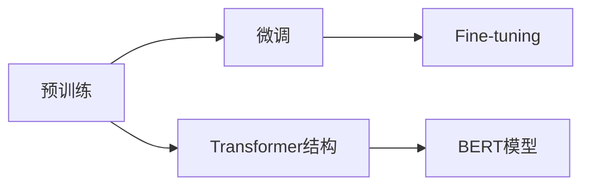

                 

# 大规模语言模型从理论到实践 大语言模型的基本概念

> 关键词：大规模语言模型,Transformer,BERT,预训练,自然语言处理(NLP),深度学习,神经网络

## 1. 背景介绍

### 1.1 问题由来
随着人工智能技术的飞速发展，自然语言处理(Natural Language Processing, NLP)领域取得了长足的进步。其中，大规模语言模型（Large Language Models, LLMs）的应用尤为引人瞩目。这些模型通过在大规模无标签文本数据上进行的预训练，能够学习和理解自然语言的广泛知识，并在此基础上进行微调（Fine-tuning）以适应特定的下游任务。

大语言模型的核心在于其自回归（如GPT）或自编码（如BERT）的结构设计，以及在预训练阶段使用的大量文本数据。这种架构使得模型能够在语言建模、文本分类、命名实体识别、情感分析、机器翻译等诸多NLP任务上表现出色。

### 1.2 问题核心关键点
大语言模型的研究与实践涉及以下几个核心关键点：
1. **预训练**：在大规模无标签文本数据上对模型进行预训练，使其掌握语言的基本结构和规律。
2. **微调**：通过有标签的下游任务数据对预训练模型进行微调，使其能够适应特定任务的语境和需求。
3. **Transformer结构**：作为大语言模型的主流架构，Transformer通过自注意力机制提升了模型的表达能力和计算效率。
4. **BERT模型**：作为早期成功案例，BERT展示了预训练语言模型的强大能力和泛化性能。
5. **深度学习**：大语言模型基于深度学习框架训练，依赖于反向传播算法和大规模数据集。

### 1.3 问题研究意义
研究大语言模型对于推进NLP领域的发展具有重要意义：
1. **提升任务性能**：通过微调，大语言模型能够在特定任务上取得卓越的性能，减少从头训练的开销。
2. **加速应用开发**：利用大模型进行微调可以大幅缩短应用开发的周期，降低成本。
3. **促进技术创新**：大语言模型的研究推动了NLP技术的创新，如提示学习、少样本学习等新技术的出现。
4. **推动行业应用**：大模型为各行各业提供了基于NLP的新应用场景，如智能客服、金融舆情监测、个性化推荐等。

## 2. 核心概念与联系

### 2.1 核心概念概述

为更好地理解大语言模型的基础概念和结构，本节将详细介绍以下核心概念：

- **大规模语言模型**（Large Language Model, LLM）：通过在大规模无标签文本数据上进行预训练，学习到自然语言的结构和语义表示的深度学习模型。典型模型如GPT、BERT等。
- **预训练**：在大规模数据集上进行无监督学习，获取语言的基本规律和知识。预训练是构建大语言模型的基础步骤。
- **微调**（Fine-tuning）：在预训练模型的基础上，使用下游任务的标注数据进行有监督学习，调整模型以适应特定任务。
- **Transformer结构**：基于自注意力机制的神经网络结构，显著提升了模型的并行性和效率。
- **BERT模型**：由Google开发，通过掩码语言模型和下一句预测两种自监督任务进行预训练，广泛用于各类NLP任务。

### 2.2 核心概念原理和架构的 Mermaid 流程图



这个流程图展示了预训练、微调与Transformer结构和大语言模型BERT之间的联系。预训练是微调的基础，Transformer结构为预训练提供了高效计算的支持，而微调则通过有监督学习将模型应用于特定任务。

## 3. 核心算法原理 & 具体操作步骤

### 3.1 算法原理概述

大语言模型的核心算法原理主要包括以下几个方面：

- **Transformer模型**：通过自注意力机制，Transformer模型能够高效地处理长序列数据，并且可以通过并行计算加速模型训练和推理。
- **BERT预训练**：BERT通过掩码语言模型和下一句预测任务进行预训练，学习到词语和上下文之间的复杂关系。
- **微调过程**：在微调过程中，使用下游任务的标注数据对模型进行有监督学习，调整模型参数以适应特定任务的需求。

### 3.2 算法步骤详解

#### 3.2.1 预训练阶段

预训练阶段的目标是在大规模无标签文本数据上学习语言的通用规律和结构。通常，预训练过程包括以下步骤：

1. **数据准备**：收集大规模无标签文本数据，如维基百科、新闻、书籍等。
2. **模型选择**：选择适当的预训练模型，如BERT、GPT等。
3. **训练过程**：在预训练数据上使用自监督学习任务训练模型，如掩码语言模型、下一句预测等。
4. **模型评估**：通过评价指标如困惑度、BLEU、ROUGE等评估模型的性能。

#### 3.2.2 微调阶段

微调阶段的目标是根据特定下游任务的要求，对预训练模型进行进一步训练和优化。具体步骤如下：

1. **数据准备**：准备下游任务的标注数据集，如情感分类、命名实体识别等。
2. **模型加载**：加载预训练模型和微调任务的数据集。
3. **任务适配**：根据微调任务的要求，添加适当的任务适配层，如全连接层、线性分类器等。
4. **优化器选择**：选择合适的优化器，如Adam、SGD等，设置学习率、批大小等超参数。
5. **训练过程**：使用下游任务的标注数据对模型进行有监督学习，调整模型参数。
6. **模型评估**：在验证集上评估模型性能，防止过拟合。
7. **测试和部署**：在测试集上评估模型性能，将模型部署到实际应用中。

### 3.3 算法优缺点

大规模语言模型在理论和实践中有以下优点和缺点：

**优点**：

1. **泛化能力强**：大模型通过预训练学习到了通用的语言规律和结构，能够适应多种NLP任务。
2. **训练效率高**：通过并行计算和Transformer结构，大模型能够在较短时间内完成训练。
3. **应用广泛**：大模型在自然语言理解、生成、翻译、问答等任务中均有卓越表现。

**缺点**：

1. **资源需求高**：预训练和微调需要大量的计算资源和存储空间，对硬件要求较高。
2. **泛化性能有限**：大模型在特定领域或任务上的性能可能不如专门设计的模型。
3. **可解释性差**：大模型通常被视为"黑盒"，难以解释其内部推理过程。
4. **训练成本高**：预训练和微调所需的标注数据成本较高，且需要大量人力进行数据标注。

### 3.4 算法应用领域

大语言模型在多个领域中得到了广泛应用，包括但不限于：

1. **自然语言理解**：情感分析、意图识别、命名实体识别等。
2. **自然语言生成**：机器翻译、文本摘要、对话系统等。
3. **信息检索**：问答系统、搜索引擎等。
4. **语音识别**：语音转文本、自动摘要等。
5. **知识图谱**：构建语义网络、知识推理等。

## 4. 数学模型和公式 & 详细讲解 & 举例说明

### 4.1 数学模型构建

大语言模型通常基于深度学习框架进行构建，主要数学模型包括：

- **神经网络模型**：多层感知机（MLP）、卷积神经网络（CNN）、循环神经网络（RNN）等。
- **自注意力机制**：Transformer模型的核心，通过多头自注意力机制学习词语之间的依赖关系。

### 4.2 公式推导过程

以BERT模型为例，其预训练过程通过以下两个自监督学习任务进行：

1. **掩码语言模型（Masked Language Model, MLM）**：对输入文本进行掩码，让模型预测被掩码词语的正确表示。
2. **下一句预测（Next Sentence Prediction, NSP）**：给定两个文本段落，判断它们是否是连续的。

掩码语言模型的损失函数为：

$$
\mathcal{L}_{MLM} = -\frac{1}{N}\sum_{i=1}^{N}\sum_{j=1}^{N}\log P_{i,j}
$$

其中 $P_{i,j}$ 表示模型预测第 $i$ 个词语在 $j$ 个位置上的概率。

下一句预测的损失函数为：

$$
\mathcal{L}_{NSP} = -\frac{1}{N}\sum_{i=1}^{N}(\log P_{i,j} + \log P_{i,k})
$$

其中 $P_{i,j}$ 表示模型预测第 $i$ 个文本与第 $j$ 个文本是连续的概率，$P_{i,k}$ 表示模型预测第 $i$ 个文本与第 $k$ 个文本是连续的概率。

### 4.3 案例分析与讲解

以情感分类任务为例，演示如何使用BERT模型进行微调。

1. **数据准备**：收集情感分类的标注数据集，如IMDB电影评论数据集。
2. **模型加载**：加载预训练的BERT模型。
3. **任务适配**：添加线性分类器作为任务适配层。
4. **优化器选择**：选择Adam优化器，设置学习率为1e-5。
5. **训练过程**：使用标注数据对模型进行有监督学习，训练轮数为10轮。
6. **模型评估**：在验证集上评估模型性能，计算准确率、精确率、召回率等指标。
7. **测试和部署**：在测试集上评估模型性能，将模型部署到实际应用中。

## 5. 项目实践：代码实例和详细解释说明

### 5.1 开发环境搭建

在Python环境中搭建BERT模型微调项目的基本步骤如下：

1. **安装必要的Python包**：安装transformers、numpy、pandas等包。
2. **准备数据**：收集标注数据集，如IMDB电影评论数据集。
3. **设置实验环境**：配置好GPU或TPU环境，保证有足够的计算资源。

### 5.2 源代码详细实现

以下是一个简单的情感分类任务微调代码实现：

```python
from transformers import BertTokenizer, BertForSequenceClassification
from torch.utils.data import DataLoader
from sklearn.metrics import classification_report
import torch

# 加载预训练模型和分词器
model = BertForSequenceClassification.from_pretrained('bert-base-uncased')
tokenizer = BertTokenizer.from_pretrained('bert-base-uncased')

# 加载数据集
train_dataset = ...
val_dataset = ...
test_dataset = ...

# 设置超参数
batch_size = 32
learning_rate = 1e-5
num_epochs = 10

# 定义模型和优化器
optimizer = torch.optim.Adam(model.parameters(), lr=learning_rate)

# 定义训练函数
def train(model, train_dataset, val_dataset, optimizer, device):
    model.to(device)
    train_loader = DataLoader(train_dataset, batch_size=batch_size, shuffle=True)
    val_loader = DataLoader(val_dataset, batch_size=batch_size, shuffle=False)
    
    for epoch in range(num_epochs):
        model.train()
        total_loss = 0
        for batch in train_loader:
            inputs = tokenizer(batch['text'], padding=True, truncation=True, max_length=512, return_tensors='pt').to(device)
            outputs = model(**inputs)
            loss = outputs.loss
            optimizer.zero_grad()
            loss.backward()
            optimizer.step()
            total_loss += loss.item()
        
        val_loss = 0
        model.eval()
        with torch.no_grad():
            for batch in val_loader:
                inputs = tokenizer(batch['text'], padding=True, truncation=True, max_length=512, return_tensors='pt').to(device)
                outputs = model(**inputs)
                loss = outputs.loss
                val_loss += loss.item()
        
        print(f'Epoch {epoch+1}, Train Loss: {total_loss/len(train_loader)}, Val Loss: {val_loss/len(val_loader)}')

# 训练模型
train(model, train_dataset, val_dataset, optimizer, device='cuda')
```

### 5.3 代码解读与分析

以上代码中，我们首先加载了预训练的BERT模型和分词器，然后定义了训练集、验证集和测试集，并设置了模型参数、优化器和训练轮数。在训练函数中，我们使用了DataLoader来处理数据，并使用了Adam优化器来更新模型参数。

### 5.4 运行结果展示

运行上述代码，可以在终端中看到每个epoch的训练和验证损失，以及最终的模型性能评估结果。

## 6. 实际应用场景

### 6.1 智能客服系统

智能客服系统是大语言模型微调的一个典型应用场景。通过微调，大模型可以在处理客户咨询时提供更加自然流畅的回答，提升客户满意度。

在实际应用中，智能客服系统需要处理大量的客户咨询请求，通常包括常见问题、产品推荐、订单处理等。通过微调，大模型可以学习到不同客户的咨询意图和语言风格，提供个性化的回答。同时，大模型还可以通过持续学习，不断优化回答质量，提高客户满意度。

### 6.2 金融舆情监测

金融舆情监测是大语言模型微调的另一个重要应用场景。通过微调，大模型可以从大量金融新闻和评论中提取关键信息，帮助金融机构及时掌握市场动态，规避金融风险。

在金融舆情监测中，大模型需要处理大量的金融新闻、评论、报告等文本数据，从中提取重要的金融事件、政策变化、市场趋势等信息。通过微调，大模型可以学习到这些信息的重要性和关联性，从而实现对金融舆情的实时监测和预警。

### 6.3 个性化推荐系统

个性化推荐系统是电商、视频、音乐等领域的核心应用。通过微调，大模型可以根据用户的历史行为和兴趣，提供个性化的商品或内容推荐。

在个性化推荐系统中，大模型需要处理用户的历史浏览记录、购买记录、评分记录等数据，从中学习到用户的兴趣偏好和行为模式。通过微调，大模型可以更加准确地预测用户的下一步行为，从而提供个性化的推荐。

### 6.4 未来应用展望

随着大语言模型技术的不断发展，其在更多领域的应用前景也将更加广阔。以下是一些未来可能的应用方向：

1. **智慧医疗**：通过微调，大模型可以帮助医生进行疾病诊断、药物推荐、病历分析等，提升医疗服务水平。
2. **智能教育**：通过微调，大模型可以辅助教师进行作业批改、学情分析、知识推荐等，提升教育质量。
3. **智慧城市**：通过微调，大模型可以帮助城市管理者进行事件监测、舆情分析、应急指挥等，提升城市治理水平。
4. **金融风控**：通过微调，大模型可以帮助金融机构进行信用评估、风险预警、欺诈检测等，保障金融安全。

## 7. 工具和资源推荐

### 7.1 学习资源推荐

为帮助开发者深入理解大语言模型的原理和实践，以下是一些推荐的资源：

1. **《Transformer from Pricing to Practice》**：系列博客文章，详细介绍Transformer模型的原理和实践。
2. **《Natural Language Processing with Transformers》**：书籍，全面介绍使用Transformers库进行NLP任务开发的方法。
3. **CS224N《深度学习自然语言处理》课程**：斯坦福大学的NLP课程，提供丰富的视频和作业，适合学习者入门。

### 7.2 开发工具推荐

大语言模型的开发和微调需要依赖多种工具，以下是一些常用的开发工具：

1. **PyTorch**：深度学习框架，支持动态计算图，适合进行大模型的微调。
2. **TensorFlow**：深度学习框架，适合大规模工程应用。
3. **Transformers库**：Hugging Face开发的NLP工具库，包含多种预训练模型，适合微调任务开发。
4. **Weights & Biases**：模型训练的实验跟踪工具，记录和可视化训练过程。
5. **TensorBoard**：TensorFlow配套的可视化工具，监控训练过程。

### 7.3 相关论文推荐

大语言模型和微调技术的研究涉及多个领域，以下是一些有影响力的论文：

1. **Attention is All You Need**：Transformer模型的原论文，提出自注意力机制。
2. **BERT: Pre-training of Deep Bidirectional Transformers for Language Understanding**：BERT模型的原论文，提出掩码语言模型和下一句预测任务。
3. **Parameter-Efficient Transfer Learning for NLP**：提出适配器（Adapter）等参数高效微调方法。
4. **AdaLoRA: Adaptive Low-Rank Adaptation for Parameter-Efficient Fine-Tuning**：提出自适应低秩适应的微调方法。

## 8. 总结：未来发展趋势与挑战

### 8.1 研究成果总结

大语言模型的微调技术经过多年的发展，已经取得了显著的进展。其主要研究成果包括：

1. **Transformer架构的提出**：Transformer模型通过自注意力机制，显著提升了模型的计算效率和表达能力。
2. **BERT模型的引入**：BERT模型通过掩码语言模型和下一句预测任务，学习到词语和上下文之间的复杂关系。
3. **微调技术的应用**：通过微调，大模型能够在特定任务上取得卓越的性能，提升NLP应用的效率和效果。

### 8.2 未来发展趋势

大语言模型的未来发展趋势包括：

1. **模型规模增大**：随着算力成本的下降和数据量的增加，预训练和微调的模型规模将进一步增大，模型的泛化能力和表达能力也将进一步提升。
2. **算法优化提升**：未来的算法研究将更多关注模型的参数效率和计算效率，如参数高效微调、梯度积累等技术。
3. **多模态融合**：未来的研究将更多关注跨模态信息的融合，将视觉、语音、文本等多模态信息进行协同建模。
4. **模型通用性提升**：未来的模型将更加通用，能够适应各种领域的任务需求，甚至具备通用人工智能的能力。

### 8.3 面临的挑战

尽管大语言模型在许多领域取得了成功，但仍然面临一些挑战：

1. **数据质量问题**：预训练和微调的数据质量对模型的性能有重要影响，数据标注成本高、数据质量参差不齐等问题仍需解决。
2. **模型鲁棒性不足**：大模型在不同领域和任务上的泛化能力有限，模型鲁棒性不足是一个重要挑战。
3. **模型复杂度较高**：大模型的计算复杂度高，需要高性能硬件和优化算法支持。
4. **可解释性差**：大模型通常被视为"黑盒"，难以解释其内部推理过程，这对高风险应用是一个重大挑战。
5. **安全性和伦理问题**：大模型的输出可能存在偏见和有害信息，如何确保模型的安全性和伦理性是一个重要课题。

### 8.4 研究展望

未来，大语言模型的研究将更多关注以下几个方面：

1. **无监督和半监督学习**：通过无监督和半监督学习，降低对标注数据的依赖，提高模型的泛化能力。
2. **多任务学习**：将多个任务进行联合训练，提高模型的多任务适应能力。
3. **跨模态学习**：将不同模态的信息进行融合，提高模型的感知能力。
4. **模型压缩和加速**：通过模型压缩和加速技术，提高模型的效率和可部署性。

## 9. 附录：常见问题与解答

### 9.1 Q1: 大语言模型微调是否适用于所有NLP任务？

A: 大语言模型微调在大多数NLP任务上都能取得不错的效果，特别是对于数据量较小的任务。但对于一些特定领域的任务，如医学、法律等，仅仅依靠通用语料预训练的模型可能难以很好地适应。此时需要在特定领域语料上进一步预训练，再进行微调，才能获得理想效果。此外，对于一些需要时效性、个性化很强的任务，如对话、推荐等，微调方法也需要针对性的改进优化。

### 9.2 Q2: 如何缓解微调过程中的过拟合问题？

A: 过拟合是微调面临的主要挑战，尤其是在标注数据不足的情况下。常见的缓解策略包括：
1. 数据增强：通过回译、近义替换等方式扩充训练集
2. 正则化：使用L2正则、Dropout、Early Stopping等避免过拟合
3. 对抗训练：引入对抗样本，提高模型鲁棒性
4. 参数高效微调：只调整少量参数(如Adapter、Prefix等)，减小过拟合风险
5. 多模型集成：训练多个微调模型，取平均输出，抑制过拟合

这些策略往往需要根据具体任务和数据特点进行灵活组合。只有在数据、模型、训练、推理等各环节进行全面优化，才能最大限度地发挥大模型微调的威力。

### 9.3 Q3: 如何确保微调模型的安全性？

A: 确保微调模型的安全性需要从数据和算法两个方面进行考虑：
1. 数据安全性：对输入数据进行严格的预处理和清洗，避免恶意输入影响模型输出。
2. 算法安全性：在模型训练过程中加入伦理导向的评估指标，过滤和惩罚有偏见、有害的输出倾向。同时加强人工干预和审核，建立模型行为的监管机制，确保输出符合人类价值观和伦理道德。

通过这些措施，可以最大程度地提高微调模型的安全性，避免有害信息的传播和误导。

---

作者：禅与计算机程序设计艺术 / Zen and the Art of Computer Programming

