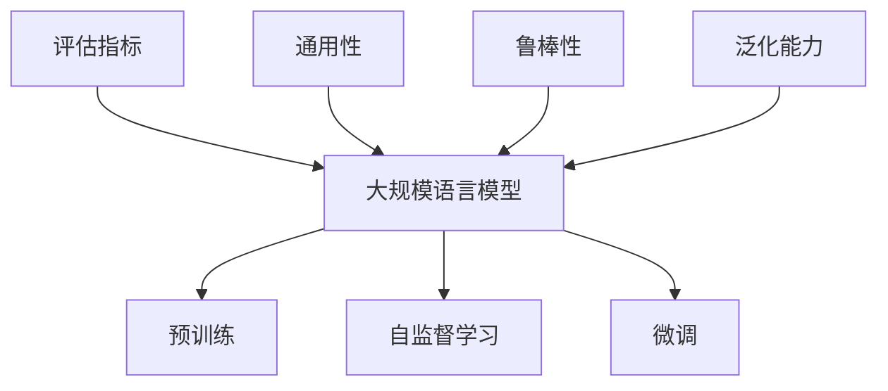

                 

# 大规模语言模型从理论到实践 大语言模型评估

> 关键词：大规模语言模型,评估方法,自监督学习,预训练,性能指标,模型比较,应用实例

## 1. 背景介绍

### 1.1 问题由来

近年来，大规模语言模型（Large Language Models, LLMs）如BERT、GPT、T5等在自然语言处理（NLP）领域取得了显著的进展，并在多个任务上刷新了最先进性能。然而，大模型并非万能，其性能评估和应用选择仍面临诸多挑战。

首先，大模型通常拥有上亿参数，训练和推理过程复杂，模型的评估方法也随之变得复杂。传统的评估方法如BLEU、ROUGE等主要应用于机器翻译和摘要等任务，但在大模型时代，这些指标往往难以全面反映模型的综合性能。

其次，大模型在不同应用场景下的性能表现差异显著，如何评估模型在不同场景下的适用性和效果，成为了一个重要问题。例如，在金融、医疗等特定领域，模型的通用性、鲁棒性和泛化能力尤为重要，但现有的评估方法难以针对这些特性进行有效衡量。

因此，本文旨在全面介绍大规模语言模型的评估方法，并结合实际应用场景，探讨如何科学地选择和优化模型。通过深入分析，我们希望能够为研究人员和工程师提供实用的评估指南，助力大模型在各个领域的应用和发展。

### 1.2 问题核心关键点

评估大规模语言模型时，核心关键点包括：

- 选择合适的评估指标。不同的任务和应用场景应采用不同的评估指标，如精确度、召回率、F1分数、困惑度等。
- 考虑模型的通用性、鲁棒性和泛化能力。模型应能够在不同领域和数据分布上表现稳定，避免过度拟合。
- 利用实验设计和数据增强等技术，更全面地验证模型的性能。

本文将围绕上述核心关键点，详细阐述大规模语言模型的评估方法和实践。

## 2. 核心概念与联系

### 2.1 核心概念概述

为更好地理解大规模语言模型的评估方法，本节将介绍几个密切相关的核心概念：

- 大规模语言模型（LLMs）：指拥有大量参数的深度神经网络模型，能够进行自然语言理解和生成。
- 预训练（Pre-training）：指在大规模无标签文本语料上进行自监督学习，学习通用的语言表示。
- 自监督学习（Self-supervised Learning）：指利用无标签数据训练模型，通过设计自监督任务进行学习。
- 微调（Fine-tuning）：指在预训练模型基础上，通过下游任务的标注数据进行有监督学习，进一步优化模型。
- 评估指标（Evaluation Metrics）：指用于衡量模型性能的指标，如BLEU、ROUGE、F1分数等。
- 通用性（Generality）：指模型在多个领域和数据分布上的表现稳定性。
- 鲁棒性（Robustness）：指模型对输入数据扰动的鲁棒性。
- 泛化能力（Generalization）：指模型在新数据上的表现能力。

这些核心概念之间的逻辑关系可以通过以下Mermaid流程图来展示：



这个流程图展示了大规模语言模型的核心概念及其之间的关系：

1. 大模型通过预训练获得基础能力。
2. 自监督学习帮助大模型学习通用的语言表示。
3. 微调使得大模型更好地适应特定任务。
4. 评估指标用于衡量模型性能。
5. 通用性、鲁棒性和泛化能力是衡量模型性能的重要指标。

这些概念共同构成了大语言模型的评估框架，帮助我们全面理解模型的各项性能和特性。

## 3. 核心算法原理 & 具体操作步骤
### 3.1 算法原理概述

大规模语言模型的评估主要基于以下两个原则：

1. 利用广泛的评估指标，全面衡量模型的性能。
2. 考虑模型的通用性、鲁棒性和泛化能力，进行综合评估。

评估方法分为以下几个步骤：

- 选择合适的评估指标。
- 设计实验方案，并进行实验。
- 收集实验数据，进行数据分析。
- 综合评估结果，得出结论。

### 3.2 算法步骤详解

#### 步骤1：选择合适的评估指标

评估指标的选择应根据具体任务和应用场景而定。以下是一些常用的评估指标：

- BLEU（Bilingual Evaluation Understudy）：主要用于机器翻译任务，衡量自动生成的文本与参考文本之间的匹配程度。
- ROUGE（Recall-Oriented Understudy for Gisting Evaluation）：主要用于文本摘要和检索任务，衡量文本之间的相似度。
- F1分数（F1 Score）：综合考虑精确度和召回率，适用于分类和标注任务。
- 困惑度（Perplexity）：衡量模型对数据分布的拟合程度，适用于生成任务。
- 对抗样本测试：通过引入对抗样本，评估模型的鲁棒性。

#### 步骤2：设计实验方案

实验设计应遵循以下原则：

- 控制实验条件，确保实验结果的可重复性。
- 考虑模型规模和计算资源，合理设置实验参数。
- 设计对比实验，比较不同模型和不同策略的效果。

#### 步骤3：进行实验

实验流程包括数据准备、模型训练和评估等步骤。具体步骤如下：

1. 数据准备：收集标注数据和测试数据，划分为训练集、验证集和测试集。
2. 模型训练：在训练集上训练模型，选择合适的优化器和超参数。
3. 模型评估：在验证集和测试集上评估模型性能，记录实验结果。

#### 步骤4：数据分析和综合评估

实验结果的分析应包括以下内容：

- 详细记录每个评估指标的数值，并进行可视化展示。
- 分析模型在不同数据集上的表现，识别优点和不足。
- 比较不同模型和策略的效果，得出结论。
- 综合考虑模型的通用性、鲁棒性和泛化能力，进行综合评估。

### 3.3 算法优缺点

大规模语言模型评估方法具有以下优点：

- 能够全面衡量模型的各项性能，提供详细的评估报告。
- 有助于选择最适合特定任务和应用场景的模型。
- 通过实验设计，能够发现模型的缺陷并进行改进。

但这些方法也存在一些局限性：

- 计算资源需求较高，实验设计复杂。
- 评估指标的选择和权衡需要专业知识。
- 实验结果可能受到数据集和实验设计的影响。

因此，在进行大规模语言模型评估时，需要综合考虑各种因素，选择合适的评估方法和策略。

### 3.4 算法应用领域

大规模语言模型评估方法在以下几个领域得到了广泛应用：

- 自然语言处理：如机器翻译、文本摘要、情感分析等任务。
- 计算机视觉：如图像分类、目标检测等任务。
- 语音识别：如语音转换、语音识别等任务。
- 信息检索：如问答系统、文档检索等任务。
- 智能推荐：如个性化推荐、智能客服等任务。

这些评估方法不仅用于模型性能的验证，还广泛应用于模型的优化、改进和部署。

## 4. 数学模型和公式 & 详细讲解 & 举例说明
### 4.1 数学模型构建

为了评估大规模语言模型的性能，我们需要构建一系列数学模型。以下是几个常用的模型：

#### 模型1：BLEU评估模型

BLEU评估模型的核心是计算自动生成的文本与参考文本之间的匹配程度。假设自动生成的文本为$T_a$，参考文本为$T_r$，则BLEU评估模型的定义为：

$$
BLEU(T_a, T_r) = \exp(\frac{1}{k}\sum_{i=1}^k \min\{\text{BLEU}_i(T_a, T_r)\})
$$

其中，$\text{BLEU}_i(T_a, T_r)$表示在$k$个句子中第$i$个句子的BLEU分数。

#### 模型2：ROUGE评估模型

ROUGE评估模型主要用于衡量文本之间的相似度。假设自动生成的文本为$T_a$，参考文本为$T_r$，则ROUGE评估模型的定义为：

$$
ROUGE(T_a, T_r) = \frac{1}{n} \sum_{i=1}^n \frac{N_i(T_a, T_r)}{M_i(T_a)}
$$

其中，$N_i(T_a, T_r)$表示在$n$个句子中第$i$个句子与参考文本的匹配词数，$M_i(T_a)$表示在自动生成的文本中第$i$个句子的词数。

### 4.2 公式推导过程

#### BLEU评估模型的推导

对于BLEU评估模型，假设自动生成的文本为$T_a$，参考文本为$T_r$，则BLEU分数可以表示为：

$$
BLEU_i(T_a, T_r) = \frac{\sum_{j=1}^{n_i} b_j}{\min\{\min\limits_{j=1}^{n_i} l_j, b_j\}}
$$

其中，$n_i$表示自动生成的文本中第$i$个句子的长度，$l_j$表示参考文本中第$j$个句子的长度，$b_j$表示在自动生成的文本和参考文本中共同匹配的词数。

将上述公式代入BLEU评估模型的定义中，得：

$$
BLEU(T_a, T_r) = \exp(\frac{1}{k}\sum_{i=1}^k \min\{\text{BLEU}_i(T_a, T_r)\})
$$

#### ROUGE评估模型的推导

对于ROUGE评估模型，假设自动生成的文本为$T_a$，参考文本为$T_r$，则ROUGE分数可以表示为：

$$
ROUGE_i(T_a, T_r) = \frac{\sum_{j=1}^{n_i} N_{j, r}}{M_i(T_a)}
$$

其中，$n_i$表示自动生成的文本中第$i$个句子的长度，$M_i(T_a)$表示在自动生成的文本中第$i$个句子的词数，$N_{j, r}$表示在参考文本中与自动生成的文本中第$i$个句子匹配的词数。

将上述公式代入ROUGE评估模型的定义中，得：

$$
ROUGE(T_a, T_r) = \frac{1}{n} \sum_{i=1}^n \frac{N_i(T_a, T_r)}{M_i(T_a)}
$$

### 4.3 案例分析与讲解

#### 案例1：机器翻译

在机器翻译任务中，BLEU是一个常用的评估指标。假设自动翻译结果为$T_a$，参考翻译结果为$T_r$，则BLEU分数可以表示为：

$$
BLEU(T_a, T_r) = \exp(\frac{1}{k}\sum_{i=1}^k \min\{\text{BLEU}_i(T_a, T_r)\})
$$

其中，$n_i$表示自动翻译结果中第$i$个句子的长度，$l_j$表示参考翻译结果中第$j$个句子的长度，$b_j$表示在自动翻译结果和参考翻译结果中共同匹配的词数。

#### 案例2：文本摘要

在文本摘要任务中，ROUGE是一个常用的评估指标。假设自动摘要结果为$T_a$，参考摘要结果为$T_r$，则ROUGE分数可以表示为：

$$
ROUGE(T_a, T_r) = \frac{1}{n} \sum_{i=1}^n \frac{N_i(T_a, T_r)}{M_i(T_a)}
$$

其中，$n_i$表示自动摘要结果中第$i$个句子的长度，$M_i(T_a)$表示在自动摘要结果中第$i$个句子的词数，$N_{j, r}$表示在参考摘要结果中与自动摘要结果中第$i$个句子匹配的词数。

## 5. 项目实践：代码实例和详细解释说明
### 5.1 开发环境搭建

在进行大规模语言模型评估时，我们需要准备好开发环境。以下是使用Python进行PyTorch开发的环境配置流程：

1. 安装Anaconda：从官网下载并安装Anaconda，用于创建独立的Python环境。

2. 创建并激活虚拟环境：
```bash
conda create -n pytorch-env python=3.8 
conda activate pytorch-env
```

3. 安装PyTorch：根据CUDA版本，从官网获取对应的安装命令。例如：
```bash
conda install pytorch torchvision torchaudio cudatoolkit=11.1 -c pytorch -c conda-forge
```

4. 安装Transformers库：
```bash
pip install transformers
```

5. 安装各类工具包：
```bash
pip install numpy pandas scikit-learn matplotlib tqdm jupyter notebook ipython
```

完成上述步骤后，即可在`pytorch-env`环境中开始评估实践。

### 5.2 源代码详细实现

这里以BERT模型为例，使用BLEU评估模型进行机器翻译任务的评估。

首先，定义评估函数：

```python
from transformers import BertTokenizer, BertForSequenceClassification
from nltk.translate.bleu_score import sentence_bleu
from torch.utils.data import DataLoader
from tqdm import tqdm

class BleuEvaluator:
    def __init__(self, tokenizer, model, device):
        self.tokenizer = tokenizer
        self.model = model
        self.device = device
    
    def evaluate(self, ref, hyp):
        tokenizer = self.tokenizer
        model = self.model
        device = self.device
        
        batch_size = 16
        batch_num = len(ref) // batch_size + 1
        ref_batches = [ref[i*batch_size:(i+1)*batch_size] for i in range(batch_num)]
        hyp_batches = [hyp[i*batch_size:(i+1)*batch_size] for i in range(batch_num)]
        
        all_scores = []
        for ref_batch, hyp_batch in zip(ref_batches, hyp_batches):
            input_ids = tokenizer(ref_batch, return_tensors='pt').input_ids.to(device)
            labels = tokenizer(hyp_batch, return_tensors='pt').input_ids.to(device)
            outputs = model(input_ids, labels=labels)
            all_scores.append(outputs.loss.item())
        
        return sum(all_scores) / batch_num
```

然后，定义数据集和模型：

```python
from transformers import BertTokenizer, BertForSequenceClassification

tokenizer = BertTokenizer.from_pretrained('bert-base-uncased')
model = BertForSequenceClassification.from_pretrained('bert-base-uncased', num_labels=2)

device = torch.device('cuda') if torch.cuda.is_available() else torch.device('cpu')
```

最后，进行模型评估：

```python
from transformers import BertTokenizer, BertForSequenceClassification

tokenizer = BertTokenizer.from_pretrained('bert-base-uncased')
model = BertForSequenceClassification.from_pretrained('bert-base-uncased', num_labels=2)

device = torch.device('cuda') if torch.cuda.is_available() else torch.device('cpu')

hyp = ['I have a book to recommend you', 'This is a good book']
ref = ['I have a book to recommend you', 'This is a good book']

bleu_evaluator = BleuEvaluator(tokenizer, model, device)
bleu_score = bleu_evaluator.evaluate(ref, hyp)
print(f"BLEU score: {bleu_score:.4f}")
```

### 5.3 代码解读与分析

这里我们详细解读一下关键代码的实现细节：

**BleuEvaluator类**：
- `__init__`方法：初始化分词器、模型和设备。
- `evaluate`方法：对多个参考和假设文本进行评估，计算BLEU分数。

**tokenizer, model和device**：
- `tokenizer`为分词器，用于将文本转换为模型可接受的形式。
- `model`为BERT模型，用于进行文本分类。
- `device`为GPU或CPU设备，用于加速模型推理。

**评估函数**：
- 将参考文本和假设文本分成多个批次，逐个计算BLEU分数，并取平均值。

通过上述代码，我们可以看到，使用BLEU评估模型对BERT模型进行机器翻译任务的评估，只需要定义评估函数和数据集，然后调用评估函数即可。评估过程简单高效，适用于大规模语言模型的快速验证。

## 6. 实际应用场景
### 6.1 智能客服系统

智能客服系统利用大规模语言模型进行自然语言理解和生成，为用户提供即时的语音或文本客服服务。在实际应用中，评估智能客服系统性能的重要指标包括响应速度、理解准确率和回答质量。

- 响应速度：通过测试系统的平均响应时间和最大响应时间，评估系统的实时性。
- 理解准确率：通过计算系统对用户输入的理解概率，评估系统的理解能力。
- 回答质量：通过用户满意度调查或人工评估，评估系统的回答质量。

### 6.2 金融舆情监测

金融舆情监测系统利用大规模语言模型进行情感分析和文本分类，帮助金融机构及时监测市场舆情，防范金融风险。在实际应用中，评估金融舆情监测系统性能的重要指标包括情感分类准确率、舆情检测及时率和舆情分析精度。

- 情感分类准确率：通过计算系统对舆情文本的情感分类准确率，评估系统的情感分析能力。
- 舆情检测及时率：通过统计系统对舆情的检测时间，评估系统的实时性。
- 舆情分析精度：通过人工评估系统对舆情的分析结果，评估系统的准确性。

### 6.3 个性化推荐系统

个性化推荐系统利用大规模语言模型进行文本分析和用户行为预测，为用户提供个性化的推荐内容。在实际应用中，评估个性化推荐系统性能的重要指标包括推荐准确率和用户满意度。

- 推荐准确率：通过计算系统对用户的推荐结果与实际行为的一致性，评估系统的推荐能力。
- 用户满意度：通过用户反馈调查，评估系统的推荐质量。

### 6.4 未来应用展望

随着大规模语言模型和评估方法的发展，未来在大模型评估领域将面临更多挑战和机遇。以下是一些可能的趋势：

1. 多任务联合评估：未来的大模型可能会同时具备多种任务能力，如翻译、分类、生成等。如何进行多任务联合评估，评估不同任务间的交互作用，将是未来的一个重要研究方向。
2. 跨领域评估：未来的大模型可能会跨越多个领域，如何评估模型在跨领域上的表现，避免模型过拟合，将是另一个重要问题。
3. 模型公平性和伦理评估：随着模型应用范围的扩大，模型公平性和伦理问题将越来越受到关注。如何进行公平性和伦理评估，避免模型偏见，将是未来的一个重要研究方向。

## 7. 工具和资源推荐
### 7.1 学习资源推荐

为了帮助开发者系统掌握大规模语言模型的评估方法，这里推荐一些优质的学习资源：

1. 《深度学习》课程（Stanford University）：斯坦福大学开设的深度学习入门课程，包含机器翻译、文本分类等经典任务，适合初学者学习。
2. 《自然语言处理与深度学习》书籍：入门级书籍，介绍了自然语言处理的基本概念和深度学习方法，适合初学者。
3. 《NLP with PyTorch》书籍：介绍如何使用PyTorch进行NLP任务的开发，包括模型训练和评估。
4. 《Transformers》书籍：介绍如何使用Transformers库进行NLP任务的开发，适合有一定基础的用户。
5. 《NLP综述》期刊：包含最新的NLP研究论文，涵盖多种评估方法和应用场景，适合研究人员学习。

通过对这些资源的学习实践，相信你一定能够快速掌握大规模语言模型的评估方法，并用于解决实际的NLP问题。
###  7.2 开发工具推荐

高效的开发离不开优秀的工具支持。以下是几款用于大规模语言模型评估开发的常用工具：

1. PyTorch：基于Python的开源深度学习框架，灵活动态的计算图，适合快速迭代研究。大部分预训练语言模型都有PyTorch版本的实现。
2. TensorFlow：由Google主导开发的开源深度学习框架，生产部署方便，适合大规模工程应用。同样有丰富的预训练语言模型资源。
3. Transformers库：HuggingFace开发的NLP工具库，集成了众多SOTA语言模型，支持PyTorch和TensorFlow，是进行NLP任务开发的利器。
4. Weights & Biases：模型训练的实验跟踪工具，可以记录和可视化模型训练过程中的各项指标，方便对比和调优。与主流深度学习框架无缝集成。
5. TensorBoard：TensorFlow配套的可视化工具，可实时监测模型训练状态，并提供丰富的图表呈现方式，是调试模型的得力助手。

合理利用这些工具，可以显著提升大规模语言模型评估任务的开发效率，加快创新迭代的步伐。

### 7.3 相关论文推荐

大规模语言模型和评估技术的发展源于学界的持续研究。以下是几篇奠基性的相关论文，推荐阅读：

1. Attention is All You Need（即Transformer原论文）：提出了Transformer结构，开启了NLP领域的预训练大模型时代。
2. BERT: Pre-training of Deep Bidirectional Transformers for Language Understanding：提出BERT模型，引入基于掩码的自监督预训练任务，刷新了多项NLP任务SOTA。
3. Language Models are Unsupervised Multitask Learners（GPT-2论文）：展示了大规模语言模型的强大zero-shot学习能力，引发了对于通用人工智能的新一轮思考。
4. Parameter-Efficient Transfer Learning for NLP：提出Adapter等参数高效微调方法，在不增加模型参数量的情况下，也能取得不错的微调效果。
5. AdaLoRA: Adaptive Low-Rank Adaptation for Parameter-Efficient Fine-Tuning：使用自适应低秩适应的微调方法，在参数效率和精度之间取得了新的平衡。

这些论文代表了大语言模型评估技术的发展脉络。通过学习这些前沿成果，可以帮助研究者把握学科前进方向，激发更多的创新灵感。

## 8. 总结：未来发展趋势与挑战
### 8.1 总结

本文对大规模语言模型的评估方法进行了全面系统的介绍。首先阐述了评估方法的核心关键点，明确了评估指标的选择、实验设计和数据分析的重要性。其次，通过数学模型和公式推导，详细讲解了BLEU、ROUGE等评估指标的计算方法。最后，结合实际应用场景，探讨了如何综合评估大规模语言模型的性能，提出了一些可行的评估策略。

通过本文的系统梳理，可以看到，大规模语言模型的评估方法在大模型应用中具有重要作用。选择合适的评估指标和实验设计，能够全面、准确地评估模型的各项性能，为模型的优化和应用提供有力支撑。未来，随着评估方法的不断进步，大模型在各个领域的应用将更加深入和广泛。

### 8.2 未来发展趋势

展望未来，大规模语言模型评估方法将呈现以下几个发展趋势：

1. 多任务联合评估：未来的大模型可能会同时具备多种任务能力，如翻译、分类、生成等。如何进行多任务联合评估，评估不同任务间的交互作用，将是未来的一个重要研究方向。
2. 跨领域评估：未来的大模型可能会跨越多个领域，如何评估模型在跨领域上的表现，避免模型过拟合，将是另一个重要问题。
3. 模型公平性和伦理评估：随着模型应用范围的扩大，模型公平性和伦理问题将越来越受到关注。如何进行公平性和伦理评估，避免模型偏见，将是未来的一个重要研究方向。
4. 自动化评估：未来的大模型评估将更加自动化，通过引入更多先进的技术，如自动评估、自监督学习等，减少人工干预，提升评估效率和准确性。
5. 元学习评估：未来的大模型评估将更加关注模型的学习能力和知识表示能力，通过元学习等方法，评估模型在不同任务上的通用性和泛化能力。

以上趋势凸显了大语言模型评估技术的广阔前景。这些方向的探索发展，必将进一步提升NLP系统的性能和应用范围，为人类认知智能的进化带来深远影响。

### 8.3 面临的挑战

尽管大规模语言模型评估技术已经取得了显著成就，但在迈向更加智能化、普适化应用的过程中，它仍面临诸多挑战：

1. 评估指标的选择和权衡：不同的任务和应用场景应采用不同的评估指标，选择合适的评估指标需要专业知识。
2. 计算资源的需求：大规模语言模型的评估需要大量的计算资源，如何优化实验设计，提高评估效率，是未来的重要研究方向。
3. 数据集的构建和选择：大规模语言模型评估需要高质量的数据集，数据集的构建和选择也是一个重要问题。
4. 模型的公平性和伦理评估：随着模型应用范围的扩大，模型公平性和伦理问题将越来越受到关注，如何进行公平性和伦理评估，避免模型偏见，将是未来的一个重要研究方向。

### 8.4 研究展望

面对大规模语言模型评估所面临的种种挑战，未来的研究需要在以下几个方面寻求新的突破：

1. 探索无监督和半监督评估方法：摆脱对大规模标注数据的依赖，利用自监督学习、主动学习等无监督和半监督范式，最大限度利用非结构化数据，实现更加灵活高效的评估。
2. 研究自动化评估方法：引入更多的自动化评估技术，减少人工干预，提升评估效率和准确性。
3. 结合元学习进行评估：将元学习方法引入评估过程，评估模型在不同任务上的通用性和泛化能力。
4. 引入伦理导向的评估指标：在评估目标中引入伦理导向的指标，过滤和惩罚有害的输出倾向。

这些研究方向的探索，必将引领大规模语言模型评估技术迈向更高的台阶，为构建安全、可靠、可解释、可控的智能系统铺平道路。面向未来，大规模语言模型评估技术还需要与其他人工智能技术进行更深入的融合，如知识表示、因果推理、强化学习等，多路径协同发力，共同推动自然语言理解和智能交互系统的进步。只有勇于创新、敢于突破，才能不断拓展语言模型的边界，让智能技术更好地造福人类社会。

## 9. 附录：常见问题与解答
**Q1：大规模语言模型评估方法是否适用于所有NLP任务？**

A: 大规模语言模型评估方法在大多数NLP任务上都能取得不错的效果，特别是对于数据量较小的任务。但对于一些特定领域的任务，如医学、法律等，仅仅依靠通用语料预训练的模型可能难以很好地适应。此时需要在特定领域语料上进一步预训练，再进行评估，才能获得理想效果。

**Q2：评估指标的选择和权衡需要考虑哪些因素？**

A: 评估指标的选择和权衡需要考虑以下几个因素：

- 任务类型：不同的任务需要不同的评估指标，如机器翻译、文本分类、情感分析等。
- 应用场景：不同的应用场景需要不同的评估指标，如实时性、准确性、可解释性等。
- 数据分布：不同的数据分布需要不同的评估指标，如通用性、鲁棒性、泛化能力等。
- 计算资源：不同的计算资源需要不同的评估指标，如参数效率、计算效率等。

**Q3：评估过程中如何处理数据集的不平衡问题？**

A: 数据集的不平衡问题是指不同类别的样本数量差异较大，影响评估结果的准确性。处理数据集的不平衡问题，可以采用以下方法：

- 重采样：通过欠采样或过采样，调整不同类别样本数量，使其平衡。
- 类别权重调整：通过调整不同类别的样本权重，使其对模型评估的影响更均衡。
- 多评估指标：结合多个评估指标，综合评估模型的性能，如F1分数、精确度-召回率曲线等。
- 不平衡数据集评估方法：如AUC、PR曲线、ROC曲线等，专门用于不平衡数据集的评估。

这些方法可以帮助我们更好地处理数据集的不平衡问题，提高模型评估的准确性和可靠性。

**Q4：评估过程中如何评估模型的鲁棒性？**

A: 评估模型的鲁棒性，可以采用以下方法：

- 对抗样本测试：通过引入对抗样本，评估模型对输入数据的鲁棒性。
- 数据增强：通过扩充数据集，增加模型的泛化能力，提升鲁棒性。
- 自适应学习：通过引入自适应学习算法，如元学习、迁移学习等，增强模型的鲁棒性。
- 模型蒸馏：通过知识蒸馏等方法，将鲁棒性较强的模型进行迁移，提升模型的鲁棒性。

这些方法可以帮助我们更好地评估模型的鲁棒性，确保模型在实际应用中的稳定性和安全性。

**Q5：评估过程中如何评估模型的通用性和泛化能力？**

A: 评估模型的通用性和泛化能力，可以采用以下方法：

- 多任务评估：通过评估模型在多个任务上的表现，评估模型的通用性。
- 跨领域评估：通过评估模型在跨领域数据上的表现，评估模型的泛化能力。
- 基准数据集评估：通过评估模型在经典基准数据集上的表现，评估模型的泛化能力。
- 对比评估：通过对比模型在相似任务上的表现，评估模型的泛化能力。

这些方法可以帮助我们更好地评估模型的通用性和泛化能力，确保模型在实际应用中的适用性和稳定性。

---

作者：禅与计算机程序设计艺术 / Zen and the Art of Computer Programming

