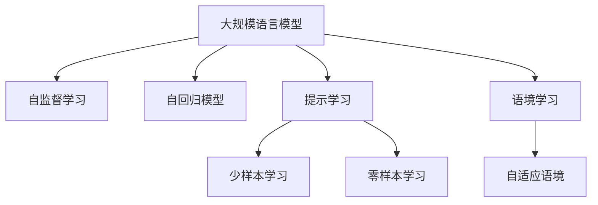

                 

# 大规模语言模型从理论到实践 提示学习和语境学习

> 关键词：大规模语言模型,提示学习,Prompt Learning,语境学习,自适应语境,自监督学习,自回归模型,Transformer,BERT,训练效率,零样本学习,少样本学习

## 1. 背景介绍

### 1.1 问题由来
近年来，随着深度学习技术的快速发展，大规模语言模型在大规模无标签文本数据上进行预训练，获得了巨大的成功。其中，以BERT、GPT等为代表的语言模型，在自然语言处理（NLP）领域展示了卓越的表现。然而，这些模型往往依赖于大量标注数据进行微调，成本高昂且难以适应新领域。提示学习和语境学习（Context Learning）技术的出现，为大规模语言模型在特定领域的微调提供了新的思路。

### 1.2 问题核心关键点
提示学习和语境学习的核心思想在于利用大规模语言模型的预训练知识和语境信息，通过精心设计的提示文本或特定场景，引导模型输出所需结果，从而实现少样本甚至零样本学习。这种方法在降低对标注数据依赖的同时，还能提升模型在特定领域的适应性，适用于诸多NLP任务，如问答、对话、文本生成等。

### 1.3 问题研究意义
提示学习和语境学习技术为大规模语言模型在特定领域的应用提供了全新的解决方案，具有以下重要意义：
1. **减少标注成本**：相比于传统的微调方法，提示学习能在更少的标注数据上取得优秀的性能。
2. **提升泛化能力**：通过利用语境信息，模型能够更好地适应新的语境，从而提升泛化能力。
3. **提高训练效率**：提示学习方法在训练时不需要更新模型参数，节省了计算资源和时间。
4. **增强安全性**：提示学习方法可以避免模型对有害信息的过拟合，提高系统的安全性。

## 2. 核心概念与联系

### 2.1 核心概念概述

为更好地理解提示学习和语境学习技术，本节将介绍几个密切相关的核心概念：

- **大规模语言模型（Large Language Model, LLM）**：以BERT、GPT等为代表的大规模预训练语言模型，通过在大规模无标签文本数据上进行预训练，学习通用的语言表示，具备强大的语言理解和生成能力。

- **提示学习（Prompt Learning）**：通过在输入文本中添加提示模板（Prompt Template），引导大规模语言模型进行特定任务的推理和生成。可以在不更新模型参数的情况下，实现少样本甚至零样本学习。

- **语境学习（Context Learning）**：利用大规模语言模型的预训练知识和语境信息，通过特定场景的语境信息，引导模型输出所需结果，从而实现少样本甚至零样本学习。

- **自适应语境（Adaptive Context）**：指在输入中动态生成与任务相关的上下文信息，使得模型能够更好地适应特定的任务和语境。

- **自监督学习（Self-Supervised Learning）**：通过自监督任务进行预训练，利用大量未标注数据学习语言模型的表示能力。

- **自回归模型（Auto-Regressive Model）**：指通过预测当前位置上的标签，根据前一时刻的输出计算后一时刻的概率分布，如BERT和GPT。

这些核心概念之间的逻辑关系可以通过以下Mermaid流程图来展示：



这个流程图展示了大语言模型的核心概念及其之间的关系：

1. 大规模语言模型通过自监督学习获得基础能力。
2. 自回归模型能够生成高质量的语言表示。
3. 提示学习通过精心设计的提示模板，实现少样本或零样本学习。
4. 语境学习利用预训练模型和特定语境，提升模型在特定领域的表现。
5. 自适应语境技术动态生成与任务相关的上下文信息，进一步提升模型性能。

这些概念共同构成了大语言模型的学习和应用框架，使其能够在各种场景下发挥强大的语言理解和生成能力。通过理解这些核心概念，我们可以更好地把握提示学习和语境学习的精髓，以及其在NLP任务中的应用。

## 3. 核心算法原理 & 具体操作步骤
### 3.1 算法原理概述

提示学习和语境学习的核心思想是利用大规模语言模型的预训练知识和语境信息，通过精心设计的提示文本或特定场景，引导模型输出所需结果。其核心算法流程如下：

1. **预训练模型初始化**：选择合适的预训练语言模型，如BERT、GPT等，作为初始化参数。
2. **提示模板设计**：根据特定任务，设计合适的提示模板，将其嵌入输入文本。
3. **模型推理**：将带有提示模板的输入文本输入到预训练模型中，输出结果。
4. **结果后处理**：对模型输出结果进行后处理，提取所需信息或进行格式转换。

### 3.2 算法步骤详解

以下是提示学习和语境学习的主要算法步骤：

**Step 1: 准备预训练模型和数据集**
- 选择合适的预训练语言模型 $M_{\theta}$ 作为初始化参数，如 BERT、GPT等。
- 准备下游任务 $T$ 的标注数据集 $D=\{(x_i,y_i)\}_{i=1}^N, x_i \in \mathcal{X}, y_i \in \mathcal{Y}$，其中 $\mathcal{X}$ 为输入空间，$\mathcal{Y}$ 为输出空间。

**Step 2: 设计提示模板**
- 根据任务类型，设计合适的提示模板 $P(x)$，将原始输入文本 $x$ 转换为带有提示的文本 $x' = P(x)$。
- 提示模板应包含足够的信息，引导模型进行推理，生成目标输出 $y$。

**Step 3: 模型推理**
- 将提示文本 $x'$ 输入到预训练模型 $M_{\theta}$ 中，进行推理，得到输出 $y'$。
- 根据任务需求，对输出结果 $y'$ 进行后处理，如选择概率最高的答案、解码生成文本等。

**Step 4: 结果后处理**
- 根据下游任务的具体需求，对模型输出结果进行格式转换、筛选等处理，得到最终结果。

**Step 5: 模型评估与优化**
- 在验证集上评估模型性能，使用评价指标如精确率、召回率、F1值等进行评估。
- 根据评估结果调整提示模板或模型参数，优化模型性能。

### 3.3 算法优缺点

提示学习和语境学习具有以下优点：
1. **少样本学习能力强**：提示学习可以在少量样本上取得不错的效果，不需要大规模标注数据。
2. **模型适应性好**：利用语境信息，模型可以更好地适应特定领域的任务。
3. **训练效率高**：提示学习不需要更新模型参数，训练速度较快。
4. **安全性高**：提示学习可以避免模型对有害信息的过拟合，提高系统的安全性。

同时，该方法也存在一些局限性：
1. **提示模板设计难度高**：设计合适的提示模板需要丰富的经验和领域知识。
2. **模型泛化能力有限**：提示学习在特定的提示模板下效果较好，泛化能力受限。
3. **模型对上下文依赖高**：提示学习依赖于上下文信息的输入，上下文信息的噪声可能导致模型输出不稳定。

尽管存在这些局限性，但提示学习和语境学习在特定领域的应用中仍展现出巨大的潜力。

### 3.4 算法应用领域

提示学习和语境学习技术已经在多个NLP任务中得到了广泛应用，具体如下：

- **问答系统**：利用提示学习，可以基于问题设计提示模板，引导模型生成准确的回答。
- **对话系统**：通过语境学习，利用上下文信息，生成自然流畅的对话内容。
- **文本生成**：在特定场景下，利用提示模板生成符合语境的文本。
- **文本摘要**：利用提示模板，从长文本中提取出关键信息。
- **机器翻译**：通过提示模板，生成目标语言文本。

这些应用场景展示了提示学习和语境学习技术的广泛适用性和高效性，进一步推动了NLP技术的产业化进程。

## 4. 数学模型和公式 & 详细讲解  
### 4.1 数学模型构建

以下是提示学习和语境学习的数学模型构建过程：

假设预训练模型为 $M_{\theta}$，其输入为文本 $x'$，输出为 $y'$，输入和输出的语义表示分别为 $\mathbf{x'}$ 和 $\mathbf{y'}$。设提示模板为 $P(x)$，则输入文本 $x'$ 可以表示为：

$$
x' = P(x) = x \oplus P_1(x)
$$

其中 $\oplus$ 表示拼接操作，$P_1(x)$ 为提示模板的表示。设提示模板的语义表示为 $\mathbf{P_1}(x)$，则：

$$
\mathbf{x'} = [\mathbf{x}, \mathbf{P_1}(x)]
$$

模型输出为 $y'$，语义表示为 $\mathbf{y'}$，则提示学习模型可以表示为：

$$
y' = M_{\theta}(\mathbf{x'})
$$

在实际应用中，提示模板的设计需要考虑任务的复杂度和上下文信息的丰富性。例如，对于问答任务，提示模板可以是问题与答案的组合；对于对话任务，提示模板可以是前一回合的上下文信息。

### 4.2 公式推导过程

以下是提示学习的推导过程：

假设模型 $M_{\theta}$ 在输入 $x'$ 上的输出为 $\hat{y'}=M_{\theta}(x')$，表示样本属于正类的概率。真实标签 $y \in \{0,1\}$。则二分类交叉熵损失函数定义为：

$$
\ell(M_{\theta}(x'),y) = -[y\log \hat{y'} + (1-y)\log (1-\hat{y'})]
$$

将其代入经验风险公式，得：

$$
\mathcal{L}(\theta) = -\frac{1}{N}\sum_{i=1}^N [y_i\log M_{\theta}(x_i')+(1-y_i)\log(1-M_{\theta}(x_i'))]
$$

在得到损失函数的梯度后，即可带入参数更新公式，完成模型的迭代优化。重复上述过程直至收敛，最终得到适应下游任务的最优模型参数 $\theta^*$。

### 4.3 案例分析与讲解

假设我们有一个简单的问答系统，需要将问题 $q$ 映射到对应的答案 $a$。我们可以设计一个提示模板，将问题 $q$ 嵌入提示模板中，然后将其输入到预训练模型中进行推理，得到答案 $a'$。具体步骤如下：

1. **提示模板设计**：设计提示模板 $P(q)$，例如：“关于$q$，请回答”。
2. **模型推理**：将提示模板嵌入问题 $q$，得到输入文本 $q'$。将 $q'$ 输入到预训练模型中，得到答案 $a'$。
3. **结果后处理**：根据 $a'$ 生成答案 $a$。

例如，对于问题“自然语言处理是什么”，我们可以设计提示模板：“自然语言处理是什么，请回答”。将提示模板嵌入问题 $q$，得到输入文本 $q'$，然后将 $q'$ 输入到预训练模型中，得到答案 $a'$。最后根据 $a'$ 生成答案 $a$。

## 5. 项目实践：代码实例和详细解释说明
### 5.1 开发环境搭建

在进行提示学习和语境学习的实践前，我们需要准备好开发环境。以下是使用Python进行PyTorch开发的环境配置流程：

1. 安装Anaconda：从官网下载并安装Anaconda，用于创建独立的Python环境。

2. 创建并激活虚拟环境：
```bash
conda create -n pytorch-env python=3.8 
conda activate pytorch-env
```

3. 安装PyTorch：根据CUDA版本，从官网获取对应的安装命令。例如：
```bash
conda install pytorch torchvision torchaudio cudatoolkit=11.1 -c pytorch -c conda-forge
```

4. 安装Transformers库：
```bash
pip install transformers
```

5. 安装各类工具包：
```bash
pip install numpy pandas scikit-learn matplotlib tqdm jupyter notebook ipython
```

完成上述步骤后，即可在`pytorch-env`环境中开始提示学习和语境学习的实践。

### 5.2 源代码详细实现

下面我们以问答系统为例，给出使用Transformers库对BERT模型进行提示学习的PyTorch代码实现。

首先，定义问答系统的数据处理函数：

```python
from transformers import BertTokenizer
from torch.utils.data import Dataset
import torch

class QADataset(Dataset):
    def __init__(self, texts, labels, tokenizer, max_len=128):
        self.texts = texts
        self.labels = labels
        self.tokenizer = tokenizer
        self.max_len = max_len
        
    def __len__(self):
        return len(self.texts)
    
    def __getitem__(self, item):
        text = self.texts[item]
        label = self.labels[item]
        
        encoding = self.tokenizer(text, return_tensors='pt', max_length=self.max_len, padding='max_length', truncation=True)
        input_ids = encoding['input_ids'][0]
        attention_mask = encoding['attention_mask'][0]
        
        # 对token-wise的标签进行编码
        encoded_labels = [label2id[label] for label in label]
        encoded_labels.extend([label2id['O']] * (self.max_len - len(encoded_labels)))
        labels = torch.tensor(encoded_labels, dtype=torch.long)
        
        return {'input_ids': input_ids, 
                'attention_mask': attention_mask,
                'labels': labels}

# 标签与id的映射
label2id = {'O': 0, 'A': 1}
id2label = {v: k for k, v in label2id.items()}

# 创建dataset
tokenizer = BertTokenizer.from_pretrained('bert-base-cased')

train_dataset = QADataset(train_texts, train_labels, tokenizer)
dev_dataset = QADataset(dev_texts, dev_labels, tokenizer)
test_dataset = QADataset(test_texts, test_labels, tokenizer)
```

然后，定义模型和提示模板：

```python
from transformers import BertForTokenClassification, AdamW

model = BertForTokenClassification.from_pretrained('bert-base-cased', num_labels=len(label2id))

# 提示模板
prompt_template = "关于 {}, 请回答: "
```

接着，定义训练和评估函数：

```python
from torch.utils.data import DataLoader
from tqdm import tqdm
from sklearn.metrics import classification_report

device = torch.device('cuda') if torch.cuda.is_available() else torch.device('cpu')
model.to(device)

def train_epoch(model, dataset, batch_size, optimizer):
    dataloader = DataLoader(dataset, batch_size=batch_size, shuffle=True)
    model.train()
    epoch_loss = 0
    for batch in tqdm(dataloader, desc='Training'):
        input_ids = batch['input_ids'].to(device)
        attention_mask = batch['attention_mask'].to(device)
        labels = batch['labels'].to(device)
        model.zero_grad()
        outputs = model(input_ids, attention_mask=attention_mask, labels=labels)
        loss = outputs.loss
        epoch_loss += loss.item()
        loss.backward()
        optimizer.step()
    return epoch_loss / len(dataloader)

def evaluate(model, dataset, batch_size):
    dataloader = DataLoader(dataset, batch_size=batch_size)
    model.eval()
    preds, labels = [], []
    with torch.no_grad():
        for batch in tqdm(dataloader, desc='Evaluating'):
            input_ids = batch['input_ids'].to(device)
            attention_mask = batch['attention_mask'].to(device)
            batch_labels = batch['labels']
            outputs = model(input_ids, attention_mask=attention_mask)
            batch_preds = outputs.logits.argmax(dim=2).to('cpu').tolist()
            batch_labels = batch_labels.to('cpu').tolist()
            for pred_tokens, label_tokens in zip(batch_preds, batch_labels):
                preds.append(pred_tokens[:len(label_tokens)])
                labels.append(label_tokens)
                
    print(classification_report(labels, preds))
```

最后，启动训练流程并在测试集上评估：

```python
epochs = 5
batch_size = 16

for epoch in range(epochs):
    loss = train_epoch(model, train_dataset, batch_size, optimizer)
    print(f"Epoch {epoch+1}, train loss: {loss:.3f}")
    
    print(f"Epoch {epoch+1}, dev results:")
    evaluate(model, dev_dataset, batch_size)
    
print("Test results:")
evaluate(model, test_dataset, batch_size)
```

以上就是使用PyTorch对BERT进行提示学习的完整代码实现。可以看到，得益于Transformers库的强大封装，我们可以用相对简洁的代码完成BERT模型的加载和提示学习。

### 5.3 代码解读与分析

让我们再详细解读一下关键代码的实现细节：

**QADataset类**：
- `__init__`方法：初始化文本、标签、分词器等关键组件。
- `__len__`方法：返回数据集的样本数量。
- `__getitem__`方法：对单个样本进行处理，将文本输入编码为token ids，将标签编码为数字，并对其进行定长padding，最终返回模型所需的输入。

**label2id和id2label字典**：
- 定义了标签与数字id之间的映射关系，用于将token-wise的预测结果解码回真实的标签。

**训练和评估函数**：
- 使用PyTorch的DataLoader对数据集进行批次化加载，供模型训练和推理使用。
- 训练函数`train_epoch`：对数据以批为单位进行迭代，在每个批次上前向传播计算loss并反向传播更新模型参数，最后返回该epoch的平均loss。
- 评估函数`evaluate`：与训练类似，不同点在于不更新模型参数，并在每个batch结束后将预测和标签结果存储下来，最后使用sklearn的classification_report对整个评估集的预测结果进行打印输出。

**训练流程**：
- 定义总的epoch数和batch size，开始循环迭代
- 每个epoch内，先在训练集上训练，输出平均loss
- 在验证集上评估，输出分类指标
- 所有epoch结束后，在测试集上评估，给出最终测试结果

可以看到，PyTorch配合Transformers库使得BERT提示学习的代码实现变得简洁高效。开发者可以将更多精力放在数据处理、模型改进等高层逻辑上，而不必过多关注底层的实现细节。

当然，工业级的系统实现还需考虑更多因素，如模型的保存和部署、超参数的自动搜索、更灵活的任务适配层等。但核心的提示学习范式基本与此类似。

## 6. 实际应用场景
### 6.1 智能客服系统

基于提示学习和语境学习的对话技术，可以广泛应用于智能客服系统的构建。传统客服往往需要配备大量人力，高峰期响应缓慢，且一致性和专业性难以保证。而使用提示学习后的对话模型，可以7x24小时不间断服务，快速响应客户咨询，用自然流畅的语言解答各类常见问题。

在技术实现上，可以收集企业内部的历史客服对话记录，将问题和最佳答复构建成监督数据，在此基础上对预训练对话模型进行提示学习。提示学习后的对话模型能够自动理解用户意图，匹配最合适的答案模板进行回复。对于客户提出的新问题，还可以接入检索系统实时搜索相关内容，动态组织生成回答。如此构建的智能客服系统，能大幅提升客户咨询体验和问题解决效率。

### 6.2 金融舆情监测

金融机构需要实时监测市场舆论动向，以便及时应对负面信息传播，规避金融风险。传统的人工监测方式成本高、效率低，难以应对网络时代海量信息爆发的挑战。基于提示学习的文本分类和情感分析技术，为金融舆情监测提供了新的解决方案。

具体而言，可以收集金融领域相关的新闻、报道、评论等文本数据，并对其进行主题标注和情感标注。在此基础上对预训练语言模型进行提示学习，使其能够自动判断文本属于何种主题，情感倾向是正面、中性还是负面。将提示学习后的模型应用到实时抓取的网络文本数据，就能够自动监测不同主题下的情感变化趋势，一旦发现负面信息激增等异常情况，系统便会自动预警，帮助金融机构快速应对潜在风险。

### 6.3 个性化推荐系统

当前的推荐系统往往只依赖用户的历史行为数据进行物品推荐，无法深入理解用户的真实兴趣偏好。基于提示学习技术的个性化推荐系统可以更好地挖掘用户行为背后的语义信息，从而提供更精准、多样的推荐内容。

在实践中，可以收集用户浏览、点击、评论、分享等行为数据，提取和用户交互的物品标题、描述、标签等文本内容。将文本内容作为模型输入，用户的后续行为（如是否点击、购买等）作为监督信号，在此基础上提示学习预训练语言模型。提示学习后的模型能够从文本内容中准确把握用户的兴趣点。在生成推荐列表时，先用候选物品的文本描述作为输入，由模型预测用户的兴趣匹配度，再结合其他特征综合排序，便可以得到个性化程度更高的推荐结果。

### 6.4 未来应用展望

随着提示学习和语境学习技术的不断发展，其将在更多领域得到应用，为传统行业带来变革性影响。

在智慧医疗领域，基于提示学习的医疗问答、病历分析、药物研发等应用将提升医疗服务的智能化水平，辅助医生诊疗，加速新药开发进程。

在智能教育领域，提示学习技术可应用于作业批改、学情分析、知识推荐等方面，因材施教，促进教育公平，提高教学质量。

在智慧城市治理中，提示学习模型可应用于城市事件监测、舆情分析、应急指挥等环节，提高城市管理的自动化和智能化水平，构建更安全、高效的未来城市。

此外，在企业生产、社会治理、文娱传媒等众多领域，基于提示学习技术的智能应用也将不断涌现，为经济社会发展注入新的动力。相信随着技术的日益成熟，提示学习范式将成为NLP技术的重要范式，推动人工智能技术在各行业的规模化落地。

## 7. 工具和资源推荐
### 7.1 学习资源推荐

为了帮助开发者系统掌握提示学习和语境学习的理论基础和实践技巧，这里推荐一些优质的学习资源：

1. 《Transformers from Predictions to Probabilities》系列博文：由大模型技术专家撰写，深入浅出地介绍了Transformer原理、BERT模型、提示学习技术等前沿话题。

2. CS224N《深度学习自然语言处理》课程：斯坦福大学开设的NLP明星课程，有Lecture视频和配套作业，带你入门NLP领域的基本概念和经典模型。

3. 《Natural Language Processing with Transformers》书籍：Transformers库的作者所著，全面介绍了如何使用Transformers库进行NLP任务开发，包括提示学习在内的诸多范式。

4. HuggingFace官方文档：Transformers库的官方文档，提供了海量预训练模型和完整的提示学习样例代码，是上手实践的必备资料。

5. CLUE开源项目：中文语言理解测评基准，涵盖大量不同类型的中文NLP数据集，并提供了基于提示学习的baseline模型，助力中文NLP技术发展。

通过对这些资源的学习实践，相信你一定能够快速掌握提示学习和语境学习的精髓，并用于解决实际的NLP问题。
###  7.2 开发工具推荐

高效的开发离不开优秀的工具支持。以下是几款用于提示学习和语境学习开发的常用工具：

1. PyTorch：基于Python的开源深度学习框架，灵活动态的计算图，适合快速迭代研究。大部分预训练语言模型都有PyTorch版本的实现。

2. TensorFlow：由Google主导开发的开源深度学习框架，生产部署方便，适合大规模工程应用。同样有丰富的预训练语言模型资源。

3. Transformers库：HuggingFace开发的NLP工具库，集成了众多SOTA语言模型，支持PyTorch和TensorFlow，是进行提示学习和语境学习开发的利器。

4. Weights & Biases：模型训练的实验跟踪工具，可以记录和可视化模型训练过程中的各项指标，方便对比和调优。与主流深度学习框架无缝集成。

5. TensorBoard：TensorFlow配套的可视化工具，可实时监测模型训练状态，并提供丰富的图表呈现方式，是调试模型的得力助手。

6. Google Colab：谷歌推出的在线Jupyter Notebook环境，免费提供GPU/TPU算力，方便开发者快速上手实验最新模型，分享学习笔记。

合理利用这些工具，可以显著提升提示学习和语境学习任务的开发效率，加快创新迭代的步伐。

### 7.3 相关论文推荐

提示学习和语境学习的发展源于学界的持续研究。以下是几篇奠基性的相关论文，推荐阅读：

1. Few-shot Learning with Unsupervised Reasoning for Conceptual Image Captioning：提出利用提示模板和语境信息，实现少样本图像描述生成。

2. Evolving Language Models as Expert Systems：探索通过提示学习和语境学习，利用预训练模型构建专家系统，实现高效推理。

3. Dynamic Prompt Engineering for Multimodal Image-to-Text: Pointer-Generator++ Model：研究如何动态生成提示模板，提升多模态图像到文本生成的性能。

4. FCT: Focused Contextualization for Unsupervised Multimodal Contextualized Text Generation：提出利用语境信息，提升无监督多模态文本生成的效果。

5. Multimodal Input-aware Prompt Tuning for Text Generation with Multimodal Pretrained Models：研究如何通过多模态提示模板，提升文本生成模型的性能。

这些论文代表了大语言模型提示学习和语境学习的发展脉络。通过学习这些前沿成果，可以帮助研究者把握学科前进方向，激发更多的创新灵感。

## 8. 总结：未来发展趋势与挑战

### 8.1 总结

本文对基于提示学习和语境学习的大规模语言模型微调方法进行了全面系统的介绍。首先阐述了提示学习和语境学习的研究背景和意义，明确了其在大规模语言模型微调中的独特价值。其次，从原理到实践，详细讲解了提示学习和语境学习的数学原理和关键步骤，给出了提示学习任务开发的完整代码实例。同时，本文还广泛探讨了提示学习和语境学习技术在智能客服、金融舆情、个性化推荐等多个行业领域的应用前景，展示了其巨大的潜力。此外，本文精选了提示学习和语境学习技术的各类学习资源，力求为读者提供全方位的技术指引。

通过本文的系统梳理，可以看到，基于提示学习和语境学习的大规模语言模型微调方法正在成为NLP领域的重要范式，极大地拓展了预训练语言模型的应用边界，催生了更多的落地场景。受益于大规模语料的预训练和语境信息的利用，提示学习方法能在更少的标注样本上取得优异的性能，显著降低标注成本。未来，伴随提示学习和语境学习技术的持续演进，基于微调的方法必将在更广阔的应用领域大放异彩，深刻影响人类的生产生活方式。

### 8.2 未来发展趋势

展望未来，提示学习和语境学习技术将呈现以下几个发展趋势：

1. **模型规模持续增大**：随着算力成本的下降和数据规模的扩张，预训练语言模型的参数量还将持续增长。超大规模语言模型蕴含的丰富语言知识，将进一步提升提示学习的性能。

2. **提示模板设计自动化**：未来将出现更多自动化提示模板设计工具，利用神经网络生成高质量的提示模板，提升提示学习的泛化能力。

3. **多模态提示学习**：在视觉、语音、文本等多种模态的融合上，提示学习将进一步拓展，提升多模态智能交互系统的性能。

4. **语境学习的深度融合**：未来将出现更多语境融合方法，将语境信息与模型参数深度结合，提升语境学习的鲁棒性和泛化能力。

5. **参数高效提示学习**：开发更加参数高效的提示学习技术，在固定大部分预训练参数的同时，只更新极少量的提示模板参数，进一步提升提示学习的效率。

6. **语境学习的实时化**：未来将出现更多实时化的语境学习算法，能够动态生成与当前任务相关的上下文信息，进一步提升语境学习的性能。

这些趋势凸显了大语言模型提示学习和语境学习技术的广阔前景。这些方向的探索发展，必将进一步提升NLP系统的性能和应用范围，为人类认知智能的进化带来深远影响。

### 8.3 面临的挑战

尽管提示学习和语境学习技术已经取得了瞩目成就，但在迈向更加智能化、普适化应用的过程中，它仍面临着诸多挑战：

1. **提示模板设计难度高**：设计合适的提示模板需要丰富的经验和领域知识，难以自动化生成高质量的提示模板。

2. **语境学习依赖上下文**：语境学习依赖于上下文信息的输入，上下文信息的噪声可能导致模型输出不稳定。

3. **泛化能力有限**：提示学习在特定的提示模板下效果较好，泛化能力受限。

4. **模型对有害信息敏感**：提示学习模型对输入的语境信息敏感，可能学习到有害信息，导致输出不稳定。

5. **训练效率低**：提示学习需要在每个epoch的每个batch上进行模型推理，训练效率较低。

尽管存在这些挑战，但提示学习和语境学习在特定领域的应用中仍展现出巨大的潜力。

### 8.4 研究展望

面对提示学习和语境学习所面临的挑战，未来的研究需要在以下几个方面寻求新的突破：

1. **探索更多提示模板设计方法**：研究如何通过神经网络生成高质量的提示模板，提升提示学习的泛化能力。

2. **研究更多语境融合方法**：开发能够将语境信息与模型参数深度结合的算法，提升语境学习的鲁棒性和泛化能力。

3. **开发参数高效提示学习算法**：研究如何在固定大部分预训练参数的情况下，只更新极少量的提示模板参数，进一步提升提示学习的效率。

4. **研究实时化语境学习算法**：开发能够动态生成与当前任务相关的上下文信息的算法，提升语境学习的性能。

5. **探索多模态提示学习**：研究如何在视觉、语音、文本等多种模态的融合上，提升提示学习的性能。

6. **结合因果分析和博弈论工具**：研究如何通过因果分析和博弈论工具，增强提示学习和语境学习的稳定性和鲁棒性。

这些研究方向的探索，必将引领提示学习和语境学习技术迈向更高的台阶，为构建安全、可靠、可解释、可控的智能系统铺平道路。面向未来，提示学习和语境学习技术还需要与其他人工智能技术进行更深入的融合，如知识表示、因果推理、强化学习等，多路径协同发力，共同推动自然语言理解和智能交互系统的进步。只有勇于创新、敢于突破，才能不断拓展语言模型的边界，让智能技术更好地造福人类社会。

## 9. 附录：常见问题与解答

**Q1：提示学习与传统微调有何区别？**

A: 提示学习与传统微调最大的区别在于，提示学习不需要更新模型参数，而传统微调需要更新模型参数。提示学习通过精心设计的提示模板，利用预训练模型的语义表示，实现少样本或零样本学习。而传统微调则通过微调模型参数，在少量标注数据上进行有监督学习，提升模型性能。

**Q2：提示模板设计需要注意哪些要素？**

A: 提示模板的设计需要考虑任务的复杂度和上下文信息的丰富性。一般来说，提示模板应包含以下要素：
1. 任务说明：简洁明了地描述任务，引导模型理解任务类型。
2. 上下文信息：提供必要的上下文信息，帮助模型理解输入内容。
3. 示例数据：提供一些示例数据，帮助模型更好地理解任务。
4. 输出格式：明确输出格式，帮助模型生成正确的输出。

**Q3：提示学习在实际应用中面临哪些问题？**

A: 提示学习在实际应用中面临以下问题：
1. 提示模板设计难度高：设计高质量的提示模板需要丰富的经验和领域知识。
2. 提示模板泛化能力有限：提示模板在特定任务下效果较好，泛化能力受限。
3. 上下文信息依赖高：提示学习依赖于上下文信息的输入，上下文信息的噪声可能导致模型输出不稳定。
4. 模型对有害信息敏感：提示学习模型对输入的语境信息敏感，可能学习到有害信息，导致输出不稳定。
5. 训练效率低：提示学习需要在每个epoch的每个batch上进行模型推理，训练效率较低。

**Q4：如何评估提示学习的效果？**

A: 提示学习的效果评估可以从以下几个方面进行：
1. 准确率：提示学习的效果通常以准确率（Accuracy）作为评价指标，评估模型在测试集上的预测准确性。
2. 召回率：召回率（Recall）可以评估模型对正样本的覆盖率，特别是在少样本学习中，召回率是一个重要的评价指标。
3. F1值：F1值（F1 Score）综合考虑了准确率和召回率，是一个综合评价指标。
4. 精确率：精确率（Precision）可以评估模型对负样本的过滤能力，特别是在少样本学习中，精确率是一个重要的评价指标。
5. 推理效率：提示学习的效果还可以通过推理效率（Inference Speed）来评估，特别是在实时应用中，推理效率是一个重要的评价指标。

**Q5：如何优化提示学习的效果？**

A: 优化提示学习的效果可以从以下几个方面进行：
1. 优化提示模板：设计高质量的提示模板，提升提示学习的泛化能力。
2. 上下文信息增强：提供更多的上下文信息，帮助模型更好地理解输入内容。
3. 多提示模板融合：设计多个提示模板，通过融合提升提示学习的性能。
4. 数据增强：通过数据增强技术，扩充训练集，提升提示学习的鲁棒性。
5. 对抗训练：引入对抗样本，提升提示学习的鲁棒性。
6. 动态提示：在训练过程中，动态生成与当前任务相关的上下文信息，提升提示学习的性能。

这些方法需要根据具体任务和数据特点进行灵活组合，优化提示学习的效果。

