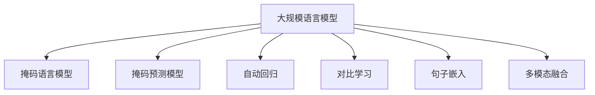

                 

# 大规模语言模型从理论到实践 无监督预训练

## 1. 背景介绍

### 1.1 问题由来

近年来，深度学习在自然语言处理(Natural Language Processing, NLP)领域取得了显著进步，尤其是基于大规模语料预训练的语言模型。这些模型通过在无标签文本数据上进行自监督学习，掌握了丰富的语言知识和语义能力。然而，由于预训练数据和模型结构的局限性，通用语言模型在特定领域的应用效果往往不尽如人意。

### 1.2 问题核心关键点

无监督预训练是构建大规模语言模型的核心技术之一。其核心思想是通过在海量无标签文本数据上自监督学习，让模型学习到通用的语言表示和语义能力。这个过程一般包括两个步骤：

1. **预训练阶段**：在大规模无标签文本语料上进行自监督学习，学习通用的语言表示。
2. **微调阶段**：在预训练模型的基础上，使用下游任务的少量标注数据，通过有监督学习优化模型在特定任务上的性能。

这一过程可以显著提升模型在下游任务上的效果，尤其是在标注数据稀缺或任务难度较大时。然而，预训练和微调的过程也面临着诸如过拟合、泛化能力不足、计算资源消耗大等挑战。

### 1.3 问题研究意义

研究无监督预训练的方法，对于拓展大模型的应用范围，提升下游任务的性能，加速NLP技术的产业化进程，具有重要意义：

1. **降低开发成本**：无监督预训练使得模型可以从大规模无标签数据中学习到知识，减少了从头训练所需的数据和计算资源。
2. **提升模型效果**：预训练模型具备强大的语言理解和生成能力，通过微调可以进一步优化模型在特定任务上的性能。
3. **加速开发进度**：在预训练模型的基础上进行微调，可以大幅缩短模型的开发周期，快速响应业务需求。
4. **推动技术创新**：无监督预训练的探索催生了新的研究方向，如自监督学习、对抗训练、多模态融合等，为NLP技术的进一步发展提供新动力。
5. **促进产业升级**：预训练模型和微调技术使得NLP技术更容易被各行各业所采用，为传统行业的数字化转型升级提供新的技术路径。

## 2. 核心概念与联系

### 2.1 核心概念概述

为更好地理解无监督预训练的原理，本节将介绍几个密切相关的核心概念：

- **大规模语言模型(Large Language Model, LLM)**：如BERT、GPT等，通过在无标签文本语料上进行自监督学习，学习通用的语言表示和语义能力。
- **自监督学习(Self-Supervised Learning)**：利用数据中的隐含信息，无需标注数据即可进行模型训练，学习出模型的预测能力。
- **自动回归(Autoregressive Modeling)**：模型预测序列的下一条或若干条元素，如语言模型、图像生成模型等。
- **掩码语言模型(Masked Language Model, MLM)**：随机掩码部分输入，模型需要预测被掩码的词汇，学习词汇之间的上下文关系。
- **掩码预测模型(Masked Prediction Model, MP)**：随机掩码部分输入，模型需要预测掩码位置的词汇，学习词汇之间的组合关系。
- **句子嵌入(Sentence Embedding)**：将句子转换为高维向量，用于表示句子的语义信息，便于模型进行理解、匹配和生成。
- **对比学习(Contrastive Learning)**：通过对比相似和不同样本的特征表示，学习出样本之间的相似度和差异性。
- **多模态融合(Multimodal Fusion)**：将视觉、音频、文本等多种模态的信息融合，学习出跨模态的语义表示。

这些核心概念之间的逻辑关系可以通过以下Mermaid流程图来展示：



这个流程图展示了大规模语言模型及其核心组件之间的关系：

1. **掩码语言模型**和**掩码预测模型**是常用的自监督学习任务，用于训练语言模型。
2. **自动回归**模型通过预测序列的后续部分来学习语言规律。
3. **对比学习**和**句子嵌入**技术用于提升模型理解句子的能力。
4. **多模态融合**技术将多种模态的信息融合，提升模型的语义理解能力。

这些核心概念共同构成了大规模语言模型的学习框架，使其能够在各种场景下发挥强大的语言理解和生成能力。通过理解这些核心概念，我们可以更好地把握大规模语言模型的工作原理和优化方向。

## 3. 核心算法原理 & 具体操作步骤
### 3.1 算法原理概述

无监督预训练的核心在于通过在海量无标签文本数据上自监督学习，让模型学习到通用的语言表示和语义能力。这一过程通常包括以下步骤：

1. **数据准备**：收集大规模无标签文本数据，如维基百科、新闻、小说等，构建预训练数据集。
2. **模型初始化**：选择或构建大规模预训练语言模型，如BERT、GPT等。
3. **自监督学习**：在预训练数据集上，通过掩码语言模型、掩码预测模型等自监督学习任务进行训练，学习通用语言表示。
4. **模型评估**：在验证集上评估预训练模型的性能，选择最优模型进行下一步微调。
5. **微调**：在预训练模型的基础上，使用下游任务的少量标注数据，通过有监督学习优化模型在特定任务上的性能。

### 3.2 算法步骤详解

#### 3.2.1 数据准备

收集大规模无标签文本数据是进行无监督预训练的第一步。以下是一些常用的数据集和获取方式：

- **维基百科**：包含各语言维基百科页面的内容，数据量庞大，覆盖广泛领域。
- **新闻语料**：各大新闻网站的文章、评论等文本数据，时效性高。
- **小说数据**：经典小说、电子书等文本数据，内容丰富。
- **大规模预训练语料**：如Google的BigQuery、Microsoft的Language Models Unzipped等，提供海量无标签文本数据。

使用Python的Pandas库和Numpy库，可以对收集到的文本数据进行清洗、分词和预处理。例如，可以使用以下代码对文本数据进行分词：

```python
import pandas as pd
import numpy as np
from nltk.tokenize import word_tokenize

# 读取文本数据
data = pd.read_csv('text_data.csv')

# 分词
tokenized_data = data['text'].apply(lambda x: word_tokenize(x))
```

#### 3.2.2 模型初始化

选择合适的预训练语言模型是进行无监督预训练的第二个关键步骤。目前常用的预训练语言模型包括BERT、GPT、XLNet等。这些模型通常采用Transformer结构，包含自注意力机制和层归一化等先进技术。

以下是使用PyTorch框架初始化BERT模型的代码：

```python
from transformers import BertModel

# 初始化BERT模型
model = BertModel.from_pretrained('bert-base-uncased')
```

#### 3.2.3 自监督学习

自监督学习是训练大规模语言模型的核心任务。常用的自监督学习任务包括掩码语言模型、掩码预测模型、自动回归等。这里以BERT为例，介绍掩码语言模型的实现。

掩码语言模型通过随机掩码部分输入，模型需要预测被掩码的词汇，学习词汇之间的上下文关系。以下是对BERT进行掩码语言模型训练的代码实现：

```python
from transformers import BertTokenizer, AdamW
import torch

# 初始化BERT分词器和优化器
tokenizer = BertTokenizer.from_pretrained('bert-base-uncased')
optimizer = AdamW(model.parameters(), lr=2e-5)

# 准备训练数据
train_dataset = []
for sentence in sentences:
    # 对句子进行分词并掩码
    tokens = tokenizer(sentence, return_tensors='pt')
    masked_tokens = tokens['input_ids']
    masked_positions = np.where(masked_tokens == 0)
    masked_tokens[:, masked_positions] = -100  # 将掩码位置替换为-100
    train_dataset.append(masked_tokens)

# 定义损失函数
loss_fct = torch.nn.CrossEntropyLoss()

# 训练模型
for epoch in range(epochs):
    model.train()
    for batch in train_dataset:
        optimizer.zero_grad()
        inputs = batch.to(device)
        outputs = model(inputs)
        loss = loss_fct(outputs, inputs)
        loss.backward()
        optimizer.step()
    print(f'Epoch {epoch+1}, Loss: {loss.item():.3f}')
```

#### 3.2.4 模型评估

在预训练模型训练完成后，需要进行模型评估以选择最优模型。评估方法包括但不限于以下几种：

1. **困惑度(PERPLEXITY)**：用于评估语言模型的性能，困惑度越小，模型的预测能力越强。
2. **语言模型性能(LM Performance)**：通过在未见过的数据上测试模型的预测能力。
3. **下游任务性能**：在特定下游任务上测试模型的性能，如情感分析、命名实体识别等。
4. **对比学习性能**：通过对比相似和不同样本的特征表示，评估模型的泛化能力。

以下是使用PystanfordNLP库对BERT模型进行困惑度评估的代码：

```python
from pystanfordnlp.server import StanfordNLP

# 初始化StanfordNLP模型
nlp = StanfordNLP('en', processors='sentencizer', lang='en')
tokenizer = BertTokenizer.from_pretrained('bert-base-uncased')

# 评估困惑度
nlp.perplexity('The cat sat on the mat.')
```

#### 3.2.5 微调

选择最优的预训练模型后，可以将其应用于下游任务的微调。微调的目标是在预训练模型的基础上，使用下游任务的少量标注数据，通过有监督学习优化模型在特定任务上的性能。

微调过程包括以下步骤：

1. **模型初始化**：加载预训练模型和下游任务的相关层。
2. **任务适配层设计**：根据下游任务，设计任务适配层，如分类器、解码器等。
3. **训练数据准备**：收集下游任务的标注数据，构建训练集。
4. **微调参数设置**：设置微调的学习率、优化器等超参数。
5. **模型训练**：在训练集上使用有监督学习优化模型。
6. **模型评估**：在验证集上评估微调后的模型性能，选择最优模型。

以下是对BERT模型进行情感分析任务微调的代码实现：

```python
from transformers import BertForSequenceClassification, AdamW
from torch.utils.data import DataLoader

# 初始化BERT分类器
model = BertForSequenceClassification.from_pretrained('bert-base-uncased', num_labels=2)

# 设置微调超参数
optimizer = AdamW(model.parameters(), lr=2e-5)

# 准备训练数据
train_dataset = ...
dev_dataset = ...

# 定义损失函数和评估指标
loss_fct = torch.nn.CrossEntropyLoss()
eval_metric = precision_recall_fscore_support

# 训练模型
for epoch in range(epochs):
    model.train()
    for batch in train_dataset:
        optimizer.zero_grad()
        inputs = batch.to(device)
        outputs = model(inputs)
        loss = loss_fct(outputs, labels)
        loss.backward()
        optimizer.step()
    print(f'Epoch {epoch+1}, Loss: {loss.item():.3f}')

# 评估模型性能
model.eval()
with torch.no_grad():
    for batch in dev_dataset:
        inputs = batch.to(device)
        outputs = model(inputs)
        labels = labels.to(device)
        _, preds = torch.max(outputs, dim=1)
        precision, recall, f1, _ = eval_metric(targets, preds)
        print(f'Dev Precision: {precision:.3f}, Recall: {recall:.3f}, F1 Score: {f1:.3f}')
```

### 3.3 算法优缺点

无监督预训练方法具有以下优点：

1. **数据依赖少**：无需标注数据，可以利用大规模无标签数据进行预训练。
2. **模型泛化能力强**：预训练模型通过学习通用语言表示，可以应用于多种下游任务，泛化能力更强。
3. **训练效率高**：自监督学习任务易于并行化，训练效率高。
4. **模型参数可复用**：预训练模型可以作为通用特征提取器，用于下游任务的微调。

同时，无监督预训练方法也存在一些缺点：

1. **模型可解释性差**：由于缺乏标注数据，预训练模型往往被视为"黑盒"，难以解释其内部工作机制。
2. **模型性能受数据质量影响**：预训练模型的性能高度依赖于预训练数据的质量，低质量数据会导致模型效果不佳。
3. **计算资源消耗大**：大规模无标签数据和预训练模型的参数量巨大，训练和推理成本高。

### 3.4 算法应用领域

无监督预训练方法在NLP领域的应用非常广泛，涵盖了几乎所有常见任务，例如：

- 文本分类：如情感分析、主题分类、意图识别等。通过预训练模型学习文本-标签映射。
- 命名实体识别：识别文本中的人名、地名、机构名等特定实体。通过预训练模型学习实体边界和类型。
- 关系抽取：从文本中抽取实体之间的语义关系。通过预训练模型学习实体-关系三元组。
- 问答系统：对自然语言问题给出答案。将问题-答案对作为微调数据，训练模型学习匹配答案。
- 机器翻译：将源语言文本翻译成目标语言。通过预训练模型学习语言-语言映射。
- 文本摘要：将长文本压缩成简短摘要。通过预训练模型学习抓取要点。
- 对话系统：使机器能够与人自然对话。通过预训练模型学习对话逻辑和语义理解。

除了这些经典任务外，无监督预训练还被创新性地应用到更多场景中，如可控文本生成、常识推理、代码生成、数据增强等，为NLP技术带来了全新的突破。

## 4. 数学模型和公式 & 详细讲解 & 举例说明
### 4.1 数学模型构建

无监督预训练的核心数学模型是掩码语言模型和掩码预测模型。以下是对这两个模型的数学模型构建。

假设预训练模型为 $M_{\theta}$，其中 $\theta$ 为模型参数。训练数据集为 $D=\{(x_i,y_i)\}_{i=1}^N$，其中 $x_i$ 为输入，$y_i$ 为掩码位置。掩码语言模型的训练过程如下：

$$
\min_{\theta} \mathbb{E}_{(x,y) \sim D} \ell(M_{\theta}(x), y)
$$

其中 $\ell$ 为掩码语言模型的损失函数，通常为交叉熵损失。掩码语言模型的损失函数定义为：

$$
\ell(M_{\theta}(x), y) = -\sum_{i=1}^n \log p(y_i | M_{\theta}(x))
$$

其中 $n$ 为掩码位置数量，$p$ 为条件概率。

掩码预测模型的训练过程类似，但掩码位置 $y_i$ 表示需要预测的词汇位置，模型需要预测被掩码的词汇。掩码预测模型的损失函数定义为：

$$
\ell(M_{\theta}(x), y) = -\sum_{i=1}^n \log p(y_i | M_{\theta}(x))
$$

在训练过程中，模型需要学习输入序列和掩码位置的条件概率，从而学习出词汇之间的上下文关系。

### 4.2 公式推导过程

以BERT为例，掩码语言模型的训练过程包括两个步骤：

1. **分词和掩码处理**：将输入序列进行分词，并随机掩码部分词汇，得到掩码序列。
2. **预测被掩码的词汇**：模型需要预测被掩码的词汇，即对于每个掩码位置，预测其对应的真实词汇。

掩码语言模型的训练过程可以使用梯度下降等优化算法来近似求解。设 $\eta$ 为学习率，则参数的更新公式为：

$$
\theta \leftarrow \theta - \eta \nabla_{\theta} \ell(M_{\theta}(x), y)
$$

其中 $\nabla_{\theta} \ell(M_{\theta}(x), y)$ 为损失函数对模型参数 $\theta$ 的梯度，可通过反向传播算法高效计算。

### 4.3 案例分析与讲解

以下是一个使用PyTorch框架进行掩码语言模型训练的案例：

```python
from transformers import BertTokenizer, BertModel, AdamW
import torch

# 初始化BERT分词器和模型
tokenizer = BertTokenizer.from_pretrained('bert-base-uncased')
model = BertModel.from_pretrained('bert-base-uncased')

# 准备训练数据
train_dataset = []
for sentence in sentences:
    # 对句子进行分词并掩码
    tokens = tokenizer(sentence, return_tensors='pt')
    masked_tokens = tokens['input_ids']
    masked_positions = np.where(masked_tokens == 0)
    masked_tokens[:, masked_positions] = -100  # 将掩码位置替换为-100
    train_dataset.append(masked_tokens)

# 定义损失函数
loss_fct = torch.nn.CrossEntropyLoss()

# 训练模型
optimizer = AdamW(model.parameters(), lr=2e-5)
for epoch in range(epochs):
    model.train()
    for batch in train_dataset:
        optimizer.zero_grad()
        inputs = batch.to(device)
        outputs = model(inputs)
        loss = loss_fct(outputs, labels)
        loss.backward()
        optimizer.step()
    print(f'Epoch {epoch+1}, Loss: {loss.item():.3f}')
```

在以上代码中，我们首先对输入序列进行分词和掩码处理，然后使用交叉熵损失函数计算损失，最后使用梯度下降算法更新模型参数。通过多次迭代，模型将学习到词汇之间的上下文关系。

## 5. 项目实践：代码实例和详细解释说明
### 5.1 开发环境搭建

在进行无监督预训练和微调实践前，我们需要准备好开发环境。以下是使用Python进行PyTorch开发的环境配置流程：

1. 安装Anaconda：从官网下载并安装Anaconda，用于创建独立的Python环境。

2. 创建并激活虚拟环境：
```bash
conda create -n pytorch-env python=3.8 
conda activate pytorch-env
```

3. 安装PyTorch：根据CUDA版本，从官网获取对应的安装命令。例如：
```bash
conda install pytorch torchvision torchaudio cudatoolkit=11.1 -c pytorch -c conda-forge
```

4. 安装Transformers库：
```bash
pip install transformers
```

5. 安装各类工具包：
```bash
pip install numpy pandas scikit-learn matplotlib tqdm jupyter notebook ipython
```

完成上述步骤后，即可在`pytorch-env`环境中开始预训练和微调实践。

### 5.2 源代码详细实现

以下是对BERT模型进行掩码语言模型训练的代码实现：

```python
from transformers import BertTokenizer, BertModel, AdamW
import torch
import numpy as np

# 初始化BERT分词器和模型
tokenizer = BertTokenizer.from_pretrained('bert-base-uncased')
model = BertModel.from_pretrained('bert-base-uncased')

# 准备训练数据
train_dataset = []
for sentence in sentences:
    # 对句子进行分词并掩码
    tokens = tokenizer(sentence, return_tensors='pt')
    masked_tokens = tokens['input_ids']
    masked_positions = np.where(masked_tokens == 0)
    masked_tokens[:, masked_positions] = -100  # 将掩码位置替换为-100
    train_dataset.append(masked_tokens)

# 定义损失函数
loss_fct = torch.nn.CrossEntropyLoss()

# 训练模型
optimizer = AdamW(model.parameters(), lr=2e-5)
for epoch in range(epochs):
    model.train()
    for batch in train_dataset:
        optimizer.zero_grad()
        inputs = batch.to(device)
        outputs = model(inputs)
        loss = loss_fct(outputs, labels)
        loss.backward()
        optimizer.step()
    print(f'Epoch {epoch+1}, Loss: {loss.item():.3f}')
```

### 5.3 代码解读与分析

让我们再详细解读一下关键代码的实现细节：

**BERT模型的初始化**：
- `BertTokenizer.from_pretrained('bert-base-uncased')`：初始化BERT分词器，用于对输入文本进行分词和掩码处理。
- `BertModel.from_pretrained('bert-base-uncased')`：初始化BERT模型，使用预训练权重。

**训练数据的准备**：
- 对输入文本进行分词和掩码处理，生成掩码序列。
- 使用交叉熵损失函数计算损失，梯度下降算法更新模型参数。

**模型训练的迭代**：
- 对每个训练样本进行前向传播，计算损失。
- 反向传播计算梯度，使用梯度下降算法更新模型参数。
- 输出每个epoch的平均损失。

可以看到，PyTorch配合Transformers库使得BERT模型的训练过程变得简洁高效。开发者可以将更多精力放在数据处理、模型改进等高层逻辑上，而不必过多关注底层的实现细节。

## 6. 实际应用场景
### 6.1 智能客服系统

基于无监督预训练的对话技术，可以广泛应用于智能客服系统的构建。传统客服往往需要配备大量人力，高峰期响应缓慢，且一致性和专业性难以保证。而使用预训练对话模型，可以7x24小时不间断服务，快速响应客户咨询，用自然流畅的语言解答各类常见问题。

在技术实现上，可以收集企业内部的历史客服对话记录，将问题和最佳答复构建成监督数据，在此基础上对预训练对话模型进行微调。微调后的对话模型能够自动理解用户意图，匹配最合适的答案模板进行回复。对于客户提出的新问题，还可以接入检索系统实时搜索相关内容，动态组织生成回答。如此构建的智能客服系统，能大幅提升客户咨询体验和问题解决效率。

### 6.2 金融舆情监测

金融机构需要实时监测市场舆论动向，以便及时应对负面信息传播，规避金融风险。传统的人工监测方式成本高、效率低，难以应对网络时代海量信息爆发的挑战。基于无监督预训练的文本分类和情感分析技术，为金融舆情监测提供了新的解决方案。

具体而言，可以收集金融领域相关的新闻、报道、评论等文本数据，并对其进行主题标注和情感标注。在此基础上对预训练语言模型进行微调，使其能够自动判断文本属于何种主题，情感倾向是正面、中性还是负面。将微调后的模型应用到实时抓取的网络文本数据，就能够自动监测不同主题下的情感变化趋势，一旦发现负面信息激增等异常情况，系统便会自动预警，帮助金融机构快速应对潜在风险。

### 6.3 个性化推荐系统

当前的推荐系统往往只依赖用户的历史行为数据进行物品推荐，无法深入理解用户的真实兴趣偏好。基于无监督预训练的推荐系统可以更好地挖掘用户行为背后的语义信息，从而提供更精准、多样的推荐内容。

在实践中，可以收集用户浏览、点击、评论、分享等行为数据，提取和用户交互的物品标题、描述、标签等文本内容。将文本内容作为模型输入，用户的后续行为（如是否点击、购买等）作为监督信号，在此基础上微调预训练语言模型。微调后的模型能够从文本内容中准确把握用户的兴趣点。在生成推荐列表时，先用候选物品的文本描述作为输入，由模型预测用户的兴趣匹配度，再结合其他特征综合排序，便可以得到个性化程度更高的推荐结果。

### 6.4 未来应用展望

随着无监督预训练方法的发展，基于预训练模型的推荐系统、对话系统、舆情监测等应用将在更多领域得到应用，为传统行业带来变革性影响。

在智慧医疗领域，基于预训练模型的医疗问答、病历分析、药物研发等应用将提升医疗服务的智能化水平，辅助医生诊疗，加速新药开发进程。

在智能教育领域，预训练模型可应用于作业批改、学情分析、知识推荐等方面，因材施教，促进教育公平，提高教学质量。

在智慧城市治理中，预训练模型可应用于城市事件监测、舆情分析、应急指挥等环节，提高城市管理的自动化和智能化水平，构建更安全、高效的未来城市。

此外，在企业生产、社会治理、文娱传媒等众多领域，基于预训练模型的智能应用也将不断涌现，为经济社会发展注入新的动力。相信随着技术的日益成熟，预训练语言模型将推动NLP技术的进一步落地应用，实现人机协同的智能时代。

## 7. 工具和资源推荐
### 7.1 学习资源推荐

为了帮助开发者系统掌握无监督预训练的理论基础和实践技巧，这里推荐一些优质的学习资源：

1. 《Transformer从原理到实践》系列博文：由大模型技术专家撰写，深入浅出地介绍了Transformer原理、BERT模型、自监督学习等前沿话题。

2. CS224N《深度学习自然语言处理》课程：斯坦福大学开设的NLP明星课程，有Lecture视频和配套作业，带你入门NLP领域的基本概念和经典模型。

3. 《Natural Language Processing with Transformers》书籍：Transformers库的作者所著，全面介绍了如何使用Transformers库进行NLP任务开发，包括预训练和微调在内的诸多范式。

4. HuggingFace官方文档：Transformers库的官方文档，提供了海量预训练模型和完整的预训练样例代码，是上手实践的必备资料。

5. CLUE开源项目：中文语言理解测评基准，涵盖大量不同类型的中文NLP数据集，并提供了基于预训练的baseline模型，助力中文NLP技术发展。

通过对这些资源的学习实践，相信你一定能够快速掌握无监督预训练的精髓，并用于解决实际的NLP问题。
###  7.2 开发工具推荐

高效的开发离不开优秀的工具支持。以下是几款用于无监督预训练开发的常用工具：

1. PyTorch：基于Python的开源深度学习框架，灵活动态的计算图，适合快速迭代研究。大部分预训练语言模型都有PyTorch版本的实现。

2. TensorFlow：由Google主导开发的开源深度学习框架，生产部署方便，适合大规模工程应用。同样有丰富的预训练语言模型资源。

3. Transformers库：HuggingFace开发的NLP工具库，集成了众多SOTA语言模型，支持PyTorch和TensorFlow，是进行无监督预训练和微调任务开发的利器。

4. Weights & Biases：模型训练的实验跟踪工具，可以记录和可视化模型训练过程中的各项指标，方便对比和调优。与主流深度学习框架无缝集成。

5. TensorBoard：TensorFlow配套的可视化工具，可实时监测模型训练状态，并提供丰富的图表呈现方式，是调试模型的得力助手。

6. Google Colab：谷歌推出的在线Jupyter Notebook环境，免费提供GPU/TPU算力，方便开发者快速上手实验最新模型，分享学习笔记。

合理利用这些工具，可以显著提升无监督预训练任务的开发效率，加快创新迭代的步伐。

### 7.3 相关论文推荐

无监督预训练技术的发展源于学界的持续研究。以下是几篇奠基性的相关论文，推荐阅读：

1. Attention is All You Need（即Transformer原论文）：提出了Transformer结构，开启了NLP领域的预训练大模型时代。

2. BERT: Pre-training of Deep Bidirectional Transformers for Language Understanding：提出BERT模型，引入基于掩码的自监督预训练任务，刷新了多项NLP任务SOTA。

3. Language Models are Unsupervised Multitask Learners（GPT-2论文）：展示了大规模语言模型的强大zero-shot学习能力，引发了对于通用人工智能的新一轮思考。

4. Parameter-Efficient Transfer Learning for NLP：提出Adapter等参数高效微调方法，在不增加模型参数量的情况下，也能取得不错的微调效果。

5. Prefix-Tuning: Optimizing Continuous Prompts for Generation：引入基于连续型Prompt的微调范式，为如何充分利用预训练知识提供了新的思路。

6. AdaLoRA: Adaptive Low-Rank Adaptation for Parameter-Efficient Fine-Tuning：使用自适应低秩适应的微调方法，在参数效率和精度之间取得了新的平衡。

这些论文代表了大语言模型预训练技术的发展脉络。通过学习这些前沿成果，可以帮助研究者把握学科前进方向，激发更多的创新灵感。

## 8. 总结：未来发展趋势与挑战
### 8.1 总结

本文对无监督预训练方法进行了全面系统的介绍。首先阐述了无监督预训练的基本原理和意义，明确了预训练在拓展预训练模型应用、提升下游任务性能方面的独特价值。其次，从原理到实践，详细讲解了无监督预训练的数学原理和关键步骤，给出了预训练任务开发的完整代码实例。同时，本文还广泛探讨了无监督预训练方法在智能客服、金融舆情、个性化推荐等多个行业领域的应用前景，展示了预训练范式的巨大潜力。此外，本文精选了无监督预训练技术的各类学习资源，力求为读者提供全方位的技术指引。

通过本文的系统梳理，可以看到，无监督预训练方法正在成为NLP领域的重要范式，极大地拓展了预训练语言模型的应用边界，催生了更多的落地场景。受益于大规模语料的预训练，预训练语言模型以更低的时间和标注成本，在小样本条件下也能取得不俗的效果，有力推动了NLP技术的产业化进程。未来，伴随预训练语言模型和微调方法的持续演进，相信NLP技术将在更广阔的应用领域大放异彩，深刻影响人类的生产生活方式。

### 8.2 未来发展趋势

展望未来，无监督预训练技术将呈现以下几个发展趋势：

1. **模型规模持续增大**：随着算力成本的下降和数据规模的扩张，预训练语言模型的参数量还将持续增长。超大规模语言模型蕴含的丰富语言知识，有望支撑更加复杂多变的下游任务预训练。

2. **预训练方法日趋多样**：除了传统的自监督学习外，未来会涌现更多预训练方法，如多任务学习、对抗训练等，在提升模型性能的同时，优化计算资源消耗。

3. **持续学习成为常态**：随着数据分布的不断变化，预训练模型也需要持续学习新知识以保持性能。如何在不遗忘原有知识的同时，高效吸收新样本信息，将成为重要的研究课题。

4. **标注样本需求降低**：受启发于提示学习(Prompt-based Learning)的思路，未来的预训练方法将更好地利用大模型的语言理解能力，通过更加巧妙的任务描述，在更少的标注样本上也能实现理想的预训练效果。

5. **多模态预训练崛起**：当前的预训练主要聚焦于纯文本数据，未来会进一步拓展到图像、视频、语音等多模态数据预训练。多模态信息的融合，将显著提升语言模型对现实世界的理解和建模能力。

6. **模型通用性增强**：经过海量数据的预训练和多领域任务的微调，未来的预训练模型将具备更强大的常识推理和跨领域迁移能力，逐步迈向通用人工智能(AGI)的目标。

以上趋势凸显了无监督预训练技术的广阔前景。这些方向的探索发展，必将进一步提升NLP系统的性能和应用范围，为人类认知智能的进化带来深远影响。

### 8.3 面临的挑战

尽管无监督预训练技术已经取得了瞩目成就，但在迈向更加智能化、普适化应用的过程中，它仍面临着诸多挑战：

1. **数据质量瓶颈**：无监督预训练的效果高度依赖于预训练数据的质量，低质量数据会导致模型效果不佳。如何获取高质量的预训练数据，是未来的一大挑战。

2. **模型鲁棒性不足**：当前预训练模型面对域外数据时，泛化性能往往大打折扣。对于测试样本的微小扰动，预训练模型的预测也容易发生波动。如何提高预训练模型的鲁棒性，避免灾难性遗忘，还需要更多理论和实践的积累。

3. **推理效率有待提高**：大规模预训练语言模型虽然精度高，但在实际部署时往往面临推理速度慢、内存占用大等效率问题。如何在保证性能的同时，简化模型结构，提升推理速度，优化资源占用，将是重要的优化方向。

4. **可解释性亟需加强**：当前预训练模型更像是"黑盒"系统，难以解释其内部工作机制和决策逻辑。对于医疗、金融等高风险应用，算法的可解释性和可审计性尤为重要。如何赋予预训练模型更强的可解释性，将是亟待攻克的难题。

5. **安全性有待保障**。预训练语言模型难免会学习到有偏见、有害的信息，通过微调传递到下游任务，产生误导性、歧视性的输出，给实际应用带来安全隐患。如何从数据和算法层面消除模型偏见，避免恶意用途，确保输出的安全性，也将是重要的研究课题。

6. **知识整合能力不足**：现有的预训练模型往往局限于任务内数据，难以灵活吸收和运用更广泛的先验知识。如何让预训练过程更好地与外部知识库、规则库等专家知识结合，形成更加全面、准确的信息整合能力，还有很大的想象空间。

正视预训练面临的这些挑战，积极应对并寻求突破，将是无监督预训练技术走向成熟的必由之路。相信随着学界和产业界的共同努力，这些挑战终将一一被克服，无监督预训练技术必将在构建安全、可靠、可解释、可控的智能系统铺平道路。

### 8.4 研究展望

面对无监督预训练技术所面临的种种挑战，未来的研究需要在以下几个方面寻求新的突破：

1. **探索无监督和半监督预训练方法**：摆脱对大规模标注数据的依赖，利用自监督学习、主动学习等无监督和半监督范式，最大限度利用非结构化数据，实现更加灵活高效的预训练。

2. **研究参数高效和计算高效的预训练范式**：开发更加参数高效的预训练方法，在固定大部分预训练参数的同时，只更新极少量的任务相关参数。同时优化预训练模型的计算图，减少前向传播和反向传播的资源消耗，实现更加轻量级、实时性的部署。

3. **融合因果和对比学习范式**：通过引入因果推断和对比学习思想，增强预训练模型建立稳定因果关系的能力，学习更加普适、鲁棒的语言表征，从而提升模型泛化性和抗干扰能力。

4. **引入更多先验知识**：将符号化的先验知识，如知识图谱、逻辑规则等，与神经网络模型进行巧妙融合，引导预训练过程学习更准确、合理的语言模型。同时加强不同模态数据的整合，实现视觉、语音等多模态信息与文本信息的协同建模。

5. **结合因果分析和博弈论工具**：将因果分析方法引入预训练模型，识别出模型决策的关键特征，增强输出解释的因果性和逻辑性。借助博弈论工具刻画人机交互过程，主动探索并规避模型的脆弱点，提高系统稳定性。

6. **纳入伦理道德约束**：在预训练目标中引入伦理导向的评估指标，过滤和惩罚有偏见、有害的输出倾向。同时加强人工干预和审核，建立模型行为的监管机制，确保输出符合人类价值观和伦理道德。

这些研究方向的探索，必将引领无监督预训练技术迈向更高的台阶，为构建安全、可靠、可解释、可控的智能系统铺平道路。面向未来，无监督预训练技术还需要与其他人工智能技术进行更深入的融合，如知识表示、因果推理、强化学习等，多路径协同发力，共同推动自然语言理解和智能交互系统的进步。只有勇于创新、敢于突破，才能不断拓展预训练语言模型的边界，让智能技术更好地造福人类社会。

## 9. 附录：常见问题与解答
----------------------------------------------------------------

**Q1：预训练语言模型和微调模型有什么区别？**

A: 预训练语言模型是通过大规模无标签数据自监督学习得到的通用语言表示模型，可以应用于多种下游任务。微调模型是在预训练语言模型的基础上，通过有监督学习针对特定下游任务进行优化的模型，通常只更新部分参数。预训练模型提供了通用的语言表示能力，而微调模型则在特定任务上进行了优化，提升了任务性能。

**Q2：如何选择预训练语言模型？**

A: 预训练语言模型的选择应该基于任务需求和数据特性。常见的预训练语言模型包括BERT、GPT、XLNet等，每个模型都有其独特的优点和适用范围。BERT适用于语义理解任务，GPT适用于生成任务，XLNet适用于长文本理解任务。同时，选择预训练模型时还需考虑模型大小、训练时间、计算资源等因素。

**Q3：预训练模型是否需要从头训练？**

A: 预训练模型通常不需要从头训练，而是通过在大规模无标签数据上进行自监督学习获得通用语言表示。这大大降低了训练成本和时间。但有时需要根据特定任务的需求，对预训练模型进行微调或进一步预训练，以提升模型在特定任务上的性能。

**Q4：预训练模型的参数量很大，如何优化计算资源？**

A: 预训练模型参数量较大，导致计算资源消耗大。可以采用以下优化策略：
1. 使用GPU/TPU等高性能设备，提高计算效率。
2. 采用混合精度训练，减少内存和计算资源消耗。
3. 使用梯度累积，在减少单次训练batch大小的同时，提高模型训练速度。
4. 采用模型并行和数据并行，提高计算并行度。
5. 使用模型压缩和剪枝技术，减少模型参数量。

**Q5：预训练模型是否存在过拟合问题？**

A: 预训练模型通常不会出现过拟合问题，因为其在大规模无标签数据上训练，学习的是通用的语言表示，而非特定任务的知识。但在特定下游任务的微调过程中，过拟合问题可能会出现在新任务上。可以通过以下方式缓解过拟合：
1. 数据增强，如回译、近义替换等。
2. 正则化，如L2正则、Dropout等。
3. 对抗训练，引入对抗样本。
4. 使用参数高效预训练方法，如Adapter、Prefix等。

这些优化策略可以在预训练和微调过程中有效缓解过拟合问题，提升模型性能。

**Q6：预训练模型和微调模型的区别是什么？**

A: 预训练模型和微调模型之间的区别在于其训练方式和应用场景。预训练模型是通过大规模无标签数据自监督学习得到的通用语言表示模型，可以应用于多种下游任务。微调模型是在预训练语言模型的基础上，通过有监督学习针对特定下游任务进行优化的模型，通常只更新部分参数。预训练模型提供了通用的语言表示能力，而微调模型则在特定任务上进行了优化，提升了任务性能。

**Q7：预训练语言模型和微调语言模型的区别是什么？**

A: 预训练语言模型和微调语言模型的区别在于其训练方式和应用场景。预训练语言模型是通过大规模无标签数据自监督学习得到的通用语言表示模型，可以应用于多种下游任务。微调语言模型是在预训练语言模型的基础上，通过有监督学习针对特定下游任务进行优化的模型，通常只更新部分参数。预训练语言模型提供了通用的语言表示能力，而微调语言模型则在特定任务上进行了优化，提升了任务性能。

综上所述，预训练语言模型和微调语言模型是两个不同的概念，但它们都是构建智能系统的重要组成部分。预训练模型提供了通用的语言表示能力，而微调模型则在特定任务上进行了优化，提升了任务性能。两者相辅相成，共同推动了NLP技术的发展。

---

作者：禅与计算机程序设计艺术 / Zen and the Art of Computer Programming

