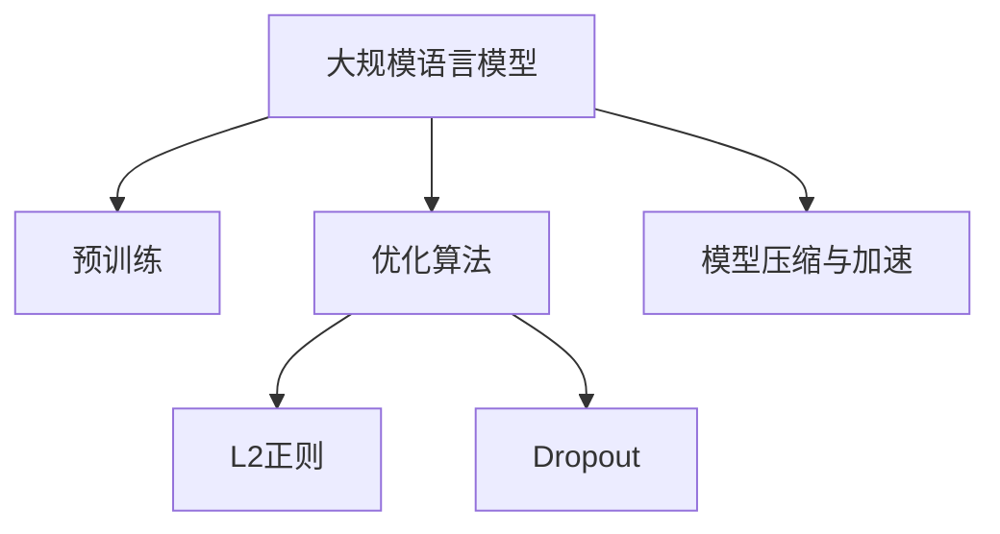

                 

# 大规模语言模型从理论到实践 模型训练

## 1. 背景介绍

### 1.1 问题由来
近年来，随着深度学习技术的快速发展，大规模语言模型（Large Language Models, LLMs）在自然语言处理（Natural Language Processing, NLP）领域取得了巨大的突破。这些模型通过在大规模无标签文本数据上进行预训练，学习到了丰富的语言知识和常识，成为当前NLP领域最前沿的研究方向之一。例如，GPT、BERT等大模型在多种下游任务上均取得了显著的性能提升。

然而，预训练模型的训练通常需要大量的计算资源和时间，这给模型训练带来了不小的挑战。此外，由于模型参数量巨大，模型训练过程容易出现过拟合等问题，需要采用各种技术手段进行优化。因此，理解大模型训练的理论和实践方法，对于推动NLP技术的发展和应用具有重要意义。

### 1.2 问题核心关键点
本文将从理论和实践两个层面，全面探讨大规模语言模型的训练方法。我们将重点关注以下几个关键点：

1. 模型架构设计：如何设计高效的模型架构，提高训练效率和效果。
2. 数据预处理：如何对数据进行高效预处理，提升训练速度和质量。
3. 优化算法：如何选择合适的优化算法，加速模型训练，避免过拟合。
4. 正则化技术：如何应用正则化技术，增强模型泛化能力。
5. 模型压缩与加速：如何通过模型压缩与加速技术，提高模型的实际应用效率。

这些关键点涵盖了模型训练的多个方面，能够帮助读者全面理解大规模语言模型训练的原理和实践方法。

## 2. 核心概念与联系

### 2.1 核心概念概述

为更好地理解大规模语言模型训练，本节将介绍几个密切相关的核心概念：

- 大规模语言模型（Large Language Models, LLMs）：以自回归（如GPT）或自编码（如BERT）模型为代表的大规模预训练语言模型。通过在大规模无标签文本语料上进行预训练，学习通用的语言表示。

- 预训练（Pre-training）：指在大规模无标签文本语料上，通过自监督学习任务训练通用语言模型的过程。常见的预训练任务包括掩码语言模型（Masked Language Model, MLM）、下一句预测（Next Sentence Prediction, NSP）等。

- 优化算法（Optimization Algorithm）：用于训练模型，通过反向传播算法计算损失函数梯度，更新模型参数的方法。常用的优化算法包括随机梯度下降（SGD）、Adam等。

- 正则化（Regularization）：用于防止模型过拟合的技术，通过在损失函数中引入惩罚项，抑制模型复杂度。常见的正则化方法包括L2正则、Dropout等。

- 模型压缩与加速（Model Compression and Acceleration）：通过剪枝、量化等技术减少模型参数，降低计算复杂度，提高训练和推理效率。

这些核心概念之间的逻辑关系可以通过以下Mermaid流程图来展示：



这个流程图展示了核心概念之间的相互关系：

1. 大规模语言模型通过预训练获得基础能力。
2. 优化算法用于训练模型，提升模型效果。
3. 正则化技术用于防止过拟合，提高模型泛化能力。
4. 模型压缩与加速技术用于优化模型，提高实际应用效率。

## 3. 核心算法原理 & 具体操作步骤

### 3.1 算法原理概述

大规模语言模型训练的基本原理是，通过在大规模无标签文本数据上进行预训练，学习到通用的语言表示。预训练模型的参数在训练过程中不断更新，以最小化损失函数，从而逐步提高模型的泛化能力。训练完成后，模型通常需要在特定任务上进行微调（Fine-tuning），以适应特定的任务需求。

在预训练过程中，通常采用自监督学习任务，如掩码语言模型（MLM）和下一句预测（NSP）。这些任务能够充分利用大规模无标签数据，提高模型的语言理解能力。在微调过程中，通过在少量有标签数据上进行训练，将预训练模型作为初始化参数，进一步优化模型，使其能够适应特定的下游任务。

### 3.2 算法步骤详解

大规模语言模型训练的主要步骤包括：

**Step 1: 准备数据与模型**
- 收集大规模无标签文本数据，构建数据集。
- 选择合适的预训练模型架构，如GPT、BERT等。

**Step 2: 数据预处理**
- 对数据进行分词、去除停用词、构建词汇表等预处理操作。
- 将文本数据转换为模型能够处理的输入格式，如token ids、位置编码等。

**Step 3: 构建预训练任务**
- 设计自监督学习任务，如掩码语言模型、下一句预测等。
- 构建预训练数据集，包含大量无标签文本数据。

**Step 4: 选择优化算法**
- 选择合适的优化算法，如Adam、SGD等。
- 设置学习率、批大小、迭代轮数等超参数。

**Step 5: 执行预训练**
- 对预训练数据集进行迭代训练，更新模型参数。
- 定期在验证集上评估模型性能，避免过拟合。

**Step 6: 微调**
- 收集特定任务的少量有标签数据，设计任务适配层。
- 将预训练模型作为初始化参数，在特定任务上进行微调。
- 使用少量数据，以较小的学习率更新模型参数，避免破坏预训练权重。

**Step 7: 优化与加速**
- 应用正则化技术，防止模型过拟合。
- 采用模型压缩与加速技术，提高模型训练和推理效率。

**Step 8: 评估与部署**
- 在测试集上评估微调后的模型性能。
- 将模型部署到实际应用中，进行推理预测。

以上是大规模语言模型训练的一般流程。在实际应用中，还需要根据具体任务进行优化设计，如改进预训练任务、调整超参数、引入更多正则化技术等，以进一步提升模型性能。

### 3.3 算法优缺点

大规模语言模型训练具有以下优点：
1. 训练效果好：大规模预训练模型能够学习到丰富的语言表示，应用于下游任务时性能优异。
2. 通用性强：预训练模型具有通用性，可以应用于多种NLP任务。
3. 训练效率高：大规模数据集和优化算法使得模型训练效率大幅提升。
4. 参数可迁移：预训练模型可以作为初始化参数，在不同任务上进行微调，减少从头训练的工作量。

同时，该方法也存在一些缺点：
1. 计算资源消耗大：大规模语言模型需要大量的计算资源和时间进行训练，对硬件设施要求高。
2. 数据需求量大：大规模无标签数据是预训练的基础，获取高质量数据成本高。
3. 泛化能力有限：预训练模型的泛化能力受数据分布的限制，可能不适用于特定领域的数据。
4. 知识更新慢：预训练模型无法实时更新知识，面对新的领域和任务需要重新训练。

尽管存在这些缺点，但就目前而言，大规模语言模型训练仍是NLP技术发展的重要方向之一。未来相关研究的重点在于如何进一步降低计算资源和数据需求，提高模型的泛化能力，同时兼顾可迁移性和实际应用效率。

### 3.4 算法应用领域

大规模语言模型训练在NLP领域已经得到了广泛应用，覆盖了几乎所有常见任务，例如：

- 文本分类：如情感分析、主题分类、意图识别等。通过预训练模型学习文本-标签映射。
- 命名实体识别：识别文本中的人名、地名、机构名等特定实体。通过预训练模型掌握实体边界和类型。
- 关系抽取：从文本中抽取实体之间的语义关系。通过预训练模型学习实体-关系三元组。
- 问答系统：对自然语言问题给出答案。将问题-答案对作为微调数据，训练模型学习匹配答案。
- 机器翻译：将源语言文本翻译成目标语言。通过预训练模型学习语言-语言映射。
- 文本摘要：将长文本压缩成简短摘要。通过预训练模型学习抓取要点。
- 对话系统：使机器能够与人自然对话。将多轮对话历史作为上下文，微调模型进行回复生成。

除了上述这些经典任务外，大规模语言模型训练也被创新性地应用到更多场景中，如可控文本生成、常识推理、代码生成、数据增强等，为NLP技术带来了全新的突破。随着预训练模型和训练方法的不断进步，相信NLP技术将在更广阔的应用领域大放异彩。

## 4. 数学模型和公式 & 详细讲解 & 举例说明

### 4.1 数学模型构建

大规模语言模型训练的数学模型可以表示为：

$$
\theta = \mathop{\arg\min}_{\theta} \mathcal{L}(D, \theta)
$$

其中，$\theta$ 为模型参数，$\mathcal{L}$ 为损失函数，$D$ 为训练数据集。

常用的损失函数包括交叉熵损失、均方误差损失等。以交叉熵损失为例，其定义为：

$$
\mathcal{L}(D, \theta) = -\frac{1}{N} \sum_{i=1}^N \sum_{j=1}^K \mathbb{I}(y_j \neq \hat{y}_j) \log \hat{y}_j
$$

其中，$N$ 为样本数，$K$ 为分类数，$\mathbb{I}(y_j \neq \hat{y}_j)$ 为示性函数，$y_j$ 为真实标签，$\hat{y}_j$ 为模型预测概率。

### 4.2 公式推导过程

以掩码语言模型（MLM）为例，其预训练任务定义为：给定一个文本序列 $X = [x_1, x_2, ..., x_n]$，其中 $x_i$ 为词汇表中的单词，掩码 $M = [m_1, m_2, ..., m_n]$ 表示某些位置被掩码，$\theta$ 为模型参数。预训练任务的目标是预测被掩码位置的单词。

将文本序列和掩码转换为模型输入格式，计算模型在每个掩码位置的预测概率 $p_i$，然后计算交叉熵损失：

$$
\mathcal{L}_{MLM} = -\frac{1}{N} \sum_{i=1}^N \sum_{m \in M} \log p_i^{(m)}
$$

在训练过程中，通过反向传播算法计算损失函数的梯度，更新模型参数 $\theta$。

### 4.3 案例分析与讲解

以下我们以BERT模型为例，给出大规模语言模型训练的完整代码实现。

```python
import torch
import torch.nn as nn
import torch.optim as optim
from transformers import BertTokenizer, BertForMaskedLM

# 构建BERT模型
tokenizer = BertTokenizer.from_pretrained('bert-base-cased')
model = BertForMaskedLM.from_pretrained('bert-base-cased')

# 准备训练数据
# 此处省略数据加载和预处理代码

# 构建损失函数
criterion = nn.CrossEntropyLoss()

# 设置优化器和超参数
optimizer = optim.Adam(model.parameters(), lr=2e-5)
device = torch.device('cuda' if torch.cuda.is_available() else 'cpu')
model.to(device)

# 训练模型
for epoch in range(10):
    model.train()
    for batch in dataloader:
        input_ids = batch['input_ids'].to(device)
        attention_mask = batch['attention_mask'].to(device)
        labels = batch['labels'].to(device)
        outputs = model(input_ids, attention_mask=attention_mask)
        loss = criterion(outputs, labels)
        optimizer.zero_grad()
        loss.backward()
        optimizer.step()
    
    model.eval()
    for batch in val_dataloader:
        input_ids = batch['input_ids'].to(device)
        attention_mask = batch['attention_mask'].to(device)
        labels = batch['labels'].to(device)
        with torch.no_grad():
            outputs = model(input_ids, attention_mask=attention_mask)
            loss = criterion(outputs, labels)
    
    print(f'Epoch {epoch+1}, loss: {loss:.3f}')
```

在这个代码中，我们首先构建了BERT模型，并准备了训练数据。然后定义了交叉熵损失函数和Adam优化器。在训练过程中，我们通过反向传播算法更新模型参数，并在验证集上评估模型性能。通过多次迭代，最终得到训练好的BERT模型。

## 5. 项目实践：代码实例和详细解释说明

### 5.1 开发环境搭建

在进行大规模语言模型训练实践前，我们需要准备好开发环境。以下是使用Python进行PyTorch开发的环境配置流程：

1. 安装Anaconda：从官网下载并安装Anaconda，用于创建独立的Python环境。

2. 创建并激活虚拟环境：
```bash
conda create -n pytorch-env python=3.8 
conda activate pytorch-env
```

3. 安装PyTorch：根据CUDA版本，从官网获取对应的安装命令。例如：
```bash
conda install pytorch torchvision torchaudio cudatoolkit=11.1 -c pytorch -c conda-forge
```

4. 安装Transformers库：
```bash
pip install transformers
```

5. 安装各类工具包：
```bash
pip install numpy pandas scikit-learn matplotlib tqdm jupyter notebook ipython
```

完成上述步骤后，即可在`pytorch-env`环境中开始大规模语言模型训练实践。

### 5.2 源代码详细实现

这里我们以BERT模型为例，演示如何使用PyTorch进行大规模语言模型训练。

```python
import torch
import torch.nn as nn
import torch.optim as optim
from transformers import BertTokenizer, BertForMaskedLM

# 构建BERT模型
tokenizer = BertTokenizer.from_pretrained('bert-base-cased')
model = BertForMaskedLM.from_pretrained('bert-base-cased')

# 准备训练数据
# 此处省略数据加载和预处理代码

# 构建损失函数
criterion = nn.CrossEntropyLoss()

# 设置优化器和超参数
optimizer = optim.Adam(model.parameters(), lr=2e-5)
device = torch.device('cuda' if torch.cuda.is_available() else 'cpu')
model.to(device)

# 训练模型
for epoch in range(10):
    model.train()
    for batch in dataloader:
        input_ids = batch['input_ids'].to(device)
        attention_mask = batch['attention_mask'].to(device)
        labels = batch['labels'].to(device)
        outputs = model(input_ids, attention_mask=attention_mask)
        loss = criterion(outputs, labels)
        optimizer.zero_grad()
        loss.backward()
        optimizer.step()
    
    model.eval()
    for batch in val_dataloader:
        input_ids = batch['input_ids'].to(device)
        attention_mask = batch['attention_mask'].to(device)
        labels = batch['labels'].to(device)
        with torch.no_grad():
            outputs = model(input_ids, attention_mask=attention_mask)
            loss = criterion(outputs, labels)
    
    print(f'Epoch {epoch+1}, loss: {loss:.3f}')
```

在这个代码中，我们首先构建了BERT模型，并准备了训练数据。然后定义了交叉熵损失函数和Adam优化器。在训练过程中，我们通过反向传播算法更新模型参数，并在验证集上评估模型性能。通过多次迭代，最终得到训练好的BERT模型。

### 5.3 代码解读与分析

让我们再详细解读一下关键代码的实现细节：

**BERT模型定义**：
- 使用`transformers`库中的`BertForMaskedLM`类，定义了一个基于BERT的掩码语言模型。

**数据加载与预处理**：
- 使用`transformers`库中的`BertTokenizer`类，加载预训练模型的分词器。
- 对输入数据进行分词、截断、填充等预处理操作，构建token ids、注意力掩码等输入格式。

**损失函数和优化器**：
- 定义交叉熵损失函数，用于衡量模型预测概率与真实标签之间的差异。
- 使用Adam优化器，设置学习率为$2e-5$，用于更新模型参数。

**训练过程**：
- 在每个epoch中，将模型置于训练模式，对数据集进行迭代训练。
- 在前向传播中，输入token ids和注意力掩码，计算模型输出和损失函数。
- 在反向传播中，计算损失函数的梯度，使用优化器更新模型参数。
- 在每个epoch结束后，将模型置于评估模式，在验证集上评估模型性能。

通过这个代码，读者可以全面理解大规模语言模型训练的实现流程。

## 6. 实际应用场景

### 6.1 智能客服系统

基于大规模语言模型训练的对话技术，可以广泛应用于智能客服系统的构建。传统客服往往需要配备大量人力，高峰期响应缓慢，且一致性和专业性难以保证。而使用训练好的对话模型，可以7x24小时不间断服务，快速响应客户咨询，用自然流畅的语言解答各类常见问题。

在技术实现上，可以收集企业内部的历史客服对话记录，将问题和最佳答复构建成监督数据，在此基础上训练模型。训练好的对话模型能够自动理解用户意图，匹配最合适的答复，提供个性化的服务。

### 6.2 金融舆情监测

金融机构需要实时监测市场舆论动向，以便及时应对负面信息传播，规避金融风险。传统的人工监测方式成本高、效率低，难以应对网络时代海量信息爆发的挑战。基于大规模语言模型训练的文本分类和情感分析技术，为金融舆情监测提供了新的解决方案。

具体而言，可以收集金融领域相关的新闻、报道、评论等文本数据，并对其进行主题标注和情感标注。在此基础上训练模型，使其能够自动判断文本属于何种主题，情感倾向是正面、中性还是负面。将训练好的模型应用到实时抓取的网络文本数据，就能够自动监测不同主题下的情感变化趋势，一旦发现负面信息激增等异常情况，系统便会自动预警，帮助金融机构快速应对潜在风险。

### 6.3 个性化推荐系统

当前的推荐系统往往只依赖用户的历史行为数据进行物品推荐，无法深入理解用户的真实兴趣偏好。基于大规模语言模型训练的个性化推荐系统可以更好地挖掘用户行为背后的语义信息，从而提供更精准、多样的推荐内容。

在实践中，可以收集用户浏览、点击、评论、分享等行为数据，提取和用户交互的物品标题、描述、标签等文本内容。将文本内容作为模型输入，用户的后续行为（如是否点击、购买等）作为监督信号，在此基础上训练模型。训练好的模型能够从文本内容中准确把握用户的兴趣点。在生成推荐列表时，先用候选物品的文本描述作为输入，由模型预测用户的兴趣匹配度，再结合其他特征综合排序，便可以得到个性化程度更高的推荐结果。

### 6.4 未来应用展望

随着大规模语言模型训练技术的不断发展，其在NLP领域的应用将进一步拓展。未来，基于大规模语言模型的训练方法将更广泛地应用于智能客服、金融舆情、个性化推荐、智能对话等多个领域，为传统行业数字化转型升级提供新的技术路径。

在智慧医疗领域，基于大规模语言模型的问答、病历分析、药物研发等应用将提升医疗服务的智能化水平，辅助医生诊疗，加速新药开发进程。

在智能教育领域，大规模语言模型训练可以应用于作业批改、学情分析、知识推荐等方面，因材施教，促进教育公平，提高教学质量。

在智慧城市治理中，大规模语言模型训练可以应用于城市事件监测、舆情分析、应急指挥等环节，提高城市管理的自动化和智能化水平，构建更安全、高效的未来城市。

此外，在企业生产、社会治理、文娱传媒等众多领域，基于大规模语言模型的训练方法也将不断涌现，为NLP技术带来新的突破。相信随着预训练模型和训练方法的持续演进，大规模语言模型训练必将在构建人机协同的智能时代中扮演越来越重要的角色。

## 7. 工具和资源推荐

### 7.1 学习资源推荐

为了帮助开发者系统掌握大规模语言模型训练的理论基础和实践技巧，这里推荐一些优质的学习资源：

1. 《深度学习》课程：斯坦福大学开设的深度学习课程，有Lecture视频和配套作业，带你入门深度学习的基本概念和经典模型。

2. 《Natural Language Processing with Transformers》书籍：Transformer库的作者所著，全面介绍了如何使用Transformer库进行NLP任务开发，包括训练在内的诸多范式。

3. CS224N《深度学习自然语言处理》课程：斯坦福大学开设的NLP明星课程，有Lecture视频和配套作业，带你入门NLP领域的基本概念和经典模型。

4. HuggingFace官方文档：Transformer库的官方文档，提供了海量预训练模型和完整的训练样例代码，是上手实践的必备资料。

5. Kaggle平台：提供大量NLP领域的竞赛任务和数据集，可以通过实践积累经验，提升技能。

通过对这些资源的学习实践，相信你一定能够快速掌握大规模语言模型训练的精髓，并用于解决实际的NLP问题。

### 7.2 开发工具推荐

高效的开发离不开优秀的工具支持。以下是几款用于大规模语言模型训练开发的常用工具：

1. PyTorch：基于Python的开源深度学习框架，灵活动态的计算图，适合快速迭代研究。

2. TensorFlow：由Google主导开发的开源深度学习框架，生产部署方便，适合大规模工程应用。

3. Weights & Biases：模型训练的实验跟踪工具，可以记录和可视化模型训练过程中的各项指标，方便对比和调优。

4. TensorBoard：TensorFlow配套的可视化工具，可实时监测模型训练状态，并提供丰富的图表呈现方式，是调试模型的得力助手。

5. PyTorch Lightning：基于PyTorch的快速原型开发框架，支持自动化的训练过程管理和可视化，简化模型训练流程。

合理利用这些工具，可以显著提升大规模语言模型训练的开发效率，加快创新迭代的步伐。

### 7.3 相关论文推荐

大规模语言模型训练和优化技术的快速发展，离不开学界的持续研究。以下是几篇奠基性的相关论文，推荐阅读：

1. Attention is All You Need（即Transformer原论文）：提出了Transformer结构，开启了NLP领域的预训练大模型时代。

2. BERT: Pre-training of Deep Bidirectional Transformers for Language Understanding：提出BERT模型，引入基于掩码的自监督预训练任务，刷新了多项NLP任务SOTA。

3. Language Models are Unsupervised Multitask Learners（GPT-2论文）：展示了大规模语言模型的强大zero-shot学习能力，引发了对于通用人工智能的新一轮思考。

4. Model Parallelism: A Survey：介绍了模型并行技术在大规模深度学习模型训练中的应用，提高了模型训练效率。

5. Accelerating Large-Scale Distributed Deep Learning with Compression（Hierarchical Compression论文）：提出了层次化压缩方法，显著减少了大规模深度学习模型的存储和通信开销。

这些论文代表了大规模语言模型训练技术的发展脉络。通过学习这些前沿成果，可以帮助研究者把握学科前进方向，激发更多的创新灵感。

## 8. 总结：未来发展趋势与挑战

### 8.1 总结

本文对大规模语言模型训练方法进行了全面系统的介绍。首先阐述了大规模语言模型训练的背景和重要性，明确了训练在提升模型性能、拓展模型应用边界方面的独特价值。其次，从理论和实践两个层面，详细讲解了大规模语言模型训练的数学模型和关键步骤，给出了训练任务开发的完整代码实例。同时，本文还广泛探讨了大规模语言模型训练在多个行业领域的应用前景，展示了其广泛的应用潜力。

通过本文的系统梳理，可以看到，大规模语言模型训练技术正在成为NLP领域的重要方向之一，极大地推动了NLP技术的发展和应用。未来，随着预训练模型和训练方法的持续演进，大规模语言模型训练必将在构建人机协同的智能时代中扮演越来越重要的角色。

### 8.2 未来发展趋势

展望未来，大规模语言模型训练技术将呈现以下几个发展趋势：

1. 模型规模持续增大：随着算力成本的下降和数据规模的扩张，预训练语言模型的参数量还将持续增长。超大规模语言模型蕴含的丰富语言知识，有望支撑更加复杂多变的下游任务训练。

2. 训练方法日趋多样：未来会涌现更多高效的训练方法，如模型并行、层次化压缩等，在提高训练效率的同时保证模型效果。

3. 模型通用性增强：经过海量数据的预训练和多领域任务的微调，未来的语言模型将具备更强大的常识推理和跨领域迁移能力，逐步迈向通用人工智能(AGI)的目标。

4. 模型压缩与加速技术：开发更加参数高效和计算高效的训练方法，如参数共享、剪枝、量化等，提高模型训练和推理效率，增强模型实际应用能力。

5. 数据与模型协同优化：数据与模型之间的协同优化将成为新的研究方向，如主动学习、自适应学习等，提升训练效果和效率。

6. 模型公平性与安全性的研究：随着模型的广泛应用，如何确保模型的公平性、鲁棒性和安全性，避免偏见、歧视等问题，将成为新的研究热点。

这些趋势凸显了大规模语言模型训练技术的广阔前景。这些方向的探索发展，必将进一步提升模型的训练效果和应用范围，为构建安全、可靠、可解释、可控的智能系统铺平道路。

### 8.3 面临的挑战

尽管大规模语言模型训练技术已经取得了显著成果，但在迈向更加智能化、普适化应用的过程中，仍面临诸多挑战：

1. 计算资源消耗大：大规模语言模型训练需要大量的计算资源和时间，对硬件设施要求高。

2. 数据需求量大：大规模无标签数据是预训练的基础，获取高质量数据成本高。

3. 泛化能力有限：预训练模型的泛化能力受数据分布的限制，可能不适用于特定领域的数据。

4. 训练效率低：大规模模型的训练效率仍然是一个难题，需要引入新的优化方法。

5. 模型鲁棒性不足：当前训练的模型对噪声和对抗样本的鲁棒性不足，易受到攻击和干扰。

6. 模型复杂度高：大规模语言模型的参数量巨大，模型复杂度高，难以在实际应用中高效部署。

7. 模型公平性与安全性问题：模型可能学习到偏见、歧视等有害信息，引发伦理和安全问题。

这些挑战凸显了大规模语言模型训练技术的复杂性和挑战性。解决这些问题需要学界和工业界的共同努力，不断探索和优化训练方法和应用策略。

### 8.4 研究展望

面对大规模语言模型训练所面临的种种挑战，未来的研究需要在以下几个方面寻求新的突破：

1. 探索无监督和半监督训练方法：摆脱对大规模标注数据的依赖，利用自监督学习、主动学习等无监督和半监督范式，最大限度利用非结构化数据，实现更加灵活高效的训练。

2. 开发更高效的优化算法：如梯度累积、混合精度训练、模型并行等，在保证模型效果的前提下，提高训练效率和资源利用率。

3. 研究模型压缩与加速技术：开发更加参数高效和计算高效的训练方法，如剪枝、量化、知识蒸馏等，提高模型训练和推理效率，增强模型实际应用能力。

4. 引入更多的正则化技术：如对抗训练、噪声注入等，增强模型泛化能力和鲁棒性。

5. 模型公平性与安全性研究：在模型训练目标中引入伦理导向的评估指标，过滤和惩罚有偏见、有害的输出倾向。加强模型行为的监管机制，确保输出符合人类价值观和伦理道德。

6. 多模态信息的融合：将视觉、语音等多模态信息与文本信息进行协同建模，增强模型的感知能力。

这些研究方向将引领大规模语言模型训练技术迈向更高的台阶，为构建安全、可靠、可解释、可控的智能系统铺平道路。面向未来，大规模语言模型训练技术还需要与其他人工智能技术进行更深入的融合，如知识表示、因果推理、强化学习等，多路径协同发力，共同推动自然语言理解和智能交互系统的进步。只有勇于创新、敢于突破，才能不断拓展语言模型的边界，让智能技术更好地造福人类社会。

## 9. 附录：常见问题与解答

**Q1：大规模语言模型训练是否适用于所有NLP任务？**

A: 大规模语言模型训练在大多数NLP任务上都能取得不错的效果，特别是对于数据量较小的任务。但对于一些特定领域的任务，如医学、法律等，仅仅依靠通用语料预训练的模型可能难以很好地适应。此时需要在特定领域语料上进一步预训练，再进行训练，才能获得理想效果。此外，对于一些需要时效性、个性化很强的任务，如对话、推荐等，训练方法也需要针对性的改进优化。

**Q2：在训练过程中如何避免过拟合？**

A: 避免过拟合是大规模语言模型训练中的一个重要问题。常见的缓解策略包括：
1. 数据增强：通过回译、近义替换等方式扩充训练集。
2. 正则化：使用L2正则、Dropout等技术，抑制模型复杂度。
3. 对抗训练：引入对抗样本，提高模型鲁棒性。
4. 模型压缩与加速：通过剪枝、量化等技术，减少模型参数量，提高训练效率。
5. 多模型集成：训练多个模型，取平均输出，抑制过拟合。

这些策略往往需要根据具体任务和数据特点进行灵活组合。只有在数据、模型、训练、推理等各环节进行全面优化，才能最大限度地发挥大规模语言模型训练的优势。

**Q3：大规模语言模型训练过程中如何提高模型效果？**

A: 提高模型效果是大规模语言模型训练的最终目标。常见的策略包括：
1. 选择合适的网络架构：如BERT、GPT等预训练模型，具有较强的泛化能力。
2. 选择适当的超参数：如学习率、批大小、迭代轮数等，通过实验调参，找到最优组合。
3. 应用正则化技术：如L2正则、Dropout等，避免模型过拟合。
4. 引入更多训练数据：通过数据增强、主动学习等技术，增加训练数据量。
5. 使用更好的优化算法：如Adam、SGD等，加快模型训练速度，提高模型效果。
6. 应用模型压缩与加速技术：如剪枝、量化等，减少模型参数量，提高模型训练效率。

通过这些策略，可以在大规模语言模型训练过程中显著提升模型效果，为下游任务的应用提供更好的基础。

**Q4：大规模语言模型训练过程中如何评估模型性能？**

A: 评估模型性能是大规模语言模型训练中的关键环节。常用的评估指标包括：
1. 精度：衡量模型在分类任务上的预测准确率。
2. 召回率：衡量模型在分类任务上的召回能力。
3. F1分数：综合考虑精度和召回率的评估指标。
4. BLEU分数：衡量模型在机器翻译等生成任务上的质量。
5. 困惑度：衡量模型在语言模型任务上的性能。

在实际应用中，通常将训练集和验证集分开，先训练模型，然后在验证集上评估模型性能。如果模型性能不理想，则需要调整超参数、引入更多训练数据、应用正则化技术等手段，再次训练模型。通过不断迭代，最终得到性能最优的模型。

**Q5：大规模语言模型训练过程中如何处理数据预处理？**

A: 数据预处理是大规模语言模型训练中的重要步骤，其目标是提高训练效率和模型效果。常用的预处理步骤包括：
1. 分词：将文本数据转换为模型能够处理的token序列。
2. 截断和填充：将token序列截断和填充到固定长度。
3. 构建词汇表：将token序列转换为模型能够处理的输入格式。
4. 去除停用词：去除常见的无意义单词，减少噪音。
5. 特殊符号处理：添加特殊符号，如[CLS]、[SEP]等，用于标记输入和输出。

在实际应用中，数据预处理需要根据具体任务进行调整，如对于文本分类任务，需要保留标签信息；对于机器翻译任务，需要进行对齐和双语标注等操作。通过合理的数据预处理，可以显著提高大规模语言模型训练的效率和效果。

通过本文的系统梳理，可以看到，大规模语言模型训练技术正在成为NLP领域的重要方向之一，极大地推动了NLP技术的发展和应用。未来，随着预训练模型和训练方法的持续演进，大规模语言模型训练必将在构建人机协同的智能时代中扮演越来越重要的角色。相信随着学界和工业界的共同努力，这些挑战终将一一被克服，大规模语言模型训练必将在NLP技术的发展中发挥更大的作用。

