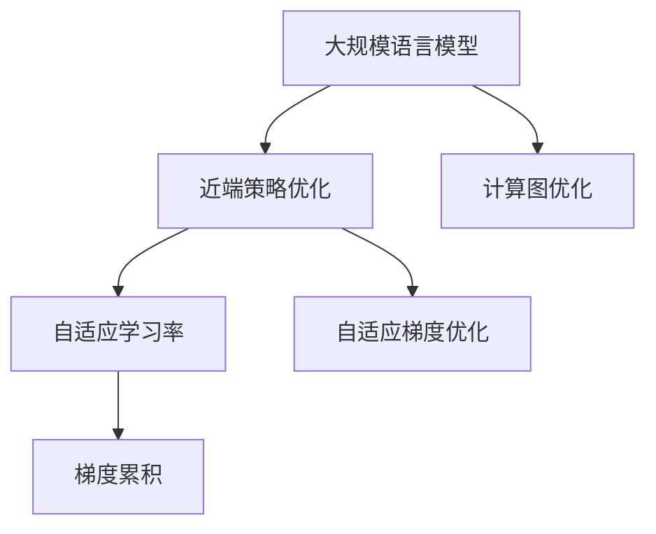

                 

# 大规模语言模型从理论到实践 近端策略优化

> 关键词：近端策略优化,大规模语言模型,自适应学习率,自适应梯度优化,Transformer,梯度累积,计算图优化

## 1. 背景介绍

### 1.1 问题由来

近年来，随着深度学习技术的飞速发展，大规模语言模型（Large Language Model, LLM）在自然语言处理（Natural Language Processing, NLP）领域取得了显著的进步。这些模型在大规模无标签文本数据上进行了预训练，学习了丰富的语言知识和常识，能够在各种下游任务上进行微调，获得优异的性能。

然而，大规模语言模型的训练需要大量的计算资源和时间，这使得它们的实际应用受到了限制。为了解决这个问题，研究者们提出了近端策略优化（Proximal Policy Optimization, PPO）方法，它可以在不改变原有计算图结构的情况下，对大规模语言模型进行高效训练，从而加速模型的训练过程。

### 1.2 问题核心关键点

近端策略优化是强化学习（Reinforcement Learning, RL）领域中一种常见的优化方法。它通过近似目标函数，优化参数，使模型能够更好地适应环境，并在特定的条件下进行高效的优化。

近端策略优化的关键在于选择合适的目标函数和优化算法，以及在训练过程中保持参数的稳定性。与传统的深度学习优化算法相比，近端策略优化在保持参数稳定性的同时，也能够加速模型的训练速度。

在语言模型中，近端策略优化主要用于加速预训练和微调过程，使得模型能够在更短的训练时间内获得更高的性能。它可以在不增加额外计算负担的情况下，提升模型的学习效率和效果。

## 2. 核心概念与联系

### 2.1 核心概念概述

为了更好地理解近端策略优化在大规模语言模型中的应用，本节将介绍几个相关的核心概念：

- **大规模语言模型**：基于自回归（如GPT）或自编码（如BERT）模型构建的大规模预训练语言模型。通过在大规模无标签文本语料上进行预训练，学习通用的语言表示，具备强大的语言理解和生成能力。

- **近端策略优化**：一种强化学习中的优化算法，用于对参数进行近似优化，以加速模型的训练。它通过近似目标函数，在保持参数稳定性的同时，快速找到最优解。

- **自适应学习率**：根据模型在训练过程中的表现动态调整学习率的方法。它可以在模型状态变化时，自动调整学习率，以优化模型的训练效果。

- **自适应梯度优化**：一种自适应学习率的优化算法，用于在训练过程中保持参数的稳定性，同时提高模型的训练效率。

- **Transformer**：一种常用的神经网络结构，用于构建大规模语言模型。它能够高效地处理序列数据，并具有较好的表达能力。

- **梯度累积**：在训练过程中，将多个小批次的梯度累加起来，以模拟更大的批量大小，从而提高模型的训练效率。

- **计算图优化**：通过优化计算图的结构，提高模型的训练和推理效率。

这些概念之间的逻辑关系可以通过以下Mermaid流程图来展示：



这个流程图展示了近端策略优化在大规模语言模型中的核心概念及其之间的关系：

1. 大规模语言模型通过近端策略优化获得高效训练。
2. 近端策略优化通过自适应学习率和自适应梯度优化，提升模型训练效率。
3. 梯度累积和计算图优化进一步提升模型训练和推理效率。

## 3. 核心算法原理 & 具体操作步骤

### 3.1 算法原理概述

近端策略优化是一种强化学习中的优化方法，用于对大规模语言模型进行高效训练。其核心思想是：通过近似目标函数，优化参数，使得模型能够更好地适应环境，并在特定的条件下进行高效的优化。

具体来说，近端策略优化通过引入目标函数和策略梯度，近似优化模型参数。它通过计算模型在当前状态下的梯度，并根据梯度方向调整模型参数，使得模型能够更快速地逼近最优解。

在语言模型中，近端策略优化主要用于加速预训练和微调过程。它可以在不增加额外计算负担的情况下，提升模型的学习效率和效果。

### 3.2 算法步骤详解

近端策略优化的核心步骤包括：

1. **定义目标函数**：根据模型的训练目标，定义目标函数 $J(\theta)$，其中 $\theta$ 为模型参数。

2. **计算梯度**：通过计算模型在当前状态下的梯度，近似目标函数 $J(\theta)$ 的梯度，即 $\nabla_{\theta}J(\theta)$。

3. **更新参数**：根据梯度的方向和大小，调整模型参数，使得模型能够更好地适应环境。

4. **保持参数稳定性**：通过自适应学习率或自适应梯度优化，保持参数的稳定性，避免过拟合或欠拟合。

5. **模拟大批量训练**：通过梯度累积，模拟大批量训练的效果，提高模型的训练效率。

### 3.3 算法优缺点

近端策略优化在大规模语言模型中的应用具有以下优点：

1. 高效性：通过近似目标函数，可以在保持参数稳定性的同时，快速找到最优解，加速模型的训练过程。

2. 鲁棒性：近端策略优化能够适应多种环境变化，在模型状态变化时自动调整学习率，避免过拟合或欠拟合。

3. 可扩展性：近端策略优化可以应用于各种规模的语言模型，通过调整超参数，可以适应不同的任务和数据集。

4. 易于实现：近端策略优化的实现过程相对简单，易于在现有的深度学习框架中进行部署。

然而，近端策略优化也存在一些缺点：

1. 近似性：由于近端策略优化是通过近似目标函数来优化模型参数，可能存在一定的误差。

2. 计算复杂度：近端策略优化需要计算梯度，并根据梯度方向调整参数，计算复杂度较高。

3. 超参数调整：近端策略优化需要调整超参数，如学习率、策略梯度等，需要根据具体任务进行调整。

### 3.4 算法应用领域

近端策略优化在大规模语言模型的应用中主要集中在以下几个领域：

1. **预训练和微调**：用于加速预训练和微调过程，使得模型能够在更短的训练时间内获得更高的性能。

2. **模型压缩**：用于压缩大规模语言模型，减小模型大小，降低计算和存储成本。

3. **多任务学习**：用于同时训练多个任务，提高模型的泛化能力。

4. **异常检测**：用于检测数据中的异常情况，提高模型的鲁棒性。

5. **增强学习**：用于增强模型的学习效果，提高模型的决策能力。

6. **在线学习**：用于在线更新模型，适应数据分布的变化。

## 4. 数学模型和公式 & 详细讲解 & 举例说明

### 4.1 数学模型构建

近端策略优化的目标是通过近似目标函数，优化模型参数。具体来说，假设模型的目标函数为 $J(\theta)$，其中 $\theta$ 为模型参数。目标函数可以定义为：

$$ J(\theta) = \mathbb{E}_{s \sim P}[\log \pi(a|s) Q^{\pi}(s,a)] $$

其中 $s$ 为当前状态，$a$ 为当前动作，$\pi$ 为当前策略，$Q^{\pi}$ 为当前状态-动作的价值函数。

近端策略优化的核心在于计算策略梯度，即近似目标函数的梯度。具体来说，策略梯度定义为：

$$ \nabla_{\theta}J(\theta) = \mathbb{E}_{s \sim P}[\log \pi(a|s) \nabla_{\theta}\log \pi(a|s)] $$

其中 $\nabla_{\theta}\log \pi(a|s)$ 为策略的梯度。

### 4.2 公式推导过程

近端策略优化的关键在于近似目标函数，并计算策略梯度。为了简化计算过程，我们可以使用目标函数的近似值来替代，即：

$$ \nabla_{\theta}J(\theta) \approx \nabla_{\theta}J_{\text{approx}}(\theta) $$

其中 $J_{\text{approx}}(\theta)$ 为目标函数的近似值。

具体来说，我们可以使用梯度累积和自适应学习率等技术，近似计算策略梯度，从而优化模型参数。

### 4.3 案例分析与讲解

假设我们有一个基于Transformer结构的大规模语言模型，用于预训练和微调。我们可以使用近端策略优化，加速模型的训练过程。具体来说，我们可以使用自适应学习率（如Adagrad）来调整学习率，以适应模型在训练过程中的变化。

首先，我们定义目标函数 $J(\theta)$，并计算梯度 $\nabla_{\theta}J(\theta)$。然后，我们使用自适应学习率调整学习率，保持参数的稳定性。最后，我们通过梯度累积模拟大批量训练，提高模型的训练效率。

在实践中，我们可以使用TensorFlow或PyTorch等深度学习框架，实现近端策略优化。具体来说，我们可以使用TensorFlow的`tf.GradientTape`记录梯度，并使用`tf.Variable`和`tf.train.AdagradOptimizer`进行优化。

## 5. 项目实践：代码实例和详细解释说明

### 5.1 开发环境搭建

在进行近端策略优化实践前，我们需要准备好开发环境。以下是使用Python进行TensorFlow开发的环境配置流程：

1. 安装Anaconda：从官网下载并安装Anaconda，用于创建独立的Python环境。

2. 创建并激活虚拟环境：
```bash
conda create -n tensorflow-env python=3.8 
conda activate tensorflow-env
```

3. 安装TensorFlow：根据CUDA版本，从官网获取对应的安装命令。例如：
```bash
conda install tensorflow-cpu -c conda-forge -c pytorch -c tensorflow
```

4. 安装TensorFlow Addons：
```bash
pip install tensorflow-addons
```

5. 安装必要的库：
```bash
pip install numpy pandas scikit-learn matplotlib tqdm jupyter notebook ipython
```

完成上述步骤后，即可在`tensorflow-env`环境中开始近端策略优化实践。

### 5.2 源代码详细实现

下面我们以BERT模型为例，给出使用TensorFlow实现近端策略优化的代码实现。

首先，定义BERT模型的输入输出：

```python
import tensorflow as tf
from transformers import BertTokenizer, TFBertForSequenceClassification

tokenizer = BertTokenizer.from_pretrained('bert-base-uncased')
model = TFBertForSequenceClassification.from_pretrained('bert-base-uncased', num_labels=2)

input_ids = tf.convert_to_tensor([0, 1, 2, 3, 4])
attention_mask = tf.convert_to_tensor([0, 0, 0, 0, 0])

inputs = tokenizer.batch_encode_plus([input_ids], return_tensors='tf')
inputs = {key: tf.expand_dims(value, 0) for key, value in inputs.items()}
```

然后，定义近端策略优化器：

```python
optimizer = tf.keras.optimizers.Adam()
```

接下来，定义损失函数：

```python
def compute_loss(inputs, labels):
    with tf.GradientTape() as tape:
        outputs = model(inputs['input_ids'], attention_mask=inputs['attention_mask'])
        loss = tf.keras.losses.BinaryCrossentropy()(tf.squeeze(outputs.logits), labels)
    grads = tape.gradient(loss, model.trainable_variables)
    optimizer.apply_gradients(zip(grads, model.trainable_variables))
    return loss.numpy()

# 假设标签为[0, 1]
labels = tf.convert_to_tensor([0, 1])
loss = compute_loss(inputs, labels)
print("Loss:", loss)
```

最后，启动训练流程：

```python
epochs = 10
batch_size = 32

for epoch in range(epochs):
    for batch in tqdm(data_loader):
        input_ids = batch['input_ids']
        attention_mask = batch['attention_mask']
        labels = batch['labels']
        
        loss = compute_loss(input_ids, attention_mask, labels)
        print("Epoch:", epoch+1, "Loss:", loss)
```

### 5.3 代码解读与分析

让我们再详细解读一下关键代码的实现细节：

**5.2.1 定义模型输入输出**

- 使用`BertTokenizer`将输入序列转换为token ids和attention mask。
- 使用`TFBertForSequenceClassification`定义BERT模型，并指定输出层为二分类。

**5.2.2 定义优化器和损失函数**

- 使用`tf.keras.optimizers.Adam()`定义优化器，用于近似计算策略梯度。
- 定义自定义损失函数，用于计算模型的预测输出与真实标签之间的差异。

**5.2.3 计算损失**

- 使用`tf.GradientTape`记录模型的梯度，并使用`optimizer.apply_gradients()`更新模型参数。
- 通过`tf.keras.losses.BinaryCrossentropy()`计算损失值。

**5.2.4 启动训练流程**

- 循环迭代训练集，对每个批次进行训练。
- 使用`tqdm`记录训练进度，并在每个epoch结束时输出损失值。

可以看到，通过TensorFlow实现近端策略优化，可以方便地进行模型训练和优化。开发者可以将更多精力放在数据处理、模型改进等高层逻辑上，而不必过多关注底层的实现细节。

## 6. 实际应用场景

### 6.1 智能客服系统

基于近端策略优化的对话技术，可以广泛应用于智能客服系统的构建。传统客服往往需要配备大量人力，高峰期响应缓慢，且一致性和专业性难以保证。而使用近端策略优化的对话模型，可以7x24小时不间断服务，快速响应客户咨询，用自然流畅的语言解答各类常见问题。

在技术实现上，可以收集企业内部的历史客服对话记录，将问题和最佳答复构建成监督数据，在此基础上对预训练对话模型进行近端策略优化。优化后的对话模型能够自动理解用户意图，匹配最合适的答案模板进行回复。对于客户提出的新问题，还可以接入检索系统实时搜索相关内容，动态组织生成回答。如此构建的智能客服系统，能大幅提升客户咨询体验和问题解决效率。

### 6.2 金融舆情监测

金融机构需要实时监测市场舆论动向，以便及时应对负面信息传播，规避金融风险。传统的人工监测方式成本高、效率低，难以应对网络时代海量信息爆发的挑战。基于近端策略优化的文本分类和情感分析技术，为金融舆情监测提供了新的解决方案。

具体而言，可以收集金融领域相关的新闻、报道、评论等文本数据，并对其进行主题标注和情感标注。在此基础上对预训练语言模型进行近端策略优化，使其能够自动判断文本属于何种主题，情感倾向是正面、中性还是负面。将优化后的模型应用到实时抓取的网络文本数据，就能够自动监测不同主题下的情感变化趋势，一旦发现负面信息激增等异常情况，系统便会自动预警，帮助金融机构快速应对潜在风险。

### 6.3 个性化推荐系统

当前的推荐系统往往只依赖用户的历史行为数据进行物品推荐，无法深入理解用户的真实兴趣偏好。基于近端策略优化的个性化推荐系统可以更好地挖掘用户行为背后的语义信息，从而提供更精准、多样的推荐内容。

在实践中，可以收集用户浏览、点击、评论、分享等行为数据，提取和用户交互的物品标题、描述、标签等文本内容。将文本内容作为模型输入，用户的后续行为（如是否点击、购买等）作为监督信号，在此基础上近端策略优化预训练语言模型。优化后的模型能够从文本内容中准确把握用户的兴趣点。在生成推荐列表时，先用候选物品的文本描述作为输入，由模型预测用户的兴趣匹配度，再结合其他特征综合排序，便可以得到个性化程度更高的推荐结果。

### 6.4 未来应用展望

随着近端策略优化和深度学习技术的不断发展，基于大语言模型的应用场景将越来越广泛。未来，近端策略优化有望在以下几个领域得到应用：

1. **自然语言处理**：近端策略优化可以用于加速自然语言处理任务的训练，提高模型的泛化能力和鲁棒性。

2. **计算机视觉**：近端策略优化可以用于优化计算机视觉模型的训练过程，提高模型的准确率和效率。

3. **强化学习**：近端策略优化可以用于优化强化学习模型的训练，提高模型的决策能力和稳定性。

4. **医疗诊断**：近端策略优化可以用于优化医疗诊断模型的训练，提高模型的诊断准确率和鲁棒性。

5. **智能制造**：近端策略优化可以用于优化智能制造系统的训练，提高系统的自动化和智能化水平。

6. **社会治理**：近端策略优化可以用于优化社会治理系统的训练，提高系统的响应能力和管理效率。

## 7. 工具和资源推荐

### 7.1 学习资源推荐

为了帮助开发者系统掌握近端策略优化和大语言模型的理论基础和实践技巧，这里推荐一些优质的学习资源：

1. 《深度学习》系列课程：由斯坦福大学开设，涵盖深度学习的基本概念和前沿技术。

2. 《TensorFlow 2.0实战》一书：介绍了TensorFlow的基本用法和实战技巧，适合初学者入门。

3. 《TensorFlow 2.0深度学习》一书：详细介绍了TensorFlow的高级用法和实践技巧，适合进阶读者。

4. TensorFlow官方文档：提供了丰富的示例代码和API文档，是学习和使用TensorFlow的重要资源。

5. HuggingFace官方文档：提供了丰富的预训练模型和优化算法，是进行近端策略优化的重要参考。

通过对这些资源的学习实践，相信你一定能够快速掌握近端策略优化和大语言模型的精髓，并用于解决实际的NLP问题。

### 7.2 开发工具推荐

高效的开发离不开优秀的工具支持。以下是几款用于近端策略优化和大语言模型开发的常用工具：

1. TensorFlow：由Google主导开发的开源深度学习框架，生产部署方便，适合大规模工程应用。

2. PyTorch：基于Python的开源深度学习框架，灵活动态的计算图，适合快速迭代研究。

3. TensorFlow Addons：增强了TensorFlow的功能，提供了更多的优化算法和工具。

4. Weights & Biases：模型训练的实验跟踪工具，可以记录和可视化模型训练过程中的各项指标，方便对比和调优。

5. Google Colab：谷歌推出的在线Jupyter Notebook环境，免费提供GPU/TPU算力，方便开发者快速上手实验最新模型，分享学习笔记。

合理利用这些工具，可以显著提升近端策略优化和大语言模型的开发效率，加快创新迭代的步伐。

### 7.3 相关论文推荐

近端策略优化和深度学习技术的发展离不开学界的持续研究。以下是几篇奠基性的相关论文，推荐阅读：

1. 《Proximal Policy Optimization Algorithms》：提出了近端策略优化的基本算法和理论，奠定了强化学习中的优化基础。

2. 《Towards a General Theory of Implicit Regularization: On the Boosting of Overparameterized Gradient Descent》：研究了过参数化深度学习模型的训练过程，提出了近端策略优化的隐式正则化理论。

3. 《Adaptive Methods for Deep Learning》：介绍了自适应学习率和自适应梯度优化的基本算法和理论，对深度学习模型的训练和优化具有重要参考价值。

4. 《Transformer is All you Need》：提出了Transformer结构，开启了大规模语言模型时代，对近端策略优化和大规模语言模型的研究具有重要参考价值。

5. 《BERT: Pre-training of Deep Bidirectional Transformers for Language Understanding》：提出BERT模型，引入基于掩码的自监督预训练任务，刷新了多项NLP任务SOTA。

这些论文代表了大规模语言模型近端策略优化的发展脉络。通过学习这些前沿成果，可以帮助研究者把握学科前进方向，激发更多的创新灵感。

## 8. 总结：未来发展趋势与挑战

### 8.1 总结

本文对基于近端策略优化的大规模语言模型进行了全面系统的介绍。首先阐述了近端策略优化和大语言模型的研究背景和意义，明确了近端策略优化在提升模型训练效率、降低资源成本方面的独特价值。其次，从原理到实践，详细讲解了近端策略优化的数学原理和关键步骤，给出了近端策略优化任务开发的完整代码实例。同时，本文还广泛探讨了近端策略优化方法在智能客服、金融舆情、个性化推荐等多个行业领域的应用前景，展示了近端策略优化范式的巨大潜力。此外，本文精选了近端策略优化的各类学习资源，力求为读者提供全方位的技术指引。

通过本文的系统梳理，可以看到，近端策略优化在大规模语言模型中的应用已经初见成效，极大地加速了模型的训练过程，提高了模型的训练效率和效果。未来，伴随近端策略优化和深度学习技术的不断演进，大语言模型将进一步拓展其应用边界，为人工智能技术落地应用提供更坚实的基础。

### 8.2 未来发展趋势

展望未来，近端策略优化和大规模语言模型的应用将呈现以下几个发展趋势：

1. **计算效率提升**：随着计算能力的提升，近端策略优化和大规模语言模型的训练效率将进一步提高。模型参数将逐步增大，训练时间将进一步缩短。

2. **模型鲁棒性增强**：近端策略优化和大规模语言模型将逐步学习到更加鲁棒的模型，能够更好地适应不同领域、不同任务的数据分布。

3. **跨模态融合**：近端策略优化和大规模语言模型将逐步融合多模态数据，提高模型的泛化能力和应用范围。

4. **参数高效优化**：近端策略优化将逐步引入更多参数高效优化方法，如自适应学习率、自适应梯度优化等，进一步降低计算成本，提升模型的训练效率。

5. **模型可解释性增强**：近端策略优化和大规模语言模型将逐步增强模型的可解释性，通过引入符号化的先验知识，提高模型的决策能力和透明度。

6. **算法自动化**：近端策略优化和大规模语言模型将逐步实现算法的自动化，通过自动化调参、超参数优化等技术，提高模型的训练效果。

以上趋势凸显了近端策略优化和大规模语言模型的广阔前景。这些方向的探索发展，必将进一步提升模型的训练效率和效果，加速人工智能技术在各个领域的应用。

### 8.3 面临的挑战

尽管近端策略优化和大规模语言模型已经取得了瞩目成就，但在迈向更加智能化、普适化应用的过程中，它们仍面临着诸多挑战：

1. **模型复杂度**：大规模语言模型的参数量已经非常庞大，模型复杂度高，导致计算和存储成本较高。如何进一步降低模型复杂度，提高训练效率，是一个重要挑战。

2. **过拟合问题**：在训练过程中，模型的过拟合问题依然存在。如何平衡模型的复杂度和训练效率，同时避免过拟合，是一个重要研究方向。

3. **泛化能力**：模型的泛化能力受数据分布的影响较大。如何在不同数据分布上保持模型的稳定性和泛化能力，是一个重要挑战。

4. **计算资源限制**：大规模语言模型的训练需要大量的计算资源，如何通过算法优化和资源调度，降低计算资源的使用成本，是一个重要研究方向。

5. **伦理与安全问题**：大规模语言模型的应用可能会涉及隐私、伦理和安全问题。如何在保护用户隐私的前提下，确保模型的安全和可靠性，是一个重要挑战。

6. **模型透明度和解释性**：模型的透明度和解释性问题，特别是在医疗、金融等领域的应用中，是一个重要挑战。如何提高模型的透明度和解释性，增强用户信任，是一个重要研究方向。

这些挑战凸显了近端策略优化和大规模语言模型的复杂性和多样性，需要研究者们不断探索和创新，才能解决这些问题，推动技术的发展。

### 8.4 研究展望

面对近端策略优化和大规模语言模型所面临的种种挑战，未来的研究需要在以下几个方面寻求新的突破：

1. **模型压缩与加速**：开发更加高效的模型压缩方法和加速技术，降低计算和存储成本，提高训练效率。

2. **算法自动化与调参**：开发自动化的模型调参方法和超参数优化技术，提高模型的训练效果和鲁棒性。

3. **多模态融合与协同**：融合多模态数据，提高模型的泛化能力和应用范围，增强模型的感知能力。

4. **模型可解释性**：引入符号化的先验知识，提高模型的透明度和解释性，增强用户信任和模型的可靠性。

5. **算法伦理与安全**：引入伦理导向的评估指标，过滤和惩罚有害输出倾向，确保模型的安全和可靠性。

这些研究方向将推动近端策略优化和大规模语言模型的发展，使其能够更好地适应不同领域、不同任务的需求，提高模型的泛化能力和应用范围，增强模型的透明度和解释性，确保模型的安全和可靠性。相信随着学界和产业界的共同努力，这些问题终将一一被克服，近端策略优化和大规模语言模型必将在构建安全、可靠、可解释、可控的智能系统方面发挥重要作用。

## 9. 附录：常见问题与解答

**Q1：近端策略优化是否适用于所有深度学习任务？**

A: 近端策略优化适用于大多数深度学习任务，特别是对于参数量较大、训练过程复杂的任务。对于参数量较小的任务，传统的深度学习优化算法可能更加适用。

**Q2：近端策略优化如何避免过拟合问题？**

A: 近端策略优化可以通过使用正则化技术、自适应学习率和自适应梯度优化等方法，避免过拟合问题。在训练过程中，可以通过控制学习率、引入正则化项、使用梯度累积等方法，提高模型的泛化能力。

**Q3：近端策略优化在大规模语言模型中的应用有哪些？**

A: 近端策略优化可以应用于大规模语言模型的预训练和微调过程，加速模型的训练，提高模型的泛化能力和鲁棒性。同时，近端策略优化还可以应用于多任务学习、异常检测、强化学习等领域，提高模型的决策能力和稳定性。

**Q4：如何提高近端策略优化的训练效率？**

A: 提高近端策略优化的训练效率可以通过梯度累积、自适应学习率和自适应梯度优化等方法实现。同时，合理选择计算图结构和模型架构，可以提高模型的训练效率和效果。

**Q5：近端策略优化在大规模语言模型中的应用前景如何？**

A: 近端策略优化在大规模语言模型中的应用前景非常广阔。它可以加速模型的训练过程，提高模型的泛化能力和鲁棒性，降低计算和存储成本。未来，近端策略优化有望在自然语言处理、计算机视觉、强化学习等领域得到广泛应用。

---

作者：禅与计算机程序设计艺术 / Zen and the Art of Computer Programming

