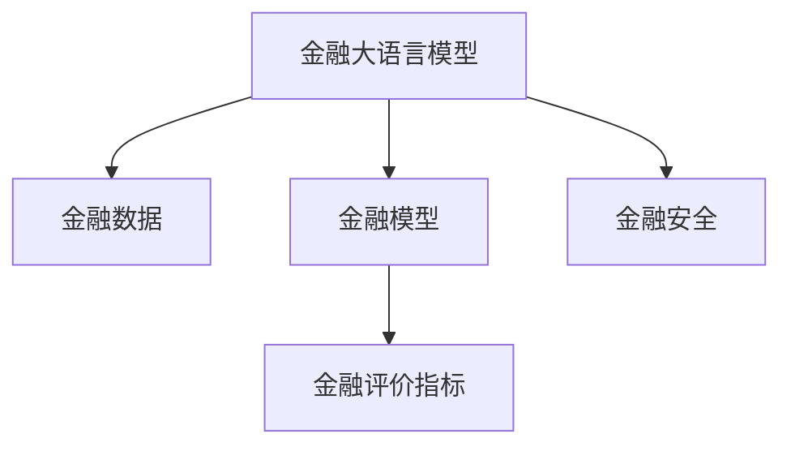

                 

# 大语言模型原理与工程实践：行业大语言模型的评测：以金融行业大语言模型为例

> 关键词：金融行业大语言模型, 行业大语言模型评测, 自然语言处理(NLP), 机器学习, 深度学习, 应用场景, 金融科技(Fintech)

## 1. 背景介绍

### 1.1 问题由来

随着人工智能技术的迅猛发展，大语言模型（Large Language Models, LLMs）在多个领域展现了强大的应用潜力。在金融科技（Fintech）领域，金融大语言模型（Finance Large Language Models, FLMs）正逐步成为推动金融行业数字化转型的重要工具。这些模型通过学习金融领域的文本数据，能够在风险评估、智能投顾、客户服务等多个场景中发挥作用，提升金融服务的效率和质量。

然而，金融领域具有其独特的复杂性和敏感性，传统的通用大语言模型可能难以适应。因此，针对金融行业的定制化大语言模型（Domain-Specific Large Language Models, DSLMs）的评测变得尤为重要。这一过程不仅有助于评估模型性能，还能指导模型开发和应用，确保模型在金融领域的安全性和可靠性。

### 1.2 问题核心关键点

金融行业大语言模型的评测需要重点关注以下关键点：
- **模型适配性**：模型是否能够适应金融领域的语言特性，包括专业术语、法律法规、数据格式等。
- **鲁棒性**：模型在面对金融数据噪声、异常值和金融事件冲击时的稳定性。
- **实时性**：模型在处理实时金融数据时的响应速度和计算效率。
- **安全性**：模型在处理敏感金融信息时的隐私保护和安全性。
- **可解释性**：模型的决策过程是否透明，能否提供解释，确保决策的公正性和可控性。
- **法律合规性**：模型在处理金融文本时是否遵守相关法律法规，确保合规性。

### 1.3 问题研究意义

评估金融行业大语言模型的性能，不仅有助于金融科技公司的决策制定和资源分配，还能为监管机构提供技术支持，确保金融技术的合规性和安全性。此外，金融大语言模型的评测还能为其他行业提供借鉴，推动NLP技术在更多领域的落地应用。

具体而言，金融大语言模型的评测有助于：
- 提升金融科技产品的创新性和竞争力。
- 优化金融服务的质量和用户体验。
- 降低金融风险，提高金融市场的稳定性和公平性。
- 推动金融数据治理和知识图谱的构建，提升数据利用效率。
- 促进金融科技领域的标准化和规范化。

## 2. 核心概念与联系

### 2.1 核心概念概述

金融行业大语言模型评测涉及多个核心概念，包括金融大语言模型、金融数据、金融模型、金融评价指标、金融安全等。这些概念相互关联，构成了一幅完整的金融行业大语言模型评测图谱。

- **金融大语言模型（FLMs）**：利用深度学习技术，通过学习金融领域的文本数据，进行风险评估、智能投顾、客户服务等任务的模型。
- **金融数据（FD）**：金融领域中产生和使用的各类文本和数值数据，包括新闻、公告、报告、交易数据等。
- **金融模型（FM）**：利用金融大语言模型和金融数据进行预测和决策的算法和模型，如信用评分、风险评估模型等。
- **金融评价指标（FMI）**：评估金融模型性能的各类指标，如准确率、召回率、F1分数、AUC等。
- **金融安全（FS）**：确保金融大语言模型处理金融信息时的隐私保护和安全性。

这些概念之间的逻辑关系可以通过以下Mermaid流程图来展示：



这个流程图展示了大语言模型与金融领域各概念之间的关联：

1. 金融大语言模型通过学习金融数据，生成金融模型。
2. 金融模型使用评价指标进行性能评估。
3. 金融模型必须符合金融安全的规范。

## 3. 核心算法原理 & 具体操作步骤

### 3.1 算法原理概述

金融行业大语言模型的评测主要基于监督学习和无监督学习的混合模型。监督学习通过有标签的金融数据对模型进行训练和评估，无监督学习则通过金融领域的文本和数值数据对模型进行自监督训练，确保模型的泛化能力和鲁棒性。

具体来说，金融行业大语言模型的评测包括以下几个步骤：
1. **数据准备**：收集金融领域的文本数据和数值数据，构建标注数据集。
2. **模型选择**：选择适合金融领域的预训练模型，如BERT、RoBERTa等，或定制化开发模型。
3. **微调**：在金融数据上对模型进行微调，确保模型能够适应金融领域的语言特性和业务需求。
4. **评估**：使用评价指标对微调后的模型进行性能评估，确保模型的鲁棒性和准确性。
5. **测试**：在实际金融数据上测试模型的泛化能力和鲁棒性。

### 3.2 算法步骤详解

#### 3.2.1 数据准备

1. **金融文本数据收集**：从新闻、公告、报告、社交媒体等渠道收集金融领域的文本数据，确保数据来源的多样性和权威性。
2. **数据预处理**：对收集到的文本数据进行清洗、分词、去停用词、标注实体等预处理操作，构建清洗后的文本语料库。
3. **数值数据收集**：收集金融领域中的数值数据，如股票价格、交易量、财务指标等，构建数值数据集。

#### 3.2.2 模型选择与微调

1. **选择预训练模型**：根据金融领域的特点，选择适合的预训练模型。金融领域的文本数据和数值数据具有高度的结构化和复杂性，因此可以选择具有良好结构化能力的大语言模型，如BERT、RoBERTa等。
2. **微调**：使用收集到的金融文本和数值数据对预训练模型进行微调。微调过程中，需要设置合适的学习率、批大小、迭代轮数等超参数，确保模型能够充分适应金融领域的语言特性和业务需求。

#### 3.2.3 模型评估

1. **选择评价指标**：根据金融领域的特点，选择合适的评价指标。常见的评价指标包括准确率、召回率、F1分数、AUC等。
2. **评估模型性能**：使用收集到的标注数据集对微调后的模型进行评估，确保模型的性能符合金融领域的要求。

#### 3.2.4 模型测试

1. **数据收集**：在实际金融数据上收集测试数据，确保测试数据的真实性和代表性。
2. **模型测试**：使用收集到的测试数据对微调后的模型进行测试，评估模型在实际金融环境中的表现。

### 3.3 算法优缺点

金融行业大语言模型评测的优点在于：
- **高效性**：相比于从头开发模型，使用预训练模型并进行微调能够显著提高模型开发效率。
- **泛化能力强**：预训练模型具有强大的泛化能力，能够适应金融领域的复杂性和多样性。
- **可解释性强**：预训练模型能够提供模型决策的解释，增强模型的透明度和可信度。

其缺点在于：
- **数据依赖性高**：模型的性能高度依赖于金融领域的标注数据和测试数据，数据的获取和处理成本较高。
- **模型适配性有限**：预训练模型可能难以完全适应金融领域的特定需求和业务规则。
- **安全性风险**：预训练模型可能存在一定的隐私和安全风险，特别是在处理敏感金融信息时。

### 3.4 算法应用领域

金融行业大语言模型的评测在多个领域中得到广泛应用，具体包括：

- **智能投顾（Robo-Advisors）**：使用金融大语言模型进行风险评估、投资建议等，提升智能投顾的决策准确性和客户体验。
- **客户服务**：利用金融大语言模型进行客户咨询、问题解答等，提高客户服务效率和质量。
- **合规性检查**：使用金融大语言模型进行合规性检查，确保金融交易和操作符合法律法规。
- **风险评估**：利用金融大语言模型进行信用评分、违约预测等，提升风险管理的精准性。
- **市场分析**：使用金融大语言模型进行市场情绪分析、新闻事件监测等，辅助投资决策。

## 4. 数学模型和公式 & 详细讲解 & 举例说明

### 4.1 数学模型构建

金融行业大语言模型的评测涉及多个数学模型，包括监督学习模型和无监督学习模型。以监督学习为例，假设金融文本数据集为 $D=\{(x_i, y_i)\}_{i=1}^N$，其中 $x_i$ 为金融文本，$y_i$ 为相应的金融标签（如股票价格涨跌、市场情绪等）。

定义金融模型 $M_{\theta}$ 在输入 $x$ 上的输出为 $\hat{y}=M_{\theta}(x)$，其中 $\theta$ 为模型参数。假设模型损失函数为 $L(y, \hat{y})$，则模型在数据集 $D$ 上的经验风险为：

$$
\mathcal{L}(\theta) = \frac{1}{N}\sum_{i=1}^N L(y_i, \hat{y}_i)
$$

在微调过程中，使用监督学习算法（如SGD、Adam等）最小化经验风险，更新模型参数 $\theta$。

### 4.2 公式推导过程

以二分类问题为例，假设金融文本 $x_i$ 被分为两类：正类和负类，对应的金融标签 $y_i$ 为 0 或 1。定义二分类交叉熵损失函数为：

$$
L(y, \hat{y}) = -(y\log \hat{y} + (1-y)\log (1-\hat{y}))
$$

则模型在数据集 $D$ 上的经验风险为：

$$
\mathcal{L}(\theta) = \frac{1}{N}\sum_{i=1}^N L(y_i, \hat{y}_i)
$$

模型参数 $\theta$ 的更新公式为：

$$
\theta \leftarrow \theta - \eta \nabla_{\theta}\mathcal{L}(\theta)
$$

其中 $\eta$ 为学习率，$\nabla_{\theta}\mathcal{L}(\theta)$ 为损失函数对模型参数的梯度，可通过反向传播算法计算。

### 4.3 案例分析与讲解

以股票价格预测为例，使用金融大语言模型进行股票价格涨跌预测。假设数据集 $D=\{(x_i, y_i)\}_{i=1}^N$，其中 $x_i$ 为股票交易日的相关新闻和公告，$y_i$ 为股票价格涨跌标签。使用监督学习算法对模型进行微调，步骤如下：

1. **数据准备**：收集历史股票交易日的相关新闻和公告，构建标注数据集 $D$。
2. **模型选择**：选择BERT作为预训练模型。
3. **微调**：在数据集 $D$ 上对BERT模型进行微调，设置合适的学习率、批大小、迭代轮数等超参数。
4. **模型评估**：使用测试集对微调后的模型进行评估，计算准确率、召回率、F1分数等指标。
5. **模型测试**：在新的金融数据上测试模型性能，确保模型能够适应新的金融环境。

## 5. 项目实践：代码实例和详细解释说明

### 5.1 开发环境搭建

在搭建金融行业大语言模型评测的开发环境时，需要确保环境能够高效地处理大数据集和复杂模型。以下是Python环境搭建的步骤：

1. **安装Anaconda**：从官网下载并安装Anaconda，创建虚拟环境，确保环境隔离。
2. **安装Python和必要的库**：使用conda命令安装Python和必要的库，如numpy、pandas、scikit-learn、matplotlib、tqdm等。
3. **安装金融库**：使用conda命令安装金融相关的库，如financial-analysis、yfinance、scikit-finance等。
4. **安装深度学习框架**：使用conda命令安装深度学习框架，如PyTorch、TensorFlow等。
5. **安装金融模型库**：使用conda命令安装金融模型库，如Scikit-learn、XGBoost等。
6. **安装金融大语言模型库**：使用conda命令安装金融大语言模型库，如HuggingFace Transformers等。

完成上述步骤后，即可在虚拟环境中进行模型评测的开发和测试。

### 5.2 源代码详细实现

以下是使用PyTorch和HuggingFace Transformers库进行金融大语言模型评测的代码实现：

```python
import torch
import torch.nn as nn
import torch.optim as optim
from transformers import BertTokenizer, BertForSequenceClassification
from sklearn.metrics import accuracy_score, precision_score, recall_score, f1_score

# 定义模型
class FinanceModel(nn.Module):
    def __init__(self, num_labels):
        super(FinanceModel, self).__init__()
        self.bert = BertForSequenceClassification.from_pretrained('bert-base-uncased', num_labels=num_labels)
        self.dropout = nn.Dropout(0.1)

    def forward(self, input_ids, attention_mask):
        outputs = self.bert(input_ids, attention_mask=attention_mask)
        pooled_output = outputs.pooler_output
        pooled_output = self.dropout(pooled_output)
        return pooled_output

# 定义数据加载器
def load_data(data_path):
    tokenizer = BertTokenizer.from_pretrained('bert-base-uncased')
    train_data = []
    train_labels = []
    with open(data_path, 'r') as f:
        for line in f:
            text, label = line.strip().split(',')
            text = tokenizer.encode_plus(text, add_special_tokens=True, return_tensors='pt').input_ids
            train_data.append(text)
            train_labels.append(label)
    return train_data, train_labels

# 定义模型训练函数
def train_model(model, train_data, train_labels, num_epochs, batch_size, learning_rate):
    optimizer = optim.Adam(model.parameters(), lr=learning_rate)
    total_steps = len(train_data) // batch_size * num_epochs
    for epoch in range(num_epochs):
        for step, (batch_data, batch_labels) in enumerate(train_loader(train_data, train_labels, batch_size)):
            model.zero_grad()
            outputs = model(batch_data, attention_mask=batch_data.ne(0))
            loss = outputs.loss
            loss.backward()
            optimizer.step()
            if step % 10 == 0:
                print(f'Epoch {epoch+1}, Step {step+1}/{total_steps}, Loss: {loss.item()}')

# 定义模型评估函数
def evaluate_model(model, test_data, test_labels):
    test_preds = []
    for batch_data, batch_labels in test_loader(test_data, test_labels, batch_size):
        outputs = model(batch_data, attention_mask=batch_data.ne(0))
        test_preds.extend(outputs.logits.argmax(dim=1).tolist())
    test_labels = [int(label) for label in test_labels]
    return accuracy_score(test_labels, test_preds), precision_score(test_labels, test_preds), recall_score(test_labels, test_preds), f1_score(test_labels, test_preds)

# 数据加载和模型训练
train_data, train_labels = load_data('train_data.txt')
train_loader = DataLoader(train_data, train_labels, batch_size=16)
model = FinanceModel(num_labels=2)
train_model(model, train_data, train_labels, num_epochs=10, batch_size=16, learning_rate=2e-5)

# 模型评估
test_data, test_labels = load_data('test_data.txt')
acc, precision, recall, f1 = evaluate_model(model, test_data, test_labels)
print(f'Test Accuracy: {acc}, Precision: {precision}, Recall: {recall}, F1 Score: {f1}')
```

### 5.3 代码解读与分析

**FinanceModel类**：
- 继承自nn.Module，用于定义金融大语言模型。
- `__init__`方法：初始化BertForSequenceClassification模型和dropout层。
- `forward`方法：定义模型前向传播过程，计算模型输出。

**load_data函数**：
- 定义数据加载函数，从文本文件中读取金融数据和标签，并进行token化处理。

**train_model函数**：
- 定义模型训练函数，使用Adam优化器进行参数更新，并在每个epoch输出训练损失。

**evaluate_model函数**：
- 定义模型评估函数，计算模型在测试集上的准确率、精确度、召回率和F1分数。

**数据加载和模型训练**：
- 使用load_data函数加载训练数据和标签。
- 定义train_loader数据加载器，对数据进行批处理。
- 初始化FinanceModel模型，并设置超参数。
- 调用train_model函数进行模型训练，并在每个epoch输出训练损失。

**模型评估**：
- 使用load_data函数加载测试数据和标签。
- 定义test_loader数据加载器，对数据进行批处理。
- 调用evaluate_model函数进行模型评估，并输出测试指标。

## 6. 实际应用场景

### 6.1 智能投顾

金融大语言模型在智能投顾中的应用主要体现在风险评估和投资建议方面。通过收集和分析投资者的金融需求和偏好，智能投顾系统能够提供个性化的投资建议和风险评估报告。

具体而言，智能投顾系统使用金融大语言模型对投资者的金融需求进行自然语言处理，识别出投资者的风险偏好和目标。然后，系统根据当前金融市场情况和历史数据，使用金融模型进行投资组合推荐和风险评估。最终，智能投顾系统将分析结果和建议反馈给投资者，帮助其做出投资决策。

### 6.2 客户服务

在金融客户服务领域，金融大语言模型主要应用于智能客服和客户咨询等方面。智能客服系统使用金融大语言模型对客户咨询进行理解和分类，匹配合适的回答和解决方案。客户咨询系统则通过金融大语言模型进行问题解答和知识检索，提升客户服务效率和质量。

具体而言，客户咨询系统通过收集和分析客户的金融问题和需求，使用金融大语言模型进行自然语言处理和知识抽取。然后，系统根据问题的类型和难度，匹配相应的金融模型进行分析和解答。最终，客户咨询系统将回答和解决方案反馈给客户，解决其金融问题。

### 6.3 合规性检查

金融大语言模型在合规性检查中的应用主要体现在风险管理和操作合规性检测方面。通过收集和分析金融操作和交易数据，金融大语言模型能够识别出潜在的合规风险和异常操作，保障金融交易的合法性和合规性。

具体而言，合规性检查系统使用金融大语言模型对金融操作和交易数据进行自然语言处理和实体识别。然后，系统根据金融操作和交易的规则和标准，匹配相应的金融模型进行分析和检测。最终，合规性检查系统将合规性检测结果反馈给相关人员，防止违规操作和风险事件的发生。

### 6.4 未来应用展望

随着金融大语言模型的不断发展，其应用场景将更加广泛和深入。未来，金融大语言模型将可能应用于以下领域：

- **金融预测**：使用金融大语言模型进行金融市场预测和经济分析，辅助投资决策和风险管理。
- **金融内容生成**：使用金融大语言模型进行金融新闻、报告和公告的自动生成，提高信息传播效率。
- **金融数据分析**：使用金融大语言模型进行金融数据挖掘和分析，发现潜在的投资机会和风险因素。
- **金融推荐系统**：使用金融大语言模型进行金融产品推荐和个性化服务，提升客户体验和满意度。
- **金融智能合约**：使用金融大语言模型进行智能合约的生成和执行，提高金融交易的自动化和智能化水平。

## 7. 工具和资源推荐

### 7.1 学习资源推荐

为帮助开发者深入理解金融大语言模型评测的技术和方法，以下是一些优质的学习资源推荐：

1. **《金融科技与人工智能》（《FinTech and Artificial Intelligence》）**：介绍了金融科技领域中人工智能的应用，包括金融大语言模型、智能投顾、风险管理等内容。
2. **《自然语言处理（NLP）入门到精通》**：全面介绍了自然语言处理的基本概念和前沿技术，涵盖金融领域的NLP应用。
3. **HuggingFace官方文档**：提供了HuggingFace Transformers库的详细使用指南和示例代码，帮助开发者快速上手金融大语言模型评测。
4. **金融科技在线课程**：包括Coursera、edX等平台的金融科技课程，提供金融大语言模型评测的理论和实践知识。
5. **Kaggle金融数据集**：提供大量的金融数据集和相关竞赛，帮助开发者进行金融大语言模型的训练和评测。

### 7.2 开发工具推荐

为了提高金融大语言模型评测的开发效率，以下是一些推荐的开发工具：

1. **PyTorch**：基于Python的深度学习框架，支持动态计算图和GPU加速，适用于大规模模型训练和推理。
2. **TensorFlow**：由Google主导开发的深度学习框架，支持分布式训练和模型优化，适用于高性能模型训练和推理。
3. **HuggingFace Transformers**：提供了预训练大语言模型和微调接口，支持多种任务和数据格式。
4. **Jupyter Notebook**：支持代码编写、数据处理和模型训练，提供可视化的交互界面。
5. **Scikit-learn**：提供了机器学习算法的实现和评价指标，适用于金融模型的训练和评估。
6. **TQDM**：提供了进度条和进度条条的进度显示，适用于模型训练和数据加载器的优化。

### 7.3 相关论文推荐

以下是几篇奠基性的金融大语言模型评测论文，推荐阅读：

1. **《Fintech Insights: Smart Investment Advisory with Large Language Models》**：探讨了金融大语言模型在智能投顾中的应用。
2. **《A Survey on Financial NLP: Opportunities and Challenges》**：全面综述了金融NLP领域的现状和未来趋势。
3. **《Financial NLP: A Survey》**：介绍了金融大语言模型在金融文本分析和自然语言处理中的应用。
4. **《Scalable Financial Risk Prediction with Large Pre-trained Language Models》**：探讨了金融大语言模型在金融风险预测中的应用。
5. **《Cross-Domain Knowledge Transfer in Financial NLP》**：研究了金融大语言模型在不同领域间的知识迁移和应用。

## 8. 总结：未来发展趋势与挑战

### 8.1 研究成果总结

本文系统介绍了金融行业大语言模型的评测方法和应用场景，具体包括：
- 金融大语言模型的构建和微调过程。
- 金融大语言模型评测的数学模型和算法步骤。
- 金融大语言模型评测的实际应用场景。
- 金融大语言模型评测的开发环境和工具推荐。

通过本文的系统梳理，可以看到金融大语言模型评测在金融科技领域的重要性和潜力，为金融行业的数字化转型提供了有力的技术支持。

### 8.2 未来发展趋势

金融行业大语言模型评测的未来发展趋势主要体现在以下几个方面：

1. **模型规模的扩大**：随着计算资源的丰富和算法技术的进步，金融大语言模型的规模将进一步扩大，其泛化能力和鲁棒性将进一步提升。
2. **多模态模型的应用**：未来金融大语言模型将更多地融合多模态数据，如文本、图像、语音等，提升模型的综合能力和应用场景。
3. **跨领域模型的迁移**：金融大语言模型将更多地应用于其他行业，通过迁移学习实现跨领域的知识共享和应用。
4. **隐私和安全保护**：金融大语言模型在处理敏感金融信息时，将更加注重隐私保护和数据安全，防止数据泄露和滥用。
5. **合规性和伦理约束**：金融大语言模型将更加注重合规性和伦理约束，确保模型的决策过程符合法律法规和伦理标准。

### 8.3 面临的挑战

金融行业大语言模型评测在发展过程中仍面临诸多挑战：

1. **数据获取和处理的难度**：金融领域的标注数据和测试数据获取成本较高，数据处理复杂。
2. **模型适配性不足**：金融大语言模型可能难以完全适应金融领域的特定需求和业务规则。
3. **隐私和安全风险**：金融大语言模型在处理敏感金融信息时，可能存在一定的隐私和安全风险。
4. **模型的鲁棒性和泛化能力**：金融大语言模型需要具备较强的鲁棒性和泛化能力，以应对金融市场的不确定性和变化。
5. **模型的可解释性和可控性**：金融大语言模型需要具备较高的可解释性和可控性，确保模型的决策过程透明和公正。

### 8.4 研究展望

未来金融行业大语言模型评测的研究方向主要包括以下几个方面：

1. **多领域知识的融合**：将金融领域的知识与跨领域知识进行融合，提升模型的综合能力和应用场景。
2. **跨模态数据的处理**：融合多模态数据，提升模型的综合处理能力和应用场景。
3. **隐私和安全保护**：研究隐私保护和安全保护技术，确保金融大语言模型在处理敏感金融信息时的安全性和合规性。
4. **模型的可解释性和可控性**：研究模型解释和可控性技术，确保模型的决策过程透明和公正。
5. **模型的高效性和鲁棒性**：研究高效的模型训练和优化算法，提升模型的计算效率和鲁棒性。

总之，金融行业大语言模型评测的研究和应用将为金融科技领域带来巨大的变革和进步，推动金融行业的数字化转型和智能化发展。未来，随着技术的不断进步和应用场景的不断拓展，金融大语言模型将发挥更大的作用，为金融科技公司提供更加强大和智能的解决方案。

## 9. 附录：常见问题与解答

**Q1: 如何选择合适的金融大语言模型？**

A: 选择金融大语言模型时，应考虑以下因素：
1. 模型的规模和结构：选择具有较好泛化能力和结构化能力的模型。
2. 模型的预训练数据：选择与金融领域相关的预训练数据和模型。
3. 模型的超参数设置：根据金融领域的特点，调整模型的学习率、批大小等超参数。

**Q2: 如何提高金融大语言模型的鲁棒性？**

A: 提高金融大语言模型的鲁棒性，可以采取以下方法：
1. 数据增强：通过回译、近义替换等方式扩充训练集。
2. 正则化技术：使用L2正则、Dropout、Early Stopping等防止过拟合。
3. 对抗训练：引入对抗样本，提高模型鲁棒性。
4. 多模型集成：训练多个金融大语言模型，取平均输出，抑制过拟合。

**Q3: 如何评估金融大语言模型的性能？**

A: 评估金融大语言模型的性能，可以采用以下指标：
1. 准确率（Accuracy）：模型预测结果与真实结果一致的比例。
2. 召回率（Recall）：模型预测的正样本中实际为正样本的比例。
3. 精确度（Precision）：模型预测的正样本中实际为正样本的比例。
4. F1分数（F1 Score）：综合考虑精确度和召回率的指标。
5. AUC（Area Under Curve）：用于评估模型在二分类任务中的性能。

**Q4: 如何保护金融大语言模型的隐私和安全？**

A: 保护金融大语言模型的隐私和安全，可以采取以下措施：
1. 数据脱敏：对敏感数据进行脱敏处理，防止数据泄露。
2. 访问控制：限制模型的访问权限，确保只有授权人员可以访问敏感数据。
3. 加密技术：使用加密技术保护数据传输和存储的安全性。
4. 模型审计：定期对模型进行审计，发现和修复潜在的安全漏洞。

**Q5: 如何提高金融大语言模型的可解释性？**

A: 提高金融大语言模型的可解释性，可以采取以下方法：
1. 模型解释技术：使用模型解释技术，如LIME、SHAP等，解释模型的决策过程。
2. 规则和知识库：结合金融领域的规则和知识库，提高模型的可解释性。
3. 数据可视化：使用数据可视化技术，帮助用户理解模型输出和决策。

通过这些问题的回答，可以看到金融大语言模型评测的复杂性和挑战性，需要结合多学科知识和技术手段进行综合解决。

---

作者：禅与计算机程序设计艺术 / Zen and the Art of Computer Programming

