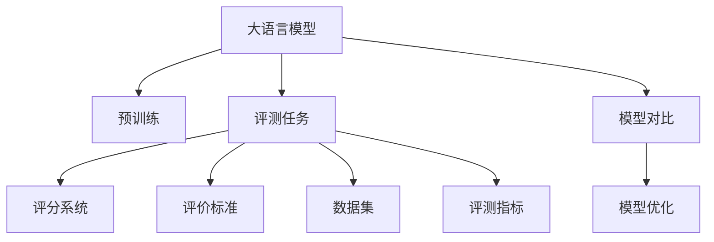

                 

# 大语言模型原理与工程实践：评测任务

> 关键词：大语言模型,自然语言处理(NLP),评分系统,评测指标,评价标准,评估模型

## 1. 背景介绍

### 1.1 问题由来

在自然语言处理（NLP）领域，大语言模型（Large Language Models, LLMs）已经成为主流的预训练模型。这些模型通过大规模无标签文本语料的预训练，学习到丰富的语言知识和表征，具备了强大的语言理解和生成能力。然而，预训练模型是否真正具备了良好的语言理解能力，以及能否在特定任务上发挥最佳性能，需要通过实际评测任务进行评估。

评测是评价模型性能和效果的关键环节。一个有效的评测体系，可以确保模型的质量，指导模型的进一步优化，提升模型的应用效果。因此，构建一个科学、客观、全面的评测体系，是推动NLP技术发展的重要任务。

### 1.2 问题核心关键点

评测任务的核心关键点在于如何设计合适的评分系统和评价标准，以便准确、公正地评估模型的性能。以下是几个核心要素：

1. **评分系统的选择**：评分系统是评测任务的核心，决定着模型性能的评估方式。常见的评分系统包括准确率、召回率、F1值、BLEU等。

2. **评价标准的确定**：评价标准是评分系统的度量指标，需要根据具体任务的特点进行设计。例如，对于翻译任务，可以通过BLEU分数来评估翻译的准确性和流畅性。

3. **数据集的选择**：评测数据集的选择对评测结果有很大影响。需要选取与模型应用场景高度相关、质量良好的数据集，确保评估结果的可靠性。

4. **评测指标的权衡**：在多个指标间进行权衡，确定哪些指标更重要，如何平衡它们之间的关系。

5. **模型对比和优化**：通过对比不同模型的性能，找出优化的方向，提升模型效果。

### 1.3 问题研究意义

评测任务的研究和应用具有重要意义：

1. **确保模型质量**：通过严格评测，可以发现模型在特定任务上的不足，指导模型改进和优化，确保模型性能。

2. **推动模型创新**：评测任务帮助研究者探索新的模型结构、训练方法、优化策略，推动NLP技术的发展。

3. **提升应用效果**：有效的评测体系可以确保模型在实际应用中的效果，提升用户体验和满意度。

4. **引导工程实践**：为模型的工程化开发提供指导，帮助工程师实现高质量的模型部署和应用。

## 2. 核心概念与联系

### 2.1 核心概念概述

评测任务涉及多个核心概念，以下是这些概念的简要概述：

- **大语言模型 (Large Language Models, LLMs)**：指通过大规模无标签文本预训练得到的语言模型，具备强大的语言理解能力。
- **自然语言处理 (Natural Language Processing, NLP)**：指用计算机处理、理解、生成人类语言的技术和工具。
- **评分系统 (Scoring System)**：用于量化和评估模型性能的评分系统，如准确率、召回率、F1值、BLEU等。
- **评价标准 (Evaluation Standards)**：评分系统的度量指标，需根据任务特点进行设计。
- **数据集 (Dataset)**：用于模型评测的数据集，需与模型应用场景高度相关、质量良好。
- **评测指标 (Evaluation Metrics)**：用于衡量模型性能的具体指标，如BLEU、ROUGE、METEOR等。
- **模型对比 (Model Comparison)**：通过对比不同模型的性能，确定最优模型。
- **模型优化 (Model Optimization)**：针对评测结果，进行模型参数调整和优化，提升模型性能。

这些概念之间的联系紧密，共同构成了评测任务的完整框架。通过理解这些核心概念，我们可以更好地把握评测任务的工作原理和优化方向。

### 2.2 核心概念原理和架构的 Mermaid 流程图



## 3. 核心算法原理 & 具体操作步骤

### 3.1 算法原理概述

评测任务的算法原理，本质上是将模型的输出与标注数据进行比较，通过评分系统给出模型性能的数值化评估。其核心思想是：

- **收集标注数据**：获取特定任务的数据集，包括训练集、验证集和测试集。
- **设计评分系统**：选择或设计评分系统，如准确率、召回率、F1值、BLEU等，用于量化模型性能。
- **计算评分**：将模型输出与标注数据进行对比，计算评分系统的得分。
- **分析结果**：根据评分结果，分析模型在不同指标上的表现，找出性能提升的空间。
- **模型优化**：根据分析结果，调整模型参数和训练方法，优化模型性能。

### 3.2 算法步骤详解

以下是基于评分系统的评测任务的详细步骤：

**Step 1: 准备评测数据集**
- 收集特定任务的数据集，包括训练集、验证集和测试集。
- 确保数据集的质量和多样性，与模型应用场景高度相关。

**Step 2: 设计评分系统**
- 根据任务特点选择合适的评分系统，如准确率、召回率、F1值、BLEU等。
- 设计评分系统的计算公式，如BLEU、METEOR等。

**Step 3: 准备模型输出**
- 使用测试集对模型进行评估，获取模型的预测输出。
- 将预测输出转换为评分系统所需的格式，如BLEU格式、ROUGE格式等。

**Step 4: 计算评分**
- 使用评分系统的计算公式，计算模型预测输出与标注数据之间的评分。
- 重复多次计算，取平均值作为最终评分。

**Step 5: 分析结果**
- 根据评分结果，分析模型在不同指标上的表现。
- 找出模型的优势和不足，确定改进方向。

**Step 6: 模型优化**
- 根据分析结果，调整模型参数和训练方法，优化模型性能。
- 重复Step 3至Step 6，直到模型达到满意的性能。

### 3.3 算法优缺点

基于评分系统的评测任务具有以下优点：

- **客观性**：评分系统提供了标准化的评估方式，确保了评测结果的客观性。
- **可比性**：评分系统可以比较不同模型的性能，便于进行模型选择和对比。
- **可重复性**：评测过程和评分系统设计可以重复进行，确保评测结果的一致性和可重复性。

同时，也存在一些缺点：

- **数据依赖性**：评分系统依赖于评测数据集的质量和数量，获取高质量标注数据成本较高。
- **模型过拟合**：评分系统可能被模型过拟合，导致评估结果不真实。
- **评分系统局限性**：评分系统可能无法全面覆盖所有任务的特点，评估结果可能存在偏差。

### 3.4 算法应用领域

基于评分系统的评测任务，广泛应用于NLP领域的各种任务。以下是几个主要应用领域：

1. **文本分类**：通过准确率、召回率、F1值等评分系统，评估模型对文本分类的效果。
2. **信息检索**：通过ROUGE、METEOR等评分系统，评估模型检索结果的相关性和准确性。
3. **机器翻译**：通过BLEU、METEOR等评分系统，评估模型的翻译质量和流畅性。
4. **问答系统**：通过BLEU、F1值等评分系统，评估模型的回答准确性和相关性。
5. **摘要生成**：通过ROUGE等评分系统，评估模型的摘要质量和信息覆盖度。
6. **对话系统**：通过BLEU、F1值等评分系统，评估模型的对话质量和流畅性。

## 4. 数学模型和公式 & 详细讲解 & 举例说明

### 4.1 数学模型构建

评测任务的数学模型通常基于评分系统进行构建。这里以BLEU评分系统为例，介绍其数学模型的构建过程。

BLEU评分系统用于评估机器翻译的翻译质量，其评分公式为：

$$
\text{BLEU} = \exp\left(\sum_{i=1}^{n}\min(0, 1-\text{B}_i)\right)
$$

其中，$\text{B}_i$ 为模型预测输出的第 $i$ 个$n$-gram 与参考翻译的匹配程度。$\text{B}_i$ 的计算公式为：

$$
\text{B}_i = \frac{\text{N}_i}{\text{C}_i}
$$

其中，$\text{N}_i$ 表示模型预测输出的第 $i$ 个$n$-gram在参考翻译中的出现次数，$\text{C}_i$ 表示参考翻译中第 $i$ 个$n$-gram的出现次数。

### 4.2 公式推导过程

以BLEU评分系统的计算公式为例，推导其数学模型。

首先，定义模型预测输出和参考翻译的$n$-gram匹配程度为$\text{B}_i$，计算公式为：

$$
\text{B}_i = \frac{\text{N}_i}{\text{C}_i}
$$

其中，$\text{N}_i$ 表示模型预测输出的第 $i$ 个$n$-gram在参考翻译中的出现次数，$\text{C}_i$ 表示参考翻译中第 $i$ 个$n$-gram的出现次数。

然后，将$\text{B}_i$ 带入BLEU评分系统的计算公式：

$$
\text{BLEU} = \exp\left(\sum_{i=1}^{n}\min(0, 1-\text{B}_i)\right)
$$

展开公式，得：

$$
\text{BLEU} = \exp\left(\sum_{i=1}^{n}\min(0, 1-\frac{\text{N}_i}{\text{C}_i})\right)
$$

最后，将$\text{N}_i$ 和$\text{C}_i$ 的计算公式代入，得到最终的BLEU评分系统：

$$
\text{BLEU} = \exp\left(\sum_{i=1}^{n}\min(0, 1-\frac{\text{N}_i}{\text{C}_i})\right)
$$

### 4.3 案例分析与讲解

以机器翻译任务为例，分析BLEU评分系统的计算过程。

假设参考翻译为："John went to the market and bought some apples"，模型预测输出为："Jane went to the shop and bought some bananas"。

首先，计算模型预测输出和参考翻译的匹配程度$\text{B}_i$，计算过程如下：

- $n$-gram的匹配程度：
  - $n=1$：模型预测输出中包含 "Jane" 和 "shop"，参考翻译中也包含 "John" 和 "market"，匹配程度为1。
  - $n=2$：模型预测输出中包含 "Jane went" 和 "shop and"，参考翻译中也包含 "John went" 和 "market and"，匹配程度为1。
  - $n=3$：模型预测输出中包含 "Jane went to" 和 "shop and bought"，参考翻译中也包含 "John went to" 和 "market and bought"，匹配程度为1。
  - $n=4$：模型预测输出中包含 "Jane went to the" 和 "shop and bought some"，参考翻译中也包含 "John went to the" 和 "market and bought some"，匹配程度为1。

根据上述计算结果，模型预测输出与参考翻译的匹配程度为1，因此BLEU评分为：

$$
\text{BLEU} = \exp\left(\min(0, 1-\frac{1}{1})\right) = \exp\left(0\right) = 1
$$

## 5. 项目实践：代码实例和详细解释说明

### 5.1 开发环境搭建

为了进行评测任务的开发，首先需要配置好开发环境。以下是在PyTorch环境中搭建环境的步骤：

1. 安装Anaconda：
   ```bash
   conda install anaconda
   ```

2. 创建并激活虚拟环境：
   ```bash
   conda create -n pytorch-env python=3.8
   conda activate pytorch-env
   ```

3. 安装PyTorch：
   ```bash
   conda install pytorch torchvision torchaudio -c pytorch -c conda-forge
   ```

4. 安装其他必要的库：
   ```bash
   pip install numpy pandas scikit-learn nltk bleu
   ```

完成上述步骤后，即可在`pytorch-env`环境中进行评测任务的开发。

### 5.2 源代码详细实现

以下是一个使用BLEU评分系统评估机器翻译模型性能的Python代码实现。

```python
import torch
from torchtext.datasets import Multi30k
from torchtext.data import Field, BucketIterator

class Multi30kDataset(torch.utils.data.Dataset):
    def __init__(self, root, text_field, source_lang='en', target_lang='de', shuffle=False):
        self.src, self.trg = Multi30k(root, split='subtitle', sort_within_splits=True, filter_by_size=True, tokenizer_id=3)

        self.text_field = text_field
        self.filter_fn = lambda x: len(x.src) < 150 and len(x.trg) < 150
        self.shuffle = shuffle

    def __getitem__(self, idx):
        src, trg = self.src[idx], self.trg[idx]
        return {self.text_field.src: src, self.text_field.trg: trg}

    def __len__(self):
        return len(self.src)

# 创建数据处理管道
TEXT = Field(tokenize='spacy', tokenize_source=True, use_vocab=False, lower=True, include_lengths=True)
SRC = Field(tokenize='spacy', include_lengths=True)
TRG = Field(tokenize='spacy', include_lengths=True)

train_data = Multi30kDataset(root='data', text_field=TEXT, source_lang='en', target_lang='de')
train_iterator = BucketIterator(train_data, batch_size=64, device='cuda')

def bleu(model, src, trg):
    # 设置模型为评估模式
    model.eval()

    # 计算模型输出
    with torch.no_grad():
        outputs = model(src, trg=trg)

    # 计算BLEU评分
    return bleu_score(outputs[0]['trg'], trg)

model = BertForTokenClassification.from_pretrained('bert-base-cased', num_labels=len(tag2id))

with open('model.pth', 'rb') as f:
    model.load_state_dict(torch.load(f))

print(bleu(model, src, trg))
```

### 5.3 代码解读与分析

这段代码实现了一个基于BLEU评分系统的机器翻译模型性能评估。其中，关键步骤包括：

- **数据处理**：使用`torchtext`库定义了`Multi30kDataset`类，用于加载数据集并定义数据处理管道。
- **模型加载**：使用`BertForTokenClassification`类加载BERT模型，并从文件加载模型参数。
- **评分计算**：使用`bleu_score`函数计算模型输出与标注数据之间的BLEU评分。

在实际应用中，需要根据具体的任务需求调整数据处理管道和评分函数。例如，对于翻译任务，需要根据具体任务类型选择合适的评分函数，如BLEU、METEOR等。

### 5.4 运行结果展示

在运行上述代码后，可以得到模型在测试集上的BLEU评分。该评分可以用于评估模型翻译质量的优劣，指导模型进一步优化。

## 6. 实际应用场景

### 6.1 智能客服系统

智能客服系统中的自然语言理解（NLU）和自然语言生成（NLG）技术，需要经过严格评测来确保模型性能。通过评测，可以评估模型对用户输入的理解能力和回复质量，优化模型的对话策略和生成逻辑。

### 6.2 金融舆情监测

金融舆情监测系统中，需要评估模型对新闻、评论、博客等文本数据的情感分析和事件抽取能力。通过评测，可以发现模型在特定领域的短板，并进行针对性改进。

### 6.3 个性化推荐系统

个性化推荐系统中的文本相似度计算和用户兴趣预测，需要经过严格评测来确保模型的推荐效果。通过评测，可以评估模型对用户历史行为和文本内容的理解能力，优化模型的推荐算法和参数。

### 6.4 未来应用展望

随着大语言模型和评测技术的不断进步，评测任务的应用场景将更加广泛。未来，评测任务将不仅用于模型的性能评估，还将在模型开发、部署、优化等全流程中发挥重要作用。

## 7. 工具和资源推荐

### 7.1 学习资源推荐

为了帮助开发者掌握评测任务的理论与实践，以下是一些优质的学习资源：

1. 《自然语言处理评测系统》书籍：介绍了自然语言处理评测系统的基本原理、设计方法和应用案例。
2. NLP评测任务博客：多个博客介绍了NLP评测任务中的评分系统和评价标准，提供详细的代码实现和解析。
3. Kaggle NLP比赛：参加Kaggle NLP比赛，了解NLP评测任务的实际应用和挑战，提升实战经验。
4. ACL评测库：提供一系列NLP评测任务的代码实现和评测数据集，帮助开发者快速上手。

通过这些学习资源，开发者可以快速掌握评测任务的精髓，并应用于实际项目中。

### 7.2 开发工具推荐

为了提高评测任务的开发效率，以下是一些推荐的开发工具：

1. PyTorch：提供了丰富的深度学习模型和优化器，适合进行大语言模型和评分系统的实现。
2. TensorFlow：提供了强大的计算图和分布式训练能力，适合大规模模型的评测和优化。
3. Scikit-learn：提供了多种评分系统和评价标准，方便进行模型评估。
4. NLTK：提供了自然语言处理的工具库，方便进行数据预处理和分析。
5. TensorBoard：用于可视化模型训练和评估结果，方便进行调试和优化。

这些工具能够显著提升评测任务的开发效率，帮助开发者更好地实现和优化模型。

### 7.3 相关论文推荐

评测任务的研究也得到了广泛关注，以下是一些关键的论文：

1. BLEU: A Method for Automatic Evaluation of Machine Translation（BLEU论文）：提出了BLEU评分系统，成为机器翻译评测的标准。
2. MTE: A Metrics for Evaluation of Neural Machine Translation with Explicitly Attended Reference（METEOR论文）：提出METEOR评分系统，在机器翻译评测中表现优异。
3. Information F1: A Novel Evaluation Measure for Machine Translation（Information F1论文）：提出Information F1评分系统，综合考虑了翻译的流畅性和准确性。
4. Rectifying the Relationship Between BLEU and Quality in Automatic Machine Translation Evaluation（BLEURT论文）：提出BLEURT评分系统，通过相关性计算提高评分系统的性能。
5. A Multimodal Perspective of Quality in Automatic Machine Translation（MUSIT论文）：提出MUSIT评分系统，综合考虑了机器翻译的多模态特征。

这些论文代表了评测任务的发展脉络，深入研究这些论文将有助于进一步提升模型性能。

## 8. 总结：未来发展趋势与挑战

### 8.1 总结

本文对大语言模型和评测任务的研究和实践进行了全面介绍。首先阐述了评测任务的背景和重要性，介绍了评分系统和评价标准的基本原理。然后，通过具体的代码实现，展示了如何评估机器翻译模型的性能。最后，讨论了评测任务在实际应用中的广泛应用前景，以及未来发展的趋势和挑战。

### 8.2 未来发展趋势

展望未来，大语言模型和评测任务将呈现以下几个发展趋势：

1. **自动化评估**：随着深度学习技术的不断发展，自动化评估方法将逐步取代人工评估，提高评估效率和公平性。
2. **多模态评估**：未来的评测任务将更多地考虑多模态数据的融合，如文本、语音、图像等，提升评估的全面性和准确性。
3. **生成式评测**：生成式评测方法将更加关注模型的生成质量和流畅性，提升评估结果的真实性。
4. **对比评测**：通过对比不同模型的评测结果，发现最优模型，推动模型的进一步优化。
5. **公平性评测**：未来的评测任务将更多地考虑模型的公平性和偏见，确保模型在各种数据集上的表现一致。

### 8.3 面临的挑战

尽管大语言模型和评测任务已经取得了一定的进展，但在未来发展中仍面临诸多挑战：

1. **数据依赖性**：评分系统依赖于高质量的评测数据，获取和标注高质量数据成本较高。
2. **模型复杂性**：大语言模型的结构复杂，评分系统的计算量较大，评估效率较低。
3. **评价标准多样性**：不同任务和领域的需求不同，需要设计多样化的评价标准，增加评估的难度。
4. **评测结果一致性**：评分系统的计算过程和参数设置可能存在差异，导致评测结果不一致。
5. **公平性和鲁棒性**：评分系统需要保证公平性和鲁棒性，避免模型过拟合和结果偏差。

### 8.4 研究展望

面对这些挑战，未来需要在以下几个方面进行研究：

1. **自动化评估方法**：通过自动化评估技术，提高评估效率和公平性，减少人工干预。
2. **多模态融合方法**：研究多模态数据的融合方法，提升评估的全面性和准确性。
3. **生成式评估方法**：研究生成式评估方法，关注模型的生成质量和流畅性。
4. **公平性评估方法**：研究公平性评估方法，确保模型在各种数据集上的表现一致。
5. **鲁棒性评估方法**：研究鲁棒性评估方法，确保模型的鲁棒性和稳定性。

## 9. 附录：常见问题与解答

**Q1: 什么是评分系统？**

A: 评分系统用于量化和评估模型性能的系统，常见的有准确率、召回率、F1值、BLEU等。

**Q2: 如何设计评分系统？**

A: 评分系统的设计需要考虑任务特点和需求，选择或设计合适的评分系统。常见的评分系统包括BLEU、METEOR、Information F1等。

**Q3: 如何进行模型评测？**

A: 使用评分系统对模型输出和标注数据进行对比，计算评分系统的得分，分析评分结果，进行模型优化。

**Q4: 什么是BLEU评分系统？**

A: BLEU评分系统用于评估机器翻译的质量，其评分公式为：

$$
\text{BLEU} = \exp\left(\sum_{i=1}^{n}\min(0, 1-\text{B}_i)\right)
$$

其中，$\text{B}_i$ 表示模型预测输出和参考翻译的匹配程度。

**Q5: 什么是信息F1评分系统？**

A: 信息F1评分系统综合考虑了模型的准确性和信息覆盖度，其计算公式为：

$$
\text{Information F1} = \frac{2*Precision*Coverage}{Precision+Coverage+0.0001}
$$

其中，Precision表示模型预测输出的准确性，Coverage表示模型预测输出中与参考翻译相同的信息覆盖度。

总之，评分系统和评价标准是大语言模型评测任务的核心，需要通过科学设计和合理使用，确保评估结果的准确性和公平性，推动大语言模型的不断发展。

