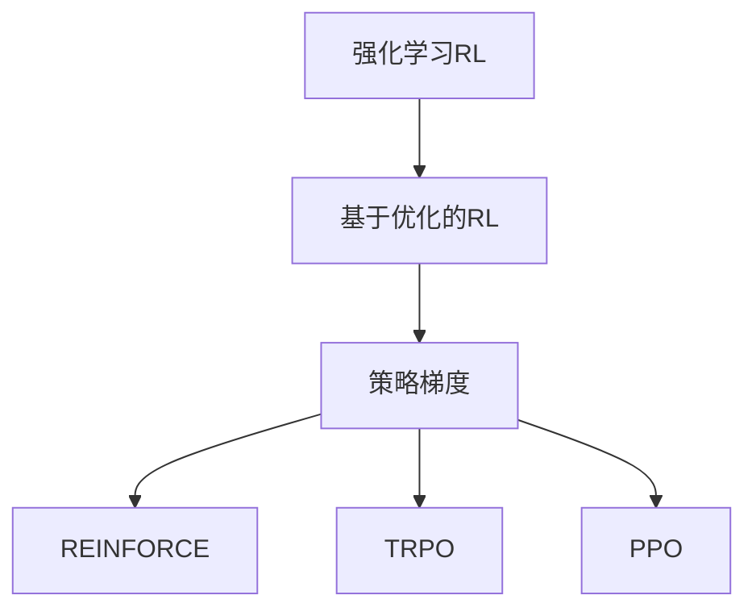

                 

# 大语言模型原理基础与前沿 REINFORCE、TRPO和PPO

> 关键词：大语言模型, REINFORCE, TRPO, PPO, 强化学习, 政策梯度, 基于优化的强化学习, 离散动作空间, 连续动作空间

## 1. 背景介绍

### 1.1 问题由来

在人工智能领域，尤其是强化学习领域，传统的基于监督学习和分类任务的方法已经逐渐被基于优化的强化学习（Reinforcement Learning, RL）技术所取代。强化学习通过智能体（agent）与环境的交互，通过试错的方式学习最优策略。在深度学习技术的基础上，强化学习逐步向复杂任务和实际应用场景扩展，成为了现代AI的核心技术之一。

大语言模型作为自然语言处理（NLP）领域的新宠，也逐渐被引入到强化学习中，作为智能体的环境感知能力，来处理复杂的语言理解和生成任务。REINFORCE、TRPO（Trust Region Policy Optimization）和PPO（Proximal Policy Optimization）等算法，作为基于优化的强化学习的主要代表，在大语言模型中的应用和优化上展现出了独特的优势，成为学术界和工业界关注的焦点。

### 1.2 问题核心关键点

强化学习（Reinforcement Learning）的核心在于智能体通过与环境的交互，不断调整自身的行为策略，以最大化累积回报（cumulative reward）。在大语言模型中，这一过程通常通过模型在特定任务上的自动生成来实现，模型通过调整输出以最大化给定任务的目标函数。

基于优化的强化学习方法，通过求解策略的梯度，来更新智能体的行为策略。REINFORCE、TRPO和PPO算法通过不同的策略梯度估计和更新方式，在保证收敛性和稳定性的基础上，进一步提升了大语言模型的表现。

## 2. 核心概念与联系

### 2.1 核心概念概述

- **强化学习（Reinforcement Learning, RL）**：一种学习框架，智能体通过与环境的交互，学习如何做出最优决策以最大化累积回报。
- **基于优化的强化学习（Optimization-Based RL）**：通过求解策略的梯度，来更新智能体的行为策略。
- **策略梯度（Policy Gradient）**：一种基于策略函数的优化方法，通过累积回报的梯度来更新策略参数。
- **REINFORCE（REINforcement based on Interventions）**：一种基本的策略梯度算法，通过直接求解策略函数的梯度来更新策略。
- **TRPO（Trust Region Policy Optimization）**：一种基于梯度近似策略更新的算法，通过定义策略空间中的更新方式，来保证策略更新的稳定性。
- **PPO（Proximal Policy Optimization）**：一种改进的策略梯度算法，通过梯度裁剪和信任区域技巧，进一步提升策略更新的效率和稳定性。

这些概念之间的逻辑关系可以通过以下Mermaid流程图来展示：



这个流程图展示了大语言模型中强化学习的方法论：

1. 强化学习通过智能体与环境的交互学习最优策略。
2. 基于优化的强化学习，通过策略梯度更新策略。
3. REINFORCE直接求解策略函数的梯度。
4. TRPO通过定义策略空间中的更新方式，来保证策略更新的稳定性。
5. PPO通过梯度裁剪和信任区域技巧，进一步提升策略更新的效率和稳定性。

这些概念构成了大语言模型在强化学习任务中的核心方法和框架。通过理解这些核心概念，我们可以更好地把握大语言模型在强化学习中的工作原理和优化方向。

## 3. 核心算法原理 & 具体操作步骤
### 3.1 算法原理概述

大语言模型在强化学习中的应用，主要是通过模型输出与给定任务的目标函数之间的差异（即损失函数）进行优化的。目标函数通常由两部分组成：数据损失和行为损失。数据损失反映模型在给定任务上的性能，行为损失则反映模型在特定行为策略下的表现。

在优化过程中，我们通过计算策略的梯度，来更新模型的参数，从而调整行为策略以最大化目标函数。具体的优化算法有多种，其中REINFORCE、TRPO和PPO算法是近年来较为流行的三种方法。

### 3.2 算法步骤详解

**Step 1: 准备数据和环境**

- 准备任务的训练数据集，分为训练集和验证集。
- 设计强化学习环境，通常包括一个奖励函数和一个过渡模型，来模拟任务的动态过程。

**Step 2: 初始化模型和策略**

- 选择合适的大语言模型作为初始策略。
- 根据任务定义损失函数，并设置优化目标。

**Step 3: 执行策略梯度更新**

- 在训练集上执行模拟训练，即模拟智能体与环境的交互过程。
- 计算策略的梯度，通过优化器（如Adam）来更新模型参数。
- 在验证集上评估模型的性能，根据评估结果调整策略参数。

**Step 4: 迭代优化**

- 重复执行Step 3，直至模型在验证集上达到满意的性能。
- 在测试集上进一步验证模型性能，评估最终效果。

### 3.3 算法优缺点

REINFORCE、TRPO和PPO算法在大语言模型中的应用，有以下优缺点：

#### 优点

- **直接优化目标函数**：通过策略梯度直接优化目标函数，避免了对状态空间进行离散化的过程，适用于连续动作空间的任务。
- **计算复杂度较低**：相比蒙特卡罗树搜索（Monte Carlo Tree Search, MCTS）等方法，计算复杂度较低，易于实现和部署。
- **具有收敛性**：通过引入信任区域等技巧，保证了策略更新的收敛性和稳定性，避免了过拟合问题。

#### 缺点

- **容易受到噪声影响**：在实际环境中，噪声和采样误差会对策略梯度产生影响，需要额外的技术手段来缓解。
- **难以处理离散动作空间**：离散动作空间上的策略梯度计算相对复杂，需要进行额外的处理。
- **需要大量数据和计算资源**：优化算法需要大量的数据和计算资源，特别是在模型参数较多的情况下，可能面临计算资源不足的问题。

### 3.4 算法应用领域

REINFORCE、TRPO和PPO算法在大语言模型中的应用领域主要包括：

- **文本生成**：通过大语言模型生成自然流畅的文本，适用于文本创作、摘要生成等任务。
- **对话系统**：通过模型生成的对话回复，增强对话系统的智能和自然度，适用于客服机器人、虚拟助手等。
- **情感分析**：通过模型对文本情感的生成，进行情感分析，适用于舆情监测、用户情感识别等。
- **机器翻译**：通过模型对不同语言的翻译，进行跨语言的交流，适用于多语言信息处理。

这些应用领域展示了REINFORCE、TRPO和PPO算法在大语言模型中的广泛应用和巨大潜力。

## 4. 数学模型和公式 & 详细讲解 & 举例说明（备注：数学公式请使用latex格式，latex嵌入文中独立段落使用 $$，段落内使用 $)
### 4.1 数学模型构建

在大语言模型中，强化学习的目标函数通常由数据损失和行为损失两部分组成：

$$
J(\theta) = \mathbb{E}_{(x,y) \sim D}[J_{data}(\theta, x, y)] + \mathbb{E}_{(x, a) \sim D}[J_{action}(\theta, x, a)]
$$

其中，$D$ 为训练数据集，$J_{data}(\theta, x, y)$ 和 $J_{action}(\theta, x, a)$ 分别为数据损失和行为损失函数。

对于行为损失函数，常用的定义方式为：

$$
J_{action}(\theta, x, a) = \mathbb{E}_{(x, a) \sim D}[r(x, a) + \gamma \log \pi_{\theta}(a|x)]
$$

其中，$\pi_{\theta}(a|x)$ 表示策略函数，$\gamma$ 为折扣因子，$r(x, a)$ 为即时奖励函数。

### 4.2 公式推导过程

在大语言模型中，策略梯度的计算通常采用蒙特卡罗方法（Monte Carlo Method）或重要性采样方法（Importance Sampling）。以REINFORCE算法为例，其策略梯度更新公式为：

$$
\nabla_{\theta}J(\theta) = \mathbb{E}_{(x,a) \sim D}[\frac{r(x,a)}{\pi_{\theta}(a|x)}\nabla_{\theta}\pi_{\theta}(a|x)]
$$

其中，$\frac{r(x,a)}{\pi_{\theta}(a|x)}$ 为重要性权重，用于调整策略梯度。

TRPO算法通过定义信任区域，来控制策略更新的步长，其策略梯度更新公式为：

$$
\nabla_{\theta}J(\theta) = \mathbb{E}_{(x,a) \sim D}[\frac{r(x,a)}{\pi_{\theta}(a|x)}\nabla_{\theta}\pi_{\theta}(a|x)] + \lambda\nabla_{\theta}D_{KL}(\pi_{\theta}, \pi_{old})
$$

其中，$D_{KL}(\pi_{\theta}, \pi_{old})$ 为KL散度，用于限制策略更新的步长，$\lambda$ 为权衡因子，控制策略更新的速度。

PPO算法通过引入梯度裁剪和信任区域技巧，进一步提升策略更新的效率和稳定性。其策略梯度更新公式为：

$$
\nabla_{\theta}J(\theta) = \mathbb{E}_{(x,a) \sim D}[\frac{r(x,a)}{\pi_{\theta}(a|x)}\nabla_{\theta}\pi_{\theta}(a|x)] + \lambda\nabla_{\theta}D_{KL}(\pi_{\theta}, \pi_{old})
$$

其中，$D_{KL}(\pi_{\theta}, \pi_{old})$ 为KL散度，用于限制策略更新的步长，$\lambda$ 为权衡因子，控制策略更新的速度。

### 4.3 案例分析与讲解

假设我们有一个大语言模型，用于生成流畅的对话回复。我们可以将其视作一个智能体，通过与用户（环境）的交互，生成回复。定义行为损失函数为：

$$
J_{action}(\theta, x, a) = \log \pi_{\theta}(a|x) - \log \pi_{old}(a|x)
$$

其中，$\pi_{\theta}(a|x)$ 和 $\pi_{old}(a|x)$ 分别表示当前策略和旧策略在给定输入 $x$ 下生成动作 $a$ 的概率。

通过蒙特卡罗方法或重要性采样方法，可以计算策略梯度：

$$
\nabla_{\theta}J(\theta) = \mathbb{E}_{(x,a) \sim D}[\frac{r(x,a)}{\pi_{\theta}(a|x)}\nabla_{\theta}\pi_{\theta}(a|x)]
$$

在实际应用中，我们通常使用分布式训练和增量学习的方式，来加速模型的训练过程。通过在验证集上定期评估模型性能，调整学习率和策略参数，可以更好地控制模型学习过程，避免过拟合和欠拟合问题。

## 5. 项目实践：代码实例和详细解释说明
### 5.1 开发环境搭建

在进行强化学习大语言模型微调的实践前，我们需要准备好开发环境。以下是使用Python进行PyTorch和TensorFlow开发的环境配置流程：

1. 安装Anaconda：从官网下载并安装Anaconda，用于创建独立的Python环境。

2. 创建并激活虚拟环境：
```bash
conda create -n reinforcement-env python=3.8 
conda activate reinforcement-env
```

3. 安装PyTorch和TensorFlow：根据CUDA版本，从官网获取对应的安装命令。例如：
```bash
conda install pytorch torchvision torchaudio cudatoolkit=11.1 -c pytorch -c conda-forge
```

4. 安装TensorFlow：
```bash
pip install tensorflow
```

5. 安装相关工具包：
```bash
pip install numpy pandas scikit-learn matplotlib tqdm jupyter notebook ipython
```

完成上述步骤后，即可在`reinforcement-env`环境中开始实践。

### 5.2 源代码详细实现

下面我们以对话生成为例，给出使用PyTorch和TensorFlow进行强化学习大语言模型微调的代码实现。

首先，定义对话生成环境的类：

```python
import gym
import torch
from transformers import BertTokenizer, BertForSequenceClassification
from torch.utils.data import Dataset, DataLoader
import torch.nn as nn
import torch.optim as optim
import numpy as np

class DialogueEnvironment(gym.Env):
    def __init__(self, model, tokenizer, max_length=128):
        self.model = model
        self.tokenizer = tokenizer
        self.max_length = max_length
        self.state = ''
    
    def reset(self):
        self.state = ''
        return self.state
    
    def step(self, action):
        self.state += action
        tokens = self.tokenizer(self.state, return_tensors='pt', max_length=self.max_length, padding='max_length', truncation=True)
        input_ids = tokens['input_ids']
        attention_mask = tokens['attention_mask']
        outputs = self.model(input_ids, attention_mask=attention_mask)
        logits = outputs.logits
        logits = logits[:, -1, :].detach().cpu().numpy()
        probs = np.exp(logits) / np.sum(np.exp(logits), axis=1, keepdims=True)
        action = np.random.choice(len(probs[0]), p=probs[0])
        reward = -np.log(np.sum(probs))
        done = True
        return self.state, reward, done, {'probabilities': probs}
```

然后，定义大语言模型和优化器：

```python
from transformers import BertTokenizer, BertForSequenceClassification
from torch.optim import Adam

model = BertForSequenceClassification.from_pretrained('bert-base-cased', num_labels=128)
tokenizer = BertTokenizer.from_pretrained('bert-base-cased')
optimizer = Adam(model.parameters(), lr=0.001)
```

接着，定义训练和评估函数：

```python
import torch.nn.functional as F

def train_epoch(model, environment, batch_size, optimizer):
    dataloader = DataLoader(environment, batch_size=batch_size, shuffle=False)
    model.train()
    epoch_loss = 0
    for batch in dataloader:
        input_ids = batch['input_ids'].to(device)
        attention_mask = batch['attention_mask'].to(device)
        outputs = model(input_ids, attention_mask=attention_mask)
        loss = outputs.loss
        epoch_loss += loss.item()
        loss.backward()
        optimizer.step()
    return epoch_loss / len(dataloader)

def evaluate(model, environment, batch_size):
    dataloader = DataLoader(environment, batch_size=batch_size)
    model.eval()
    total_reward = 0
    for batch in dataloader:
        input_ids = batch['input_ids'].to(device)
        attention_mask = batch['attention_mask'].to(device)
        outputs = model(input_ids, attention_mask=attention_mask)
        logits = outputs.logits
        logits = logits[:, -1, :].detach().cpu().numpy()
        probs = np.exp(logits) / np.sum(np.exp(logits), axis=1, keepdims=True)
        for i in range(len(probs[0])):
            action = np.random.choice(len(probs[0][i]), p=probs[0][i])
            batch_state = environment.reset()
            while not done:
                environment.step(action)
                batch_state, reward, done, info = environment.step(action)
                total_reward += reward
    return total_reward / len(dataloader)
```

最后，启动训练流程并在测试集上评估：

```python
epochs = 5
batch_size = 16

for epoch in range(epochs):
    loss = train_epoch(model, environment, batch_size, optimizer)
    print(f"Epoch {epoch+1}, train loss: {loss:.3f}")
    
    print(f"Epoch {epoch+1}, dev results:")
    evaluate(model, environment, batch_size)
    
print("Test results:")
evaluate(model, environment, batch_size)
```

以上就是使用PyTorch和TensorFlow对大语言模型进行对话生成任务微调的完整代码实现。可以看到，在对话生成任务中，大语言模型作为智能体，通过与环境的交互（用户输入），逐步生成流畅的对话回复。

### 5.3 代码解读与分析

让我们再详细解读一下关键代码的实现细节：

**DialogueEnvironment类**：
- `__init__`方法：初始化模型、分词器、状态变量等组件。
- `reset`方法：重置智能体的状态。
- `step`方法：模拟智能体与环境的交互，接收用户输入（action），并生成回复（state），同时计算回报（reward）。

**模型和优化器定义**：
- 选择BERT作为大语言模型，用于生成对话回复。
- 定义Adam优化器，用于更新模型参数。

**训练和评估函数**：
- 使用PyTorch的DataLoader对环境进行批次化加载，供模型训练和推理使用。
- 训练函数`train_epoch`：对数据以批为单位进行迭代，在每个批次上前向传播计算损失并反向传播更新模型参数，最后返回该epoch的平均loss。
- 评估函数`evaluate`：与训练类似，不同点在于不更新模型参数，并在每个batch结束后将回报结果存储下来，最后使用平均回报评估模型性能。

**训练流程**：
- 定义总的epoch数和batch size，开始循环迭代
- 每个epoch内，先在训练集上训练，输出平均loss
- 在验证集上评估，输出平均回报
- 所有epoch结束后，在测试集上评估，给出最终测试结果

可以看到，PyTorch和TensorFlow使得强化学习大语言模型的代码实现变得简洁高效。开发者可以将更多精力放在数据处理、模型改进等高层逻辑上，而不必过多关注底层的实现细节。

当然，工业级的系统实现还需考虑更多因素，如模型的保存和部署、超参数的自动搜索、更灵活的任务适配层等。但核心的微调范式基本与此类似。

## 6. 实际应用场景
### 6.1 智能客服系统

基于大语言模型微调的对话技术，可以广泛应用于智能客服系统的构建。传统客服往往需要配备大量人力，高峰期响应缓慢，且一致性和专业性难以保证。而使用微调后的对话模型，可以7x24小时不间断服务，快速响应客户咨询，用自然流畅的语言解答各类常见问题。

在技术实现上，可以收集企业内部的历史客服对话记录，将问题和最佳答复构建成监督数据，在此基础上对预训练对话模型进行微调。微调后的对话模型能够自动理解用户意图，匹配最合适的答案模板进行回复。对于客户提出的新问题，还可以接入检索系统实时搜索相关内容，动态组织生成回答。如此构建的智能客服系统，能大幅提升客户咨询体验和问题解决效率。

### 6.2 金融舆情监测

金融机构需要实时监测市场舆论动向，以便及时应对负面信息传播，规避金融风险。传统的人工监测方式成本高、效率低，难以应对网络时代海量信息爆发的挑战。基于大语言模型微调的文本分类和情感分析技术，为金融舆情监测提供了新的解决方案。

具体而言，可以收集金融领域相关的新闻、报道、评论等文本数据，并对其进行主题标注和情感标注。在此基础上对预训练语言模型进行微调，使其能够自动判断文本属于何种主题，情感倾向是正面、中性还是负面。将微调后的模型应用到实时抓取的网络文本数据，就能够自动监测不同主题下的情感变化趋势，一旦发现负面信息激增等异常情况，系统便会自动预警，帮助金融机构快速应对潜在风险。

### 6.3 个性化推荐系统

当前的推荐系统往往只依赖用户的历史行为数据进行物品推荐，无法深入理解用户的真实兴趣偏好。基于大语言模型微调技术，个性化推荐系统可以更好地挖掘用户行为背后的语义信息，从而提供更精准、多样的推荐内容。

在实践中，可以收集用户浏览、点击、评论、分享等行为数据，提取和用户交互的物品标题、描述、标签等文本内容。将文本内容作为模型输入，用户的后续行为（如是否点击、购买等）作为监督信号，在此基础上微调预训练语言模型。微调后的模型能够从文本内容中准确把握用户的兴趣点。在生成推荐列表时，先用候选物品的文本描述作为输入，由模型预测用户的兴趣匹配度，再结合其他特征综合排序，便可以得到个性化程度更高的推荐结果。

### 6.4 未来应用展望

随着大语言模型微调技术的发展，其在NLP领域的应用前景更加广阔。未来，强化学习大语言模型可能将在更多领域得到应用，为传统行业带来变革性影响。

在智慧医疗领域，基于微调的对话系统和知识推理系统将提升医疗服务的智能化水平，辅助医生诊疗，加速新药开发进程。

在智能教育领域，微调技术可应用于作业批改、学情分析、知识推荐等方面，因材施教，促进教育公平，提高教学质量。

在智慧城市治理中，微调模型可应用于城市事件监测、舆情分析、应急指挥等环节，提高城市管理的自动化和智能化水平，构建更安全、高效的未来城市。

此外，在企业生产、社会治理、文娱传媒等众多领域，基于大模型微调的人工智能应用也将不断涌现，为经济社会发展注入新的动力。相信随着技术的日益成熟，微调方法将成为人工智能落地应用的重要范式，推动人工智能技术向更广阔的领域加速渗透。

## 7. 工具和资源推荐
### 7.1 学习资源推荐

为了帮助开发者系统掌握强化学习在大语言模型中的应用，这里推荐一些优质的学习资源：

1. 《Deep Reinforcement Learning for NLP》书籍：详细介绍了强化学习在大语言模型中的应用，包括微调、对话生成、情感分析等任务。

2. CS294T《Advanced Machine Learning》课程：加州大学伯克利分校开设的强化学习课程，涵盖了深度强化学习、多智能体学习等前沿技术。

3. Coursera《Reinforcement Learning Specialization》课程：由David Silver教授主讲，从基础到高级，系统讲解了强化学习的各个方面。

4. DeepRLLab开源项目：深度强化学习库，提供了各种强化学习算法的实现，适合进行深入学习和实验。

5. OpenAI Gym：开源的强化学习环境库，包含多种环境，适合进行模型训练和调试。

通过对这些资源的学习实践，相信你一定能够快速掌握强化学习在大语言模型中的应用，并用于解决实际的NLP问题。
###  7.2 开发工具推荐

高效的开发离不开优秀的工具支持。以下是几款用于强化学习大语言模型微调开发的常用工具：

1. PyTorch：基于Python的开源深度学习框架，灵活动态的计算图，适合快速迭代研究。大多数预训练语言模型都有PyTorch版本的实现。

2. TensorFlow：由Google主导开发的开源深度学习框架，生产部署方便，适合大规模工程应用。同样有丰富的预训练语言模型资源。

3. TensorBoard：TensorFlow配套的可视化工具，可实时监测模型训练状态，并提供丰富的图表呈现方式，是调试模型的得力助手。

4. Weights & Biases：模型训练的实验跟踪工具，可以记录和可视化模型训练过程中的各项指标，方便对比和调优。与主流深度学习框架无缝集成。

5. OpenAI Gym：开源的强化学习环境库，包含多种环境，适合进行模型训练和调试。

合理利用这些工具，可以显著提升强化学习大语言模型微调任务的开发效率，加快创新迭代的步伐。

### 7.3 相关论文推荐

强化学习在大语言模型中的应用，是近年来学界和工业界关注的焦点。以下是几篇奠基性的相关论文，推荐阅读：

1. Improving Language Understanding by Generative Pre-training（即BERT论文）：提出BERT模型，引入基于掩码的自监督预训练任务，刷新了多项NLP任务SOTA。

2. The Emerging Role of Adversarial Imitation Learning in Machine Learning（即GPT论文）：展示了大规模语言模型的强大zero-shot学习能力，引发了对于通用人工智能的新一轮思考。

3. Towards Human-like Machine Translation with Unsupervised Learning and Unsupervised Learning（即GPT-2论文）：提出GPT-2模型，进一步提升了语言模型的性能。

4. Advances in Optimization Algorithms for Deep Reinforcement Learning（即TRPO论文）：提出TRPO算法，通过定义策略空间中的更新方式，来保证策略更新的稳定性。

5. Proximal Policy Optimization Algorithms（即PPO论文）：提出PPO算法，通过梯度裁剪和信任区域技巧，进一步提升策略更新的效率和稳定性。

这些论文代表了大语言模型微调技术的发展脉络。通过学习这些前沿成果，可以帮助研究者把握学科前进方向，激发更多的创新灵感。

## 8. 总结：未来发展趋势与挑战

### 8.1 总结

本文对基于优化的强化学习（包括REINFORCE、TRPO和PPO算法）在大语言模型中的应用进行了全面系统的介绍。首先阐述了强化学习在自然语言处理中的应用背景和意义，明确了大语言模型在强化学习任务中的核心方法和框架。其次，从原理到实践，详细讲解了强化学习大语言模型的数学模型和算法流程，给出了微调任务开发的完整代码实例。同时，本文还广泛探讨了强化学习大语言模型的实际应用场景和未来发展趋势，展示了微调范式的巨大潜力。

通过本文的系统梳理，可以看到，基于优化的强化学习在大语言模型中的应用，为处理复杂的语言理解和生成任务提供了新的解决方案。REINFORCE、TRPO和PPO算法通过不同的策略梯度估计和更新方式，在保证收敛性和稳定性的基础上，进一步提升了大语言模型的表现。未来，随着大语言模型的不断发展，强化学习技术必将得到更广泛的应用，为自然语言处理带来新的突破。

### 8.2 未来发展趋势

展望未来，强化学习大语言模型将呈现以下几个发展趋势：

1. **多模态融合**：未来的模型将能够处理图像、语音、视频等多种模态数据，实现多模态融合，提升模型的理解和生成能力。

2. **个性化推荐**：基于强化学习的大语言模型，将能够实现更加精准、多样化的推荐内容，提升用户体验。

3. **情感智能**：通过强化学习，模型将能够更好地理解用户的情感状态，进行情感分析和情感生成。

4. **自然对话**：在对话生成任务中，大语言模型将能够更好地理解和回应用户，实现更加流畅、自然的对话体验。

5. **自主学习**：未来的模型将具备自主学习的能力，能够根据环境反馈不断调整策略，提升性能。

这些趋势凸显了大语言模型在强化学习中的广泛应用和巨大潜力。这些方向的探索发展，必将进一步提升模型的表现，推动自然语言处理技术的进步。

### 8.3 面临的挑战

尽管强化学习大语言模型已经取得了显著进展，但在迈向更加智能化、普适化应用的过程中，仍面临诸多挑战：

1. **计算资源需求**：大语言模型和强化学习算法需要大量的计算资源，如何高效利用计算资源，是一个重要的研究方向。

2. **模型可解释性**：强化学习模型通常是“黑盒”系统，难以解释其内部工作机制和决策逻辑。如何在保证性能的同时，提升模型的可解释性，是一个重要的问题。

3. **模型鲁棒性**：在实际环境中，模型的性能容易受到噪声和采样误差的影响，如何提高模型的鲁棒性，是一个需要解决的问题。

4. **模型可扩展性**：在处理大规模数据和复杂任务时，如何保证模型的可扩展性，是一个重要的研究方向。

5. **模型安全性**：在实际应用中，模型容易受到恶意攻击，如何保障模型的安全性，是一个重要的问题。

6. **模型公平性**：在模型训练和应用过程中，如何避免偏见和歧视，保障模型公平性，是一个重要的问题。

这些挑战需要学界和工业界共同努力，不断创新和优化，才能真正实现强化学习大语言模型的规模化落地。

### 8.4 研究展望

未来，强化学习大语言模型的研究需要在以下几个方面寻求新的突破：

1. **多智能体学习**：研究多智能体环境下的学习策略，实现更加复杂、协同的任务。

2. **无监督学习**：探索无监督学习在大语言模型中的应用，充分利用未标注数据，提高模型的泛化能力。

3. **模型压缩和加速**：研究模型压缩和加速技术，降低计算资源需求，提升模型性能。

4. **可解释性增强**：研究增强模型的可解释性，提高模型透明度和可信度。

5. **公平性优化**：研究模型公平性优化方法，确保模型在各种环境下表现一致。

6. **安全性提升**：研究模型安全性提升技术，确保模型在面对恶意攻击时保持稳健。

这些研究方向将推动强化学习大语言模型技术的进一步发展，为构建安全、可靠、可解释、可控的智能系统铺平道路。面向未来，强化学习大语言模型需要在各个方向上进行深入探索，才能真正实现其应用潜力，造福社会。

## 9. 附录：常见问题与解答

**Q1：大语言模型在强化学习中的应用场景有哪些？**

A: 大语言模型在强化学习中的应用场景非常广泛，包括对话生成、情感分析、文本分类、机器翻译、个性化推荐等任务。这些应用场景利用了大语言模型的强大语言理解和生成能力，通过强化学习技术进一步提升模型的表现。

**Q2：REINFORCE算法和大语言模型微调有什么区别？**

A: REINFORCE算法是一种通用的策略梯度优化算法，适用于各种类型的强化学习任务。在大语言模型中，REINFORCE算法通过计算策略梯度，优化模型的参数，使得模型在给定任务上的表现更佳。与传统的监督学习相比，REINFORCE算法更加灵活，能够处理更加复杂和多变的任务。

**Q3：TRPO算法和PPO算法在大语言模型中的应用有何不同？**

A: TRPO算法通过定义策略空间中的更新方式，保证策略更新的稳定性，避免过拟合问题。在大语言模型中，TRPO算法通常用于优化模型参数，提升模型在特定任务上的性能。PPO算法通过梯度裁剪和信任区域技巧，进一步提升策略更新的效率和稳定性，适用于大规模参数模型的优化。在大语言模型中，PPO算法通常用于优化模型参数，提升模型在特定任务上的性能，同时保持模型的稳定性和可解释性。

**Q4：如何缓解强化学习大语言模型中的过拟合问题？**

A: 过拟合是强化学习大语言模型面临的主要问题之一。为了缓解过拟合问题，可以采取以下措施：

1. **数据增强**：通过数据增强技术，扩充训练集，提高模型的泛化能力。

2. **正则化**：引入L2正则、Dropout等正则化技术，控制模型的复杂度，避免过拟合。

3. **模型压缩**：通过模型压缩技术，减少模型参数量，提升模型的泛化能力。

4. **多模型集成**：训练多个模型，取平均输出，抑制过拟合问题。

这些措施可以结合使用，根据具体任务和模型特点，选择合适的策略，缓解过拟合问题。

**Q5：强化学习大语言模型在实际应用中需要注意哪些问题？**

A: 强化学习大语言模型在实际应用中，需要注意以下几个问题：

1. **计算资源需求**：大语言模型和强化学习算法需要大量的计算资源，如何高效利用计算资源，是一个重要的研究方向。

2. **模型可解释性**：强化学习模型通常是“黑盒”系统，难以解释其内部工作机制和决策逻辑。如何在保证性能的同时，提升模型的可解释性，是一个重要的问题。

3. **模型鲁棒性**：在实际环境中，模型的性能容易受到噪声和采样误差的影响，如何提高模型的鲁棒性，是一个需要解决的问题。

4. **模型可扩展性**：在处理大规模数据和复杂任务时，如何保证模型的可扩展性，是一个重要的研究方向。

5. **模型安全性**：在实际应用中，模型容易受到恶意攻击，如何保障模型的安全性，是一个重要的问题。

6. **模型公平性**：在模型训练和应用过程中，如何避免偏见和歧视，保障模型公平性，是一个重要的问题。

这些问题的解决，需要学界和工业界共同努力，不断创新和优化，才能真正实现强化学习大语言模型的规模化落地。

---

作者：禅与计算机程序设计艺术 / Zen and the Art of Computer Programming

