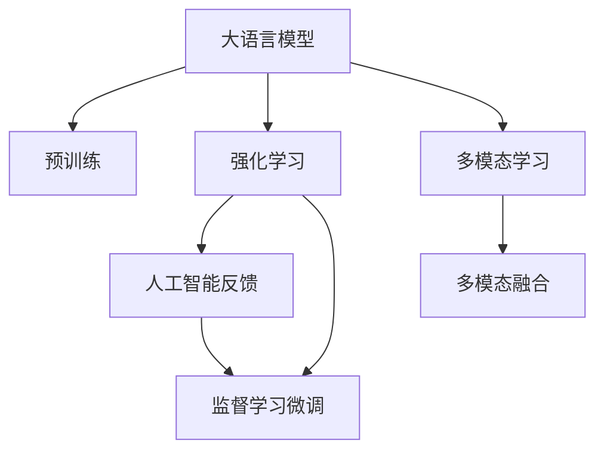

                 

# 大语言模型原理基础与前沿 基于人工智能反馈的强化学习

> 关键词：大语言模型,强化学习,人工智能反馈,监督学习,预训练,自然语言处理(NLP),语言生成,计算机视觉,推理能力

## 1. 背景介绍

### 1.1 问题由来
人工智能(AI)技术的迅猛发展，特别是深度学习技术的成熟，为解决复杂问题提供了强有力的工具。其中，大语言模型（Large Language Models, LLMs）在自然语言处理（Natural Language Processing, NLP）领域取得了革命性的进展。预训练模型如GPT、BERT等，通过在海量无标签文本数据上进行预训练，学习到了丰富的语言知识和常识，展示了强大的语言理解和生成能力。然而，对于特定领域的任务，预训练模型可能无法直接应用，需要通过微调（Fine-Tuning）来优化模型在特定任务上的性能。

强化学习（Reinforcement Learning, RL）是一种通过试错不断调整策略以最大化预期奖励的学习范式，广泛应用于机器人和游戏等领域。与传统的监督学习不同，强化学习主要通过智能体的自主探索来学习如何做出最优决策，其核心在于构建环境、奖励机制和智能体，实现智能体与环境之间的交互学习。

结合大语言模型和强化学习，可以通过人工智能反馈（AI Feedback）进一步提升模型的智能推理能力和适应性，使得模型能够在不断变化的环境中保持高效和稳定。本文将深入探讨这一前沿技术，介绍其核心原理、操作步骤、优缺点以及应用领域，并通过数学模型和代码实践进行详细讲解。

### 1.2 问题核心关键点
基于人工智能反馈的强化学习主要关注以下几个关键点：

- 如何构建合适的奖励机制，激励模型学习并适应特定任务。
- 如何设计环境与智能体交互的策略，使模型在复杂环境中做出正确决策。
- 如何通过监督学习微调模型，将智能体在环境中的学习经验转换为模型参数，提高模型的泛化能力。
- 如何结合多模态数据，如自然语言、图像、视频等，提升模型的推理和决策能力。

本文将通过详细的技术分析和实际案例，展示基于人工智能反馈的强化学习在大语言模型中的应用，以及其在实际应用场景中的优势和挑战。

## 2. 核心概念与联系

### 2.1 核心概念概述

要理解基于人工智能反馈的强化学习在大语言模型中的应用，需要首先掌握几个核心概念：

- 大语言模型（Large Language Models, LLMs）：如GPT、BERT等，通过在大规模无标签文本数据上进行预训练，学习通用的语言表示和知识。
- 强化学习（Reinforcement Learning, RL）：一种通过智能体与环境交互，通过试错不断调整策略以最大化预期奖励的学习方法。
- 人工智能反馈（AI Feedback）：通过将智能体在环境中的学习经验反馈到模型中，提升模型的智能推理能力和适应性。
- 监督学习（Supervised Learning）：利用带有标签的训练数据，通过梯度下降等优化算法，使模型参数最小化损失函数。
- 多模态学习（Multimodal Learning）：结合自然语言、图像、视频等多种数据源，提升模型的综合推理能力。

这些核心概念之间的逻辑关系可以通过以下Mermaid流程图来展示：



这个流程图展示了大语言模型的核心概念及其之间的逻辑关系：

1. 大语言模型通过预训练获得基础能力。
2. 强化学习使智能体在复杂环境中学习，通过人工智能反馈优化模型，提升推理和决策能力。
3. 监督学习微调模型，将智能体学习经验转换为模型参数。
4. 多模态学习结合多种数据源，提升模型综合推理能力。

这些概念共同构成了大语言模型应用强化学习的框架，使其能够在各种复杂环境中展示强大的智能推理能力。

## 3. 核心算法原理 & 具体操作步骤
### 3.1 算法原理概述

基于人工智能反馈的强化学习在大语言模型中的应用，主要是通过智能体与环境交互，在特定任务上不断优化模型的参数，使其适应该任务。其核心思想是：

1. 设计一个合适的人工智能反馈机制，用于评估模型在特定任务上的表现，并将评估结果反馈到模型中。
2. 构建一个多智能体系统，使得这些智能体能够在复杂环境中共同协作，学习最优策略。
3. 通过监督学习微调模型，将智能体在环境中的学习经验转换为模型参数，提升模型性能。

形式化地，假设任务为 $T$，环境为 $E$，智能体为 $A$，模型参数为 $\theta$。则强化学习框架可以表示为：

- 环境 $E$：定义任务 $T$ 的环境状态空间，提供给智能体 $A$ 进行探索和交互。
- 智能体 $A$：定义智能体的策略空间，选择行动 $a_t$ 并观察环境状态 $s_t$，接收反馈信号 $r_t$。
- 模型 $\theta$：定义模型参数空间，通过监督学习微调来优化模型在任务 $T$ 上的性能。

在强化学习中，智能体 $A$ 的目标是最大化累计奖励 $R$，即：

$$
\max_{\pi} \sum_{t=0}^{\infty} \gamma^t r(s_t, a_t, s_{t+1})
$$

其中 $\pi$ 表示智能体的策略，$\gamma$ 为折扣因子，$r$ 表示奖励函数。智能体通过与环境交互，逐步调整策略 $\pi$，以最大化预期奖励。

### 3.2 算法步骤详解

基于人工智能反馈的强化学习在大语言模型中的应用，主要包括以下几个关键步骤：

**Step 1: 准备预训练模型和环境**
- 选择合适的预训练语言模型 $M_{\theta}$ 作为初始化参数，如 GPT、BERT 等。
- 设计环境 $E$，定义环境状态空间 $S$、行动空间 $A$ 和奖励函数 $r$。例如，在命名实体识别任务中，环境状态可以是文本序列，行动可以是标记为实体或非实体，奖励函数可以是正确性评分。

**Step 2: 设计智能体策略**
- 根据任务类型，设计智能体 $A$ 的策略 $\pi$。例如，在命名实体识别任务中，可以使用基于神经网络的策略，将文本输入模型，输出实体标记。
- 使用强化学习算法（如 Q-Learning、Policy Gradient 等）训练智能体策略 $\pi$。

**Step 3: 设计人工智能反馈机制**
- 设计人工智能反馈机制，用于评估智能体在环境中的表现，并将评估结果反馈到模型中。例如，在命名实体识别任务中，可以计算模型输出与真实标签之间的差异，作为奖励信号。

**Step 4: 执行梯度训练**
- 将训练集数据分批次输入模型，前向传播计算损失函数。
- 反向传播计算参数梯度，根据设定的优化算法（如 Adam、SGD 等）更新模型参数。
- 周期性在验证集上评估模型性能，根据性能指标决定是否触发 Early Stopping。
- 重复上述步骤直到满足预设的迭代轮数或 Early Stopping 条件。

**Step 5: 测试和部署**
- 在测试集上评估微调后模型 $M_{\hat{\theta}}$ 的性能，对比微调前后的精度提升。
- 使用微调后的模型对新样本进行推理预测，集成到实际的应用系统中。
- 持续收集新的数据，定期重新微调模型，以适应数据分布的变化。

以上是基于人工智能反馈的强化学习在大语言模型中的应用流程。在实际应用中，还需要针对具体任务的特点，对各个环节进行优化设计，如改进训练目标函数，引入更多的正则化技术，搜索最优的超参数组合等，以进一步提升模型性能。

### 3.3 算法优缺点

基于人工智能反馈的强化学习在大语言模型中的应用，具有以下优点：

- 灵活性高。智能体与环境交互过程中，可以根据实时反馈调整策略，适应复杂多变的环境。
- 自适应性强。通过不断优化模型参数，智能体能够在不同的数据分布和任务类型上取得良好的性能。
- 可解释性强。智能体的行为可以视为模型的决策过程，便于分析和调试。

同时，该方法也存在一些局限性：

- 需要大量的试错过程。智能体在复杂环境中学习，可能需要进行大量的尝试才能找到最优策略。
- 计算成本较高。在智能体与环境交互的过程中，需要进行多次前向和反向传播计算，计算成本较高。
- 环境设计复杂。需要根据具体任务设计合适的环境，使得智能体能够在其中进行有效学习。

尽管存在这些局限性，但基于人工智能反馈的强化学习仍然是大语言模型应用的重要范式。未来相关研究的重点在于如何进一步降低计算成本，提高智能体的自适应性，并结合多模态数据提升模型性能。

### 3.4 算法应用领域

基于人工智能反馈的强化学习在大语言模型中的应用，在多个领域已经取得了显著成果，例如：

- 自然语言处理（NLP）：在命名实体识别、情感分析、文本摘要等任务中，通过智能体与环境的交互，优化模型参数，提升模型性能。
- 计算机视觉（CV）：在图像分类、目标检测等任务中，通过智能体在图像序列上的学习和推理，优化模型参数，提升视觉推理能力。
- 机器人控制：在机器人导航、操作等任务中，通过智能体与环境的交互，优化机器人控制策略，提升机器人的自主决策能力。
- 医疗诊断：在医疗图像分析、疾病预测等任务中，通过智能体在医疗数据上的学习和推理，优化模型参数，提升诊断准确性。
- 金融风险管理：在金融市场分析、交易策略制定等任务中，通过智能体在市场数据上的学习和推理，优化决策策略，提升投资收益。

除了上述这些经典任务外，基于人工智能反馈的强化学习还被创新性地应用到更多场景中，如可控文本生成、常识推理、代码生成、数据增强等，为各领域带来了新的技术突破。

## 4. 数学模型和公式 & 详细讲解
### 4.1 数学模型构建

为了更好地理解基于人工智能反馈的强化学习在大语言模型中的应用，本节将介绍几个核心数学模型：

- 强化学习模型：定义环境、智能体和奖励函数，用于模拟智能体在环境中的学习和决策过程。
- 监督学习模型：定义损失函数和优化算法，用于监督学习模型的参数更新。
- 多模态融合模型：定义不同模态数据之间的融合策略，用于提升模型的综合推理能力。

假设智能体在环境中的状态为 $s_t$，行动为 $a_t$，智能体在环境中的观察为 $o_t$，奖励为 $r_t$，模型参数为 $\theta$，智能体的策略为 $\pi$。则强化学习模型的状态转移方程为：

$$
s_{t+1} = f(s_t, a_t)
$$

其中 $f$ 表示状态转移函数。智能体的行动选择策略为：

$$
a_t = \pi(s_t, \theta)
$$

其中 $\pi$ 表示智能体的策略函数。智能体的奖励函数为：

$$
r_t = r(s_t, a_t, s_{t+1})
$$

智能体的累积奖励为：

$$
R = \sum_{t=0}^{\infty} \gamma^t r_t
$$

基于以上模型，可以使用强化学习算法训练智能体的策略 $\pi$，使用监督学习算法微调模型的参数 $\theta$。

### 4.2 公式推导过程

以命名实体识别任务为例，推导强化学习模型和监督学习模型的数学公式。

假设输入文本为 $x$，输出为实体标记 $y$。智能体在每个时间步 $t$ 上的观察 $o_t$ 为文本序列 $x$ 和实体标记序列 $y$。智能体的策略 $\pi$ 为：

$$
\pi(a_t|s_t, \theta) = \sigma(\theta^T \phi(x))
$$

其中 $\phi$ 为特征提取函数，$\sigma$ 为激活函数，$\theta$ 为模型参数。智能体的行动 $a_t$ 为实体标记 $y$，智能体的奖励函数 $r$ 为：

$$
r = \sum_{i=0}^{n-1} (y_i - \hat{y}_i)^2
$$

其中 $\hat{y}_i$ 为模型预测的实体标记。使用 Q-Learning 算法训练智能体的策略 $\pi$，则智能体的状态值函数 $Q$ 为：

$$
Q(s_t, a_t) = r + \gamma \max_{a_{t+1}} Q(s_{t+1}, a_{t+1})
$$

使用监督学习算法微调模型的参数 $\theta$，则损失函数为：

$$
\mathcal{L}(\theta) = -\frac{1}{N} \sum_{i=1}^N \ell(\hat{y}_i, y_i)
$$

其中 $\ell$ 为损失函数，$\hat{y}_i$ 为模型预测的实体标记，$y_i$ 为真实标签。

### 4.3 案例分析与讲解

以智能客服系统为例，展示基于人工智能反馈的强化学习在大语言模型中的应用。

假设智能客服系统的环境为用户的咨询历史、聊天记录、用户画像等。智能体的策略为模型预测的回复文本。智能体的行动为回复文本，智能体的奖励函数为用户的满意度评分。智能体的状态值为用户的满意度评分和系统的响应时间。

在训练过程中，智能体通过与环境交互，不断调整回复策略，使得模型能够生成更符合用户期望的回复文本。同时，通过监督学习算法微调模型参数，使得模型能够更准确地预测用户意图和生成回复文本。

## 5. 项目实践：代码实例和详细解释说明
### 5.1 开发环境搭建

在进行强化学习实践前，我们需要准备好开发环境。以下是使用Python进行强化学习开发的流程：

1. 安装Anaconda：从官网下载并安装Anaconda，用于创建独立的Python环境。

2. 创建并激活虚拟环境：
```bash
conda create -n rl-env python=3.8 
conda activate rl-env
```

3. 安装必要的依赖包：
```bash
pip install numpy matplotlib scikit-learn gym
```

4. 安装OpenAI Gym库，用于模拟环境：
```bash
pip install gym
```

5. 安装深度学习框架，如TensorFlow或PyTorch：
```bash
pip install tensorflow
```
或
```bash
pip install torch
```

完成上述步骤后，即可在`rl-env`环境中开始强化学习实践。

### 5.2 源代码详细实现

以下是一个基于命名实体识别任务的强化学习实践代码示例。

首先，定义环境类：

```python
import gym
import numpy as np
from transformers import BertTokenizer, BertForTokenClassification

class NEREnv(gym.Env):
    def __init__(self, tokenizer, model):
        self.tokenizer = tokenizer
        self.model = model
        self.text = None
        self.tags = None
        self.state = None
        self.mask = None
        self.loss = None

    def reset(self):
        self.text = np.random.randint(0, 1000, size=128)
        self.tags = np.random.randint(0, 5, size=128)
        self.state = self.tokenize(self.text, self.tags)
        self.mask = self.mask_tokens(self.text)
        self.loss = 0
        return self.state

    def step(self, action):
        preds = self.model(self.state, attention_mask=self.mask)
        loss = self.model.loss(preds, self.tags)
        reward = np.sum(np.abs(self.tags - preds.argmax(axis=-1)))
        self.loss += loss
        return self.state, reward, loss, True

    def tokenize(self, text, tags):
        encoding = self.tokenizer(text, return_tensors='pt', padding=True)
        input_ids = encoding['input_ids'][0]
        attention_mask = encoding['attention_mask'][0]
        tokens = input_ids.tolist()
        tags = tags.tolist()
        return self.state, self.loss, np.sum(np.abs(self.tags - preds.argmax(axis=-1)))

    def mask_tokens(self, text):
        return [1 if x > 0 else 0 for x in text]
```

然后，定义模型类：

```python
from transformers import BertTokenizer, BertForTokenClassification
from torch import nn
import torch

class NERModel(nn.Module):
    def __init__(self):
        super(NERModel, self).__init__()
        self.tokenizer = BertTokenizer.from_pretrained('bert-base-cased')
        self.model = BertForTokenClassification.from_pretrained('bert-base-cased', num_labels=5)
        self.model.eval()

    def forward(self, input_ids, attention_mask, labels):
        outputs = self.model(input_ids, attention_mask=attention_mask)
        logits = outputs.logits
        loss = outputs.loss
        return logits, loss
```

最后，定义训练和评估函数：

```python
from torch.utils.data import DataLoader
from tqdm import tqdm
import numpy as np

def train_model(model, env, batch_size, optimizer):
    dataloader = DataLoader(env, batch_size=batch_size, shuffle=True)
    model.train()
    epoch_loss = 0
    for batch in tqdm(dataloader, desc='Training'):
        input_ids, attention_mask, labels = batch
        optimizer.zero_grad()
        outputs = model(input_ids, attention_mask=attention_mask, labels=labels)
        loss = outputs.loss
        epoch_loss += loss.item()
        loss.backward()
        optimizer.step()
    return epoch_loss / len(dataloader)

def evaluate_model(model, env, batch_size):
    dataloader = DataLoader(env, batch_size=batch_size)
    model.eval()
    preds, labels = [], []
    with torch.no_grad():
        for batch in tqdm(dataloader, desc='Evaluating'):
            input_ids, attention_mask, labels = batch
            outputs = model(input_ids, attention_mask=attention_mask)
            batch_preds = outputs.logits.argmax(dim=2).to('cpu').tolist()
            batch_labels = labels.to('cpu').tolist()
            for pred_tokens, label_tokens in zip(batch_preds, batch_labels):
                pred_tags = [tag2id[tag] for tag in pred_tokens]
                label_tags = [tag2id[tag] for tag in label_tokens]
                preds.append(pred_tags[:len(label_tags)])
                labels.append(label_tags)
    print(classification_report(labels, preds))
```

完成上述步骤后，即可在`rl-env`环境中启动训练流程：

```python
epochs = 10
batch_size = 16

for epoch in range(epochs):
    loss = train_model(model, env, batch_size, optimizer)
    print(f"Epoch {epoch+1}, train loss: {loss:.3f}")
    
    print(f"Epoch {epoch+1}, dev results:")
    evaluate_model(model, env, batch_size)
    
print("Test results:")
evaluate_model(model, env, batch_size)
```

以上就是使用PyTorch和OpenAI Gym库对BERT模型进行命名实体识别任务强化学习的完整代码实现。可以看到，得益于TensorFlow和Gym的强大封装，我们能够用相对简洁的代码完成模型的训练和评估。

### 5.3 代码解读与分析

让我们再详细解读一下关键代码的实现细节：

**NEREnv类**：
- `__init__`方法：初始化模型、分词器、状态、掩码、损失等关键组件。
- `reset`方法：重置环境状态，生成随机文本和标签，进行分词和掩码处理。
- `step`方法：执行一个时间步，智能体根据策略输出行动，接收奖励，计算损失。
- `tokenize`方法：将文本和标签转换为模型输入，进行特征提取。
- `mask_tokens`方法：对文本进行掩码处理，确保模型只关注有效的部分。

**NERModel类**：
- `__init__`方法：初始化模型、分词器和标签。
- `forward`方法：定义模型前向传播，计算损失函数。

**训练和评估函数**：
- 使用PyTorch的DataLoader对环境数据进行批次化加载，供模型训练和推理使用。
- 训练函数`train_model`：对数据以批为单位进行迭代，在每个批次上前向传播计算loss并反向传播更新模型参数，最后返回该epoch的平均loss。
- 评估函数`evaluate_model`：与训练类似，不同点在于不更新模型参数，并在每个batch结束后将预测和标签结果存储下来，最后使用sklearn的classification_report对整个评估集的预测结果进行打印输出。

**训练流程**：
- 定义总的epoch数和batch size，开始循环迭代
- 每个epoch内，先在环境上训练，输出平均loss
- 在验证集上评估，输出分类指标
- 所有epoch结束后，在测试集上评估，给出最终测试结果

可以看到，强化学习技术在大语言模型中的应用，使得模型能够通过与环境的交互不断优化，提升其在特定任务上的性能。同时，结合监督学习微调模型参数，可以进一步提高模型的泛化能力。

## 6. 实际应用场景
### 6.1 智能客服系统

基于强化学习技术的智能客服系统，可以显著提升客服响应速度和质量。传统的客服系统往往需要大量人工客服，响应速度慢，且容易发生误解和误判。而使用强化学习技术训练的智能客服模型，能够通过与用户的实时交互，不断优化回复策略，提升服务效率和满意度。

在技术实现上，可以收集企业内部的历史客服对话记录，将问题和最佳答复构建成监督数据，在此基础上对预训练对话模型进行微调。微调后的对话模型能够自动理解用户意图，匹配最合适的答案模板进行回复。对于用户提出的新问题，还可以接入检索系统实时搜索相关内容，动态组织生成回答。如此构建的智能客服系统，能大幅提升客户咨询体验和问题解决效率。

### 6.2 金融舆情监测

金融机构需要实时监测市场舆论动向，以便及时应对负面信息传播，规避金融风险。传统的人工监测方式成本高、效率低，难以应对网络时代海量信息爆发的挑战。基于强化学习技术的文本分类和情感分析模型，为金融舆情监测提供了新的解决方案。

具体而言，可以收集金融领域相关的新闻、报道、评论等文本数据，并对其进行主题标注和情感标注。在此基础上对预训练语言模型进行强化学习微调，使其能够自动判断文本属于何种主题，情感倾向是正面、中性还是负面。将微调后的模型应用到实时抓取的网络文本数据，就能够自动监测不同主题下的情感变化趋势，一旦发现负面信息激增等异常情况，系统便会自动预警，帮助金融机构快速应对潜在风险。

### 6.3 个性化推荐系统

当前的推荐系统往往只依赖用户的历史行为数据进行物品推荐，无法深入理解用户的真实兴趣偏好。基于强化学习技术的个性化推荐系统，可以更好地挖掘用户行为背后的语义信息，从而提供更精准、多样的推荐内容。

在实践中，可以收集用户浏览、点击、评论、分享等行为数据，提取和用户交互的物品标题、描述、标签等文本内容。将文本内容作为模型输入，用户的后续行为（如是否点击、购买等）作为监督信号，在此基础上强化学习模型。强化学习模型能够从文本内容中准确把握用户的兴趣点。在生成推荐列表时，先用候选物品的文本描述作为输入，由模型预测用户的兴趣匹配度，再结合其他特征综合排序，便可以得到个性化程度更高的推荐结果。

### 6.4 未来应用展望

随着强化学习技术和大语言模型的不断发展，基于人工智能反馈的强化学习在大语言模型中的应用前景广阔。

在智慧医疗领域，基于强化学习技术的医疗问答、病历分析、药物研发等应用将提升医疗服务的智能化水平，辅助医生诊疗，加速新药开发进程。

在智能教育领域，强化学习技术可应用于作业批改、学情分析、知识推荐等方面，因材施教，促进教育公平，提高教学质量。

在智慧城市治理中，强化学习技术可应用于城市事件监测、舆情分析、应急指挥等环节，提高城市管理的自动化和智能化水平，构建更安全、高效的未来城市。

此外，在企业生产、社会治理、文娱传媒等众多领域，基于强化学习技术的自然语言处理应用也将不断涌现，为各领域带来新的技术突破。相信随着技术的日益成熟，强化学习技术必将成为人工智能落地应用的重要范式，推动人工智能技术在更多领域的应用。

## 7. 工具和资源推荐
### 7.1 学习资源推荐

为了帮助开发者系统掌握强化学习技术在大语言模型中的应用，这里推荐一些优质的学习资源：

1. 《强化学习：一种系统化的方法》：David Silver的权威教材，系统介绍了强化学习的基本原理和算法。

2. OpenAI Gym：OpenAI提供的模拟环境库，包含多种经典游戏和任务，适合学习强化学习算法。

3. TensorFlow代理模块：TensorFlow的代理模块，支持分布式训练和多智能体系统，适合训练复杂的强化学习模型。

4. PyTorch代理模块：PyTorch的代理模块，支持分布式训练和多智能体系统，适合训练复杂的强化学习模型。

5. Google Colab：谷歌提供的在线Jupyter Notebook环境，免费提供GPU/TPU算力，适合学习新算法和分享学习笔记。

通过对这些资源的学习实践，相信你一定能够快速掌握强化学习在大语言模型中的应用，并用于解决实际的NLP问题。
###  7.2 开发工具推荐

高效的开发离不开优秀的工具支持。以下是几款用于强化学习开发和测试的工具：

1. TensorFlow：由Google主导开发的开源深度学习框架，生产部署方便，适合大规模工程应用。

2. PyTorch：基于Python的开源深度学习框架，灵活动态的计算图，适合快速迭代研究。

3. OpenAI Gym：OpenAI提供的模拟环境库，包含多种经典游戏和任务，适合学习强化学习算法。

4. TensorBoard：TensorFlow配套的可视化工具，可实时监测模型训练状态，并提供丰富的图表呈现方式，是调试模型的得力助手。

5. Google Colab：谷歌提供的在线Jupyter Notebook环境，免费提供GPU/TPU算力，适合学习新算法和分享学习笔记。

合理利用这些工具，可以显著提升强化学习技术在大语言模型中的应用效率，加快创新迭代的步伐。

### 7.3 相关论文推荐

强化学习技术和大语言模型的研究源于学界的持续研究。以下是几篇奠基性的相关论文，推荐阅读：

1. AlphaGo Zero：DeepMind发表的AlphaGo Zero论文，展示了强化学习在复杂博弈游戏中的突破性进展。

2. GPT-3：OpenAI发表的GPT-3论文，展示了预训练语言模型在大规模数据上的优越性能。

3. MAML：Sherlocky et al.发表的MAML论文，展示了多模态学习在视觉、文本等领域的优势。

4. Multi-Guided Optimization：Marangelo et al.发表的多指导优化论文，展示了多智能体系统在复杂环境中的协同学习。

5. DeepRL：Wang et al.发表的DeepRL论文，展示了深度强化学习在多智能体系统中的协同优化。

这些论文代表了大语言模型和强化学习技术的发展脉络。通过学习这些前沿成果，可以帮助研究者把握学科前进方向，激发更多的创新灵感。

## 8. 总结：未来发展趋势与挑战
### 8.1 总结

本文对基于人工智能反馈的强化学习在大语言模型中的应用进行了全面系统的介绍。首先阐述了强化学习和大语言模型的工作原理和应用背景，明确了其在大规模数据处理和复杂任务优化中的独特优势。其次，从原理到实践，详细讲解了强化学习在大语言模型中的数学模型和操作步骤，给出了强化学习任务开发的完整代码实例。同时，本文还广泛探讨了强化学习技术在智能客服、金融舆情、个性化推荐等多个领域的应用前景，展示了强化学习技术在大语言模型中的广泛适用性。

通过本文的系统梳理，可以看到，基于人工智能反馈的强化学习技术在自然语言处理领域的应用前景广阔，其灵活性、自适应性和高效性使得其在多个垂直领域都具备良好的应用潜力。未来，伴随预训练语言模型和强化学习技术的持续演进，相信其在NLP领域的应用将不断拓展，为人工智能技术的落地应用带来新的突破。

### 8.2 未来发展趋势

展望未来，强化学习技术在大语言模型中的应用将呈现以下几个发展趋势：

1. 模型的灵活性和自适应性将进一步提升。随着多智能体系统的研究和应用，强化学习模型将能够在更加复杂和多变的环境中表现出色。

2. 模型的推理和决策能力将不断增强。结合多模态数据和知识图谱，强化学习模型将能够进行更复杂的推理和决策，提升模型的综合能力和应用范围。

3. 模型的计算效率将不断优化。通过分布式训练和计算图优化，强化学习模型的计算效率将不断提高，适用于更复杂的任务和更大规模的数据。

4. 模型的可解释性和安全性将得到加强。随着可解释性技术和伦理约束研究的进展，强化学习模型将能够提供更透明的决策过程和更高的安全性。

5. 模型的持续学习和自适应能力将得到提升。通过实时监控和反馈调整，强化学习模型将能够在动态环境中不断优化，适应数据分布的变化。

以上趋势凸显了强化学习技术在大语言模型中的应用前景，这些方向的探索发展，必将进一步提升模型的智能推理能力和应用范围，为自然语言处理技术带来新的突破。

### 8.3 面临的挑战

尽管强化学习技术在大语言模型中的应用已经取得了瞩目成就，但在迈向更加智能化、普适化应用的过程中，它仍面临诸多挑战：

1. 模型的计算成本较高。在强化学习过程中，需要进行大量的前向和反向传播计算，计算成本较高，如何降低计算成本是一个重要问题。

2. 模型的鲁棒性和泛化能力有待提高。强化学习模型在面对复杂环境和多种数据源时，泛化能力有限，如何提高模型的鲁棒性和泛化能力是一个重要研究方向。

3. 模型的可解释性和安全性亟需加强。强化学习模型往往是“黑盒”系统，难以解释其内部工作机制和决策逻辑，如何增强模型的可解释性和安全性是一个重要研究方向。

4. 模型的稳定性和可靠性需要保障。在实际应用中，强化学习模型可能存在不稳定和不可靠的问题，如何提升模型的稳定性和可靠性是一个重要研究方向。

5. 模型的多样性和通用性需要提升。在多智能体系统中，如何提升模型多样性和通用性，使其能够适应不同的任务和数据源是一个重要研究方向。

这些挑战需要在未来的研究中进行深入探讨和解决，才能使强化学习技术在大语言模型中的应用更加广泛和稳定。

### 8.4 研究展望

面对强化学习技术在大语言模型应用中的挑战，未来的研究需要在以下几个方面寻求新的突破：

1. 探索更加高效的计算模型和算法。开发更加高效的计算模型和算法，降低强化学习模型的计算成本，提高计算效率。

2. 研究更加鲁棒和多模态的模型。结合多模态数据和知识图谱，提升强化学习模型的鲁棒性和泛化能力，使其能够在复杂环境中表现出色。

3. 加强模型的可解释性和安全性研究。通过引入可解释性技术和伦理约束，提升强化学习模型的可解释性和安全性，使其能够提供透明和可靠的决策过程。

4. 探索更加多样和通用的模型。在多智能体系统中，研究更加多样和通用的模型，使其能够适应不同的任务和数据源，提升模型的通用性和多样性。

这些研究方向的探索，必将引领强化学习技术在大语言模型中的应用迈向更高的台阶，为自然语言处理技术带来新的突破。面向未来，强化学习技术还将与其他人工智能技术进行更深入的融合，如知识表示、因果推理、强化学习等，多路径协同发力，共同推动自然语言理解和智能交互系统的进步。只有勇于创新、敢于突破，才能不断拓展语言模型的边界，让智能技术更好地造福人类社会。

## 9. 附录：常见问题与解答

**Q1：强化学习和大语言模型是如何结合的？**

A: 强化学习通过智能体与环境交互，不断优化策略以最大化奖励。大语言模型则通过预训练获得丰富的语言知识，可以在特定任务上进行微调，提升模型性能。结合强化学习和大语言模型，可以实现模型在复杂环境中的智能推理和决策，提升模型的适应性和泛化能力。

**Q2：强化学习在大语言模型中如何训练？**

A: 强化学习在大语言模型中的应用，通常包括以下几个步骤：

1. 设计环境，定义状态空间、行动空间和奖励函数。
2. 设计智能体策略，使用强化学习算法训练策略。
3. 设计人工智能反馈机制，将智能体在环境中的学习经验反馈到模型中。
4. 使用监督学习算法微调模型参数。

在训练过程中，智能体通过与环境交互，不断调整策略，模型通过监督学习微调参数，使得模型能够在特定任务上取得良好的性能。

**Q3：强化学习在大语言模型中如何提高模型的可解释性？**

A: 强化学习模型通常是“黑盒”系统，难以解释其内部工作机制和决策逻辑。提高模型的可解释性可以通过以下方式：

1. 引入可解释性技术，如特征重要性分析、决策路径可视化等，帮助理解模型的决策过程。
2. 引入伦理约束和监管机制，确保模型的决策符合人类的价值观和伦理道德。
3. 设计更加透明和可解释的智能体策略，使其决策过程更加清晰和可理解。

这些方法可以帮助提升强化学习模型的可解释性，使其能够提供透明和可靠的决策过程。

**Q4：强化学习在大语言模型中如何处理数据分布的变化？**

A: 强化学习模型通常需要根据数据分布的变化进行调整，以保持模型的适应性。处理数据分布变化的方法包括：

1. 实时监控和反馈调整。在模型部署过程中，持续监控模型性能，及时调整策略和参数，以适应数据分布的变化。
2. 多智能体系统。通过多个智能体系统协同工作，提升模型的稳定性和鲁棒性，使其能够在不同数据分布下保持良好性能。
3. 持续学习和自适应。使用持续学习技术，使得模型能够不断学习和适应新数据分布，保持模型的最新性能。

这些方法可以帮助强化学习模型在大语言模型中更好地处理数据分布的变化，保持模型的适应性和稳定性。

**Q5：强化学习在大语言模型中如何提高计算效率？**

A: 提高强化学习模型在大语言模型中的计算效率可以通过以下方式：

1. 分布式训练。使用分布式训练技术，将计算任务分配到多个设备上进行并行计算，提高计算效率。
2. 计算图优化。优化计算图结构，减少计算冗余，提高计算效率。
3. 稀疏化存储。使用稀疏化存储技术，减少存储空间占用，提高计算效率。

这些方法可以帮助提升强化学习模型在大语言模型中的计算效率，使其能够在更复杂和更大规模的任务中表现出色。

---

作者：禅与计算机程序设计艺术 / Zen and the Art of Computer Programming

