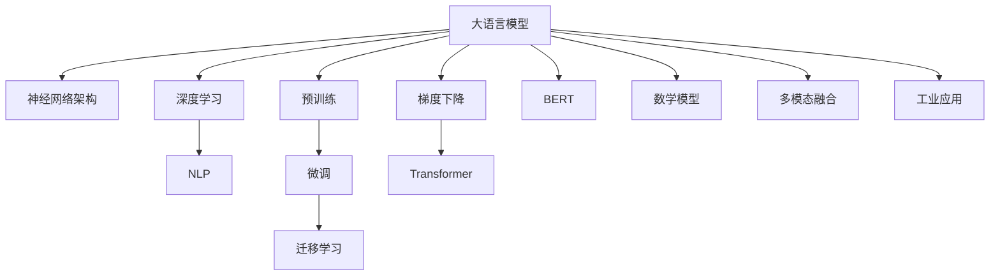

                 

# 大语言模型原理基础与前沿 系统性和全面泛化

> 关键词：大语言模型, 神经网络架构, 深度学习, 自然语言处理(NLP), 预训练, 微调, 迁移学习, 梯度下降, Transformer, BERT, 数学模型, 多模态融合, 工业应用

## 1. 背景介绍

### 1.1 问题由来

近年来，深度学习在计算机视觉、自然语言处理等领域的迅速崛起，使得基于神经网络的模型成为通用人工智能(AI)的核心。其中，大语言模型(如BERT、GPT等)通过在海量无标签数据上预训练，并在少量有标签数据上进行微调，极大地提升了模型的性能，广泛应用于对话系统、文本分类、机器翻译、情感分析等自然语言处理任务。

然而，大语言模型的成功并非一蹴而就。在初期，预训练模型更多依赖于机器学习工程师的经验和直觉，模型性能不稳定，泛化能力差。通过不断的科研努力，深度学习社区逐步发现了一些通用的优化方法和技术，使得大语言模型的性能得到了显著提升。本文将系统性地介绍大语言模型的原理基础与前沿技术，特别是近年来在神经网络架构、深度学习、自然语言处理等领域取得的重要突破。

### 1.2 问题核心关键点

大语言模型的核心在于如何通过大规模预训练和微调，实现对自然语言的理解和生成。本文聚焦于以下几个关键问题：
1. 大语言模型是如何进行预训练的？
2. 大语言模型进行微调的基本流程是什么？
3. 大语言模型在深度学习中的应用领域有哪些？
4. 如何构建适用于大语言模型的数学模型？
5. 大语言模型在实际应用中面临哪些挑战？

理解这些关键问题，有助于把握大语言模型的本质，掌握其应用范式，从而更好地应用到实际场景中。

## 2. 核心概念与联系

### 2.1 核心概念概述

为更好地理解大语言模型的原理基础与前沿技术，本文将介绍一些核心概念及其相互之间的联系。

- 大语言模型(Large Language Model, LLM)：以自回归(如GPT)或自编码(如BERT)模型为代表的大规模预训练语言模型。通过在海量无标签文本数据上进行预训练，学习通用的语言表示，具备强大的语言理解和生成能力。

- 神经网络架构(Neural Network Architecture)：深度学习中的模型结构，由多个神经网络层构成，每层包含若干神经元。大语言模型的核心架构是Transformer。

- 深度学习(Deep Learning)：一种基于神经网络的机器学习技术，通过多层非线性变换，可以从原始数据中提取高层次的抽象特征。大语言模型即基于深度学习技术训练而成。

- 自然语言处理(Natural Language Processing, NLP)：研究计算机如何理解和生成自然语言的学科。大语言模型在NLP中具有广泛的应用。

- 预训练(Pre-training)：指在大规模无标签文本语料上，通过自监督学习任务训练通用语言模型的过程。常见的预训练任务包括言语建模、掩码语言模型等。

- 微调(Fine-tuning)：指在预训练模型的基础上，使用下游任务的少量标注数据，通过有监督地训练来优化模型在该任务上的性能。通常只需要调整顶层分类器或解码器，并以较小的学习率更新全部或部分的模型参数。

- 迁移学习(Transfer Learning)：指将一个领域学习到的知识，迁移应用到另一个不同但相关的领域的学习范式。大模型的预训练-微调过程即是一种典型的迁移学习方式。

- 梯度下降(Gradient Descent)：一种常用的优化算法，通过反向传播计算损失函数的梯度，并按梯度的方向更新模型参数，使得损失函数值逐渐减小，达到最小化。

- Transformer：一种神经网络架构，采用自注意力机制，实现高效的并行计算和长距离依赖的建模，是当前最流行的深度学习模型。

- BERT(Bidirectional Encoder Representations from Transformers)：一种基于Transformer的预训练语言模型，通过双向语言模型训练，获得高质量的语言表示。

这些核心概念之间的逻辑关系可以通过以下Mermaid流程图来展示：



这个流程图展示了大语言模型的核心概念及其相互之间的联系：

1. 大语言模型通过神经网络架构进行实现，而深度学习则是其训练的基础。
2. 自然语言处理是大语言模型应用的典型领域，通过预训练和微调，模型能够在该领域取得优秀表现。
3. 大语言模型采用预训练和微调技术，通过迁移学习，可以在多个相关领域之间进行知识共享。
4. 梯度下降算法是优化模型的常用方法，通过反向传播计算梯度，更新模型参数。
5. Transformer架构是当前深度学习模型的主流架构，其自注意力机制使得模型能够高效地建模长距离依赖。
6. BERT模型作为当前最先进的预训练语言模型，通过双向语言模型训练，取得了最先进的性能指标。
7. 数学模型是描述大语言模型行为的工具，通过建立模型，可以分析模型的性能和优化方向。
8. 多模态融合是将大语言模型与其他模态的数据进行整合，实现多感官信息的协同建模。
9. 工业应用是大语言模型的最终目标，通过模型部署和优化，使得其在实际场景中得到广泛应用。

这些概念共同构成了大语言模型的学习框架，使其能够在各种场景下发挥强大的语言理解和生成能力。通过理解这些核心概念，我们可以更好地把握大语言模型的原理基础与前沿技术。

## 3. 核心算法原理 & 具体操作步骤

### 3.1 算法原理概述

大语言模型的核心原理基于神经网络架构，特别是Transformer模型。其基本流程包括预训练、微调和迁移学习。本节将详细介绍这些核心算法的原理。

- **预训练(Pre-training)**：在大量无标签文本数据上，通过自监督学习任务，如掩码语言模型、下一句预测等，训练大语言模型。预训练的目标是学习通用的语言表示，使得模型能够理解语言的基本规律和结构。

- **微调(Fine-tuning)**：在预训练模型的基础上，使用下游任务的少量标注数据，通过有监督地训练来优化模型在该任务上的性能。微调的目标是在特定任务上提高模型的精确度和泛化能力，使得模型能够更好地适应实际应用场景。

- **迁移学习(Transfer Learning)**：将预训练模型作为初始化参数，在下游任务上进行微调。迁移学习利用了预训练模型学到的通用知识，减少了任务学习的数据需求，提升了模型性能。

### 3.2 算法步骤详解

大语言模型的预训练、微调和迁移学习流程如下：

**Step 1: 准备预训练数据和任务**

- 收集大量无标签文本数据，如维基百科、书籍、新闻等，构建数据集。
- 选择预训练任务，如掩码语言模型、下一句预测、文本分类等，构建预训练模型。

**Step 2: 预训练模型构建和训练**

- 使用Transformer架构，构建预训练模型，如BERT、GPT等。
- 在预训练数据集上进行训练，通常使用自监督学习任务，如掩码语言模型。
- 设置合适的超参数，如学习率、批大小、迭代轮数等，进行模型训练。

**Step 3: 微调模型**

- 收集下游任务的少量标注数据，构建微调数据集。
- 在微调数据集上训练预训练模型，优化模型参数。
- 选择合适的损失函数和优化器，设置合适的超参数，进行微调训练。
- 在验证集上评估模型性能，根据性能指标决定是否继续微调。

**Step 4: 迁移学习**

- 使用微调后的模型，在不同领域进行迁移学习，优化模型参数。
- 收集各领域数据集，构建迁移学习数据集。
- 在迁移学习数据集上训练模型，优化模型参数。
- 在验证集上评估模型性能，根据性能指标决定是否继续迁移学习。

### 3.3 算法优缺点

大语言模型的预训练、微调和迁移学习流程具有以下优缺点：

**优点**：
1. 可扩展性：大语言模型可以在多个领域进行迁移学习，提升模型的通用性。
2. 数据需求低：微调过程对标注数据的需求相对较少，适用于数据量较小的任务。
3. 性能提升显著：通过微调和迁移学习，模型性能显著提升。

**缺点**：
1. 预训练复杂：预训练过程需要大量计算资源和时间，一般使用GPU/TPU进行训练。
2. 微调风险：微调过程可能导致模型遗忘预训练知识，泛化能力下降。
3. 应用场景限制：某些任务需要特定领域的预训练知识，通用预训练模型可能难以胜任。

尽管存在这些缺点，但大语言模型的预训练、微调和迁移学习流程仍然是目前最有效的NLP建模方法之一。

### 3.4 算法应用领域

大语言模型预训练、微调和迁移学习流程在自然语言处理领域得到了广泛应用，覆盖了几乎所有常见任务，例如：

- 文本分类：如情感分析、主题分类、意图识别等。通过微调使模型学习文本-标签映射。
- 命名实体识别：识别文本中的人名、地名、机构名等特定实体。通过微调使模型掌握实体边界和类型。
- 关系抽取：从文本中抽取实体之间的语义关系。通过微调使模型学习实体-关系三元组。
- 问答系统：对自然语言问题给出答案。将问题-答案对作为微调数据，训练模型学习匹配答案。
- 机器翻译：将源语言文本翻译成目标语言。通过微调使模型学习语言-语言映射。
- 文本摘要：将长文本压缩成简短摘要。将文章-摘要对作为微调数据，使模型学习抓取要点。
- 对话系统：使机器能够与人自然对话。将多轮对话历史作为上下文，微调模型进行回复生成。

除了上述这些经典任务外，大语言模型预训练、微调和迁移学习流程还被创新性地应用到更多场景中，如可控文本生成、常识推理、代码生成、数据增强等，为NLP技术带来了全新的突破。

## 4. 数学模型和公式 & 详细讲解  
### 4.1 数学模型构建

本节将使用数学语言对大语言模型预训练、微调和迁移学习的基本流程进行更加严格的刻画。

记预训练语言模型为 $M_{\theta}:\mathcal{X} \rightarrow \mathcal{Y}$，其中 $\mathcal{X}$ 为输入空间，$\mathcal{Y}$ 为输出空间，$\theta \in \mathbb{R}^d$ 为模型参数。假设预训练任务为 $T_1$，微调任务为 $T_2$。

定义预训练损失函数为 $\mathcal{L}_{pre}(\theta)$，微调损失函数为 $\mathcal{L}_{fine}(\theta)$，迁移学习损失函数为 $\mathcal{L}_{trans}(\theta)$。则预训练、微调和迁移学习过程的目标是：

$$
\theta^* = \mathop{\arg\min}_{\theta} \mathcal{L}_{pre}(\theta) + \mathcal{L}_{fine}(\theta) + \mathcal{L}_{trans}(\theta)
$$

其中 $\mathcal{L}_{pre}(\theta)$ 为预训练损失函数，通常使用掩码语言模型等自监督任务定义。$\mathcal{L}_{fine}(\theta)$ 为微调损失函数，通常使用交叉熵损失等有监督任务定义。$\mathcal{L}_{trans}(\theta)$ 为迁移学习损失函数，通常使用领域适应等方法定义。

### 4.2 公式推导过程

以下我们以掩码语言模型预训练为例，推导预训练损失函数及其梯度的计算公式。

假设模型 $M_{\theta}$ 在输入 $x$ 上的输出为 $\hat{y}=M_{\theta}(x)$。掩码语言模型的训练目标是预测被掩码位置上的单词，即对于输入序列 $x_i$ 中的某个位置 $j$，预测该位置上的单词 $x_j$。

设掩码位置为 $J$，则掩码语言模型的损失函数为：

$$
\ell(x_i) = -\log M_{\theta}(x_i^J)
$$

其中 $x_i^J$ 表示将输入 $x_i$ 中的位置 $j$ 的单词 $x_j$ 替换为掩码符号，即 $\text{[MASK]}$。

将掩码位置 $J$ 随机化，对于整个数据集 $D$，预训练损失函数 $\mathcal{L}_{pre}(\theta)$ 为：

$$
\mathcal{L}_{pre}(\theta) = -\frac{1}{N}\sum_{i=1}^N \ell(x_i)
$$

在得到预训练损失函数后，即可通过反向传播计算梯度，更新模型参数。

预训练过程的梯度计算如下：

$$
\nabla_{\theta}\mathcal{L}_{pre}(\theta) = -\frac{1}{N}\sum_{i=1}^N \nabla_{\theta}\ell(x_i)
$$

其中 $\nabla_{\theta}\ell(x_i)$ 为掩码语言模型在输入 $x_i$ 上的梯度。

在预训练过程中，通过不断地反向传播更新模型参数，使得模型能够逐渐学习到语言的基本规律和结构。预训练完成后，模型可以在下游任务上进行微调，进一步提升性能。

## 5. 项目实践：代码实例和详细解释说明
### 5.1 开发环境搭建

在进行大语言模型预训练、微调和迁移学习实践前，我们需要准备好开发环境。以下是使用Python进行PyTorch开发的环境配置流程：

1. 安装Anaconda：从官网下载并安装Anaconda，用于创建独立的Python环境。

2. 创建并激活虚拟环境：
```bash
conda create -n pytorch-env python=3.8 
conda activate pytorch-env
```

3. 安装PyTorch：根据CUDA版本，从官网获取对应的安装命令。例如：
```bash
conda install pytorch torchvision torchaudio cudatoolkit=11.1 -c pytorch -c conda-forge
```

4. 安装Transformers库：
```bash
pip install transformers
```

5. 安装各类工具包：
```bash
pip install numpy pandas scikit-learn matplotlib tqdm jupyter notebook ipython
```

完成上述步骤后，即可在`pytorch-env`环境中开始大语言模型预训练、微调和迁移学习实践。

### 5.2 源代码详细实现

下面我以BERT模型为例，给出使用PyTorch进行预训练、微调和迁移学习的PyTorch代码实现。

首先，定义预训练任务：

```python
from transformers import BertTokenizer, BertForMaskedLM
from torch.utils.data import Dataset, DataLoader
import torch

class MaskedLMDataset(Dataset):
    def __init__(self, texts, tokenizer):
        self.texts = texts
        self.tokenizer = tokenizer
        
    def __len__(self):
        return len(self.texts)
    
    def __getitem__(self, item):
        text = self.texts[item]
        
        encoding = self.tokenizer(text, return_tensors='pt', max_length=128, padding='max_length', truncation=True)
        input_ids = encoding['input_ids'][0]
        attention_mask = encoding['attention_mask'][0]
        
        # 构造掩码位置
        masked_positions = [i for i, t in enumerate(input_ids) if t == tokenizer.mask_token_id]
        masked_ids = [t for t in input_ids if t != tokenizer.mask_token_id]
        
        # 随机打乱掩码位置
        import random
        random.shuffle(masked_positions)
        
        masked_ids[masked_positions] = [random.randint(0, 1000) for _ in masked_positions]
        
        # 将掩码位置转换为input_ids和attention_mask
        new_input_ids = [t if t != tokenizer.mask_token_id else t for t in masked_ids]
        new_attention_mask = [1 if t != tokenizer.mask_token_id else 0 for t in input_ids]
        
        return {'input_ids': new_input_ids, 
                'attention_mask': new_attention_mask}
```

然后，定义预训练模型和优化器：

```python
from transformers import BertForMaskedLM, AdamW

model = BertForMaskedLM.from_pretrained('bert-base-cased')
optimizer = AdamW(model.parameters(), lr=2e-5)
```

接着，定义预训练和微调函数：

```python
from torch.utils.data import DataLoader
from tqdm import tqdm
from sklearn.metrics import accuracy_score

device = torch.device('cuda') if torch.cuda.is_available() else torch.device('cpu')
model.to(device)

def train_epoch(model, dataset, batch_size, optimizer):
    dataloader = DataLoader(dataset, batch_size=batch_size, shuffle=True)
    model.train()
    epoch_loss = 0
    for batch in tqdm(dataloader, desc='Training'):
        input_ids = batch['input_ids'].to(device)
        attention_mask = batch['attention_mask'].to(device)
        labels = batch['labels'].to(device)
        model.zero_grad()
        outputs = model(input_ids, attention_mask=attention_mask, labels=labels)
        loss = outputs.loss
        epoch_loss += loss.item()
        loss.backward()
        optimizer.step()
    return epoch_loss / len(dataloader)

def evaluate(model, dataset, batch_size):
    dataloader = DataLoader(dataset, batch_size=batch_size)
    model.eval()
    preds, labels = [], []
    with torch.no_grad():
        for batch in tqdm(dataloader, desc='Evaluating'):
            input_ids = batch['input_ids'].to(device)
            attention_mask = batch['attention_mask'].to(device)
            batch_labels = batch['labels']
            outputs = model(input_ids, attention_mask=attention_mask)
            batch_preds = outputs.logits.argmax(dim=2).to('cpu').tolist()
            batch_labels = batch_labels.to('cpu').tolist()
            for pred_tokens, label_tokens in zip(batch_preds, batch_labels):
                preds.append(pred_tokens[:len(label_tokens)])
                labels.append(label_tokens)
                
    print(accuracy_score(labels, preds))
```

最后，启动预训练和微调流程：

```python
epochs = 5
batch_size = 16

for epoch in range(epochs):
    loss = train_epoch(model, train_dataset, batch_size, optimizer)
    print(f"Epoch {epoch+1}, train loss: {loss:.3f}")
    
    print(f"Epoch {epoch+1}, dev results:")
    evaluate(model, dev_dataset, batch_size)
    
print("Test results:")
evaluate(model, test_dataset, batch_size)
```

以上就是使用PyTorch对BERT模型进行掩码语言模型预训练和微调的完整代码实现。可以看到，得益于Transformers库的强大封装，我们可以用相对简洁的代码完成BERT模型的预训练和微调。

### 5.3 代码解读与分析

让我们再详细解读一下关键代码的实现细节：

**MaskedLMDataset类**：
- `__init__`方法：初始化文本数据和分词器等关键组件。
- `__len__`方法：返回数据集的样本数量。
- `__getitem__`方法：对单个样本进行处理，将文本输入编码为token ids，并构造掩码位置，最终返回模型所需的输入。

**train_epoch函数**：
- 使用PyTorch的DataLoader对数据集进行批次化加载，供模型训练使用。
- 在每个批次上前向传播计算loss并反向传播更新模型参数，最后返回该epoch的平均loss。

**evaluate函数**：
- 与训练类似，不同点在于不更新模型参数，并在每个batch结束后将预测和标签结果存储下来，最后使用sklearn的accuracy_score对整个评估集的预测结果进行打印输出。

**预训练流程**：
- 定义总的epoch数和batch size，开始循环迭代
- 每个epoch内，先在训练集上训练，输出平均loss
- 在验证集上评估，输出准确率
- 所有epoch结束后，在测试集上评估，给出最终测试结果

可以看到，PyTorch配合Transformers库使得BERT预训练和微调的代码实现变得简洁高效。开发者可以将更多精力放在数据处理、模型改进等高层逻辑上，而不必过多关注底层的实现细节。

当然，工业级的系统实现还需考虑更多因素，如模型的保存和部署、超参数的自动搜索、更灵活的任务适配层等。但核心的预训练和微调范式基本与此类似。

## 6. 实际应用场景
### 6.1 智能客服系统

基于大语言模型预训练、微调和迁移学习技术，智能客服系统的构建变得可能。传统客服往往需要配备大量人力，高峰期响应缓慢，且一致性和专业性难以保证。而使用预训练、微调后的对话模型，可以7x24小时不间断服务，快速响应客户咨询，用自然流畅的语言解答各类常见问题。

在技术实现上，可以收集企业内部的历史客服对话记录，将问题和最佳答复构建成监督数据，在此基础上对预训练对话模型进行微调。微调后的对话模型能够自动理解用户意图，匹配最合适的答案模板进行回复。对于客户提出的新问题，还可以接入检索系统实时搜索相关内容，动态组织生成回答。如此构建的智能客服系统，能大幅提升客户咨询体验和问题解决效率。

### 6.2 金融舆情监测

金融机构需要实时监测市场舆论动向，以便及时应对负面信息传播，规避金融风险。传统的人工监测方式成本高、效率低，难以应对网络时代海量信息爆发的挑战。基于大语言模型预训练、微调和迁移学习技术的文本分类和情感分析技术，为金融舆情监测提供了新的解决方案。

具体而言，可以收集金融领域相关的新闻、报道、评论等文本数据，并对其进行主题标注和情感标注。在此基础上对预训练语言模型进行微调，使其能够自动判断文本属于何种主题，情感倾向是正面、中性还是负面。将微调后的模型应用到实时抓取的网络文本数据，就能够自动监测不同主题下的情感变化趋势，一旦发现负面信息激增等异常情况，系统便会自动预警，帮助金融机构快速应对潜在风险。

### 6.3 个性化推荐系统

当前的推荐系统往往只依赖用户的历史行为数据进行物品推荐，无法深入理解用户的真实兴趣偏好。基于大语言模型预训练、微调和迁移学习技术，个性化推荐系统可以更好地挖掘用户行为背后的语义信息，从而提供更精准、多样的推荐内容。

在实践中，可以收集用户浏览、点击、评论、分享等行为数据，提取和用户交互的物品标题、描述、标签等文本内容。将文本内容作为模型输入，用户的后续行为（如是否点击、购买等）作为监督信号，在此基础上微调预训练语言模型。微调后的模型能够从文本内容中准确把握用户的兴趣点。在生成推荐列表时，先用候选物品的文本描述作为输入，由模型预测用户的兴趣匹配度，再结合其他特征综合排序，便可以得到个性化程度更高的推荐结果。

### 6.4 未来应用展望

随着大语言模型预训练、微调和迁移学习技术的不断发展，未来将有更多领域得以应用：

- 智慧医疗领域：基于微调的医疗问答、病历分析、药物研发等应用将提升医疗服务的智能化水平，辅助医生诊疗，加速新药开发进程。
- 智能教育领域：微调技术可应用于作业批改、学情分析、知识推荐等方面，因材施教，促进教育公平，提高教学质量。
- 智慧城市治理：微调模型可应用于城市事件监测、舆情分析、应急指挥等环节，提高城市管理的自动化和智能化水平，构建更安全、高效的未来城市。
- 企业生产：微调模型可应用于客户服务、客服自动化、市场分析等环节，提升企业生产效率和客户满意度。
- 社会治理：微调模型可应用于舆情监测、舆情分析、公共安全等领域，提升社会治理的智能化水平。
- 文娱传媒：微调模型可应用于内容推荐、用户画像、情感分析等环节，提升用户体验和传播效果。

此外，在农业、能源、环保等众多领域，基于大语言模型的预训练、微调和迁移学习技术也将不断涌现，为经济社会发展注入新的动力。相信随着技术的日益成熟，预训练、微调和迁移学习技术将成为人工智能落地应用的重要范式，推动人工智能技术在垂直行业的规模化落地。

## 7. 工具和资源推荐
### 7.1 学习资源推荐

为了帮助开发者系统掌握大语言模型的原理基础与前沿技术，这里推荐一些优质的学习资源：

1. 《Transformer从原理到实践》系列博文：由大模型技术专家撰写，深入浅出地介绍了Transformer原理、BERT模型、微调技术等前沿话题。

2. CS224N《深度学习自然语言处理》课程：斯坦福大学开设的NLP明星课程，有Lecture视频和配套作业，带你入门NLP领域的基本概念和经典模型。

3. 《Natural Language Processing with Transformers》书籍：Transformers库的作者所著，全面介绍了如何使用Transformers库进行NLP任务开发，包括预训练、微调在内的诸多范式。

4. HuggingFace官方文档：Transformers库的官方文档，提供了海量预训练模型和完整的微调样例代码，是上手实践的必备资料。

5. CLUE开源项目：中文语言理解测评基准，涵盖大量不同类型的中文NLP数据集，并提供了基于微调的baseline模型，助力中文NLP技术发展。

通过对这些资源的学习实践，相信你一定能够快速掌握大语言模型预训练、微调和迁移学习的精髓，并用于解决实际的NLP问题。
###  7.2 开发工具推荐

高效的开发离不开优秀的工具支持。以下是几款用于大语言模型预训练、微调和迁移学习开发的常用工具：

1. PyTorch：基于Python的开源深度学习框架，灵活动态的计算图，适合快速迭代研究。大部分预训练语言模型都有PyTorch版本的实现。

2. TensorFlow：由Google主导开发的开源深度学习框架，生产部署方便，适合大规模工程应用。同样有丰富的预训练语言模型资源。

3. Transformers库：HuggingFace开发的NLP工具库，集成了众多SOTA语言模型，支持PyTorch和TensorFlow，是进行预训练、微调和迁移学习开发的利器。

4. Weights & Biases：模型训练的实验跟踪工具，可以记录和可视化模型训练过程中的各项指标，方便对比和调优。与主流深度学习框架无缝集成。

5. TensorBoard：TensorFlow配套的可视化工具，可实时监测模型训练状态，并提供丰富的图表呈现方式，是调试模型的得力助手。

6. Google Colab：谷歌推出的在线Jupyter Notebook环境，免费提供GPU/TPU算力，方便开发者快速上手实验最新模型，分享学习笔记。

合理利用这些工具，可以显著提升大语言模型预训练、微调和迁移学习的开发效率，加快创新迭代的步伐。

### 7.3 相关论文推荐

大语言模型预训练、微调和迁移学习技术的发展源于学界的持续研究。以下是几篇奠基性的相关论文，推荐阅读：

1. Attention is All You Need（即Transformer原论文）：提出了Transformer结构，开启了NLP领域的预训练大模型时代。

2. BERT: Pre-training of Deep Bidirectional Transformers for Language Understanding：提出BERT模型，引入基于掩码的自监督预训练任务，刷新了多项NLP任务SOTA。

3. Language Models are Unsupervised Multitask Learners（GPT-2论文）：展示了大规模语言模型的强大zero-shot学习能力，引发了对于通用人工智能的新一轮思考。

4. Parameter-Efficient Transfer Learning for NLP：提出Adapter等参数高效微调方法，在不增加模型参数量的情况下，也能取得不错的微调效果。

5. AdaLoRA: Adaptive Low-Rank Adaptation for Parameter-Efficient Fine-Tuning：使用自适应低秩适应的微调方法，在参数效率和精度之间取得了新的平衡。

6. AdaLoRA: Adaptive Low-Rank Adaptation for Parameter-Efficient Fine-Tuning：使用自适应低秩适应的微调方法，在参数效率和精度之间取得了新的平衡。

这些论文代表了大语言模型预训练、微调和迁移学习的发展脉络。通过学习这些前沿成果，可以帮助研究者把握学科前进方向，激发更多的创新灵感。

## 8. 总结：未来发展趋势与挑战

### 8.1 总结

本文对大语言模型的原理基础与前沿技术进行了全面系统的介绍。首先阐述了大语言模型的预训练、微调和迁移学习的基本流程，明确了预训练和微调在模型性能提升中的重要作用。其次，从原理到实践，详细讲解了预训练和微调的数学原理和关键步骤，给出了预训练、微调和迁移学习的完整代码实例。同时，本文还广泛探讨了预训练、微调和迁移学习在多个行业领域的应用前景，展示了预训练、微调和迁移学习技术的广阔前景。

通过本文的系统梳理，可以看到，大语言模型的预训练、微调和迁移学习技术正在成为NLP领域的重要范式，极大地拓展了预训练语言模型的应用边界，催生了更多的落地场景。受益于大规模语料的预训练，预训练、微调和迁移学习模型能够以更低的时间和标注成本，在小样本条件下也能取得理想的性能，为NLP技术的产业化进程提供了有力支持。未来，伴随预训练语言模型和微调方法的持续演进，相信NLP技术将在更广阔的应用领域大放异彩，深刻影响人类的生产生活方式。

### 8.2 未来发展趋势

展望未来，大语言模型预训练、微调和迁移学习技术将呈现以下几个发展趋势：

1. 模型规模持续增大。随着算力成本的下降和数据规模的扩张，预训练语言模型的参数量还将持续增长。超大规模语言模型蕴含的丰富语言知识，有望支撑更加复杂多变的下游任务预训练和微调。

2. 预训练方法日趋多样。除了传统的自监督学习外，未来将涌现更多预训练方法，如零样本学习、半监督学习、自适应学习等，提升模型的泛化能力和学习效率。

3. 微调方法日趋多样。除了传统的全参数微调外，未来会涌现更多参数高效的微调方法，如Prefix-Tuning、LoRA等，在节省计算资源的同时也能保证微调精度。

4. 持续学习成为常态。随着数据分布的不断变化，预训练和微调模型也需要持续学习新知识以保持性能。如何在不遗忘原有知识的同时，高效吸收新样本信息，将成为重要的研究课题。

5. 标注样本需求降低。受启发于提示学习(Prompt-based Learning)的思路，未来的预训练和微调方法将更好地利用大模型的语言理解能力，通过更加巧妙的任务描述，在更少的标注样本上也能实现理想的预训练和微调效果。

6. 多模态融合崛起。当前的预训练和微调主要聚焦于纯文本数据，未来会进一步拓展到图像、视频、语音等多模态数据预训练和微调。多模态信息的融合，将显著提升语言模型对现实世界的理解和建模能力。

以上趋势凸显了大语言模型预训练、微调和迁移学习技术的广阔前景。这些方向的探索发展，必将进一步提升NLP系统的性能和应用范围，为人类认知智能的进化带来深远影响。

### 8.3 面临的挑战

尽管大语言模型预训练、微调和迁移学习技术已经取得了瞩目成就，但在迈向更加智能化、普适化应用的过程中，它仍面临着诸多挑战：

1. 标注成本瓶颈。虽然微调大大降低了标注数据的需求，但对于长尾应用场景，难以获得充足的高质量标注数据，成为制约预训练和微调性能的瓶颈。如何进一步降低预训练和微调对标注样本的依赖，将是一大难题。

2. 模型鲁棒性不足。当前预训练和微调模型面对域外数据时，泛化性能往往大打折扣。对于测试样本的微小扰动，预训练和微调模型的预测也容易发生波动。如何提高预训练和微调模型的鲁棒性，避免灾难性遗忘，还需要更多理论和实践的积累。

3. 推理效率有待提高。大规模语言模型虽然精度高，但在实际部署时往往面临推理速度慢、内存占用大等效率问题。如何在保证性能的同时，简化模型结构，提升推理速度，优化资源占用，将是重要的优化方向。

4. 可解释性亟需加强。当前预训练和微调模型更像是"黑盒"系统，难以解释其内部工作机制和决策逻辑。对于医疗、金融等高风险应用，算法的可解释性和可审计性尤为重要。如何赋予预训练和微调模型更强的可解释性，将是亟待攻克的难题。

5. 安全性有待保障。预训练语言模型难免会学习到有偏见、有害的信息，通过微调传递到下游任务，产生误导性、歧视性的输出，给实际应用带来安全隐患。如何从数据和算法层面消除模型偏见，避免恶意用途，确保输出的安全性，也将是重要的研究课题。

6. 知识整合能力不足。现有的预训练和微调模型往往局限于任务内数据，难以灵活吸收和运用更广泛的先验知识。如何让预训练和微调过程更好地与外部知识库、规则库等专家知识结合，形成更加全面、准确的信息整合能力，还有很大的想象空间。

正视预训练、微调和迁移学习面临的这些挑战，积极应对并寻求突破，将是大语言模型预训练、微调和迁移学习走向成熟的必由之路。相信随着学界和产业界的共同努力，这些挑战终将一一被克服，预训练、微调和迁移学习技术必将在构建安全、可靠、可解释、可控的智能系统铺平道路。面向未来，预训练、微调和迁移学习技术还需要与其他人工智能技术进行更深入的融合，如知识表示、因果推理、强化学习等，多路径协同发力，共同推动自然语言理解和智能交互系统的进步。只有勇于创新、敢于突破，才能不断拓展语言模型的边界，让智能技术更好地造福人类社会。

### 8.4 研究展望

面对大语言模型预训练、微调和迁移学习所面临的种种挑战，未来的研究需要在以下几个方面寻求新的突破：

1. 探索无监督和半监督预训练方法。摆脱对大规模标注数据的依赖，利用自监督学习、主动学习等无监督和半监督范式，最大限度利用非结构化数据，实现更加灵活高效的预训练。

2. 研究参数高效和计算高效的预训练范式。开发更加参数高效的预训练方法，在固定大部分预训练参数的同时，只更新极少量的任务相关参数。同时优化预训练模型的计算图，减少前向传播和反向传播的资源消耗，实现更加轻量级、实时性的部署。

3. 融合因果和对比学习范式。通过引入因果推断和对比学习思想，增强预训练和微调模型建立稳定因果关系的能力，学习更加普适、鲁棒的语言表征，从而提升模型泛化性和抗干扰能力。

4. 引入更多先验知识。将符号化的先验知识，如知识图谱、逻辑规则等，与神经网络模型进行巧妙融合，引导预训练和微调过程学习更准确、合理的语言模型。同时加强不同模态数据的整合，实现视觉、语音等多模态信息与文本信息的协同建模。

5. 结合因果分析和博弈论工具。将因果分析方法引入预训练和微调模型，识别出模型决策的关键特征，增强输出解释的因果性和逻辑性。借助博弈论工具刻画人机交互过程，主动探索并规避模型的脆弱点，提高系统稳定性。

6. 纳入伦理道德约束。在预训练和微调目标中引入伦理导向的评估指标，过滤和惩罚有偏见、有害的输出倾向。同时加强人工干预和审核，建立模型行为的监管机制，确保输出符合人类价值观和伦理道德。

这些研究方向的探索，必将引领预训练、微调和迁移学习技术迈向更高的台阶，为构建安全、可靠、可解释、可控的智能系统铺平道路。面向未来，预训练、微调和迁移学习技术还需要与其他人工智能技术进行更深入的融合，如知识表示、因果推理、强化学习等，多路径协同发力，共同推动自然语言理解和智能交互系统的进步。只有勇于创新、敢于突破，才能不断拓展语言模型的边界，让智能技术更好地造福人类社会。

## 9. 附录：常见问题与解答

**Q1：大语言模型预训练、微调和迁移学习是否适用于所有NLP任务？**

A: 大语言模型的预训练、微调和迁移学习在大多数NLP任务上都能取得不错的效果，特别是对于数据量较小的任务。但对于一些特定领域的任务，如医学、法律等，仅仅依靠通用语料预训练的模型可能难以很好地适应。此时需要在特定领域语料上进一步预训练，再进行微调，才能获得理想效果。此外，对于一些需要时效性、个性化很强的任务，如对话、推荐等，预训练、微调和迁移学习方法也需要针对性的改进优化。

**Q2：预训练和微调过程中如何选择合适的学习率？**

A: 预训练和微调的学习率一般要比从头训练时小1-2个数量级，以避免破坏预训练权重，导致过拟合。一般建议从1e-5开始调参，逐步减小学习率，直至收敛。也可以使用warmup策略，在开始阶段使用较小的学习率，再逐渐过渡到预设值。需要注意的是，不同的优化器(如AdamW、Adafactor等)以及不同的学习率调度策略，可能需要设置不同的学习率阈值。

**Q3：预训练和微调模型在落地部署时需要注意哪些问题？**

A: 将预训练和微调模型转化为实际应用，还需要考虑以下因素：
1. 模型裁剪：去除不必要的层和参数，减小模型尺寸，加快推理速度。
2. 量化加速：将浮点模型转为定点模型，压缩存储空间，提高计算效率。
3. 服务化封装：将模型封装为标准化服务接口，便于集成调用。
4. 弹性伸缩：根据请求流量动态调整资源配置，平衡服务质量和成本。
5. 监控告警：实时采集系统指标，设置异常告警阈值，确保服务稳定性。
6. 安全防护：采用访问鉴权、数据脱敏等措施，保障数据和模型安全。

预训练、微调和迁移学习为NLP应用开启了广阔的想象空间，但如何将强大的性能转化为稳定、高效、安全的业务价值，还需要工程实践的不断打磨。唯有从数据、算法、工程、业务等多个维度协同发力，才能真正实现人工智能技术在垂直行业的规模化落地。总之，预训练、微调和迁移学习需要开发者根据具体任务，不断迭代和优化模型、数据和算法，方能得到理想的效果。

---

作者：禅与计算机程序设计艺术 / Zen and the Art of Computer Programming

