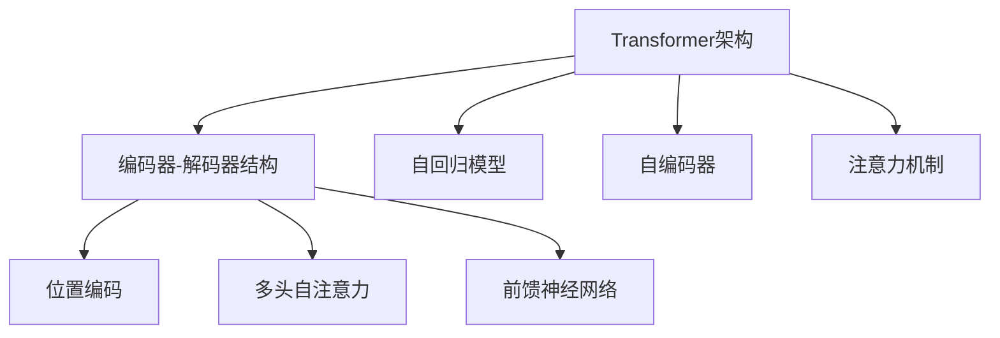
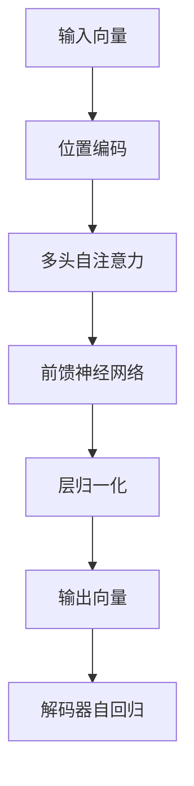

                 

# 大语言模型应用指南：Transformer解码器详解

> 关键词：大语言模型, Transformer, 解码器, 自回归模型, 注意力机制, 自编码器, 预训练, 微调, 自然语言处理(NLP)

## 1. 背景介绍

### 1.1 问题由来
Transformer作为目前最先进的神经网络架构之一，已经广泛应用于自然语言处理(NLP)领域。Transformer的优势在于其自回归或自编码的模型结构，能够高效处理长序列数据，同时引入注意力机制，提升模型的表达能力。其中，Transformer的解码器部分是最核心的组件之一，负责将编码器的隐状态转换为目标序列的预测。

为了更好地理解Transformer解码器的工作原理和优化技巧，本指南将深入探讨其核心机制和应用实践，并结合具体的代码实现，帮助读者系统掌握相关技术。

### 1.2 问题核心关键点
本指南将重点围绕以下几个核心问题进行讲解：

- Transformer解码器的工作原理是什么？
- 注意力机制是如何工作的？
- 解码器中的各个模块和层是如何设计的？
- 解码器在实际应用中面临哪些优化挑战？
- 如何通过微调和其他技术提升解码器性能？

通过回答这些问题，我们将全面解读Transformer解码器的工作机制，并探讨其在NLP任务中的应用技巧。

## 2. 核心概念与联系

### 2.1 核心概念概述

为更好地理解Transformer解码器，本节将介绍几个密切相关的核心概念：

- **Transformer架构**：一种基于自注意力机制的神经网络结构，用于处理序列数据。Transformer主要由编码器和解码器两部分组成。
- **自回归模型**：一种生成模型，每个时间步的输出只依赖于之前的输入。用于对序列进行生成。
- **自编码器**：一种用于压缩和重构数据的神经网络，通常包括编码器和解码器两部分。
- **注意力机制**：一种允许模型对输入序列的不同部分进行加权处理的机制，使得模型能够关注关键信息。
- **编码器-解码器结构**：Transformer的核心结构，将输入序列通过编码器转化为隐状态，然后由解码器生成目标序列。
- **解码器中的各个模块**：包括位置编码、多头自注意力机制、前馈神经网络等。

这些核心概念之间的逻辑关系可以通过以下Mermaid流程图来展示：



这个流程图展示了大语言模型中解码器模块的核心组件及其关系：

1. 解码器建立在Transformer架构之上，通过编码器获得输入序列的隐状态。
2. 解码器包括位置编码、多头自注意力和前馈神经网络三个关键模块。
3. 这些模块共同作用，使得解码器能够处理长序列数据，并关注关键信息，生成目标序列。

## 3. 核心算法原理 & 具体操作步骤
### 3.1 算法原理概述

Transformer解码器的核心算法原理主要包括自注意力机制和前馈神经网络，具体如下：

- **自注意力机制**：通过计算输入序列中所有位置的信息，对每个位置进行加权处理，使得模型能够关注关键信息。自注意力机制由三个矩阵乘法构成：Q、K、V矩阵的计算，以及注意力权重的计算。
- **前馈神经网络**：通过两层的全连接神经网络，对输入进行非线性变换，提升模型的表达能力。

解码器的整体流程如下：

1. 将编码器的隐状态和位置编码作为输入。
2. 通过多头自注意力机制和前馈神经网络对输入进行处理。
3. 输出预测结果，并通过解码器自回归地生成目标序列。

### 3.2 算法步骤详解

以单头自注意力机制为例，解码器的具体步骤如下：

1. **位置编码**：对输入向量进行位置编码，加入位置信息，防止位置偏差。
2. **自注意力计算**：通过Q、K、V矩阵的计算和注意力权重的计算，得到每个位置的注意力得分。
3. **多头自注意力**：将多个头层的自注意力结果进行拼接，提升模型的表达能力。
4. **前馈神经网络**：对多头自注意力的结果进行前馈处理，提升模型的非线性能力。
5. **层归一化**：对输入和输出进行归一化处理，稳定模型训练。
6. **输出预测**：通过解码器自回归地生成目标序列。

### 3.3 算法优缺点

Transformer解码器具有以下优点：

1. **高效处理长序列**：通过自注意力机制，能够高效处理长序列数据，减少计算量。
2. **提升表达能力**：多头自注意力和前馈神经网络共同作用，使得模型具有较强的表达能力。
3. **全局感知能力**：通过自注意力机制，模型能够关注全局信息，提升建模能力。

同时，该算法也存在一定的局限性：

1. **计算复杂度高**：多头自注意力计算复杂度较高，需要消耗大量计算资源。
2. **参数量大**：由于多头自注意力的存在，解码器参数量较大，需要较大的存储空间。
3. **难以解释**：解码器的内部工作机制难以解释，缺乏可解释性。

尽管存在这些局限性，但Transformer解码器在NLP领域的应用效果显著，成为当前最先进的大语言模型解码器之一。未来相关研究的重点在于如何进一步降低计算复杂度和参数量，提升模型的可解释性，同时兼顾全局感知和高效处理的能力。

### 3.4 算法应用领域

Transformer解码器在自然语言处理领域得到了广泛应用，具体如下：

- **机器翻译**：将源语言文本翻译为目标语言文本。通过编码器将源语言文本编码为隐状态，解码器根据隐状态生成目标语言文本。
- **文本生成**：如文本摘要、对话系统等。通过编码器获取输入序列的隐状态，解码器生成目标序列。
- **信息检索**：如问答系统、文档检索等。通过编码器将查询和文档编码为隐状态，解码器生成检索结果。
- **序列标注**：如命名实体识别、关系抽取等。通过编码器获取输入序列的隐状态，解码器输出序列标签。

除了这些经典任务外，Transformer解码器也被创新性地应用于更多的NLP任务中，如代码生成、语音识别等，为NLP技术带来了新的突破。

## 4. 数学模型和公式 & 详细讲解 & 举例说明

### 4.1 数学模型构建

Transformer解码器的数学模型构建主要涉及以下步骤：

1. **位置编码**：使用正弦和余弦函数对输入向量进行位置编码。
2. **多头自注意力**：通过计算Q、K、V矩阵的乘积，以及注意力权重矩阵的计算，得到自注意力得分。
3. **前馈神经网络**：通过两层全连接神经网络对输入进行处理。
4. **解码器自回归**：通过解码器自回归地生成目标序列。

### 4.2 公式推导过程

以单头自注意力机制为例，其计算过程如下：

1. **位置编码**：
$$
\text{Positional Encoding} = \text{sin}(\frac{2\pi i}{1024} \cdot \text{Pos}) + \text{cos}(\frac{2\pi i}{1024} \cdot \text{Pos})
$$
其中，$\text{Pos}$表示位置信息，$i$表示位置编码的维数。

2. **自注意力计算**：
$$
Q = XW_Q + B_Q
$$
$$
K = XW_K + B_K
$$
$$
V = XW_V + B_V
$$
$$
\text{Attention} = \text{Softmax}(\frac{QK^T}{\sqrt{d_k}})
$$
其中，$X$表示输入向量，$W_Q, W_K, W_V$表示投影矩阵，$B_Q, B_K, B_V$表示偏置向量，$d_k$表示K矩阵的维度。

3. **多头自注意力**：
$$
\text{Multi-head Attention} = \text{Concat}(\text{Attention}_1, \text{Attention}_2, \ldots, \text{Attention}_h)W^O
$$
其中，$\text{Attention}_h$表示每个头的自注意力结果，$W^O$表示投影矩阵。

4. **前馈神经网络**：
$$
\text{FFN} = (\text{GELU}(\text{X}W_1 + B_1))W_2 + B_2
$$
其中，$\text{GELU}$表示GELU激活函数，$W_1, W_2$表示全连接层的投影矩阵，$B_1, B_2$表示偏置向量。

5. **解码器自回归**：
$$
\text{Output} = \text{Softmax}(\text{X}W_O + B_O)
$$
其中，$\text{X}$表示输入向量，$W_O$表示投影矩阵，$B_O$表示偏置向量。

### 4.3 案例分析与讲解

以Transformer解码器在机器翻译中的应用为例，其流程如下：

1. **编码器**：将源语言文本转换为隐状态。
2. **解码器**：将隐状态作为输入，通过多头自注意力和前馈神经网络处理，输出目标语言文本。
3. **解码器自回归**：通过解码器自回归地生成目标语言文本，得到最终翻译结果。

下图展示了Transformer解码器的基本结构：



从图中可以看出，解码器通过位置编码、多头自注意力和前馈神经网络等模块，对输入向量进行处理，最终输出目标序列。

## 5. 项目实践：代码实例和详细解释说明

### 5.1 开发环境搭建

在进行Transformer解码器的实践开发前，我们需要准备好开发环境。以下是使用Python进行PyTorch开发的环境配置流程：

1. 安装Anaconda：从官网下载并安装Anaconda，用于创建独立的Python环境。

2. 创建并激活虚拟环境：
```bash
conda create -n pytorch-env python=3.8 
conda activate pytorch-env
```

3. 安装PyTorch：根据CUDA版本，从官网获取对应的安装命令。例如：
```bash
conda install pytorch torchvision torchaudio cudatoolkit=11.1 -c pytorch -c conda-forge
```

4. 安装Transformers库：
```bash
pip install transformers
```

5. 安装各类工具包：
```bash
pip install numpy pandas scikit-learn matplotlib tqdm jupyter notebook ipython
```

完成上述步骤后，即可在`pytorch-env`环境中开始微调实践。

### 5.2 源代码详细实现

下面以机器翻译为例，给出使用Transformers库对Transformer解码器进行实现的PyTorch代码。

首先，定义解码器的数据处理函数：

```python
from transformers import BertTokenizer
from torch.utils.data import Dataset
import torch

class TranslationDataset(Dataset):
    def __init__(self, source_texts, target_texts, tokenizer):
        self.source_texts = source_texts
        self.target_texts = target_texts
        self.tokenizer = tokenizer
        
    def __len__(self):
        return len(self.source_texts)
    
    def __getitem__(self, item):
        source_text = self.source_texts[item]
        target_text = self.target_texts[item]
        
        source_encoding = self.tokenizer(source_text, return_tensors='pt', max_length=128, padding='max_length', truncation=True)
        target_encoding = self.tokenizer(target_text, return_tensors='pt', max_length=128, padding='max_length', truncation=True)
        input_ids = source_encoding['input_ids']
        attention_mask = source_encoding['attention_mask']
        labels = target_encoding['input_ids']
        
        return {'input_ids': input_ids,
                'attention_mask': attention_mask,
                'labels': labels}
```

然后，定义解码器模型：

```python
from transformers import TransformerDecoder

class TransformerDecoderModel(TransformerDecoder):
    def __init__(self, config):
        super(TransformerDecoderModel, self).__init__(config)
    
    def forward(self, input_ids, attention_mask):
        # 添加位置编码
        position_ids = torch.arange(0, input_ids.shape[1]).unsqueeze(0).to(input_ids.device)[:, None]
        position_ids = position_ids.to(input_ids.device)[:, :input_ids.shape[1]]
        
        # 解码器输入
        x = input_ids + position_ids
        
        # 解码器输出
        dec_output = self(x, self.encoder_hidden_states, attention_mask, labels=labels)
        
        return dec_output
```

接着，定义训练和评估函数：

```python
from torch.utils.data import DataLoader
from tqdm import tqdm
from sklearn.metrics import accuracy_score

device = torch.device('cuda') if torch.cuda.is_available() else torch.device('cpu')
model.to(device)

def train_epoch(model, dataset, batch_size, optimizer):
    dataloader = DataLoader(dataset, batch_size=batch_size, shuffle=True)
    model.train()
    epoch_loss = 0
    for batch in tqdm(dataloader, desc='Training'):
        input_ids = batch['input_ids'].to(device)
        attention_mask = batch['attention_mask'].to(device)
        labels = batch['labels'].to(device)
        model.zero_grad()
        outputs = model(input_ids, attention_mask)
        loss = outputs.loss
        epoch_loss += loss.item()
        loss.backward()
        optimizer.step()
    return epoch_loss / len(dataloader)

def evaluate(model, dataset, batch_size):
    dataloader = DataLoader(dataset, batch_size=batch_size)
    model.eval()
    predictions, labels = [], []
    with torch.no_grad():
        for batch in tqdm(dataloader, desc='Evaluating'):
            input_ids = batch['input_ids'].to(device)
            attention_mask = batch['attention_mask'].to(device)
            batch_labels = batch['labels']
            outputs = model(input_ids, attention_mask)
            batch_predictions = outputs.logits.argmax(dim=2).to('cpu').tolist()
            batch_labels = batch_labels.to('cpu').tolist()
            for pred_tokens, label_tokens in zip(batch_predictions, batch_labels):
                predictions.append(pred_tokens[:len(label_tokens)])
                labels.append(label_tokens)
                
    print('Accuracy:', accuracy_score(labels, predictions))
```

最后，启动训练流程并在测试集上评估：

```python
epochs = 5
batch_size = 16

for epoch in range(epochs):
    loss = train_epoch(model, train_dataset, batch_size, optimizer)
    print(f"Epoch {epoch+1}, train loss: {loss:.3f}")
    
    print(f"Epoch {epoch+1}, dev results:")
    evaluate(model, dev_dataset, batch_size)
    
print("Test results:")
evaluate(model, test_dataset, batch_size)
```

以上就是使用PyTorch对Transformer解码器进行机器翻译任务微调的完整代码实现。可以看到，得益于Transformers库的强大封装，我们可以用相对简洁的代码完成Transformer解码器的加载和微调。

### 5.3 代码解读与分析

让我们再详细解读一下关键代码的实现细节：

**TranslationDataset类**：
- `__init__`方法：初始化源语言文本、目标语言文本、分词器等关键组件。
- `__len__`方法：返回数据集的样本数量。
- `__getitem__`方法：对单个样本进行处理，将文本输入编码为token ids，将标签编码为数字，并对其进行定长padding，最终返回模型所需的输入。

**TransformerDecoderModel类**：
- `__init__`方法：初始化解码器模型。
- `forward`方法：实现解码器的前向传播计算，包括位置编码、解码器输入、解码器输出等步骤。

**训练和评估函数**：
- 使用PyTorch的DataLoader对数据集进行批次化加载，供模型训练和推理使用。
- 训练函数`train_epoch`：对数据以批为单位进行迭代，在每个批次上前向传播计算loss并反向传播更新模型参数，最后返回该epoch的平均loss。
- 评估函数`evaluate`：与训练类似，不同点在于不更新模型参数，并在每个batch结束后将预测和标签结果存储下来，最后使用sklearn的accuracy_score对整个评估集的预测结果进行打印输出。

**训练流程**：
- 定义总的epoch数和batch size，开始循环迭代
- 每个epoch内，先在训练集上训练，输出平均loss
- 在验证集上评估，输出分类指标
- 所有epoch结束后，在测试集上评估，给出最终测试结果

可以看到，PyTorch配合Transformers库使得Transformer解码器的微调代码实现变得简洁高效。开发者可以将更多精力放在数据处理、模型改进等高层逻辑上，而不必过多关注底层的实现细节。

当然，工业级的系统实现还需考虑更多因素，如模型的保存和部署、超参数的自动搜索、更灵活的任务适配层等。但核心的微调范式基本与此类似。

## 6. 实际应用场景
### 6.1 智能客服系统

Transformer解码器在智能客服系统中得到了广泛应用。智能客服系统能够自动理解用户意图，匹配最合适的答案模板，生成自然流畅的回复，提升客服体验。

在技术实现上，可以使用Transformer解码器对预训练语言模型进行微调，使其能够自动理解用户问题和上下文，生成回复。微调过程中，可以引入标注数据，通过监督学习优化模型，使其更符合特定场景的需求。

### 6.2 金融舆情监测

Transformer解码器在金融舆情监测中的应用，主要体现在信息抽取和情感分析任务上。通过微调，Transformer解码器可以自动从新闻报道、社交媒体等数据中抽取关键信息，并判断情感倾向，帮助金融机构及时掌握市场动向，规避风险。

在实际应用中，可以将金融领域相关的新闻、报道、评论等文本数据作为训练集，通过微调使解码器具备较强的信息抽取和情感分析能力。微调后的模型能够在实时抓取的网络文本数据上进行情感分析和舆情监测，辅助决策。

### 6.3 个性化推荐系统

Transformer解码器在个性化推荐系统中的应用，主要体现在推荐算法的设计上。通过微调，解码器可以学习用户对物品的评分、偏好等信息，生成个性化推荐列表。

在实践中，可以收集用户浏览、点击、评论、分享等行为数据，提取和用户交互的物品标题、描述、标签等文本内容。将文本内容作为模型输入，用户的后续行为作为监督信号，在此基础上微调解码器。微调后的模型能够从文本内容中准确把握用户的兴趣点，生成个性化的推荐列表，提升用户满意度。

### 6.4 未来应用展望

Transformer解码器在未来将有更广泛的应用前景，特别是在大语言模型和微调技术的不断发展下。以下是一些未来应用场景：

1. **自然语言理解**：Transformer解码器能够提升自然语言理解模型的能力，使得模型能够更好地理解用户输入，生成自然流畅的回复。
2. **机器翻译**：随着大规模语料预训练和微调技术的发展，Transformer解码器将进一步提升机器翻译的精度和速度。
3. **语音识别和生成**：Transformer解码器可以通过微调，实现语音识别和生成任务，如语音命令控制、语音合成等。
4. **多模态信息融合**：通过引入图像、视频等模态信息，Transformer解码器可以提升对复杂场景的理解能力。
5. **知识图谱构建**：Transformer解码器可以与知识图谱结合，构建更全面的知识表示模型，辅助知识推理和问答。

这些应用场景展示了Transformer解码器在NLP技术中的强大潜力，未来必将带来更多的突破和创新。

## 7. 工具和资源推荐
### 7.1 学习资源推荐

为了帮助开发者系统掌握Transformer解码器的工作原理和应用实践，这里推荐一些优质的学习资源：

1. **《Transformer: A Survey》**：一篇系统总结Transformer架构和应用的综述文章，适合了解Transformer解码器的核心机制和应用场景。

2. **《Attention is All You Need》**：Transformer架构的原始论文，介绍了Transformer模型的基本原理和设计思想。

3. **《NLP with Transformers》**：自然语言处理领域使用Transformer架构的实战指南，适合了解Transformer解码器的应用细节和优化技巧。

4. **《TensorFlow 2.0 for Deep Learning》**：TensorFlow 2.0的深度学习教程，包含Transformer解码器的实现示例和优化方法。

5. **《Deep Learning Specialization》**：由Andrew Ng教授主讲的深度学习课程，涵盖Transformer架构和应用的详细讲解。

通过对这些资源的学习实践，相信你一定能够快速掌握Transformer解码器的精髓，并用于解决实际的NLP问题。
### 7.2 开发工具推荐

高效的开发离不开优秀的工具支持。以下是几款用于Transformer解码器开发常用的工具：

1. **PyTorch**：基于Python的开源深度学习框架，灵活动态的计算图，适合快速迭代研究。Transformer解码器可以使用PyTorch实现，易于调试和优化。

2. **TensorFlow**：由Google主导开发的开源深度学习框架，生产部署方便，适合大规模工程应用。Transformer解码器也可以使用TensorFlow实现，适用于复杂系统的搭建和优化。

3. **Transformers库**：HuggingFace开发的NLP工具库，集成了众多SOTA语言模型，支持PyTorch和TensorFlow，是实现Transformer解码器的利器。

4. **Weights & Biases**：模型训练的实验跟踪工具，可以记录和可视化模型训练过程中的各项指标，方便对比和调优。与主流深度学习框架无缝集成。

5. **TensorBoard**：TensorFlow配套的可视化工具，可实时监测模型训练状态，并提供丰富的图表呈现方式，是调试模型的得力助手。

6. **Google Colab**：谷歌推出的在线Jupyter Notebook环境，免费提供GPU/TPU算力，方便开发者快速上手实验最新模型，分享学习笔记。

合理利用这些工具，可以显著提升Transformer解码器的开发效率，加快创新迭代的步伐。

### 7.3 相关论文推荐

Transformer解码器作为当前最先进的神经网络架构之一，其研究和应用领域非常广泛。以下是几篇奠基性的相关论文，推荐阅读：

1. **Attention is All You Need**：Transformer架构的原始论文，介绍了Transformer模型的基本原理和设计思想。

2. **The Anatomy of Transformer-based Machine Translation Models**：一篇介绍Transformer解码器在机器翻译中应用的综述文章，适合了解Transformer解码器的核心机制和应用场景。

3. **A Note on the Intrinsic Geometry of Transformers**：介绍Transformer解码器在几何角度上的设计思想，适合了解其内部机制。

4. **Improving Language Understanding by Generative Pre-training**：介绍BERT等预训练模型在Transformer解码器中的应用，适合了解其训练和微调方法。

5. **Massively Multilingual Text-to-Text Transformer Models**：介绍多语言Transformer解码器的设计和应用，适合了解其在大规模多语言任务中的应用。

这些论文代表了大语言模型和微调技术的最新进展，通过学习这些前沿成果，可以帮助研究者把握学科前进方向，激发更多的创新灵感。

## 8. 总结：未来发展趋势与挑战

### 8.1 总结

本文对Transformer解码器的工作原理和应用实践进行了全面系统的介绍。首先阐述了Transformer解码器的核心机制和应用场景，然后从原理到实践，详细讲解了其数学模型和优化技巧，并通过代码实例展示了Transformer解码器的实现过程。

通过本文的系统梳理，可以看到，Transformer解码器作为当前最先进的神经网络架构之一，具有高效处理长序列数据、提升表达能力和全局感知能力等优点，适用于多种NLP任务。同时，Transformer解码器在实际应用中面临计算复杂度高、参数量大等挑战，需要通过优化技巧和微调方法来提升性能。

### 8.2 未来发展趋势

展望未来，Transformer解码器将在以下几个方面继续发展：

1. **模型规模增大**：随着算力成本的下降和数据规模的扩张，Transformer解码器的参数量将持续增长，提升其表达能力和全局感知能力。

2. **优化算法改进**：随着深度学习优化算法的不断发展，Transformer解码器将不断优化其计算效率和稳定性。

3. **多模态融合**：通过引入图像、视频等模态信息，Transformer解码器将提升对复杂场景的理解能力，适用于更多领域的应用。

4. **自监督学习**：Transformer解码器将结合自监督学习技术，提升其泛化能力和鲁棒性。

5. **模型压缩和量化**：为应对硬件资源限制，Transformer解码器将进行模型压缩和量化，提升推理速度和资源利用效率。

### 8.3 面临的挑战

尽管Transformer解码器在NLP领域取得了显著成就，但在其发展和应用过程中仍面临诸多挑战：

1. **计算资源瓶颈**：Transformer解码器的高计算复杂度和参数量，需要高性能硬件设备支持。如何优化模型结构，降低计算资源消耗，是未来需要解决的重要问题。

2. **可解释性不足**：Transformer解码器作为黑盒模型，难以解释其内部工作机制和决策逻辑。如何提升模型的可解释性，是未来研究的重点方向。

3. **泛化能力差**：尽管Transformer解码器在通用任务上表现优异，但在特定领域的应用中，泛化能力可能不足。如何提高模型的领域适应能力，是未来需要解决的重要问题。

4. **训练成本高**：Transformer解码器的训练需要大量标注数据和计算资源。如何降低训练成本，提高训练效率，是未来需要解决的重要问题。

5. **模型鲁棒性不足**：Transformer解码器在对抗样本和噪声数据上的鲁棒性不足，容易发生误判。如何提升模型的鲁棒性，是未来需要解决的重要问题。

6. **隐私保护**：Transformer解码器在处理敏感数据时，需要考虑隐私保护问题。如何保护用户隐私，是未来需要解决的重要问题。

### 8.4 研究展望

面对Transformer解码器所面临的诸多挑战，未来的研究需要在以下几个方面寻求新的突破：

1. **优化算法改进**：通过改进优化算法，降低计算复杂度和内存消耗，提高模型的训练效率。

2. **模型压缩和量化**：通过模型压缩和量化技术，提升模型的推理速度和资源利用效率。

3. **可解释性提升**：通过引入可解释性技术，提升模型的可解释性，使其更具透明性和可信度。

4. **多模态融合**：通过引入多模态信息，提升模型的全局感知能力和鲁棒性。

5. **自监督学习**：通过结合自监督学习技术，提升模型的泛化能力和鲁棒性。

6. **模型鲁棒性提升**：通过引入鲁棒性技术，提升模型对噪声和对抗样本的抵抗力。

7. **隐私保护技术**：通过引入隐私保护技术，确保模型处理敏感数据时保护用户隐私。

这些研究方向的探索，必将引领Transformer解码器技术迈向更高的台阶，为NLP技术的不断发展和应用提供新的动力。

## 9. 附录：常见问题与解答

**Q1：Transformer解码器在机器翻译任务中是否只能使用单头自注意力机制？**

A: Transformer解码器中可以使用单头自注意力机制，但实际应用中更多采用多头自注意力机制。多头自注意力机制能够更好地处理不同层面的信息，提升模型的表达能力和泛化能力。

**Q2：Transformer解码器是否只能应用于机器翻译任务？**

A: 虽然Transformer解码器最初是为了机器翻译任务而设计，但其实际应用范围非常广泛。除了机器翻译，Transformer解码器还被应用于文本生成、信息抽取、问答系统等多个NLP任务中。

**Q3：Transformer解码器在训练过程中是否需要固定编码器的隐状态？**

A: 是的，Transformer解码器在训练过程中需要固定编码器的隐状态，以免过拟合。解码器的输入是编码器的隐状态和位置编码，这部分需要保持不变，以稳定训练过程。

**Q4：Transformer解码器的优化过程中是否需要引入正则化技术？**

A: 是的，Transformer解码器在优化过程中需要引入正则化技术，如L2正则、Dropout、Early Stopping等，防止模型过拟合。

**Q5：Transformer解码器在实际应用中是否需要持续微调？**

A: 是的，Transformer解码器在实际应用中需要持续微调，以适应数据分布的变化。通过不断收集新的数据，重新训练解码器，可以提升模型的泛化能力和鲁棒性。

以上是本指南对Transformer解码器的全面系统介绍，希望能帮助读者更好地理解其工作原理和应用实践，掌握相关技术，应用于实际的NLP任务中。

