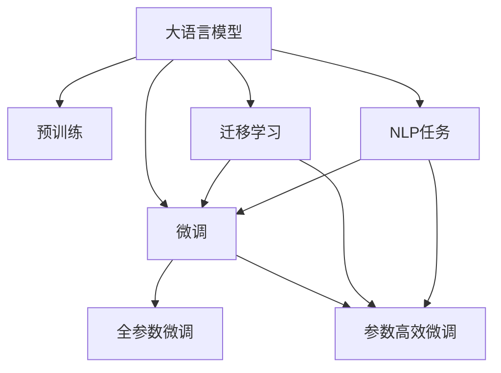

                 

# 大语言模型应用指南：机器学习的过程

> 关键词：大语言模型,机器学习,深度学习,自然语言处理,NLP应用,模型优化,深度学习框架,技术博客

## 1. 背景介绍

### 1.1 问题由来
随着深度学习技术的发展，大语言模型（Large Language Models, LLMs）如BERT、GPT系列等，已经成为自然语言处理（NLP）领域的核心技术。这些模型在预训练阶段通过大规模无标签文本数据的自监督学习，学习到了丰富的语言知识，并在微调阶段通过少量有标签数据，快速适应特定任务，取得了显著的性能提升。

但即便如此，大语言模型的应用仍面临诸多挑战：如何选择合适的预训练模型、如何进行有效的微调、如何处理不同类型的NLP任务等。本文将深入探讨这些问题，并提供一套系统的机器学习流程，帮助开发者更高效地利用大语言模型解决实际问题。

### 1.2 问题核心关键点
大语言模型的应用主要围绕两个核心过程：预训练和微调。预训练通过大规模无标签数据学习通用语言知识，微调则是针对具体任务进行参数优化，以获得更好的性能。本指南将详细介绍这两个过程，并结合实际案例，帮助读者掌握大语言模型的应用技巧。

## 2. 核心概念与联系

### 2.1 核心概念概述

为更好地理解大语言模型的应用流程，我们先介绍几个核心概念及其相互联系：

- 大语言模型（LLMs）：通过大规模数据预训练，学习到丰富语言知识的模型，如BERT、GPT等。
- 预训练（Pre-training）：使用大规模无标签数据进行自监督学习，学习通用语言表示。
- 微调（Fine-tuning）：使用少量有标签数据，针对特定任务进行模型优化。
- 迁移学习（Transfer Learning）：将预训练模型迁移到特定任务中，利用已有知识提升模型性能。
- 深度学习框架（如PyTorch、TensorFlow）：用于构建和训练大语言模型的工具库。
- 自然语言处理（NLP）：涉及文本处理、文本分类、情感分析、机器翻译等任务的学科。
- 优化算法（如Adam、SGD）：用于更新模型参数，最小化损失函数的算法。

这些概念之间有着密切的联系，共同构成了大语言模型应用的框架。以下是一个Mermaid流程图，展示了这些概念之间的联系：



该图展示了预训练、微调和迁移学习的过程，以及它们在大语言模型中的应用。

## 3. 核心算法原理 & 具体操作步骤
### 3.1 算法原理概述

大语言模型的应用基于机器学习原理，主要包括预训练和微调两个阶段。预训练阶段使用无标签数据，通过自监督学习任务学习通用语言知识，生成预训练模型。微调阶段则使用少量有标签数据，通过有监督学习任务，对预训练模型进行优化，适应特定任务。

### 3.2 算法步骤详解

#### 3.2.1 预训练过程
预训练过程分为以下几个步骤：

1. 数据收集与准备：收集大规模无标签文本数据，如维基百科、新闻、社交媒体等，并进行清洗和分词处理。
2. 模型构建：选择合适的深度学习框架（如PyTorch、TensorFlow），构建预训练模型。常用的模型包括BERT、GPT等。
3. 自监督学习：设计自监督学习任务，如掩码语言模型（Masked Language Modeling, MLM）、下一句预测（Next Sentence Prediction, NSP）等，在预训练模型上进行训练。
4. 模型评估：使用预训练数据集上的验证集，评估模型的性能。
5. 迭代优化：根据验证集上的性能，调整模型参数，进行多次迭代训练。

#### 3.2.2 微调过程
微调过程大致如下：

1. 数据准备：准备下游任务的标注数据集，划分为训练集、验证集和测试集。
2. 模型选择：选择预训练模型，并添加任务适配层，如分类器、解码器等。
3. 超参数设置：设置学习率、批大小、优化器等超参数。
4. 训练与验证：在训练集上进行有监督学习，在验证集上评估模型性能，调整超参数。
5. 测试与部署：在测试集上评估微调后模型的性能，将模型部署到实际应用中。

### 3.3 算法优缺点

#### 3.3.1 优点
- 高效性：预训练模型通过大规模数据学习通用语言知识，微调时只需少量数据即可快速适应新任务，显著提升模型性能。
- 泛化能力：预训练模型学习到的是通用语言知识，能够跨任务迁移，应用于多种NLP任务。
- 鲁棒性：预训练模型经过大量数据训练，具有一定的鲁棒性，能够应对不同领域的语言变化。

#### 3.3.2 缺点
- 计算成本高：预训练和微调过程需要大量的计算资源，特别是在大规模数据和模型的情况下。
- 数据依赖性强：微调的效果高度依赖于下游任务的标注数据质量。
- 模型复杂性：大规模预训练模型复杂度较高，微调时可能出现梯度消失等问题。

### 3.4 算法应用领域

大语言模型在NLP领域有广泛的应用，主要包括以下几个方面：

1. 文本分类：如情感分析、主题分类等。
2. 命名实体识别：识别文本中的实体，如人名、地名、组织机构名等。
3. 关系抽取：从文本中提取实体之间的关系。
4. 机器翻译：将一种语言的文本翻译成另一种语言。
5. 问答系统：回答自然语言问题。
6. 摘要生成：自动生成文本摘要。

## 4. 数学模型和公式 & 详细讲解 & 举例说明
### 4.1 数学模型构建

以BERT为例，其预训练模型包含多层Transformer结构，每个层都由多头自注意力机制和前馈神经网络组成。模型参数 $\theta$ 包括所有层的权重和偏置。

### 4.2 公式推导过程

#### 4.2.1 预训练损失函数
BERT的预训练过程包括掩码语言模型和下一句预测两个任务。掩码语言模型的损失函数为：

$$
\mathcal{L}_{MLM} = -\frac{1}{N}\sum_{i=1}^N \log P(w_i|\{w_1,\dots,w_{i-1},M(w_{i+1},\dots,w_N)\})
$$

其中 $P(w_i|\{w_1,\dots,w_{i-1},M(w_{i+1},\dots,w_N)\})$ 表示在上下文序列中，给定上下文信息，预测第 $i$ 个单词的概率。

#### 4.2.2 微调损失函数
微调任务的形式和目标函数与预训练任务类似，但任务适配层和损失函数需要根据具体任务进行调整。以情感分类为例，微调过程的损失函数为：

$$
\mathcal{L}_{Fine-tune} = -\frac{1}{N}\sum_{i=1}^N \sum_{j=1}^M \log P(y_j|x_i)
$$

其中 $P(y_j|x_i)$ 表示在输入文本 $x_i$ 下，预测第 $j$ 个类别的概率。

### 4.3 案例分析与讲解

以情感分类任务为例，假设模型结构为BERT+线性分类器。预训练后，需要微调模型以适应情感分类任务。具体步骤如下：

1. 准备情感分类数据集，分为训练集、验证集和测试集。
2. 使用预训练模型，并添加线性分类器和交叉熵损失函数。
3. 设置超参数，如学习率、批大小等。
4. 在训练集上进行有监督学习，并在验证集上评估性能。
5. 使用测试集评估最终模型性能，并部署到实际应用中。

## 5. 项目实践：代码实例和详细解释说明
### 5.1 开发环境搭建

搭建开发环境的步骤如下：

1. 安装Python和PyTorch：
```bash
pip install torch torchtext transformers
```

2. 准备数据集：使用数据集，如IMDb电影评论数据集。
```python
import torchtext
from torchtext.datasets import IMDB

train_data, test_data = IMDB.splits()

# 定义数据预处理函数
def tokenize(text):
    return tokenizer.tokenize(text)

train_data = torchtext.data.utils.get_tokenizer(train_data, tokenize=tokenize)
test_data = torchtext.data.utils.get_tokenizer(test_data, tokenize=tokenize)

# 定义数据转换函数
def make_tensor(x, y=None):
    return torch.tensor(x), torch.tensor(y)

train_data = torchtext.data.utils.make_tensor_dataset(train_data, make_tensor=make_tensor)
test_data = torchtext.data.utils.make_tensor_dataset(test_data, make_tensor=make_tensor)
```

### 5.2 源代码详细实现

以下是一个使用PyTorch实现BERT微调的示例代码：

```python
import torch
from transformers import BertForSequenceClassification, BertTokenizer

# 定义数据预处理函数
def tokenize(text):
    return tokenizer.tokenize(text)

# 定义数据转换函数
def make_tensor(x, y=None):
    return torch.tensor(x), torch.tensor(y)

# 准备数据集
train_data, test_data = IMDB.splits()

train_data = torchtext.data.utils.get_tokenizer(train_data, tokenize=tokenize)
test_data = torchtext.data.utils.get_tokenizer(test_data, tokenize=tokenize)

train_data = torchtext.data.utils.make_tensor_dataset(train_data, make_tensor=make_tensor)
test_data = torchtext.data.utils.make_tensor_dataset(test_data, make_tensor=make_tensor)

# 构建模型
model = BertForSequenceClassification.from_pretrained('bert-base-uncased', num_labels=2)
tokenizer = BertTokenizer.from_pretrained('bert-base-uncased')

# 定义超参数
learning_rate = 2e-5
num_epochs = 3
batch_size = 16

# 定义训练函数
def train(model, train_loader, optimizer):
    model.train()
    for epoch in range(num_epochs):
        for batch in train_loader:
            input_ids, attention_mask, labels = batch
            optimizer.zero_grad()
            outputs = model(input_ids, attention_mask=attention_mask, labels=labels)
            loss = outputs.loss
            loss.backward()
            optimizer.step()

# 定义评估函数
def evaluate(model, test_loader):
    model.eval()
    correct = 0
    total = 0
    for batch in test_loader:
        input_ids, attention_mask, labels = batch
        outputs = model(input_ids, attention_mask=attention_mask)
        _, predicted = torch.max(outputs.logits, dim=1)
        total += labels.size(0)
        correct += (predicted == labels).sum().item()
    return correct / total

# 定义训练和评估函数
train_loader = torch.utils.data.DataLoader(train_data, batch_size=batch_size, shuffle=True)
test_loader = torch.utils.data.DataLoader(test_data, batch_size=batch_size, shuffle=False)

optimizer = torch.optim.Adam(model.parameters(), lr=learning_rate)

for epoch in range(num_epochs):
    train(model, train_loader, optimizer)
    accuracy = evaluate(model, test_loader)
    print(f"Epoch {epoch+1}, accuracy: {accuracy:.4f}")
```

### 5.3 代码解读与分析

上述代码实现了BERT模型在情感分类任务上的微调。具体步骤如下：

1. 准备数据集，并进行预处理和转换。
2. 构建BERT模型和预训练分词器。
3. 定义超参数，如学习率、批大小等。
4. 定义训练函数，进行多次迭代训练。
5. 定义评估函数，在测试集上评估模型性能。

## 6. 实际应用场景
### 6.1 智能客服系统

智能客服系统是大语言模型应用的重要场景之一。通过微调，模型可以学习到客户咨询的常见问题和标准回复，自动回答客户问题，提升客户体验和问题解决效率。

### 6.2 金融舆情监测

金融舆情监测需要实时监测市场舆论动向，以防止负面信息对金融市场的影响。通过微调，模型可以自动识别新闻、评论等文本中的情感倾向和主题信息，及时预警负面舆情，帮助金融机构制定应对策略。

### 6.3 个性化推荐系统

个性化推荐系统可以根据用户的历史行为数据，推荐用户可能感兴趣的内容。通过微调，模型可以更好地理解用户兴趣，提供更加精准的推荐结果。

### 6.4 未来应用展望

未来，大语言模型将在更多领域得到应用，如智慧医疗、智能教育、智慧城市等。通过微调，模型可以适应各种垂直领域的特定任务，提升系统性能和用户体验。

## 7. 工具和资源推荐
### 7.1 学习资源推荐

- 《深度学习与自然语言处理》：介绍深度学习在NLP领域的应用，包括预训练和微调等技术。
- 《Transformers教程》：Hugging Face官方教程，详细介绍了如何使用Transformers库进行NLP任务开发。
- PyTorch官方文档：PyTorch框架的官方文档，提供了丰富的教程和样例代码。

### 7.2 开发工具推荐

- PyTorch：灵活的深度学习框架，支持GPU加速。
- TensorFlow：广泛应用于大规模生产环境的深度学习框架。
- Transformers库：Hugging Face开发的NLP库，提供了丰富的预训练模型和微调样例。

### 7.3 相关论文推荐

- Attention is All You Need：提出Transformer结构，开启了预训练大模型时代。
- BERT: Pre-training of Deep Bidirectional Transformers for Language Understanding：提出BERT模型，引入自监督学习任务。
- Parameter-Efficient Transfer Learning for NLP：提出 Adapter等参数高效微调方法。

## 8. 总结：未来发展趋势与挑战
### 8.1 总结

本文详细介绍了大语言模型在NLP领域的应用流程，从预训练到微调，涉及多个核心概念和关键技术。通过实际案例和代码示例，帮助读者掌握了如何使用大语言模型解决实际问题。

### 8.2 未来发展趋势

未来，大语言模型的应用将呈现以下几个趋势：

1. 模型规模进一步增大：随着算力成本下降和数据规模增长，大语言模型的参数量将继续增加，学习到的语言知识将更加丰富。
2. 微调方法更加多样化：除了传统的全参数微调，未来的微调方法将更加高效和灵活，如参数高效微调、少样本学习和零样本学习等。
3. 跨领域迁移能力提升：模型将具备更强的跨领域迁移能力，能够在不同领域应用中取得优异表现。
4. 多模态融合：未来的大语言模型将支持多模态数据的融合，提升在视觉、语音等领域的性能。
5. 持续学习：模型将具备持续学习能力，能够不断吸收新数据和新知识，适应数据分布的变化。

### 8.3 面临的挑战

尽管大语言模型在NLP领域取得了显著成果，但仍面临以下挑战：

1. 标注数据成本高：微调模型依赖高质量标注数据，标注成本较高，特别是在长尾任务中。
2. 模型鲁棒性不足：模型对新数据和新领域的泛化能力有限，可能出现鲁棒性问题。
3. 推理效率低：大规模语言模型推理速度较慢，需要优化模型结构和算法，提升推理效率。
4. 可解释性不足：模型通常被认为是“黑盒”系统，难以解释其决策过程，影响用户信任和接受度。
5. 安全性问题：模型可能学习到有害信息和偏见，需要加强数据和算法的伦理审查和安全防护。

### 8.4 研究展望

未来，大语言模型的研究将从以下几个方面进行探索：

1. 无监督和半监督微调方法：利用无标签数据进行预训练，降低标注成本。
2. 参数高效微调技术：只调整少量参数，减小计算资源消耗。
3. 多模态融合：将视觉、语音等多模态数据与文本数据结合，提升模型性能。
4. 因果学习和博弈论：引入因果分析和博弈论工具，提高模型的稳定性和鲁棒性。
5. 伦理和安全：建立模型行为监管机制，保障数据和模型的安全。

通过这些研究方向和突破，大语言模型将在NLP领域进一步提升其应用性能，为各行各业提供更高效、更可靠、更安全的解决方案。

## 9. 附录：常见问题与解答
### 9.1 常见问题

#### Q1：如何选择预训练模型？

A: 选择预训练模型应考虑以下几个因素：
- 任务类型：不同任务适用于不同的预训练模型，如BERT适用于序列建模，GPT适用于生成任务。
- 数据规模：大规模预训练模型通常具有更好的泛化能力，但训练和微调成本更高。
- 模型复杂度：复杂度高的模型通常性能更好，但也更难优化。

#### Q2：如何避免过拟合？

A: 避免过拟合的方法包括：
- 数据增强：通过数据变换、回译等方式丰富训练集。
- 正则化：使用L2正则、Dropout等方法抑制过拟合。
- 对抗训练：引入对抗样本，提高模型鲁棒性。

#### Q3：如何提升模型效率？

A: 提升模型效率的方法包括：
- 模型压缩：通过剪枝、量化等方法减少模型尺寸。
- 硬件加速：利用GPU、TPU等硬件设备进行加速。
- 并行计算：使用分布式计算、模型并行等技术提升计算效率。

#### Q4：如何提高模型可解释性？

A: 提高模型可解释性的方法包括：
- 解释工具：使用LIME、SHAP等工具解释模型决策过程。
- 可视化技术：通过可视化工具展示模型内部工作机制。

#### Q5：如何保障模型安全性？

A: 保障模型安全性的方法包括：
- 数据脱敏：在训练和推理过程中，对敏感数据进行脱敏处理。
- 安全审计：定期进行模型安全审计，发现并修复潜在漏洞。
- 伦理审查：建立模型伦理审查机制，确保模型行为符合社会价值观和伦理规范。

---

作者：禅与计算机程序设计艺术 / Zen and the Art of Computer Programming

