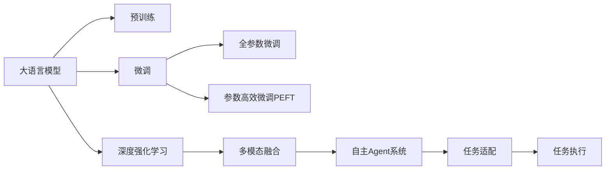

                 

# 大语言模型应用指南：自主Agent系统

> 关键词：大语言模型,自主Agent系统,深度强化学习,深度学习,多模态融合

## 1. 背景介绍

### 1.1 问题由来

随着人工智能技术的快速发展，大语言模型（Large Language Models, LLMs）在自然语言处理（Natural Language Processing, NLP）领域取得了显著进展。这些模型，如GPT-3、BERT等，通过在海量无标签文本数据上预训练，能够学习到复杂的语言结构和语义关系。然而，这些通用模型缺乏自主决策能力，往往需要人类干预才能完成特定任务。

近年来，随着深度强化学习（Deep Reinforcement Learning, DRL）的兴起，研究人员开始探索将大语言模型与强化学习相结合，构建自主Agent系统，即能够在无人工干预的情况下自主完成特定任务的智能系统。这种系统不仅能够理解语言的复杂性，还能通过学习优化自身的决策行为，从而在更广泛的应用场景中展现其潜力。

### 1.2 问题核心关键点

自主Agent系统的构建涉及大语言模型、深度强化学习、多模态融合等多个关键领域，需要解决以下几个核心问题：

1. **语言理解与生成**：如何使Agent系统能够理解自然语言输入，并能够通过语言生成策略完成任务。
2. **自主决策**：如何在复杂环境中自主做出最优决策，从而实现目标。
3. **多模态融合**：如何将文本、图像、语音等多模态数据进行有效融合，提升系统的感知和推理能力。
4. **安全与伦理**：如何确保Agent系统的决策过程和输出符合道德规范，避免偏见和误导性信息。
5. **可解释性与透明性**：如何提供Agent系统的决策过程的解释，增强系统的可信度和透明度。

### 1.3 问题研究意义

自主Agent系统的构建，不仅能够拓展大语言模型的应用边界，提升其在复杂环境中的性能，还能够加速AI技术的产业化进程，推动NLP技术的全面落地。其研究意义主要体现在以下几个方面：

1. **降低开发成本**：基于预训练模型进行微调和优化，减少了从头开发所需的时间和资源。
2. **提升任务表现**：通过与强化学习的结合，Agent系统能够在特定任务上取得更优异的性能。
3. **加速应用部署**：Agent系统具备自主学习和适应能力，能够快速适应新场景，缩短开发周期。
4. **促进技术创新**：Agent系统的构建和优化推动了NLP技术的多样化和创新性研究。
5. **推动产业升级**：Agent系统的应用为各行各业提供了新的智能化解决方案，推动数字化转型。

## 2. 核心概念与联系

### 2.1 核心概念概述

为更好地理解自主Agent系统的构建，我们首先介绍几个核心概念：

- **大语言模型（LLM）**：通过大规模无标签文本数据预训练得到的语言模型，具备强大的语言理解与生成能力。
- **深度强化学习（DRL）**：利用深度神经网络与强化学习相结合，使系统能够在环境中自主学习和决策。
- **多模态融合**：将文本、图像、语音等多模态数据进行整合，提升系统的感知与推理能力。
- **自主Agent系统**：通过深度学习与强化学习的结合，能够在无人工干预的情况下自主完成任务的系统。
- **参数高效微调（PEFT）**：在大语言模型微调过程中，只更新少量的模型参数，以提高微调效率和性能。

这些概念之间的联系可以通过以下Mermaid流程图来展示：



这个流程图展示了自主Agent系统的构建流程：

1. 大语言模型通过预训练获得基础能力。
2. 微调优化模型，使其适应特定任务。
3. 深度强化学习提供自主决策能力。
4. 多模态融合提升感知与推理。
5. 构建自主Agent系统，执行任务。

这些概念共同构成了自主Agent系统的核心框架，使其能够在各种场景下发挥强大的智能决策能力。

## 3. 核心算法原理 & 具体操作步骤

### 3.1 算法原理概述

自主Agent系统的构建，本质上是一个大语言模型与深度强化学习的结合过程。其核心思想是：将大语言模型视为智能决策的"知识库"，通过强化学习框架，使Agent系统能够在环境中自主学习和优化决策策略，从而完成特定任务。

形式化地，假设大语言模型为 $M_{\theta}$，其中 $\theta$ 为预训练得到的模型参数。给定一个环境 $E$ 和任务 $T$，Agent系统 $A$ 的目标是通过与环境互动，最大化预期奖励 $R$，即：

$$
\max_{\pi} \mathbb{E}_{s \sim P_E}[R_{s_0}^{s_t}(\pi)]
$$

其中 $\pi$ 为Agent系统的决策策略，$P_E$ 为环境状态概率分布，$R_{s_0}^{s_t}$ 为从状态 $s_0$ 到状态 $s_t$ 的奖励函数。

### 3.2 算法步骤详解

自主Agent系统的构建包括以下几个关键步骤：

**Step 1: 准备预训练模型和环境**
- 选择合适的预训练语言模型 $M_{\theta}$ 作为初始化参数，如 BERT、GPT 等。
- 设计并实现环境 $E$，用于模拟Agent系统所处的真实场景，提供决策反馈。

**Step 2: 定义任务与奖励函数**
- 根据具体任务，定义状态空间 $S$、动作空间 $A$ 和奖励函数 $R$。
- 设计状态空间 $S$，使其能够描述Agent系统当前所处的环境状态。
- 设计动作空间 $A$，使其包含Agent系统可能采取的所有决策行动。
- 设计奖励函数 $R$，用于评估Agent系统在每个状态下的表现，促进其向最优策略学习。

**Step 3: 设置强化学习参数**
- 选择合适的强化学习算法，如Q-Learning、Policy Gradient等，并设置其相关参数，如学习率、折扣因子等。
- 定义状态表示方法，将环境状态转换为模型可以处理的向量表示。

**Step 4: 执行强化学习训练**
- 在训练过程中，Agent系统通过与环境互动，收集状态、动作和奖励信息，更新决策策略 $\pi$。
- 使用优化算法，如梯度下降、随机梯度下降等，最小化策略 $Q$ 函数或政策 $P$ 函数的值。
- 周期性评估模型在测试集上的表现，防止过拟合。

**Step 5: 部署与评估**
- 在实际环境中部署训练好的Agent系统。
- 使用多个测试场景评估Agent系统的性能，对比训练前后的改进效果。
- 定期收集新的数据，持续训练模型，提升其适应性。

以上是自主Agent系统的构建流程。在实际应用中，还需要根据具体任务的特点，对强化学习算法和训练过程进行优化设计，如改进状态表示方法、优化奖励函数、引入模型剪枝等，以进一步提升Agent系统的性能。

### 3.3 算法优缺点

自主Agent系统具有以下优点：

1. **自主决策**：Agent系统具备自主学习和决策能力，能够在无人工干预的情况下完成任务。
2. **泛化能力强**：Agent系统通过与环境的互动，可以自主适应新场景，提升系统的泛化能力。
3. **灵活性高**：Agent系统可以根据任务需求，灵活调整决策策略，适应不同的应用场景。
4. **鲁棒性高**：Agent系统能够在复杂环境中做出稳定决策，具有较高的鲁棒性。

同时，该方法也存在一定的局限性：

1. **训练成本高**：Agent系统的训练需要大量的时间、计算资源和数据集。
2. **可解释性差**：Agent系统的决策过程通常缺乏可解释性，难以对其推理逻辑进行分析和调试。
3. **安全性问题**：Agent系统的决策过程和输出需要符合道德规范，避免偏见和误导性信息。
4. **技术门槛高**：自主Agent系统的构建需要深度学习与强化学习相结合的知识，对开发者技术要求较高。

尽管存在这些局限性，但就目前而言，自主Agent系统依然是大语言模型应用的重要方向，其研究进展正在推动NLP技术向更智能化、自主化的方向发展。

### 3.4 算法应用领域

自主Agent系统已经在多个领域得到了广泛应用，包括但不限于：

- **智能客服**：利用Agent系统处理客户咨询，提高服务效率和客户满意度。
- **金融交易**：通过Agent系统进行股票交易策略优化，提高投资回报率。
- **智能推荐**：通过Agent系统推荐商品或内容，提升用户体验和购买转化率。
- **游戏AI**：在视频游戏和策略游戏中，Agent系统可以自主学习最优决策，提升游戏体验。
- **机器人控制**：在服务机器人中，Agent系统可以自主导航和执行任务，提高操作效率。

此外，自主Agent系统还被应用于医疗、教育、交通等领域，为这些行业带来了新的智能化解决方案。随着技术的不断进步，自主Agent系统将在更多领域展现出其强大的应用潜力。

## 4. 数学模型和公式 & 详细讲解

### 4.1 数学模型构建

本节将使用数学语言对自主Agent系统的构建过程进行更加严格的刻画。

假设环境 $E$ 中的状态空间为 $S=\{s_1, s_2, \ldots, s_n\}$，动作空间为 $A=\{a_1, a_2, \ldots, a_m\}$，奖励函数为 $R:S \times A \rightarrow [0,1]$。Agent系统的决策策略为 $\pi:S \times A \rightarrow [0,1]$，即在状态 $s$ 下，采取动作 $a$ 的概率。

定义策略 $Q$ 函数，表示在状态 $s$ 下采取动作 $a$ 后的累积期望奖励：

$$
Q(s, a) = \mathbb{E}_{\pi}[R_{s}^{s_t}(\pi)]
$$

Agent系统的目标是通过优化策略 $Q$ 函数，最大化预期奖励。

### 4.2 公式推导过程

以下我们以强化学习中的Q-Learning算法为例，推导其公式和算法步骤。

**Q-Learning算法**：

Q-Learning是一种基于价值迭代的强化学习算法，通过更新状态-动作对 $(s,a)$ 的Q值，逐步逼近最优Q值，从而得到最优策略。其核心公式为：

$$
Q(s,a) = Q(s,a) + \eta(R(s,a) + \gamma \max_{a'} Q(s',a') - Q(s,a))
$$

其中 $\eta$ 为学习率，$\gamma$ 为折扣因子。

Q-Learning算法的步骤为：

1. 初始化Q值表 $Q(s,a)$ 为0。
2. 在每个状态下，以策略 $\pi$ 采取动作 $a$。
3. 根据奖励 $R$ 和折扣因子 $\gamma$，计算下一个状态 $s'$ 的Q值。
4. 更新当前状态 $s$ 和动作 $a$ 的Q值。
5. 重复步骤2-4，直至收敛。

在实际应用中，可以通过多个状态和动作组合的Q值，计算最优动作策略。

### 4.3 案例分析与讲解

以智能客服为例，分析Agent系统的构建过程：

1. **环境定义**：将客服对话场景定义为状态空间 $S$，其中每个状态包含客户咨询问题和客服响应。
2. **动作定义**：定义动作空间 $A$，包含客服可能采取的响应动作，如回复问题、转接至其他客服等。
3. **奖励设计**：设计奖励函数 $R$，用于评估客服响应的质量，如回答正确、客户满意度高等。
4. **策略训练**：使用Q-Learning算法训练Agent系统，优化其响应策略。
5. **测试与部署**：在测试客服对话中评估Agent系统表现，部署到实际客服系统中。

通过这种构建方式，Agent系统能够理解客户咨询意图，自主生成最佳响应，从而提高客户满意度和服务效率。

## 5. 项目实践：代码实例和详细解释说明

### 5.1 开发环境搭建

在进行Agent系统开发前，我们需要准备好开发环境。以下是使用Python进行PyTorch开发的环境配置流程：

1. 安装Anaconda：从官网下载并安装Anaconda，用于创建独立的Python环境。

2. 创建并激活虚拟环境：
```bash
conda create -n agent-env python=3.8 
conda activate agent-env
```

3. 安装PyTorch：根据CUDA版本，从官网获取对应的安装命令。例如：
```bash
conda install pytorch torchvision torchaudio cudatoolkit=11.1 -c pytorch -c conda-forge
```

4. 安装TensorBoard：用于可视化Agent系统的训练过程和结果。
```bash
pip install tensorboard
```

5. 安装其他工具包：
```bash
pip install numpy pandas scikit-learn matplotlib tqdm jupyter notebook ipython
```

完成上述步骤后，即可在`agent-env`环境中开始Agent系统的开发。

### 5.2 源代码详细实现

这里以智能客服Agent系统为例，给出使用PyTorch进行强化学习的PyTorch代码实现。

```python
import torch
import torch.nn as nn
import torch.optim as optim
import torchvision.transforms as transforms
import torchvision.datasets as datasets
from torch.distributions import Categorical

# 定义状态和动作空间
states = ['问题1', '问题2', '问题3']
actions = ['回复1', '回复2', '转接1', '转接2']

# 定义奖励函数
def reward_function(state, action):
    if state == '问题1' and action == '回复1':
        return 0.9
    elif state == '问题2' and action == '回复2':
        return 0.8
    elif state == '问题3' and action == '回复3':
        return 0.7
    else:
        return 0

# 定义Q-Learning模型
class QNetwork(nn.Module):
    def __init__(self, state_size, action_size):
        super(QNetwork, self).__init__()
        self.fc1 = nn.Linear(state_size, 64)
        self.fc2 = nn.Linear(64, action_size)

    def forward(self, x):
        x = torch.relu(self.fc1(x))
        x = self.fc2(x)
        return x

# 定义Agent系统
class Agent:
    def __init__(self, state_size, action_size, learning_rate):
        self.state_size = state_size
        self.action_size = action_size
        self.learning_rate = learning_rate
        self.model = QNetwork(state_size, action_size)
        self.optimizer = optim.Adam(self.model.parameters(), lr=learning_rate)
        self.gamma = 0.9

    def act(self, state, epsilon=0.05):
        if np.random.rand() < epsilon:
            return random.choice(actions)
        state = torch.tensor(state, dtype=torch.float).view(1, -1)
        q_values = self.model(state).detach()
        action_probs = Categorical(q_values)
        return action_probs.sample().item()

    def learn(self, state, action, reward, next_state):
        state = torch.tensor(state, dtype=torch.float).view(1, -1)
        next_state = torch.tensor(next_state, dtype=torch.float).view(1, -1)
        q_values = self.model(state).detach()
        next_q_values = self.model(next_state).detach()
        if next_state == '完成':
            next_q_values = torch.zeros_like(next_q_values)
        max_q_value = next_q_values.max().item()
        q_value = reward + self.gamma * max_q_value
        loss = nn.MSELoss()
        optimizer.zero_grad()
        loss(q_value, q_values[0][action]).backward()
        optimizer.step()

# 训练Agent系统
state = '问题1'
for episode in range(1000):
    action = agent.act(state)
    reward = reward_function(state, action)
    next_state = '问题2'
    agent.learn(state, action, reward, next_state)
    state = next_state
```

### 5.3 代码解读与分析

让我们再详细解读一下关键代码的实现细节：

**QNetwork类**：
- `__init__`方法：定义神经网络的层，即输入层、隐藏层和输出层。
- `forward`方法：定义神经网络的计算过程，即通过输入层、隐藏层和输出层，输出每个动作的Q值。

**Agent类**：
- `__init__`方法：初始化Agent系统，设置状态空间、动作空间、学习率、模型、优化器、折扣因子等参数。
- `act`方法：根据当前状态和探索率，选择动作。
- `learn`方法：根据当前状态、动作、奖励和下一个状态，更新模型参数，最小化Q值。

**训练过程**：
- 定义状态和动作空间。
- 定义奖励函数，用于评估Agent系统的表现。
- 定义Q-Learning模型，即QNetwork类。
- 初始化Agent系统，设置状态、动作、学习率等参数。
- 通过循环迭代，训练Agent系统，每轮迭代选择一个状态、采取动作、接收奖励和下一个状态，并根据奖励更新Q值。

可以看到，PyTorch配合TensorBoard使得强化学习Agent系统的代码实现变得简洁高效。开发者可以将更多精力放在数据处理、模型改进等高层逻辑上，而不必过多关注底层的实现细节。

当然，工业级的系统实现还需考虑更多因素，如模型的保存和部署、超参数的自动搜索、更灵活的策略设计等。但核心的强化学习算法基本与此类似。

## 6. 实际应用场景

### 6.1 智能客服系统

智能客服系统是自主Agent系统的一个重要应用场景。通过构建智能客服Agent，客服系统能够实现自动化、多轮对话、上下文理解等功能，极大地提高了客服效率和客户满意度。

在技术实现上，可以收集历史客服对话记录，将问题和最佳答复构建成监督数据，在此基础上对预训练模型进行微调。微调后的模型能够自动理解客户意图，匹配最合适的答案模板进行回复。对于客户提出的新问题，还可以接入检索系统实时搜索相关内容，动态组织生成回答。

### 6.2 金融交易

金融交易是另一个典型应用场景。Agent系统能够在股票市场中自主进行交易策略优化，提高投资回报率。

在金融交易中，Agent系统需要处理大量的市场数据、财务报表等文本信息，通过多模态融合，提取有价值的信息，做出最优的投资决策。Agent系统可以根据市场波动、公司业绩等因素，自主调整仓位，实现风险控制和收益最大化。

### 6.3 智能推荐

智能推荐系统是自主Agent系统的另一个重要应用场景。通过构建推荐Agent，系统能够自动分析用户行为数据，推荐商品或内容，提升用户体验和购买转化率。

在推荐系统中，Agent系统需要处理用户浏览、点击、评分等行为数据，通过多模态融合，提取用户兴趣特征，生成个性化推荐列表。Agent系统可以根据用户反馈，动态调整推荐策略，实现推荐效果的最优化。

### 6.4 未来应用展望

随着自主Agent系统的不断发展，其在更多领域展现出其巨大的应用潜力。

在智慧医疗领域，自主Agent系统可以用于病历分析、医疗问答、患者护理等环节，辅助医生进行诊断和治疗，提高医疗服务的智能化水平。

在智能教育领域，推荐Agent系统可以用于个性化学习推荐、智能答疑、作业批改等环节，因材施教，促进教育公平，提高教学质量。

在智慧城市治理中，Agent系统可以用于城市事件监测、舆情分析、应急指挥等环节，提高城市管理的自动化和智能化水平，构建更安全、高效的未来城市。

此外，在企业生产、社会治理、文娱传媒等众多领域，自主Agent系统的应用也将不断涌现，为各行各业提供新的智能化解决方案，为经济社会发展注入新的动力。相信随着技术的不断进步，Agent系统将在更广阔的应用领域大放异彩。

## 7. 工具和资源推荐

### 7.1 学习资源推荐

为了帮助开发者系统掌握自主Agent系统的理论基础和实践技巧，这里推荐一些优质的学习资源：

1. 《深度学习》系列博文：由大模型技术专家撰写，深入浅出地介绍了深度学习的基本概念和经典模型。

2. 《强化学习》课程：斯坦福大学开设的强化学习明星课程，有Lecture视频和配套作业，带你入门强化学习的基本原理和算法。

3. 《自动学习》书籍：深度学习与强化学习的经典书籍，全面介绍了机器学习的基本理论和算法，适合深入学习。

4. DeepMind博客：DeepMind公司发布的深度学习与强化学习博客，涵盖了最新的研究成果和应用案例。

5. OpenAI Blog：OpenAI公司发布的深度学习与强化学习博客，展示了其前沿研究进展和应用场景。

通过对这些资源的学习实践，相信你一定能够快速掌握自主Agent系统的精髓，并用于解决实际的智能决策问题。

### 7.2 开发工具推荐

高效的开发离不开优秀的工具支持。以下是几款用于自主Agent系统开发的常用工具：

1. PyTorch：基于Python的开源深度学习框架，灵活动态的计算图，适合快速迭代研究。

2. TensorFlow：由Google主导开发的开源深度学习框架，生产部署方便，适合大规模工程应用。

3. Weights & Biases：模型训练的实验跟踪工具，可以记录和可视化模型训练过程中的各项指标，方便对比和调优。

4. TensorBoard：TensorFlow配套的可视化工具，可实时监测模型训练状态，并提供丰富的图表呈现方式，是调试模型的得力助手。

5. Jupyter Notebook：开源的交互式编程工具，支持Python等多种语言，方便代码调试和模型验证。

合理利用这些工具，可以显著提升自主Agent系统的开发效率，加快创新迭代的步伐。

### 7.3 相关论文推荐

自主Agent系统的研究源于学界的持续研究。以下是几篇奠基性的相关论文，推荐阅读：

1. Q-Learning：由Sutton和Barto提出，是强化学习领域的基础算法之一，展示了Agent系统如何通过环境互动学习最优策略。

2. AlphaGo：DeepMind公司开发的围棋AI，利用强化学习和深度学习相结合，取得了显著的胜利，展示了Agent系统在复杂博弈中的应用潜力。

3. GAN：由Goodfellow等人提出，是一种生成对抗网络，展示了如何通过对抗训练，生成高质量的图像、语音等数据。

4. Transformer-XL：谷歌公司提出的长文本处理模型，展示了如何通过Transformer模型处理长文本，提高文本生成和推理能力。

5. AutoML：由Hutter等人提出，是一种自动机器学习方法，展示了如何通过自动优化，构建高效、鲁棒的机器学习模型。

这些论文代表了大语言模型与强化学习的研究进展，展示了Agent系统在多个领域的广泛应用。

## 8. 总结：未来发展趋势与挑战

### 8.1 总结

本文对自主Agent系统的构建进行了全面系统的介绍。首先阐述了自主Agent系统的研究背景和意义，明确了Agent系统在复杂环境中的决策能力和应用潜力。其次，从原理到实践，详细讲解了Agent系统的构建过程，包括环境定义、动作定义、奖励设计、强化学习算法等核心环节。同时，本文还广泛探讨了Agent系统在智能客服、金融交易、智能推荐等多个行业领域的应用前景，展示了Agent系统在实际场景中的广阔应用。此外，本文精选了Agent系统的学习资源、开发工具和相关论文，力求为读者提供全方位的技术指引。

通过本文的系统梳理，可以看到，自主Agent系统的构建涉及大语言模型、深度强化学习、多模态融合等多个关键领域，具备强大的智能决策能力，能够在无人工干预的情况下完成复杂任务。其研究进展正在推动NLP技术向智能化、自主化方向发展，为各行各业带来了新的智能化解决方案。

### 8.2 未来发展趋势

展望未来，自主Agent系统的研究将呈现以下几个发展趋势：

1. **多模态融合**：未来的Agent系统将融合更多模态数据，提升感知和推理能力，如结合图像、语音等多模态信息，提升决策精度。
2. **深度学习与强化学习融合**：未来的Agent系统将更加注重深度学习与强化学习的融合，提升决策过程的稳定性和鲁棒性。
3. **参数高效微调**：未来的Agent系统将引入更多参数高效的微调方法，如LoRA、Adapter等，在固定大部分预训练参数的同时，只更新极少量的任务相关参数。
4. **持续学习与适应**：未来的Agent系统将具备持续学习与适应能力，能够根据新数据动态调整决策策略，保持性能。
5. **可解释性与透明性**：未来的Agent系统将注重决策过程的可解释性和透明性，提供决策依据和推理逻辑，增强系统的可信度和透明度。
6. **伦理与安全**：未来的Agent系统将引入伦理和安全约束，确保决策过程符合道德规范，避免偏见和误导性信息。

这些趋势凸显了自主Agent系统的广阔前景，为未来的研究指明了方向。

### 8.3 面临的挑战

尽管自主Agent系统已经取得了显著进展，但在迈向更加智能化、普适化应用的过程中，仍面临诸多挑战：

1. **训练成本高**：Agent系统的训练需要大量的时间、计算资源和数据集，如何在资源受限的情况下优化训练过程，是一个重要问题。
2. **可解释性差**：Agent系统的决策过程缺乏可解释性，难以对其推理逻辑进行分析和调试。如何提供决策过程的解释，增强系统的可信度，将是重要的研究方向。
3. **安全性问题**：Agent系统的决策过程和输出需要符合道德规范，避免偏见和误导性信息。如何构建安全的Agent系统，确保其输出符合人类价值观和伦理道德，是一个重要的课题。
4. **技术门槛高**：Agent系统的构建需要深度学习与强化学习相结合的知识，对开发者技术要求较高。如何在易用性和灵活性之间取得平衡，是未来需要解决的问题。

尽管存在这些挑战，但自主Agent系统的研究正处于快速发展阶段，随着技术的不断进步，相信这些挑战终将一一被克服，Agent系统将在构建人机协同的智能时代中扮演越来越重要的角色。

### 8.4 研究展望

面向未来，自主Agent系统需要在以下几个方向进行深入研究：

1. **无监督和半监督学习**：探索无监督和半监督学习算法，摆脱对大规模标注数据的依赖，利用自监督学习、主动学习等方法，最大限度利用非结构化数据，实现更加灵活高效的Agent系统。
2. **多模态数据融合**：研究多模态数据的有效融合方法，提升Agent系统的感知与推理能力，实现更全面、准确的信息整合。
3. **因果推理**：引入因果推理方法，增强Agent系统的决策过程的稳定性和鲁棒性，避免决策过程中的不良影响。
4. **多目标优化**：研究多目标优化算法，在多个任务和目标之间进行平衡，提升Agent系统的整体性能。
5. **知识表示**：将符号化的先验知识，如知识图谱、逻辑规则等，与神经网络模型进行巧妙融合，引导Agent系统学习更准确、合理的知识表示。
6. **伦理与安全约束**：在Agent系统的设计过程中，引入伦理与安全约束，确保决策过程符合道德规范，避免偏见和误导性信息，增强系统的安全性。

这些研究方向将进一步拓展自主Agent系统的应用边界，推动NLP技术向更加智能化、自主化方向发展。

## 9. 附录：常见问题与解答

**Q1：Agent系统是否适用于所有NLP任务？**

A: Agent系统在大多数NLP任务上都能取得不错的效果，特别是对于需要多轮对话和上下文理解的场景，如智能客服、智能推荐等。但对于一些特定领域的任务，如医学、法律等，Agent系统的表现可能受到数据量和数据质量的影响。

**Q2：Agent系统如何在复杂环境中自主决策？**

A: Agent系统通过与环境互动，学习最优决策策略。具体而言，Agent系统会在每个状态下采取动作，根据奖励和下一个状态，更新Q值，逐步逼近最优策略。在训练过程中，Agent系统通过探索和利用，学习最优的动作选择规则。

**Q3：Agent系统在训练过程中如何优化决策策略？**

A: Agent系统通过强化学习算法，如Q-Learning、Policy Gradient等，优化决策策略。具体而言，Agent系统在每个状态下采取动作，根据奖励和下一个状态，更新Q值，逐步逼近最优策略。在训练过程中，Agent系统通过探索和利用，学习最优的动作选择规则。

**Q4：Agent系统在实际应用中需要注意哪些问题？**

A: Agent系统在实际应用中需要注意以下几点：
1. 数据隐私：保护用户隐私，避免数据泄露。
2. 安全性：确保系统的决策过程和输出符合伦理规范，避免偏见和误导性信息。
3. 可解释性：提供决策过程的解释，增强系统的可信度和透明度。
4. 实时性：确保系统的响应速度和计算效率，满足实时应用需求。

**Q5：Agent系统在多模态融合中如何处理不同模态的数据？**

A: Agent系统可以通过多模态融合算法，将文本、图像、语音等多模态数据进行整合，提升系统的感知与推理能力。具体而言，Agent系统可以将多模态数据转换为统一的向量表示，进行特征融合，从而提升决策效果。

通过这些研究资源的梳理和推荐，相信你一定能够快速掌握自主Agent系统的精髓，并用于解决实际的智能决策问题。

---

作者：禅与计算机程序设计艺术 / Zen and the Art of Computer Programming

