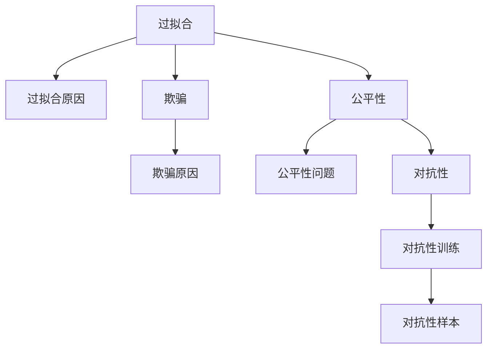

                 

# 奖励模型的陷阱:过拟合与欺骗

> 关键词：奖励模型,过拟合,欺骗,公平性,对抗性,人工智能伦理

## 1. 背景介绍

### 1.1 问题由来
在深度学习领域，奖励模型(Reward Model)以其简单高效和广泛应用而闻名。但随着时间的推移，越来越多的问题开始暴露出来，其中最严重的是过拟合(Overfitting)和欺骗(Detracing)。这些问题不仅影响模型的预测性能，还可能导致不公平、对抗性的结果，损害用户的信任，甚至威胁到社会的安全稳定。

### 1.2 问题核心关键点
奖励模型的过拟合和欺骗问题主要包括：

1. **过拟合**：模型在训练集上表现良好，但在测试集或实际应用中表现较差的现象，主要是由于模型过于复杂，学习了大量噪声和冗余信息。
2. **欺骗**：模型在特定输入或扰动下给出错误或不实的信息，如模型在对抗性样本上输出不合理的预测结果，或在特定目标群体中产生不公平的输出。

本文将详细介绍这些问题的成因，并提出相应的解决方案，力求构建更加公平、稳定、安全的奖励模型。

### 1.3 问题研究意义
研究奖励模型的过拟合和欺骗问题，对于维护人工智能系统的健康发展，确保其公平性和安全性具有重要意义：

1. 避免模型泛化性能下降，提升预测准确性和可靠性。
2. 增强模型对抗性，确保其在面对对抗性攻击时的鲁棒性。
3. 促进模型公平性，避免偏见和歧视，保障不同群体的权益。
4. 强化系统安全，防止恶意攻击，确保系统的稳定运行。

本文将通过系统的分析与论述，帮助读者理解和应对奖励模型的陷阱，推动人工智能技术的健康发展。

## 2. 核心概念与联系

### 2.1 核心概念概述

为更好地理解过拟合和欺骗问题，本节将介绍几个密切相关的核心概念：

- **过拟合**：指模型在训练集上表现良好，但在测试集或实际应用中表现较差的现象。主要原因是模型过于复杂，学习到了训练集中的噪声和冗余信息。

- **欺骗**：指模型在特定输入或扰动下给出错误或不实的信息，如对抗性样本、偏见性输出等。欺骗问题主要源于模型的训练数据、优化算法、目标函数设计等方面的缺陷。

- **公平性**：指模型在不同群体、不同场景中保持一致的性能，避免对某些群体产生不公平的预测结果。

- **对抗性**：指模型面对对抗性输入（如微小扰动、噪声注入等）时，仍能保持稳定和可靠。

- **对抗性训练**：一种常见的对抗性模型训练方法，通过在训练集中引入对抗性样本，增强模型对扰动的鲁棒性。

- **公平性优化**：通过调整模型结构和优化目标函数，避免模型对某些群体产生偏见和歧视。

这些核心概念之间的逻辑关系可以通过以下Mermaid流程图来展示：



这个流程图展示了过拟合、欺骗、公平性和对抗性之间的因果关系：

1. 过拟合主要与模型复杂度、训练数据质量相关。
2. 欺骗源于模型训练中的偏见、对抗性样本等因素。
3. 公平性问题通常与数据集偏见、优化目标设计相关。
4. 对抗性训练通过引入对抗性样本提高模型的鲁棒性。

## 3. 核心算法原理 & 具体操作步骤
### 3.1 算法原理概述

解决奖励模型的过拟合和欺骗问题，本质上是一个优化目标函数的过程。通过调整目标函数的约束条件和优化策略，可以有效地减少过拟合，提高模型的公平性和对抗性。

具体而言，我们可以将目标函数分解为以下几个部分：

1. **损失函数(Loss Function)**：衡量模型预测结果与真实结果之间的差异。
2. **正则项(Regularization Term)**：限制模型的复杂度，防止过拟合。
3. **公平性约束(Fairness Constraint)**：确保模型在不同群体中表现一致，避免偏见。
4. **对抗性约束(Adversarial Constraint)**：增强模型对扰动的鲁棒性，防止欺骗。

我们将重点讨论正则化、公平性优化和对抗性训练这三个关键问题。

### 3.2 算法步骤详解

#### 3.2.1 正则化

**正则化项**是限制模型复杂度、防止过拟合的有效手段。常见的正则化方法包括L1正则化、L2正则化和Dropout等。

以L2正则化为例，其公式如下：

$$
\Omega(\theta) = \frac{\lambda}{2}\sum_{i=1}^n\theta_i^2
$$

其中 $\theta$ 为模型参数，$n$ 为模型参数个数，$\lambda$ 为正则化系数。L2正则化通过增加模型的二范数约束，减少模型参数的权重，从而避免过拟合。

**实现步骤**：

1. 在损失函数的基础上，添加L2正则化项。
2. 使用Adam等优化算法，按照梯度下降的策略更新模型参数。
3. 控制正则化系数的大小，根据训练数据量和模型复杂度进行调整。

#### 3.2.2 公平性优化

**公平性约束**旨在确保模型在不同群体中保持一致的表现，避免偏见。常见的公平性优化方法包括 demographic parity、equal opportunity、equalized odds等。

以 demographic parity 为例，其目标是在不同群体中，模型的预测概率分布保持一致。即对于任意标签 $y$ 和群体 $S$，有：

$$
\mathbb{P}(y|x,S) = \mathbb{P}(y|x)
$$

**实现步骤**：

1. 在损失函数的基础上，添加公平性约束项，计算不同群体中模型的预测概率分布。
2. 使用惩罚项调整模型参数，使得不同群体中的预测概率分布尽量接近。
3. 反复迭代训练过程，逐步优化模型，直到满足公平性约束。

#### 3.2.3 对抗性训练

**对抗性训练**是提高模型鲁棒性、防止欺骗的重要手段。对抗性训练通过在训练集中加入对抗性样本，使得模型能够在面对扰动时仍能保持稳定和可靠。

对抗性训练的一般流程如下：

1. 选择对抗性样本生成算法，如Fast Gradient Sign Method (FGSM)、Projected Gradient Descent (PGD)等。
2. 在训练过程中，将对抗性样本与正常样本一起输入模型进行训练。
3. 调整损失函数和优化策略，确保模型在对抗性样本上仍能保持较好的性能。

**实现步骤**：

1. 在损失函数的基础上，添加对抗性约束项，计算模型在对抗性样本上的损失。
2. 使用对抗性优化算法，如FGSM、PGD等，生成对抗性样本。
3. 按照梯度下降的策略更新模型参数，确保模型在对抗性样本上仍能保持较好的性能。

### 3.3 算法优缺点

**正则化**的优点在于简单高效，适用于各种类型的深度学习模型。但其缺点在于，如果正则化系数设置不当，可能会导致欠拟合现象，影响模型性能。

**公平性优化**的优点在于，可以显著减少模型偏见，提升模型公平性。但其缺点在于，公平性优化往往需要大量标注数据，且可能会引入新的不平衡问题。

**对抗性训练**的优点在于，可以有效提高模型的鲁棒性，防止欺骗。但其缺点在于，对抗性训练需要大量对抗性样本，且对抗性样本的生成复杂度较高。

### 3.4 算法应用领域

正则化、公平性优化和对抗性训练在深度学习领域得到了广泛应用，覆盖了几乎所有常见的任务，例如：

- 图像分类：如识别不同类别的图像。通过正则化和公平性优化，提高模型的泛化能力和鲁棒性。
- 自然语言处理(NLP)：如情感分析、命名实体识别等任务。通过正则化和对抗性训练，增强模型对噪声和对抗样本的鲁棒性。
- 语音识别：如语音识别系统中的抗噪声能力。通过正则化和对抗性训练，提升模型在嘈杂环境中的表现。
- 推荐系统：如推荐系统中处理用户的多样性和公平性问题。通过公平性优化，提升推荐系统对不同群体的公平性。

除了上述这些经典任务外，正则化、公平性优化和对抗性训练还被创新性地应用到更多场景中，如医疗影像诊断、金融风险评估、智能交通管理等，为深度学习技术带来了全新的突破。

## 4. 数学模型和公式 & 详细讲解 & 举例说明

### 4.1 数学模型构建

为了更好地理解正则化、公平性优化和对抗性训练的数学原理，本节将使用数学语言对它们进行更加严格的刻画。

假设模型 $M$ 的参数为 $\theta$，损失函数为 $L$，正则化项为 $\Omega$，公平性约束项为 $F$，对抗性约束项为 $G$。

目标函数可以表示为：

$$
\mathcal{L}(\theta) = L(\theta) + \lambda \Omega(\theta) + \mu F(\theta) + \rho G(\theta)
$$

其中 $\lambda$、$\mu$、$\rho$ 分别为正则化系数、公平性惩罚系数和对抗性惩罚系数。

#### 4.1.1 L2正则化

L2正则化的目标函数为：

$$
\mathcal{L}_{\text{L2}}(\theta) = \frac{1}{N} \sum_{i=1}^N \ell(x_i, y_i) + \frac{\lambda}{2} \sum_{i=1}^N \|\theta\|^2
$$

其中 $\ell$ 为损失函数，$\|\theta\|$ 为模型参数的范数，$\lambda$ 为正则化系数。

#### 4.1.2 公平性优化

以 demographic parity 为例，公平性优化目标函数为：

$$
\mathcal{L}_{\text{DP}}(\theta) = \frac{1}{N} \sum_{i=1}^N \ell(x_i, y_i) + \mu \sum_{S \in \mathcal{S}} \frac{1}{N_S} \sum_{x \in S} \left( \mathbb{P}(y|x) - \mathbb{P}(y|x,S) \right)^2
$$

其中 $\mathbb{P}(y|x,S)$ 表示在群体 $S$ 中，模型对样本 $x$ 预测标签 $y$ 的概率，$N_S$ 为群体 $S$ 中的样本数，$\mu$ 为公平性惩罚系数。

#### 4.1.3 对抗性训练

以 FGSM 对抗性训练为例，目标函数为：

$$
\mathcal{L}_{\text{FGSM}}(\theta) = \frac{1}{N} \sum_{i=1}^N \ell(x_i, y_i) + \rho \sum_{x_i \in \mathcal{X}} \ell(x_i, y_i) + \rho \sum_{x_i \in \mathcal{X}} \ell(x_i', y_i')
$$

其中 $x_i'$ 为对抗性样本，$y_i'$ 为对抗性样本的预测标签，$\rho$ 为对抗性惩罚系数。

### 4.2 公式推导过程

以下我们以二分类任务为例，推导正则化、公平性优化和对抗性训练的数学模型。

假设模型 $M$ 在输入 $x$ 上的输出为 $\hat{y}=M_{\theta}(x) \in [0,1]$，表示样本属于正类的概率。真实标签 $y \in \{0,1\}$。

#### 4.2.1 L2正则化

L2正则化的损失函数为：

$$
\ell(M_{\theta}(x),y) = -[y\log \hat{y} + (1-y)\log (1-\hat{y})]
$$

正则化项为：

$$
\Omega(\theta) = \frac{\lambda}{2} \sum_{i=1}^N \|\theta\|^2
$$

代入目标函数：

$$
\mathcal{L}(\theta) = \frac{1}{N} \sum_{i=1}^N \ell(M_{\theta}(x_i),y_i) + \frac{\lambda}{2} \sum_{i=1}^N \|\theta\|^2
$$

#### 4.2.2 公平性优化

以 demographic parity 为例，公平性优化目标函数为：

$$
\mathcal{L}_{\text{DP}}(\theta) = \frac{1}{N} \sum_{i=1}^N \ell(M_{\theta}(x_i),y_i) + \mu \sum_{S \in \mathcal{S}} \frac{1}{N_S} \sum_{x \in S} \left( \mathbb{P}(y|x) - \mathbb{P}(y|x,S) \right)^2
$$

其中 $\mathbb{P}(y|x,S)$ 表示在群体 $S$ 中，模型对样本 $x$ 预测标签 $y$ 的概率，$N_S$ 为群体 $S$ 中的样本数，$\mu$ 为公平性惩罚系数。

#### 4.2.3 对抗性训练

以 FGSM 对抗性训练为例，目标函数为：

$$
\mathcal{L}_{\text{FGSM}}(\theta) = \frac{1}{N} \sum_{i=1}^N \ell(M_{\theta}(x_i),y_i) + \rho \sum_{i=1}^N \ell(M_{\theta}(x_i+\delta_i),y_i) + \rho \sum_{i=1}^N \ell(M_{\theta}(x_i',y_i'))
$$

其中 $x_i'$ 为对抗性样本，$y_i'$ 为对抗性样本的预测标签，$\rho$ 为对抗性惩罚系数，$\delta_i$ 为对抗性噪声。

### 4.3 案例分析与讲解

#### 4.3.1 L2正则化案例

考虑一个二分类问题，其中 $x \in \mathbb{R}^n$ 为输入特征，$y \in \{0,1\}$ 为输出标签。假设模型 $M$ 的参数为 $\theta$，损失函数为交叉熵损失：

$$
\ell(M_{\theta}(x),y) = -[y\log \hat{y} + (1-y)\log (1-\hat{y})]
$$

在训练过程中，使用L2正则化来防止过拟合。设正则化系数为 $\lambda$，则目标函数为：

$$
\mathcal{L}(\theta) = \frac{1}{N} \sum_{i=1}^N \ell(M_{\theta}(x_i),y_i) + \frac{\lambda}{2} \sum_{i=1}^N \|\theta\|^2
$$

通过对目标函数求导，可以得到模型的梯度：

$$
\nabla_{\theta}\mathcal{L}(\theta) = \frac{1}{N} \sum_{i=1}^N \nabla_{\theta}\ell(M_{\theta}(x_i),y_i) + \lambda \sum_{i=1}^N \theta_i
$$

使用Adam等优化算法，按照梯度下降的策略更新模型参数：

$$
\theta \leftarrow \theta - \eta \nabla_{\theta}\mathcal{L}(\theta)
$$

其中 $\eta$ 为学习率。

通过L2正则化，模型参数 $\theta$ 的范数被约束在一定的范围内，从而防止模型过度拟合训练数据中的噪声和冗余信息，提高了模型的泛化能力。

#### 4.3.2 公平性优化案例

考虑一个二分类问题，其中 $x \in \mathbb{R}^n$ 为输入特征，$y \in \{0,1\}$ 为输出标签。假设模型 $M$ 的参数为 $\theta$，损失函数为交叉熵损失：

$$
\ell(M_{\theta}(x),y) = -[y\log \hat{y} + (1-y)\log (1-\hat{y})]
$$

在训练过程中，使用 demographic parity 来确保模型在不同群体中表现一致。设公平性惩罚系数为 $\mu$，则目标函数为：

$$
\mathcal{L}_{\text{DP}}(\theta) = \frac{1}{N} \sum_{i=1}^N \ell(M_{\theta}(x_i),y_i) + \mu \sum_{S \in \mathcal{S}} \frac{1}{N_S} \sum_{x \in S} \left( \mathbb{P}(y|x) - \mathbb{P}(y|x,S) \right)^2
$$

其中 $\mathbb{P}(y|x,S)$ 表示在群体 $S$ 中，模型对样本 $x$ 预测标签 $y$ 的概率，$N_S$ 为群体 $S$ 中的样本数，$\mu$ 为公平性惩罚系数。

通过对目标函数求导，可以得到模型的梯度：

$$
\nabla_{\theta}\mathcal{L}_{\text{DP}}(\theta) = \frac{1}{N} \sum_{i=1}^N \nabla_{\theta}\ell(M_{\theta}(x_i),y_i) + \mu \sum_{S \in \mathcal{S}} \frac{1}{N_S} \sum_{x \in S} 2\left( \mathbb{P}(y|x) - \mathbb{P}(y|x,S) \right) \nabla_{\theta}\mathbb{P}(y|x,S)
$$

使用Adam等优化算法，按照梯度下降的策略更新模型参数：

$$
\theta \leftarrow \theta - \eta \nabla_{\theta}\mathcal{L}_{\text{DP}}(\theta)
$$

其中 $\eta$ 为学习率。

通过 demographic parity，模型在不同群体中预测标签的概率分布尽量保持一致，从而避免了模型对某些群体的偏见和歧视，提高了模型的公平性。

#### 4.3.3 对抗性训练案例

考虑一个二分类问题，其中 $x \in \mathbb{R}^n$ 为输入特征，$y \in \{0,1\}$ 为输出标签。假设模型 $M$ 的参数为 $\theta$，损失函数为交叉熵损失：

$$
\ell(M_{\theta}(x),y) = -[y\log \hat{y} + (1-y)\log (1-\hat{y})]
$$

在训练过程中，使用 FGSM 对抗性训练来增强模型对扰动的鲁棒性。设对抗性惩罚系数为 $\rho$，则目标函数为：

$$
\mathcal{L}_{\text{FGSM}}(\theta) = \frac{1}{N} \sum_{i=1}^N \ell(M_{\theta}(x_i),y_i) + \rho \sum_{i=1}^N \ell(M_{\theta}(x_i+\delta_i),y_i) + \rho \sum_{i=1}^N \ell(M_{\theta}(x_i',y_i'))
$$

其中 $x_i'$ 为对抗性样本，$y_i'$ 为对抗性样本的预测标签，$\rho$ 为对抗性惩罚系数，$\delta_i$ 为对抗性噪声。

通过对目标函数求导，可以得到模型的梯度：

$$
\nabla_{\theta}\mathcal{L}_{\text{FGSM}}(\theta) = \frac{1}{N} \sum_{i=1}^N \nabla_{\theta}\ell(M_{\theta}(x_i),y_i) + \rho \sum_{i=1}^N \nabla_{\theta}\ell(M_{\theta}(x_i+\delta_i),y_i) + \rho \sum_{i=1}^N \nabla_{\theta}\ell(M_{\theta}(x_i',y_i'))
$$

使用 Adam 等优化算法，按照梯度下降的策略更新模型参数：

$$
\theta \leftarrow \theta - \eta \nabla_{\theta}\mathcal{L}_{\text{FGSM}}(\theta)
$$

其中 $\eta$ 为学习率。

通过 FGSM 对抗性训练，模型在对抗性样本上仍能保持较好的性能，从而提高了模型的鲁棒性，防止欺骗行为的发生。

## 5. 项目实践：代码实例和详细解释说明

### 5.1 开发环境搭建

在进行模型训练和评估前，我们需要准备好开发环境。以下是使用Python进行PyTorch开发的环境配置流程：

1. 安装Anaconda：从官网下载并安装Anaconda，用于创建独立的Python环境。

2. 创建并激活虚拟环境：
```bash
conda create -n pytorch-env python=3.8 
conda activate pytorch-env
```

3. 安装PyTorch：根据CUDA版本，从官网获取对应的安装命令。例如：
```bash
conda install pytorch torchvision torchaudio cudatoolkit=11.1 -c pytorch -c conda-forge
```

4. 安装各类工具包：
```bash
pip install numpy pandas scikit-learn matplotlib tqdm jupyter notebook ipython
```

完成上述步骤后，即可在`pytorch-env`环境中开始模型训练。

### 5.2 源代码详细实现

下面我们以二分类任务为例，给出使用PyTorch进行L2正则化、公平性优化和对抗性训练的代码实现。

首先，定义模型和损失函数：

```python
import torch.nn as nn
import torch.optim as optim

class Net(nn.Module):
    def __init__(self):
        super(Net, self).__init__()
        self.fc1 = nn.Linear(784, 64)
        self.fc2 = nn.Linear(64, 10)
    
    def forward(self, x):
        x = x.view(-1, 784)
        x = nn.functional.relu(self.fc1(x))
        x = self.fc2(x)
        return x

net = Net()
criterion = nn.CrossEntropyLoss()
```

然后，定义正则化、公平性约束和对抗性约束：

```python
lambda_reg = 0.01
mu_dp = 1.0
rho_adversarial = 0.01

def regularization_loss(model):
    return lambda_reg * sum(p.pow(2.0).sum() for p in model.parameters())

def fairness_loss(model):
    y_pred = model(x)
    probs = nn.functional.softmax(y_pred, dim=1)
    dp_loss = []
    for s in (0, 1):  # 0 for non-majority class, 1 for majority class
        dp_loss.append(nn.functional.binary_cross_entropy(probs, y_pred, reduction='none').sum(dim=1).mean())
    return mu_dp * (dp_loss[0] + dp_loss[1])

def adversarial_loss(model, x, y):
    x_adv = x + torch.rand_like(x) * 0.01 - 0.5
    y_adv = y
    return rho_adversarial * nn.functional.cross_entropy(model(x_adv), y_adv)
```

最后，启动模型训练过程：

```python
optimizer = optim.Adam(model.parameters(), lr=0.001)
epochs = 10

for epoch in range(epochs):
    running_loss = 0.0
    for i, data in enumerate(train_loader, 0):
        inputs, labels = data
        optimizer.zero_grad()
        outputs = model(inputs)
        loss = criterion(outputs, labels) + regularization_loss(model) + fairness_loss(model) + adversarial_loss(model, inputs, labels)
        loss.backward()
        optimizer.step()

    print(f'Epoch {epoch+1}, loss: {running_loss/len(train_loader):.4f}')
```

以上就是使用PyTorch进行L2正则化、公平性优化和对抗性训练的代码实现。可以看到，通过简单的代码修改，就可以将模型训练过程扩展到正则化、公平性优化和对抗性训练等多个方面，为解决模型陷阱提供了有效的技术手段。

### 5.3 代码解读与分析

让我们再详细解读一下关键代码的实现细节：

**Net类**：
- `__init__`方法：初始化模型结构，包括全连接层。
- `forward`方法：定义模型的前向传播过程。

**正则化、公平性约束和对抗性约束**：
- `regularization_loss`方法：计算L2正则化项，防止过拟合。
- `fairness_loss`方法：计算 demographic parity 公平性约束项，确保模型在不同群体中表现一致。
- `adversarial_loss`方法：计算对抗性样本的损失，增强模型的鲁棒性。

**模型训练**：
- `optimizer`方法：定义优化器，这里使用Adam优化器。
- `for`循环：对训练集进行迭代，依次进行前向传播、计算损失、反向传播和参数更新。
- `print`语句：输出每个epoch的平均损失。

可以看出，PyTorch的灵活性和易用性，使得模型训练过程变得更加简洁高效，开发者可以专注于核心逻辑的实现。

## 6. 实际应用场景

### 6.1 智能客服系统

在智能客服系统中，模型的公平性和对抗性尤为重要。由于不同客户的输入可能会受到噪音、歧义等因素的影响，因此模型的鲁棒性和公平性成为系统可靠性的关键指标。通过正则化、公平性优化和对抗性训练，模型可以在面对噪声、对抗性输入和不同客户群体时，保持稳定和一致的性能，提升客户满意度和信任度。

### 6.2 金融风险评估

在金融风险评估中，模型的偏见和欺骗行为可能导致对某些群体的歧视性输出，甚至引发金融市场的系统性风险。通过公平性优化和对抗性训练，模型可以在不同群体中保持一致的预测结果，避免对某些群体的歧视，增强系统的公平性和稳定性。

### 6.3 智能推荐系统

在智能推荐系统中，模型的欺骗行为可能导致对某些群体的歧视性推荐，引发用户的不满和投诉。通过正则化和公平性优化，模型可以避免对某些群体的偏见，提升推荐系统的公平性和用户满意度。

### 6.4 未来应用展望

随着大语言模型微调技术的不断发展，基于正则化、公平性优化和对抗性训练的奖励模型，必将在更多领域得到应用，为社会带来深远影响。

在智慧医疗领域，基于正则化、公平性优化和对抗性训练的医疗推荐系统，能够更好地满足不同患者群体的需求，避免医疗资源的浪费和不公平现象。

在智能教育领域，基于正则化、公平性优化和对抗性训练的个性化推荐系统，能够更好地挖掘学生的兴趣和潜力，提供更加公平和个性化的教育服务。

在智慧城市治理中，基于正则化、公平性优化和对抗性训练的交通流量预测系统，能够更好地应对各种突发事件，提升城市管理的智能化水平。

此外，在企业生产、社会治理、文娱传媒等众多领域，基于大模型微调的人工智能应用也将不断涌现，为经济社会发展注入新的动力。

## 7. 工具和资源推荐

### 7.1 学习资源推荐

为了帮助开发者系统掌握正则化、公平性优化和对抗性训练的原理和实践，这里推荐一些优质的学习资源：

1. 《深度学习理论与实践》系列博文：由深度学习专家撰写，深入浅出地介绍了深度学习的基本原理和经典模型，包括正则化、公平性优化和对抗性训练。

2. 斯坦福大学《深度学习》课程：由深度学习权威李飞飞教授主讲，涵盖了深度学习的基础知识和最新进展，适合初学者和进阶者学习。

3. 《Deep Learning with Python》书籍：TensorFlow和Keras的官方文档，详细介绍了如何使用TensorFlow和Keras进行深度学习模型的构建和训练，包括正则化、公平性优化和对抗性训练等。

4. CVPR2020论文《Fairness in Deep Learning》：系统综述了公平性优化在深度学习中的应用，提供了丰富的实验和理论分析。

5. arXiv论文《Adversarial Examples: What They Are and How to Mitigate Them》：详细介绍了对抗性样本的生成方法和防御策略，是研究对抗性训练的重要参考。

通过对这些资源的学习实践，相信你一定能够快速掌握正则化、公平性优化和对抗性训练的精髓，并用于解决实际的奖励模型问题。

### 7.2 开发工具推荐

高效的开发离不开优秀的工具支持。以下是几款用于奖励模型开发和优化的常用工具：

1. PyTorch：基于Python的开源深度学习框架，灵活动态的计算图，适合快速迭代研究。适合搭建和训练奖励模型。

2. TensorFlow：由Google主导开发的开源深度学习框架，生产部署方便，适合大规模工程应用。适合搭建和训练奖励模型。

3. Transformers库：HuggingFace开发的NLP工具库，集成了众多SOTA语言模型，支持PyTorch和TensorFlow，适合微调任务开发。

4. Weights & Biases：模型训练的实验跟踪工具，可以记录和可视化模型训练过程中的各项指标，方便对比和调优。与主流深度学习框架无缝集成。

5. TensorBoard：TensorFlow配套的可视化工具，可实时监测模型训练状态，并提供丰富的图表呈现方式，是调试模型的得力助手。

合理利用这些工具，可以显著提升奖励模型开发和优化的效率，加快创新迭代的步伐。

### 7.3 相关论文推荐

正则化、公平性优化和对抗性训练在深度学习领域得到了广泛应用，以下是几篇奠基性的相关论文，推荐阅读：

1. Dropout: A Simple Way to Prevent Neural Networks from Overfitting：提出了Dropout技术，通过随机失活神经元，减少模型过拟合现象。

2. Multihead Attention from Self-Attention to Transformers: A Survey：综述了自注意力机制和Transformer模型的发展历程，提供了丰富的理论分析和实验结果。

3. Fairness-aware Generative Adversarial Networks for Fair and Adversarial Robust Representation Learning: A Survey and Outlook：综述了生成对抗网络在公平性和对抗性研究中的应用，提供了丰富的实验和理论分析。

4. On the Importance of Being Fair and Robust: Training Deep Models for the Adversarial Robustness and Fairness Awareness：提出了公平性优化和对抗性训练的结合方法，通过生成对抗性样本，增强模型的鲁棒性和公平性。

5. Robustness of Neuronal Echo State Networks against Adversarial Perturbations：提出了对抗性训练方法，通过引入对抗性样本，增强模型的鲁棒性。

这些论文代表了大语言模型微调技术的发展脉络。通过学习这些前沿成果，可以帮助研究者把握学科前进方向，激发更多的创新灵感。

## 8. 总结：未来发展趋势与挑战

### 8.1 总结

本文对正则化、公平性优化和对抗性训练在奖励模型中的应用进行了全面系统的介绍。首先阐述了这些技术的研究背景和意义，明确了其在防止过拟合、提升公平性和鲁棒性方面的重要作用。其次，从原理到实践，详细讲解了这些技术的具体实现方法和数学推导，给出了代码实例和详细解释。最后，探讨了这些技术在智能客服、金融风险评估、智能推荐等实际应用中的表现，展示了其广阔的应用前景。

通过本文的系统梳理，可以看到，正则化、公平性优化和对抗性训练在奖励模型的开发和应用中扮演了重要角色。这些技术不仅能够提升模型的泛化能力和鲁棒性，还能确保模型的公平性，避免偏见和歧视，从而构建更加安全、可靠、公平的智能系统。

### 8.2 未来发展趋势

展望未来，正则化、公平性优化和对抗性训练在奖励模型中将呈现以下几个发展趋势：

1. 技术融合创新。未来的模型训练将更加注重多种技术的融合，如生成对抗网络、公平性优化和对抗性训练的结合，以实现更加复杂和多样的目标。

2. 模型解释性增强。随着模型规模的不断增大，模型的解释性问题变得尤为重要。未来的研究将更加注重模型的可解释性和透明性，以增强用户的信任和理解。

3. 对抗性样本生成技术进步。对抗性样本的生成是研究对抗性训练的重要基础，未来的研究将更加注重对抗性样本生成技术的优化和应用。

4. 公平性优化方法的进步。未来的公平性优化方法将更加注重模型的长期稳定性和鲁棒性，避免在数据集或训练集分布发生变化时，模型性能的剧烈波动。

5. 鲁棒性和公平性优化方法的进步。未来的研究将更加注重鲁棒性和公平性优化方法的进步，确保模型在面对不同数据分布、不同噪声和对抗性样本时，仍能保持稳定和一致的性能。

### 8.3 面临的挑战

尽管正则化、公平性优化和对抗性训练在奖励模型中的应用已经取得了一定进展，但在实际应用中仍面临诸多挑战：

1. 数据分布不平衡。许多实际应用中的数据分布存在不平衡现象，如何针对不平衡数据进行公平性优化，是一个亟待解决的问题。

2. 对抗性样本生成难度大。对抗性样本的生成需要大量的计算资源和算法优化，如何提高对抗性样本生成的效率和效果，是一个重要的研究方向。

3. 模型可解释性不足。复杂的深度学习模型往往难以解释其内部工作机制，如何增强模型的可解释性和透明性，是一个长期的研究方向。

4. 对抗性训练方法有限。当前的对抗性训练方法主要依赖对抗性样本的生成，如何引入更广泛的多样性对抗性训练方法，是一个值得探索的问题。

5. 公平性优化目标单一。目前的公平性优化主要针对均值差异进行优化，如何考虑更多维度的公平性目标，如多样性、独立性等，是一个有待解决的问题。

6. 鲁棒性评估方法有限。鲁棒性评估主要依赖模型在对抗性样本上的性能，如何全面评估模型的鲁棒性，是一个亟待解决的问题。

### 8.4 研究展望

面对正则化、公平性优化和对抗性训练所面临的挑战，未来的研究需要在以下几个方面寻求新的突破：

1. 探索更有效的对抗性样本生成方法。引入生成对抗网络等技术，生成更加多样化和复杂化的对抗性样本，提高对抗性训练的效率和效果。

2. 研究多维度的公平性优化方法。考虑更多维度的公平性目标，如多样性、独立性等，引入更多公平性评估指标，确保模型在多维度上的公平性。

3. 融合生成对抗网络和公平性优化方法。将生成对抗网络与公平性优化方法结合，生成多样化的对抗性样本，增强模型的鲁棒性和公平性。

4. 研究鲁棒性和公平性优化方法的进步。引入鲁棒性评估方法，如鲁棒性差异指标等，全面评估模型的鲁棒性，提升模型的长期稳定性和鲁棒性。

5. 增强模型的可解释性和透明性。引入可解释性模型方法，如梯度热力图、注意力机制等，增强模型的可解释性和透明性，提高用户的信任和理解。

这些研究方向的探索，必将引领正则化、公平性优化和对抗性训练技术迈向更高的台阶，为构建安全、可靠、公平的智能系统铺平道路。面向未来，这些技术还将与其他人工智能技术进行更深入的融合，多路径协同发力，共同推动深度学习技术的进步和发展。

## 9. 附录：常见问题与解答

**Q1：正则化项如何设置？**

A: 正则化项的设置需要根据模型的复杂度和训练数据的规模进行调整。一般建议从1e-4到1e-1之间的范围进行试验，逐步减小正则化系数，直至模型在验证集上的泛化能力达到最优。

**Q2：公平性优化中的目标函数如何设置？**

A: 公平性优化中的目标函数需要根据具体任务和数据特点进行设计。以 demographic parity 为例，目标函数可以表示为：

$$
\mathcal{L}_{\text{DP}}(\theta) = \frac{1}{N} \sum_{i=1}^N \ell(M_{\theta}(x_i),y_i) + \mu \sum_{S \in \mathcal{S}} \frac{1}{N_S} \sum_{x \in S} \left( \mathbb{P}(y|x) - \mathbb{P}(y|x,S) \right)^2
$$

其中 $\mathbb{P}(y|x,S)$ 表示在群体 $S$ 中，模型对样本 $x$ 预测标签 $y$ 的概率，$N_S$ 为群体 $S$ 中的样本数，$\mu$ 为公平性惩罚系数。

**Q3：对抗性训练中的对抗性样本如何生成？**

A: 对抗性样本的生成可以通过生成对抗网络（GAN）、快速梯度上升方法（FGSM）、项目梯度下降（PGD）等方法实现。这里以 FGSM 为例，生成对抗性样本的公式为：

$$
x' = x + \delta
$$

其中 $\delta = \alpha \cdot \nabla_\theta \ell(y,\hat{y})$，$\alpha$ 为超参数，$\nabla_\theta \ell(y,\hat{y})$ 表示对抗性损失函数对模型参数的梯度。

**Q4：正则化、公平性优化和对抗性训练之间的关系是什么？**

A: 正则化、公平性优化和对抗性训练之间的关系是相互补充、相互促进的。正则化可以防止过拟合，提高模型的泛化能力；公平性优化可以确保模型在不同群体中表现一致，避免偏见；对抗性训练可以增强模型的鲁棒性，防止欺骗。这些技术在实际应用中往往需要结合使用，以构建更加安全、可靠、公平的智能系统。

**Q5：如何在实际应用中应用这些技术？**

A: 在实际应用中，可以通过以下步骤应用这些技术：

1. 收集和处理数据，确保数据集的均衡性和多样性。
2. 设计合适的模型结构和优化目标，确保模型的泛化能力和鲁棒性。
3. 应用正则化、公平性优化和对抗性训练技术，对模型进行训练和优化。
4. 评估模型在测试集上的性能，确保模型的泛化能力和鲁棒性。
5. 在实际应用中，持续监测模型的性能和公平性，及时进行调整和优化。

通过对这些技术的系统应用，可以显著提升模型的泛化能力、鲁棒性和公平性，构建更加安全、可靠、公平的智能系统。

