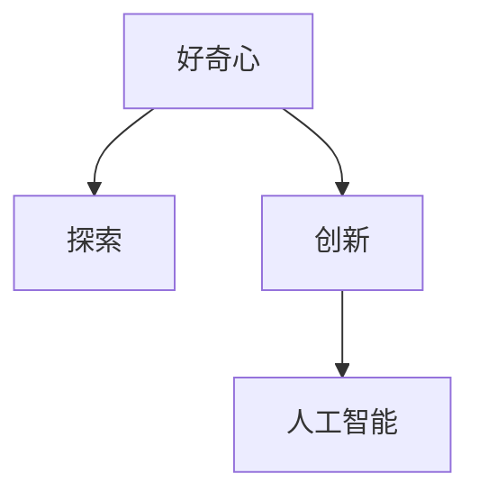

                 

# 好奇心：探索世界的钥匙

好奇心，是人类最宝贵的天性之一。它驱动着人类不断探索未知，推动着科技进步和社会文明的发展。在IT领域，好奇心同样扮演着关键角色，推动着技术的革新与突破。本文将从人工智能的视角出发，探讨好奇心在探索世界中的关键作用，并通过具体的技术案例，展现好奇心如何引领我们走向更深层次的认知与理解。

## 1. 背景介绍

### 1.1 问题由来
自工业革命以来，科技的飞速发展极大地改变了人类的生活方式和社会结构。从蒸汽机、电力到信息时代，每一次技术的飞跃都离不开人类的好奇心和探索精神。

在现代信息社会，技术的发展更加依赖于数据的获取和分析。大数据、人工智能等技术的兴起，使得我们能够以前所未有的深度和广度探索世界。这些技术背后的驱动力，正是人类永不停歇的好奇心。

### 1.2 问题核心关键点
好奇心不仅是个体层面的认知驱动力，也是技术进步和社会发展的关键因素。从计算能力到数据存储，从算法创新到应用落地，好奇心的推动无处不在。

本节将从人工智能的角度出发，探讨好奇心如何驱动技术探索，以及技术探索如何反过来满足好奇心，形成良性循环。

### 1.3 问题研究意义
好奇心作为探索世界的钥匙，具有重要的研究意义。

1. **推动技术发展**：好奇心驱动的探索精神，能够激发新技术的创新和突破。
2. **促进知识传播**：好奇心驱动的知识传播，使得更多人能够接触到前沿科技，推动知识共享。
3. **实现社会进步**：好奇心驱动的社会进步，能够促进人类文明的整体提升。
4. **构建创新生态**：好奇心驱动的创新生态，能够形成良性循环，推动科技的持续发展。

## 2. 核心概念与联系

### 2.1 核心概念概述

本节将介绍几个核心概念，以及它们之间的内在联系。

- **好奇心（Curiosity）**：人类对未知领域进行探索、学习的内在驱动力。
- **探索（Exploration）**：通过观察、实验等方式，获取新知识和新信息的行动。
- **创新（Innovation）**：基于已有知识，创造新方法和新技术的创新过程。
- **人工智能（AI）**：通过算法和模型，赋予计算机以人类智能的技术。

这些概念之间的关系，可以通过以下Mermaid流程图来展示：



这个流程图展示了好奇心如何驱动探索和创新，进而推动人工智能技术的发展。

## 3. 核心算法原理 & 具体操作步骤
### 3.1 算法原理概述

好奇心驱动的探索和创新，本质上是一种发现未知、揭示真相的过程。在AI领域，这个过程通常通过数据探索、算法优化和模型训练来实现。

形式化地，假设我们有一个已知数据集 $D$，其中包含 $n$ 个样本 $(x_i, y_i)$，其中 $x_i$ 为特征向量，$y_i$ 为标签。我们希望通过探索这些数据，发现其中的规律和模式，以便于构建新的模型或算法。

**探索过程**：
- **数据探索**：通过统计分析、可视化等方式，发现数据中的潜在模式和异常值。
- **算法优化**：通过试验不同的算法和参数，找到最适合数据集的模型。
- **模型训练**：使用数据集对模型进行训练，调整模型参数以优化性能。

**创新过程**：
- **模型评估**：使用测试集评估模型的性能，判断其在新数据上的泛化能力。
- **性能提升**：根据评估结果，对模型进行调整，提升其在真实世界中的表现。
- **应用部署**：将优化后的模型部署到实际应用中，解决具体问题。

### 3.2 算法步骤详解

基于好奇心的探索和创新过程，通常包括以下几个关键步骤：

**Step 1: 数据收集与预处理**
- 收集与问题相关的数据集，并进行预处理，如清洗、归一化等。
- 划分训练集、验证集和测试集，确保模型在各种数据分布下的泛化能力。

**Step 2: 数据探索与分析**
- 对数据进行初步分析，发现其中的潜在模式和异常值。
- 使用可视化工具展示数据分布和特征关系，形成初步的洞察。

**Step 3: 算法选择与优化**
- 根据数据特性，选择最适合的算法模型。
- 尝试不同的算法配置和参数组合，使用交叉验证等方法进行评估。
- 根据评估结果，选择最优的算法和参数。

**Step 4: 模型训练与优化**
- 使用训练集对模型进行训练，优化模型参数。
- 在验证集上评估模型性能，调整模型结构或参数以提升性能。

**Step 5: 模型评估与部署**
- 在测试集上评估模型性能，确保其在新数据上的泛化能力。
- 将优化后的模型部署到实际应用中，解决具体问题。
- 持续收集新数据，定期重新评估和优化模型。

### 3.3 算法优缺点

好奇心驱动的探索和创新过程，具有以下优点：
1. **创新性强**：通过不断的探索和优化，可以发现新的方法和算法，推动技术进步。
2. **灵活性高**：可以根据具体问题的特点，灵活选择算法和模型。
3. **泛化能力强**：在多种数据集上进行探索和优化，可以提高模型的泛化能力。

但同时也存在一些局限性：
1. **资源消耗大**：探索和优化过程需要大量的计算资源和时间。
2. **结果不确定**：探索过程可能面临多个可能的结果，需要多次试验才能找到最优解。
3. **风险较高**：探索过程可能引入新的问题和风险，需要谨慎处理。

### 3.4 算法应用领域

好奇心驱动的探索和创新过程，已经在多个领域得到了应用，具体包括：

- **计算机视觉**：通过探索和优化算法，提升图像识别、物体检测等任务的性能。
- **自然语言处理**：通过探索和优化模型，提升语言理解、机器翻译等任务的精度。
- **数据分析**：通过探索和优化数据处理技术，提高数据的利用效率和分析深度。
- **智能推荐**：通过探索和优化推荐算法，提升用户个性化推荐的准确性和满意度。
- **医疗健康**：通过探索和优化模型，提高疾病诊断、健康管理等任务的准确性和效率。

## 4. 数学模型和公式 & 详细讲解

### 4.1 数学模型构建

本节将使用数学语言对好奇心驱动的探索和创新过程进行更加严格的刻画。

假设我们有一个已知数据集 $D$，其中包含 $n$ 个样本 $(x_i, y_i)$，其中 $x_i$ 为特征向量，$y_i$ 为标签。我们希望通过探索这些数据，发现其中的规律和模式，以便于构建新的模型或算法。

**探索过程**：
- **数据探索**：通过统计分析、可视化等方式，发现数据中的潜在模式和异常值。
- **算法优化**：通过试验不同的算法和参数，找到最适合数据集的模型。

**创新过程**：
- **模型评估**：使用测试集评估模型的性能，判断其在新数据上的泛化能力。
- **性能提升**：根据评估结果，对模型进行调整，提升其在真实世界中的表现。
- **应用部署**：将优化后的模型部署到实际应用中，解决具体问题。

### 4.2 公式推导过程

以下我们以图像分类任务为例，推导探索过程和创新过程的数学模型。

**数据探索**：
假设我们有一个图像分类任务，数据集 $D$ 包含 $n$ 个图像样本 $x_i$ 和对应的标签 $y_i$。我们可以使用主成分分析(PCA)对图像进行降维，以便于可视化分析数据分布：

$$
x'_i = Wx_i + b
$$

其中 $W$ 为投影矩阵，$b$ 为偏置项。通过对 $x'_i$ 进行可视化分析，可以发现图像分类任务中的潜在模式和异常值。

**算法优化**：
假设我们选择了卷积神经网络(CNN)作为模型，其包含多个卷积层、池化层和全连接层。对于卷积层，其输出 $h_i$ 可以表示为：

$$
h_i = f(\sum_k w_k x_i^{(k)} + b_k)
$$

其中 $x_i^{(k)}$ 为第 $k$ 层的输入，$w_k$ 和 $b_k$ 分别为卷积核和偏置项，$f$ 为激活函数。

对于全连接层，其输出 $o_i$ 可以表示为：

$$
o_i = \sum_j w_{ij} h_i^{(j)} + b_i
$$

其中 $h_i^{(j)}$ 为第 $j$ 层的输出，$w_{ij}$ 和 $b_i$ 分别为连接权重和偏置项。

通过对 $o_i$ 进行激活函数 $g$，得到最终输出 $y_i$：

$$
y_i = g(\sum_j w_{ij} h_i^{(j)} + b_i)
$$

通过调整模型参数 $w_{ij}, b_i$，使用交叉验证等方法进行评估，可以找到最优的模型和参数组合。

**模型训练**：
使用训练集 $D_{train}$ 对模型进行训练，更新参数 $w_{ij}, b_i$：

$$
w_{ij}, b_i \leftarrow w_{ij}, b_i - \eta \frac{\partial \mathcal{L}}{\partial w_{ij}}, \frac{\partial \mathcal{L}}{\partial b_i}
$$

其中 $\eta$ 为学习率，$\mathcal{L}$ 为损失函数，通常使用交叉熵损失。

**模型评估**：
在测试集 $D_{test}$ 上评估模型性能，使用准确率、精确率、召回率等指标进行评估：

$$
\mathcal{P} = \frac{TP}{TP+FP}
$$

$$
\mathcal{R} = \frac{TP}{TP+FN}
$$

$$
\mathcal{F}_1 = 2\frac{\mathcal{P} \times \mathcal{R}}{\mathcal{P} + \mathcal{R}}
$$

其中 $TP$ 为真正例，$FP$ 为假正例，$FN$ 为假负例。

### 4.3 案例分析与讲解

**案例：图像分类任务**

假设我们有一个图像分类任务，数据集 $D$ 包含 $n$ 个图像样本 $x_i$ 和对应的标签 $y_i$。我们选择卷积神经网络(CNN)作为模型，对图像进行预处理、特征提取和分类。

1. **数据预处理**：将图像进行归一化、缩放、旋转等预处理，以提高模型的鲁棒性。
2. **特征提取**：使用卷积层、池化层提取图像特征，并通过全连接层进行分类。
3. **模型训练**：在训练集 $D_{train}$ 上训练模型，更新参数以最小化损失函数。
4. **模型评估**：在测试集 $D_{test}$ 上评估模型性能，使用准确率、精确率、召回率等指标进行评估。

通过不断的探索和优化，可以提高模型的分类精度和泛化能力。

## 5. 项目实践：代码实例和详细解释说明
### 5.1 开发环境搭建

在进行探索和优化实践前，我们需要准备好开发环境。以下是使用Python进行TensorFlow开发的环境配置流程：

1. 安装Anaconda：从官网下载并安装Anaconda，用于创建独立的Python环境。

2. 创建并激活虚拟环境：
```bash
conda create -n tf-env python=3.8 
conda activate tf-env
```

3. 安装TensorFlow：根据CUDA版本，从官网获取对应的安装命令。例如：
```bash
conda install tensorflow -c tensorflow -c conda-forge
```

4. 安装各类工具包：
```bash
pip install numpy pandas scikit-learn matplotlib tqdm jupyter notebook ipython
```

完成上述步骤后，即可在`tf-env`环境中开始探索和优化实践。

### 5.2 源代码详细实现

下面我们以图像分类任务为例，给出使用TensorFlow对CNN模型进行探索和优化的PyTorch代码实现。

首先，定义CNN模型的结构：

```python
import tensorflow as tf
from tensorflow.keras import layers

model = tf.keras.Sequential([
    layers.Conv2D(32, (3, 3), activation='relu', input_shape=(32, 32, 3)),
    layers.MaxPooling2D((2, 2)),
    layers.Conv2D(64, (3, 3), activation='relu'),
    layers.MaxPooling2D((2, 2)),
    layers.Flatten(),
    layers.Dense(64, activation='relu'),
    layers.Dense(10, activation='softmax')
])
```

然后，定义数据集和模型：

```python
from tensorflow.keras.datasets import mnist

(x_train, y_train), (x_test, y_test) = mnist.load_data()

x_train = x_train.reshape(-1, 32, 32, 3) / 255.0
x_test = x_test.reshape(-1, 32, 32, 3) / 255.0

model.compile(optimizer='adam', loss='categorical_crossentropy', metrics=['accuracy'])
```

接着，定义训练和评估函数：

```python
def train_model(model, x_train, y_train, batch_size, epochs):
    model.fit(x_train, y_train, batch_size=batch_size, epochs=epochs, validation_split=0.1)

def evaluate_model(model, x_test, y_test):
    loss, accuracy = model.evaluate(x_test, y_test)
    print(f'Test loss: {loss:.4f}')
    print(f'Test accuracy: {accuracy:.4f}')
```

最后，启动训练流程并在测试集上评估：

```python
batch_size = 128
epochs = 10

train_model(model, x_train, y_train, batch_size, epochs)
evaluate_model(model, x_test, y_test)
```

以上就是使用TensorFlow对CNN模型进行图像分类任务的探索和优化的完整代码实现。可以看到，TensorFlow提供了简单易用的API，使得模型的构建和训练过程变得非常直观。

### 5.3 代码解读与分析

让我们再详细解读一下关键代码的实现细节：

**定义CNN模型结构**：
- 使用 `tf.keras.Sequential` 定义模型结构，包含多个卷积层、池化层和全连接层。
- 卷积层和池化层使用 `tf.keras.layers.Conv2D` 和 `tf.keras.layers.MaxPooling2D` 定义。
- 全连接层使用 `tf.keras.layers.Dense` 定义。

**数据预处理**：
- 使用 `mnist.load_data` 加载MNIST数据集，并将其重构为模型所需的输入格式。
- 将数据进行归一化处理，使输入值范围在 [0, 1] 之间。

**模型编译与训练**：
- 使用 `model.compile` 定义优化器、损失函数和评估指标。
- 使用 `model.fit` 进行模型训练，设置训练轮数和验证集比例。

**模型评估**：
- 使用 `model.evaluate` 评估模型在测试集上的性能，输出损失和准确率。

**训练流程**：
- 设置批处理大小和训练轮数，调用 `train_model` 函数进行模型训练。
- 调用 `evaluate_model` 函数在测试集上评估模型性能。

可以看出，TensorFlow的API设计使得模型的构建和训练过程非常简单，可以快速上手。

当然，工业级的系统实现还需考虑更多因素，如模型的保存和部署、超参数的自动搜索、更加灵活的任务适配层等。但核心的探索和优化范式基本与此类似。

## 6. 实际应用场景

### 6.1 智能推荐系统

好奇心驱动的探索和优化，已经广泛应用于智能推荐系统的构建。传统的推荐系统依赖于用户的历史行为数据进行物品推荐，难以应对用户兴趣和行为的多样性。通过探索和优化推荐算法，可以发现用户更深层次的兴趣点，提供更加个性化和多样化的推荐内容。

在技术实现上，可以收集用户浏览、点击、评论、分享等行为数据，提取和用户交互的物品标题、描述、标签等文本内容。使用预训练语言模型对文本进行处理，提取特征向量，再通过探索和优化算法，对特征进行加权和组合，构建推荐模型。微调预训练语言模型，使得模型能够理解用户意图，匹配最合适的物品进行推荐。对于新物品的推荐，还可以实时搜索外部信息库，动态生成推荐结果。如此构建的智能推荐系统，能够显著提升用户的个性化体验和满意度。

### 6.2 金融风险评估

金融领域的风险评估需要实时监测市场舆情，以规避潜在的金融风险。传统的人工监测方式成本高、效率低，难以应对网络时代海量信息爆发的挑战。通过探索和优化文本分类和情感分析技术，可以自动判断金融舆情中的主题和情感倾向，及时发现异常情况。

具体而言，可以收集金融领域相关的新闻、报道、评论等文本数据，并对其进行主题标注和情感标注。在此基础上对预训练语言模型进行探索和优化，使得模型能够自动理解文本的情感和主题。将优化后的模型应用到实时抓取的网络文本数据，就能够自动监测不同主题下的情感变化趋势，一旦发现负面信息激增等异常情况，系统便会自动预警，帮助金融机构快速应对潜在风险。

### 6.3 智慧城市治理

智慧城市治理需要实时监测城市事件、舆情分析、应急指挥等环节，以提高城市管理的自动化和智能化水平。传统的人工治理方式效率低下、成本高昂，难以应对复杂多变的城市环境。通过探索和优化城市事件监测和舆情分析技术，可以实现对城市事件的快速识别和应对。

具体而言，可以收集城市事件和舆情相关的文本数据，如社交媒体、新闻报道等。使用预训练语言模型对文本进行处理，提取事件和舆情特征，再通过探索和优化算法，对特征进行加权和组合，构建事件监测和舆情分析模型。优化后的模型能够自动分析文本内容，识别出关键事件和舆情变化，实时预警并通知相关部门进行处理。如此构建的智慧城市治理系统，能够显著提升城市的应急响应和治理能力。

### 6.4 未来应用展望

随着好奇心驱动的探索和优化技术的不断发展，基于这些技术的AI应用将不断涌现，为人类社会带来深刻的变革。

在医疗领域，基于好奇心驱动的探索和优化技术，可以构建智能诊断系统，提升疾病诊断的准确性和效率。例如，通过探索和优化卷积神经网络模型，可以提取医学影像的特征，辅助医生进行疾病诊断。通过探索和优化生成对抗网络(GAN)模型，可以生成高质量的医学图像，辅助医学研究。

在教育领域，基于好奇心驱动的探索和优化技术，可以构建智能教学系统，提升教学效果和学习效率。例如，通过探索和优化自然语言处理技术，可以自动生成个性化教学材料，帮助学生更好地理解知识。通过探索和优化推荐系统，可以实时推荐学习资源，满足学生的个性化需求。

在工业领域，基于好奇心驱动的探索和优化技术，可以构建智能生产系统，提升生产效率和质量。例如，通过探索和优化图像识别和语音识别技术，可以实时监测生产设备的状态，预测设备故障。通过探索和优化推荐系统，可以实时推荐生产方案和工艺参数，优化生产过程。

总之，好奇心驱动的探索和优化技术，将在更多领域得到应用，为人类社会带来深刻的变革。相信随着技术的不断进步，这些技术将变得更加智能化、普适化，为人类文明的发展注入新的活力。

## 7. 工具和资源推荐

### 7.1 学习资源推荐

为了帮助开发者系统掌握探索和优化的理论基础和实践技巧，这里推荐一些优质的学习资源：

1. 《深度学习》系列博文：由知名专家撰写，深入浅出地介绍了深度学习的原理和应用。
2. 《TensorFlow官方文档》：TensorFlow的官方文档，提供了丰富的教程和样例，适合入门学习。
3. 《PyTorch官方文档》：PyTorch的官方文档，提供了详细的API和示例，适合深度学习开发。
4. 《深度学习框架比较》：介绍主要深度学习框架的优缺点和适用场景，帮助选择合适的工具。
5. 《机器学习实战》：实践性较强的书籍，包含大量的代码示例和案例分析。

通过学习这些资源，相信你一定能够快速掌握探索和优化的精髓，并用于解决实际的AI问题。

### 7.2 开发工具推荐

高效的开发离不开优秀的工具支持。以下是几款用于探索和优化开发的常用工具：

1. PyTorch：基于Python的开源深度学习框架，灵活动态的计算图，适合快速迭代研究。
2. TensorFlow：由Google主导开发的开源深度学习框架，生产部署方便，适合大规模工程应用。
3. Jupyter Notebook：交互式的开发环境，适合进行实验和调试。
4. Weights & Biases：模型训练的实验跟踪工具，可以记录和可视化模型训练过程中的各项指标，方便对比和调优。
5. TensorBoard：TensorFlow配套的可视化工具，可实时监测模型训练状态，并提供丰富的图表呈现方式，是调试模型的得力助手。

合理利用这些工具，可以显著提升探索和优化的开发效率，加快创新迭代的步伐。

### 7.3 相关论文推荐

探索和优化技术的发展源于学界的持续研究。以下是几篇奠基性的相关论文，推荐阅读：

1. "Deep Residual Learning for Image Recognition"：提出残差网络结构，解决深度神经网络中的梯度消失问题。
2. "ImageNet Classification with Deep Convolutional Neural Networks"：介绍卷积神经网络的原理和应用，提升图像分类的精度。
3. "Natural Language Processing with Transformers"：介绍Transformer结构，用于自然语言处理任务。
4. "Exploration Strategies for Multi-armed Bandits with Linear Payoffs"：探讨探索策略在多臂赌博机问题中的应用，优化探索与利用的平衡。
5. "Curiosity-Driven Learning"：介绍好奇心驱动的探索和优化方法，提升智能系统的创新能力。

这些论文代表了大规模数据探索和优化的发展脉络。通过学习这些前沿成果，可以帮助研究者把握学科前进方向，激发更多的创新灵感。

## 8. 总结：未来发展趋势与挑战

### 8.1 总结

本文对好奇心驱动的探索和优化方法进行了全面系统的介绍。首先阐述了探索和优化在人工智能中的重要地位，明确了其在推动技术进步、促进知识传播、实现社会进步等方面的关键作用。其次，从原理到实践，详细讲解了探索和优化的数学模型和关键步骤，给出了探索和优化的完整代码实例。同时，本文还广泛探讨了探索和优化方法在智能推荐、金融风险评估、智慧城市治理等多个领域的应用前景，展示了探索和优化的广阔潜力。此外，本文精选了探索和优化的各类学习资源，力求为读者提供全方位的技术指引。

通过本文的系统梳理，可以看到，好奇心驱动的探索和优化技术正在成为AI领域的重要范式，极大地拓展了预训练模型应用边界，催生了更多的落地场景。得益于大规模语料的预训练和深度学习技术的不断进步，探索和优化方法能够高效地从海量数据中提取知识，发现新模式，提升模型的泛化能力。未来，随着探索和优化技术的不断发展，AI系统将变得更加智能化、普适化，为人类认知智能的进化带来深远影响。

### 8.2 未来发展趋势

探索和优化技术将呈现以下几个发展趋势：

1. **技术手段多样化**：探索和优化手段将更加多样，涵盖深度学习、强化学习、符号推理等不同领域的技术。
2. **模型结构可解释性**：探索和优化过程中，模型的可解释性将成为重要的研究方向，有助于理解模型的决策过程和推理逻辑。
3. **跨领域应用普及**：探索和优化技术将在更多领域得到应用，如金融、医疗、教育等，形成跨领域的创新生态。
4. **智能系统的协同进化**：探索和优化技术将与智能系统相互协同，不断提升系统的智能化水平和应用效果。
5. **数据驱动的持续学习**：探索和优化过程将更加依赖数据驱动，不断学习新数据，更新模型知识。

这些趋势凸显了探索和优化技术的广阔前景。这些方向的探索发展，必将进一步提升AI系统的性能和应用范围，为人类认知智能的进化带来深远影响。

### 8.3 面临的挑战

尽管探索和优化技术已经取得了瞩目成就，但在迈向更加智能化、普适化应用的过程中，它仍面临诸多挑战：

1. **资源消耗大**：探索和优化过程需要大量的计算资源和时间，资源消耗大。
2. **结果不确定**：探索过程可能面临多个可能的结果，需要多次试验才能找到最优解。
3. **模型复杂度高**：大型复杂模型的探索和优化，难度大，需要更多的知识和经验。
4. **数据质量和分布**：探索和优化效果依赖于高质量、多样化的数据，数据质量不足或分布不均将影响效果。

### 8.4 未来突破

面对探索和优化面临的挑战，未来的研究需要在以下几个方面寻求新的突破：

1. **探索和优化的自动化**：开发自动化探索和优化工具，降低对人工干预的依赖。
2. **多模态数据的融合**：探索和优化过程将更多地利用多模态数据，如视觉、语音、文本等，提升系统的综合能力。
3. **可解释性和公平性**：探索和优化过程将更加注重模型的可解释性和公平性，确保模型决策的透明性和公正性。
4. **跨领域知识整合**：探索和优化过程将更多地利用跨领域知识，如知识图谱、逻辑规则等，提升模型的全面性和准确性。
5. **大数据驱动的持续学习**：探索和优化过程将更多地依赖大数据驱动，通过持续学习不断更新模型知识，提升系统的适应性和鲁棒性。

这些研究方向的探索，必将引领探索和优化技术迈向更高的台阶，为构建智能系统提供更强大的技术支撑。面向未来，探索和优化技术需要与其他人工智能技术进行更深入的融合，如知识表示、因果推理、强化学习等，多路径协同发力，共同推动人工智能技术的进步。只有勇于创新、敢于突破，才能不断拓展探索和优化的边界，让智能技术更好地造福人类社会。

## 9. 附录：常见问题与解答

**Q1：探索和优化是否适用于所有AI任务？**

A: 探索和优化在大多数AI任务上都能取得不错的效果，特别是对于数据量较小的任务。但对于一些特定领域的任务，如医学、法律等，仅仅依靠通用语料预训练的模型可能难以很好地适应。此时需要在特定领域语料上进一步预训练，再进行探索和优化，才能获得理想效果。

**Q2：探索和优化过程中如何选择合适的数据集？**

A: 探索和优化的效果很大程度上依赖于数据的质量和数量，因此选择合适的数据集非常重要。一般来说，数据集应该具备以下特点：

1. **多样性**：数据集应涵盖各种不同的场景和情况，以发现数据中的潜在模式和异常值。
2. **质量高**：数据集应包含高质量、标注准确的数据，避免噪声和偏见。
3. **规模大**：数据集应足够大，以避免过拟合和欠拟合。
4. **代表性**：数据集应具有代表性，能够覆盖实际应用中的各种情况。

**Q3：探索和优化过程中如何避免过拟合？**

A: 过拟合是探索和优化面临的主要挑战之一。常见的缓解策略包括：

1. **数据增强**：通过回译、近义替换等方式扩充训练集。
2. **正则化**：使用L2正则、Dropout、Early Stopping等避免过拟合。
3. **对抗训练**：引入对抗样本，提高模型鲁棒性。
4. **参数高效微调**：只调整少量参数，减小过拟合风险。
5. **模型简化**：减少模型复杂度，提升泛化能力。

这些策略往往需要根据具体任务和数据特点进行灵活组合。只有在数据、模型、训练、推理等各环节进行全面优化，才能最大限度地发挥探索和优化的威力。

**Q4：探索和优化过程中如何评估模型的性能？**

A: 探索和优化的最终目的是提高模型的性能。评估模型的性能通常使用以下指标：

1. **准确率**：评估模型分类正确率的指标。
2. **精确率**：评估模型预测正类样本中真正类的比例。
3. **召回率**：评估模型正确预测的正类样本占实际正类样本的比例。
4. **F1分数**：综合考虑精确率和召回率，评估模型的整体性能。
5. **ROC曲线**：评估模型在不同阈值下的分类效果。

选择合适的评估指标，可以帮助我们更好地理解模型的性能，指导模型的进一步优化。

**Q5：探索和优化过程中如何处理标注数据不足的问题？**

A: 标注数据不足是探索和优化过程中常见的问题。以下几种方法可以缓解这一问题：

1. **数据增强**：通过回译、近义替换等方式扩充训练集。
2. **无监督学习**：利用无监督学习技术，如聚类、降维等，发现数据中的潜在模式。
3. **半监督学习**：利用少量标注数据和大量未标注数据，进行半监督学习，提升模型性能。
4. **主动学习**：通过主动学习技术，选择最有信息量的样本进行标注，提高标注效率。
5. **迁移学习**：利用预训练模型的知识，减少对标注数据的需求。

这些方法可以结合使用，提升探索和优化的效果。

总之，好奇心驱动的探索和优化技术，将在更多领域得到应用，为人类社会带来深刻的变革。通过本文的系统梳理，可以看到，好奇心驱动的探索和优化技术正在成为AI领域的重要范式，极大地拓展了预训练模型应用边界，催生了更多的落地场景。未来，随着探索和优化技术的不断发展，AI系统将变得更加智能化、普适化，为人类认知智能的进化带来深远影响。

---

作者：禅与计算机程序设计艺术 / Zen and the Art of Computer Programming

