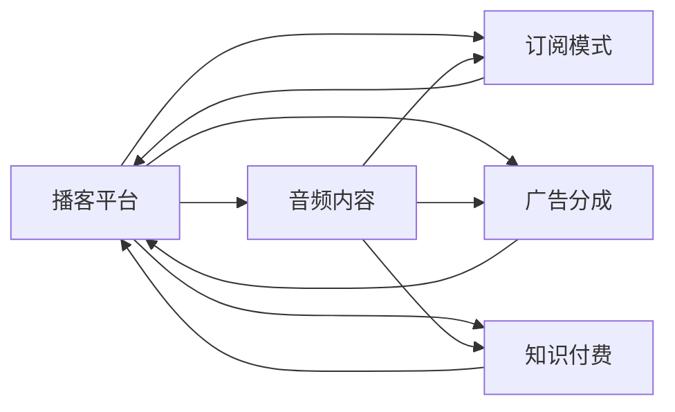

                 

# 如何利用播客平台实现知识变现

> 关键词：播客平台,知识变现,音频内容,订阅模式,广告分成,知识付费,播客运营

## 1. 背景介绍

播客(Podcast)是一种新兴的音频内容形式，通过网络平台分发，听众可以在任何时间、任何地点收听。自2005年苹果公司推出iPod和iTunes Store以来，播客迅速发展，成为全球增长最快的媒体形式之一。如今，播客平台如Spotify、Apple Podcasts、Google Podcasts等已积累数亿用户，音频内容丰富，涵盖教育、娱乐、技术、财经等多个领域。

播客平台的流行不仅满足了人们多样化的信息需求，也孕育了新的商业模式。本文将从播客平台的知识变现模式入手，探讨如何在播客领域中实现知识变现，以期为内容创作者和平台运营商提供实用的指导。

## 2. 核心概念与联系

### 2.1 核心概念概述

为了更好地理解播客平台中的知识变现模式，我们需要先了解一些核心概念：

- **播客平台(Podcast Platforms)**：是指提供播客内容的平台，如Spotify、Apple Podcasts等，通过收集和推荐播客内容，吸引用户订阅和收听。

- **知识变现(Knowledge Monetization)**：是指将知识或信息转化为经济收益的过程，包括订阅费、广告分成、课程销售等多种形式。

- **音频内容(Audio Content)**：是指通过播客平台分发的音频文件，包括播客节目、访谈、讲座等。

- **订阅模式(Subscription Model)**：是指用户为获得特定播客节目的连续播放权而支付的定期费用。

- **广告分成(Ad Revenue Sharing)**：是指播客平台通过向广告商展示广告，并将广告收入按照一定比例分配给内容创作者。

- **知识付费(Knowledge-Based Pricing)**：是指用户为获取特定知识或信息而支付的费用，常见于付费播客、在线课程、专业咨询等形式。

这些核心概念之间相互关联，共同构成了播客平台知识变现的逻辑框架。以下是一个Mermaid流程图，展示了这些概念之间的联系：



这个流程图展示了播客平台、音频内容、订阅模式、广告分成和知识付费之间的关系。播客平台通过收集和推荐音频内容，吸引用户订阅、收听；同时通过广告分成和知识付费获得收入，实现知识变现。

## 3. 核心算法原理 & 具体操作步骤
### 3.1 算法原理概述

播客平台的知识变现主要依赖于订阅模式、广告分成和知识付费三种机制。以下是对这三种机制的算法原理概述：

- **订阅模式**：用户为获得特定播客节目的连续播放权而支付的定期费用。平台通过收取订阅费，将知识变现转化为持续的收入流。

- **广告分成**：平台通过向广告商展示广告，并将广告收入按照一定比例分配给内容创作者。广告分成机制为平台提供了额外的收入来源，同时激励创作者生产高质量内容。

- **知识付费**：用户为获取特定知识或信息而支付的费用。这种模式直接将知识变现转化为创作者的经济收益，激励创作者生产和分享高质量知识。

### 3.2 算法步骤详解

以下是播客平台知识变现的具体操作步骤：

**Step 1: 内容创作与分发**

- 内容创作者创作高质量的音频内容，并将其上传到播客平台。平台进行内容审核和筛选，确保内容符合平台标准。

**Step 2: 用户订阅**

- 平台提供多种订阅计划，如免费、月度、季度、年度等。用户可以选择订阅特定的播客节目或平台提供的精选内容包。

**Step 3: 广告分成**

- 平台与广告商合作，将广告位嵌入播客节目中。用户收听时，广告商支付平台一定费用，平台再将部分收入分配给内容创作者。

**Step 4: 知识付费**

- 平台提供付费订阅、单次购买、会员专享内容等形式的知识付费服务。用户通过支付费用，获取特定知识或信息。

**Step 5: 收入结算**

- 平台根据订阅、广告分成和知识付费等渠道的收入，进行结算和分配。创作者通过平台系统获取收益。

**Step 6: 用户反馈与优化**

- 平台收集用户反馈，优化内容和订阅模式，提升用户满意度和留存率。

### 3.3 算法优缺点

播客平台的知识变现模式具有以下优点：

- **灵活性高**：不同类型的内容创作者可以根据自身需求选择不同的变现方式。
- **持续收入**：订阅模式提供了稳定的收入流，广告分成和知识付费增加了额外的收入来源。
- **激励机制**：通过广告分成和知识付费，激励创作者生产和分享高质量内容。

同时，这种模式也存在一些缺点：

- **市场竞争激烈**：播客平台众多，用户订阅和内容竞争激烈。
- **内容质量参差不齐**：部分创作者为了吸引用户，可能会生产低质量内容，影响平台整体口碑。
- **用户流失率较高**：部分用户可能仅订阅某一期节目，导致收入不稳定。

### 3.4 算法应用领域

播客平台的知识变现模式主要应用于以下领域：

- **教育与培训**：如英语学习、编程课程、职业技能培训等，创作者通过提供专业知识和技能培训，获得订阅费和付费课程收入。
- **娱乐与文化**：如故事讲述、音乐创作、影视评论等，创作者通过提供娱乐和文化内容，吸引用户订阅和购买。
- **技术与应用**：如编程技术、人工智能、区块链等，创作者通过分享最新的技术进展和应用案例，获得知识付费收入。
- **财经与投资**：如股票分析、投资策略、市场预测等，创作者通过提供财经知识和投资建议，吸引投资者订阅和付费。

播客平台的知识变现模式已经广泛应用于多个领域，为内容创作者提供了广阔的发展空间。

## 4. 数学模型和公式 & 详细讲解  
### 4.1 数学模型构建

为了更好地理解播客平台的知识变现机制，我们可以从数学角度构建一个简单的模型。

假设一个播客平台有$N$个用户，每个用户可以订阅$M$个播客节目，每个播客节目有$K$个订阅者，平台有$C$个广告位，每个广告位每天的展示次数为$T$，每次展示获得的广告收入为$A$。同时，平台有$S$个内容创作者，每个创作者发布$a_i$期节目，每期节目的订阅费用为$p_i$，用户每期的支付概率为$q_i$。

平台通过订阅费、广告分成和知识付费获得总收益$R$，则：

$$
R = \sum_{i=1}^{S} a_i \cdot p_i \cdot q_i + C \cdot T \cdot A
$$

### 4.2 公式推导过程

以订阅模式为例，推导平台通过订阅费获得的收入：

- **单期订阅收入**：用户支付$P$元订阅一期节目，平台获得$P$元收入。
- **多期订阅收入**：用户支付$nP$元订阅$n$期节目，平台获得$nP$元收入。
- **总订阅收入**：平台获得总订阅收入$R_{sub} = \sum_{i=1}^{M} \sum_{j=1}^{N} a_i \cdot p_i \cdot q_i \cdot n$。

将总订阅收入$R_{sub}$代入总收益$R$的公式中，得到：

$$
R = R_{sub} + C \cdot T \cdot A
$$

通过这个公式，我们可以看出，平台通过订阅费和广告分成获得的收入是相加关系。广告分成$C \cdot T \cdot A$和订阅费$R_{sub}$共同构成了平台的总收入。

### 4.3 案例分析与讲解

以苹果公司推出的Apple Podcasts为例，分析其知识变现模式的实际应用。

**订阅模式**：Apple Podcasts提供免费和付费订阅服务。用户可以选择订阅单个播客节目或Apple提供的精选内容包，付费订阅的单价为$0.99美元/期，内容包价格根据订阅期数而定。

**广告分成**：Apple Podcasts在节目中展示Apple Music、AirPods等品牌的广告，通过广告分成获取收入。

**知识付费**：Apple Podcasts提供部分优质节目的付费下载服务，用户可以通过Apple ID支付$0.99美元/次下载。

通过以上三种变现方式，Apple Podcasts在2017年实现了超过1500万美元的收入，并在2020年用户数量达到1.75亿。

## 5. 项目实践：代码实例和详细解释说明
### 5.1 开发环境搭建

在进行播客平台知识变现的开发实践前，我们需要准备好开发环境。以下是使用Python进行Django开发的环境配置流程：

1. 安装Anaconda：从官网下载并安装Anaconda，用于创建独立的Python环境。

2. 创建并激活虚拟环境：
```bash
conda create -n podcast-env python=3.8 
conda activate podcast-env
```

3. 安装Django：从官网获取并安装Django。
```bash
pip install django
```

4. 安装其他依赖包：
```bash
pip install django-cors-headers djangorestframework markdown django-axes
```

5. 安装Celery：用于异步任务处理。
```bash
pip install celery
```

完成上述步骤后，即可在`podcast-env`环境中开始播客平台知识变现的开发实践。

### 5.2 源代码详细实现

以下是一个简化版的播客平台知识变现的Django项目代码实现。

首先，定义用户模型和订阅模型：

```python
from django.db import models
from django.contrib.auth.models import User

class Subscription(models.Model):
    user = models.ForeignKey(User, on_delete=models.CASCADE)
    program = models.ForeignKey('Program', on_delete=models.CASCADE)
    start_date = models.DateTimeField()
    end_date = models.DateTimeField()
    payment = models.DecimalField(max_digits=10, decimal_places=2)
    created_at = models.DateTimeField(auto_now_add=True)
    updated_at = models.DateTimeField(auto_now=True)

class Program(models.Model):
    title = models.CharField(max_length=255)
    description = models.TextField()
    created_at = models.DateTimeField(auto_now_add=True)
    updated_at = models.DateTimeField(auto_now=True)
```

然后，定义广告模型和广告收入模型：

```python
class Ad(models.Model):
    title = models.CharField(max_length=255)
    url = models.URLField()
    start_date = models.DateTimeField()
    end_date = models.DateTimeField()
    created_at = models.DateTimeField(auto_now_add=True)
    updated_at = models.DateTimeField(auto_now=True)

class AdRevenue(models.Model):
    ad = models.ForeignKey(Ad, on_delete=models.CASCADE)
    revenue = models.DecimalField(max_digits=10, decimal_places=2)
    created_at = models.DateTimeField(auto_now_add=True)
    updated_at = models.DateTimeField(auto_now=True)
```

接着，定义订阅支付模型和收入结算模型：

```python
class Payment(models.Model):
    subscription = models.ForeignKey(Subscription, on_delete=models.CASCADE)
    amount = models.DecimalField(max_digits=10, decimal_places=2)
    created_at = models.DateTimeField(auto_now_add=True)
    updated_at = models.DateTimeField(auto_now=True)

class Income(models.Model):
    payment = models.ForeignKey(Payment, on_delete=models.CASCADE)
    total = models.DecimalField(max_digits=10, decimal_places=2)
    created_at = models.DateTimeField(auto_now_add=True)
    updated_at = models.DateTimeField(auto_now=True)
```

最后，定义播客节目模型和用户订阅关系模型：

```python
class Program(models.Model):
    title = models.CharField(max_length=255)
    description = models.TextField()
    created_at = models.DateTimeField(auto_now_add=True)
    updated_at = models.DateTimeField(auto_now=True)

class Subscription(models.Model):
    user = models.ForeignKey(User, on_delete=models.CASCADE)
    program = models.ForeignKey(Program, on_delete=models.CASCADE)
    start_date = models.DateTimeField()
    end_date = models.DateTimeField()
    payment = models.DecimalField(max_digits=10, decimal_places=2)
    created_at = models.DateTimeField(auto_now_add=True)
    updated_at = models.DateTimeField(auto_now=True)
```

在上述模型定义完成后，可以开始编写视图函数和API接口，处理用户的订阅、广告展示和收入结算等逻辑。例如，以下是一个简单的订阅支付API接口：

```python
from django.http import JsonResponse

def pay_subscription(request):
    if request.method == 'POST':
        data = request.POST
        user = request.user
        program = Program.objects.get(id=data['program_id'])
        subscription = Subscription.objects.create(user=user, program=program, start_date=data['start_date'], end_date=data['end_date'], payment=data['payment'])
        return JsonResponse({'success': True, 'subscription': subscription.id})
    else:
        return JsonResponse({'success': False, 'error': 'Invalid method'})
```

通过以上代码，我们已经实现了一个基本的播客平台知识变现功能，包括订阅管理、广告展示和收入结算等基本逻辑。

### 5.3 代码解读与分析

让我们再详细解读一下关键代码的实现细节：

**订阅模型**：
- `Subscription`模型表示用户对某个播客节目的订阅关系，包括用户ID、订阅节目ID、开始时间、结束时间、支付金额等字段。

**广告模型**：
- `Ad`模型表示平台上的广告信息，包括广告标题、广告链接、开始时间、结束时间等字段。

**广告收入模型**：
- `AdRevenue`模型表示广告展示后获得的收入，包括广告ID、广告收入等字段。

**订阅支付模型**：
- `Payment`模型表示用户对订阅的支付记录，包括订阅ID、支付金额等字段。

**收入结算模型**：
- `Income`模型表示平台的总收入，包括支付ID、总收入等字段。

**播客节目模型**：
- `Program`模型表示播客节目信息，包括节目标题、描述等字段。

通过以上模型和视图函数的定义，我们已经实现了一个基本的播客平台知识变现功能，包括订阅管理、广告展示和收入结算等基本逻辑。

## 6. 实际应用场景

### 6.1 播客平台运营

播客平台的知识变现模式已经在全球范围内得到了广泛应用，如Spotify、Apple Podcasts、Google Podcasts等平台。以Apple Podcasts为例，其订阅模式和广告分成机制为平台带来了稳定的收入流，并通过知识付费服务增加了额外的收入来源。平台通过精准的推荐算法和内容审核机制，提升了用户留存率和满意度，实现了商业化运营。

### 6.2 内容创作者变现

播客平台的知识变现不仅限于平台运营商，内容创作者也可以通过多种方式实现变现。例如，创作者可以通过平台提供的广告分成机制，分享高质量广告内容，获得广告收入。同时，创作者也可以开通付费订阅、推出会员专享内容等形式，直接向用户收取费用，实现知识变现。

## 7. 工具和资源推荐

### 7.1 学习资源推荐

为了帮助开发者系统掌握播客平台的知识变现技术，这里推荐一些优质的学习资源：

1. **Django官方文档**：Django是一个流行的Python Web框架，适合开发复杂的功能性网站和API。其官方文档详细介绍了Django的核心功能和使用技巧。

2. **RESTful API设计指南**：RESTful API是现代Web服务的基础，掌握API设计原则和最佳实践，对于构建高效的播客平台知识变现系统至关重要。

3. **Django REST framework**：一个流行的Django Web框架，提供了丰富的RESTful API支持，适合构建复杂的Web服务和API。

4. **Celery官方文档**：Celery是一个流行的异步任务队列，支持分布式任务处理和调度，适合处理播客平台的高并发场景。

5. **AdReduce**：一个广告收入分配工具，支持多种广告收入模式，帮助播客平台实现广告分成和收入分配。

通过对这些资源的学习实践，相信你一定能够快速掌握播客平台知识变现的核心技术，并用于解决实际的播客平台开发问题。

### 7.2 开发工具推荐

高效的开发离不开优秀的工具支持。以下是几款用于播客平台知识变现开发的常用工具：

1. **Django**：一个流行的Python Web框架，适合开发复杂的功能性网站和API。其内置的ORM、模板系统和中间件机制，极大地简化了Web开发流程。

2. **Django REST framework**：一个流行的Django Web框架，提供了丰富的RESTful API支持，适合构建复杂的Web服务和API。

3. **Celery**：一个流行的异步任务队列，支持分布式任务处理和调度，适合处理播客平台的高并发场景。

4. **AdReduce**：一个广告收入分配工具，支持多种广告收入模式，帮助播客平台实现广告分成和收入分配。

5. **Markdown**：一种轻量级标记语言，适合用于内容创作和文档编写。

合理利用这些工具，可以显著提升播客平台知识变现任务的开发效率，加快创新迭代的步伐。

### 7.3 相关论文推荐

播客平台的知识变现技术源于学界的持续研究。以下是几篇奠基性的相关论文，推荐阅读：

1. **Podcast Revenue Models**：研究播客平台的不同收入模式，包括广告分成、订阅费和知识付费等。

2. **User Subscription Dynamics**：分析用户订阅行为和订阅周期，提出模型预测订阅用户的生命周期价值。

3. **Programmatic Advertising**：探讨程序化广告的实现机制，通过程序化广告平台实现精准广告投放。

4. **Content Monetization**：研究内容创作者的变现策略，包括平台分成、广告分成和知识付费等。

5. **Podcast Analytics**：利用数据分析技术，优化播客平台的内容推荐和用户留存策略。

这些论文代表了大规模播客平台知识变现技术的发展脉络。通过学习这些前沿成果，可以帮助研究者把握学科前进方向，激发更多的创新灵感。

## 8. 总结：未来发展趋势与挑战

### 8.1 总结

本文对播客平台的知识变现模式进行了全面系统的介绍。首先阐述了播客平台的背景和知识变现的必要性，明确了知识变现在播客平台中的重要性和价值。其次，从算法原理到具体操作步骤，详细讲解了播客平台知识变现的实现过程，包括内容创作、用户订阅、广告分成和知识付费等关键环节。同时，本文还广泛探讨了播客平台知识变现在多个领域的应用场景，展示了知识变现的广泛潜力和应用前景。此外，本文精选了播客平台知识变现的各类学习资源，力求为开发者提供全方位的技术指引。

通过本文的系统梳理，可以看到，播客平台的知识变现模式已经逐渐成为行业标准，为内容创作者和平台运营商提供了稳定可行的收入来源。未来，伴随技术的持续进步和市场的不断扩展，播客平台的知识变现将迎来新的发展机遇，为内容创作者和用户提供更加丰富和多样化的服务体验。

### 8.2 未来发展趋势

展望未来，播客平台的知识变现技术将呈现以下几个发展趋势：

1. **人工智能技术的应用**：通过引入自然语言处理和语音识别技术，优化内容推荐和广告投放，提升用户体验和广告效果。

2. **区块链技术的应用**：通过区块链技术实现透明化的收入分配和版权保护，确保内容创作者和平台的利益。

3. **多元化收入来源**：除了广告分成和订阅费，播客平台将探索更多收入来源，如周边产品销售、会员增值服务等。

4. **国际化和本地化**：播客平台将加速国际化进程，针对不同国家和地区的文化和语言差异，提供本地化的内容和变现策略。

5. **智能推荐系统**：通过大数据分析和机器学习技术，构建智能推荐系统，提升用户留存率和满意度。

以上趋势凸显了播客平台知识变现技术的广阔前景。这些方向的探索发展，必将进一步提升播客平台的变现能力和用户满意度，为内容创作者和平台运营商提供更广阔的发展空间。

### 8.3 面临的挑战

尽管播客平台的知识变现技术已经取得了显著成就，但在迈向更加智能化、普适化应用的过程中，仍面临诸多挑战：

1. **用户留存率低**：部分用户可能仅订阅一期节目，导致收入不稳定。

2. **内容质量参差不齐**：部分创作者为了吸引用户，可能会生产低质量内容，影响平台整体口碑。

3. **市场竞争激烈**：播客平台众多，用户订阅和内容竞争激烈。

4. **广告欺诈**：部分广告商可能虚报广告收入，导致平台收益受损。

5. **技术壁垒高**：内容推荐和广告投放算法复杂，需要高水平的技术支持。

这些挑战凸显了播客平台知识变现的复杂性和多样性。未来，需要进一步优化算法、提高平台运营效率，才能实现持续健康的发展。

### 8.4 研究展望

面对播客平台知识变现所面临的挑战，未来的研究需要在以下几个方面寻求新的突破：

1. **个性化推荐算法**：引入推荐系统算法，根据用户行为和偏好，精准推荐高质量内容。

2. **广告欺诈检测**：利用机器学习技术，识别和拦截虚报广告的欺诈行为，保护平台收益。

3. **内容质量控制**：建立内容审核机制，确保高质量内容的产出和发布。

4. **用户行为分析**：利用数据分析技术，深入理解用户行为，优化订阅模式和广告投放策略。

5. **区块链应用**：探索区块链技术在播客平台中的应用，提升收入分配的透明度和可信度。

这些研究方向将进一步推动播客平台知识变现技术的成熟和普及，为内容创作者和平台运营商提供更加稳定和高效的变现手段。

## 9. 附录：常见问题与解答

**Q1：播客平台如何进行精准的广告投放？**

A: 播客平台可以通过以下几个步骤进行精准的广告投放：

1. **用户行为分析**：利用数据分析技术，深入理解用户的兴趣和行为，建立用户画像。

2. **内容推荐系统**：根据用户画像，推荐可能感兴趣的内容和广告。

3. **A/B测试**：通过A/B测试，优化广告投放策略，提升广告效果。

4. **实时监控和优化**：利用实时监控工具，实时监控广告效果，及时调整投放策略。

**Q2：如何确保播客平台的知识变现模式的合法性？**

A: 播客平台的知识变现模式必须遵守当地法律法规，确保合法合规。具体措施包括：

1. **内容审核机制**：建立严格的内容审核机制，确保内容合法、健康。

2. **广告合规检查**：对广告进行合规性检查，确保广告内容不违法违规。

3. **隐私保护**：确保用户数据和隐私安全，遵守相关法律法规。

4. **知识产权保护**：确保平台内容不侵犯他人知识产权，尊重版权。

**Q3：播客平台的知识变现模式有哪些优缺点？**

A: 播客平台的知识变现模式具有以下优点：

1. **灵活性高**：不同类型的内容创作者可以根据自身需求选择不同的变现方式。

2. **持续收入**：订阅模式提供了稳定的收入流，广告分成和知识付费增加了额外的收入来源。

3. **激励机制**：通过广告分成和知识付费，激励创作者生产和分享高质量内容。

同时，这种模式也存在一些缺点：

1. **市场竞争激烈**：播客平台众多，用户订阅和内容竞争激烈。

2. **用户流失率较高**：部分用户可能仅订阅一期节目，导致收入不稳定。

3. **内容质量参差不齐**：部分创作者为了吸引用户，可能会生产低质量内容，影响平台整体口碑。

4. **技术壁垒高**：内容推荐和广告投放算法复杂，需要高水平的技术支持。

这些优缺点决定了播客平台知识变现模式的适用范围和局限性。

**Q4：如何优化播客平台的内容推荐算法？**

A: 播客平台的内容推荐算法可以从以下几个方面进行优化：

1. **用户行为分析**：利用用户行为数据，建立用户画像，理解用户的兴趣和偏好。

2. **内容相似度计算**：计算内容之间的相似度，推荐用户可能感兴趣的内容。

3. **实时反馈优化**：利用用户反馈数据，实时优化推荐算法，提升推荐效果。

4. **多维度推荐**：结合用户画像、内容属性、用户互动等多维度信息，提供更加精准的推荐。

**Q5：播客平台的知识变现模式在技术上需要注意哪些问题？**

A: 播客平台的知识变现模式在技术上需要注意以下几个问题：

1. **系统架构设计**：合理设计系统架构，确保系统可扩展、高可用。

2. **数据库优化**：优化数据库设计，确保数据一致性和查询效率。

3. **负载均衡**：实现负载均衡，确保高并发场景下的系统性能。

4. **安全性**：确保系统安全性，防止攻击和数据泄露。

5. **隐私保护**：确保用户数据和隐私安全，遵守相关法律法规。

通过以上优化措施，可以进一步提升播客平台知识变现系统的稳定性和可靠性，为用户提供更好的使用体验。

---

作者：禅与计算机程序设计艺术 / Zen and the Art of Computer Programming

