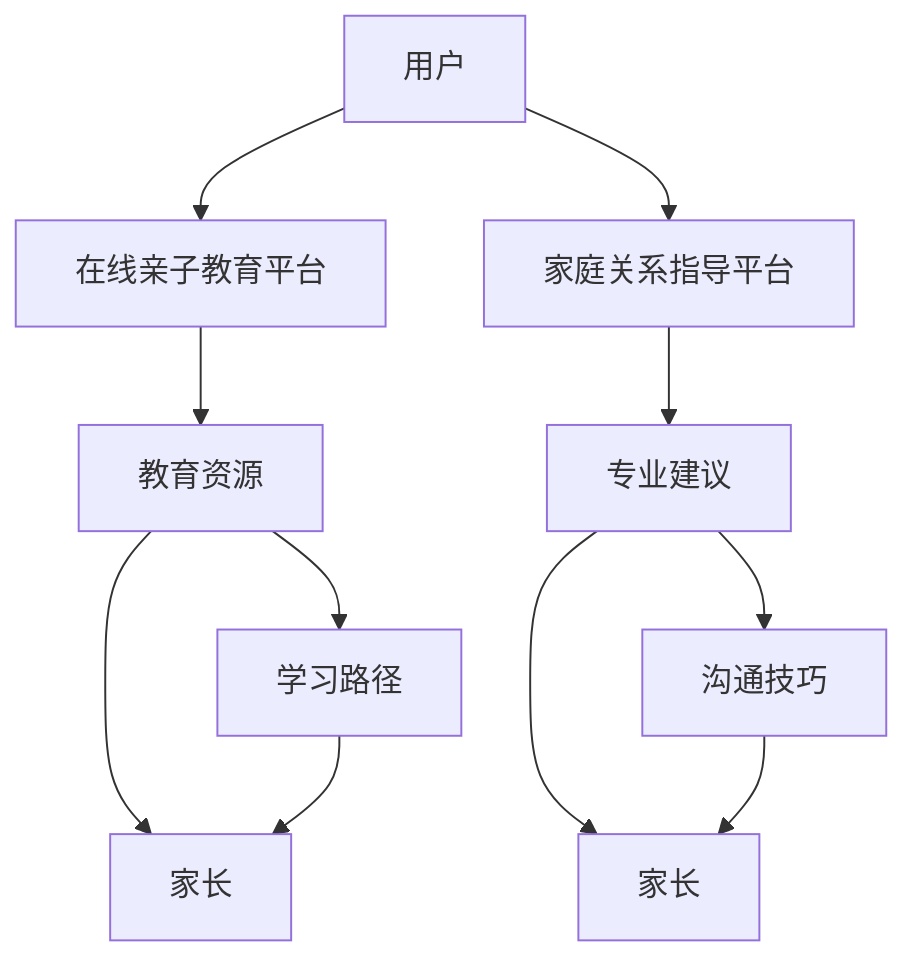

                 

# 如何利用知识付费实现在线亲子教育与家庭关系指导？

在数字时代的浪潮中，知识的传播方式发生了巨大的变化。知识付费作为其中一种新兴的模式，正在快速改变人们获取知识的方式。在众多知识付费领域中，在线亲子教育与家庭关系指导逐渐成为热门的领域。本文将深入探讨如何利用知识付费实现在线亲子教育与家庭关系指导。

## 1. 背景介绍

随着互联网技术的普及，家长和教育机构都在积极寻找更加高效、灵活、个性化的教育方式。知识付费作为在线教育的重要组成部分，为家长提供了获取优质教育资源的途径。而家庭关系指导，作为社会发展的现实需求，同样可以通过知识付费的方式获得高质量的解决方案。

## 2. 核心概念与联系

### 2.1 核心概念概述

- **知识付费**：指用户通过付费购买、订阅在线课程、咨询专家等方式，获取专业知识和服务的模式。
- **在线亲子教育**：通过互联网平台，为家长提供的教育资源，包括课程、游戏、互动活动等，以促进亲子关系和儿童发展。
- **家庭关系指导**：为家长提供关于如何处理家庭关系、冲突、沟通等方面的专业指导和建议。

### 2.2 核心概念原理和架构的 Mermaid 流程图



## 3. 核心算法原理 & 具体操作步骤

### 3.1 算法原理概述

知识付费在在线亲子教育与家庭关系指导中的核心原理在于，通过平台汇聚优质资源，并通过价格机制筛选出最专业、最优质的教育内容。家长通过付费获取这些内容，从而获得专业的指导和建议。

### 3.2 算法步骤详解

1. **平台建设**：搭建在线亲子教育和家庭关系指导平台，并汇聚优质的教育资源和专业建议。

2. **用户画像**：根据用户的年龄、兴趣、需求等信息，生成用户画像，以便推荐合适的教育内容。

3. **内容推荐**：利用推荐算法，如协同过滤、内容过滤等，为用户推荐适合的教育资源和专业建议。

4. **付费机制**：设置合理的付费机制，如按次购买、订阅服务、长期包月等，让用户能够以合理的价格获取优质内容。

5. **互动反馈**：通过用户反馈和评价，不断优化和改进教育内容和服务，提升用户体验。

### 3.3 算法优缺点

**优点**：
- 汇聚优质资源：通过知识付费模式，汇聚了优质的教育资源和专业建议，有助于提升家长和孩子的学习效果。
- 个性化推荐：通过用户画像和推荐算法，能够为每位用户提供个性化的教育资源和服务。
- 支付简单：用户支付简单，能够快速获取所需内容，提高了用户的满意度和使用率。

**缺点**：
- 高昂成本：对于一些家长来说，付费教育成本较高，可能存在一定的经济压力。
- 信息过载：过多的教育资源和建议可能让家长感到困惑，难以选择。
- 缺乏互动：在线教育缺乏面对面的互动，可能影响教育效果。

### 3.4 算法应用领域

知识付费在在线亲子教育与家庭关系指导中的应用领域非常广泛，主要包括以下几个方面：

- 在线课程：提供各类学科课程，帮助孩子提升学习成绩。
- 亲子游戏：设计互动性强的亲子游戏，增强亲子关系。
- 心理咨询：提供专业的心理辅导，帮助家长解决家庭关系问题。
- 育儿指导：提供专业的育儿建议，帮助家长更好地照顾孩子。

## 4. 数学模型和公式 & 详细讲解 & 举例说明

### 4.1 数学模型构建

我们以推荐算法为例，构建用户与教育资源的推荐模型。假设用户 $U$ 和教育资源 $R$，推荐模型 $M$ 的构建步骤如下：

1. **用户画像**：
   - 用户 $U$ 的属性表示为 $u=(u_1, u_2, \cdots, u_n)$。
   - $u_i$ 表示用户 $U$ 在属性 $i$ 上的评分，$i \in [1, n]$。

2. **资源画像**：
   - 教育资源 $R$ 的属性表示为 $r=(r_1, r_2, \cdots, r_m)$。
   - $r_j$ 表示资源 $R$ 在属性 $j$ 上的评分，$j \in [1, m]$。

3. **用户与资源的相似度**：
   - 用户 $U$ 与资源 $R$ 的相似度表示为 $s(U, R)$。

4. **推荐结果**：
   - 根据相似度，计算推荐结果 $p(R|U)$。

### 4.2 公式推导过程

推荐算法的核心公式为：

$$
p(R|U) = \frac{s(U, R) \cdot \alpha}{\sum_{R' \in R} s(U, R') \cdot \alpha}
$$

其中：
- $s(U, R)$ 表示用户 $U$ 和资源 $R$ 的相似度。
- $\alpha$ 为归一化系数。

### 4.3 案例分析与讲解

假设某用户在亲子教育平台的评分为：

- 教育资源 A 评分为 4
- 教育资源 B 评分为 3
- 教育资源 C 评分为 5
- 教育资源 D 评分为 2

则推荐结果为：

- $p(A|U) = \frac{4 \cdot \alpha}{(4 \cdot \alpha) + (3 \cdot \alpha) + (5 \cdot \alpha) + (2 \cdot \alpha)} = \frac{4}{14}$
- $p(B|U) = \frac{3 \cdot \alpha}{(4 \cdot \alpha) + (3 \cdot \alpha) + (5 \cdot \alpha) + (2 \cdot \alpha)} = \frac{3}{14}$
- $p(C|U) = \frac{5 \cdot \alpha}{(4 \cdot \alpha) + (3 \cdot \alpha) + (5 \cdot \alpha) + (2 \cdot \alpha)} = \frac{5}{14}$
- $p(D|U) = \frac{2 \cdot \alpha}{(4 \cdot \alpha) + (3 \cdot \alpha) + (5 \cdot \alpha) + (2 \cdot \alpha)} = \frac{2}{14}$

用户可以根据推荐结果选择最适合自己的教育资源。

## 5. 项目实践：代码实例和详细解释说明

### 5.1 开发环境搭建

1. 选择适合的编程语言：Python 或 JavaScript。
2. 安装相关框架：如 Flask、Django、Node.js 等。
3. 搭建服务器环境：如阿里云、腾讯云等云服务提供商。

### 5.2 源代码详细实现

以下是一个简单的 Python Flask 应用示例：

```python
from flask import Flask, request, render_template
import pandas as pd

app = Flask(__name__)

@app.route('/')
def index():
    user_id = request.args.get('user_id')
    # 从数据库中读取用户画像和教育资源画像
    user_data = pd.read_csv('user_data.csv')
    resource_data = pd.read_csv('resource_data.csv')
    # 计算相似度
    similarity = user_data.merge(resource_data, on='id').groupby('resource_id')['user_score'].mean()
    # 计算推荐结果
    recommendation = similarity / similarity.sum()
    # 获取推荐前N个资源
    top_resources = recommendation.nlargest(5).index.tolist()
    # 渲染推荐页面
    return render_template('recommend.html', resources=top_resources)

if __name__ == '__main__':
    app.run(debug=True)
```

### 5.3 代码解读与分析

- `index` 函数：根据用户 ID 获取用户画像和教育资源画像，计算相似度，生成推荐结果。
- `recommend.html` 模板：展示推荐结果。
- 数据库：使用 MySQL 或 MongoDB 等关系型/非关系型数据库存储用户画像和教育资源数据。

### 5.4 运行结果展示

运行上述代码，访问 `localhost:5000`，即可获取用户的推荐教育资源列表。

## 6. 实际应用场景

### 6.1 智能陪伴

在线亲子教育平台可以提供智能陪伴功能，如智能聊天机器人，根据用户的输入自动回复，与孩子进行互动，增强亲子关系。

### 6.2 个性化学习

通过分析用户的兴趣和学习行为，平台可以推荐适合的学习资源，帮助孩子提升学习效果。

### 6.3 家庭关系管理

家庭关系指导平台可以通过心理辅导、家庭关系评估等方式，帮助家长解决家庭关系问题。

### 6.4 未来应用展望

未来，随着技术的发展，知识付费在在线亲子教育与家庭关系指导中的应用将更加广泛和深入。例如：

- **人工智能**：通过 AI 技术，平台可以提供更加个性化的教育资源和家庭关系指导。
- **大数据分析**：利用大数据分析用户行为和偏好，提供精准的推荐服务。
- **社交网络**：建立家长社群，促进家长之间的交流和分享，提升用户体验。

## 7. 工具和资源推荐

### 7.1 学习资源推荐

1. **Coursera**：提供各类在线课程，涵盖教育、家庭关系等多个领域。
2. **Udemy**：提供全球顶尖专家授课的课程，内容丰富多样。
3. **Khan Academy**：免费提供高质量的教育资源，适合各个年龄段的学习者。

### 7.2 开发工具推荐

1. **Flask**：简单易用的 Python Web 框架，适合搭建在线课程和家庭关系指导平台。
2. **Django**：功能强大的 Python Web 框架，适合搭建复杂的在线教育平台。
3. **Node.js**：轻量级的 JavaScript 运行环境，适合搭建智能陪伴功能。

### 7.3 相关论文推荐

1. **在线教育平台的个性化推荐算法研究**：探讨如何利用推荐算法提升在线教育平台的用户体验。
2. **家庭关系指导中的心理辅导模型研究**：分析如何利用心理辅导模型帮助家长解决家庭关系问题。
3. **知识付费模式下的用户行为研究**：研究用户对知识付费模式的态度和行为。

## 8. 总结：未来发展趋势与挑战

### 8.1 研究成果总结

知识付费在在线亲子教育与家庭关系指导中的应用，已经取得了一定的成果。通过汇聚优质资源和专业建议，为用户提供个性化的教育资源和家庭关系指导，有助于提升家长和孩子的学习效果，解决家庭关系问题。

### 8.2 未来发展趋势

未来，随着技术的进步，知识付费将进一步推动在线亲子教育和家庭关系指导的发展。例如：

- **人工智能**：利用 AI 技术提升教育效果和家庭关系管理。
- **大数据分析**：通过大数据分析，提供更加精准的推荐服务。
- **社交网络**：建立家长社群，促进家长之间的交流和分享。

### 8.3 面临的挑战

尽管知识付费在在线亲子教育与家庭关系指导中的应用前景广阔，但仍面临一些挑战：

- **内容质量**：如何确保教育资源和专业建议的质量，避免误导家长和孩子。
- **用户隐私**：如何保护用户隐私，防止数据泄露。
- **支付安全**：如何确保支付安全，防止诈骗和欺诈行为。

### 8.4 研究展望

未来，研究者需要关注以下几个方面：

- **内容质量保障**：建立严格的审核机制，确保教育资源和专业建议的质量。
- **隐私保护**：采用先进的加密技术，保护用户隐私。
- **支付安全**：开发安全可靠的交易系统，确保支付安全。

## 9. 附录：常见问题与解答

### Q1：知识付费在在线亲子教育与家庭关系指导中的应用有哪些？

A: 知识付费在在线亲子教育与家庭关系指导中的应用包括：
- 在线课程：提供各类学科课程，帮助孩子提升学习成绩。
- 亲子游戏：设计互动性强的亲子游戏，增强亲子关系。
- 心理咨询：提供专业的心理辅导，帮助家长解决家庭关系问题。
- 育儿指导：提供专业的育儿建议，帮助家长更好地照顾孩子。

### Q2：如何确保教育资源和专业建议的质量？

A: 确保教育资源和专业建议的质量需要建立严格的审核机制，包括：
- 专家认证：邀请权威专家提供内容，并对其进行认证。
- 用户评价：建立用户评价体系，让用户对教育资源和专业建议进行评分和评论。
- 数据分析：通过数据分析，及时发现问题内容并进行处理。

### Q3：如何保护用户隐私？

A: 保护用户隐私需要采取以下措施：
- 数据加密：采用先进的加密技术，保护用户数据的安全。
- 匿名处理：对用户数据进行匿名化处理，防止数据泄露。
- 隐私协议：制定隐私协议，明确数据使用范围和保护措施。

### Q4：如何确保支付安全？

A: 确保支付安全需要采取以下措施：
- 采用安全支付协议：如 SSL/TLS 加密协议，保护支付数据的安全。
- 身份验证：采用身份验证技术，防止欺诈和诈骗行为。
- 风险监控：建立风险监控机制，及时发现和处理异常交易。

### Q5：如何提升用户满意度？

A: 提升用户满意度需要从多个方面入手：
- 个性化推荐：根据用户画像和行为，提供个性化的教育资源和专业建议。
- 用户体验：优化界面设计和功能体验，提升用户使用满意度。
- 用户反馈：建立用户反馈机制，及时了解用户需求和建议，进行改进。

---

作者：禅与计算机程序设计艺术 / Zen and the Art of Computer Programming

