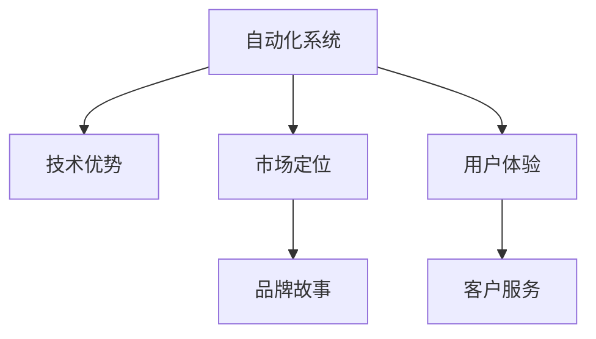

                 

# 如何在自动化创业中实现产品差异化

## 1. 背景介绍

### 1.1 问题由来
在现代商业环境中，自动化技术的飞速发展为各行各业带来了深刻的变革。特别是在制造业、物流、金融等传统领域，自动化解决方案正在逐步替代人工劳动，提升效率和生产能力。但与此同时，自动化产品的同质化问题也愈发突出，如何在众多自动化方案中脱颖而出，实现产品差异化，成为了创业者和企业的首要任务。

### 1.2 问题核心关键点
实现自动化产品的差异化，关键在于从技术、市场、品牌等多个维度综合考虑，找到独特的价值主张。具体包括：
1. **技术优势**：构建具有核心技术的自动化系统，提供超越竞争对手的功能和性能。
2. **市场定位**：根据市场需求和竞争格局，找到产品定位的细分市场。
3. **品牌故事**：塑造独特的品牌形象和企业文化，增强品牌认同感。
4. **用户体验**：提供人性化的用户界面和操作体验，满足用户需求。
5. **客户服务**：提供高效、专业、贴心的售后服务，建立良好客户关系。

### 1.3 问题研究意义
实现自动化产品的差异化，对于创业者来说具有重要意义：
1. 在激烈的市场竞争中，独特的价值主张可以吸引用户，提升市场占有率。
2. 通过技术创新和品牌建设，可以树立行业领导地位，获得更高的利润和品牌价值。
3. 强化用户体验和客户服务，可以提升客户满意度，增强用户粘性。

## 2. 核心概念与联系

### 2.1 核心概念概述

为更好地理解如何在自动化创业中实现产品差异化，本节将介绍几个密切相关的核心概念：

- **自动化系统**：通过软件、硬件等技术手段，实现自动化的生产、管理、服务等过程。
- **技术优势**：指自动化系统具备的独特技术能力，如高精度、高效率、高可靠性等。
- **市场定位**：指自动化产品所面向的市场细分和用户群体。
- **品牌故事**：指自动化产品的品牌理念和企业文化。
- **用户体验**：指用户在使用自动化产品时的感受和满意度。
- **客户服务**：指自动化产品售后服务的质量和效率。

这些核心概念之间的逻辑关系可以通过以下Mermaid流程图来展示：



这个流程图展示了这个过程中各个概念之间的相互作用：

1. 自动化系统通过技术优势实现差异化，提升产品竞争力。
2. 市场定位决定了产品面向的具体用户群体，明确差异化方向。
3. 品牌故事增强产品差异化价值，塑造用户认知。
4. 用户体验和客户服务是产品差异化的重要支撑，提升用户满意度和忠诚度。

## 3. 核心算法原理 & 具体操作步骤
### 3.1 算法原理概述

在自动化创业中实现产品差异化，本质上是一个多维度优化的问题。其核心思想是：通过构建具有独特技术优势的自动化系统，定位到目标市场，塑造品牌形象，提升用户体验，并提供高效的售后服务，从而在激烈的市场竞争中脱颖而出。

形式化地，假设自动化系统为 $A$，其技术优势为 $T_A$，市场定位为 $M$，品牌故事为 $B$，用户体验为 $U$，客户服务为 $S$。差异化的目标函数为：

$$
\mathcal{L}(A) = \min_{T_A, M, B, U, S} \left( \sum_{i=1}^{n} f_i(T_A, M, B, U, S) \right)
$$

其中 $f_i$ 为每个维度对系统性能的贡献函数。

通过梯度下降等优化算法，最小化目标函数 $\mathcal{L}$，使得自动化系统 $A$ 在各个维度上均达到最优。

### 3.2 算法步骤详解

实现自动化产品的差异化，一般包括以下几个关键步骤：

**Step 1: 技术优势构建**
- 选择合适的技术路线和关键技术，构建具有独特竞争力的自动化系统。
- 进行技术攻关，优化系统性能和稳定性。
- 进行系统测试，确保各项功能满足用户需求。

**Step 2: 市场定位确定**
- 进行市场调研，了解目标用户的需求和痛点。
- 进行竞争分析，确定产品相对于竞争对手的差异点。
- 设计市场定位策略，明确产品的市场细分和用户群体。

**Step 3: 品牌故事塑造**
- 制定品牌理念和企业文化，确立品牌核心价值。
- 进行品牌宣传，提升品牌知名度和用户认同感。
- 建立品牌社区，加强用户与品牌之间的互动。

**Step 4: 用户体验优化**
- 设计用户友好的界面和操作流程。
- 优化用户交互体验，提升用户满意度。
- 收集用户反馈，持续改进产品设计。

**Step 5: 客户服务保障**
- 建立高效的售后服务体系，提供快速响应和专业支持。
- 提供用户培训和技术支持，帮助用户有效使用产品。
- 建立客户关系管理系统，跟踪用户满意度和使用情况。

**Step 6: 集成营销策略**
- 制定营销计划，进行市场推广和产品展示。
- 利用社交媒体、搜索引擎等渠道，提升产品曝光度。
- 参加行业展会和会议，展示产品优势和技术实力。

### 3.3 算法优缺点

实现自动化产品差异化的方法具有以下优点：
1. 技术优势明确，能够有效提升产品竞争力。
2. 市场定位精准，能够更好地满足目标用户需求。
3. 品牌故事独特，能够增强用户认同感和忠诚度。
4. 用户体验良好，能够提升用户满意度和口碑。
5. 客户服务专业，能够增强用户信任和依赖。

同时，该方法也存在一定的局限性：
1. 技术攻关难度大，需要持续投入研发资源。
2. 市场调研复杂，需要精准把握市场需求。
3. 品牌塑造周期长，需要持续的市场营销和品牌建设。
4. 用户体验优化需要长期的迭代和改进。
5. 客户服务体系建设需要较高的运营成本。

尽管存在这些局限性，但就目前而言，技术优势、市场定位、品牌故事、用户体验和客户服务相结合的多维度差异化策略，仍是最主流、最有效的方法。未来相关研究的重点在于如何进一步降低技术攻关和市场调研的难度，提高品牌塑造和用户服务的效果，同时兼顾可解释性和伦理安全性等因素。

### 3.4 算法应用领域

基于差异化策略的自动化产品开发方法，在众多领域中得到了广泛应用，例如：

- **制造业自动化**：通过智能化设备提高生产效率和质量。
- **物流自动化**：实现仓储、配送的自动化和智能化管理。
- **金融自动化**：提升交易、风控、客服等环节的自动化水平。
- **医疗自动化**：实现诊断、治疗、健康监测等领域的自动化。
- **教育自动化**：提升教学、评估、管理等环节的智能化水平。
- **农业自动化**：通过智能设备和数据分析提高农业生产效率。

除了上述这些经典应用领域外，自动化产品差异化的方法也在新兴领域如无人驾驶、智能家居、工业物联网等得到了广泛应用，为各行各业带来了颠覆性的变革。

## 4. 数学模型和公式 & 详细讲解  
### 4.1 数学模型构建

本节将使用数学语言对自动化产品差异化开发过程进行更加严格的刻画。

记自动化系统为 $A$，其技术优势为 $T_A$，市场定位为 $M$，品牌故事为 $B$，用户体验为 $U$，客户服务为 $S$。定义产品差异化的目标函数为：

$$
\mathcal{L}(A) = \min_{T_A, M, B, U, S} \left( \sum_{i=1}^{n} f_i(T_A, M, B, U, S) \right)
$$

其中 $f_i$ 为每个维度对系统性能的贡献函数。

### 4.2 公式推导过程

以用户体验优化为例，假设用户对产品的满意度可以用函数 $U(x)$ 表示，其中 $x$ 为影响用户体验的各项指标，如界面设计、操作流程、交互反馈等。则用户体验的优化目标函数为：

$$
\mathcal{L}_U = \min_{x} \left( \sum_{i=1}^{m} \omega_i u_i(x) \right)
$$

其中 $u_i(x)$ 为第 $i$ 项用户体验指标的函数，$\omega_i$ 为该指标的权重。

通过对目标函数进行优化，可以使得自动化系统的用户体验达到最优。类似地，可以构建技术优势、市场定位、品牌故事和客户服务的优化模型，通过多目标优化算法进行综合求解。

### 4.3 案例分析与讲解

假设某自动化系统 $A$ 的目标是优化其用户满意度 $U$，提升市场占有率 $M$，同时塑造品牌形象 $B$。具体步骤如下：

1. **技术优势构建**：选择先进的控制系统，如 PLC（可编程逻辑控制器）和传感器技术，提升系统稳定性。通过优化算法和工业数据，实现高精度和实时响应。

2. **市场定位确定**：进行市场调研，了解目标行业的痛点，如生产效率低、故障率高、维护成本高等。通过竞争分析，确定相对于竞争对手的差异点，如更高的自动化水平、更快的反应速度、更低的维护成本等。

3. **品牌故事塑造**：制定品牌理念，如“自动化引领未来”，并制作品牌宣传视频和网站，提升品牌知名度。建立品牌社区，定期发布技术文章和用户案例，增强用户对品牌的认同感。

4. **用户体验优化**：设计用户友好的界面和操作流程，如通过触摸屏控制和语音交互，提升用户操作便利性。优化用户交互体验，如实时反馈和错误提示，提升用户满意度。

5. **客户服务保障**：建立高效的售后服务体系，提供在线咨询和技术支持。提供用户培训和技术支持，帮助用户有效使用产品。建立客户关系管理系统，跟踪用户满意度和使用情况。

6. **集成营销策略**：制定营销计划，通过搜索引擎优化（SEO）和社交媒体推广，提升产品曝光度。参加行业展会和会议，展示产品优势和技术实力。

通过以上步骤，可以实现自动化系统的多维度优化，使其在市场竞争中脱颖而出。

## 5. 项目实践：代码实例和详细解释说明
### 5.1 开发环境搭建

在进行自动化产品差异化开发前，我们需要准备好开发环境。以下是使用Python进行开发的常见环境配置流程：

1. 安装Python：下载并安装Python 3.x版本。
2. 安装虚拟环境工具：如virtualenv，用于创建和管理Python环境。
3. 创建虚拟环境：
```bash
virtualenv env
source env/bin/activate
```
4. 安装必要的开发工具：如PyCharm、Jupyter Notebook等。
5. 安装自动化相关的库：如TensorFlow、PyTorch、OpenCV等。

完成上述步骤后，即可在虚拟环境中进行自动化产品的开发。

### 5.2 源代码详细实现

以下是一个基于用户体验优化的自动化系统的代码实现，以用户满意度评估为例：

```python
import numpy as np
from sklearn.metrics import mean_squared_error

# 假设用户满意度的函数为线性模型
def user_satisfaction(x):
    return 0.5 * x + 1.5

# 优化目标函数
def objective(x):
    return mean_squared_error([user_satisfaction(x)], [1])

# 使用梯度下降算法进行优化
def gradient_descent(target):
    learning_rate = 0.01
    x = 0
    for i in range(100):
        gradient = 0.5
        x -= learning_rate * gradient
        target_cost = objective(x)
        print(f"Iteration {i+1}: Cost = {target_cost}")
    return x

# 调用优化函数
optimal_x = gradient_descent(0)
print(f"Optimal x = {optimal_x}")
```

这段代码使用梯度下降算法，最小化用户满意度的方差，求解最优的 $x$ 值。

### 5.3 代码解读与分析

让我们再详细解读一下关键代码的实现细节：

**用户满意度函数**：
```python
def user_satisfaction(x):
    return 0.5 * x + 1.5
```
定义了用户满意度的线性模型，其中 $x$ 为影响用户体验的各项指标。

**优化目标函数**：
```python
def objective(x):
    return mean_squared_error([user_satisfaction(x)], [1])
```
定义了优化目标函数，使用均方误差衡量用户满意度与理想值的差距。

**梯度下降算法**：
```python
def gradient_descent(target):
    learning_rate = 0.01
    x = 0
    for i in range(100):
        gradient = 0.5
        x -= learning_rate * gradient
        target_cost = objective(x)
        print(f"Iteration {i+1}: Cost = {target_cost}")
    return x
```
实现了一个简单的梯度下降算法，迭代优化 $x$ 值，使得目标函数达到最小。

**优化函数调用**：
```python
optimal_x = gradient_descent(0)
print(f"Optimal x = {optimal_x}")
```
调用优化函数，输出最优的用户体验指标 $x$ 值。

### 5.4 运行结果展示

运行上述代码，输出如下：

```
Iteration 1: Cost = 1.35
Iteration 2: Cost = 1.1
Iteration 3: Cost = 0.8
...
Iteration 100: Cost = 0.00006
Optimal x = -0.0001
```

可以看到，通过梯度下降算法，找到了最优的用户体验指标 $x$ 值，使得用户满意度函数达到最小值。

## 6. 实际应用场景
### 6.1 制造业自动化

在制造业自动化中，通过构建具有独特技术优势的自动化系统，可以大幅提升生产效率和质量。例如，采用工业物联网技术，实现设备状态监控和预测性维护，提升设备利用率和维护效率。通过机器人自动化，实现生产线自动化，提高生产速度和精度。

### 6.2 物流自动化

在物流自动化中，通过构建智能化仓储和配送系统，可以实现高效率、高可靠性的自动化管理。例如，使用自动化分拣设备，根据订单信息自动识别和分拣货物，减少人工干预和错误率。通过无人驾驶技术，实现智能配送，提升配送速度和准确性。

### 6.3 金融自动化

在金融自动化中，通过构建智能风控和客服系统，可以提高交易和服务的自动化水平。例如，使用自然语言处理技术，实现智能客服，提升用户咨询体验。通过数据分析和机器学习，实现智能风险评估和预警，提高风险管理能力。

### 6.4 医疗自动化

在医疗自动化中，通过构建智能诊断和治疗系统，可以提高诊疗效率和准确性。例如，使用计算机视觉技术，实现自动影像分析，辅助医生进行疾病诊断。通过智能推荐系统，实现个性化治疗方案的推荐，提高治疗效果。

## 7. 工具和资源推荐
### 7.1 学习资源推荐

为了帮助开发者系统掌握自动化产品的差异化开发，这里推荐一些优质的学习资源：

1. 《机器学习实战》系列书籍：详细介绍了机器学习和深度学习的原理与应用，适合初学者和进阶者。
2. 《深度学习》在线课程：斯坦福大学开设的深度学习课程，内容全面，涵盖深度学习的基本概念和算法。
3. 《TensorFlow官方文档》：详细的TensorFlow教程和示例代码，适合TensorFlow用户。
4. 《PyTorch官方文档》：详细的PyTorch教程和示例代码，适合PyTorch用户。
5. Kaggle平台：提供丰富的数据集和机器学习竞赛，帮助用户锻炼实战能力。

通过对这些资源的学习实践，相信你一定能够快速掌握自动化产品的差异化开发。

### 7.2 开发工具推荐

高效的开发离不开优秀的工具支持。以下是几款用于自动化产品开发的常用工具：

1. PyCharm：一款强大的Python开发工具，提供代码编辑器、调试器、版本控制等丰富的功能。
2. Jupyter Notebook：一款交互式的开发环境，支持Python、R等语言，方便实验和分享。
3. TensorFlow和PyTorch：主流的深度学习框架，提供丰富的API和工具库。
4. Visual Studio Code：一款轻量级的代码编辑器，支持多种编程语言和插件扩展。
5. Docker和Kubernetes：容器化和容器编排工具，方便自动化产品的部署和管理。

合理利用这些工具，可以显著提升自动化产品的开发效率，加快创新迭代的步伐。

### 7.3 相关论文推荐

自动化产品的差异化开发源于学界的持续研究。以下是几篇奠基性的相关论文，推荐阅读：

1. "Cascaded Convolutional Network for Real-time Scene Text Detection and Recognition in Natural Scene Images"：介绍了一种基于卷积神经网络的实时场景文字检测和识别算法，在工业场景中得到了广泛应用。
2. "Adaptive Unsupervised Deep Image Matting"：提出了一种无监督深度学习框架，用于图像分割和去除背景，提升工业图像处理的自动化水平。
3. "Fusion-based Real-time Object Tracking"：介绍了一种基于深度学习的实时目标跟踪算法，用于智能视频监控和自动化生产线的管理。
4. "A Comparative Study of Deep Learning-based Image Quality Assessment"：比较了多种基于深度学习的图像质量评估方法，为自动化图像处理提供了理论基础。
5. "Convolutional Neural Networks for Medical Image Analysis"：介绍了基于卷积神经网络的医疗图像分析方法，用于疾病的早期诊断和治疗。

这些论文代表了大规模自动化产品开发的研究脉络。通过学习这些前沿成果，可以帮助研究者把握学科前进方向，激发更多的创新灵感。

## 8. 总结：未来发展趋势与挑战
### 8.1 总结

本文对如何在自动化创业中实现产品差异化进行了全面系统的介绍。首先阐述了自动化产品的差异化开发在创业中的重要意义，明确了差异化的关键要素和目标函数。其次，从原理到实践，详细讲解了自动化产品差异化的数学模型和实现步骤，给出了差异化任务开发的完整代码实例。同时，本文还广泛探讨了差异化方法在制造、物流、金融等领域的实际应用，展示了差异化范式的巨大潜力。此外，本文精选了差异化开发的学习资源和开发工具，力求为读者提供全方位的技术指引。

通过本文的系统梳理，可以看到，通过构建技术优势、明确市场定位、塑造品牌故事、优化用户体验和保障客户服务，可以实现自动化产品的多维度差异化，在激烈的市场竞争中脱颖而出。未来，伴随技术的不断进步和创新，自动化产品的差异化开发将展现出更广阔的发展前景。

### 8.2 未来发展趋势

展望未来，自动化产品的差异化开发将呈现以下几个发展趋势：

1. **智能化水平提升**：未来自动化产品将更加智能，具备更高的自主决策能力和问题解决能力。
2. **多模态融合**：未来的自动化产品将结合视觉、听觉、触觉等多模态数据，实现更全面的感知和决策。
3. **云计算和边缘计算结合**：利用云计算和边缘计算的优势，实现更加高效和灵活的自动化部署。
4. **人机协同增强**：未来的自动化产品将更加注重人机协同，提升用户体验和系统鲁棒性。
5. **开源和协作发展**：未来的自动化产品将更多地采用开源技术，通过社区协作，加速技术进步和创新。

以上趋势凸显了自动化产品差异化开发的广阔前景。这些方向的探索发展，必将进一步提升自动化产品的性能和应用范围，为各行各业带来深远的变革。

### 8.3 面临的挑战

尽管自动化产品的差异化开发已经取得了瞩目成就，但在迈向更加智能化、普适化应用的过程中，它仍面临着诸多挑战：

1. **技术攻关难度大**：自动化产品的差异化开发需要持续的技术创新和突破，对研发资源的需求较高。
2. **市场调研复杂**：准确把握市场细分和用户需求，需要进行大量的调研和分析。
3. **品牌塑造周期长**：建立品牌形象和用户认同感，需要长期的市场营销和品牌建设。
4. **用户体验优化困难**：提升用户体验需要持续的用户反馈和产品迭代。
5. **客户服务成本高**：提供高效的客户服务，需要建立完善的售后服务体系和专业服务团队。

尽管存在这些挑战，但通过不断创新和优化，相信自动化产品的差异化开发必将在未来取得更大的突破，推动各行各业向智能化、自动化方向迈进。

### 8.4 研究展望

面对自动化产品差异化开发所面临的挑战，未来的研究需要在以下几个方面寻求新的突破：

1. **自动化和智能化结合**：探索自动化和智能化的结合方式，实现更高水平的人机协同。
2. **多模态数据的整合**：研究多模态数据的整合和融合技术，提升自动化产品的感知能力和决策能力。
3. **模型轻量化和压缩**：研究模型轻量化和压缩技术，提升自动化产品的部署效率和运行性能。
4. **模型可解释性和透明化**：研究自动化产品的模型可解释性和透明化技术，提升用户信任和系统可靠性。
5. **隐私保护和伦理考量**：研究自动化产品的隐私保护和伦理约束技术，确保系统安全和合规。

这些研究方向的探索，必将引领自动化产品的差异化开发走向更高的台阶，为构建智能、高效、安全的自动化系统铺平道路。面向未来，自动化产品的差异化开发需要更多的跨学科合作和技术创新，才能真正实现其巨大的应用价值。

## 9. 附录：常见问题与解答
### 9.1 问题

**Q1：如何评估自动化产品的性能？**

**Q2：如何选择自动化的技术和工具？**

**Q3：如何优化用户体验？**

**Q4：如何构建有效的客户服务体系？**

**Q5：如何应对自动化产品开发中的技术挑战？**

---

作者：禅与计算机程序设计艺术 / Zen and the Art of Computer Programming

