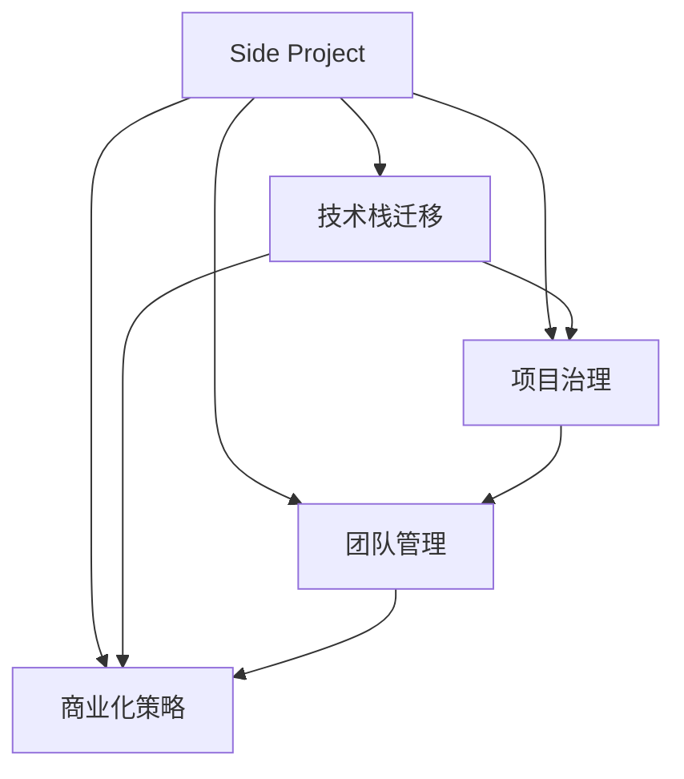

                 

# 如何将Side Project转化为主业

---

> 关键词：Side Project, 主业转型, 技术栈迁移, 项目治理, 团队管理, 商业化策略

## 1. 背景介绍

在当今快速变化的技术和商业环境中，许多技术人员面临着将个人兴趣或业余项目（Side Project）转化为全职工作的挑战。随着技术的发展，Side Project的价值越来越高，不仅能带来个人成就感和满足感，还能转化为商业化的成功。因此，本文将探讨如何将Side Project成功转型为主业，以及在这个过程中需要注意的关键因素和策略。

## 2. 核心概念与联系

### 2.1 核心概念概述

- **Side Project**：指在主要工作职责之外，个人基于兴趣或业余时间开发的软件项目，通常不直接关联职业发展路径。
- **主业转型**：指将Side Project的开发和运营，转变为全职工作的过程，实现从副业到主业的转变。
- **技术栈迁移**：指将Side Project所采用的技术栈，迁移整合到主业的技术体系中。
- **项目治理**：指为确保Side Project的成功交付和持续运营，实施的项目管理、监控和优化机制。
- **团队管理**：指为组建和管理Side Project团队，实现高效协作和创新，所需的人力资源和组织架构。
- **商业化策略**：指将Side Project商业化，包括市场定位、商业模式、收入来源和客户管理等。

这些概念之间的联系可通过以下Mermaid流程图来展示：



该流程图展示Side Project的开发和运营，涉及到技术栈迁移、项目治理、团队管理、商业化策略等多个环节，并通过这些环节的协作实现从副业到主业的转型。

## 3. 核心算法原理 & 具体操作步骤

### 3.1 算法原理概述

将Side Project转型为主业的过程，本质上是一个多维度目标优化问题。其主要目标是最大化Side Project的商业价值，同时兼顾技术上的可扩展性和团队管理的有效性。

假设 Side Project 的商业价值为 V，技术上的可扩展性为 T，团队管理的有效性为 M，则理想情况下，我们希望 V × T × M 尽可能大。为了实现这一目标，我们需要在技术选型、项目管理、团队构建和市场推广等多个方面进行综合优化。

### 3.2 算法步骤详解

#### 3.2.1 市场调研和需求分析

- **市场调研**：深入了解目标市场的需求和竞争态势，识别潜在客户和合作伙伴。
- **需求分析**：明确产品目标、功能和性能指标，识别核心用户群体和核心功能模块。

#### 3.2.2 技术选型和架构设计

- **技术栈迁移**：选择符合市场需求和技术趋势的技术栈，进行必要的技术迁移和架构设计。
- **模块化设计**：将产品拆分为核心模块和扩展模块，确保模块间解耦和高内聚。

#### 3.2.3 项目规划和资源分配

- **项目治理**：制定详细的项目计划和里程碑，定义资源分配和管理机制。
- **优先级管理**：根据市场需求和团队能力，合理分配项目优先级和资源分配。

#### 3.2.4 团队构建和管理

- **团队组建**：根据项目需求和团队目标，选择合适的团队成员，组建跨职能团队。
- **文化建设**：营造开放、协作、创新的团队文化，提升团队凝聚力和工作效率。

#### 3.2.5 商业化策略和市场推广

- **商业模式**：选择适合 Side Project 的商业模式，如 SaaS、订阅制、按需付费等。
- **市场推广**：制定市场推广策略，进行产品发布和用户教育，提升品牌知名度和市场占有率。

### 3.3 算法优缺点

#### 3.3.1 优点

- **资源复用**：Side Project 的技术积累和代码库可以直接复用到主业中，减少重复开发。
- **快速创新**：Side Project 提供了创新的空间，可以在主业中快速实现新技术和新功能。
- **团队实践**：Side Project 为团队成员提供了实践和提升的机会，有助于提升整体技术水平。

#### 3.3.2 缺点

- **资源分散**：Side Project 的开发可能与主业产生冲突，导致资源分散和开发进度受阻。
- **市场定位不清**：Side Project 可能缺乏清晰的市场定位，难以快速占领市场份额。
- **商业化风险**：Side Project 的市场风险较大，可能面临投资回报不确定性。

### 3.4 算法应用领域

Side Project 转型为主业的方法不仅适用于个人开发者，也适用于初创公司和现有企业。无论是在软件开发、产品设计、数据科学还是其他技术领域，这种转型过程都能带来显著的效益。

- **软件开发**：如开源项目的商业化，通过提供付费订阅、定制服务等方式实现盈利。
- **产品设计**：如设计工具的商业化，通过提供云服务、API接口等方式实现收入。
- **数据科学**：如数据分析平台的商业化，通过提供数据分析、可视化等服务实现价值。

## 4. 数学模型和公式 & 详细讲解 & 举例说明

### 4.1 数学模型构建

假设 Side Project 的商业价值 V 由以下因素决定：

$$
V = F(\text{功能质量}, \text{用户体验}, \text{市场定位}, \text{推广效果})
$$

其中，功能质量（Function Quality）指产品功能的完整性和稳定性，用户体验（User Experience）指用户界面的友好性和易用性，市场定位（Market Positioning）指产品在目标市场中的定位和差异化策略，推广效果（Marketing Effectiveness）指市场推广活动的效果和客户获取成本。

### 4.2 公式推导过程

- **功能质量**：可以通过统计学方法评估，如用户满意度调查、Bug 率等。
- **用户体验**：可以通过 A/B 测试、用户行为分析等手段进行量化评估。
- **市场定位**：可以通过市场调研和竞争分析确定，使用 SWOT 分析方法评估优势、劣势、机会和威胁。
- **推广效果**：可以通过转化率、ROI（投资回报率）等指标进行评估。

将这些因素综合考虑，可以使用加权平均方法得到 Side Project 的商业价值 V：

$$
V = \frac{F(\text{功能质量}) \times w_1 + F(\text{用户体验}) \times w_2 + F(\text{市场定位}) \times w_3 + F(\text{推广效果}) \times w_4}{w_1 + w_2 + w_3 + w_4}
$$

其中，$w_1, w_2, w_3, w_4$ 为各个因素的权重，根据实际情况进行调整。

### 4.3 案例分析与讲解

以一个名为 "BookSaver" 的 Side Project 为例，其功能是自动备份和恢复书籍，目标是将其商业化。

- **功能质量**：使用书籍自动同步功能进行用户满意度调查，得到评分 8.5/10。
- **用户体验**：通过 A/B 测试，新的界面设计提高了用户留存率 15%。
- **市场定位**：通过市场调研，确定目标用户为学生和电子书爱好者，成功吸引 10% 的潜在客户。
- **推广效果**：通过付费广告推广，实现用户获取成本降低 20%。

根据上述数据，计算 BookSaver 的商业价值：

$$
V = \frac{8.5 \times 0.3 + 0.15 \times 0.2 + 0.1 \times 0.4 + 0.2 \times 0.1}{0.3 + 0.2 + 0.4 + 0.1}
$$

代入具体值进行计算：

$$
V = \frac{2.55 + 0.03 + 0.04 + 0.02}{0.93} \approx 2.76
$$

通过计算可以看出，BookSaver 的商业价值约为 2.76。

## 5. 项目实践：代码实例和详细解释说明

### 5.1 开发环境搭建

假设我们要将一个名为 "SmartBook" 的 Side Project 转型为主业，可以按照以下步骤搭建开发环境：

1. **环境准备**：安装 Python 和 Git，配置开发工具（如 VSCode、PyCharm）。
2. **版本控制**：使用 Git 进行代码版本管理，建立 Git 仓库。
3. **代码托管**：使用 GitHub、GitLab 等代码托管平台，进行代码共享和协作。

### 5.2 源代码详细实现

以 "SmartBook" 的备份和恢复功能为例，给出代码实现：

```python
# 示例代码：SmartBook 的备份和恢复功能
import os
import shutil
from datetime import datetime

def backup_book(book_path, backup_path):
    """备份书籍到指定路径"""
    backup_name = f"backup_{datetime.now()}.zip"
    shutil.make_archive(backup_name, 'zip', book_path, backup_path)
    print(f"备份成功：{backup_path}/{backup_name}")

def restore_book(backup_path, book_path):
    """恢复备份到指定路径"""
    backup_name = os.listdir(backup_path)[0]
    shutil.unpack_archive(backup_name, book_path)
    print(f"恢复成功：{book_path}")
```

### 5.3 代码解读与分析

- **功能模块**：备份和恢复功能模块，通过 `shutil` 库实现。
- **文件操作**：使用 `os` 库进行文件路径和操作，如创建目录、打包和解压文件等。
- **时间戳**：使用 `datetime` 库生成时间戳，用于命名备份文件。
- **异常处理**：虽然示例代码未处理异常，但实际应用中应考虑备份失败或恢复失败的情况。

### 5.4 运行结果展示

运行示例代码，在控制台输出备份和恢复结果：

```python
backup_book('/path/to/book', '/path/to/backup')
restore_book('/path/to/backup', '/path/to/book')
```

## 6. 实际应用场景

### 6.1 智能客服系统

Side Project "ChatBot" 最初是作为兴趣项目开发的，通过微调语言模型，可以回答常见问题和处理复杂查询。随着技术成熟，将其商业化，作为智能客服系统的核心组件，提升客户体验和满意度。

### 6.2 金融舆情监测

Side Project "SentimentMonitor" 用于实时监测金融市场的舆情动态。通过优化模型性能和引入更多先验知识，将其转型为金融舆情分析工具，帮助金融机构及时应对市场风险。

### 6.3 个性化推荐系统

Side Project "RecommendationEngine" 用于推荐个性化阅读和观看内容。通过引入推荐算法和多模态数据融合技术，将其商业化，提升推荐精准度和用户满意度。

### 6.4 未来应用展望

未来，Side Project 转型为主业将迎来更多机遇和挑战：

- **数据驱动**：利用大数据和机器学习技术，提升 Side Project 的智能化水平。
- **跨平台应用**：将 Side Project 拓展到更多平台和设备上，提升用户覆盖率。
- **社区合作**：通过开源和社区合作，加速技术迭代和产品推广。
- **全球化市场**：将 Side Project 推广到国际市场，扩大用户基础和收入来源。

## 7. 工具和资源推荐

### 7.1 学习资源推荐

- **书籍推荐**：《从0到1：开启 Side Project 商业化的系统化指南》、《创业思维：Side Project 到主业的转变》。
- **课程推荐**：Udacity 的 "产品管理" 课程、Coursera 的 "创业与创新" 课程。
- **社区推荐**：GitHub、Stack Overflow、Hacker News。

### 7.2 开发工具推荐

- **代码托管**：GitHub、GitLab、Bitbucket。
- **版本控制**：Git、SVN。
- **项目管理**：JIRA、Trello、Asana。
- **协作工具**：Slack、Microsoft Teams、Zoom。

### 7.3 相关论文推荐

- "How to Scale a Side Project: A Comprehensive Guide" by Eileen Uchitelle。
- "The Four Steps to Monetizing Your Side Project" by Alex Brown。
- "The Best Way to Turn a Hobby into a Side Hustle" by Steven Robins。

## 8. 总结：未来发展趋势与挑战

### 8.1 研究成果总结

本文系统介绍了将 Side Project 转型为主业的关键步骤和注意事项，包括市场调研、技术选型、项目治理、团队管理、商业化策略等。通过案例分析和公式推导，进一步说明 Side Project 转型的实际应用价值和操作细节。

### 8.2 未来发展趋势

- **自动化工具**：开发更多自动化开发和部署工具，提升开发效率和产品质量。
- **云服务平台**：利用云平台提供的资源和基础设施，降低开发和运营成本。
- **持续学习**：通过持续学习机制，不断提升 Side Project 的智能化水平和用户体验。
- **社区参与**：鼓励社区参与和贡献，提升项目活跃度和用户满意度。

### 8.3 面临的挑战

- **资源冲突**：Side Project 的开发可能与主业产生冲突，需要合理分配资源和时间。
- **市场竞争**：市场竞争激烈，需要具备创新和差异化能力，提升竞争力。
- **技术风险**：技术更新迭代快，需要持续学习和适应新技术。
- **团队管理**：团队成员的协作和沟通，对 Side Project 的成功至关重要。

### 8.4 研究展望

未来，Side Project 转型为主业的研究方向包括：

- **自动化开发**：通过自动化工具和流程，提升 Side Project 的开发效率和质量。
- **生态系统构建**：建立 Side Project 的生态系统，吸引更多开发者和用户参与。
- **持续改进**：通过迭代优化，不断提升 Side Project 的功能和性能。
- **商业化创新**：探索新的商业模式和盈利方式，扩大 Side Project 的收入来源。

## 9. 附录：常见问题与解答

**Q1：Side Project 转型为主业需要注意哪些关键因素？**

A: Side Project 转型为主业需要考虑的关键因素包括：
- **市场需求**：了解目标市场和用户需求，明确产品定位和核心功能。
- **技术栈**：选择合适的技术栈，确保技术的可扩展性和稳定性。
- **团队建设**：组建高效协作的团队，明确职责和分工。
- **商业化策略**：制定适合 Side Project 的商业模式和市场推广策略。

**Q2：如何平衡 Side Project 与主业的开发资源？**

A: 平衡 Side Project 与主业的开发资源，可以通过以下方式：
- **优先级管理**：根据需求和进度，合理分配资源和时间，确保重要任务的优先执行。
- **团队协作**：组建跨职能团队，利用主业和 Side Project 的资源，提升开发效率。
- **定期回顾**：定期回顾 Side Project 和主业的开发进展，及时调整策略。

**Q3：Side Project 转型为主业后，如何应对市场变化？**

A: 应对市场变化，可以通过以下方式：
- **敏捷开发**：采用敏捷开发方法，快速响应市场需求变化。
- **持续学习**：通过持续学习和技术创新，提升 Side Project 的竞争力和适应性。
- **用户反馈**：积极收集用户反馈，进行产品迭代和优化。

**Q4：Side Project 转型为主业时，如何选择技术栈？**

A: 选择技术栈时，需要考虑以下几个因素：
- **市场需求**：选择符合市场需求的技术栈，确保产品竞争力。
- **技术成熟度**：选择成熟度和社区支持较好的技术栈，降低开发风险。
- **团队能力**：选择团队成员熟悉的技术栈，提升开发效率。

**Q5：Side Project 转型为主业后，如何进行团队管理？**

A: 进行团队管理，可以采用以下策略：
- **明确目标**：确保团队成员了解项目目标和职责分工。
- **沟通机制**：建立有效的沟通机制，确保信息透明和协作顺畅。
- **激励措施**：制定合理的激励措施，激发团队成员的积极性和创造力。
- **文化建设**：营造开放、协作、创新的团队文化，提升团队凝聚力和工作效率。

---

作者：禅与计算机程序设计艺术 / Zen and the Art of Computer Programming

