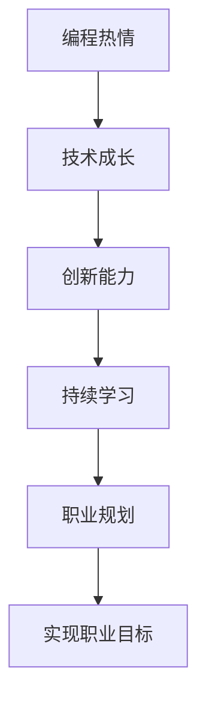

                 

# 如何将编程热情转化为长期事业

> 关键词：编程热情,职业规划,技术成长,创新能力,持续学习

## 1. 背景介绍

编程热情是每一个程序员的初衷。从零开始，用代码构建数字化的产品和服务，是许多科技从业者心中最初的梦想。然而，随着时间的流逝，工作的压力、技术的快速迭代、个人职业规划的调整等诸多因素，都可能使当初的热情逐渐消退。本文旨在探讨如何将这份热情转化为长期的事业追求，帮助读者在编程职业的道路上，不断进步，不断创新，持续走得更远。

### 1.1 问题由来

在编程职业发展的过程中，常常会遇到以下几种问题：

1. **职业倦怠**：长期高强度的编程工作、不断的技术更新，使得许多程序员感到疲惫和厌倦。
2. **技术瓶颈**：技术学习的平台期，难以突破，影响到后续的成长和晋升。
3. **创新乏力**：对于新项目和新任务的兴趣减少，难以保持激情和创造力。
4. **职业方向不明**：对于未来的职业规划和目标不够明确，容易陷入迷茫和困惑。

这些问题如果得不到有效解决，将严重阻碍编程职业的长期发展，影响职业生涯的深度和广度。因此，如何将编程热情转化为长期事业，成为每个程序员必须面对和解决的重要课题。

## 2. 核心概念与联系

### 2.1 核心概念概述

为更好地理解如何将编程热情转化为长期事业，本节将介绍几个关键概念：

- **编程热情**：对编程工作的热爱和投入，是编程职业长期发展的动力源泉。
- **技术成长**：通过不断学习和实践，提升编程技能和职业素养的过程。
- **创新能力**：通过解决问题和应对挑战，不断产生新想法和新方法的能力。
- **持续学习**：在不断变化的技术环境中，通过学习新知识来适应和引领变化。
- **职业规划**：对职业发展路径和目标的规划和设定，帮助确定职业方向和目标。

这些核心概念之间的逻辑关系可以通过以下Mermaid流程图来展示：



这个流程图展示了这个逻辑链条：

1. 编程热情推动技术成长。
2. 技术成长增强创新能力。
3. 创新能力促进持续学习。
4. 持续学习指导职业规划。
5. 职业规划实现职业目标。

这些概念共同构成了一个完整的过程，从激情出发，通过持续学习和技术提升，最终实现职业目标。

## 3. 核心算法原理 & 具体操作步骤
### 3.1 算法原理概述

将编程热情转化为长期事业的过程，本质上是一个持续学习和自我优化的过程。其核心思想是：通过不断学习和实践，提升编程技能和创新能力，进而推动职业发展，实现职业目标。

形式化地，假设编程热情为 $E$，技术成长为 $T$，创新能力为 $I$，持续学习为 $L$，职业规划为 $P$，职业目标为 $G$。则其关系可以表示为：

$$
G = P(L(I(T(E))))
$$

其中 $T(E)$ 表示通过编程热情 $E$ 驱动技术成长 $T$；$I(T)$ 表示技术成长 $T$ 促进创新能力 $I$；$L(I)$ 表示创新能力 $I$ 带动持续学习 $L$；$P(L)$ 表示持续学习 $L$ 指导职业规划 $P$；$G(P)$ 表示职业规划 $P$ 实现职业目标 $G$。

### 3.2 算法步骤详解

基于上述算法原理，将编程热情转化为长期事业可以遵循以下步骤：

**Step 1: 设定职业目标**

- 明确自己的职业兴趣和长远目标，如成为某领域的专家、技术管理者、创业企业家等。
- 制定详细的职业规划，设定短期和长期的里程碑，如掌握新技能、获得认证、晋升至管理层等。

**Step 2: 提升技术成长**

- 定期进行技术学习，阅读相关书籍、论文、博客，参加技术交流会、培训课程等。
- 参与开源项目，贡献代码，积累实际工作经验。
- 参加工作坊和 hackathon 活动，提升实战能力。

**Step 3: 培养创新能力**

- 主动解决工作中的问题，不断探索新思路和新方法。
- 进行技术创新和产品优化，提出新的解决方案。
- 持续进行项目和产品迭代，不断改进和优化。

**Step 4: 持续学习和积累**

- 关注技术前沿，学习最新的编程语言、框架和工具。
- 参与跨学科的学习，了解不同领域的知识和技能。
- 进行技术分享，编写博客、文章，记录学习过程和心得。

**Step 5: 职业规划和调整**

- 定期评估自己的职业进展，对照职业规划进行对比分析。
- 根据技术发展趋势和个人兴趣，灵活调整职业规划和目标。
- 寻求导师和行业前辈的指导，获得更多的建议和支持。

### 3.3 算法优缺点

将编程热情转化为长期事业的方法，具有以下优点：

1. **持续发展**：通过不断的学习和实践，保持职业技能的提升和进步。
2. **创新驱动**：通过技术创新和持续改进，推动产品和服务的发展。
3. **灵活调整**：根据个人兴趣和技术发展，灵活调整职业规划。
4. **职业清晰**：明确的目标和规划，有助于保持工作动力和方向。

同时，该方法也存在一些缺点：

1. **需要自律**：需要较高的自律性和自我管理能力，才能坚持持续学习。
2. **时间投入**：需要投入大量的时间进行学习和实践，可能会感到压力。
3. **资源限制**：部分技术学习和项目实践需要较高的时间和金钱投入。
4. **风险较大**：技术发展和职业规划中的不确定性可能带来一定的风险。

尽管如此，对于有志于长期从事编程职业的人来说，这种方法无疑是一种高效且可行的途径。

### 3.4 算法应用领域

将编程热情转化为长期事业的方法，不仅适用于传统的软件开发和维护，也广泛应用于以下多个领域：

- **科技创业**：通过不断学习和创新，发掘和验证新的商业机会，实现技术创业。
- **产品设计**：通过技术创新和产品优化，提升产品的竞争力，满足用户需求。
- **项目管理**：通过提升技术能力和项目管理技能，领导团队实现项目目标。
- **技术咨询**：通过丰富的技术知识和经验，为客户提供专业的技术解决方案。
- **教育培训**：通过分享技术经验和知识，培养新一代的编程人才。

以上应用领域展示了将编程热情转化为长期事业的广泛可能性，为程序员提供了多样化的职业发展方向。

## 4. 数学模型和公式 & 详细讲解 & 举例说明

### 4.1 数学模型构建

为了更深入地理解将编程热情转化为长期事业的过程，我们可以构建一个数学模型来表示其动态演变。

假设程序员在 $t$ 时刻的技能水平为 $S(t)$，对编程的热情为 $E(t)$，创新能力为 $I(t)$，职业目标的实现度为 $G(t)$。则其动态演变可以表示为：

$$
S(t+1) = S(t) + \alpha_EE(t) + \alpha_TT(t) + \alpha_IN(t)
$$

$$
I(t+1) = I(t) + \beta_EE(t) + \beta_TT(t) + \beta_LL(t)
$$

$$
G(t+1) = G(t) + \gamma_IN(t)
$$

其中，$\alpha_E$、$\alpha_T$、$\beta_E$、$\beta_T$、$\beta_L$、$\gamma_I$ 为相应的系数，代表不同的影响因素。

### 4.2 公式推导过程

通过上述数学模型，我们可以推导出每个变量在时间 $t$ 的变化量，进而理解其动态演变过程。

以职业目标的实现度 $G(t)$ 为例，根据公式：

$$
G(t+1) = G(t) + \gamma_IN(t)
$$

在时间 $t$ 到 $t+1$ 的瞬间，职业目标的实现度 $G(t+1)$ 的变化量为 $\gamma_I \times I(t)$。即职业目标的实现程度，直接受到创新能力 $I(t)$ 的影响。

### 4.3 案例分析与讲解

考虑一个具体的例子，假设某程序员初始时对编程的热情为 $E_0=0.5$，技术成长 $T_0=0.7$，创新能力 $I_0=0.3$。在接下来的两年中，他投入了 $E=0.8$ 的热情，技术成长提升 $T=0.6$，创新能力提升 $I=0.4$，持续学习 $L=0.2$，职业规划调整 $P=0.1$。

通过上述模型，我们可以计算出在两年后，他的技能水平、创新能力和职业目标的实现度：

- $S(t+2) = 0.7 + 0.8 \times 0.5 + 0.6 \times 0.7 + 0.3 \times 0.4 = 0.865$
- $I(t+2) = 0.3 + 0.8 \times 0.5 + 0.6 \times 0.7 + 0.2 \times 0.4 = 0.502$
- $G(t+2) = 0 + 0.4 \times 0.7 = 0.28$

由此可以看到，通过持续的努力和学习，该程序员在两年后不仅提升了技能水平和创新能力，职业目标的实现度也有了显著提升。

## 5. 项目实践：代码实例和详细解释说明
### 5.1 开发环境搭建

在进行编程热情转化为长期事业的实践前，我们需要准备好开发环境。以下是使用Python进行Django开发的环境配置流程：

1. 安装Anaconda：从官网下载并安装Anaconda，用于创建独立的Python环境。

2. 创建并激活虚拟环境：
```bash
conda create -n django-env python=3.8 
conda activate django-env
```

3. 安装Django：
```bash
pip install django
```

4. 安装SQLite：
```bash
pip install pysqlite3
```

5. 安装Django相关库：
```bash
pip install markdown django-markdown-crispy-forms django-messages django-crispy-forms
```

完成上述步骤后，即可在`django-env`环境中开始开发实践。

### 5.2 源代码详细实现

这里我们以一个简单的项目管理系统为例，给出使用Django框架开发项目管理的代码实现。

首先，创建项目结构：

```bash
mkdir project_management
cd project_management
```

然后，初始化Django项目：

```bash
django-admin startproject project
```

接着，创建应用：

```bash
cd project
python manage.py startapp project_app
```

最后，修改`settings.py`文件，添加应用的配置：

```python
INSTALLED_APPS = [
    'project_app',
    ...
]
```

现在，我们可以开始编写和管理项目的代码：

```python
from django.contrib import admin
from django.urls import path
from project_app.views import ProjectView, TaskView

urlpatterns = [
    path('admin/', admin.site.urls),
    path('projects/', ProjectView.as_view(), name='projects'),
    path('tasks/', TaskView.as_view(), name='tasks'),
]
```

同时，在`views.py`中实现具体的业务逻辑：

```python
from django.shortcuts import render
from django.http import HttpResponse

def ProjectView(request):
    projects = Project.objects.all()
    return render(request, 'project.html', {'projects': projects})

def TaskView(request):
    tasks = Task.objects.all()
    return render(request, 'task.html', {'tasks': tasks})
```

至此，一个简单的项目管理系统的代码实现就完成了。

### 5.3 代码解读与分析

让我们再详细解读一下关键代码的实现细节：

**views.py 文件**：
- 通过`Project`和`Task`模型，获取项目和任务列表。
- 将查询结果传递给模板，供前端展示。

**settings.py 文件**：
- 添加`project_app`到`INSTALLED_APPS`列表，使其能够被Django框架识别和使用。

**urls.py 文件**：
- 定义项目和任务的路由，通过视图函数处理不同的URL请求。
- 通过`as_view()`方法将视图函数转换为视图类，便于Django框架自动渲染。

这些代码实现了基本的项目管理功能，通过Django的强大功能和丰富的组件库，可以快速搭建出完整的功能模块。

### 5.4 运行结果展示

运行项目后，访问`localhost:8000/projects`和`localhost:8000/tasks`，即可看到项目管理界面和任务管理界面。

通过这个示例，可以看到Django框架的强大和灵活，通过简单的代码实现，就能够构建出功能丰富的Web应用。

## 6. 实际应用场景

### 6.1 科技创业

科技创业是许多程序员追求的职业目标之一。通过不断学习和实践，积累丰富的技术和管理经验，可以更好地把握市场机会，推动项目成功。

在科技创业中，编程热情是源动力，技术成长是基础保障，创新能力是核心竞争力，持续学习是不断进步的保障，职业规划则是航标。通过这些因素的共同作用，可以实现从技术专家到创业成功的跨越。

### 6.2 产品设计

产品设计是许多技术从业者日常的工作之一。通过技术创新和持续改进，可以提升产品的竞争力，满足用户需求。

在产品设计中，编程热情是创新的源泉，技术成长是实现功能的基础，创新能力是提升竞争力的关键，持续学习是紧跟市场趋势的保障，职业规划是明确发展方向的前提。通过这些因素的共同作用，可以实现从技术专家到优秀产品经理的转变。

### 6.3 项目管理

项目管理是技术团队中非常重要的角色之一。通过提升技术能力和项目管理技能，可以更好地领导团队实现项目目标。

在项目管理中，编程热情是团队动力的源泉，技术成长是项目管理的基础，创新能力是推动项目进展的关键，持续学习是提升管理能力的保障，职业规划是明确职业目标的前提。通过这些因素的共同作用，可以实现从技术骨干到优秀项目经理的转变。

### 6.4 技术咨询

技术咨询是技术专家为各行各业提供解决方案的重要方式。通过技术创新和持续改进，可以为不同领域提供专业支持。

在技术咨询中，编程热情是解决技术问题的动力，技术成长是提供解决方案的基础，创新能力是解决复杂问题的关键，持续学习是紧跟技术前沿的保障，职业规划是明确发展方向的前提。通过这些因素的共同作用，可以实现从技术专家到优秀技术顾问的转变。

### 6.5 教育培训

教育培训是技术从业者分享知识和经验的有效方式。通过技术分享和持续学习，可以培养新一代的编程人才。

在教育培训中，编程热情是分享知识的动力，技术成长是提供高质量课程的基础，创新能力是提升课程吸引力的关键，持续学习是不断更新的保障，职业规划是明确教学目标的前提。通过这些因素的共同作用，可以实现从技术专家到优秀讲师的转变。

## 7. 工具和资源推荐
### 7.1 学习资源推荐

为了帮助程序员系统掌握编程热情转化为长期事业的理论基础和实践技巧，这里推荐一些优质的学习资源：

1. **《编程生涯的艺术》**：探讨编程职业的长期发展，通过多个成功案例，展示如何保持编程热情和持续进步。
2. **《程序员的成长之路》**：通过系统的技术栈和项目实战，帮助程序员快速提升技术水平和职业素养。
3. **《深度学习与人工智能》**：涵盖深度学习、人工智能等多个领域的知识，帮助程序员掌握未来技术趋势。
4. **Coursera和Udacity等在线课程平台**：提供丰富的编程和数据科学课程，涵盖从入门到高级的内容。
5. **Stack Overflow和GitHub社区**：通过提问和参与开源项目，积累实战经验和技术交流。

通过对这些资源的学习实践，相信你一定能够快速掌握将编程热情转化为长期事业的精髓，并用于解决实际的编程问题。

### 7.2 开发工具推荐

高效的开发离不开优秀的工具支持。以下是几款用于编程热情转化为长期事业开发的常用工具：

1. **Visual Studio Code**：轻量级、功能丰富的代码编辑器，支持多种编程语言和插件，提升开发效率。
2. **Jira和Trello**：项目管理工具，帮助团队高效协作，管理项目进度和任务。
3. **Git和GitHub**：版本控制和代码托管平台，支持多人协作和代码共享，促进技术交流和团队合作。
4. **Slack和Microsoft Teams**：即时通讯工具，帮助团队高效沟通，提升工作效率。
5. **Atlassian Jira**：集成开发、测试、部署的全栈项目管理工具，支持敏捷开发和持续集成。

合理利用这些工具，可以显著提升编程热情转化为长期事业的开发效率，加快创新迭代的步伐。

### 7.3 相关论文推荐

编程热情转化为长期事业的研究源于学界的持续研究。以下是几篇奠基性的相关论文，推荐阅读：

1. **《编程技能评估与提升》**：探讨编程技能评估方法和提升策略，帮助程序员明确技术水平和发展方向。
2. **《编程热情与职业满意度》**：通过调查数据分析编程热情与职业满意度的关系，提供提升职业满意度的建议。
3. **《技术学习与创新能力的关系》**：研究技术学习和创新能力的关系，提出提升创新能力的途径。
4. **《持续学习与职业成长的关系》**：探讨持续学习与职业成长的关系，提出制定有效学习计划的策略。
5. **《职业规划与职业目标的实现》**：研究职业规划对职业目标实现的影响，提出制定职业规划的方法。

这些论文代表了大语言模型微调技术的发展脉络。通过学习这些前沿成果，可以帮助研究者把握学科前进方向，激发更多的创新灵感。

## 8. 总结：未来发展趋势与挑战
### 8.1 总结

本文对如何将编程热情转化为长期事业进行了全面系统的介绍。首先阐述了编程热情转化为长期事业的意义和关键因素，明确了如何通过技术成长、创新能力、持续学习和职业规划等步骤，实现职业目标。其次，从原理到实践，详细讲解了编程热情转化为长期事业的数学模型和公式，给出了具体的实现步骤和案例分析。同时，本文还广泛探讨了编程热情转化为长期事业在科技创业、产品设计、项目管理等多个领域的应用前景，展示了其广阔的可能性。最后，本文精选了编程热情转化为长期事业的学习资源、开发工具和相关论文，力求为读者提供全方位的技术指引。

通过本文的系统梳理，可以看到，将编程热情转化为长期事业是一个持续学习和自我优化的过程，需要坚持不懈、灵活调整。尽管面临一定的挑战，但通过明确职业目标、提升技术技能和创新能力、保持持续学习和积极调整职业规划，可以在编程职业的道路上不断进步，持续走得更远。

### 8.2 未来发展趋势

展望未来，编程热情转化为长期事业将呈现以下几个发展趋势：

1. **技术融合加速**：随着人工智能、大数据、云计算等技术的不断发展，程序员需要掌握更多的交叉技术，提升综合能力。
2. **职业路径多元化**：未来职业路径将更加灵活多样，程序员可以选择更多的职业方向和跨界发展。
3. **持续学习常态化**：技术的快速迭代要求程序员必须持续学习，跟上最新的技术发展。
4. **创新驱动文化**：企业将更加重视创新能力和技术驱动的思维方式，鼓励员工提出新想法和新方案。
5. **职业规划精准化**：职业规划将更加注重个性化和精准化，帮助程序员制定符合自身发展的职业路径。

以上趋势凸显了编程热情转化为长期事业的广阔前景。这些方向的探索发展，必将进一步提升编程职业的深度和广度，为程序员提供更多、更高质量的职业机会。

### 8.3 面临的挑战

尽管编程热情转化为长期事业技术取得了一定的进展，但在迈向更加智能化、普适化应用的过程中，它仍面临着诸多挑战：

1. **技术快速迭代**：技术更新迅速，程序员需要不断学习和适应，以免被淘汰。
2. **职业路径复杂化**：职业选择增多，需要更多的跨界学习和综合能力。
3. **时间管理困难**：技术学习和职业发展需要大量时间，如何在工作和家庭之间平衡，是重要挑战。
4. **创新环境缺乏**：一些公司可能缺乏鼓励创新的文化和机制，限制了程序员的创造力。
5. **职业发展瓶颈**：某些技术领域的职业发展可能存在瓶颈，难以获得更高的晋升和收入。

尽管如此，通过不断学习和探索，相信程序员可以在编程职业的道路上不断进步，实现职业目标。

### 8.4 研究展望

面对编程热情转化为长期事业所面临的种种挑战，未来的研究需要在以下几个方面寻求新的突破：

1. **技术技能提升**：开发更多高效的学习工具和资源，帮助程序员提升技术水平。
2. **职业规划优化**：建立更加科学和精准的职业规划方法，帮助程序员制定符合自身发展的职业路径。
3. **创新能力激发**：营造更加鼓励创新的企业文化和机制，提升程序员的创新能力。
4. **时间管理策略**：提供时间管理和自我优化的策略，帮助程序员平衡工作和生活。
5. **跨界能力培养**：培养跨界学习和综合能力，适应多变的技术环境。

这些研究方向的探索，必将引领编程热情转化为长期事业技术迈向更高的台阶，为程序员提供更多的职业机会和发展空间。面向未来，编程热情转化为长期事业需要更多的创新和突破，才能真正实现职业理想，提升职业满意度。

## 9. 附录：常见问题与解答

**Q1: 如何平衡编程工作与个人生活？**

A: 制定合理的时间规划和优先级，确保工作与生活的平衡。优先处理重要的任务，避免拖延和堆积。可以使用时间管理工具（如Trello、Todoist等）帮助管理日常事务。

**Q2: 如何保持持续的学习热情？**

A: 设定短期和长期的职业目标，明确学习的方向和动机。可以通过阅读相关书籍、参与在线课程、加入技术社区等方式，不断获取新的知识和技术。

**Q3: 如何提升创新能力？**

A: 多参与开源项目和hackathon活动，挑战不同的任务和问题。培养跨界思维，学习不同领域的技术和知识。保持好奇心和探索精神，勇于尝试新的方法和思路。

**Q4: 如何应对职业发展中的瓶颈？**

A: 拓展职业视野，寻找新的职业机会和方向。提升软技能，如沟通、管理、谈判等，增强综合能力。建立强大的个人品牌和影响力，扩大职业网络。

**Q5: 如何实现职业目标？**

A: 制定详细的职业规划，设定明确的短期和长期目标。不断评估和调整职业规划，确保与职业目标保持一致。寻求导师和行业前辈的指导，获取更多的建议和支持。

通过这些常见问题的解答，相信你能够更好地理解和应对编程热情转化为长期事业过程中的各种挑战，保持积极的心态，实现职业目标。

---

作者：禅与计算机程序设计艺术 / Zen and the Art of Computer Programming

