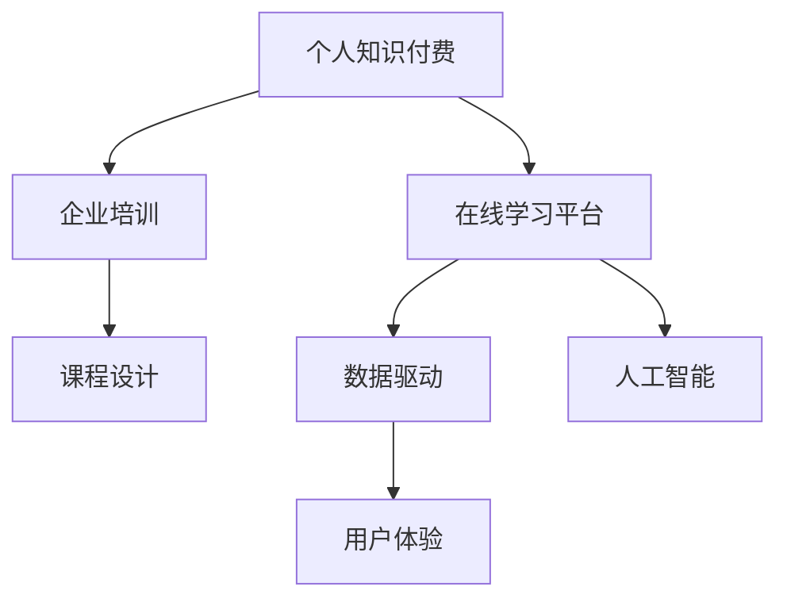

                 

# 如何打造个人知识付费企业培训

> 关键词：个人知识付费, 企业培训, 数据驱动, 人工智能, 在线学习平台, 课程设计, 用户体验

## 1. 背景介绍

### 1.1 问题由来
在当今信息爆炸的时代，知识付费成为了一个日益蓬勃的领域。越来越多的人意识到，通过付费获取有价值的专业知识，可以大大提升个人的职业竞争力和企业竞争力。特别是在企业培训领域，传统的面授培训模式不仅耗时耗力，还难以覆盖到所有员工，而在线学习平台则提供了更加灵活、高效、低成本的学习途径。

### 1.2 问题核心关键点
打造个人知识付费企业培训的核心在于如何构建一个高质量、覆盖面广、可定制化的在线学习平台。具体来说，需要关注以下几个关键点：

- 课程内容的构建：课程应该围绕企业实际需求和员工职业发展路径进行设计和开发。
- 学习体验的设计：平台应该提供良好的用户体验，以吸引并保持学员的学习兴趣。
- 数据驱动的教学：通过数据收集和分析，了解学员的学习行为，持续优化教学内容和方法。
- 人工智能的应用：引入AI技术，提升课程的个性化推荐和学员的学习效率。
- 效果的评估和反馈：定期评估课程效果，通过反馈机制不断改进课程内容。

### 1.3 问题研究意义
在当前企业培训领域，个人知识付费正迅速发展。构建高质量的企业培训在线平台，不仅能够提升员工的专业技能和企业的核心竞争力，还能降低培训成本，提高培训效率。同时，通过数据和人工智能的辅助，可以不断优化课程内容和教学方法，形成良性循环，进一步提升培训效果。

## 2. 核心概念与联系

### 2.1 核心概念概述

为更好地理解如何打造个人知识付费企业培训，本节将介绍几个密切相关的核心概念：

- **个人知识付费**：指通过在线平台提供高质量的专业课程，以付费的方式向学员传授知识和技能。
- **企业培训**：指企业为员工提供的职业发展和技能提升培训。
- **数据驱动**：指通过收集和分析学员的学习数据，优化课程内容和教学方法。
- **人工智能**：指通过AI技术，如机器学习、深度学习、自然语言处理等，提升课程的个性化推荐和教学效率。
- **在线学习平台**：指提供课程学习和互动的互联网平台。
- **课程设计**：指设计课程内容和结构，确保课程的完整性和实用性。
- **用户体验**：指平台提供的学习体验，如界面设计、互动功能、学习路径等，影响学员的参与度和满意度。

这些核心概念之间的逻辑关系可以通过以下Mermaid流程图来展示：



这个流程图展示了个体知识付费、企业培训、在线学习平台、课程设计、数据驱动、人工智能和用户体验之间的联系，以及它们共同构建的高质量企业培训体系。

## 3. 核心算法原理 & 具体操作步骤
### 3.1 算法原理概述

打造个人知识付费企业培训的算法原理主要基于数据驱动和人工智能技术。核心思想是：通过收集和分析学员的学习数据，识别学员的学习行为模式，利用AI技术，如机器学习和自然语言处理，优化课程内容和教学方法，提高学员的学习效果。

具体来说，主要包括以下几个关键步骤：

1. **数据收集**：收集学员在学习平台上的互动数据，如浏览时长、视频观看次数、课程完成率等。
2. **数据分析**：通过数据挖掘和统计分析，识别学员的学习行为模式和偏好。
3. **个性化推荐**：利用推荐算法，根据学员的学习行为和偏好，推荐个性化的课程和学习路径。
4. **课程优化**：根据学员的学习反馈，持续优化课程内容和方法，提升教学效果。

### 3.2 算法步骤详解

以下是详细的算法步骤，每个步骤都将阐述其具体操作方法：

**Step 1: 数据收集**

- **在线互动数据**：收集学员在平台上进行的互动数据，如观看视频、参与讨论、完成作业等。
- **学员反馈数据**：收集学员对课程内容、教学方法、平台体验的反馈数据，通过问卷调查、评论等方式获取。
- **行为数据**：收集学员的学习行为数据，如学习时间、课程进度、任务完成情况等。

**Step 2: 数据分析**

- **学员行为模式分析**：使用数据挖掘技术，分析学员的学习行为模式，如偏好某些课程类型、喜欢在某一时间段学习等。
- **知识图谱构建**：构建知识图谱，描述课程内容和知识点之间的关系，帮助学员理解课程结构。
- **情感分析**：利用自然语言处理技术，对学员的评论和反馈进行情感分析，了解学员对课程的情感倾向。

**Step 3: 个性化推荐**

- **协同过滤**：根据学员的行为数据和偏好，推荐其他学员的课程和学习路径。
- **内容推荐**：使用协同过滤和内容相关性分析，推荐与学员当前学习内容相关的课程。
- **动态调整**：根据学员的学习进度和反馈，动态调整推荐内容，确保学员始终处于最佳学习状态。

**Step 4: 课程优化**

- **学员反馈分析**：通过分析学员的反馈数据，识别课程中的薄弱环节和需要改进的地方。
- **内容更新**：根据学员反馈，更新课程内容，添加新的知识点和案例分析。
- **教学方法改进**：优化教学方法，如增加互动环节、引入实际案例等，提升学员的学习效果。

### 3.3 算法优缺点

个人知识付费企业培训的算法具有以下优点：

1. **个性化推荐**：通过数据分析和个性化推荐，能够提升学员的学习效果和满意度。
2. **数据驱动优化**：通过数据驱动的教学优化，能够持续提升课程质量和教学效果。
3. **灵活性高**：在线学习平台能够灵活调整课程内容和教学方法，满足不同学员的需求。

同时，该算法也存在以下缺点：

1. **数据隐私问题**：收集学员数据可能引发隐私保护问题，需要严格遵守数据保护法规。
2. **技术门槛高**：需要一定的数据科学和AI技术背景，实施成本较高。
3. **过度依赖数据**：过于依赖数据分析可能忽视学员的主观需求和个性化体验。

### 3.4 算法应用领域

个人知识付费企业培训的算法在多个领域都有广泛应用：

- **职业培训**：如销售技巧、管理能力、技术开发等课程。
- **职业转型**：帮助员工从现有岗位转型到新的领域，如从工程管理转到项目管理。
- **技能提升**：如编程、数据分析、项目管理等技能提升课程。
- **企业定制培训**：针对企业特定需求和员工职业发展路径，定制个性化课程。

此外，该算法还可以应用于高等教育、在线教育、企业内部培训等多个场景，提供高质量的课程和个性化的学习体验。

## 4. 数学模型和公式 & 详细讲解 & 举例说明

### 4.1 数学模型构建

个人知识付费企业培训的数学模型主要基于数据驱动和机器学习技术。具体来说，可以构建以下数学模型：

- **学员行为数据模型**：
$$
\text{行为数据} = f(\text{学员特征}, \text{课程内容}, \text{平台特性})
$$
- **推荐模型**：
$$
\text{推荐结果} = \text{推荐算法}(\text{学员行为数据}, \text{课程数据})
$$
- **课程优化模型**：
$$
\text{课程更新} = \text{优化算法}(\text{学员反馈数据}, \text{课程内容}, \text{教学方法})
$$

### 4.2 公式推导过程

以下是对关键公式的推导过程：

**学员行为数据模型**：

假设学员的特征向量为 $x$，课程内容为 $y$，平台特性为 $z$，则学员行为数据 $D$ 可以表示为：
$$
D = f(x,y,z)
$$
其中 $f$ 是一个非线性映射函数，可以表示为：
$$
f(x,y,z) = w_1 x_1 + w_2 x_2 + \cdots + w_n x_n + b
$$
其中 $w_i$ 是权重向量，$b$ 是偏置项。

**推荐模型**：

假设推荐结果为 $r$，推荐算法为 $A$，学员行为数据为 $d$，课程数据为 $c$，则推荐结果可以表示为：
$$
r = A(d, c)
$$
常用的推荐算法包括协同过滤、内容推荐和混合推荐等。例如，协同过滤算法的公式可以表示为：
$$
r_{ij} = \frac{\sum_{k=1}^n \alpha_k x_{ik} y_{kj}}{\sqrt{\sum_{k=1}^n \alpha_k x_{ik}^2 + \sum_{k=1}^n \alpha_k y_{kj}^2}}
$$
其中 $\alpha_k$ 是权重系数，$x_{ik}$ 和 $y_{kj}$ 分别是学员和课程的特征向量。

**课程优化模型**：

假设课程内容为 $C$，学员反馈为 $F$，教学方法为 $M$，则课程更新 $U$ 可以表示为：
$$
U = \text{Optimize}(F, C, M)
$$
常用的优化算法包括梯度下降、遗传算法等。例如，梯度下降算法的公式可以表示为：
$$
\theta = \theta - \eta \nabla_{\theta} L(\theta)
$$
其中 $\theta$ 是模型参数，$\eta$ 是学习率，$L$ 是损失函数。

### 4.3 案例分析与讲解

以某在线学习平台的数据驱动课程优化为例：

**数据收集**：收集学员在平台上进行的学习互动数据，如视频观看次数、讨论参与度、作业完成率等。

**数据分析**：使用聚类算法，将学员分为不同的学习群体，识别出不同群体的学习行为模式。

**个性化推荐**：根据学员的学习群体和行为模式，推荐个性化的课程和学习路径。

**课程优化**：通过分析学员的反馈数据，识别课程中的薄弱环节，如某门课程的学员完成率低，需要更新课程内容，添加更多的案例分析。

## 5. 项目实践：代码实例和详细解释说明
### 5.1 开发环境搭建

在进行个人知识付费企业培训的项目实践前，我们需要准备好开发环境。以下是使用Python进行在线学习平台开发的环境配置流程：

1. 安装Anaconda：从官网下载并安装Anaconda，用于创建独立的Python环境。

2. 创建并激活虚拟环境：
```bash
conda create -n pytorch-env python=3.8 
conda activate pytorch-env
```

3. 安装PyTorch：根据CUDA版本，从官网获取对应的安装命令。例如：
```bash
conda install pytorch torchvision torchaudio cudatoolkit=11.1 -c pytorch -c conda-forge
```

4. 安装TensorFlow：
```bash
conda install tensorflow
```

5. 安装TensorBoard：
```bash
pip install tensorboard
```

6. 安装Flask：
```bash
pip install flask
```

7. 安装Flask-RESTful：
```bash
pip install flask-restful
```

完成上述步骤后，即可在`pytorch-env`环境中开始项目实践。

### 5.2 源代码详细实现

下面我们以一个在线学习平台的课程推荐系统为例，给出使用Flask和TensorFlow进行课程推荐系统的PyTorch代码实现。

首先，定义推荐系统数据处理函数：

```python
from sklearn.feature_extraction.text import TfidfVectorizer
from sklearn.metrics.pairwise import cosine_similarity
import pandas as pd
import numpy as np

def load_course_data():
    # 加载课程数据
    course_df = pd.read_csv('courses.csv')
    # 特征工程
    vectorizer = TfidfVectorizer(stop_words='english')
    X = vectorizer.fit_transform(course_df['course_description'])
    Y = course_df['category']
    return X, Y

def get_similarity(X, query):
    # 计算相似度
    query_vec = vectorizer.transform([query])
    similarity_matrix = cosine_similarity(query_vec, X)
    return similarity_matrix[0]
```

然后，定义推荐系统模型：

```python
from tensorflow.keras.layers import Input, Dense, Embedding, Dot
from tensorflow.keras.models import Model

def build_recommender_model(X, Y):
    # 构建模型
    user_input = Input(shape=(X.shape[1],))
    embedding_layer = Embedding(input_dim=X.shape[1], output_dim=16, input_length=X.shape[1])(user_input)
    embedding_output = Dot(axes=[2, 2], normalize=True)([embedding_layer, X])
    embedding_output = Dense(1, activation='sigmoid')(embedding_output)
    recommender_model = Model(inputs=user_input, outputs=embedding_output)
    recommender_model.compile(loss='binary_crossentropy', optimizer='adam', metrics=['accuracy'])
    return recommender_model

def train_model(model, X, Y, batch_size, epochs):
    # 训练模型
    model.fit(X, Y, batch_size=batch_size, epochs=epochs, verbose=0)

# 加载数据
X, Y = load_course_data()

# 定义模型
recommender_model = build_recommender_model(X, Y)

# 训练模型
train_model(recommender_model, X, Y, batch_size=32, epochs=10)
```

最后，测试推荐系统：

```python
def recommend_course(user, model):
    # 获取相似度最高的课程
    similarity_matrix = get_similarity(X, user)
    similar_courses = np.argsort(similarity_matrix)[-5:]
    # 获取推荐课程
    recommended_courses = course_df.iloc[similar_courses]['course_name'].values.tolist()
    return recommended_courses
```

可以看到，通过上述代码，我们实现了一个基于协同过滤的课程推荐系统，可以向学员推荐与他们的学习行为最相似的课程。

### 5.3 代码解读与分析

让我们再详细解读一下关键代码的实现细节：

**load_course_data函数**：
- 加载课程数据，并进行特征工程，构建学员特征向量 $X$ 和课程类别 $Y$。

**build_recommender_model函数**：
- 定义推荐模型，包含用户输入层、嵌入层、点积层和输出层。
- 使用二元交叉熵损失函数，Adam优化器进行训练。

**train_model函数**：
- 使用训练数据集训练推荐模型，指定批量大小和训练轮数。

**recommend_course函数**：
- 计算用户与课程之间的相似度。
- 根据相似度排序，选择与用户最相似的5门课程进行推荐。

可以看到，通过这些代码，我们实现了一个基于数据驱动的课程推荐系统，可以根据学员的学习行为，推荐个性化的课程内容。

## 6. 实际应用场景
### 6.1 智慧企业培训

在智慧企业培训中，个人知识付费技术可以帮助企业构建灵活、高效、个性化的培训体系，提升员工的学习效果和职业发展。

具体来说，可以构建一个在线学习平台，提供各类职业发展课程，如领导力培训、项目管理、数据分析等。通过数据分析和个性化推荐，确保学员始终处于最佳学习状态，提升学习效果和满意度。

### 6.2 在线教育平台

在线教育平台可以利用个人知识付费技术，提供高质量、多样化的课程内容，满足不同学员的学习需求。

例如，可以针对K-12教育、高等教育、职业技能培训等领域，提供丰富的课程资源。通过数据分析和个性化推荐，提升学员的学习效果和平台的用户体验。

### 6.3 个性化职业发展

个人知识付费技术还可以帮助员工进行个性化的职业发展规划，提升职场竞争力。

例如，可以提供职业转型、技能提升、职场软技能培训等课程，通过数据分析和个性化推荐，帮助员工识别职业发展路径，提升职业竞争力。

## 7. 工具和资源推荐
### 7.1 学习资源推荐

为了帮助开发者系统掌握个人知识付费企业培训的理论基础和实践技巧，这里推荐一些优质的学习资源：

1. 《在线学习平台开发实战》系列博文：由在线教育领域专家撰写，全面介绍在线学习平台的设计和开发，包括课程内容、推荐系统、用户体验等。

2. 《深度学习在推荐系统中的应用》课程：斯坦福大学开设的推荐系统课程，涵盖推荐算法的原理和实现，适合深度学习开发者学习。

3. 《在线教育平台设计》书籍：介绍在线教育平台的整体设计和开发流程，涵盖课程设计、推荐系统、用户体验等多个方面。

4. Coursera、edX等在线学习平台：提供丰富的课程资源和实践项目，供开发者学习。

5. TensorFlow官方文档：提供详细的TensorFlow推荐系统实现案例，适合开发者实践。

通过对这些资源的学习实践，相信你一定能够快速掌握个人知识付费企业培训的精髓，并用于解决实际的NLP问题。

### 7.2 开发工具推荐

高效的开发离不开优秀的工具支持。以下是几款用于个人知识付费企业培训开发的常用工具：

1. Python：基于Python的在线学习平台开发，生态丰富，开发效率高。

2. Flask和Flask-RESTful：轻量级Web框架，适合快速搭建API接口和推荐系统。

3. TensorFlow和Keras：深度学习框架，提供强大的推荐算法实现。

4. TensorBoard：模型训练的实验跟踪工具，可以记录和可视化模型训练过程中的各项指标。

5. Anaconda和Jupyter Notebook：提供Python环境管理和交互式开发工具。

合理利用这些工具，可以显著提升个人知识付费企业培训的开发效率，加快创新迭代的步伐。

### 7.3 相关论文推荐

个人知识付费企业培训的发展源于学界的持续研究。以下是几篇奠基性的相关论文，推荐阅读：

1. "Collaborative Filtering for E-commerce Recommendations"：提出协同过滤算法，开创了基于用户行为数据推荐系统的先河。

2. "Deep Learning for Recommender Systems"：介绍深度学习在推荐系统中的应用，包括协同过滤、内容推荐和混合推荐等。

3. "Reinforcement Learning in Recommendation Systems"：介绍强化学习在推荐系统中的应用，提升推荐系统的个性化和用户满意度。

4. "Online Learning in Recommender Systems"：介绍在线学习的推荐系统，通过实时更新模型参数，提高推荐效果。

5. "Recommender Systems with Temporal Dynamics"：介绍考虑时间因素的推荐系统，提升推荐的准确性和时效性。

这些论文代表了大语言模型微调技术的发展脉络。通过学习这些前沿成果，可以帮助研究者把握学科前进方向，激发更多的创新灵感。

## 8. 总结：未来发展趋势与挑战
### 8.1 总结

本文对如何打造个人知识付费企业培训进行了全面系统的介绍。首先阐述了个人知识付费、企业培训、数据驱动和人工智能技术的研究背景和意义，明确了个人知识付费技术在企业培训中的应用价值。其次，从原理到实践，详细讲解了数据驱动和AI技术在课程推荐、个性化优化等方面的应用方法，并给出了完整的代码实例。同时，本文还探讨了个人知识付费企业培训在智慧企业培训、在线教育平台、个性化职业发展等多个领域的应用前景，展示了技术的多样化应用。

通过本文的系统梳理，可以看到，个人知识付费企业培训技术正在成为企业培训的重要工具，极大地提升了培训的效率和效果。未来，伴随数据驱动和AI技术的不断进步，个人知识付费技术必将在更多领域发挥更大的作用，推动企业和员工共同成长。

### 8.2 未来发展趋势

展望未来，个人知识付费企业培训技术将呈现以下几个发展趋势：

1. 个性化推荐优化：随着推荐算法的不断进步，个性化推荐将更加精准，提升学员的学习效果和满意度。
2. 数据驱动决策：通过深度学习和数据分析，实现更科学、更高效的企业培训决策。
3. 人工智能辅助：引入AI技术，如自然语言处理、语音识别等，提升学习平台的用户体验和互动性。
4. 混合学习模式：结合线上线下混合学习模式，提升学习效果和职业发展效率。
5. 社会化学习：引入社会化学习机制，如学习社群、知识共享等，促进学员之间的交流与合作。

以上趋势凸显了个人知识付费企业培训技术的广阔前景。这些方向的探索发展，必将进一步提升企业培训的效果和灵活性，推动企业和员工共同成长。

### 8.3 面临的挑战

尽管个人知识付费企业培训技术已经取得了显著成果，但在迈向更加智能化、普适化应用的过程中，它仍面临着诸多挑战：

1. 数据隐私问题：收集学员数据可能引发隐私保护问题，需要严格遵守数据保护法规。
2. 技术门槛高：需要一定的数据科学和AI技术背景，实施成本较高。
3. 过度依赖数据：过于依赖数据分析可能忽视学员的主观需求和个性化体验。
4. 推荐算法复杂：推荐算法的实现和优化需要深入的理论基础和实践经验。
5. 课程质量保证：如何保证课程内容的丰富性和实用性，是技术实施中需要重点解决的问题。

### 8.4 研究展望

面对个人知识付费企业培训技术所面临的挑战，未来的研究需要在以下几个方面寻求新的突破：

1. 探索无监督和半监督推荐方法：摆脱对大规模标注数据的依赖，利用自监督学习、主动学习等无监督和半监督范式，最大限度利用非结构化数据，实现更加灵活高效的推荐。
2. 研究参数高效和计算高效的推荐算法：开发更加参数高效的推荐方法，在固定大部分预训练参数的同时，只更新极少量的任务相关参数。同时优化推荐模型的计算图，减少前向传播和反向传播的资源消耗，实现更加轻量级、实时性的部署。
3. 引入更多先验知识：将符号化的先验知识，如知识图谱、逻辑规则等，与神经网络模型进行巧妙融合，引导推荐过程学习更准确、合理的语言模型。同时加强不同模态数据的整合，实现视觉、语音等多模态信息与文本信息的协同建模。
4. 引入因果分析和博弈论工具：将因果分析方法引入推荐系统，识别推荐结果的关键特征，增强输出解释的因果性和逻辑性。借助博弈论工具刻画人机交互过程，主动探索并规避推荐系统的脆弱点，提高系统稳定性。
5. 结合因果分析和博弈论工具：将因果分析方法引入推荐系统，识别推荐结果的关键特征，增强输出解释的因果性和逻辑性。借助博弈论工具刻画人机交互过程，主动探索并规避推荐系统的脆弱点，提高系统稳定性。

这些研究方向的研究和突破，必将引领个人知识付费企业培训技术迈向更高的台阶，为构建安全、可靠、可解释、可控的智能系统铺平道路。面向未来，个人知识付费企业培训技术还需要与其他人工智能技术进行更深入的融合，如知识表示、因果推理、强化学习等，多路径协同发力，共同推动自然语言理解和智能交互系统的进步。只有勇于创新、敢于突破，才能不断拓展语言模型的边界，让智能技术更好地造福人类社会。

## 9. 附录：常见问题与解答

**Q1：个人知识付费企业培训的优势有哪些？**

A: 个人知识付费企业培训具有以下优势：

- 灵活性高：在线学习平台能够灵活调整课程内容和教学方法，满足不同学员的需求。
- 成本低：相比于传统的面授培训，在线学习平台能够显著降低培训成本。
- 可扩展性强：平台能够快速扩展，满足企业的培训需求。
- 数据驱动：通过数据分析和个性化推荐，能够提升学员的学习效果和满意度。

**Q2：如何选择合适的推荐算法？**

A: 选择合适的推荐算法需要考虑以下几个因素：

- 数据类型：根据数据类型选择协同过滤、内容推荐、混合推荐等算法。
- 用户行为：根据用户行为数据选择算法，如基于内容的推荐、协同过滤等。
- 用户满意度：选择能够提升用户满意度的算法，如混合推荐、深度学习等。
- 实时性要求：根据实时性要求选择算法，如基于在线学习的推荐系统。

**Q3：推荐系统如何优化学员的学习效果？**

A: 推荐系统通过数据分析和个性化推荐，能够提升学员的学习效果，具体措施包括：

- 个性化推荐：根据学员的学习行为和偏好，推荐个性化的课程和学习路径。
- 课程优化：根据学员的反馈数据，持续优化课程内容和方法，提升教学效果。
- 学习路径设计：根据学员的学习进度和反馈，设计个性化的学习路径，确保学员始终处于最佳学习状态。

**Q4：如何保证推荐系统的公平性？**

A: 保证推荐系统的公平性需要考虑以下几个方面：

- 数据平衡：确保训练数据中包含不同群体和领域的数据，避免推荐偏差。
- 算法公正：选择公正的推荐算法，如基于矩阵分解的推荐算法。
- 用户反馈：定期收集用户反馈，评估推荐系统的公平性和公正性。

**Q5：推荐系统如何防范推荐滥用？**

A: 推荐系统防范推荐滥用的措施包括：

- 算法透明：公开推荐算法的实现细节，确保算法透明和可解释。
- 用户控制：允许用户自主选择推荐结果，避免强制推荐。
- 隐私保护：严格遵守数据隐私保护法规，确保学员数据的安全。

通过以上措施，可以有效防范推荐系统的滥用，提升系统的公正性和公平性。

