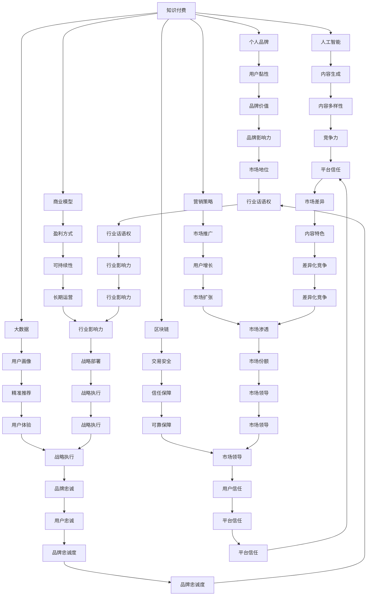

                 

# 如何打造个人知识付费商业帝国

> 关键词：知识付费, 个人品牌, 人工智能, 大数据, 区块链, 商业模型, 营销策略

## 1. 背景介绍

在知识经济时代，信息的获取和传播变得空前便捷，知识的价值也日益凸显。随着个人主义的崛起，知识付费市场呈现出爆炸式增长态势。人们不再满足于免费获取知识，愿意为深度、系统、高效的知识内容买单。这为个人知识付费商业帝国的崛起提供了巨大机遇。

本文旨在探讨如何利用人工智能、大数据、区块链等前沿技术，打造具有核心竞争力的个人知识付费品牌，实现商业成功和影响力提升。我们将从背景、核心概念、算法原理、操作步骤、项目实践、应用场景、工具资源、总结展望等方面进行详细分析。

## 2. 核心概念与联系

### 2.1 核心概念概述

为构建个人知识付费商业帝国，我们需要明确以下核心概念及其关联：

- **知识付费**：基于知识内容创造的商业模式，用户为获取深度、专业、结构化的知识内容付费。
- **个人品牌**：在某一领域内建立独特且价值认可的个人形象，形成忠实用户群体。
- **人工智能**：通过算法模型自动化处理信息，实现知识内容的智能化生成和推荐。
- **大数据**：利用大规模数据训练模型，提升内容推荐和个性化定制能力。
- **区块链**：为知识付费交易提供透明、安全、去中心化的解决方案，保障用户权益。
- **商业模型**：设计合理的盈利方式和用户激励机制，确保商业可持续性。
- **营销策略**：通过有效的市场推广手段，吸引潜在用户，提升品牌知名度和用户粘性。

这些概念之间存在紧密联系，共同支撑个人知识付费商业帝国的构建。

### 2.2 核心概念原理和架构的 Mermaid 流程图



## 3. 核心算法原理 & 具体操作步骤

### 3.1 算法原理概述

个人知识付费商业帝国的核心算法原理主要涉及人工智能、大数据和区块链技术，用于内容的智能生成、个性化推荐、交易安全和用户激励等关键环节。

- **人工智能**：用于内容智能生成、个性化推荐、智能客服等功能，提升用户体验和内容吸引力。
- **大数据**：用于用户画像分析、内容推荐、市场趋势预测等，提升内容精准度和市场响应速度。
- **区块链**：用于知识付费交易的透明、安全、去中心化处理，保障用户权益和平台信任。

### 3.2 算法步骤详解

构建个人知识付费商业帝国，需要遵循以下步骤：

1. **品牌定位**：明确个人品牌在某一领域的核心竞争力和独特价值。
2. **内容规划**：规划高质量、系统化的内容体系，包括课程、文章、视频等。
3. **技术平台建设**：搭建智能内容生成、个性化推荐、区块链交易等技术平台。
4. **商业模型设计**：制定合理的盈利方式和用户激励机制，确保商业可持续性。
5. **市场推广**：通过有效的市场推广手段，吸引潜在用户，提升品牌知名度和用户粘性。
6. **用户管理**：建立用户管理系统，提升用户体验和平台信任。

### 3.3 算法优缺点

- **优点**：
  - 个性化推荐提升用户体验。
  - 区块链交易保障用户权益和平台信任。
  - 人工智能和大数据提升内容质量和市场响应速度。

- **缺点**：
  - 技术投入高，需要大量资金支持。
  - 算法复杂，需要专业人才进行维护。
  - 数据隐私和安全问题需要严格控制。

### 3.4 算法应用领域

个人知识付费商业帝国的算法技术广泛应用于以下领域：

- **内容生成**：通过自然语言处理技术，生成高质量课程、文章和视频。
- **个性化推荐**：利用大数据分析用户兴趣，精准推荐相关内容。
- **智能客服**：使用AI技术处理用户咨询，提升客户服务体验。
- **区块链交易**：保障知识付费交易的透明、安全和去中心化。
- **用户管理**：通过数据分析优化用户行为，提升用户粘性和忠诚度。

## 4. 数学模型和公式 & 详细讲解 & 举例说明

### 4.1 数学模型构建

- **内容生成模型**：基于GPT-3等预训练语言模型，生成高质量的知识内容。
- **推荐系统模型**：基于协同过滤、深度学习等算法，进行个性化推荐。
- **用户画像模型**：基于K-means、LDA等算法，分析用户兴趣和行为特征。

### 4.2 公式推导过程

- **内容生成公式**：$P(x|y) = \frac{exp(\mathbf{W}x)}{\sum_{x'}exp(\mathbf{W}x')}$
  - 其中 $\mathbf{W}$ 为生成模型的参数矩阵。

- **协同过滤推荐公式**：$\text{Predict}(i,j) = \sum_{k}u_{ki}v_{kj} / \|\mathbf{U_k}\|_2\|\mathbf{V_k}\|_2$
  - 其中 $\mathbf{U_k}$ 和 $\mathbf{V_k}$ 分别为用户和物品的隐向量。

- **用户画像公式**：$\mathbf{z} = \mathbf{W} \mathbf{x} + \mathbf{b}$
  - 其中 $\mathbf{z}$ 为隐向量，$\mathbf{x}$ 为用户行为数据，$\mathbf{W}$ 和 $\mathbf{b}$ 为模型参数。

### 4.3 案例分析与讲解

以智能内容生成为例，假设我们希望生成关于“人工智能基础”的课程内容。具体步骤如下：

1. **数据准备**：收集相关领域的书籍、论文、视频等资源，进行预处理和清洗。
2. **模型训练**：使用预训练语言模型GPT-3进行训练，学习生成“人工智能基础”课程内容的语法和语义结构。
3. **内容生成**：将生成的内容进行迭代优化，确保内容的连贯性和知识准确性。
4. **内容发布**：将生成的高质量课程内容发布到平台，供用户学习和下载。

## 5. 项目实践：代码实例和详细解释说明

### 5.1 开发环境搭建

构建个人知识付费商业帝国，需要搭建如下开发环境：

1. **服务器环境**：选择高性能服务器，如AWS、阿里云等。
2. **编程语言**：Python是主流选择，具有丰富的第三方库和框架。
3. **数据处理框架**：Pandas、Scikit-learn等。
4. **机器学习框架**：TensorFlow、PyTorch等。
5. **自然语言处理库**：NLTK、SpaCy等。
6. **人工智能平台**：AWS SageMaker、Google Cloud AI等。
7. **区块链平台**：Hyperledger Fabric、Ethereum等。

### 5.2 源代码详细实现

以智能内容生成为例，使用GPT-3模型生成内容。代码实现如下：

```python
import openai

openai.api_key = 'your_api_key'

response = openai.Completion.create(
  engine="text-davinci-003",
  prompt="什么是人工智能基础？",
  max_tokens=100
)

content = response.choices[0].text
```

### 5.3 代码解读与分析

上述代码首先导入openai库，获取API密钥。然后使用openai.Completion.create方法，调用GPT-3模型生成文本内容。指定prompt为“什么是人工智能基础？”，max_tokens指定生成文本的长度。

### 5.4 运行结果展示

运行上述代码，生成的人工智能基础介绍文本如下：

```
人工智能（Artificial Intelligence，AI）是一种通过计算机系统模拟人类智能的技术，包括但不限于机器学习、深度学习、自然语言处理、计算机视觉等。
人工智能的核心在于模拟人类的学习和推理能力，通过大量数据和算法，让机器能够理解和应用复杂的信息，从而解决实际问题。
```

## 6. 实际应用场景

### 6.1 智能内容生成

智能内容生成是个人知识付费商业帝国的核心竞争力之一。通过使用人工智能技术，可以快速生成高质量、高价值的课程、文章和视频，满足用户的学习需求。

### 6.2 个性化推荐

个性化推荐系统能够根据用户兴趣和行为数据，精准推荐相关内容，提升用户体验和平台粘性。

### 6.3 智能客服

智能客服系统使用AI技术处理用户咨询，提升客户服务效率和体验，减少人工成本。

### 6.4 区块链交易

区块链技术用于知识付费交易，保障交易透明、安全和去中心化，提升用户信任和平台信誉。

### 6.5 用户管理

通过数据分析优化用户行为，提升用户粘性和忠诚度，构建忠实用户群体。

## 7. 工具和资源推荐

### 7.1 学习资源推荐

1. **Coursera**：提供多种人工智能和知识付费课程，涵盖从入门到高级的内容。
2. **Udacity**：提供深度学习和自然语言处理课程，与企业项目紧密结合。
3. **Kaggle**：提供数据科学竞赛，实践机器学习和数据处理技能。
4. **Medium**：阅读和分享人工智能和大数据领域的最新文章和研究进展。
5. **ArXiv**：获取前沿AI论文和技术进展，保持技术领先。

### 7.2 开发工具推荐

1. **AWS SageMaker**：提供完整的人工智能平台，支持模型训练、部署和监控。
2. **Google Cloud AI**：提供强大的云服务，支持深度学习、自然语言处理和图像识别。
3. **Azure Machine Learning**：支持数据管理、模型训练和部署，易于使用。
4. **TensorBoard**：用于可视化模型训练过程，提升调试效率。
5. **Hugging Face Transformers**：提供预训练模型和工具库，加速模型开发。

### 7.3 相关论文推荐

1. **Attention is All You Need**：提出Transformer模型，用于文本生成和推荐系统。
2. **BERT: Pre-training of Deep Bidirectional Transformers for Language Understanding**：提出BERT模型，用于文本理解和大规模预训练。
3. **Scalable Deep Learning with Synthetic Labels**：提出数据合成方法，解决数据不足问题。
4. **Blockchain for Knowledge Sharing in Scientific Collaboration**：探讨区块链技术在科学合作中的应用。

## 8. 总结：未来发展趋势与挑战

### 8.1 研究成果总结

- **人工智能**：技术发展迅速，不断提升内容生成和推荐系统的智能化水平。
- **大数据**：数据量持续增长，提升用户画像和市场预测的精准度。
- **区块链**：应用场景不断拓展，保障交易安全和平台信任。
- **知识付费**：市场需求旺盛，用户对高质量内容的需求不断增长。

### 8.2 未来发展趋势

1. **AI辅助创作**：人工智能将辅助内容创作，提升创作效率和内容质量。
2. **个性化推荐**：通过大数据和AI技术，实现个性化推荐系统的不断优化。
3. **区块链普及**：区块链技术将进一步普及，保障知识付费交易的安全和透明。
4. **知识共享**：基于区块链的知识共享平台将为全球知识传播提供新路径。
5. **智能客服**：智能客服系统将全面普及，提升客户服务体验。

### 8.3 面临的挑战

1. **技术壁垒**：技术复杂，需要大量资金和专业人才支持。
2. **数据隐私**：数据隐私和安全问题需要严格控制。
3. **用户体验**：提升用户体验需要持续优化算法和技术。
4. **市场竞争**：面对激烈的市场竞争，需要不断创新和优化商业模式。

### 8.4 研究展望

1. **跨领域融合**：将AI、大数据、区块链等技术进行跨领域融合，提升整体竞争力。
2. **用户参与**：引入用户反馈和社区共建机制，提升用户满意度和平台粘性。
3. **国际化布局**：拓展国际市场，提升品牌影响力和用户群体。
4. **技术前沿**：关注前沿技术进展，保持技术领先和创新能力。

## 9. 附录：常见问题与解答

**Q1: 什么是知识付费？**

A: 知识付费是一种基于知识内容创造的商业模式，用户为获取深度、专业、系统化的知识内容付费。

**Q2: 个人知识付费商业帝国的核心算法原理是什么？**

A: 核心算法原理涉及人工智能、大数据和区块链技术，用于内容的智能生成、个性化推荐、交易安全和用户激励等关键环节。

**Q3: 如何搭建个人知识付费商业帝国的开发环境？**

A: 需要搭建高性能服务器、编程语言环境、数据处理框架、机器学习框架、自然语言处理库、人工智能平台和区块链平台。

**Q4: 如何进行智能内容生成？**

A: 使用预训练语言模型如GPT-3，通过指定prompt和max_tokens生成高质量内容。

**Q5: 如何实现个性化推荐？**

A: 通过协同过滤、深度学习等算法，基于用户兴趣和行为数据进行推荐。

---

作者：禅与计算机程序设计艺术 / Zen and the Art of Computer Programming

