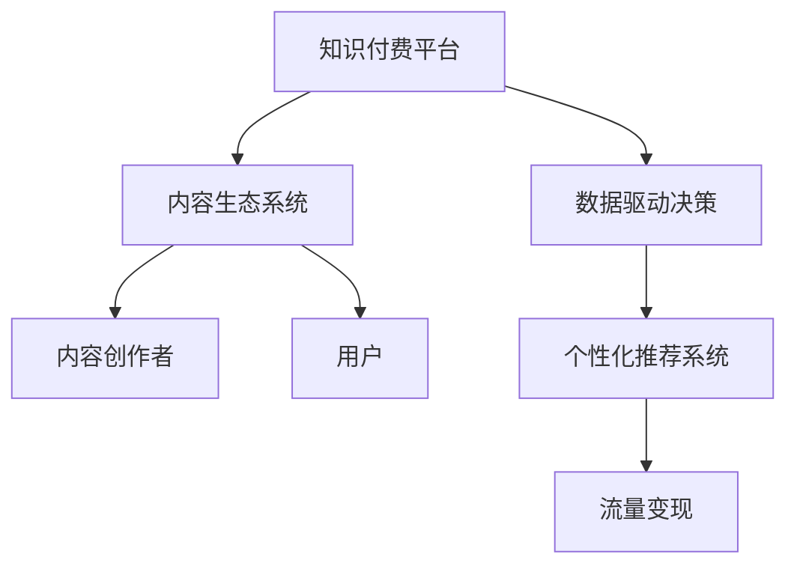

                 

# 如何打造个人知识付费平台

> 关键词：知识付费,内容平台,技术栈,数据驱动,用户增长,盈利模式

## 1. 背景介绍

### 1.1 问题由来
在互联网快速发展的今天，知识和信息的重要性日益凸显，人们对于高质量、有深度的内容的渴求不断增加。传统的教育和出版方式已经难以满足这种需求，知识付费平台的兴起为内容的传播和知识的交易提供了新的可能。然而，如何打造一个高效、可持续、具有吸引力的个人知识付费平台，成为了一个重要而复杂的问题。

### 1.2 问题核心关键点
打造个人知识付费平台的核心在于以下几点：
- **平台定位和内容策略**：明确平台的定位，决定内容覆盖的领域和范围，制定科学的内容生产与筛选策略。
- **技术架构和系统构建**：构建稳定、可扩展的技术架构，确保平台的高效运行和用户满意度。
- **数据驱动的用户增长**：通过数据分析来指导用户增长策略，提升平台的用户黏性和市场竞争力。
- **盈利模式和变现策略**：制定合理的盈利模式和变现策略，确保平台的可持续发展和商业价值。
- **用户体验和内容质量**：注重用户体验和内容质量，建立良好的用户口碑，形成良性循环。

### 1.3 问题研究意义
个人知识付费平台的建设，不仅有助于促进知识的传播和增值，还能够带动相关教育、技术和内容产业的发展。通过高质量的知识服务，提升社会整体的认知水平和生产力。

## 2. 核心概念与联系

### 2.1 核心概念概述

为了更好地理解个人知识付费平台的构建，本节将介绍几个密切相关的核心概念：

- **知识付费平台**：基于互联网的在线知识服务交易平台，通过订阅、单次付费等方式提供有价值的知识内容，促进知识的生产和消费。
- **内容生态系统**：由内容创作者、平台方、用户组成的生态系统，通过激励机制和管理系统，形成一个良性的知识生产与消费闭环。
- **数据驱动决策**：利用数据分析、机器学习等技术手段，对平台运营中的各项数据进行深入挖掘，以指导决策和优化运营。
- **个性化推荐系统**：通过分析用户行为和偏好，推荐符合其需求的内容，提高用户满意度，增强粘性。
- **流量变现**：通过广告、增值服务、会员订阅等方式，将平台的流量转换为实际的收入，确保平台的商业可持续性。

这些核心概念之间的逻辑关系可以通过以下Mermaid流程图来展示：



这个流程图展示了这个平台的核心概念及其之间的关系：

1. 平台通过内容创作者提供高质量知识内容，吸引并服务用户。
2. 平台构建一个生态系统，通过激励机制和管理系统，保持知识产销平衡。
3. 数据驱动的决策体系，通过分析数据来指导运营，优化内容推荐。
4. 个性化推荐系统提升用户体验，增强用户粘性。
5. 平台通过流量变现，实现商业目标。

这些概念共同构成了个人知识付费平台的运营框架，使其能够有效地提供知识服务并实现商业价值。

## 3. 核心算法原理 & 具体操作步骤
### 3.1 算法原理概述

个人知识付费平台的建设，主要包括以下几个关键步骤：

- **用户需求分析**：通过问卷、访谈等方式，获取目标用户的基本信息和需求。
- **内容策略制定**：根据用户需求和市场趋势，制定内容生产与筛选策略。
- **技术架构设计**：选择合适的技术栈和架构模式，构建高性能、可扩展的系统。
- **数据管理和分析**：搭建数据管理和分析平台，利用数据分析指导运营决策。
- **个性化推荐系统开发**：开发个性化推荐引擎，提升用户体验和粘性。
- **盈利模式设计**：设计合理的盈利模式，确保平台的可持续发展和商业价值。
- **平台运营优化**：通过优化用户体验和内容质量，提升用户满意度和留存率。

### 3.2 算法步骤详解

**Step 1: 用户需求分析**

- **数据收集**：通过问卷、访谈等方式，收集用户基本信息、兴趣爱好、学习需求等数据。
- **数据分析**：使用统计分析、聚类分析等方法，识别用户需求和市场趋势。
- **需求提炼**：根据数据分析结果，提炼出用户共性需求和个性化需求。

**Step 2: 内容策略制定**

- **内容定位**：根据用户需求和市场趋势，确定平台的主要内容领域和方向。
- **内容生产**：招募或合作具有专业背景和知识储备的内容创作者，进行高质量内容生产。
- **内容筛选**：设置严格的筛选标准，保证内容质量和价值。

**Step 3: 技术架构设计**

- **选择合适的技术栈**：根据平台规模和需求，选择合适的编程语言、数据库和框架。
- **设计模块化架构**：将平台分解为模块化的系统组件，提高系统可扩展性和维护性。
- **安全性和稳定性**：设计全面的安全策略和灾难恢复机制，确保系统的稳定运行。

**Step 4: 数据管理和分析**

- **数据采集**：通过日志、用户行为数据、内容互动数据等途径，全面采集平台数据。
- **数据存储和管理**：选择合适的数据存储方案，确保数据安全和高效访问。
- **数据分析与挖掘**：利用数据分析、机器学习等技术，挖掘用户行为和内容互动规律。

**Step 5: 个性化推荐系统开发**

- **用户画像构建**：通过用户行为数据和交互数据，构建用户画像，捕捉用户兴趣和需求。
- **推荐算法设计**：选择合适的推荐算法，如协同过滤、内容推荐等，实现个性化内容推荐。
- **推荐系统优化**：不断优化推荐算法，提升推荐效果和用户满意度。

**Step 6: 盈利模式设计**

- **用户画像和行为分析**：通过用户画像和行为分析，识别用户潜在的消费能力和消费意愿。
- **付费策略制定**：根据用户画像和行为分析结果，设计合理的订阅、单次付费等付费策略。
- **增值服务开发**：开发额外的增值服务，如课程讲解、在线答疑等，提升用户价值和平台收入。

**Step 7: 平台运营优化**

- **用户体验优化**：通过优化界面设计、功能实现等，提升用户的使用体验。
- **内容质量管理**：设立内容质量标准和审核机制，确保内容的高质量和价值。
- **用户互动和反馈**：建立用户反馈机制，及时了解用户需求和问题，优化内容和运营策略。

### 3.3 算法优缺点

个人知识付费平台的建设，主要具有以下优点：

- **高效利用知识资源**：通过平台化的方式，高效整合和利用专业知识和经验，降低知识传播的门槛。
- **精准对接需求**：通过数据分析和个性化推荐系统，精准对接用户需求，提高知识服务的匹配度。
- **促进知识交流**：平台提供了知识交流的平台，促进了知识的互动和共享。
- **商业模式创新**：通过多样化的盈利模式，实现平台的商业价值和社会价值。

同时，该方法也存在一定的局限性：

- **内容质量和创作者管理**：需要高效的内容管理和创作者激励机制，确保内容质量。
- **用户信任和平台信誉**：需要建立良好的用户信任和平台信誉，确保平台的长期发展。
- **数据隐私和安全**：需要严格的数据隐私和安全措施，保护用户隐私和数据安全。
- **平台运营和维护成本**：平台的建设、运营和维护需要较高的成本投入，需要合理的资源配置。

尽管存在这些局限性，但就目前而言，个人知识付费平台的建设仍然是一个值得探索和实践的方向。未来相关研究的重点在于如何进一步优化内容生产和筛选策略，提升推荐系统的效果，同时兼顾用户体验和平台盈利。

### 3.4 算法应用领域

个人知识付费平台的建设，已经在教育、培训、科技、健康等多个领域得到了广泛的应用，具体包括：

- **在线教育**：通过知识付费平台，提供各类在线课程和培训，满足用户学习需求。
- **专业培训**：为行业专家和企业提供专业的培训和咨询服务，提升专业技能和知识水平。
- **科技资讯**：通过知识付费平台，提供最新的科技资讯和深入解析，帮助用户掌握前沿技术。
- **健康管理**：提供健康管理课程、健康咨询和健康数据分析服务，提升用户的健康水平。

除了上述这些典型应用外，个人知识付费平台还在人力资源管理、创业指导、心理咨询等领域得到了创新性的应用，为用户提供了丰富多样的知识服务。随着平台技术的不断成熟和市场需求的持续增长，预计未来的应用领域将更加广泛，覆盖更多垂直行业。

## 4. 数学模型和公式 & 详细讲解 & 举例说明（备注：数学公式请使用latex格式，latex嵌入文中独立段落使用 $$，段落内使用 $)
### 4.1 数学模型构建

个人知识付费平台的建设，涉及多个领域的数学模型和公式，以下对其中几个关键模型进行详细讲解：

- **用户画像构建**：通过用户行为数据和互动数据，构建用户画像，可以采用聚类算法或协同过滤算法进行用户分群。
- **推荐系统设计**：个性化推荐系统可以采用协同过滤、基于内容的推荐、深度学习推荐等算法。
- **预测模型设计**：利用机器学习模型预测用户行为和需求，可以采用线性回归、逻辑回归、决策树、随机森林等算法。

### 4.2 公式推导过程

**用户画像构建**：

用户画像构建的基本步骤如下：

1. 数据收集：通过用户在平台上的行为数据，如浏览记录、搜索记录、购买记录等，构建用户行为向量。
2. 数据处理：对行为数据进行预处理，包括去噪、归一化等操作。
3. 特征提取：通过特征提取算法，将行为向量转换为特征向量，如使用TF-IDF算法。
4. 聚类分析：使用K-means、层次聚类等聚类算法，对特征向量进行聚类分析，形成用户分群。
5. 用户画像：根据聚类结果，形成每个用户的用户画像，描述其兴趣和需求。

**推荐系统设计**：

推荐系统设计的关键在于如何根据用户画像和内容特征，匹配合适的推荐内容。以下以协同过滤算法为例，进行详细推导：

1. 用户行为矩阵构建：构建用户-物品评分矩阵 $R$，用户行为数据 $R_{ui}$ 表示用户 $u$ 对物品 $i$ 的评分。
2. 用户相似度计算：计算用户之间的相似度，常用余弦相似度公式：
   $$
   \text{similarity}(u,v)=\frac{R_{ui}\cdot R_{vi}}{\sqrt{\sum_{i}R_{ui}^2}\cdot\sqrt{\sum_{i}R_{vi}^2}}
   $$
3. 物品相似度计算：计算物品之间的相似度，可以使用物品相似度矩阵 $S$。
4. 推荐结果计算：根据用户和物品的相似度，计算推荐结果 $R_{ui}$，公式如下：
   $$
   R_{ui}=\sum_{v\in V}\alpha_{uv}R_{vi}+\beta\overline{R}_i
   $$
   其中，$\alpha_{uv}$ 表示用户 $u$ 和用户 $v$ 之间的相似度权重，$\beta$ 表示物品均值项的权重。

**预测模型设计**：

预测模型设计的目标是利用历史数据，预测用户的行为和需求。以线性回归模型为例，其推导如下：

1. 数据收集：收集历史数据，如用户行为数据、内容特征数据等。
2. 数据预处理：对数据进行归一化、去噪等预处理操作。
3. 特征工程：对数据进行特征提取，如使用PCA算法进行降维。
4. 模型训练：使用线性回归模型对数据进行训练，公式如下：
   $$
   y = w_0 + w_1x_1 + w_2x_2 + \cdots + w_nx_n + e
   $$
   其中，$y$ 表示预测值，$x_i$ 表示特征变量，$w_i$ 表示特征系数，$e$ 表示误差项。
5. 模型评估：使用均方误差、均方根误差等指标评估模型性能。

### 4.3 案例分析与讲解

**案例一：在线教育平台**

在线教育平台通过知识付费模式，为用户提供各类高质量课程。平台通过数据分析和个性化推荐，提升课程的匹配度和用户满意度。

**案例二：专业培训平台**

专业培训平台为行业专家和企业提供专业的培训和咨询服务，通过知识付费模式，提升专业技能和知识水平。平台通过个性化推荐和内容优化，提升用户的学习效果和平台收入。

**案例三：科技资讯平台**

科技资讯平台通过知识付费模式，提供最新的科技资讯和深入解析。平台通过数据分析和内容筛选，提升信息的时效性和准确性，满足用户的学习需求。

这些案例展示了个人知识付费平台在多个领域的成功应用，证明了其在提高知识服务匹配度和用户体验方面的巨大潜力。

## 5. 项目实践：代码实例和详细解释说明
### 5.1 开发环境搭建

在进行平台开发前，我们需要准备好开发环境。以下是使用Python进行Django开发的环境配置流程：

1. 安装Anaconda：从官网下载并安装Anaconda，用于创建独立的Python环境。

2. 创建并激活虚拟环境：
```bash
conda create -n knowledge-platform python=3.8 
conda activate knowledge-platform
```

3. 安装Django和其他必要的依赖：
```bash
pip install django djangorestframework django-cors-headers psycopg2-binary markdown
```

4. 安装数据库：
```bash
sudo apt-get update
sudo apt-get install postgresql postgresql-contrib
```

5. 安装PGadmin进行数据库管理：
```bash
sudo apt-get install pgadmin4
```

完成上述步骤后，即可在`knowledge-platform`环境中开始平台开发。

### 5.2 源代码详细实现

我们以一个简单的在线教育平台为例，给出使用Django进行知识付费平台开发的PyTorch代码实现。

首先，定义User模型和Content模型：

```python
from django.db import models

class User(models.Model):
    name = models.CharField(max_length=50)
    email = models.EmailField(unique=True)
    age = models.IntegerField(null=True, blank=True)
    gender = models.CharField(max_length=10, null=True, blank=True)
    created_at = models.DateTimeField(auto_now_add=True)
    updated_at = models.DateTimeField(auto_now=True)

class Content(models.Model):
    title = models.CharField(max_length=255)
    description = models.TextField()
    duration = models.IntegerField(null=True, blank=True)
    category = models.CharField(max_length=255)
    price = models.DecimalField(max_digits=10, decimal_places=2)
    created_at = models.DateTimeField(auto_now_add=True)
    updated_at = models.DateTimeField(auto_now=True)
```

然后，定义用户注册视图和内容浏览视图：

```python
from django.shortcuts import render
from django.contrib.auth.forms import UserCreationForm
from .models import User, Content

def register(request):
    if request.method == 'POST':
        form = UserCreationForm(request.POST)
        if form.is_valid():
            form.save()
            return redirect('home')
    else:
        form = UserCreationForm()
    return render(request, 'register.html', {'form': form})

def content_list(request):
    content_list = Content.objects.all()
    return render(request, 'content_list.html', {'content_list': content_list})
```

最后，启动Django服务器：

```bash
python manage.py runserver
```

在浏览器中访问`http://127.0.0.1:8000/`，即可看到用户注册和内容浏览的界面。

### 5.3 代码解读与分析

让我们再详细解读一下关键代码的实现细节：

**User模型和Content模型**：
- `User`模型定义了用户的基本信息，如姓名、邮箱、年龄、性别等。
- `Content`模型定义了课程的基本信息，如标题、描述、时长、类别、价格等。

**注册视图和内容浏览视图**：
- `register`视图用于处理用户注册请求，通过`UserCreationForm`表单收集用户信息，并将其保存到数据库中。
- `content_list`视图用于展示所有课程列表，通过`Content.objects.all()`查询所有课程信息，并返回给前端页面。

**Django服务器启动**：
- 在命令行中使用`python manage.py runserver`命令，启动Django开发服务器。

### 5.4 运行结果展示

通过以上代码实现，我们成功搭建了一个简单的在线教育平台，实现了用户注册和课程浏览的功能。通过这些基础功能的开发，可以逐步增加课程购买、课程评价、课程推荐等功能，进一步完善平台的运营体验。

## 6. 实际应用场景
### 6.1 在线教育平台

在线教育平台通过知识付费模式，为用户提供各类高质量课程。平台通过数据分析和个性化推荐，提升课程的匹配度和用户满意度。

### 6.2 专业培训平台

专业培训平台为行业专家和企业提供专业的培训和咨询服务，通过知识付费模式，提升专业技能和知识水平。平台通过个性化推荐和内容优化，提升用户的学习效果和平台收入。

### 6.3 科技资讯平台

科技资讯平台通过知识付费模式，提供最新的科技资讯和深入解析。平台通过数据分析和内容筛选，提升信息的时效性和准确性，满足用户的学习需求。

### 6.4 未来应用展望

随着个人知识付费平台的不断发展，未来的应用场景将更加多样，包括但不限于以下几个方面：

- **多模态学习**：结合文本、视频、音频等多模态数据，提供更加丰富、全面的知识服务。
- **自适应学习**：根据用户的学习进度和反馈，动态调整学习内容和难度，实现个性化的学习体验。
- **社交互动**：建立用户社区，促进用户之间的互动和交流，增强学习效果。
- **虚拟教室**：通过虚拟教室技术，提供沉浸式的学习体验，提升学习效果。

这些未来应用场景的探索，将进一步提升个人知识付费平台的价值和用户满意度，为知识的传播和利用带来新的机遇。

## 7. 工具和资源推荐
### 7.1 学习资源推荐

为了帮助开发者系统掌握个人知识付费平台的技术实现，这里推荐一些优质的学习资源：

1. **Django官方文档**：Django的官方文档提供了详细的教程和API文档，是新手入门的最佳选择。
2. **Python Web开发实战**：本书介绍了Django、Flask等Web开发框架的实战应用，涵盖Web开发的基本概念和常用技术。
3. **Django REST框架指南**：Django REST框架是一个强大的Web API开发工具，本书介绍了其基本概念和常用技术。
4. **深度学习入门与实践**：本书介绍了深度学习的基本概念和应用，涵盖神经网络、模型训练、数据分析等内容。
5. **知识图谱与推荐系统**：本书介绍了知识图谱和推荐系统的基本概念和算法，适合数据分析和推荐系统领域的学习者。

通过对这些资源的学习实践，相信你一定能够快速掌握个人知识付费平台的技术实现，并用于解决实际的运营问题。

### 7.2 开发工具推荐

高效的开发离不开优秀的工具支持。以下是几款用于个人知识付费平台开发的常用工具：

1. **Django**：一个高层次的Web框架，具有简单易用的API和丰富的第三方插件，适合快速开发Web应用。
2. **MySQL/PostgreSQL**：常用的关系型数据库，适合存储和管理复杂数据结构。
3. **Redis**：常用的内存数据库，适合存储和缓存高频访问的数据，提升系统性能。
4. **Flask**：轻量级的Web框架，适合构建小型Web应用和API服务。
5. **Django Rest Framework**：一个强大的Web API开发工具，支持RESTful风格的API设计和数据序列化。
6. **Apache Kafka**：分布式流处理平台，适合处理海量数据流，提升系统处理能力。

合理利用这些工具，可以显著提升个人知识付费平台的开发效率，加快创新迭代的步伐。

### 7.3 相关论文推荐

个人知识付费平台的建设，涉及多个领域的理论研究和实践应用。以下是几篇奠基性的相关论文，推荐阅读：

1. **Web应用开发与设计**：本书介绍了Web应用开发的基本概念和常用技术，涵盖Django、Flask等Web框架的开发实践。
2. **推荐系统设计**：介绍了推荐系统的基本概念和常用算法，如协同过滤、基于内容的推荐、深度学习推荐等。
3. **知识图谱构建与应用**：介绍了知识图谱的构建和应用方法，适合数据挖掘和知识工程领域的学习者。
4. **在线教育平台设计**：介绍了在线教育平台的设计和实现方法，涵盖课程管理、用户管理、推荐系统等内容。
5. **个性化推荐系统**：介绍了个性化推荐系统的设计和优化方法，适合推荐系统领域的学习者。

这些论文代表了大数据和人工智能领域的最新研究成果，通过学习这些前沿成果，可以帮助研究者把握学科前进方向，激发更多的创新灵感。

## 8. 总结：未来发展趋势与挑战
### 8.1 总结

本文对个人知识付费平台的建设进行了全面系统的介绍。首先阐述了个人知识付费平台的核心概念和研究背景，明确了平台在知识传播和教育培训中的重要意义。其次，从原理到实践，详细讲解了平台建设的关键步骤和技术细节，给出了平台开发的完整代码实例。同时，本文还探讨了平台在在线教育、专业培训、科技资讯等多个领域的应用前景，展示了平台的巨大潜力。最后，本文精选了平台开发所需的各类学习资源和开发工具，力求为读者提供全方位的技术指引。

通过本文的系统梳理，可以看到，个人知识付费平台的建设具有广泛的应用前景和巨大的商业价值，正逐步成为教育、培训和科技领域的热门话题。未来，随着技术的发展和应用的拓展，平台将迎来更多的创新和突破。

### 8.2 未来发展趋势

展望未来，个人知识付费平台的建设将呈现以下几个发展趋势：

1. **多元化内容**：平台将提供更加丰富、多样化的内容形式，包括文本、视频、音频、直播等，满足用户的多样化需求。
2. **智能化推荐**：通过机器学习和深度学习技术，实现更加精准、个性化的推荐系统，提升用户满意度。
3. **自适应学习**：结合人工智能和大数据分析技术，实现个性化的自适应学习，提升学习效果和用户体验。
4. **社交互动**：建立用户社区和社交网络，促进用户之间的互动和交流，增强平台的粘性。
5. **虚拟教室**：通过虚拟现实和增强现实技术，提供沉浸式的学习体验，提升学习效果和互动性。
6. **全球化布局**：通过多语言支持和本地化运营，拓展平台的全球市场，满足不同地区用户的需求。

这些趋势凸显了个人知识付费平台的广阔前景，为知识服务的传播和利用带来了新的机遇。

### 8.3 面临的挑战

尽管个人知识付费平台的建设具有广阔的发展前景，但在迈向更加智能化、普适化应用的过程中，它仍面临着诸多挑战：

1. **内容质量和创作者管理**：需要高效的内容管理和创作者激励机制，确保内容质量。
2. **用户信任和平台信誉**：需要建立良好的用户信任和平台信誉，确保平台的长期发展。
3. **数据隐私和安全**：需要严格的数据隐私和安全措施，保护用户隐私和数据安全。
4. **平台运营和维护成本**：平台的建设、运营和维护需要较高的成本投入，需要合理的资源配置。
5. **商业模式和盈利模式**：需要制定合理的商业模式和盈利模式，确保平台的商业可持续性。
6. **技术壁垒和创新挑战**：需要突破技术壁垒，不断进行技术创新，提升平台的竞争力。

尽管存在这些挑战，但通过不断的技术探索和市场验证，个人知识付费平台仍然具有广阔的发展前景。未来相关研究的重点在于如何进一步优化内容生产和筛选策略，提升推荐系统的效果，同时兼顾用户体验和平台盈利。

### 8.4 研究展望

面向未来，个人知识付费平台的研究需要在以下几个方面寻求新的突破：

1. **内容治理机制**：建立健全的内容治理机制，确保内容的质量和合规性。
2. **个性化学习路径**：设计个性化的学习路径，帮助用户更好地掌握知识。
3. **虚拟互动技术**：结合虚拟现实和增强现实技术，提供沉浸式的学习体验。
4. **全球化内容运营**：拓展平台的全球市场，提供多语言支持和本地化运营。
5. **技术融合创新**：结合人工智能和大数据分析技术，实现平台的智能化和个性化。
6. **社交化学习社区**：建立用户社区和社交网络，促进用户之间的互动和交流。

这些研究方向的探索，将进一步推动个人知识付费平台的发展，提升知识的传播和利用效率，为社会带来更多的价值。

## 9. 附录：常见问题与解答

**Q1：如何构建用户画像？**

A: 构建用户画像的关键在于收集和分析用户的各项行为数据，如浏览记录、搜索记录、购买记录等。通过聚类算法或协同过滤算法，对用户的行为数据进行分类和聚合，形成用户画像。用户画像可以包括用户的兴趣偏好、消费习惯、学习进度等关键信息。

**Q2：如何设计个性化推荐系统？**

A: 个性化推荐系统的设计主要分为以下几个步骤：
1. 收集用户行为数据和内容特征数据，构建用户-物品评分矩阵。
2. 使用协同过滤算法或基于内容的推荐算法，计算用户和物品的相似度。
3. 根据用户和物品的相似度，计算推荐结果。
4. 不断优化推荐算法，提升推荐效果和用户满意度。

**Q3：如何设计盈利模式？**

A: 平台盈利模式的设计需要考虑多个因素，如用户画像和行为分析、内容质量管理、增值服务开发等。常见的盈利模式包括订阅制、单次付费、增值服务等。通过合理的盈利模式设计，确保平台的商业可持续性。

**Q4：如何优化用户体验？**

A: 优化用户体验的关键在于不断改进平台界面设计和功能实现，提升用户的使用体验。可以通过用户反馈和数据分析，了解用户的痛点和需求，有针对性地优化平台功能。

**Q5：如何确保平台的安全性和稳定性？**

A: 确保平台的安全性和稳定性需要建立全面的安全策略和灾难恢复机制，如数据备份、防火墙、DDoS防护等。同时，定期进行系统监控和性能优化，确保平台的稳定运行。

通过这些常见问题的解答，相信你能够更好地理解个人知识付费平台的核心技术和运营策略，顺利开展平台开发和运营工作。

---

作者：禅与计算机程序设计艺术 / Zen and the Art of Computer Programming

