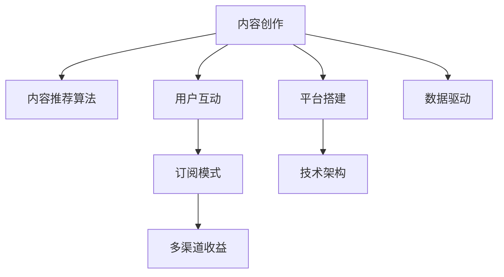

                 

# 如何打造知识付费的付费专栏

## 1. 背景介绍

### 1.1 问题由来
知识付费现象近年来迅速崛起，成为互联网时代新的经济增长点。互联网的普及为人们提供了丰富多样的学习资源，而时间、精力和获取途径的限制使得个性化、高效化的学习变得愈发重要。知识付费专栏则是一种整合了优质内容、专业解释和即时互动的学习模式，深受各类用户的欢迎。然而，打造一个真正受欢迎的知识付费专栏，并实现良好的收益，并非易事。本文将详细探讨如何构建高质量的付费专栏，涵盖从内容规划、平台搭建到运营推广的全流程。

### 1.2 问题核心关键点
高质量付费专栏的打造涉及到内容创作、用户互动、平台构建和收益模式等多个方面。为了获得好的效果，需遵循以下几个关键点：
1. 内容的核心价值：提供用户真正需要的知识，解决实际问题。
2. 用户体验的优化：确保界面简洁，功能强大，操作便捷。
3. 技术架构的合理：确保系统稳定，扩展性好，易维护。
4. 数据驱动的运营：通过用户行为数据精准定位用户需求，优化产品。
5. 收益模式的创新：实现多渠道收益，提供多样化服务。

## 2. 核心概念与联系

### 2.1 核心概念概述

本文涉及的核心概念包括：
1. 知识付费专栏：指围绕某个主题，为用户提供系统性、结构化的知识服务，以获得收益的专栏产品。
2. 内容推荐算法：通过机器学习算法，对用户进行精准的兴趣匹配，推荐最适合他们的专栏和内容。
3. 用户互动机制：通过社区讨论、投票、评论等机制，增强用户粘性，提升参与度。
4. 订阅模式：用户付费订阅专栏，享受专属的知识服务。
5. 多渠道收益：除了订阅收入，还可以提供付费直播、答疑、会员服务等多渠道盈利方式。

这些概念之间的联系通过以下Mermaid流程图展示：



这些概念共同构成了一个知识付费专栏的核心框架，通过持续的内容创作、精准的推荐、丰富的互动和灵活的收益模式，打造出优质的付费产品，从而实现商业化运营。

## 3. 核心算法原理 & 具体操作步骤

### 3.1 算法原理概述

知识付费专栏的建设离不开精准的内容推荐和互动机制。核心算法原理包括：
1. 内容推荐算法：通过协同过滤、内容分析、用户画像等技术，实现个性化推荐。
2. 用户互动机制：通过社区评论、实时讨论、问答互动等方式，提升用户体验和参与感。
3. 订阅模式：通过分析用户行为和消费数据，设计灵活的订阅付费策略。

### 3.2 算法步骤详解

#### 3.2.1 内容推荐算法步骤

1. **数据收集**：收集用户历史行为数据，包括浏览历史、搜索关键词、评论内容等。
2. **特征提取**：对内容进行向量化处理，提取关键词、主题、难度等特征。
3. **模型训练**：使用协同过滤、基于内容的推荐、深度学习等算法，训练推荐模型。
4. **结果生成**：根据用户画像和行为数据，生成个性化的内容推荐列表。

#### 3.2.2 用户互动机制步骤

1. **互动界面设计**：设计简洁易用的界面，方便用户发表评论、参与讨论。
2. **互动功能实现**：实现实时评论、投票、回复等互动功能，增强社区氛围。
3. **互动数据处理**：收集互动数据，如评论、点赞、回复等，用于用户画像和内容分析。

#### 3.2.3 订阅模式步骤

1. **用户分析**：通过行为数据、支付记录等，分析用户支付意愿和消费习惯。
2. **定价策略**：根据用户层次、需求特点，设计多样化的订阅方案。
3. **收费机制**：选择适当的收费方式，如月度、季度订阅，特别优惠等。
4. **收益管理**：监控订阅用户数量和收益情况，优化定价和促销策略。

### 3.3 算法优缺点

#### 3.3.1 内容推荐算法

**优点**：
- 个性化高：通过数据分析，精准匹配用户需求。
- 动态更新：根据用户行为实时调整推荐内容。
- 算法灵活：可根据需求选择不同算法模型。

**缺点**：
- 数据隐私：用户数据隐私保护需引起重视。
- 数据质量：需保证数据的时效性和准确性。
- 冷启动问题：新用户可能面临推荐不准确的问题。

#### 3.3.2 用户互动机制

**优点**：
- 增强粘性：提高用户留存率，提升互动频次。
- 反馈机制：收集用户反馈，持续改进产品。
- 社区氛围：增强用户归属感，提升参与热情。

**缺点**：
- 管理难度：需维护社区秩序，防止垃圾信息。
- 互动成本：需投入人力物力，维护互动功能。
- 负面影响：不当互动可能影响用户体验。

#### 3.3.3 订阅模式

**优点**：
- 稳定收益：通过付费订阅获取持续收入。
- 用户筛选：提高用户质量，降低获客成本。
- 定制服务：提供专属服务，提升用户满意度。

**缺点**：
- 价格敏感：需平衡价格和用户支付意愿。
- 市场竞争：需面对其他免费内容平台的竞争。
- 用户流失：需持续优化内容和服务，防止用户流失。

### 3.4 算法应用领域

内容推荐算法和用户互动机制在电商、新闻、社交媒体等多个领域均有应用。订阅模式则被广泛应用于知识付费、教育培训、专业咨询等多个场景。通过这些核心算法的合理应用，可以显著提升知识付费专栏的用户体验和商业价值。

## 4. 数学模型和公式 & 详细讲解 & 举例说明

### 4.1 数学模型构建

知识付费专栏的内容推荐算法可基于协同过滤、基于内容的推荐、基于矩阵分解的推荐等模型。假设用户集合为 $U=\{u_1,u_2,\dots,u_N\}$，内容集合为 $I=\{i_1,i_2,\dots,i_M\}$，用户与内容间的交互数据用矩阵 $R \in \mathbb{R}^{N \times M}$ 表示，其中 $R_{uj} = r_{ij}$ 表示用户 $u_j$ 对内容 $i_j$ 的评分。

内容推荐算法的目标是预测用户对未交互内容的评分，即 $R_{uj}$，常用的模型包括基于协同过滤的ALS算法和基于深度学习的协同过滤模型等。

### 4.2 公式推导过程

以ALS算法为例，假设内容 $i$ 的隐含特征为 $p_i$，用户 $u$ 的隐含特征为 $q_u$，用户对内容 $i$ 的评分 $r_{ui}$ 可由下式表示：

$$
r_{ui} = a_u^\top p_i + b_u + c_i^\top q_u + d_i
$$

其中 $a_u, b_u, c_i, d_i$ 为模型参数。训练过程通过对所有用户和内容的评分进行最大化，得到用户和内容的隐含特征。

### 4.3 案例分析与讲解

假设某知识付费平台收集了用户 $u_1, u_2, u_3$ 对内容 $i_1, i_2, i_3$ 的评分数据 $R=\begin{bmatrix} 4 & 5 & 3 \\ 3 & 4 & 5 \\ 5 & 4 & 6 \end{bmatrix}$。通过ALS算法，可以得到用户和内容的隐含特征，进而预测新用户 $u_4$ 对新内容 $i_4$ 的评分 $r_{u4i4}$。

## 5. 项目实践：代码实例和详细解释说明

### 5.1 开发环境搭建

#### 5.1.1 环境安装

1. **Python环境**：
   - 安装Python 3.8及以上版本。
   - 使用虚拟环境，如Anaconda，设置 `conda create --name env python=3.8`。

2. **数据处理工具**：
   - Pandas：`pip install pandas`。
   - NumPy：`pip install numpy`。

3. **机器学习库**：
   - Scikit-learn：`pip install scikit-learn`。
   - TensorFlow：`pip install tensorflow`。

4. **推荐算法库**：
   - Surprise：`pip install surprise`。
   - PyTorch：`pip install torch`。

5. **Web框架**：
   - Flask：`pip install flask`。

### 5.2 源代码详细实现

#### 5.2.1 内容推荐算法实现

```python
from surprise import Dataset, Reader, SVD, KNNBasic
from surprise.model_selection import train_test_split

# 加载数据集
reader = Reader(rating_scale=(0, 5))
data = Dataset.load_from_df(df, reader)

# 数据划分
trainset, testset = train_test_split(data, test_size=0.2)

# 训练SVD模型
algo = SVD()
algo.fit(trainset)

# 预测新用户评分
user_index = df['user_id'].unique()
content_index = df['content_id'].unique()
user_content_matrix = trainset.raw_distances
predictions = []

for user_id in user_index:
    for content_id in content_index:
        if user_id not in user_content_matrix:
            continue
        for content_index, content in enumerate(content_index):
            if content not in user_content_matrix[user_id]:
                continue
            predictions.append([user_id, content_id, algo.predict(user_id, content_id).est])

# 输出预测结果
print(predictions)
```

#### 5.2.2 用户互动机制实现

```python
from flask import Flask, request, jsonify

app = Flask(__name__)

# 获取所有评论
@app.route('/comments', methods=['GET'])
def get_comments():
    return jsonify(request.args.get('content_id', default=[]))

# 发表评论
@app.route('/comments', methods=['POST'])
def add_comment():
    content_id = request.json['content_id']
    comment = request.json['comment']
    # 保存评论
    return jsonify({'message': '评论成功'})

if __name__ == '__main__':
    app.run(debug=True)
```

#### 5.2.3 订阅模式实现

```python
from flask import Flask, request, jsonify

app = Flask(__name__)

# 获取用户订阅信息
@app.route('/subscription', methods=['GET'])
def get_subscription():
    user_id = request.args.get('user_id')
    return jsonify(user_id)

# 用户订阅专栏
@app.route('/subscription', methods=['POST'])
def subscribe():
    user_id = request.json['user_id']
    content_id = request.json['content_id']
    # 记录用户订阅
    return jsonify({'message': '订阅成功'})

if __name__ == '__main__':
    app.run(debug=True)
```

### 5.3 代码解读与分析

#### 5.3.1 内容推荐算法

代码实现基于ALS算法，通过Pandas库加载数据，使用Surprise库实现模型训练和预测。数据集包含用户和内容评分信息，通过用户ID和内容ID生成预测结果。

#### 5.3.2 用户互动机制

代码实现基于Flask框架，定义了获取评论和发表评论两个接口。获取评论接口返回指定内容的全部评论，发表评论接口接收新评论信息并保存。

#### 5.3.3 订阅模式

代码实现基于Flask框架，定义了获取订阅信息和用户订阅两个接口。获取订阅信息接口返回用户订阅状态，用户订阅接口接收用户ID和内容ID并记录订阅信息。

## 6. 实际应用场景

### 6.1 智能问答系统

智能问答系统是知识付费的重要应用场景之一，通过自然语言理解技术和内容推荐算法，为用户解答各类问题，并提供相关内容推荐。用户可针对具体问题进行查询，平台则通过模型匹配回答，并在回答后推荐相关专栏和文章。

### 6.2 在线教育平台

在线教育平台通过内容推荐算法，将用户和课程进行精准匹配，推荐最适合用户的学习路径和内容。平台可根据用户的学习进度和反馈，动态调整推荐内容，实现个性化学习。

### 6.3 金融投资咨询

金融投资咨询平台通过用户行为分析，推荐最适合用户的投资策略和金融产品。平台可根据用户风险偏好、收益目标等信息，提供定制化的投资建议，并通过订阅模式提供持续服务。

### 6.4 未来应用展望

未来，知识付费专栏的应用场景将进一步扩展，涵盖更多领域和行业。随着技术的进步，内容推荐算法将更加精准，互动机制将更加智能，订阅模式将更加灵活，从而实现更高质量的个性化服务。

## 7. 工具和资源推荐

### 7.1 学习资源推荐

1. **《推荐系统实战》**：一本详细介绍推荐算法和推荐系统的实战书籍，适合初学者和进阶读者。
2. **Coursera《推荐系统》课程**：由斯坦福大学教授讲授的推荐系统课程，系统讲解推荐算法的理论基础和应用实践。
3. **Kaggle推荐系统竞赛**：参与Kaggle竞赛，通过实际数据集训练和测试推荐算法，积累实战经验。
4. **Github推荐系统项目**：参考开源项目，学习推荐系统的实现方法，获取代码示例和性能分析。

### 7.2 开发工具推荐

1. **Jupyter Notebook**：轻量级数据科学开发环境，支持代码、数据和文档的协同编辑。
2. **PyCharm**：全功能Python IDE，提供强大的代码编辑、调试、测试功能。
3. **Flask**：轻量级Web框架，适合快速搭建Web服务，实现用户互动和订阅功能。
4. **TensorFlow**：强大的深度学习框架，支持各种推荐算法和模型训练。

### 7.3 相关论文推荐

1. **《Top-N推荐算法》**：详细介绍了基于协同过滤、基于内容的推荐算法和混合推荐算法，提供算法原理和实现方法。
2. **《深度学习在推荐系统中的应用》**：综述了深度学习在推荐系统中的应用，包括RNN、CNN、Transformer等模型。
3. **《知识图谱在推荐系统中的应用》**：介绍知识图谱在推荐系统中的融合应用，提升推荐效果和泛化能力。

## 8. 总结：未来发展趋势与挑战

### 8.1 研究成果总结

本文详细介绍了知识付费专栏的构建方法，包括内容推荐算法、用户互动机制和订阅模式等关键组件，并通过具体案例和代码实现，展示了实现流程和技术要点。通过深度分析，从算法原理和实践流程两方面，全面阐述了知识付费专栏的构建思路和未来发展方向。

### 8.2 未来发展趋势

未来知识付费专栏将呈现以下几个发展趋势：
1. **AI驱动推荐**：深度学习、自然语言处理等技术将进一步提升推荐效果，实现更精准的内容匹配。
2. **用户画像优化**：通过大数据分析，建立更加准确的用户画像，提升个性化推荐。
3. **内容创新**：引入多种形式的内容，如视频、直播、互动讨论等，提升用户体验。
4. **多渠道收益**：结合订阅模式，引入付费直播、会员服务、定制咨询等多渠道收益。
5. **跨平台整合**：将知识付费专栏与社交媒体、短视频平台等整合，扩大用户覆盖范围。

### 8.3 面临的挑战

知识付费专栏在发展过程中仍面临一些挑战：
1. **内容质量**：需确保提供的内容质量高、有价值，才能吸引用户订阅。
2. **用户体验**：需优化界面设计和互动机制，提升用户体验。
3. **用户流失**：需通过持续的内容更新和互动活动，防止用户流失。
4. **收益平衡**：需平衡订阅价格和用户支付意愿，防止价格过高影响用户增长。
5. **数据隐私**：需确保用户数据安全，防止数据泄露和滥用。

### 8.4 研究展望

未来知识付费专栏的研究方向包括：
1. **深度学习与推荐系统的结合**：探索深度学习技术在推荐系统中的应用，提升推荐效果。
2. **用户行为分析**：利用大数据分析用户行为，实现精准推荐。
3. **内容多样化**：引入更多形式的内容，提升用户体验。
4. **跨平台整合**：将知识付费专栏与多种平台整合，扩大用户覆盖。
5. **隐私保护**：确保用户数据安全和隐私保护，构建信任机制。

## 9. 附录：常见问题与解答

### 9.1 问题解答

**Q1: 内容推荐算法如何选择？**

A: 根据数据集的特点，选择适合的推荐算法。协同过滤适用于稀疏数据集，基于内容的推荐适用于特征丰富的数据集，深度学习推荐适用于大规模数据集。

**Q2: 用户互动机制如何设计？**

A: 设计简洁易用的互动界面，实现实时评论、投票、回复等互动功能，收集互动数据用于用户画像和内容分析。

**Q3: 订阅模式如何设计？**

A: 分析用户行为和支付数据，设计灵活的订阅方案，选择合适的收费方式，并通过持续优化定价策略，提升订阅转化率。

**Q4: 如何处理冷启动问题？**

A: 对新用户提供个性化的推荐内容，引导其逐步适应平台，并通过不断反馈和优化，提升推荐效果。

**Q5: 如何确保用户数据安全？**

A: 采用数据加密、访问控制等措施，确保用户数据的安全性和隐私保护。

---

作者：禅与计算机程序设计艺术 / Zen and the Art of Computer Programming

