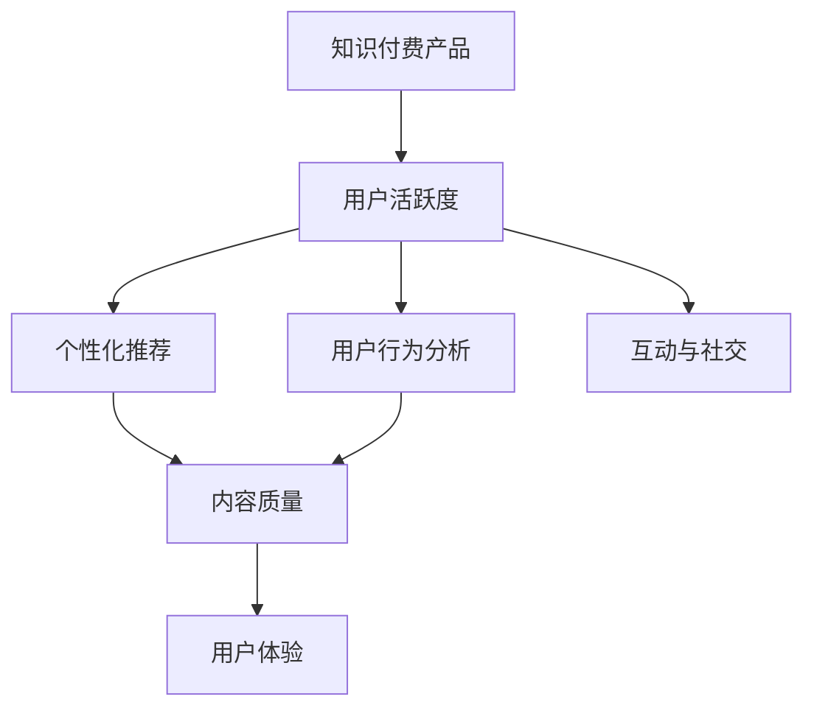

                 

## 1. 背景介绍

### 1.1 问题由来

随着互联网技术的不断发展和知识经济的兴起，知识付费产品越来越受到用户的青睐。从在线课程、音频讲座到电子书、博客文章，各种形式的付费内容满足了人们对于深度学习和专业知识的渴望。然而，尽管内容丰富多样，但知识付费产品的用户活跃度却相对较低。很多用户在支付费用后，往往只有短暂的热度，难以持续使用，导致平台流失率高、用户粘性差，影响到知识付费业务的持续发展。

### 1.2 问题核心关键点

提高知识付费产品的用户活跃度，需要从多个维度进行综合分析和优化。主要的关键点包括：

- **用户行为分析**：理解用户的消费习惯、学习偏好、使用场景等，找出用户流失的原因。
- **个性化推荐**：根据用户的历史行为和兴趣，精准推荐合适的学习内容和资源，提高用户粘性。
- **内容质量提升**：优化内容的质量和结构，使其更具吸引力和实用性，提升用户满意度。
- **互动与社交功能**：增加用户之间的互动和交流，建立社区氛围，增强用户归属感。
- **数据驱动决策**：通过数据分析和用户反馈，持续优化产品和服务，提升用户体验。

这些关键点共同构成了一个提升知识付费产品用户活跃度的完整框架，旨在通过多方位的努力，实现用户留存和复购，推动知识付费业务的持续发展。

## 2. 核心概念与联系

### 2.1 核心概念概述

为更好地理解如何提高知识付费产品的用户活跃度，本节将介绍几个密切相关的核心概念：

- **知识付费产品**：提供专业知识和技能培训，通过付费形式让用户获取高价值内容的平台或应用。
- **用户活跃度**：衡量用户使用知识付费产品的频率、时长和深度，通常通过登录次数、学习时间、消费金额等指标来评估。
- **个性化推荐系统**：利用机器学习技术，根据用户的历史行为和兴趣，推荐符合其偏好的内容。
- **用户行为分析**：通过数据分析工具和算法，挖掘用户的使用习惯和行为模式，指导产品优化。
- **内容质量和用户体验**：高质量的内容和良好的用户体验能够提高用户满意度和粘性。
- **互动与社交功能**：建立用户之间的互动渠道，如评论、讨论、社群等，提升用户参与度。

这些核心概念之间的逻辑关系可以通过以下Mermaid流程图来展示：



这个流程图展示的核心概念之间的关系：

1. 知识付费产品通过个性化推荐和用户行为分析，优化内容和推荐，提升用户活跃度。
2. 内容质量和用户体验直接影响用户满意度，进而影响活跃度。
3. 互动与社交功能增强用户参与感，也是提升活跃度的重要手段。

## 3. 核心算法原理 & 具体操作步骤

### 3.1 算法原理概述

提高知识付费产品用户活跃度的方法基于多种算法和技术，包括用户行为分析、个性化推荐、数据挖掘、机器学习等。其中，基于协同过滤和矩阵分解的个性化推荐算法，以及基于深度学习的用户行为预测算法，是提升用户活跃度的核心技术。

### 3.2 算法步骤详解

#### 3.2.1 用户行为分析

1. **数据收集**：通过日志、应用行为跟踪等手段，收集用户的操作数据、学习时长、购买记录等行为信息。
2. **数据清洗与预处理**：去除噪声数据，处理缺失值，对数据进行标准化和归一化，以便后续分析。
3. **特征提取**：从收集的数据中提取用户特征，如学习时间、浏览内容、购买频率等，作为模型的输入。
4. **模式识别**：使用聚类算法、关联规则等方法，识别用户的行为模式和兴趣点，形成用户画像。

#### 3.2.2 个性化推荐算法

1. **协同过滤算法**：
   - **基于用户的协同过滤**：通过分析用户之间的行为相似性，推荐其他用户喜欢的内容。
   - **基于物品的协同过滤**：通过分析物品之间的相似性，推荐相似物品给用户。
2. **矩阵分解算法**：
   - **基于矩阵分解的用户-物品评分预测**：将用户-物品评分矩阵分解为低秩矩阵，预测用户对未交互物品的评分。
3. **深度学习算法**：
   - **神经网络推荐系统**：使用深度神经网络，根据用户历史行为预测其兴趣，从而进行个性化推荐。

#### 3.2.3 内容质量优化

1. **用户反馈收集**：通过调查问卷、用户评论等方式收集用户对内容的反馈。
2. **内容评估模型**：构建内容质量评估模型，根据用户反馈和专家评分，对内容进行打分。
3. **内容优化策略**：根据评估结果，对内容进行优化，如调整课程难度、增加案例分析等。

#### 3.2.4 用户体验提升

1. **界面设计优化**：提升应用界面的美观度和易用性，增强用户体验。
2. **交互设计改进**：优化用户操作流程，减少操作复杂度，提高用户满意度。
3. **性能优化**：提升应用响应速度和稳定性，减少卡顿和崩溃，增强用户体验。

#### 3.2.5 互动与社交功能

1. **社区建设**：建立用户社区，提供讨论、交流的平台，增加用户互动。
2. **问答系统**：增加问答系统，解答用户问题，增强用户参与感。
3. **推荐系统反馈**：根据用户反馈，调整推荐算法，提高推荐效果。

### 3.3 算法优缺点

个性化推荐算法和用户行为分析方法，具有以下优点：

1. **高效精准**：能够根据用户历史行为，精准推荐符合其兴趣的内容，提升用户活跃度。
2. **可扩展性强**：适用于大规模用户和内容库，具有较好的可扩展性。
3. **适应性强**：能够适应不同用户群体的需求，提高用户满意度。

同时，这些算法也存在一定的局限性：

1. **数据依赖性强**：推荐算法的效果依赖于高质量的用户行为数据，数据获取难度较大。
2. **冷启动问题**：新用户或新内容的推荐效果较差，需要一定时间积累数据。
3. **模型复杂度高**：深度学习等复杂模型计算资源消耗大，难以实时处理。

### 3.4 算法应用领域

个性化推荐算法和用户行为分析方法，在知识付费产品的多个应用领域中得到了广泛应用，如在线课程推荐、内容订阅、广告推荐等，显著提升了用户体验和用户活跃度。

- **在线课程推荐**：通过分析用户的学习行为和评分，推荐合适的课程，提高用户学习兴趣。
- **内容订阅**：根据用户兴趣，推荐相关的文章、博客、视频等内容，提升用户粘性。
- **广告推荐**：通过分析用户行为，精准推荐相关广告，提高广告点击率和转化率。

此外，这些方法还广泛应用于社交网络、电商平台、智能家居等多个领域，成为提升用户体验和业务收益的重要手段。

## 4. 数学模型和公式 & 详细讲解 & 举例说明

### 4.1 数学模型构建

本节将使用数学语言对个性化推荐算法和用户行为分析进行更加严格的刻画。

记知识付费产品的用户集合为 $U$，物品集合为 $I$，用户对物品的评分矩阵为 $\mathbf{R} \in \mathbb{R}^{N \times M}$，其中 $N$ 为用户数量，$M$ 为物品数量。设用户 $u$ 对物品 $i$ 的评分为 $r_{ui}$。

定义用户行为矩阵 $\mathbf{X} \in \mathbb{R}^{N \times D}$，其中 $D$ 为用户特征的维度，$\mathbf{X}_u$ 为第 $u$ 个用户的特征向量。

个性化推荐的目标是根据用户行为矩阵 $\mathbf{X}$ 和评分矩阵 $\mathbf{R}$，预测用户对未评分物品的评分，即求解 $\hat{r}_{ui}$，其中 $\hat{r}_{ui}$ 为预测的评分值。

### 4.2 公式推导过程

以矩阵分解算法为例，推导预测评分 $\hat{r}_{ui}$ 的计算公式。

设用户-物品评分矩阵 $\mathbf{R}$ 分解为两个低秩矩阵 $\mathbf{P} \in \mathbb{R}^{N \times K}$ 和 $\mathbf{Q} \in \mathbb{R}^{M \times K}$，其中 $K$ 为分解后的维度。

预测评分 $\hat{r}_{ui}$ 的计算公式为：

$$
\hat{r}_{ui} = \mathbf{p}_u^T \mathbf{q}_i
$$

其中 $\mathbf{p}_u = \mathbf{P}_u$ 为第 $u$ 个用户在低秩空间中的表示，$\mathbf{q}_i = \mathbf{Q}_i$ 为物品 $i$ 在低秩空间中的表示。

### 4.3 案例分析与讲解

以在线课程推荐为例，分析推荐算法的具体应用。

假设在线课程平台收集了用户的学习行为数据，包括观看时长、完成进度、评分等。平台使用协同过滤算法，根据用户之间的行为相似性，推荐其他用户喜欢的课程。

1. **数据收集**：通过平台记录，获取用户的学习行为数据。
2. **数据预处理**：对数据进行清洗和标准化，去除噪声和缺失值。
3. **相似度计算**：计算用户之间的相似度，根据相似度推荐其他用户喜欢的课程。
4. **推荐生成**：根据用户的历史行为和相似度，生成推荐课程列表。
5. **效果评估**：通过用户反馈和互动情况，评估推荐效果，不断优化算法。

## 5. 项目实践：代码实例和详细解释说明

### 5.1 开发环境搭建

在进行知识付费产品用户活跃度提升的项目实践前，我们需要准备好开发环境。以下是使用Python进行PyTorch和TensorFlow开发的环境配置流程：

1. 安装Anaconda：从官网下载并安装Anaconda，用于创建独立的Python环境。

2. 创建并激活虚拟环境：
```bash
conda create -n pytorch-env python=3.8 
conda activate pytorch-env
```

3. 安装PyTorch和TensorFlow：根据CUDA版本，从官网获取对应的安装命令。例如：
```bash
conda install pytorch torchvision torchaudio cudatoolkit=11.1 -c pytorch -c conda-forge
conda install tensorflow
```

4. 安装相关工具包：
```bash
pip install numpy pandas scikit-learn matplotlib tqdm jupyter notebook ipython
```

完成上述步骤后，即可在`pytorch-env`环境中开始实践项目。

### 5.2 源代码详细实现

下面我们以知识付费平台个性化推荐系统的实现为例，给出使用PyTorch和TensorFlow进行代码实现的全过程。

首先，定义用户行为矩阵和评分矩阵：

```python
import numpy as np
import torch

# 用户行为矩阵
X = np.array([[0.5, 0.2, 0.3],
             [0.4, 0.4, 0.2],
             [0.2, 0.5, 0.3],
             [0.3, 0.3, 0.4]])

# 评分矩阵
R = np.array([[4.5, 3.2, 2.5],
             [3.2, 4.0, 3.8],
             [2.5, 3.8, 4.5],
             [3.0, 3.8, 3.5]])

# 将评分矩阵转换为PyTorch张量
R_tensor = torch.tensor(R)
```

然后，定义矩阵分解算法的模型：

```python
import torch.nn as nn
import torch.nn.functional as F

class MatrixFactorization(nn.Module):
    def __init__(self, K):
        super(MatrixFactorization, self).__init__()
        self.K = K
        self.user_embedding = nn.Embedding(X.shape[0], K)
        self.item_embedding = nn.Embedding(X.shape[1], K)
        self.hidden = nn.Linear(K * 2, K)
        self.prediction = nn.Linear(K, 1)

    def forward(self, X_u, X_i):
        U = self.user_embedding(X_u)
        V = self.item_embedding(X_i)
        hidden = torch.tanh(self.hidden(torch.cat([U, V], dim=1)))
        prediction = self.prediction(hidden)
        return prediction

# 创建模型
K = 2
model = MatrixFactorization(K)
```

接下来，定义损失函数和优化器：

```python
import torch.optim as optim

# 定义损失函数
criterion = nn.MSELoss()

# 定义优化器
optimizer = optim.Adam(model.parameters(), lr=0.01)
```

然后，进行模型训练和预测：

```python
def train_epoch(model, X_u, X_i, R_tensor, num_epochs=100):
    for epoch in range(num_epochs):
        optimizer.zero_grad()
        prediction = model(X_u, X_i)
        loss = criterion(prediction, R_tensor)
        loss.backward()
        optimizer.step()
        print(f"Epoch {epoch+1}, Loss: {loss.item()}")

# 训练模型
train_epoch(model, X_u, X_i, R_tensor)

# 进行预测
X_u_tensor = torch.tensor(X_u)
X_i_tensor = torch.tensor(X_i)
prediction = model(X_u_tensor, X_i_tensor)
print(f"Predicted rating: {prediction.item()}")
```

以上代码实现了基于矩阵分解算法的知识付费平台个性化推荐系统的基本框架。通过这种方式，可以高效地推荐符合用户兴趣的课程，提升用户活跃度。

### 5.3 代码解读与分析

让我们再详细解读一下关键代码的实现细节：

**MatrixFactorization类**：
- `__init__`方法：初始化用户和物品的嵌入层、隐藏层和预测层的权重。
- `forward`方法：前向传播计算预测评分。

**train_epoch函数**：
- `optimizer.zero_grad`：清零优化器梯度，准备新一轮更新。
- `prediction = model(X_u, X_i)`：将用户和物品的嵌入层输出通过隐藏层，计算预测评分。
- `loss = criterion(prediction, R_tensor)`：计算预测评分与实际评分之间的均方误差。
- `loss.backward()`：反向传播计算梯度。
- `optimizer.step()`：更新模型参数。

**训练流程**：
- 设置训练轮数和优化器，开始循环训练
- 在每个epoch内，前向传播计算预测评分，计算损失并反向传播更新模型参数
- 输出损失，评估模型训练效果

可以看到，PyTorch提供了高效、灵活的深度学习框架，可以快速构建和训练个性化推荐模型。

### 5.4 运行结果展示

通过上述代码训练，可以得到预测评分 $\hat{r}_{ui}$ 的值，用于推荐符合用户兴趣的课程。

## 6. 实际应用场景

### 6.1 智能客服系统

在智能客服系统中，知识付费产品可以提供专业的咨询服务和在线答疑，增强用户体验。通过个性化推荐算法，向用户推荐相关课程和答疑资源，帮助用户快速解决疑问，提升用户满意度。

### 6.2 金融理财顾问

金融理财顾问知识付费产品可以根据用户的历史投资记录和理财需求，推荐合适的理财课程和投资策略，帮助用户实现财富增值。通过个性化推荐，提高用户对产品的信任度和依赖性，增强用户粘性。

### 6.3 健康管理平台

健康管理平台知识付费产品可以提供专业的健康知识和管理建议，推荐相关的健康课程和营养计划。通过个性化推荐，增强用户对健康管理的认知和兴趣，提升用户健康水平。

## 7. 工具和资源推荐

### 7.1 学习资源推荐

为了帮助开发者系统掌握知识付费产品的用户活跃度提升的理论基础和实践技巧，这里推荐一些优质的学习资源：

1. 《推荐系统实战》书籍：全面介绍了推荐系统的理论基础和实际应用，适合深入学习。
2. 《深度学习》书籍：介绍深度学习的基本原理和应用，适合学习深度推荐算法。
3. 《用户行为分析》课程：介绍用户行为分析的方法和工具，适合学习数据挖掘和行为分析。
4. 《个性化推荐系统》博客：介绍个性化推荐算法，适合学习推荐系统实践。
5. 《数据科学手册》：包含大量数据挖掘和分析的实例，适合学习数据驱动的决策。

通过对这些资源的学习实践，相信你一定能够快速掌握知识付费产品用户活跃度提升的精髓，并用于解决实际的NLP问题。

### 7.2 开发工具推荐

高效的开发离不开优秀的工具支持。以下是几款用于知识付费产品用户活跃度提升开发的常用工具：

1. PyTorch：基于Python的开源深度学习框架，灵活动态的计算图，适合快速迭代研究。
2. TensorFlow：由Google主导开发的开源深度学习框架，生产部署方便，适合大规模工程应用。
3. Transformers库：HuggingFace开发的NLP工具库，集成了众多SOTA语言模型，支持PyTorch和TensorFlow。
4. Weights & Biases：模型训练的实验跟踪工具，可以记录和可视化模型训练过程中的各项指标，方便对比和调优。
5. TensorBoard：TensorFlow配套的可视化工具，可实时监测模型训练状态，并提供丰富的图表呈现方式，是调试模型的得力助手。
6. Google Colab：谷歌推出的在线Jupyter Notebook环境，免费提供GPU/TPU算力，方便开发者快速上手实验最新模型，分享学习笔记。

合理利用这些工具，可以显著提升知识付费产品用户活跃度提升任务的开发效率，加快创新迭代的步伐。

### 7.3 相关论文推荐

知识付费产品用户活跃度提升的研究源于学界的持续研究。以下是几篇奠基性的相关论文，推荐阅读：

1. "Collaborative Filtering for Recommender Systems"：介绍协同过滤算法的经典论文，是推荐系统研究的基础。
2. "Matrix Factorization Techniques for Recommender Systems"：介绍矩阵分解算法的经典论文，是推荐系统研究的核心。
3. "Deep Learning Recommendation Systems"：介绍深度学习推荐系统的经典论文，是推荐系统研究的前沿。
4. "User Behavior Prediction and Analysis"：介绍用户行为预测和分析的经典论文，是提升用户活跃度的重要方法。

这些论文代表了大语言模型微调技术的发展脉络。通过学习这些前沿成果，可以帮助研究者把握学科前进方向，激发更多的创新灵感。

## 8. 总结：未来发展趋势与挑战

### 8.1 总结

本文对知识付费产品用户活跃度提升的方法进行了全面系统的介绍。首先阐述了用户活跃度的重要性，明确了个性化推荐和用户行为分析在提升用户活跃度中的关键作用。其次，从原理到实践，详细讲解了推荐算法的数学原理和关键步骤，给出了推荐任务开发的完整代码实例。同时，本文还广泛探讨了推荐系统在智能客服、金融理财、健康管理等多个行业领域的应用前景，展示了推荐范式的巨大潜力。

通过本文的系统梳理，可以看到，基于深度学习和协同过滤的推荐方法在知识付费产品中得到了广泛应用，极大地提升了用户体验和用户活跃度。未来，伴随推荐算法和技术的不断演进，知识付费产品必将在更广阔的应用领域大放异彩，为用户带来更多价值。

### 8.2 未来发展趋势

展望未来，知识付费产品用户活跃度提升技术将呈现以下几个发展趋势：

1. **算法复杂度提升**：随着深度学习的发展，推荐算法将更加复杂，能够处理更加多样化和复杂化的用户需求。
2. **多模态数据融合**：结合用户的多模态数据（如文本、图像、语音等），提高推荐效果和用户体验。
3. **动态推荐系统**：根据用户行为实时调整推荐算法，提高推荐的时效性和个性化程度。
4. **联邦学习**：利用分布式数据进行推荐算法训练，保护用户隐私同时提高推荐效果。
5. **元学习**：通过元学习技术，快速适应新的推荐任务，提高算法的灵活性和可扩展性。

以上趋势凸显了知识付费产品用户活跃度提升技术的广阔前景。这些方向的探索发展，必将进一步提升推荐系统的性能和应用范围，为知识付费业务的持续发展提供坚实保障。

### 8.3 面临的挑战

尽管知识付费产品用户活跃度提升技术已经取得了显著成就，但在迈向更加智能化、普适化应用的过程中，仍面临诸多挑战：

1. **数据获取难度大**：高质量的用户行为数据获取难度较大，影响推荐算法的训练效果。
2. **冷启动问题**：新用户或新内容的推荐效果较差，需要一定时间积累数据。
3. **算法复杂度高**：深度学习等复杂模型计算资源消耗大，难以实时处理。
4. **隐私和安全**：用户数据的隐私保护和系统安全是重要问题，需通过技术手段保障。
5. **模型鲁棒性**：推荐模型需具备良好的鲁棒性，避免因数据偏差或异常导致推荐失效。

### 8.4 研究展望

面对知识付费产品用户活跃度提升所面临的挑战，未来的研究需要在以下几个方面寻求新的突破：

1. **数据采集和处理**：优化数据采集方式，提高数据获取效率和质量，结合隐私保护技术，保障用户隐私。
2. **冷启动策略**：引入先验知识或启发式规则，快速适应新用户和新内容，提高推荐效果。
3. **算法优化**：开发更高效、更轻量级的推荐算法，降低计算资源消耗，提高实时性。
4. **隐私保护**：利用联邦学习、差分隐私等技术，保护用户数据隐私，同时保障推荐效果。
5. **模型鲁棒性**：增强推荐模型的鲁棒性，避免因数据偏差或异常导致推荐失效，保障系统稳定性。

这些研究方向的探索，必将引领知识付费产品用户活跃度提升技术迈向更高的台阶，为用户带来更多价值，推动知识付费业务的持续发展。总之，通过不断优化推荐算法和技术，结合多模态数据和隐私保护手段，知识付费产品必将在未来的数字化转型中发挥更大的作用，为社会带来更多创新和进步。

## 9. 附录：常见问题与解答

**Q1：知识付费产品如何收集用户行为数据？**

A: 知识付费产品可以通过应用行为跟踪、用户登录日志、学习记录等方式收集用户行为数据。例如，通过分析用户在平台上的浏览、学习、购买等行为，生成用户画像和行为轨迹。

**Q2：推荐算法如何处理冷启动问题？**

A: 推荐算法处理冷启动问题的方法包括：
1. 引入先验知识：通过专家知识、领域知识等方式，为冷启动用户提供初始推荐。
2. 利用启发式规则：使用简单的规则或默认值，为冷启动用户提供推荐。
3. 引入多模态数据：结合用户的多模态数据（如文本、图像、语音等），提升推荐效果。

**Q3：推荐系统如何保护用户隐私？**

A: 推荐系统保护用户隐私的方法包括：
1. 数据匿名化：通过数据脱敏、去标识化等方式，保护用户隐私。
2. 差分隐私：在数据收集和处理过程中，引入随机噪声，保护用户隐私。
3. 联邦学习：利用分布式数据进行推荐算法训练，保护用户隐私。

**Q4：推荐系统如何提高模型鲁棒性？**

A: 推荐系统提高模型鲁棒性的方法包括：
1. 数据增强：通过数据扩充、噪声注入等方式，提高模型对异常数据的鲁棒性。
2. 模型集成：结合多个模型，降低单模型过拟合风险，提高系统稳定性。
3. 对抗训练：在训练过程中，引入对抗样本，增强模型的鲁棒性。

通过这些常见问题的解答，可以帮助开发者更好地理解知识付费产品用户活跃度提升的原理和实践，从而优化推荐系统，提升用户体验。

---

作者：禅与计算机程序设计艺术 / Zen and the Art of Computer Programming

