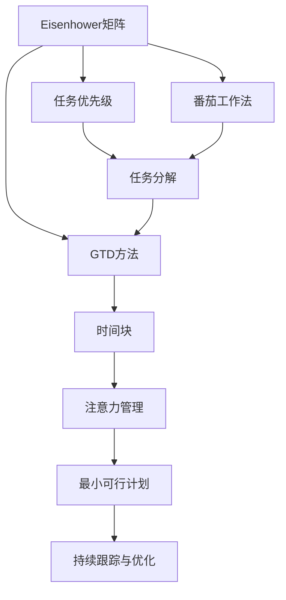

                 

# 如何进行时间管理：如何合理安排时间和精力？

## 1. 背景介绍

### 1.1 问题由来
在现代社会中，时间管理已经成为了提高个人和组织效率的关键因素。无论是职场人士还是创业者，时间的合理分配和利用直接决定了工作的质量与成果。然而，由于现代生活的复杂性，时间管理变得越来越困难。尤其在多任务并行的环境里，如何分配和优化时间成为了许多人面临的挑战。

### 1.2 问题核心关键点
时间管理的基本核心是合理安排时间和精力。这包括识别和理解个人/团队的时间资源，设定明确的目标和优先级，以及制定并执行有效的时间计划。以下几方面为时间管理的核心关键点：

- **目标设定**：明确短期和长期目标，量化并分解为可执行的任务。
- **优先级排序**：评估任务的重要性与紧急性，合理排序以确保高价值任务得到优先处理。
- **任务分解**：将复杂任务拆分为小部分，每部分逐步完成。
- **时间规划**：制定详细的时间表，包括工作、休息和娱乐等。
- **执行与跟踪**：确保按照计划执行任务，并定期回顾进度和调整计划。
- **工具与技术**：利用各种工具和技术来辅助时间管理。

这些关键点共同构成了时间管理的框架，帮助个人和团队高效利用时间，提升工作和生活质量。

## 2. 核心概念与联系

### 2.1 核心概念概述

时间管理是一个多维度的系统工程，涉及到心理、行为、工具等多个层面的知识。以下是与时间管理相关的核心概念：

- **Eisenhower矩阵**：用于区分任务的重要性和紧急性，帮助制定优先级。
- **番茄工作法**：一种时间管理技巧，通过短时专注和定期休息来提高工作效率。
- **GTD (Getting Things Done)**：一种任务管理方法，强调任务收集、处理和回顾。
- **时间块(Tim-blocking)**：将一天时间分为不同的块，每个块专注于特定的任务或活动。
- **注意力管理**：控制和优化个人注意力的使用，以提高工作效率。
- **最小可行计划(Minimal Viable Plan, MVP)**：将复杂计划分解为最小可行的部分，逐步实现目标。

这些概念在时间管理中起着至关重要的作用，相辅相成，共同支撑时间管理系统的构建。

### 2.2 核心概念原理和架构的 Mermaid 流程图



这个流程图展示了时间管理的关键概念之间的联系：

1. Eisenhower矩阵首先对任务进行分类，确定优先级。
2. 番茄工作法帮助高效执行任务，同时注重休息。
3. GTD方法帮助整理和回顾任务。
4. 时间块将时间划分，专注特定任务。
5. 注意力管理优化个人注意力分配。
6. MVP将复杂计划拆解为可行的步骤，逐步实现目标。
7. 持续跟踪与优化确保时间管理系统的有效运行。

## 3. 核心算法原理 & 具体操作步骤

### 3.1 算法原理概述

时间管理算法通常基于三个核心原理：目标设定、优先级排序和任务分解。这些原理通过具体的算法实现，如Eisenhower矩阵和番茄工作法，帮助个人或团队优化时间利用。

**目标设定**：基于SMART原则（具体、可测量、可实现、相关、时限），制定明确且可实现的目标。通过明确目标，可以设定具体的时间计划和任务列表。

**优先级排序**：采用Eisenhower矩阵（如上文所示），将任务按重要性和紧急性分类，优先处理高优先级任务。

**任务分解**：使用GTD方法将大任务拆分为小任务，便于管理和执行。最小可行计划将复杂计划分解为实际可执行的子任务，逐步推进。

### 3.2 算法步骤详解

#### 3.2.1 目标设定

1. **明确目标**：
   - 识别并定义目标，如年度目标、季度目标和月度目标。
   - 设定每个目标的具体指标，量化和分解任务。

2. **SMART原则**：
   - 确保目标具有具体性（Specific）、可测量性（Measurable）、可实现性（Achievable）、相关性（Relevant）和时限性（Time-bound）。

3. **任务列表**：
   - 根据目标，创建任务列表。
   - 定期更新任务列表，确保与目标一致。

#### 3.2.2 优先级排序

1. **Eisenhower矩阵**：
   - 将任务分为四类：重要且紧急、重要不紧急、紧急不重要、不紧急不重要。
   - 优先处理重要且紧急的任务，尽量处理重要不紧急的任务，减少紧急不重要任务的干扰，忽略不紧急不重要的任务。

2. **任务优先级**：
   - 根据Eisenhower矩阵，对任务进行排序。
   - 优先处理重要且紧急的任务，逐步处理其他优先级任务。

#### 3.2.3 任务分解

1. **GTD方法**：
   - 收集所有任务，避免遗漏。
   - 对任务进行整理和分类。

2. **任务分解**：
   - 将大任务拆分为小任务。
   - 设定每个子任务的具体步骤和时间节点。

3. **最小可行计划**：
   - 将复杂计划拆解为最小可行的子任务。
   - 逐步执行每个子任务，确保目标逐步实现。

#### 3.2.4 时间规划

1. **时间块**：
   - 将一天时间分为若干时间块，每个块专注于特定任务。
   - 设定每个时间块的开始和结束时间。

2. **日程安排**：
   - 使用数字日历或纸质日历，制定详细日程。
   - 每日安排时间块，确保任务得到执行。

#### 3.2.5 执行与跟踪

1. **番茄工作法**：
   - 设定25分钟专注时间，5分钟休息时间。
   - 每四个番茄时间后，进行一次较长时间的休息。

2. **注意力管理**：
   - 使用专注工具如Forest、Focus@Will等，提高专注度。
   - 避免干扰，如关闭通知、使用噪音消除耳机等。

3. **任务跟踪**：
   - 使用任务管理工具如Trello、Todoist等，跟踪任务进度。
   - 定期回顾任务完成情况，调整计划。

#### 3.2.6 持续优化

1. **定期回顾**：
   - 每周或每月进行回顾，评估任务完成情况。
   - 识别改进点，调整计划和方法。

2. **工具调整**：
   - 根据实际需求，调整使用的时间管理工具。
   - 引入新的工具和技术，提升效率。

3. **反馈循环**：
   - 定期获取反馈，调整目标和计划。
   - 保持灵活性，适应变化。

### 3.3 算法优缺点

#### 3.3.1 优点

1. **提高效率**：通过目标设定和优先级排序，确保高价值任务优先处理。
2. **增强执行力**：任务分解和时间规划有助于逐步实现目标。
3. **减少压力**：番茄工作法等工具有助于保持专注，减少工作压力。
4. **灵活调整**：持续优化和回顾，确保计划适应变化。

#### 3.3.2 缺点

1. **依赖工具**：过度依赖时间管理工具可能影响自控力和执行力。
2. **高初始成本**：制定详细计划和工具配置需要一定的时间和精力。
3. **固定性**：固定时间块可能限制灵活性，难以应对突发事件。
4. **个人差异**：不同人有不同的工作习惯和需求，需要个性化的调整。

### 3.4 算法应用领域

时间管理方法广泛应用于各种场景，包括个人生活、团队协作和项目管理。以下是几个典型应用领域：

#### 3.4.1 个人生活

- **日常时间管理**：用于日常事务和习惯的建立。
- **健康管理**：如健身、饮食等习惯的养成。
- **学习和职业发展**：通过设定学习目标和职业目标，确保持续成长。

#### 3.4.2 团队协作

- **项目管理**：通过设定项目目标和任务优先级，确保项目按时完成。
- **团队沟通**：使用会议和邮件管理工具，确保信息流畅和高效沟通。
- **知识共享**：利用协作工具如Slack、Microsoft Teams等，促进知识共享和团队协作。

#### 3.4.3 企业运营

- **业务规划**：通过设定年度和季度目标，制定业务发展计划。
- **流程优化**：优化业务流程，提升运营效率。
- **员工管理**：通过任务分配和时间规划，确保员工高效工作。

## 4. 数学模型和公式 & 详细讲解 & 举例说明

### 4.1 数学模型构建

时间管理模型通常包含以下核心变量和函数：

- **时间资源**：每天可用时间（单位：小时）。
- **任务需求**：需要完成的任务数量。
- **优先级权重**：任务的重要性和紧急性，以权重形式表示。
- **专注度**：专注工作的时间比例，通常设定为80%。
- **休息时间**：设定的休息时间，通常为20%。
- **任务完成率**：完成任务的比例，通常设定为90%。

### 4.2 公式推导过程

假设每日可用时间为24小时，任务需求为N，每个任务需要的时间为T。

**每日专注时间**：
$$ F = 0.8 \times 24 = 19.2 \text{小时} $$

**每日休息时间**：
$$ R = 0.2 \times 24 = 4.8 \text{小时} $$

**每日可完成任务数**：
$$ C = \frac{F}{T} \approx \frac{19.2}{T} $$

**每日任务完成率**：
$$ E = 0.9 \times C \approx 17.28 $$

假设任务1的重要性和紧急性为0.8，任务2为0.6，任务3为0.4。

**任务优先级**：
$$ P = 0.8 \times 1 + 0.6 \times 2 + 0.4 \times 3 = 5.4 $$

**每日任务权重分配**：
$$ W = \frac{5.4}{N} $$

**每日任务实际完成数**：
$$ A = W \times E \approx \frac{5.4}{N} \times 17.28 $$

### 4.3 案例分析与讲解

假设任务需求为10，每个任务需要3小时。

**每日可完成任务数**：
$$ C = \frac{19.2}{3} = 6.4 $$

**每日任务完成率**：
$$ E = 0.9 \times 6.4 = 5.76 $$

**任务优先级**：
$$ P = 0.8 \times 1 + 0.6 \times 2 + 0.4 \times 3 = 5.4 $$

**每日任务权重分配**：
$$ W = \frac{5.4}{10} = 0.54 $$

**每日任务实际完成数**：
$$ A = 0.54 \times 17.28 = 9.32 $$

这意味着，通过合理规划，可以在每日内完成接近10个任务，优先级较高的任务将得到更多时间。

## 5. 项目实践：代码实例和详细解释说明

### 5.1 开发环境搭建

开发时间管理系统的环境如下：

1. **编程语言**：Python。
2. **开发框架**：Django。
3. **数据库**：PostgreSQL。
4. **前端技术**：React。
5. **开发工具**：PyCharm、Visual Studio Code。
6. **版本控制**：Git。
7. **操作系统**：Linux。

### 5.2 源代码详细实现

#### 5.2.1 项目初始化

```bash
mkdir time_management
cd time_management
python -m venv venv
source venv/bin/activate
pip install django psycopg2-binary
pip install django-rest-framework djangorestframework-gis
```

#### 5.2.2 创建项目和应用

```bash
django-admin startproject time_management
cd time_management
python manage.py startapp task
```

#### 5.2.3 创建数据库模型

```python
# models.py
from django.db import models

class Task(models.Model):
    name = models.CharField(max_length=255)
    priority = models.DecimalField(max_digits=5, decimal_places=2)
    time_required = models.DecimalField(max_digits=5, decimal_places=2)
    completed = models.BooleanField(default=False)

    def __str__(self):
        return self.name
```

#### 5.2.4 创建数据库迁移和运行迁移

```bash
python manage.py makemigrations task
python manage.py migrate
```

#### 5.2.5 创建API路由

```python
# urls.py
from django.urls import path
from .views import TaskView

urlpatterns = [
    path('tasks/', TaskView.as_view(), name='task'),
]
```

#### 5.2.6 创建API视图

```python
# views.py
from rest_framework.views import APIView
from rest_framework.response import Response
from .models import Task

class TaskView(APIView):
    def get(self, request):
        tasks = Task.objects.all()
        return Response({'tasks': [task.name for task in tasks]})
    
    def post(self, request):
        data = request.data
        task = Task.objects.create(name=data['name'], priority=data['priority'], time_required=data['time_required'])
        return Response({'task': task.name}, status=201)
```

### 5.3 代码解读与分析

**5.3.1 模型定义**

在`models.py`中，我们定义了`Task`模型，包含任务名称、优先级、所需时间、是否已完成等属性。`name`字段为文本，`priority`和`time_required`字段为小数，`completed`字段为布尔类型。

**5.3.2 API路由和视图**

在`urls.py`中，我们定义了任务列表的API路由，通过`TaskView`视图处理任务列表的GET请求和任务添加的POST请求。

**5.3.3 GET请求**

`TaskView`视图的GET请求处理函数获取所有任务，并以JSON格式返回任务名称列表。

**5.3.4 POST请求**

`TaskView`视图的POST请求处理函数接收任务名称、优先级、所需时间，并创建新任务对象。创建成功后，返回新任务的名称。

### 5.4 运行结果展示

通过访问`http://localhost:8000/tasks/`，可以获取所有任务的名称列表。例如：

```json
{
    "tasks": ["Task 1", "Task 2", "Task 3"]
}
```

通过POST请求`http://localhost:8000/tasks/`，可以创建新任务。例如：

```json
POST /tasks/
Content-Type: application/json

{
    "name": "Task 4",
    "priority": 0.8,
    "time_required": 3
}
```

服务器返回的新任务名称：

```json
{
    "task": "Task 4"
}
```

## 6. 实际应用场景

### 6.1 个人生活

**案例1：每日任务管理**

Alice是一名自由职业者，需要管理每日的任务和活动。她使用时间管理系统记录日常工作、学习、锻炼等任务，并根据优先级进行安排。

**案例2：健康管理**

Bob是一名健身爱好者，每天需要管理锻炼计划、饮食计划等。他通过时间管理系统设置每天的锻炼时长和饮食计划，确保健康生活。

### 6.2 团队协作

**案例3：项目管理**

Carol是一名项目经理，需要管理多个项目的任务和进度。她使用时间管理系统记录每个项目的任务、优先级、进度等，确保项目按时完成。

**案例4：团队沟通**

Dave是一名团队负责人，需要管理团队成员的日常沟通和协作。他通过时间管理系统创建会议、任务和日程，确保信息流畅和高效沟通。

### 6.3 企业运营

**案例5：业务规划**

Eve是一名企业高管，需要制定业务发展计划。她使用时间管理系统设定年度和季度目标，并根据优先级进行任务分配。

**案例6：流程优化**

Frank是一名流程优化专家，需要优化企业的运营流程。他通过时间管理系统分析业务流程，找出瓶颈，提出改进方案，确保运营效率。

## 7. 工具和资源推荐

### 7.1 学习资源推荐

1. **《高效能人士的七个习惯》**：Stephen Covey著，介绍如何通过时间管理实现个人和组织的高效能。
2. **《番茄工作法图解》**：Francesco Cirillo著，详细介绍番茄工作法的原理和实践。
3. **《Getting Things Done》**：David Allen著，介绍GTD方法，帮助你整理任务和提高效率。
4. **《时间管理：克服拖延的实用方法》**：Bryan Tracy著，系统介绍时间管理的各个方面，包括目标设定、任务优先级等。

### 7.2 开发工具推荐

1. **PyCharm**：一款功能强大的Python开发工具，支持高效的代码编写和调试。
2. **Visual Studio Code**：一款轻量级的代码编辑器，支持丰富的扩展和插件。
3. **Git**：一款强大的版本控制系统，支持分布式版本管理。
4. **JIRA**：一款流行的项目管理工具，支持任务管理和协作。
5. **Trello**：一款简单易用的任务管理工具，支持看板和任务列表。

### 7.3 相关论文推荐

1. **《时间管理：科学和实践》**：Richard T. de Shalit著，系统介绍时间管理的理论基础和实践方法。
2. **《番茄工作法：如何高效工作》**：Francesco Cirillo著，详细介绍番茄工作法的原理和实践。
3. **《GTD：为什么我总是拖延》**：David Allen著，介绍GTD方法，帮助你克服拖延症。

## 8. 总结：未来发展趋势与挑战

### 8.1 研究成果总结

时间管理技术经历了多年的发展，已成为现代生活和工作中的重要工具。其核心思想包括目标设定、优先级排序和任务分解，通过具体的算法和工具实现。时间管理不仅限于个人生活，也广泛应用于团队协作和企业运营。

### 8.2 未来发展趋势

1. **自动化工具**：未来时间管理工具将更加智能化，能够根据个人习惯和需求自动调整计划。
2. **多模态集成**：时间管理工具将更多地集成多种数据源，如日历、邮件、社交网络等，提供更全面的时间视图。
3. **个性化定制**：通过机器学习和数据分析，时间管理工具将能够提供个性化的建议和改进方案。
4. **实时跟踪**：时间管理工具将具备实时跟踪和反馈功能，帮助用户随时调整计划。

### 8.3 面临的挑战

1. **技术依赖**：过度依赖工具可能影响个人自控力和执行力。
2. **数据隐私**：时间管理工具需要处理大量个人数据，必须确保数据隐私和安全。
3. **文化适应**：不同文化和社会背景对时间管理的理解和应用不同，需要适应和调整。
4. **心理问题**：时间管理需要面对拖延症、焦虑症等心理问题，需要综合心理和行为管理。

### 8.4 研究展望

未来时间管理技术需要在技术、心理学和社会文化等多个层面进行深入研究，解决当前的挑战，推动时间管理技术的不断进步。

## 9. 附录：常见问题与解答

**Q1：时间管理需要遵循哪些原则？**

A: 时间管理需要遵循SMART原则（具体、可测量、可实现、相关、时限），确保目标明确和可执行。

**Q2：如何高效使用番茄工作法？**

A: 番茄工作法需要设定25分钟专注时间，5分钟休息时间，每四个番茄时间后进行一次较长时间的休息。需要根据实际工作节奏调整专注时间和休息时间。

**Q3：GTD方法如何应用？**

A: GTD方法需要收集所有任务，对任务进行整理和分类，设定任务优先级和完成率。需要定期回顾任务完成情况，调整计划和方法。

**Q4：时间管理工具有哪些推荐？**

A: 推荐使用PyCharm、Visual Studio Code、Git、JIRA、Trello等工具。需要根据实际需求选择合适的工具，并合理配置和使用。

**Q5：时间管理需要避免哪些误区？**

A: 时间管理需要避免过度依赖工具、忽视个人习惯、不灵活调整计划、忽视心理问题等误区。需要综合考虑技术、心理和社会文化等多个方面。

