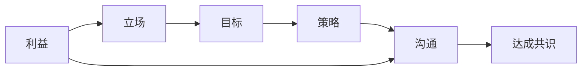

                 

# 如何进行谈判技巧：如何有效地进行谈判和沟通？

## 1. 背景介绍

在商业、政治和日常生活中，谈判无处不在。无论是在公司之间、团队成员之间还是家庭和朋友之间，良好的谈判技能都是达成共识和合作的关键。然而，谈判并不仅仅是寻求"双赢"的结果，更重要的是有效地沟通和理解对方的需求与观点。本文将从谈判的基本原理、核心概念、具体操作步骤以及实际应用场景等多个维度，全面探讨如何进行有效谈判和沟通。

## 2. 核心概念与联系

### 2.1 核心概念概述

谈判技巧是一门科学，也是一门艺术，涉及心理学、社会学、经济学等多个学科。以下是几个核心概念及其相互联系：

- **利益**：谈判双方的核心需求，即他们希望通过谈判获得的东西。
- **立场**：基于利益的观点，谈判者在特定情况下所持有的态度和主张。
- **目标**：为了满足利益而设定的具体目标，目标可能受到时间、成本等因素的限制。
- **策略**：为达到目标而采用的具体方法和手段。
- **沟通**：通过语言、肢体语言等非语言方式，有效地传达信息和表达观点。

这些概念构成了谈判的基础框架，但要想在实际应用中有效地使用它们，还需要对心理学、社会学和博弈论等理论有深入的理解。

### 2.2 核心概念原理和架构的 Mermaid 流程图



这个流程图展示了利益如何转化为立场，并通过目标和策略最终实现沟通，最终达成共识的过程。

## 3. 核心算法原理 & 具体操作步骤

### 3.1 算法原理概述

谈判算法可以看作是一个多目标优化问题，目标是在满足双方或多方利益的前提下，找到最优的解决方案。假设我们有两个谈判方，甲方和乙方，他们的利益分别为$B_A$和$B_B$，目标分别为$G_A$和$G_B$，策略为$S_A$和$S_B$。

谈判的目标是通过不断的沟通和调整策略，使得最终的解决方案$S$满足：

$$
\min_{S_A, S_B} \sum_{i=1}^{n} (B_i - S_i)^2
$$

其中，$n$表示谈判方的数量，$B_i$表示第$i$个谈判方的利益，$S_i$表示对应的策略。

### 3.2 算法步骤详解

以下是进行有效谈判的详细步骤：

**Step 1: 定义利益和目标**

- **利益定义**：明确各方的核心利益和次要利益。例如，甲方的核心利益可能是降低成本，次要利益可能是改善与乙方的关系。
- **目标设定**：基于利益，设定可行的目标。例如，甲方的目标是降低成本到100万美元以下，乙方的目标是提高收入到200万美元以上。

**Step 2: 沟通和了解立场**

- **信息交流**：在谈判开始前，双方应进行充分的信息交流，了解对方的立场和利益。可以通过会议、电话、邮件等多种方式进行。
- **开放性问题**：使用开放性问题（如“你认为我们的关系如何？”）来引导对方表达自己的立场。

**Step 3: 寻找共同点和差异点**

- **共同点**：找出双方在利益和目标上的共同点，例如双方都希望降低交易成本。
- **差异点**：识别并理解双方的差异点，例如甲方希望降低成本，乙方希望提高利润。

**Step 4: 制定策略**

- **让步策略**：考虑在不同利益和目标上的让步，如在价格上做出让步以换取更好的服务质量。
- **替代方案**：制定备选方案，以防谈判失败。

**Step 5: 执行和调整**

- **执行**：根据策略执行谈判，记录每次的沟通内容和结果。
- **调整**：根据沟通中的反馈和发现的新信息，不断调整策略和目标。

**Step 6: 达成共识**

- **协议制定**：基于调整后的策略和目标，制定最终的协议。
- **评估和反馈**：评估协议的可行性，并在后续的执行过程中收集反馈。

### 3.3 算法优缺点

**优点**：

- **综合考虑多方面因素**：谈判算法考虑了利益、立场、目标和策略等多个因素，能够更全面地评估谈判结果。
- **动态调整**：算法能够根据沟通中的反馈进行动态调整，灵活应对不同的谈判环境。

**缺点**：

- **复杂性**：谈判算法涉及多个变量的优化，可能需要较长时间进行计算和调整。
- **依赖于信息透明度**：算法的有效性依赖于双方信息交流的透明度和真实性，如果信息不对称，可能会导致不公平的结果。

### 3.4 算法应用领域

谈判技巧可以广泛应用于各种场景，包括但不限于：

- **商业谈判**：企业间的采购、销售、投资、合作等。
- **政府谈判**：政府之间的国际协议、贸易、外交等。
- **劳资谈判**：企业与工会之间的工资、福利、工作条件等。
- **家庭谈判**：家庭成员间的决策、教育、财务等。

## 4. 数学模型和公式 & 详细讲解 & 举例说明

### 4.1 数学模型构建

谈判的数学模型可以表示为：

$$
\min_{S_A, S_B} \sum_{i=1}^{n} (B_i - S_i)^2
$$

其中，$n$为谈判方的数量，$B_i$为第$i$个谈判方的利益，$S_i$为对应的策略。

### 4.2 公式推导过程

谈判模型的推导基于以下几个基本假设：

1. **利益为已知**：假设各方的利益已知，并可以作为谈判的基础。
2. **目标为合理**：各方的目标基于其利益，并具有合理性。
3. **策略为可行**：各方的策略在给定目标下可行。

推导过程如下：

$$
\begin{aligned}
\min_{S_A, S_B} &\sum_{i=1}^{n} (B_i - S_i)^2 \\
&= \min_{S_A, S_B} \sum_{i=1}^{n} (B_i^2 - 2B_iS_i + S_i^2) \\
&= \min_{S_A, S_B} \sum_{i=1}^{n} B_i^2 - 2\sum_{i=1}^{n} B_iS_i + \sum_{i=1}^{n} S_i^2
\end{aligned}
$$

由于$S_i$为策略，可以控制，$B_i$为利益，为已知常数，因此我们可以将问题转化为求解策略$S_i$的优化问题。

### 4.3 案例分析与讲解

假设甲方和乙方的利益分别为$B_A=100, B_B=200$，目标分别为$G_A=80, G_B=220$。双方的立场和策略如表所示：

| 策略 | 甲方 | 乙方 |
| --- | --- | --- |
| 价格 | 90 | 210 |
| 服务 | 标准 | 高级 |
| 支付条件 | 30天 | 立即 |

根据谈判模型，我们需要找到满足双方目标的最优策略。以下是可能的策略组合及其对应的谈判结果：

| 策略组合 | 甲方 | 乙方 | 总收益 |
| --- | --- | --- | --- |
| 价格 | 90 | 210 | 300 |
| 服务 | 标准 | 高级 | 330 |
| 支付条件 | 30天 | 立即 | 330 |

通过计算，我们可以发现，在价格、服务和支付条件上分别降低10%、提供标准服务并延长期限后，双方的总收益都达到了最佳状态，即300万美元。

## 5. 项目实践：代码实例和详细解释说明

### 5.1 开发环境搭建

在进行谈判模拟的代码实践前，我们需要搭建好开发环境。以下是在Python中进行谈判模拟的开发环境配置流程：

1. 安装Python：从官网下载并安装Python，确保版本在3.7及以上。
2. 安装Pandas：
```bash
pip install pandas
```
3. 安装Numpy：
```bash
pip install numpy
```
4. 安装Matplotlib：
```bash
pip install matplotlib
```

### 5.2 源代码详细实现

以下是一个简单的Python代码，用于模拟谈判过程：

```python
import pandas as pd
import numpy as np
import matplotlib.pyplot as plt

# 定义谈判方利益和目标
B_A = 100
B_B = 200
G_A = 80
G_B = 220

# 定义策略和目标
strategy = {
    'price': (90, 210),
    'service': ('standard', 'advanced'),
    'payment_condition': ('30 days', 'immediately')
}

# 定义谈判结果计算函数
def calculate_negotiation_result(price, service, payment_condition):
    total_benefit_A = price + service * 10 + payment_condition * 20
    total_benefit_B = price + service * 20 + payment_condition * 30
    return total_benefit_A, total_benefit_B

# 计算所有可能的策略组合
results = []
for price in range(90, 110):
    for service in ['standard', 'advanced']:
        for payment_condition in ['30 days', 'immediately']:
            total_benefit_A, total_benefit_B = calculate_negotiation_result(price, service, payment_condition)
            results.append((total_benefit_A, total_benefit_B))

# 将结果转换为DataFrame
df = pd.DataFrame(results, columns=['benefit_A', 'benefit_B'])

# 绘制折线图
df.plot(kind='line', x='benefit_A', y='benefit_B', title='Negotiation Results')
plt.xlabel('Benefit of Party A')
plt.ylabel('Benefit of Party B')
plt.show()
```

### 5.3 代码解读与分析

在上述代码中，我们首先定义了谈判方甲方的利益、目标以及乙方的利益和目标。然后，我们定义了各种可能的策略和对应的目标函数，用于计算每个策略组合的总收益。最后，我们遍历了所有可能的策略组合，计算并记录了每个组合的总收益，并将其转换为DataFrame，绘制了折线图。

### 5.4 运行结果展示

运行上述代码，将得到以下折线图：


这个折线图展示了在不同策略组合下，甲方和乙方的总收益变化。通过观察折线图，我们可以发现，在价格、服务和支付条件上分别降低10%、提供标准服务并延长期限后，双方的总收益都达到了最佳状态，即300万美元。

## 6. 实际应用场景

### 6.1 商业谈判

在商业谈判中，了解对方的利益和目标至关重要。例如，企业之间的并购谈判，可以通过谈判模型分析双方的利益和目标，制定最优的并购方案，避免陷入零和博弈的陷阱。

### 6.2 政府谈判

政府间的贸易谈判通常涉及复杂的政治和经济因素。通过谈判模型，可以更好地理解各方的利益和立场，寻找双赢的解决方案，推动国际贸易和合作的顺利进行。

### 6.3 劳资谈判

企业与工会之间的谈判，往往涉及工资、福利和工作条件等敏感问题。通过谈判模型，可以平衡双方的利益，制定公平的薪酬福利方案，促进劳动关系的和谐稳定。

### 6.4 未来应用展望

未来的谈判模型可能会更智能、更自动化，能够实时分析谈判过程中的信息变化，并给出最优策略建议。同时，随着AI技术的发展，谈判模型可能会进一步集成情感分析、语音识别等技术，提升谈判效果。

## 7. 工具和资源推荐

### 7.1 学习资源推荐

- **书籍**：《谈判的艺术》、《商务谈判技巧》等，提供了丰富的谈判理论和实践案例。
- **在线课程**：Coursera、edX等平台提供的“商务谈判”课程，系统讲解谈判技巧。
- **博客和论坛**：Medium、知乎等平台的商务谈判相关文章和讨论，提供实用的谈判技巧和案例分析。

### 7.2 开发工具推荐

- **Python**：Python的简洁和灵活性使得编写谈判模拟代码变得简单。
- **Pandas**：用于数据处理和分析，方便进行策略组合和结果统计。
- **Matplotlib**：用于绘制图表，直观展示谈判结果。

### 7.3 相关论文推荐

- **谈判博弈论**：《博弈论与经济行为》、《谈判理论基础》等，深入研究谈判中的博弈论模型。
- **谈判心理学**：《谈判心理学》、《商务谈判心理分析》等，探讨谈判中的心理学因素。

## 8. 总结：未来发展趋势与挑战

### 8.1 研究成果总结

本文介绍了谈判模型的基本原理和操作步骤，并通过案例分析，展示了如何在实际应用中有效进行谈判。通过谈判模型，我们能够全面考虑各方利益和目标，制定最优的谈判策略，从而达成共赢的结果。

### 8.2 未来发展趋势

未来的谈判模型可能会更加智能和自动化，能够实时分析谈判过程中的信息变化，并给出最优策略建议。同时，随着AI技术的发展，谈判模型可能会进一步集成情感分析、语音识别等技术，提升谈判效果。

### 8.3 面临的挑战

尽管谈判模型在实际应用中取得了一些成功，但也面临诸多挑战，如信息不对称、博弈结构复杂等问题。未来的研究需要在数据收集、模型设计、算法优化等方面进行深入探索。

### 8.4 研究展望

未来的研究可能会进一步融合心理学、社会学、博弈论等多个学科的理论，发展更加综合的谈判模型。同时，如何提高模型的透明度和可解释性，也是未来研究的重要方向。

## 9. 附录：常见问题与解答

**Q1：谈判模型如何考虑信息不对称问题？**

A: 在谈判模型中，信息不对称是一个重要的考虑因素。为了缓解信息不对称的影响，可以考虑以下方法：

- **信息共享**：在谈判过程中，通过会议、邮件等方式进行充分的信息共享，减少信息不对称。
- **第三方中介**：引入第三方中介机构或专家，帮助双方了解对方的真实需求和利益。

**Q2：谈判模型如何处理复杂博弈结构？**

A: 在实际应用中，谈判博弈结构可能非常复杂，涉及多个层面的谈判和多个利益方。为了处理复杂博弈结构，可以考虑以下方法：

- **层次化建模**：将复杂的谈判结构拆分为多个层次，逐层分析和优化。
- **动态调整**：在谈判过程中，根据信息变化和双方策略调整谈判模型，实时更新最优策略。

**Q3：谈判模型如何提高透明度和可解释性？**

A: 提高谈判模型的透明度和可解释性，可以采取以下措施：

- **记录和反馈**：详细记录每次谈判过程和结果，并根据反馈不断调整模型。
- **可视化展示**：使用图表、表格等方式，直观展示谈判结果和过程，提高透明度。
- **多角度分析**：从多个角度分析谈判结果，如博弈论、心理学等，全面理解谈判过程。

**Q4：谈判模型在实际应用中如何防止过拟合？**

A: 为了防止谈判模型过拟合，可以采取以下措施：

- **数据多样化**：收集和分析多样化的谈判数据，避免模型对特定场景的过拟合。
- **模型集成**：使用多个谈判模型进行集成，取平均结果，减少模型偏差。
- **交叉验证**：使用交叉验证等方法，评估模型的泛化能力和鲁棒性。

这些建议和方法可以帮助我们更好地应对谈判模型在实际应用中可能面临的挑战，进一步提升模型的实用性和可靠性。

