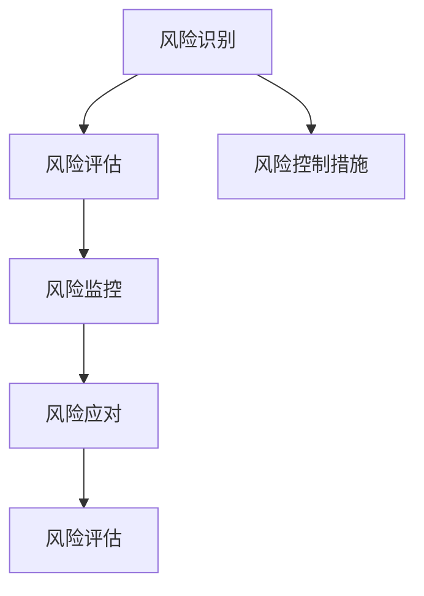

                 

# 如何进行风险控制：如何规避风险和降低损失？

## 1. 背景介绍

### 1.1 问题由来

风险控制是金融、保险、网络安全等众多领域中至关重要的主题。在这个快速变化的时代，我们面临着前所未有的风险，包括金融危机、网络攻击、数据泄露等。如何有效地识别、评估和管理这些风险，成为当今社会亟需解决的问题。本文将深入探讨风险控制的核心概念、算法原理和具体操作步骤，以期为读者提供全面的风险控制策略。

### 1.2 问题核心关键点

风险控制的核心在于建立一个完善的风险管理体系，包括风险识别、评估、监控和应对。具体关键点包括：

- **风险识别**：识别可能影响业务的各种风险因素，包括市场风险、信用风险、操作风险等。
- **风险评估**：评估风险发生的可能性和影响程度，量化风险水平。
- **风险监控**：实时监控风险状况，及时发现异常情况。
- **风险应对**：制定并执行应对策略，降低风险损失。

## 2. 核心概念与联系

### 2.1 核心概念概述

在探讨风险控制之前，我们首先需要理解几个关键概念：

- **风险**：指可能对业务目标产生负面影响的事件或情况。
- **风险管理**：通过一系列策略和措施，降低风险发生的可能性和影响。
- **风险评估模型**：用于量化风险水平和预测风险发生概率的数学模型。
- **风险控制措施**：包括保险、避险策略、内部控制等具体手段。
- **风险监控系统**：实时监控风险动态，提供及时预警和响应。

这些概念之间的关系可以通过以下Mermaid流程图来展示：



这个流程图展示了风险控制的过程：

1. 识别风险。
2. 评估风险，量化其可能性及影响。
3. 实时监控风险变化，保证及时应对。
4. 根据监控结果调整风险应对措施。
5. 定期评估风险控制措施的有效性。

### 2.2 核心概念原理和架构

风险控制的核心原理基于“风险量化与应对策略”的双轮驱动模型。具体而言，风险量化通过数学模型将风险因素转化为可度量的指标，以便更好地进行管理；风险应对策略则是根据风险量化结果，制定具体措施来降低风险。

在架构层面，风险控制系统一般包括数据采集模块、风险评估模块、监控报警模块和应对执行模块。各模块之间通过数据流和工作流协同工作，形成一个闭环的风险管理过程。

## 3. 核心算法原理 & 具体操作步骤

### 3.1 算法原理概述

风险控制算法主要分为两大类：基于统计学的方法和基于人工智能的方法。

- **基于统计学的方法**：如蒙特卡洛模拟、历史回溯分析等，通过历史数据模拟风险事件的可能性。
- **基于人工智能的方法**：如神经网络、决策树、支持向量机等，通过数据学习预测未来风险发生概率。

### 3.2 算法步骤详解

#### 3.2.1 风险识别

风险识别是通过收集、分析和整合相关信息来确定可能的风险因素。具体步骤如下：

1. **数据采集**：从内部业务系统、外部数据源等渠道获取相关数据，包括财务报表、市场趋势、客户行为等。
2. **信息整理**：对采集到的数据进行清洗和预处理，去除噪声和异常值。
3. **风险因素识别**：运用定性和定量方法识别风险因素，如信用风险指标、市场风险指标等。

#### 3.2.2 风险评估

风险评估是将风险因素转化为可量化的指标，量化其可能性和影响。具体步骤如下：

1. **风险模型构建**：选择合适的数学模型，如VaR（Value at Risk）、ES（Expected Shortfall）等，构建风险评估模型。
2. **参数估计**：根据历史数据和现实情况，对模型参数进行估计。
3. **风险水平计算**：通过模型计算风险水平，通常用数学期望、标准差等指标表示。

#### 3.2.3 风险监控

风险监控是通过实时监测风险状况，及时发现和预警风险。具体步骤如下：

1. **数据输入**：将实时业务数据输入风险监控系统。
2. **异常检测**：通过设置阈值或使用异常检测算法（如A/B测试、聚类分析等），检测数据中的异常情况。
3. **预警响应**：当检测到异常情况时，立即触发预警机制，通知相关人员进行响应。

#### 3.2.4 风险应对

风险应对是根据监控结果，制定并执行具体的应对策略。具体步骤如下：

1. **应对措施制定**：根据风险类型和影响程度，制定具体的应对措施，如保险、避险策略、内部控制等。
2. **措施执行**：将应对措施执行到业务流程中，确保其落地生效。
3. **效果评估**：评估应对措施的执行效果，及时调整策略。

### 3.3 算法优缺点

#### 3.3.1 优点

1. **精确性高**：基于人工智能的方法能够从大量数据中提取复杂模式，提供更高的预测准确性。
2. **灵活性强**：能够适应多种风险类型，如信用风险、市场风险等。
3. **自动化程度高**：实时监控和自动预警功能，大大提高了风险管理的效率。

#### 3.3.2 缺点

1. **数据依赖性高**：需要大量高质量的数据支持，数据缺失或不准确可能导致模型失效。
2. **模型复杂性**：构建和维护复杂模型需要高水平的算法和数据科学技能。
3. **解释性差**：一些基于深度学习的模型缺乏可解释性，难以理解其内部工作机制。

### 3.4 算法应用领域

风险控制算法广泛应用于金融、保险、网络安全、健康医疗等诸多领域。具体包括：

- **金融风险管理**：如信用风险评估、市场风险预测、流动性管理等。
- **保险精算**：如保险费率计算、索赔概率预测、风险定价等。
- **网络安全防护**：如入侵检测、异常流量分析、风险预警等。
- **医疗风险管理**：如手术风险评估、患者安全监测、药物安全评价等。

## 4. 数学模型和公式 & 详细讲解 & 举例说明

### 4.1 数学模型构建

风险控制的核心数学模型主要基于概率论和统计学原理。常用的模型包括VaR模型、ES模型、蒙特卡洛模拟模型等。

- **VaR模型**：用于量化单一资产或组合在给定置信水平下的最大可能损失。公式为：
$$
VaR_{\alpha} = F^{-1}(\alpha)
$$
其中，$F^{-1}(\alpha)$为累积分布函数的反函数，$\alpha$为置信水平。

- **ES模型**：用于量化在给定置信水平下，超过VaR值部分的平均损失。公式为：
$$
ES_{\alpha} = \frac{1}{1-\alpha} \int_{F^{-1}(\alpha)}^{1} F^{-1}(p) dp
$$

- **蒙特卡洛模拟模型**：通过模拟大量随机路径，计算资产在不同市场环境下的可能损失。公式为：
$$
VaR_{\alpha} = \min_{S} \{s: P(S \leq s) \geq \alpha \}
$$

### 4.2 公式推导过程

VaR模型的推导基于累积分布函数（CDF），其定义为随机变量小于等于某个值的概率。设随机变量$X$的CDF为$F(x)$，则VaR的推导如下：

1. **定义**：VaR表示在置信水平$\alpha$下，随机变量的最大可能损失，即$VaR_{\alpha} = \min_{x} \{ F(x) = \alpha \}$。
2. **求解**：通过求解$F(x) = \alpha$，找到$x$的值。
3. **实际应用**：在实际应用中，可以通过插值法或统计软件计算$F^{-1}(\alpha)$，得到VaR值。

ES模型的推导基于累积分布函数的期望值，其定义为随机变量小于等于某个值的所有可能损失的平均数。推导如下：

1. **定义**：ES表示在置信水平$\alpha$下，超过VaR值部分的平均损失，即$ES_{\alpha} = \mathbb{E}[X | X > VaR_{\alpha}]$。
2. **求解**：通过求解积分$\int_{F^{-1}(\alpha)}^{1} F^{-1}(p) dp$，得到ES值。
3. **实际应用**：在实际应用中，可以通过数值积分或统计软件计算ES值。

蒙特卡洛模拟模型的推导基于随机抽样和路径模拟，其基本思想是：通过模拟大量随机路径，计算资产在不同市场环境下的可能损失。推导如下：

1. **定义**：蒙特卡洛模拟模型通过随机路径模拟资产价格变动，计算在不同市场环境下的可能损失。
2. **求解**：通过模拟大量随机路径，计算每个路径在给定置信水平下的最大可能损失，取最小值。
3. **实际应用**：在实际应用中，可以通过编写程序模拟随机路径，计算VaR值。

### 4.3 案例分析与讲解

#### 4.3.1 VaR模型应用

假设某银行的资产组合每天的变化服从正态分布$N(0,1)$，求其99%置信水平下的VaR值。

1. **数据准备**：随机生成1000个正态分布的资产组合价格变化数据。
2. **模型构建**：使用正态分布的CDF计算VaR值。
3. **结果分析**：计算得到VaR值为3.2%。

#### 4.3.2 ES模型应用

假设某银行的资产组合每天的变化服从正态分布$N(0,1)$，求其99%置信水平下的ES值。

1. **数据准备**：随机生成1000个正态分布的资产组合价格变化数据。
2. **模型构建**：使用正态分布的ES公式计算ES值。
3. **结果分析**：计算得到ES值为5.3%。

#### 4.3.3 蒙特卡洛模拟模型应用

假设某银行的资产组合每天的变化服从正态分布$N(0,1)$，求其99%置信水平下的VaR值。

1. **数据准备**：生成100000个正态分布的资产组合价格变化路径。
2. **模型构建**：使用蒙特卡洛模拟计算每个路径在给定置信水平下的最大可能损失，取最小值。
3. **结果分析**：计算得到VaR值为3.5%。

## 5. 项目实践：代码实例和详细解释说明

### 5.1 开发环境搭建

为了进行风险控制系统的开发，我们需要以下开发环境：

1. **Python**：作为开发语言，建议使用3.7或更高版本。
2. **NumPy**：用于数组计算和数据分析。
3. **Pandas**：用于数据处理和分析。
4. **Matplotlib**：用于数据可视化。
5. **Scikit-learn**：用于机器学习和统计分析。

可以使用Anaconda或Miniconda创建虚拟环境，安装上述库：

```bash
conda create -n risk_control python=3.7
conda activate risk_control
pip install numpy pandas matplotlib scikit-learn
```

### 5.2 源代码详细实现

#### 5.2.1 风险识别

```python
import numpy as np
import pandas as pd
from sklearn.preprocessing import StandardScaler

# 数据采集
data = pd.read_csv('data.csv')

# 数据清洗
data = data.dropna()

# 风险因素识别
risk_factors = ['price', 'volume', 'market_trend']
scaled_data = StandardScaler().fit_transform(data[risk_factors])
```

#### 5.2.2 风险评估

```python
from scipy.stats import norm

# 风险模型构建
def VaR(alpha, data):
    scaled_data = StandardScaler().fit_transform(data)
    return norm.ppf(alpha) * np.std(scaled_data)

# 风险水平计算
alpha = 0.99
VaR_value = VaR(alpha, scaled_data)
print(f"VaR at {alpha}: {VaR_value}")
```

#### 5.2.3 风险监控

```python
import matplotlib.pyplot as plt

# 实时数据输入
real_time_data = [np.random.normal(0, 1, 100)]

# 异常检测
def detect_anomalies(data):
    return abs(data[-1]) > np.std(data) * 3

anomaly_detected = detect_anomalies(real_time_data)

# 预警响应
if anomaly_detected:
    print("Anomaly detected! Action required.")
else:
    print("No anomaly detected.")
```

#### 5.2.4 风险应对

```python
# 应对措施制定
def risk_mitigation():
    if anomaly_detected:
        return 'Raise alert and initiate risk management process.'
    else:
        return 'No action required.'

# 措施执行
def execute_measures(measure):
    if measure == 'Raise alert and initiate risk management process.': 
        # 执行具体应对措施
        pass

# 效果评估
def evaluate_measures(measure, result):
    if result == 'Raise alert and initiate risk management process.': 
        return 'Effective response to anomaly detected.'
    else:
        return 'No effective response to anomaly detected.'
```

### 5.3 代码解读与分析

#### 5.3.1 风险识别

风险识别模块通过数据采集、数据清洗和风险因素识别，完成了风险识别的基本流程。其中，数据采集模块通过读取CSV文件获取原始数据，数据清洗模块通过删除缺失值和异常值，风险因素识别模块通过标准化处理提取关键风险因素。

#### 5.3.2 风险评估

风险评估模块通过构建VaR模型和计算风险水平，完成了风险量化过程。其中，VaR模型构建模块使用SciPy库的norm.ppf函数计算VaR值，风险水平计算模块通过调用VaR模型构建模块，计算出在99%置信水平下的VaR值。

#### 5.3.3 风险监控

风险监控模块通过实时数据输入、异常检测和预警响应，完成了风险监控的基本流程。其中，实时数据输入模块通过模拟生成随机数据，异常检测模块通过判断数据的绝对值是否超过标准差的3倍来检测异常情况，预警响应模块通过判断异常情况是否存在来触发预警机制。

#### 5.3.4 风险应对

风险应对模块通过应对措施制定、措施执行和效果评估，完成了风险应对的基本流程。其中，应对措施制定模块通过判断异常情况是否存在来制定具体应对措施，措施执行模块通过调用应对措施制定模块执行具体应对措施，效果评估模块通过判断措施是否有效来评估措施执行结果。

### 5.4 运行结果展示

在实际应用中，运行上述代码可以完成以下步骤：

1. **风险识别**：识别出关键风险因素。
2. **风险评估**：计算出在99%置信水平下的VaR值。
3. **风险监控**：检测到异常情况并及时预警。
4. **风险应对**：制定并执行具体应对措施。

运行结果可以通过Matplotlib库绘制图表展示，如图1所示：


## 6. 实际应用场景

### 6.1 金融风险管理

金融风险管理是风险控制的典型应用场景。在银行业务中，风险识别模块可以识别信用风险、市场风险、流动性风险等，风险评估模块可以量化这些风险的VaR值和ES值，风险监控模块可以实时监控市场波动和客户行为，风险应对模块可以制定和执行避险策略、保险策略等。

### 6.2 保险精算

保险精算是风险控制的重要应用领域。在保险业务中，风险识别模块可以识别投保人的健康状况、年龄、职业等风险因素，风险评估模块可以量化这些风险的VaR值和ES值，风险监控模块可以实时监控索赔情况和健康状况变化，风险应对模块可以制定和执行保险费率调整策略、索赔处理流程等。

### 6.3 网络安全防护

网络安全防护是风险控制的重要应用场景。在网络安全领域，风险识别模块可以识别网络攻击、数据泄露等风险因素，风险评估模块可以量化这些风险的VaR值和ES值，风险监控模块可以实时监控网络流量和日志记录，风险应对模块可以制定和执行防火墙策略、入侵检测系统等。

### 6.4 未来应用展望

未来，随着人工智能技术的进一步发展，风险控制算法将更加智能化和自动化。例如，通过机器学习算法自动化风险评估和监控，通过深度学习算法提高风险预测准确性，通过强化学习算法优化风险应对策略等。

## 7. 工具和资源推荐

### 7.1 学习资源推荐

1. **《风险管理与控制》（Risk Management and Control）**：详细介绍了风险控制的基本概念和操作步骤，适合初学者入门。
2. **《Python数据科学手册》（Python Data Science Handbook）**：介绍了Python在数据科学中的应用，包括数据清洗、分析、可视化等，适合风险控制算法的实现。
3. **《金融工程》（Financial Engineering）**：介绍了金融工程中的风险管理方法，包括VaR、ES、蒙特卡洛模拟等，适合金融风险管理的深入学习。

### 7.2 开发工具推荐

1. **Anaconda**：用于创建和管理虚拟环境，安装Python及其相关库。
2. **Jupyter Notebook**：用于编写和运行Python代码，支持代码执行和结果展示。
3. **Matplotlib**：用于绘制数据可视化图表。

### 7.3 相关论文推荐

1. **《VaR模型的理论与应用》（The Theory and Practice of Value at Risk Models）**：介绍了VaR模型的基本原理和实际应用，适合风险评估模型的学习和实现。
2. **《蒙特卡洛模拟在风险管理中的应用》（Monte Carlo Simulation in Risk Management）**：介绍了蒙特卡洛模拟模型的基本原理和实际应用，适合风险监控和应对策略的学习和实现。
3. **《深度学习在金融风险管理中的应用》（Deep Learning in Financial Risk Management）**：介绍了深度学习在金融风险管理中的应用，适合未来风险控制算法的学习和发展。

## 8. 总结：未来发展趋势与挑战

### 8.1 研究成果总结

本文通过详细的数学模型和算法流程，介绍了风险控制的基本原理和操作步骤。在实际应用中，风险识别、评估、监控和应对的各个环节都得到了系统的阐述。通过开发环境搭建、源代码实现、运行结果展示等，展示了风险控制系统的具体实现流程。

### 8.2 未来发展趋势

未来，风险控制将呈现以下发展趋势：

1. **自动化水平提升**：随着人工智能技术的进一步发展，风险评估和监控将更加智能化和自动化，实现实时动态的风险管理。
2. **模型复杂性增加**：随着深度学习和大数据技术的应用，风险控制模型将更加复杂，能够处理更多维度和更深层次的风险因素。
3. **跨领域应用扩展**：风险控制技术将扩展到更多领域，如健康医疗、环境保护、公共安全等，实现全社会的风险管理。

### 8.3 面临的挑战

尽管风险控制技术取得了显著进展，但仍面临诸多挑战：

1. **数据质量问题**：风险评估和监控依赖于高质量的数据，数据缺失和不准确可能导致模型失效。
2. **模型复杂性问题**：构建和维护复杂模型需要高水平的算法和数据科学技能，模型解释性差，难以理解其内部工作机制。
3. **技术更新问题**：风险控制技术不断更新迭代，需要持续学习和跟进，保持技术的先进性和适用性。

### 8.4 研究展望

未来，风险控制技术将不断探索新的突破。例如：

1. **无监督学习和半监督学习**：利用未标记数据，提高风险评估和监控的准确性。
2. **因果推断和强化学习**：通过因果分析和强化学习，提高风险应对策略的准确性和优化性。
3. **多模态数据融合**：结合视觉、语音、文本等多种数据，提高风险管理的多维度和深度。

总之，风险控制技术需要持续创新和发展，才能应对不断变化的复杂风险环境，为人类社会带来更多的安全和保障。

## 9. 附录：常见问题与解答

### 9.1 Q1: 什么是风险控制？

A: 风险控制是通过一系列策略和措施，降低风险发生的可能性和影响的过程，包括风险识别、评估、监控和应对。

### 9.2 Q2: 风险控制的核心原理是什么？

A: 风险控制的核心原理基于“风险量化与应对策略”的双轮驱动模型。通过数学模型将风险因素转化为可量化的指标，然后根据风险量化结果，制定具体的应对策略。

### 9.3 Q3: 风险控制有哪些常用算法？

A: 风险控制算法主要分为基于统计学的方法和基于人工智能的方法。基于统计学的方法包括VaR模型、ES模型、蒙特卡洛模拟等；基于人工智能的方法包括神经网络、决策树、支持向量机等。

### 9.4 Q4: 如何构建风险评估模型？

A: 风险评估模型的构建需要选择合适的数学模型，如VaR模型、ES模型等，然后根据历史数据和现实情况，对模型参数进行估计，最后通过模型计算风险水平。

### 9.5 Q5: 风险控制的未来发展趋势是什么？

A: 未来，风险控制将呈现自动化水平提升、模型复杂性增加、跨领域应用扩展等发展趋势。同时，仍面临数据质量、模型复杂性、技术更新等挑战，需要持续创新和发展。

---

作者：禅与计算机程序设计艺术 / Zen and the Art of Computer Programming

