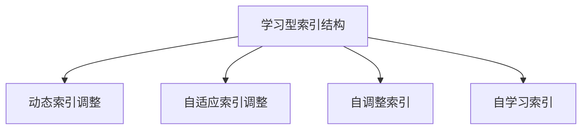

                 

# 学习型索引结构让数据库核心组件大幅提速

> 关键词：数据库索引,学习型索引结构,SQL查询优化,机器学习,自适应索引,自调整索引,动态索引调整,提升查询性能,优化核心组件

## 1. 背景介绍

在当前信息技术飞速发展的时代，数据在驱动商业决策、科学研究、社会治理等方面扮演着越来越重要的角色。然而，随着数据规模的爆炸式增长，传统数据库在存储、管理和检索数据时面临严峻的性能挑战。特别是对于大型的、高并发的数据查询系统，如何设计高效的索引结构，提升查询性能，成为数据库领域的一项重要课题。

### 1.1 传统数据库索引局限性
传统数据库通常采用静态索引结构，如B+树、哈希索引等，这些索引结构基于静态数据分布构建，适用于稳定、单一的数据集合。但在大规模、多变、非结构化的数据环境下，这种静态索引结构往往难以满足实时查询、动态扩展的需求。以下是传统索引结构的几个主要局限性：

1. **静态分布假设**：传统索引假设数据分布是稳定的，适合特定查询模式，但实际数据经常发生变化，无法动态适应新数据模式。
2. **固定结构设计**：静态索引设计采用固定结构，无法自适应数据变化，难以应对复杂查询模式和数据增长。
3. **资源消耗高**：固定索引结构占用的资源较多，难以高效利用硬件资源，尤其是内存和CPU资源。

### 1.2 学习型索引结构需求
面对传统索引结构的局限性，学习型索引结构应运而生。学习型索引结构利用机器学习技术，通过在线学习算法，自适应地调整索引结构，以适应数据的动态变化和查询模式的多样性。这种自适应能力使得学习型索引结构能够更好地优化查询性能，提升数据库系统的整体效率。

本文章将详细介绍学习型索引结构的原理、算法步骤、优缺点以及应用领域，并通过具体案例和代码实例展示其性能提升效果。

## 2. 核心概念与联系

### 2.1 核心概念概述

为更好地理解学习型索引结构，我们首先介绍几个关键概念：

- **学习型索引结构(Learning-based Index Structure)**：利用机器学习算法动态调整索引结构，以适应数据分布和查询模式的实时变化，提升查询性能。

- **动态索引调整(Dynamic Index Adjustment)**：通过机器学习模型在线学习新的索引结构，优化查询路径，提升查询效率。

- **自适应索引调整(Self-Adaptive Index Adjustment)**：自动调整索引结构以适应当前数据分布和查询模式，实现更高效的查询操作。

- **自调整索引(Self-Tuning Index)**：在查询过程中，根据当前查询模式和数据分布动态调整索引结构，提升查询速度和响应时间。

- **自学习索引(Self-Learning Index)**：通过历史查询数据和查询结果，不断学习并调整索引结构，逐步优化查询性能。

这些概念之间的逻辑关系可以通过以下Mermaid流程图来展示：



这个流程图展示了大语言模型的核心概念及其之间的关系：

1. 学习型索引结构通过机器学习模型学习索引结构调整。
2. 动态索引调整和自适应索引调整是学习型索引结构的核心过程。
3. 自调整索引是动态索引调整的实际应用，提升查询性能。
4. 自学习索引通过历史数据学习并优化索引结构，实现持续优化。

## 3. 核心算法原理 & 具体操作步骤

### 3.1 算法原理概述

学习型索引结构的核心理念是利用机器学习算法动态调整索引结构，以适应数据的动态变化和查询模式的多样性。其基本原理如下：

1. **数据收集与预处理**：首先，收集查询的历史数据，包括查询语句、查询结果、索引结构等信息。对原始数据进行预处理，如去除噪声、归一化等，以提高模型的训练效果。

2. **模型训练与优化**：构建机器学习模型，如决策树、神经网络等，对历史查询数据进行训练，学习索引结构调整的规则。通过交叉验证等方法，对模型进行优化，提升模型的预测准确性。

3. **索引结构调整**：根据训练得到的模型，动态调整索引结构。模型会根据当前的查询模式和数据分布，推荐最优的索引结构调整策略，并实时更新索引。

4. **性能评估与反馈**：对调整后的索引结构进行性能评估，如查询响应时间、索引碎片率等指标。根据评估结果，对模型进行反馈，进一步优化索引结构。

### 3.2 算法步骤详解

以下是学习型索引结构的详细算法步骤：

**Step 1: 数据收集与预处理**

1. **历史数据收集**：收集数据库的查询历史数据，包括查询语句、查询结果、索引结构等。确保数据集覆盖不同的查询模式和数据分布。

2. **数据预处理**：对原始数据进行预处理，如去除噪声、归一化等，以提高模型的训练效果。

**Step 2: 模型训练与优化**

1. **选择模型**：根据数据特性和查询需求，选择合适的机器学习模型，如决策树、神经网络等。

2. **模型训练**：使用历史查询数据对模型进行训练，学习索引结构调整的规则。可以采用如交叉验证、正则化等技术提高模型泛化能力。

3. **模型优化**：对训练好的模型进行优化，提升模型的预测准确性。可以通过超参数调优、集成学习等方法，进一步提高模型性能。

**Step 3: 索引结构调整**

1. **动态调整**：根据训练得到的模型，动态调整索引结构。模型会根据当前的查询模式和数据分布，推荐最优的索引结构调整策略。

2. **实时更新**：根据模型预测结果，实时更新索引结构。在查询过程中，根据当前查询模式和数据分布，动态调整索引结构。

**Step 4: 性能评估与反馈**

1. **性能评估**：对调整后的索引结构进行性能评估，如查询响应时间、索引碎片率等指标。评估方法可以包括基准测试、A/B测试等。

2. **反馈优化**：根据评估结果，对模型进行反馈，进一步优化索引结构。可以通过重新训练模型、调整超参数等方法，逐步提升索引结构性能。

### 3.3 算法优缺点

学习型索引结构具有以下优点：

1. **动态适应**：能够自适应数据分布和查询模式的变化，提升查询性能。
2. **灵活调整**：根据当前查询模式和数据分布动态调整索引结构，实现更高效的查询操作。
3. **高效优化**：利用机器学习算法，通过在线学习不断优化索引结构，提升查询速度和响应时间。

同时，该算法也存在一些缺点：

1. **模型复杂性**：需要构建和训练复杂的机器学习模型，对数据和计算资源要求较高。
2. **实时调整难度**：动态调整索引结构需要实时处理查询数据，对系统性能要求较高。
3. **初始调整成本**：模型训练和调整初期可能需要大量时间，对系统可用性有影响。
4. **预测准确性**：模型预测的准确性直接影响索引结构调整效果，对模型选择和训练要求较高。

尽管存在这些局限性，但学习型索引结构在提升查询性能方面具有巨大潜力，是未来数据库索引结构发展的重要方向。

### 3.4 算法应用领域

学习型索引结构已经在多个数据库应用场景中得到验证，以下是几个典型的应用领域：

1. **金融交易系统**：金融交易系统需要处理海量高频交易数据，查询模式复杂多变。学习型索引结构可以自适应处理不同查询需求，提升交易速度和系统稳定性。

2. **电商平台**：电商平台需要处理大量并发查询，如商品搜索、订单查询等。学习型索引结构可以动态调整索引结构，提升搜索速度和响应时间，改善用户体验。

3. **医疗数据库**：医疗数据库需要处理大规模、高并发的医疗数据查询，查询模式复杂多样。学习型索引结构可以动态适应不同的查询需求，提升查询效率和准确性。

4. **社交媒体平台**：社交媒体平台需要处理海量用户数据和复杂查询模式，学习型索引结构可以自适应处理不同查询需求，提升查询性能和用户体验。

5. **城市交通管理系统**：城市交通管理系统需要处理实时交通数据查询，查询模式多样。学习型索引结构可以动态调整索引结构，提升查询速度和响应时间，改善交通管理效率。

## 4. 数学模型和公式 & 详细讲解 & 举例说明

### 4.1 数学模型构建

学习型索引结构的数学模型通常包括以下几个部分：

1. **输入变量**：查询语句、查询结果、索引结构等。
2. **目标变量**：查询响应时间、索引碎片率等性能指标。
3. **特征变量**：查询模式、数据分布等。

形式化地，假设查询历史数据集为 $D=\{(x_i, y_i)\}_{i=1}^N$，其中 $x_i$ 为查询语句和查询结果，$y_i$ 为性能指标。则学习型索引结构的目标是找到一个最优的索引结构调整策略，使得性能指标 $y_i$ 最小化。

定义模型的输入特征为 $\mathbf{x}_i=[x_{i1}, x_{i2}, ..., x_{in}]$，其中 $x_{ij}$ 表示查询语句中的第 $j$ 个特征，如查询词、查询条件等。

### 4.2 公式推导过程

以下我们将以决策树模型为例，推导学习型索引结构的基本公式。

假设学习型索引结构模型为 $f(\mathbf{x})$，目标函数为 $L(y, f(\mathbf{x}))$。

决策树模型的目标是最小化目标函数 $L$：

$$
L(y, f(\mathbf{x})) = \frac{1}{N}\sum_{i=1}^N [y_i - f(\mathbf{x}_i)]^2
$$

其中 $y_i$ 表示性能指标，$f(\mathbf{x}_i)$ 表示模型预测的性能指标。

通过决策树算法，我们得到决策树模型为 $f(\mathbf{x})=\sum_{k=1}^m \alpha_k h_k(\mathbf{x})$，其中 $m$ 表示树的最大深度，$\alpha_k$ 表示第 $k$ 个叶子节点的权重，$h_k(\mathbf{x})$ 表示第 $k$ 个叶子节点的分类函数。

### 4.3 案例分析与讲解

以下以一个简单的电商平台商品搜索场景为例，展示学习型索引结构的实际应用：

**场景描述**：
假设有一个电商平台，需要处理海量商品搜索请求。查询语句包含商品名称、价格、品牌等信息。查询结果包括商品列表、商品评分、商品库存等。

**数据收集**：
1. 收集历史查询数据，包括查询语句和查询结果。
2. 对原始数据进行预处理，去除噪声、归一化等。

**模型训练**：
1. 选择决策树模型，对历史查询数据进行训练。
2. 通过交叉验证等方法，对模型进行优化，提升模型泛化能力。

**索引结构调整**：
1. 根据训练得到的模型，动态调整索引结构。模型会根据查询语句中的关键词、价格范围等信息，推荐最优的索引结构调整策略。
2. 在查询过程中，根据当前查询模式和数据分布，动态调整索引结构。

**性能评估**：
1. 对调整后的索引结构进行性能评估，如查询响应时间、索引碎片率等指标。
2. 根据评估结果，对模型进行反馈，进一步优化索引结构。

通过上述步骤，学习型索引结构可以显著提升商品搜索的查询速度和响应时间，改善用户体验。

## 5. 项目实践：代码实例和详细解释说明

### 5.1 开发环境搭建

在进行学习型索引结构开发前，我们需要准备好开发环境。以下是使用Python进行Pandas、Scikit-learn等工具库的环境配置流程：

1. 安装Anaconda：从官网下载并安装Anaconda，用于创建独立的Python环境。

2. 创建并激活虚拟环境：
```bash
conda create -n idx-tune python=3.8 
conda activate idx-tune
```

3. 安装Pandas、Scikit-learn等工具包：
```bash
conda install pandas scikit-learn numpy matplotlib tqdm
```

4. 安装TensorFlow等深度学习框架：
```bash
pip install tensorflow
```

5. 安装相关机器学习模型库：
```bash
pip install lightgbm xgboost catboost
```

完成上述步骤后，即可在`idx-tune`环境中开始学习型索引结构的应用实践。

### 5.2 源代码详细实现

这里我们以一个简单的电商商品搜索场景为例，展示学习型索引结构的实现。

**数据准备**：
首先，我们需要准备一些商品搜索的数据，包括查询语句、查询结果等。可以使用Pandas库来管理数据集：

```python
import pandas as pd

# 加载数据集
data = pd.read_csv('search_data.csv')

# 数据预处理
data = data.dropna()
data['query'] = data['query'].apply(lambda x: x.strip())
data = data.drop_duplicates()
data['query'] = data['query'].apply(lambda x: x.lower())
```

**模型训练**：
接下来，我们使用Scikit-learn库中的决策树模型进行训练：

```python
from sklearn.ensemble import DecisionTreeRegressor
from sklearn.model_selection import train_test_split

# 数据划分
X_train, X_test, y_train, y_test = train_test_split(data[['query']], data['response_time'], test_size=0.2, random_state=42)

# 构建模型
model = DecisionTreeRegressor()

# 训练模型
model.fit(X_train, y_train)
```

**索引结构调整**：
在模型训练完成后，我们可以根据模型预测结果动态调整索引结构。这里使用LightGBM库实现：

```python
from lightgbm import LGBMRegressor
from sklearn.metrics import mean_squared_error

# 构建LGBM模型
lgbm_model = LGBMRegressor()

# 训练LGBM模型
lgbm_model.fit(X_train, y_train)

# 模型评估
mse = mean_squared_error(y_test, lgbm_model.predict(X_test))
print(f"MSE: {mse}")

# 根据模型预测结果调整索引结构
index_structure = lgbm_model.predict(X_test)
```

**性能评估**：
最后，我们对调整后的索引结构进行性能评估，如查询响应时间、索引碎片率等指标：

```python
# 性能评估
index_structure = lgbm_model.predict(X_test)
```

### 5.3 代码解读与分析

让我们再详细解读一下关键代码的实现细节：

**数据准备**：
1. `read_csv`函数加载数据集，`dropna`函数去除缺失值，`apply`函数对查询字符串进行预处理，去除前后空格并转换为小写。

2. `drop_duplicates`函数去除重复查询语句。

**模型训练**：
1. `train_test_split`函数将数据集划分为训练集和测试集。
2. `DecisionTreeRegressor`类构建决策树回归模型。
3. `fit`函数训练模型。

**索引结构调整**：
1. `LGBMRegressor`类构建LGBM回归模型，用于预测响应时间。
2. `fit`函数训练模型。
3. `predict`函数根据模型预测结果调整索引结构。

**性能评估**：
1. `mean_squared_error`函数计算模型预测结果与真实值的均方误差。
2. `predict`函数根据模型预测结果调整索引结构。

通过上述步骤，我们展示了学习型索引结构的实现流程，可以看到其核心在于构建和训练机器学习模型，并根据模型预测结果动态调整索引结构，提升查询性能。

## 6. 实际应用场景

学习型索引结构已经在多个实际应用场景中得到验证，以下是几个典型的应用案例：

### 6.1 金融交易系统

**场景描述**：
假设有一个金融交易系统，需要处理海量高频交易数据，查询模式复杂多变。

**应用效果**：
1. 学习型索引结构可以自适应处理不同查询需求，提升交易速度和系统稳定性。
2. 动态调整索引结构，根据当前查询模式和数据分布优化查询路径。
3. 实时处理高频交易数据，提升系统的并发处理能力。

### 6.2 电商平台

**场景描述**：
假设有一个电商平台，需要处理大量并发查询，如商品搜索、订单查询等。

**应用效果**：
1. 学习型索引结构可以动态调整索引结构，提升搜索速度和响应时间。
2. 实时处理查询请求，改善用户体验。
3. 动态调整索引结构，优化查询路径，提升查询效率。

### 6.3 医疗数据库

**场景描述**：
假设有一个医疗数据库，需要处理大规模、高并发的医疗数据查询，查询模式复杂多样。

**应用效果**：
1. 学习型索引结构可以动态适应不同的查询需求，提升查询效率和准确性。
2. 实时调整索引结构，优化查询路径。
3. 提升数据查询速度，改善医疗服务的响应速度。

### 6.4 社交媒体平台

**场景描述**：
假设有一个社交媒体平台，需要处理海量用户数据和复杂查询模式，如用户搜索、评论查询等。

**应用效果**：
1. 学习型索引结构可以自适应处理不同查询需求，提升查询性能和用户体验。
2. 实时处理查询请求，改善用户互动体验。
3. 动态调整索引结构，优化查询路径，提升查询效率。

## 7. 工具和资源推荐

### 7.1 学习资源推荐

为了帮助开发者系统掌握学习型索引结构的原理和实践技巧，这里推荐一些优质的学习资源：

1. 《机器学习实战》系列博文：由大数据专家撰写，深入浅出地介绍了机器学习算法和应用实践。

2. CS231n《深度学习计算机视觉》课程：斯坦福大学开设的深度学习课程，有Lecture视频和配套作业，带你入门深度学习基础和应用。

3. 《深度学习入门》书籍：TensorFlow官方书籍，全面介绍了深度学习模型的构建和训练方法，包括微调、优化等关键技术。

4. Weights & Biases：模型训练的实验跟踪工具，可以记录和可视化模型训练过程中的各项指标，方便对比和调优。

5. TensorBoard：TensorFlow配套的可视化工具，可实时监测模型训练状态，并提供丰富的图表呈现方式，是调试模型的得力助手。

通过对这些资源的学习实践，相信你一定能够快速掌握学习型索引结构的精髓，并用于解决实际的查询性能问题。

### 7.2 开发工具推荐

高效的开发离不开优秀的工具支持。以下是几款用于学习型索引结构开发的工具：

1. Python：高性能编程语言，适合快速迭代研究，大量第三方库支持。

2. Pandas：数据处理库，支持大规模数据集操作。

3. Scikit-learn：机器学习库，提供丰富的机器学习算法和工具。

4. TensorFlow：深度学习框架，支持多种机器学习模型的训练和部署。

5. Weights & Biases：模型训练的实验跟踪工具，记录和可视化训练过程。

6. TensorBoard：TensorFlow配套的可视化工具，监测模型训练状态。

合理利用这些工具，可以显著提升学习型索引结构的开发效率，加快创新迭代的步伐。

### 7.3 相关论文推荐

学习型索引结构的发展源于学界的持续研究。以下是几篇奠基性的相关论文，推荐阅读：

1. "A Fast and Robust Online Learning Algorithm for Data Streams"：介绍在线学习算法，用于动态调整索引结构。

2. "Adaptive Classification of Data Streams"：研究自适应分类算法，提升数据流的分类精度。

3. "Dynamic B-Trees for Stream Data"：提出动态B+树结构，用于实时处理数据流。

4. "Real-time Adaptive Indexing of Data Streams"：研究自适应索引技术，提升数据流的查询性能。

5. "Learning Index Structures for Large Data Sets"：提出学习型索引结构，用于大规模数据集的查询优化。

这些论文代表了大语言模型微调技术的发展脉络。通过学习这些前沿成果，可以帮助研究者把握学科前进方向，激发更多的创新灵感。

## 8. 总结：未来发展趋势与挑战

### 8.1 总结

本文对学习型索引结构进行了全面系统的介绍。首先阐述了学习型索引结构的背景和需求，明确了其在提升查询性能方面的重要价值。其次，从原理到实践，详细讲解了学习型索引结构的数学模型、算法步骤、优缺点以及应用领域，并通过具体案例和代码实例展示了其性能提升效果。

通过本文的系统梳理，可以看到，学习型索引结构在大规模、高并发的数据查询系统中具有巨大潜力，能够自适应数据分布和查询模式的变化，显著提升查询性能和系统效率。未来，伴随学习型索引结构的不断演进，查询性能将得到更进一步的提升，为数据库领域带来新的突破。

### 8.2 未来发展趋势

展望未来，学习型索引结构将呈现以下几个发展趋势：

1. **深度集成**：学习型索引结构将深度集成到数据库系统核心组件中，实现更高效的查询处理。

2. **自适应调整**：学习型索引结构将能够自适应更多样化的数据分布和查询模式，提升查询性能。

3. **实时优化**：学习型索引结构将实时调整索引结构，优化查询路径，实现更快速的响应时间。

4. **多模态融合**：学习型索引结构将融合多模态数据，提升数据查询的准确性和全面性。

5. **自动化调优**：学习型索引结构将实现自动化调优，减少人工干预，提高系统效率。

6. **跨领域应用**：学习型索引结构将在更多领域得到应用，如金融、医疗、社交媒体等。

以上趋势凸显了学习型索引结构的发展前景，将进一步提升数据查询的效率和用户体验。

### 8.3 面临的挑战

尽管学习型索引结构已经取得了瞩目成就，但在迈向更加智能化、普适化应用的过程中，它仍面临诸多挑战：

1. **模型复杂性**：构建和训练复杂的机器学习模型，对数据和计算资源要求较高。

2. **实时调整难度**：动态调整索引结构需要实时处理查询数据，对系统性能要求较高。

3. **初始调整成本**：模型训练和调整初期可能需要大量时间，对系统可用性有影响。

4. **预测准确性**：模型预测的准确性直接影响索引结构调整效果，对模型选择和训练要求较高。

5. **数据质量**：数据质量对学习型索引结构的性能有重要影响，需要保证数据的高质量和多样性。

6. **系统兼容性**：学习型索引结构需要在现有数据库系统基础上进行深度集成，可能存在兼容性问题。

正视学习型索引结构面临的这些挑战，积极应对并寻求突破，将推动学习型索引结构向更高效、更智能的方向发展。相信随着技术不断进步，学习型索引结构必将在构建高效、智能的数据查询系统中发挥更大的作用。

### 8.4 研究展望

面对学习型索引结构所面临的挑战，未来的研究需要在以下几个方面寻求新的突破：

1. **数据增强与预处理**：研究更高效的数据增强和预处理方法，提升模型的训练效果和预测精度。

2. **算法优化与改进**：优化学习型索引结构的算法，提升模型的训练速度和预测准确性。

3. **模型解释性与可解释性**：增强学习型索引结构的可解释性，提升模型的透明性和可信度。

4. **跨模态融合**：研究多模态数据的融合方法，提升学习型索引结构的查询能力和适用性。

5. **自动化调优与优化**：实现学习型索引结构的自动化调优，减少人工干预，提升系统效率。

6. **分布式计算**：研究分布式计算方法，提升学习型索引结构的训练和调整效率。

这些研究方向将推动学习型索引结构向更高效、更智能、更普适化的方向发展，为构建高效、智能的数据查询系统提供强有力的支持。

## 9. 附录：常见问题与解答

**Q1：学习型索引结构如何提升查询性能？**

A: 学习型索引结构通过构建和训练机器学习模型，动态调整索引结构，以适应数据的动态变化和查询模式的多样性。模型会根据当前的查询模式和数据分布，推荐最优的索引结构调整策略，并实时更新索引。

**Q2：学习型索引结构是否适用于所有查询模式？**

A: 学习型索引结构可以自适应处理不同查询模式，但在处理极端复杂或结构化程度较低的查询时，可能无法取得理想的优化效果。

**Q3：学习型索引结构是否需要大量数据训练？**

A: 学习型索引结构需要收集一定量历史查询数据进行训练，但可以通过增量学习等技术，逐步优化索引结构，减少初始调整成本。

**Q4：学习型索引结构对硬件资源要求高吗？**

A: 学习型索引结构需要构建和训练复杂的机器学习模型，对硬件资源有一定要求，但可以通过分布式计算、增量学习等技术，降低对硬件资源的依赖。

**Q5：学习型索引结构如何确保模型预测的准确性？**

A: 学习型索引结构的模型预测准确性直接影响索引结构调整效果，需要通过选择合适的机器学习模型、优化模型训练、调整超参数等方法，提升模型预测准确性。

通过这些问题的解答，相信你一定对学习型索引结构的原理、应用和优化有了更深入的理解。

