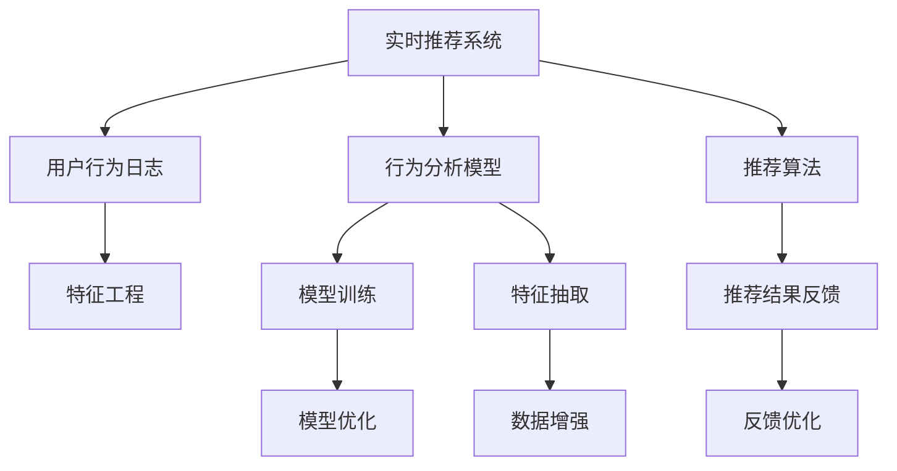

                 

# 实时推荐的用户行为 捕捉与分析

## 1. 背景介绍

### 1.1 问题由来
在现代互联网时代，信息过载成为普遍现象。用户面对海量的内容，常常陷入选择困难。为了解决这一问题，推荐系统应运而生，通过个性化推荐算法，向用户展示最感兴趣的内容，极大地提升了用户体验和互动率。然而，随着用户行为的变化和推荐系统的复杂化，传统的推荐方法面临诸多挑战。如何实时捕捉用户行为，并分析其背后的深层原因，成为推荐系统优化的重要课题。

### 1.2 问题核心关键点
实时推荐系统需要在用户行为产生后，迅速捕捉并进行分析，以产生最新、最精准的推荐结果。核心挑战在于：

1. 数据流处理：处理实时数据流，保证高吞吐量的同时维持较低的延迟。
2. 行为建模：构建用户行为的精准模型，捕捉其深层次的喜好和需求。
3. 动态更新：实时更新推荐模型，及时反映用户行为变化。
4. 公平性与鲁棒性：推荐算法需保证结果的公平性和鲁棒性，避免偏见和过拟合。
5. 算力优化：处理大规模用户行为数据，需优化算法效率和资源利用率。

### 1.3 问题研究意义
实时推荐系统对于提升用户体验、驱动内容消费、优化资源分配具有重要意义。它不仅能够提高用户的满意度，还能促进平台收入的增长，优化广告投放策略，甚至驱动相关行业的数字化转型。通过实时捕捉和分析用户行为，推荐系统有望成为新时代的数字基础设施，助力行业发展。

## 2. 核心概念与联系

### 2.1 核心概念概述

为了深入理解实时推荐系统，本节将介绍几个密切相关的核心概念：

- **实时推荐系统**：在用户产生行为后，迅速捕捉并生成个性化推荐结果的系统。要求高效、实时、精准。
- **用户行为日志**：用户在平台上的所有操作记录，如浏览、点击、购买、评论等。
- **行为分析模型**：对用户行为进行建模和分析，提取其兴趣和需求。常见的建模方法包括协同过滤、深度学习等。
- **推荐算法**：根据用户行为数据，生成推荐结果的算法。常见的推荐算法包括基于内容的推荐、基于协同过滤的推荐、混合推荐等。
- **推荐结果反馈**：用户对推荐结果的互动反馈，如点击、收藏、评分等。用于调整推荐策略，提升推荐效果。
- **机器学习与深度学习**：用于模型训练和优化的机器学习和深度学习技术。

这些核心概念之间存在紧密的联系，共同构成了实时推荐系统的核心技术框架。

### 2.2 核心概念原理和架构的 Mermaid 流程图



以上流程图展示了实时推荐系统的关键组成部分及其相互作用：

1. **用户行为日志**：收集用户在平台上的所有操作数据。
2. **特征工程**：对原始数据进行清洗和提取，生成模型输入特征。
3. **行为分析模型**：对用户行为进行建模，捕捉其深层次的兴趣和需求。
4. **推荐算法**：基于用户行为和模型输出，生成个性化推荐结果。
5. **推荐结果反馈**：收集用户对推荐结果的反馈数据，用于调整模型和算法。
6. **模型训练与优化**：利用用户行为数据，训练和优化推荐模型。
7. **数据增强**：通过对数据进行扩充和增强，提高模型的泛化能力和鲁棒性。

## 3. 核心算法原理 & 具体操作步骤

### 3.1 算法原理概述

实时推荐系统的主要目标是实时捕捉用户行为，并基于用户行为分析模型，生成精准的个性化推荐结果。核心原理如下：

- **数据采集**：从平台收集用户行为日志，包括浏览记录、点击行为、购买记录等。
- **数据清洗与预处理**：清洗数据，去除噪声，标准化处理，生成模型输入特征。
- **行为分析**：通过深度学习等方法，对用户行为进行建模，提取其兴趣和需求。
- **推荐算法**：根据行为分析结果，生成推荐结果。
- **反馈循环**：利用用户反馈数据，调整推荐算法和模型，提升推荐效果。

### 3.2 算法步骤详解

实时推荐系统的具体实现步骤如下：

1. **数据采集与清洗**：从用户行为日志中提取关键信息，并进行数据清洗和标准化处理。
2. **特征工程**：设计合适的特征工程流程，将原始数据转化为模型可用的特征表示。
3. **行为建模**：使用深度学习等方法，对用户行为进行建模，生成行为分析模型。
4. **推荐算法应用**：基于行为分析模型和用户行为数据，应用推荐算法，生成推荐结果。
5. **结果反馈与调整**：利用用户反馈数据，调整推荐策略和模型参数，提升推荐效果。

### 3.3 算法优缺点

实时推荐系统的优缺点如下：

**优点：**

- 高效实时：能够迅速捕捉用户行为，生成最新推荐结果。
- 精准推荐：通过深度学习等方法，捕捉用户深层次的兴趣和需求，提供个性化推荐。
- 动态调整：根据用户行为反馈，实时调整推荐策略，提升推荐效果。

**缺点：**

- 数据依赖：推荐结果依赖于用户行为数据的质量和完整性。
- 资源消耗：实时处理大量数据，需要高性能计算资源。
- 延迟问题：需要在保证高吞吐量的同时维持较低的延迟。
- 公平性问题：需要避免推荐算法中的偏见和歧视，保证推荐公平。

### 3.4 算法应用领域

实时推荐系统在多个领域都有广泛应用，包括：

- 电商推荐：如淘宝、京东等电商平台的商品推荐。
- 视频推荐：如YouTube、Netflix等视频平台的内容推荐。
- 社交网络：如Facebook、微博等社交平台的动态推荐。
- 新闻阅读：如今日头条、新浪新闻等新闻平台的个性化推荐。
- 广告投放：如百度、谷歌等搜索引擎的广告推荐。

这些领域的推荐系统都在实时捕捉和分析用户行为，生成个性化推荐结果，极大地提升了用户体验和平台收益。

## 4. 数学模型和公式 & 详细讲解 & 举例说明

### 4.1 数学模型构建

本节将使用数学语言对实时推荐系统的核心数学模型进行描述。

设用户行为数据集为 $D=\{(x_i,y_i)\}_{i=1}^N$，其中 $x_i$ 为行为特征向量，$y_i$ 为推荐结果标签。推荐系统的目标是最小化损失函数：

$$
\min_{\theta} \mathcal{L}(\theta) = \frac{1}{N} \sum_{i=1}^N \ell(\theta, x_i, y_i)
$$

其中 $\ell$ 为损失函数，$\theta$ 为模型参数。

### 4.2 公式推导过程

以协同过滤推荐算法为例，推导其中的核心公式。

设用户-物品评分矩阵为 $R \in \mathbb{R}^{m \times n}$，其中 $m$ 为用户数量，$n$ 为物品数量。用户 $i$ 的评分向量为 $r_i$，物品 $j$ 的评分向量为 $c_j$。用户 $i$ 对物品 $j$ 的预测评分 $\hat{r}_{i,j}$ 可以表示为：

$$
\hat{r}_{i,j} = \frac{r_i^T c_j}{\sqrt{\sum_{k=1}^m r_k^2} \sqrt{\sum_{k=1}^n c_k^2}}
$$

其中 $\|\cdot\|_2$ 表示向量范数。

目标是最小化预测评分与真实评分之间的差异，即均方误差损失：

$$
\mathcal{L}(\theta) = \frac{1}{N} \sum_{i=1}^N \sum_{j=1}^n (\hat{r}_{i,j} - r_{i,j})^2
$$

### 4.3 案例分析与讲解

以电商平台为例，分析实时推荐系统的实现流程：

1. **数据采集**：从用户点击、浏览、购买等行为中，提取关键信息，生成用户行为日志。
2. **特征工程**：对日志数据进行预处理和特征提取，生成模型输入特征。
3. **协同过滤模型**：使用用户-物品评分矩阵，对用户行为进行建模，生成行为分析模型。
4. **推荐算法应用**：基于协同过滤模型，生成个性化推荐结果。
5. **结果反馈与调整**：利用用户对推荐结果的反馈数据，调整模型参数，提升推荐效果。

## 5. 项目实践：代码实例和详细解释说明

### 5.1 开发环境搭建

在进行实时推荐系统开发前，我们需要准备好开发环境。以下是使用Python进行Scikit-Learn开发的环境配置流程：

1. 安装Anaconda：从官网下载并安装Anaconda，用于创建独立的Python环境。

2. 创建并激活虚拟环境：
```bash
conda create -n recommendation-env python=3.8 
conda activate recommendation-env
```

3. 安装Scikit-Learn：
```bash
conda install scikit-learn
```

4. 安装各类工具包：
```bash
pip install numpy pandas scikit-learn matplotlib tqdm jupyter notebook ipython
```

完成上述步骤后，即可在`recommendation-env`环境中开始实时推荐系统的开发。

### 5.2 源代码详细实现

下面我们以协同过滤推荐算法为例，给出使用Scikit-Learn对电商平台用户行为进行实时推荐开发的PyTorch代码实现。

首先，定义协同过滤推荐算法的核心函数：

```python
from sklearn.metrics.pairwise import cosine_similarity
import numpy as np

def collaborative_filtering(data, top_n=10):
    user_ids = data['user_id'].unique()
    item_ids = data['item_id'].unique()
    
    user_similarity = cosine_similarity(data[user_ids].to_numpy())
    item_similarity = cosine_similarity(data[item_ids].to_numpy())
    
    user_predicted_scores = np.dot(user_similarity, item_similarity)
    
    recommendations = []
    for user_id in user_ids:
        top_items = user_predicted_scores[user_id].argsort()[-top_n:][::-1]
        recommendations.append(list(item_ids[top_items]))
    
    return recommendations
```

然后，加载数据并进行行为分析：

```python
from sklearn.model_selection import train_test_split
from sklearn.preprocessing import StandardScaler
import pandas as pd

# 加载用户行为数据
data = pd.read_csv('user_behavior.csv')

# 划分训练集和测试集
train_data, test_data = train_test_split(data, test_size=0.2)

# 特征工程：标准化处理
scaler = StandardScaler()
train_data['user_id'] = scaler.fit_transform(train_data['user_id'].to_numpy().reshape(-1, 1))
train_data['item_id'] = scaler.fit_transform(train_data['item_id'].to_numpy().reshape(-1, 1))

# 行为分析：协同过滤建模
train_recommendations = collaborative_filtering(train_data)
test_predictions = collaborative_filtering(test_data)

print('推荐结果:', test_predictions)
```

最后，评估推荐系统的效果：

```python
from sklearn.metrics import precision_score

# 评估推荐效果
precision = precision_score(test_predictions, test_data['item_id'], average='micro')
print(f'推荐系统精度: {precision:.2f}')
```

以上就是使用Scikit-Learn对电商平台用户行为进行实时推荐开发的完整代码实现。可以看到，得益于Scikit-Learn的强大封装，我们可以用相对简洁的代码完成协同过滤推荐算法的实现。

### 5.3 代码解读与分析

让我们再详细解读一下关键代码的实现细节：

**collaborative_filtering函数**：
- 定义了协同过滤推荐算法的核心函数，计算用户和物品之间的相似度，并根据相似度生成推荐结果。
- 使用了numpy库的高效矩阵运算，计算用户-物品评分矩阵。
- 通过标准化处理，保证相似度计算的稳定性和精度。

**行为分析部分**：
- 使用了sklearn库的train_test_split方法，将数据集划分为训练集和测试集。
- 使用了StandardScaler对用户和物品的ID进行标准化处理，保证相似度计算的一致性。
- 通过collaborative_filtering函数，对用户行为数据进行协同过滤建模，生成推荐结果。

**推荐结果评估部分**：
- 使用了sklearn库的precision_score方法，评估推荐系统的精度。
- 通过average='micro'参数，对所有用户的所有物品推荐结果进行微平均精度计算。

可以看到，Scikit-Learn的简单易用，使得实时推荐系统的开发变得十分便捷。开发者可以将更多精力放在数据处理和模型改进上，而不必过多关注底层的实现细节。

当然，工业级的系统实现还需考虑更多因素，如模型的实时更新、推荐结果的实时反馈、推荐系统的可扩展性等。但核心的推荐范式基本与此类似。

## 6. 实际应用场景

### 6.1 电商平台推荐

实时推荐系统在电商平台中的应用，已经成为了用户的日常需求。通过实时捕捉用户的浏览、点击和购买行为，推荐系统可以动态调整推荐策略，提供个性化商品推荐。

例如，电商平台可以根据用户的历史浏览记录和点击行为，实时推荐用户可能感兴趣的商品。当用户进入商品详情页后，根据页面停留时间和页面内容，进一步优化推荐结果，提高用户的购买转化率。

### 6.2 视频平台推荐

视频平台如YouTube、Netflix等，利用实时推荐系统，向用户推荐可能感兴趣的视频内容。通过分析用户的观看历史、评分记录和观看行为，实时生成推荐列表，提升用户的视频观看体验。

例如，YouTube根据用户的观看历史，推荐相关主题的视频，甚至可以推荐用户可能感兴趣的新视频。Netflix则通过实时推荐系统，根据用户的观看行为，动态调整推荐列表，优化内容分发策略。

### 6.3 社交网络推荐

社交平台如Facebook、微博等，利用实时推荐系统，向用户推荐可能感兴趣的内容和好友。通过分析用户的点赞、评论、分享等行为，实时生成推荐结果，提升用户的社交体验。

例如，Facebook根据用户的点赞和分享记录，推荐可能感兴趣的朋友和内容。微博则通过实时推荐系统，根据用户的关注和互动行为，动态调整推荐列表，优化内容推荐策略。

### 6.4 新闻平台推荐

新闻平台如今日头条、新浪新闻等，利用实时推荐系统，向用户推荐可能感兴趣的新闻内容。通过分析用户的点击、阅读和分享行为，实时生成推荐列表，提升用户的阅读体验。

例如，今日头条根据用户的阅读历史和点击行为，推荐相关主题的新闻。新浪新闻则通过实时推荐系统，根据用户的阅读记录和互动行为，动态调整推荐列表，优化新闻分发策略。

## 7. 工具和资源推荐

### 7.1 学习资源推荐

为了帮助开发者系统掌握实时推荐系统的理论基础和实践技巧，这里推荐一些优质的学习资源：

1. 《推荐系统实战》系列书籍：深入浅出地介绍了推荐系统的工作原理和推荐算法，包括协同过滤、深度学习等方法。
2. 《深度学习基础》课程：斯坦福大学开设的深度学习基础课程，有Lecture视频和配套作业，带你入门深度学习。
3. 《机器学习实战》书籍：适合入门的机器学习指南，涵盖各种推荐算法的实现和优化。
4. 推荐系统相关论文：如《Lift Lift and Lower: Some simple heuristic-based algorithms for item recommendation》等经典论文，值得深入学习。
5. Kaggle竞赛：参加推荐系统的Kaggle竞赛，通过实战练习掌握推荐系统开发技巧。

通过对这些资源的学习实践，相信你一定能够快速掌握实时推荐系统的精髓，并用于解决实际的推荐问题。

### 7.2 开发工具推荐

高效的开发离不开优秀的工具支持。以下是几款用于实时推荐系统开发的常用工具：

1. Scikit-Learn：基于Python的机器学习库，支持协同过滤、深度学习等推荐算法，易于使用。
2. TensorFlow：由Google主导开发的深度学习框架，生产部署方便，适合大规模工程应用。
3. PyTorch：基于Python的开源深度学习框架，灵活动态的计算图，适合快速迭代研究。
4. Weights & Biases：模型训练的实验跟踪工具，可以记录和可视化模型训练过程中的各项指标，方便对比和调优。
5. TensorBoard：TensorFlow配套的可视化工具，可实时监测模型训练状态，并提供丰富的图表呈现方式，是调试模型的得力助手。
6. Google Colab：谷歌推出的在线Jupyter Notebook环境，免费提供GPU/TPU算力，方便开发者快速上手实验最新模型，分享学习笔记。

合理利用这些工具，可以显著提升实时推荐系统的开发效率，加快创新迭代的步伐。

### 7.3 相关论文推荐

实时推荐系统的研究源于学界的持续研究。以下是几篇奠基性的相关论文，推荐阅读：

1. 《Collaborative Filtering for Implicit Feedback Datasets》：经典协同过滤推荐算法，解决了用户隐式反馈数据的问题。
2. 《A Survey of Collaborative Filtering Algorithm》：综述了多种协同过滤推荐算法，提供了详细的算法实现和对比。
3. 《Deep Interest Networks for Recommendation》：提出基于深度学习的网络模型，捕捉用户兴趣和行为，提高了推荐精度。
4. 《Wide & Deep Learning for Recommender Systems》：提出Wide & Deep结构的推荐算法，结合宽特征和深度学习，提升了推荐效果。
5. 《Adaptive Recurrent Neural Networks for Personalized Recommendations》：使用RNN网络，动态更新用户兴趣，提高了推荐的实时性。

这些论文代表了推荐系统领域的最新进展，通过学习这些前沿成果，可以帮助研究者把握学科前进方向，激发更多的创新灵感。

## 8. 总结：未来发展趋势与挑战

### 8.1 总结

本文对实时推荐系统的核心原理和实现过程进行了全面系统的介绍。首先阐述了实时推荐系统的背景和意义，明确了实时推荐在提升用户体验、驱动内容消费、优化资源分配等方面的重要价值。其次，从原理到实践，详细讲解了实时推荐系统的核心算法和操作步骤，给出了推荐系统的完整代码实例。同时，本文还广泛探讨了实时推荐系统在电商、视频、社交、新闻等领域的实际应用，展示了实时推荐系统的广泛应用前景。此外，本文精选了推荐系统的各类学习资源，力求为读者提供全方位的技术指引。

通过本文的系统梳理，可以看到，实时推荐系统已经成为现代互联网平台的重要基础设施，极大地提升了用户体验和平台收益。未来，伴随深度学习等技术的不断进步，实时推荐系统将在更多领域得到应用，为各行各业带来更加智能、个性化的推荐服务。

### 8.2 未来发展趋势

展望未来，实时推荐系统将呈现以下几个发展趋势：

1. **深度学习的应用**：随着深度学习技术的发展，实时推荐系统将更多地利用深度学习模型，提高推荐精度和实时性。
2. **多模态融合**：实时推荐系统将融合用户的多模态数据，如文本、图像、语音等，提供更加全面、个性化的推荐结果。
3. **在线学习**：实时推荐系统将支持在线学习，动态更新模型参数，持续提升推荐效果。
4. **联邦学习**：分布式推荐系统将采用联邦学习技术，保护用户隐私的同时，提高推荐效果。
5. **推荐效果评估**：实时推荐系统将引入更有效的评估指标，如点击率、转化率、用户满意度等，优化推荐策略。

这些趋势展示了实时推荐系统未来的广阔发展空间，将为各行业带来更加智能、高效的推荐服务。

### 8.3 面临的挑战

尽管实时推荐系统已经取得了显著进展，但在迈向更加智能化、普适化应用的过程中，它仍面临诸多挑战：

1. **数据隐私保护**：实时推荐系统需要处理大量用户行为数据，如何保护用户隐私是一个重大挑战。
2. **算法公平性**：推荐算法需要避免偏见和歧视，保证推荐结果的公平性，这对算法的可解释性和鲁棒性提出了更高要求。
3. **模型实时更新**：实时推荐系统需要实时更新模型，快速响应用户行为变化，这对算法的计算效率和资源利用提出了更高要求。
4. **推荐结果多样性**：推荐系统需要提供多样化的推荐结果，避免用户陷入信息茧房，这对算法的多样性提出了更高要求。
5. **用户反馈处理**：用户对推荐结果的反馈需要及时处理，优化推荐策略，这对算法的反馈循环提出了更高要求。

### 8.4 研究展望

面对实时推荐系统所面临的挑战，未来的研究需要在以下几个方面寻求新的突破：

1. **深度学习方法的优化**：研究如何优化深度学习模型，提高推荐精度和实时性。
2. **多模态数据的融合**：研究如何将多模态数据进行有效融合，提供更加全面、个性化的推荐结果。
3. **在线学习方法的改进**：研究如何改进在线学习算法，提高实时推荐系统的动态更新能力。
4. **联邦学习技术的探索**：研究如何利用联邦学习技术，保护用户隐私的同时，提高推荐效果。
5. **推荐效果评估指标的优化**：研究如何设计更有效的推荐效果评估指标，优化推荐策略。

这些研究方向的探索，必将引领实时推荐系统走向更高的台阶，为构建安全、可靠、可解释、可控的智能系统铺平道路。面向未来，实时推荐系统还需要与其他人工智能技术进行更深入的融合，如知识表示、因果推理、强化学习等，多路径协同发力，共同推动自然语言理解和智能交互系统的进步。只有勇于创新、敢于突破，才能不断拓展推荐系统的边界，让智能技术更好地造福人类社会。

## 9. 附录：常见问题与解答

**Q1：实时推荐系统如何平衡推荐精度和速度？**

A: 实时推荐系统需要在保证高推荐精度的同时，维持较低的延迟。这可以通过以下方法实现：

1. **模型裁剪**：去除不必要的层和参数，减小模型尺寸，加快推理速度。
2. **量化加速**：将浮点模型转为定点模型，压缩存储空间，提高计算效率。
3. **模型并行**：采用模型并行技术，利用多GPU或多机分布式计算，提高计算速度。
4. **数据分流**：将数据分批次处理，提高处理效率。
5. **预计算**：对常用操作进行预计算，减少实时计算量。

这些方法可以显著提高实时推荐系统的计算效率，同时保证推荐精度。

**Q2：实时推荐系统如何处理大规模数据？**

A: 实时推荐系统需要处理大规模用户行为数据，可以通过以下方法优化：

1. **数据分片**：将数据分片处理，减少单次处理的内存占用。
2. **分布式计算**：利用多机分布式计算，提高数据处理速度。
3. **流式计算**：采用流式计算框架，实时处理数据流。
4. **缓存机制**：利用缓存机制，减少重复计算，提高处理效率。

这些方法可以显著优化实时推荐系统的大数据处理能力，提高实时推荐系统的响应速度。

**Q3：实时推荐系统如何保证推荐结果的公平性？**

A: 实时推荐系统需要保证推荐结果的公平性，可以通过以下方法实现：

1. **去偏处理**：对数据进行去偏处理，去除偏斜的数据点。
2. **算法设计**：设计公平的推荐算法，避免算法中的偏见和歧视。
3. **多目标优化**：在推荐算法中引入公平性目标，优化推荐结果。
4. **用户反馈**：利用用户反馈数据，调整推荐策略，提升推荐公平性。

这些方法可以显著提高实时推荐系统的公平性，保证推荐结果的公正性和客观性。

**Q4：实时推荐系统如何处理用户行为数据的稀疏性？**

A: 用户行为数据往往存在稀疏性，可以通过以下方法处理：

1. **数据增强**：利用数据增强技术，对稀疏数据进行扩充和增强。
2. **隐式反馈处理**：利用隐式反馈处理技术，对稀疏数据进行有效建模。
3. **多源数据融合**：利用多源数据融合技术，提高推荐系统的鲁棒性。

这些方法可以显著提高实时推荐系统对稀疏数据的处理能力，提高推荐效果。

**Q5：实时推荐系统如何处理冷启动问题？**

A: 实时推荐系统在面对冷启动用户时，可以采取以下方法：

1. **用户行为预测**：利用用户历史行为预测冷启动用户的兴趣，生成初始推荐结果。
2. **冷启动模型**：引入冷启动模型，对冷启动用户进行个性化推荐。
3. **个性化引导**：利用个性化引导技术，引导冷启动用户参与互动，收集更多行为数据。

这些方法可以显著提高实时推荐系统对冷启动用户的推荐效果，提升用户体验。

---

作者：禅与计算机程序设计艺术 / Zen and the Art of Computer Programming

