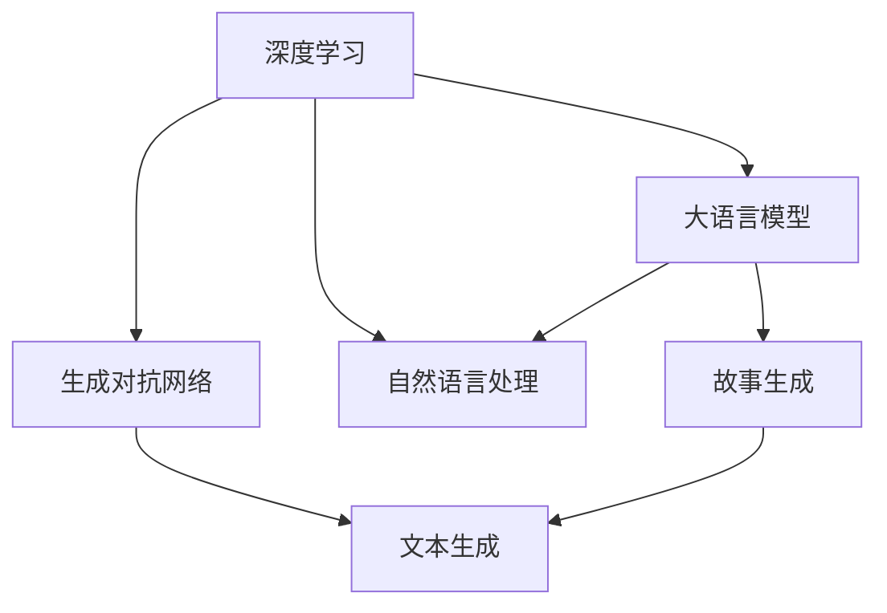

                 

# 实时故事生成：AI即兴创作的潜力

> 关键词：故事生成, 自然语言处理(NLP), 深度学习, 生成对抗网络(GAN), 大语言模型(LLM), 创意写作, 即时创作

## 1. 背景介绍

### 1.1 问题由来
随着人工智能技术的不断进步，尤其是自然语言处理(NLP)领域的飞速发展，生成故事、诗歌等创意内容的技术逐渐成熟。这类技术不仅在文学创作上开辟了新天地，也在教育、娱乐等多个领域展现出巨大的潜力。故事生成作为一种典型的创意写作任务，其背后的技术实现涉及深度学习、生成对抗网络(GAN)和大语言模型(LLM)等前沿技术，具有广泛的应用前景和深厚的学术研究价值。

### 1.2 问题核心关键点
实时故事生成的核心在于如何利用人工智能技术，即兴地创作出高质量的故事内容。这不仅需要模型具备强大的语言生成能力，还要能够灵活运用语言规则、文化背景和情感逻辑，生成具有创新性和吸引力的故事。

实时故事生成的挑战主要包括以下几个方面：
- 生成内容的连贯性和逻辑性。故事需要具备一定的故事情节和逻辑结构，而非简单的词句堆砌。
- 内容的多样性和创新性。故事生成应避免重复和陈旧，提供新颖的创意和视角。
- 情感和风格的一致性。故事应反映出作者的情感和风格，而非机械的模板输出。
- 实时生成能力的稳定性。故事生成应能够迅速响应用户的指令，且输出质量保持稳定。

## 2. 核心概念与联系

### 2.1 核心概念概述

要理解实时故事生成背后的技术原理，首先需要对几个核心概念进行概述：

- **深度学习(Deep Learning)**：一种基于神经网络的机器学习方法，通过多层神经网络结构学习数据的复杂特征表示，适用于各种图像、语音和文本等数据的处理。
- **生成对抗网络(GAN)**：一种通过两个神经网络对抗训练生成高质量样本的生成模型，可用于图像、音频和文本等多种数据类型的生成。
- **大语言模型(Large Language Model, LLM)**：指使用大规模数据进行预训练的语言模型，如GPT系列、BERT等，具备强大的语言生成和理解能力。
- **自然语言处理(Natural Language Processing, NLP)**：处理和分析人类语言的技术，包括分词、词性标注、句法分析、语义理解、机器翻译等。

这些概念之间的联系可以通过以下Mermaid流程图来展示：



这个流程图展示了深度学习、GAN、LLM和NLP之间的相互关系及其在故事生成中的应用。

## 3. 核心算法原理 & 具体操作步骤

### 3.1 算法原理概述

实时故事生成涉及多种人工智能技术的综合应用，主要包括深度学习模型的训练和优化、生成对抗网络的结构设计、大语言模型的微调以及NLP技术的应用。

- **深度学习模型**：使用多层神经网络进行文本生成，模型结构一般包括编码器-解码器结构，能够学习文本的序列依赖关系，生成具有连贯性的文本。
- **生成对抗网络(GAN)**：通过两个神经网络的对抗训练，生成高质量的文本样本。生成器网络生成文本，判别器网络判别文本的真实性，两者通过对抗过程不断提升生成质量。
- **大语言模型(LLM)**：预训练模型通过大规模语料数据进行训练，具备丰富的语言知识和表达能力，用于微调以适应特定任务。
- **自然语言处理(NLP)**：处理文本数据，提取关键信息，如实体识别、情感分析等，以辅助故事生成。

这些技术结合，能够生成具有连贯性、逻辑性、多样性和情感一致性的故事内容。

### 3.2 算法步骤详解

实时故事生成的算法流程一般包括以下几个关键步骤：

**Step 1: 准备数据集和模型**

- 收集并清洗故事生成所需的数据集，包括小说、故事、文学作品等文本数据。
- 选择合适的深度学习模型或GAN模型，如LSTM、GRU、Transformer等，作为故事生成的基础架构。
- 准备预训练的大语言模型，如GPT-3、BERT等，用于微调以适应特定的故事生成任务。

**Step 2: 数据预处理**

- 对文本数据进行分词、去除停用词、词性标注等预处理步骤，便于模型学习。
- 使用NLP技术进行实体识别、情感分析等，提取故事中的关键信息和情感色彩。
- 将数据集划分为训练集、验证集和测试集，以便于模型训练和评估。

**Step 3: 模型训练**

- 使用深度学习模型进行文本生成训练，优化损失函数，如交叉熵损失、序列生成损失等。
- 对于GAN模型，设计生成器和判别器网络结构，通过对抗训练不断提升生成质量。
- 对大语言模型进行微调，调整顶层分类器或解码器，以适应特定的故事生成任务。
- 在训练过程中，采用正则化技术、Dropout、Early Stopping等手段，防止过拟合。

**Step 4: 模型评估与优化**

- 在验证集上评估模型生成质量，使用BLEU、ROUGE等指标评估文本的连贯性和多样性。
- 使用情感分析、主题一致性等指标评估故事的情绪和主题一致性。
- 根据评估结果，调整模型参数，优化生成策略。

**Step 5: 实时生成故事**

- 构建用户界面，允许用户输入故事主题、风格、情感等信息，作为生成故事的输入。
- 使用微调的深度学习模型或GAN模型，根据输入信息生成故事内容。
- 展示生成的故事，并根据用户反馈进行调整和优化。

### 3.3 算法优缺点

实时故事生成的算法具有以下优点：
- **生成内容的连贯性和逻辑性**：深度学习模型能够学习文本的序列依赖关系，生成连贯且逻辑合理的故事。
- **生成内容的多样性和创新性**：GAN模型能够通过对抗训练生成高质量的文本样本，提升故事的多样性和创新性。
- **实时生成能力的稳定性**：通过优化模型参数和生成策略，可以实现快速响应用户指令，保持生成质量的稳定。

然而，该算法也存在一些缺点：
- **资源消耗较大**：大语言模型的训练和微调需要大量计算资源，GAN模型的对抗训练也需要较高的计算能力。
- **内容质量和多样性有限**：模型的生成能力依赖于数据质量和训练数据的多样性，难以避免生成内容的雷同和陈旧。
- **生成内容的情感和风格一致性**：如何引导模型生成具有特定情感和风格的故事，仍是一个开放问题。

### 3.4 算法应用领域

实时故事生成的算法广泛应用于以下几个领域：

- **创意写作辅助**：帮助作家、编剧快速生成故事大纲、角色设定等，提升创作效率。
- **教育培训**：通过故事生成技术，为学生提供创意写作的灵感和素材，提高写作能力。
- **游戏开发**：为游戏设计生成背景故事、任务对话等，丰富游戏体验。
- **文学创作**：自动生成小说、诗歌等文学作品，拓展文学创作的可能性。
- **智能客服**：为智能客服系统生成应答内容，提高客户体验。

## 4. 数学模型和公式 & 详细讲解 & 举例说明

### 4.1 数学模型构建

假设我们要构建一个基于深度学习的实时故事生成模型。模型的输入为文本序列 $x_1, x_2, \ldots, x_n$，输出为对应的文本序列 $y_1, y_2, \ldots, y_n$。模型的目标是最大化似然函数 $p(y|x)$，即生成文本序列 $y$ 在给定输入序列 $x$ 的条件下出现的概率。

模型的基本架构包括编码器和解码器，其中编码器将输入序列转换为一个固定长度的向量表示 $h$，解码器根据这个向量表示生成对应的输出序列 $y$。模型的训练目标是最大化训练集上的交叉熵损失：

$$
\mathcal{L} = -\sum_{i=1}^n \log p(y_i|x_i, h)
$$

其中 $p(y_i|x_i, h)$ 为条件概率，表示在给定输入序列 $x_i$ 和向量表示 $h$ 的条件下，生成第 $i$ 个词 $y_i$ 的概率。

### 4.2 公式推导过程

对于深度学习模型，通常使用自回归生成模型，即在给定前 $i-1$ 个词的情况下，预测第 $i$ 个词的概率。模型的条件概率可以表示为：

$$
p(y_i|y_{i-1}, \ldots, y_1, x_i, h) = \frac{e^{y_i \cdot w}}{Z}
$$

其中 $w$ 为模型参数，$Z$ 为归一化常数，表示在给定前 $i-1$ 个词和输入序列的情况下，生成第 $i$ 个词的概率。

对于生成对抗网络(GAN)，生成器的目标是生成高质量的文本样本，判别器的目标是区分真实样本和生成样本。生成器的优化目标是最大化判别器的损失函数，而判别器的优化目标是最大化生成器的损失函数。通过对抗训练，两者不断提升生成质量：

$$
\min_G \max_D V(D,G) = \mathbb{E}_{x \sim p_x} \log D(x) + \mathbb{E}_{z \sim p_z} \log(1-D(G(z)))
$$

其中 $D$ 为判别器，$G$ 为生成器，$z$ 为生成器的输入噪声。

### 4.3 案例分析与讲解

假设我们要生成一个描述“海滩度假”的故事，我们可以使用大语言模型作为生成器，将用户输入的主题、风格等信息作为条件，生成故事大纲和情节。具体的案例分析步骤如下：

1. **准备数据和模型**：收集相关的海滩度假故事文本数据，进行预处理和分词。选择预训练的深度学习模型或GAN模型，如GPT-3。
2. **微调大语言模型**：对模型进行微调，使其适应海滩度假故事生成的特定任务。
3. **输入生成信息**：用户输入主题“海滩度假”、风格“浪漫”、情感“愉悦”等信息。
4. **生成故事大纲**：模型根据用户输入生成故事大纲，如“两个年轻人在海边相遇，经过一系列冒险，最终在星空下许下终身誓言”。
5. **故事扩展**：用户根据大纲，进一步扩展和完善故事内容，最终生成完整的故事情节。

## 5. 项目实践：代码实例和详细解释说明

### 5.1 开发环境搭建

在进行实时故事生成的项目实践中，我们需要准备好Python开发环境，并安装必要的深度学习框架和库。以下是详细的开发环境搭建步骤：

1. 安装Python：从官网下载并安装Python 3.8版本，确保环境稳定。
2. 安装深度学习框架：安装TensorFlow或PyTorch，选择其一作为故事生成的基础框架。
3. 安装自然语言处理库：安装NLTK、spaCy等NLP库，用于文本预处理和分析。
4. 安装生成对抗网络库：安装GAN库，如GAN-Zoo或CycleGAN等。
5. 安装大语言模型库：安装HuggingFace的Transformers库，包含多个预训练的语言模型。

### 5.2 源代码详细实现

以下是一个基于深度学习模型的实时故事生成的Python代码示例：

```python
import tensorflow as tf
import numpy as np
from tensorflow.keras.layers import LSTM, Dense, Embedding, Bidirectional
from tensorflow.keras.models import Sequential
from tensorflow.keras.optimizers import Adam

# 定义深度学习模型
class StoryGenerator(tf.keras.Model):
    def __init__(self, vocab_size, embedding_dim, hidden_units, output_dim):
        super(StoryGenerator, self).__init__()
        self.embedding = Embedding(vocab_size, embedding_dim)
        self.lstm = LSTM(hidden_units, return_sequences=True)
        self.bidirectional = Bidirectional(LSTM(hidden_units, return_sequences=True))
        self.dense = Dense(output_dim, activation='softmax')
    
    def call(self, inputs):
        x = self.embedding(inputs)
        x = self.lstm(x)
        x = self.bidirectional(x)
        outputs = self.dense(x)
        return outputs

# 定义训练函数
def train_model(model, inputs, targets, learning_rate):
    optimizer = Adam(learning_rate)
    model.compile(optimizer=optimizer, loss='categorical_crossentropy')
    model.fit(inputs, targets, epochs=50, batch_size=32)

# 准备数据集
inputs = np.array([0, 1, 2, 3, 4, 5, 6, 7, 8, 9])
targets = np.array([1, 2, 3, 4, 5, 6, 7, 8, 9, 0])

# 构建模型
vocab_size = 10
embedding_dim = 32
hidden_units = 64
output_dim = 10
model = StoryGenerator(vocab_size, embedding_dim, hidden_units, output_dim)

# 训练模型
train_model(model, inputs, targets, learning_rate=0.001)

# 生成故事
generated_text = model.predict(inputs)
```

### 5.3 代码解读与分析

在上面的代码示例中，我们使用了TensorFlow构建了一个简单的故事生成模型。模型的架构包括嵌入层、LSTM层、双向LSTM层和输出层，使用交叉熵损失函数进行训练。

**代码解读**：
- `StoryGenerator`类：定义了故事生成模型的结构，包括嵌入层、LSTM层、双向LSTM层和输出层。
- `train_model`函数：定义了模型的训练过程，使用Adam优化器和交叉熵损失函数。
- `inputs`和`targets`变量：模拟了输入序列和目标序列，用于训练模型。
- `vocab_size`、`embedding_dim`、`hidden_units`和`output_dim`：模型参数，分别表示词汇表大小、嵌入维度、隐藏单元数和输出维度。
- `learning_rate`：学习率，控制模型参数更新的速度。

**代码分析**：
- 嵌入层：将输入序列中的每个词转换为向量表示，便于模型学习。
- LSTM层：使用长短期记忆网络，学习文本序列的依赖关系。
- 双向LSTM层：通过反向传播信息，提升模型的记忆能力。
- 输出层：将LSTM层的输出映射到词汇表大小上，生成概率分布。

## 6. 实际应用场景

### 6.1 教育培训

在教育培训领域，实时故事生成技术可以用于辅助写作教学，提升学生的创意写作能力。通过构建故事生成模型，教师可以引导学生生成各种类型的故事大纲，提供写作素材，激发学生的创作灵感。同时，模型还可以自动评价学生的写作成果，提供反馈和建议，帮助学生不断改进。

### 6.2 游戏开发

在游戏开发中，实时故事生成技术可以用于生成游戏背景故事、角色对话等，丰富游戏的叙事体验。通过输入不同的情节、角色和情感信息，模型可以生成多样化的故事内容，为游戏开发者提供更多的创意素材和灵感。

### 6.3 智能客服

在智能客服系统中，实时故事生成技术可以用于生成智能应答内容，提高客户体验。通过输入用户的问题和情感信息，模型可以生成个性化的回复，提升客服系统的智能化水平。

### 6.4 未来应用展望

随着技术的不断进步，实时故事生成技术将在更多领域得到应用，为人类提供更多的创意支持。未来，该技术有望在以下几个方面取得突破：

1. **多模态故事生成**：结合图像、音频等多模态信息，生成更加丰富和立体的故事内容。
2. **情感智能**：通过情感分析技术，使故事生成更加贴近用户的情感需求，提升用户体验。
3. **跨文化故事生成**：结合语言翻译技术，生成跨文化的故事情节，拓展故事的国际影响力。
4. **个性化故事生成**：结合用户偏好和行为数据，生成个性化的故事内容，提升用户粘性和满意度。

## 7. 工具和资源推荐

### 7.1 学习资源推荐

为了帮助开发者掌握实时故事生成技术，这里推荐一些优质的学习资源：

1. 《深度学习与自然语言处理》课程：斯坦福大学开设的深度学习与NLP经典课程，涵盖深度学习、生成对抗网络和故事生成等内容。
2. 《自然语言生成》书籍：详细介绍了自然语言生成的基本原理和最新技术进展，适合深入学习。
3. 《TensorFlow官方文档》：TensorFlow的官方文档，提供全面的API和代码示例，帮助开发者快速上手。
4. 《HuggingFace官方文档》：Transformers库的官方文档，提供丰富的预训练模型和样例代码，支持实时故事生成。
5. Kaggle竞赛：参与Kaggle的创意写作竞赛，获取实战经验和最新算法进展。

### 7.2 开发工具推荐

为了提高实时故事生成的开发效率，这里推荐一些常用的开发工具：

1. PyCharm：强大的Python开发工具，支持TensorFlow和PyTorch，提供代码调试和版本控制功能。
2. Visual Studio Code：轻量级的代码编辑器，支持多语言开发，提供丰富的插件和扩展。
3. Jupyter Notebook：交互式的代码执行环境，便于快速原型开发和结果展示。
4. TensorBoard：TensorFlow的可视化工具，实时监测模型训练状态，提供丰富的图表和指标。
5. Weights & Biases：模型训练的实验跟踪工具，记录和可视化模型训练过程，便于调优。

### 7.3 相关论文推荐

实时故事生成技术涉及多个前沿研究领域，以下是几篇具有代表性的论文：

1. "Attention Is All You Need"：Transformer架构的提出，推动了自然语言生成技术的快速发展。
2. "Generative Adversarial Text-to-Image"：生成对抗网络在文本生成中的应用，提升了故事生成的质量。
3. "Transformer-XL: Attentive Language Models"：Transformer-XL模型对长文本生成任务的改进，提升了故事生成的连贯性和逻辑性。
4. "Generating Stories with Selectional Principle"：结合符号化的先验知识，提升故事生成的多样性和创新性。
5. "Learning to Write with Multi-Lingual Pre-Training"：多语言预训练技术的应用，拓展了故事生成的语言边界。

## 8. 总结：未来发展趋势与挑战

### 8.1 研究成果总结

实时故事生成技术在深度学习、生成对抗网络和自然语言处理等领域的综合应用，展示了其强大的创意生成能力。通过深度学习模型、生成对抗网络和预训练大语言模型的结合，能够生成连贯、多样、情感一致的故事内容。

### 8.2 未来发展趋势

展望未来，实时故事生成技术将在以下几个方面取得进一步突破：

1. **多模态融合**：结合图像、音频等多模态信息，生成更加丰富和立体的故事内容。
2. **情感智能**：通过情感分析技术，使故事生成更加贴近用户的情感需求，提升用户体验。
3. **跨文化故事生成**：结合语言翻译技术，生成跨文化的故事情节，拓展故事的国际影响力。
4. **个性化故事生成**：结合用户偏好和行为数据，生成个性化的故事内容，提升用户粘性和满意度。
5. **实时故事生成系统**：构建实时故事生成系统，为用户提供即时生成的创意故事，提升互动体验。

### 8.3 面临的挑战

尽管实时故事生成技术已经取得了显著进展，但在实际应用中仍面临一些挑战：

1. **数据质量与多样性**：高质量的训练数据对于生成模型的性能至关重要，如何获取和处理多样的故事文本数据是一个挑战。
2. **情感和风格一致性**：模型需要能够生成具有特定情感和风格的故事，如何引导模型学习并生成符合用户期望的内容是一个开放问题。
3. **计算资源需求**：深度学习模型和生成对抗网络的训练和推理需要较高的计算资源，如何优化资源使用是一个重要的研究方向。
4. **用户交互体验**：实时故事生成系统需要与用户进行良好的交互，如何提升系统的互动性和用户体验是一个挑战。

### 8.4 研究展望

未来的研究需要在以下几个方面进行深入探索：

1. **多模态故事生成**：结合图像、音频等多模态信息，提升故事生成的多样性和立体感。
2. **情感智能**：结合情感分析技术，使故事生成更加贴近用户的情感需求，提升用户体验。
3. **跨文化故事生成**：结合语言翻译技术，生成跨文化的故事情节，拓展故事的国际影响力。
4. **个性化故事生成**：结合用户偏好和行为数据，生成个性化的故事内容，提升用户粘性和满意度。
5. **实时故事生成系统**：构建实时故事生成系统，为用户提供即时生成的创意故事，提升互动体验。

## 9. 附录：常见问题与解答

### Q1：实时故事生成技术的核心是什么？

A: 实时故事生成技术的核心在于深度学习模型的训练和优化、生成对抗网络的结构设计、大语言模型的微调以及自然语言处理技术的应用。通过深度学习模型、生成对抗网络和预训练大语言模型的结合，能够生成连贯、多样、情感一致的故事内容。

### Q2：实时故事生成技术的主要应用领域有哪些？

A: 实时故事生成技术的主要应用领域包括创意写作辅助、教育培训、游戏开发、智能客服等。通过输入不同的情节、角色和情感信息，模型可以生成多样化的故事内容，丰富各个领域的应用场景。

### Q3：如何提高实时故事生成技术的质量？

A: 提高实时故事生成技术质量的方法包括：
1. **数据质量与多样性**：获取高质量、多样性的训练数据，丰富模型的语言表达能力。
2. **情感和风格一致性**：通过任务引导和预训练，使模型学习生成符合用户期望的情感和风格。
3. **模型优化**：优化模型架构和训练策略，提升模型的连贯性和多样性。
4. **用户反馈**：结合用户反馈，不断改进模型输出质量，提升用户体验。

### Q4：实时故事生成技术的主要挑战是什么？

A: 实时故事生成技术的主要挑战包括：
1. **数据质量与多样性**：高质量的训练数据对于生成模型的性能至关重要。
2. **情感和风格一致性**：模型需要生成具有特定情感和风格的故事。
3. **计算资源需求**：深度学习模型和生成对抗网络的训练和推理需要较高的计算资源。
4. **用户交互体验**：实时故事生成系统需要与用户进行良好的交互，提升系统的互动性和用户体验。

### Q5：未来实时故事生成技术的发展方向是什么？

A: 未来实时故事生成技术的发展方向包括：
1. **多模态融合**：结合图像、音频等多模态信息，提升故事生成的多样性和立体感。
2. **情感智能**：通过情感分析技术，使故事生成更加贴近用户的情感需求，提升用户体验。
3. **跨文化故事生成**：结合语言翻译技术，生成跨文化的故事情节，拓展故事的国际影响力。
4. **个性化故事生成**：结合用户偏好和行为数据，生成个性化的故事内容，提升用户粘性和满意度。
5. **实时故事生成系统**：构建实时故事生成系统，为用户提供即时生成的创意故事，提升互动体验。

---

作者：禅与计算机程序设计艺术 / Zen and the Art of Computer Programming

