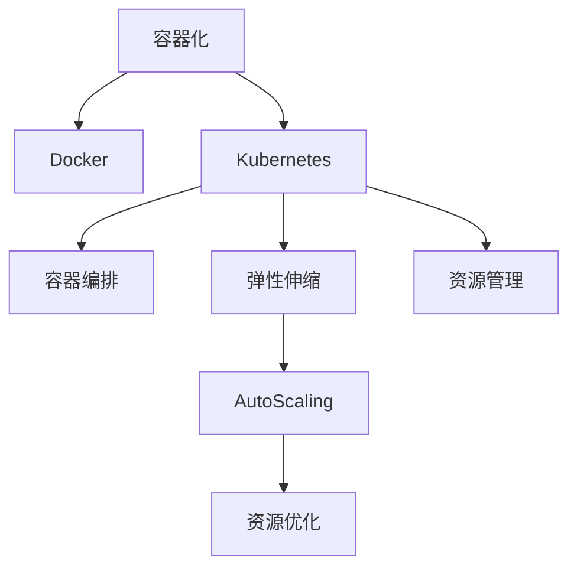

                 

# 容器化部署与弹性伸缩原理与代码实战案例讲解

> 关键词：容器化，弹性伸缩，Kubernetes，Docker，AutoScaling，资源管理

## 1. 背景介绍

### 1.1 问题由来

随着云原生技术的迅猛发展，企业对于应用系统的高可用性、弹性扩展和持续集成持续交付（CI/CD）的需求日益增长。容器技术作为一种轻量级、可移植的运行环境，能够显著提升应用程序的部署和运维效率，成为云计算时代的主流技术。然而，如何高效管理和扩展容器化应用，仍然是一个技术挑战。

### 1.2 问题核心关键点

容器化部署与弹性伸缩的核心在于如何有效地管理容器应用的生命周期，以及根据实际需求动态调整容器数量和资源配置。主要问题包括：

- **容器编排**：如何自动化容器编排和管理，确保应用稳定运行。
- **弹性伸缩**：如何根据负载变化自动调整容器数量，优化资源使用。
- **监控和告警**：如何实时监控容器应用状态，及时响应异常。
- **持续集成持续交付**：如何高效地进行应用构建、测试和部署。

## 2. 核心概念与联系

### 2.1 核心概念概述

为更好地理解容器化部署与弹性伸缩，本节将介绍几个关键概念：

- **容器化**：将应用程序和其依赖打包到一个或多个容器中，确保应用程序在任意环境中的一致性运行。
- **Docker**：一种开源容器引擎，支持应用及其依赖的无缝部署和运行。
- **Kubernetes**：一个开源的容器编排平台，用于自动化部署、扩展和管理容器化应用。
- **AutoScaling**：根据负载变化自动调整容器数量和资源配置，优化资源使用。
- **资源管理**：对容器应用所需的计算、存储和网络资源进行管理，确保应用高效运行。

这些概念之间的逻辑关系可以通过以下Mermaid流程图来展示：



这个流程图展示了这个系统的主要组成部分及其之间的相互作用关系：

1. 容器化通过将应用及其依赖打包到Docker容器中，确保应用的一致性运行。
2. Kubernetes作为容器编排平台，自动化管理Docker容器的部署、扩展和监控。
3. Kubernetes的弹性伸缩机制AutoScaling，根据实际负载动态调整容器数量。
4. 资源管理通过监控和调度容器应用所需的资源，优化应用运行。
5. AutoScaling自动调整的容器和资源配置，进一步提高了系统的资源优化效率。

## 3. 核心算法原理 & 具体操作步骤
### 3.1 算法原理概述

容器化部署与弹性伸缩的核心算法原理基于Docker容器和Kubernetes编排。容器化通过Docker将应用程序及其依赖打包成一个个独立、可移植的容器，而Kubernetes则通过其容器编排和弹性伸缩机制，动态调整容器数量和资源配置，以适应应用负载的变化。

### 3.2 算法步骤详解

#### 3.2.1 容器化部署

1. **构建Docker镜像**：编写Dockerfile，定义应用及其依赖的安装和配置过程，构建Docker镜像。
2. **推送Docker镜像**：将构建好的Docker镜像推送到Docker Hub或私有镜像仓库。
3. **部署容器应用**：在Kubernetes中定义Pod，引用推送的Docker镜像，启动容器应用。

#### 3.2.2 Kubernetes容器编排

1. **定义Deployment**：定义Deployment对象，描述应用的Pod规格和更新策略。
2. **定义Service**：定义Service对象，为容器应用提供稳定的访问入口。
3. **定义Ingress**：定义Ingress对象，为外部流量提供负载均衡和路由。

#### 3.2.3 弹性伸缩

1. **配置AutoScaling**：配置Horizontal Pod Autoscaler（HPA），根据CPU使用率或自定义指标动态调整Pod数量。
2. **定义资源请求和限制**：在Pod定义中指定CPU和内存请求和限制，确保应用在资源充足的情况下运行。

### 3.3 算法优缺点

#### 3.3.1 优点

- **高可移植性**：Docker容器可以在任意环境中一致性运行。
- **自动化管理**：Kubernetes提供自动化部署、扩展和监控，降低了运维成本。
- **弹性伸缩**：AutoScaling根据实际负载动态调整容器数量，优化资源使用。
- **资源管理**：通过资源管理和调度，确保应用高效运行。

#### 3.3.2 缺点

- **学习曲线陡峭**：Docker和Kubernetes都需要一定的学习成本。
- **依赖性强**：系统高度依赖Docker和Kubernetes，迁移成本高。
- **网络通信开销**：容器之间的通信需要通过网络，可能会影响性能。
- **资源利用率**：对于CPU、内存等资源的利用率，仍需进一步优化。

### 3.4 算法应用领域

容器化部署与弹性伸缩在以下领域有广泛应用：

- **云计算**：云计算平台如AWS、Google Cloud、Azure等都支持容器化应用和弹性伸缩。
- **大数据**：大数据平台如Hadoop、Spark等，通过容器化部署提升系统稳定性。
- **微服务架构**：微服务架构中的每个服务可以独立部署在容器中，并通过Kubernetes进行编排和扩展。
- **DevOps**：持续集成持续交付（CI/CD）系统通过容器化部署，实现快速构建、测试和部署。
- **互联网应用**：电商、社交、视频等互联网应用，通过容器化提升扩展性和稳定性。

## 4. 数学模型和公式 & 详细讲解 & 举例说明

### 4.1 数学模型构建

基于Kubernetes的AutoScaling机制，定义一个应用服务的CPU负载为$L$，理想情况下，当$L$达到某个阈值$L_{thresh}$时，AutoScaling将调整Pod数量。

假设每个Pod需要的CPU资源为$R$，则期望的Pod数量$N$可以通过以下公式计算：

$$
N = \frac{L}{R}
$$

在实际部署中，AutoScaling会根据CPU使用率等指标动态调整$L$，以确保应用的稳定运行。

### 4.2 公式推导过程

1. **CPU负载计算**：假设一个应用有$n$个Pod，每个Pod使用CPU资源为$R$，总负载为$L$，则：

$$
L = nR
$$

2. **期望Pod数量计算**：假设期望CPU负载为$L_{thresh}$，则期望的Pod数量$N$为：

$$
N = \frac{L_{thresh}}{R}
$$

3. **AutoScaling机制**：AutoScaling会根据实时CPU负载$L_{real}$调整Pod数量，以确保负载在可接受范围内。例如，如果$L_{real} > L_{thresh}$，AutoScaling会增加Pod数量，如果$L_{real} < L_{thresh}$，AutoScaling会减少Pod数量。

### 4.3 案例分析与讲解

以一个电商平台的订单处理系统为例，该系统每天需要处理数万笔订单。假设每个订单处理服务使用1个CPU核，每个Pod使用2个CPU核，初始Pod数量为5个。

根据公式，期望的CPU负载$L_{thresh} = 5 \times 2 = 10$。

在订单高峰期，系统负载达到20时，AutoScaling会自动增加Pod数量，以满足CPU资源需求。如果负载降低到5，AutoScaling会减少Pod数量，以节省资源。

## 5. 项目实践：代码实例和详细解释说明
### 5.1 开发环境搭建

在进行容器化部署与弹性伸缩实践前，我们需要准备好开发环境。以下是使用Kubernetes和Docker进行环境配置的流程：

1. **安装Docker**：从官网下载并安装Docker，安装过程中需配置DockerHub账户信息。
2. **安装Kubernetes**：可以选择使用Minikube或Kubernetes集群进行本地测试。Minikube是一个轻量级的Kubernetes部署环境，适合开发和测试。
3. **安装Kubectl**：Kubectl是Kubernetes的命令行工具，用于管理集群资源。
4. **配置环境变量**：设置DOCKER_HOST和KUBECONFIG变量，确保Docker和Kubernetes之间的通信。

### 5.2 源代码详细实现

这里我们以一个简单的Web应用为例，演示如何使用Docker和Kubernetes进行容器化部署和弹性伸缩。

**5.2.1 Dockerfile文件**

```Dockerfile
FROM nginx:latest

COPY index.html /usr/share/nginx/html/
COPY nginx.conf /etc/nginx/nginx.conf

EXPOSE 80

CMD ["/usr/sbin/nginx", "-g", "daemon off;"]
```

这个Dockerfile定义了一个基于nginx的Web应用，将`index.html`文件和`nginx.conf`配置文件复制到容器内，并设置80端口为暴露端口。

**5.2.2 Kubernetes配置文件**

1. **Deployment配置**

```yaml
apiVersion: apps/v1
kind: Deployment
metadata:
  name: web-app
spec:
  replicas: 3
  selector:
    matchLabels:
      app: web-app
  template:
    metadata:
      labels:
        app: web-app
    spec:
      containers:
      - name: web-app
        image: <docker-registry>/web-app:latest
        ports:
        - containerPort: 80
        resources:
          limits:
            cpu: "1"
            memory: "256Mi"
          requests:
            cpu: "1"
            memory: "256Mi"
```

这个配置定义了一个名为`web-app`的Deployment，启动3个Pod，容器镜像来源于DockerHub，每个Pod的资源限制和请求分别设置1CPU和256Mi内存。

2. **Service配置**

```yaml
apiVersion: v1
kind: Service
metadata:
  name: web-app
spec:
  selector:
    app: web-app
  ports:
  - protocol: TCP
    port: 80
    targetPort: 80
  type: LoadBalancer
```

这个配置定义了一个名为`web-app`的Service，将3个Pod的服务暴露到外部，并使用LoadBalancer类型提供稳定的访问入口。

### 5.3 代码解读与分析

**5.3.1 Dockerfile**

- `FROM nginx:latest`：基于nginx的最新版本构建容器。
- `COPY index.html /usr/share/nginx/html/`：将`index.html`文件复制到容器内，作为Web应用的默认页面。
- `COPY nginx.conf /etc/nginx/nginx.conf`：将`nginx.conf`配置文件复制到容器内，用于设置Web服务。
- `EXPOSE 80`：暴露80端口，使得外部可以通过该端口访问容器内的Web服务。
- `CMD ["/usr/sbin/nginx", "-g", "daemon off;"]`：启动nginx服务，配置daemon off，即不使用守护进程。

**5.3.2 Kubernetes配置文件**

- `apiVersion`：指定Kubernetes API版本。
- `kind`：定义对象类型，如Deployment、Service等。
- `metadata`：定义对象元数据，如名称、标签等。
- `spec`：定义对象的具体配置，如Pod数量、服务端口、资源限制等。
- `selector`：定义Pod的标签选择器，用于选择部署的目标Pod。
- `template`：定义Pod的模板，包括容器定义、资源配置等。
- `resources`：定义容器的资源限制和请求，确保应用稳定运行。
- `ports`：定义容器的暴露端口，确保服务可以被外部访问。
- `type`：定义服务的类型，如LoadBalancer、ClusterIP等。

### 5.4 运行结果展示

通过上述配置，我们可以使用以下命令在Minikube上启动Web应用：

```bash
kubectl create -f deployment.yaml
kubectl create -f service.yaml
kubectl apply -f deployment.yaml
kubectl apply -f service.yaml
kubectl get pods
kubectl get svc
```

启动成功后，可以通过`kubectl get pods`查看Pod状态，通过`kubectl get svc`查看Service状态，确保应用正常运行。

## 6. 实际应用场景
### 6.1 电商平台订单处理系统

电商平台的订单处理系统需要处理海量订单，根据用户请求实时生成订单信息，并在后台进行订单处理和存储。通过容器化部署和弹性伸缩，可以确保系统的高可用性和扩展性。

1. **订单处理服务**：使用Docker容器封装订单处理逻辑，确保应用的一致性运行。
2. **消息队列服务**：使用Kafka等消息队列服务，确保订单信息的高效处理和存储。
3. **数据库服务**：使用MySQL或Redis等数据库服务，确保订单数据的稳定性和可靠性。
4. **监控和告警**：通过Prometheus和Grafana等监控工具，实时监控系统负载和性能指标，确保系统稳定运行。
5. **自动伸缩**：根据订单处理负载，使用AutoScaling自动调整订单处理Pod数量，确保资源合理分配。

### 6.2 金融行业风险监控系统

金融行业风险监控系统需要实时监测金融市场动态，及时发现和预警风险事件。通过容器化部署和弹性伸缩，可以确保系统的稳定性和扩展性。

1. **数据分析服务**：使用Docker容器封装数据分析逻辑，确保应用的一致性运行。
2. **数据存储服务**：使用Hadoop或Elasticsearch等大数据存储服务，确保数据的稳定性和可靠性。
3. **风险预警服务**：使用Kafka等消息队列服务，确保风险事件的快速处理和预警。
4. **监控和告警**：通过Prometheus和Grafana等监控工具，实时监控系统负载和性能指标，确保系统稳定运行。
5. **自动伸缩**：根据市场动态，使用AutoScaling自动调整数据分析Pod数量，确保资源合理分配。

### 6.3 医疗行业诊断系统

医疗行业的诊断系统需要处理大量的病人数据，实时生成诊断报告，并提供医生辅助诊断。通过容器化部署和弹性伸缩，可以确保系统的稳定性和扩展性。

1. **数据处理服务**：使用Docker容器封装数据处理逻辑，确保应用的一致性运行。
2. **数据存储服务**：使用Hadoop或HDFS等大数据存储服务，确保数据的稳定性和可靠性。
3. **诊断报告服务**：使用Kafka等消息队列服务，确保诊断报告的快速处理和生成。
4. **监控和告警**：通过Prometheus和Grafana等监控工具，实时监控系统负载和性能指标，确保系统稳定运行。
5. **自动伸缩**：根据病人数据量，使用AutoScaling自动调整数据处理Pod数量，确保资源合理分配。

### 6.4 未来应用展望

随着容器化技术和大数据技术的不断发展，容器化部署与弹性伸缩将在更多领域得到应用，为各行各业带来变革性影响。

在智慧城市治理中，容器化部署和弹性伸缩可以用于城市事件监测、舆情分析、应急指挥等环节，提高城市管理的自动化和智能化水平，构建更安全、高效的未来城市。

在智能制造领域，容器化部署和弹性伸缩可以用于生产线监控、设备管理、数据采集等环节，提高制造业的智能化水平，优化资源利用率，降低生产成本。

在智慧能源领域，容器化部署和弹性伸缩可以用于能源监测、智能电网管理、能源交易等环节，提高能源管理的智能化水平，优化资源配置，降低能源消耗。

总之，随着容器化技术和大数据技术的不断发展，容器化部署与弹性伸缩将在更多领域得到应用，为各行各业带来变革性影响。

## 7. 工具和资源推荐
### 7.1 学习资源推荐

为了帮助开发者系统掌握容器化部署与弹性伸缩的理论基础和实践技巧，这里推荐一些优质的学习资源：

1. **《Kubernetes权威指南》**：一本详细介绍Kubernetes的书籍，适合初学者和进阶者阅读。
2. **《Docker实战指南》**：一本详细介绍Docker实战操作的书籍，适合Docker用户阅读。
3. **Kubernetes官方文档**：Kubernetes官方文档，包含详细的使用指南和API文档，是学习Kubernetes的最佳资源。
4. **Docker官方文档**：Docker官方文档，包含详细的使用指南和API文档，是学习Docker的最佳资源。
5. **Prometheus官方文档**：Prometheus官方文档，包含详细的使用指南和API文档，是学习监控工具的最佳资源。
6. **Grafana官方文档**：Grafana官方文档，包含详细的使用指南和API文档，是学习可视化工具的最佳资源。

通过对这些资源的学习实践，相信你一定能够快速掌握容器化部署与弹性伸缩的精髓，并用于解决实际的系统问题。

### 7.2 开发工具推荐

高效的开发离不开优秀的工具支持。以下是几款用于容器化部署与弹性伸缩开发的常用工具：

1. **Kubectl**：Kubernetes的命令行工具，用于管理集群资源。
2. **Docker Desktop**：Docker的桌面端工具，方便开发者快速构建和测试Docker镜像。
3. **Minikube**：轻量级的Kubernetes部署环境，适合开发和测试。
4. **Prometheus**：开源的监控系统，用于实时监控应用性能。
5. **Grafana**：开源的可视化工具，用于构建性能监控仪表盘。
6. **Jenkins**：开源的CI/CD工具，用于自动化构建和部署应用。

合理利用这些工具，可以显著提升容器化部署与弹性伸缩任务的开发效率，加快创新迭代的步伐。

### 7.3 相关论文推荐

容器化部署与弹性伸缩技术的发展源于学界的持续研究。以下是几篇奠基性的相关论文，推荐阅读：

1. **《Containerization: A Survey》**：一篇详细介绍容器化技术的综述论文，涵盖Docker、Kubernetes等主流技术。
2. **《Automatic Scaling in Cloud Environments: A Survey》**：一篇详细介绍云环境自动伸缩技术的综述论文，涵盖AutoScaling等主流技术。
3. **《Kubernetes: Design and Implementation》**：一篇详细介绍Kubernetes设计原理和实现细节的论文，是学习Kubernetes的必读资源。
4. **《A Survey on Cloud Computing: Principles and Paradigms》**：一篇详细介绍云计算原理和技术的综述论文，涵盖云平台、自动伸缩等主流技术。

这些论文代表了这个领域的研究进展，通过学习这些前沿成果，可以帮助研究者把握学科前进方向，激发更多的创新灵感。

## 8. 总结：未来发展趋势与挑战
### 8.1 总结

本文对容器化部署与弹性伸缩方法进行了全面系统的介绍。首先阐述了容器化和Kubernetes的核心概念和理论基础，明确了容器化部署与弹性伸缩在提升应用稳定性和扩展性方面的独特价值。其次，从原理到实践，详细讲解了容器化部署、Kubernetes编排和弹性伸缩的数学原理和操作步骤，给出了完整的代码实例。同时，本文还广泛探讨了容器化部署与弹性伸缩方法在电商、金融、医疗等多个领域的应用前景，展示了其在实际应用中的巨大潜力。此外，本文精选了容器化和弹性伸缩技术的各类学习资源，力求为读者提供全方位的技术指引。

通过本文的系统梳理，可以看到，容器化部署与弹性伸缩方法在云计算时代将扮演越来越重要的角色，显著提升应用系统的稳定性和扩展性，推动云计算技术的发展和应用。未来，伴随容器化技术和弹性伸缩机制的不断演进，相信容器化部署与弹性伸缩必将在更广阔的应用领域大放异彩，深刻影响云计算和云原生应用的未来发展。

### 8.2 未来发展趋势

展望未来，容器化部署与弹性伸缩技术将呈现以下几个发展趋势：

1. **多云融合**：容器化技术将更加广泛应用于多云环境中，实现跨云平台的资源共享和统一管理。
2. **边缘计算**：容器化技术将延伸到边缘计算领域，支持在边缘节点上运行微服务，提升响应速度。
3. **云原生应用**：云原生架构（包括微服务、CI/CD、声明式管理等）将更加广泛应用，推动容器化技术的普及。
4. **资源自动化**：自动化资源管理将更加普及，涵盖计算、存储、网络等各个方面，提升资源利用率。
5. **智能编排**：智能编排和调度算法将更加成熟，自动化调整容器数量和资源配置，优化资源使用。
6. **弹性计算**：弹性计算和自动伸缩机制将更加普及，支持按需扩展和缩减资源。

这些趋势凸显了容器化部署与弹性伸缩技术的广阔前景。这些方向的探索发展，必将进一步提升容器化技术的性能和应用范围，为云计算和云原生应用的未来发展注入新的动力。

### 8.3 面临的挑战

尽管容器化部署与弹性伸缩技术已经取得了显著成就，但在迈向更加智能化、普适化应用的过程中，仍面临诸多挑战：

1. **学习曲线陡峭**：容器化技术和Kubernetes都需要一定的学习成本，开发者需要掌握相关知识和技能。
2. **资源管理复杂**：容器化应用需要复杂的资源管理，包括计算、存储和网络资源的分配和调度。
3. **网络通信开销**：容器之间的通信需要通过网络，可能会影响性能。
4. **性能瓶颈**：容器化应用的性能优化仍然存在瓶颈，需要进一步提升。
5. **安全性和合规性**：容器化应用的安全性和合规性问题仍需解决，确保应用在实际环境中安全稳定运行。
6. **资源浪费**：容器化应用在资源使用上存在浪费，需要进一步优化资源配置。

这些挑战需要从技术、管理、安全等多个维度进行全面优化，才能实现容器化部署与弹性伸缩技术的广泛应用。

### 8.4 研究展望

面对容器化部署与弹性伸缩技术所面临的挑战，未来的研究需要在以下几个方面寻求新的突破：

1. **容器化优化**：开发更加轻量级、高效的容器镜像，减少资源开销。
2. **Kubernetes优化**：改进Kubernetes的资源管理算法，提高资源利用率。
3. **网络优化**：优化容器之间的通信机制，提升性能和稳定性。
4. **安全性和合规性**：增强容器化应用的安全性和合规性，确保应用在实际环境中安全稳定运行。
5. **资源自动化**：实现更高效的资源自动化管理，减少人为干预。
6. **弹性计算**：进一步提升弹性计算和自动伸缩机制，支持更灵活的资源调整。

这些研究方向的探索，必将引领容器化部署与弹性伸缩技术迈向更高的台阶，为云计算和云原生应用的未来发展注入新的动力。相信随着学界和产业界的共同努力，这些挑战终将一一被克服，容器化部署与弹性伸缩必将在构建安全、可靠、高效、可扩展的云原生应用中扮演越来越重要的角色。

## 9. 附录：常见问题与解答

**Q1：容器化部署与弹性伸缩的主要优势是什么？**

A: 容器化部署与弹性伸缩的主要优势包括：

- **高可用性**：通过容器化，应用程序可以在任意环境中一致性运行，保证应用的稳定性和可用性。
- **弹性扩展**：通过弹性伸缩，可以动态调整容器数量和资源配置，确保应用在高负载下的性能。
- **自动化管理**：通过容器编排和自动化工具，可以简化应用部署和运维管理。
- **资源优化**：通过资源管理和调度，可以优化应用所需的计算、存储和网络资源。

**Q2：如何设计一个高效的Kubernetes Deployment？**

A: 设计一个高效的Kubernetes Deployment需要考虑以下几个关键因素：

1. **Pod数量**：根据应用负载，合理设置Pod数量，避免过多或过少。
2. **资源限制和请求**：合理设置CPU和内存的限制和请求，确保应用在资源充足的情况下运行。
3. **容器镜像**：使用稳定、可靠的容器镜像，确保应用的稳定性和一致性。
4. **健康检查**：使用健康检查机制，确保容器应用始终处于正常状态。
5. **环境变量**：合理设置环境变量，方便应用在不同环境中正常运行。

**Q3：如何实现容器化应用的持续集成持续部署（CI/CD）？**

A: 实现容器化应用的CI/CD需要考虑以下几个关键因素：

1. **构建和测试**：在CI系统中，自动构建和测试容器镜像，确保应用的质量和稳定性。
2. **部署**：将构建好的容器镜像自动部署到Kubernetes集群，确保应用的快速上线。
3. **监控和告警**：在CD系统中，实时监控应用性能和状态，及时发现和处理异常。
4. **回滚机制**：在CD系统中，设置回滚机制，确保应用的稳定性和可靠性。

**Q4：容器化应用如何实现负载均衡？**

A: 容器化应用可以通过以下方式实现负载均衡：

1. **Kubernetes Service**：定义Kubernetes Service，将多个Pod的访问流量进行负载均衡。
2. **LoadBalancer**：使用LoadBalancer类型的Service，将外部流量进行负载均衡。
3. **Ingress**：定义Ingress对象，将外部流量进行负载均衡和路由。

**Q5：容器化应用如何实现自动伸缩？**

A: 容器化应用可以通过以下方式实现自动伸缩：

1. **Horizontal Pod Autoscaler（HPA）**：配置HPA，根据CPU使用率或自定义指标动态调整Pod数量。
2. **Cluster Autoscaler**：配置Cluster Autoscaler，根据集群负载动态调整节点数量。
3. **Custom Metrics**：使用自定义指标，根据实际业务需求进行自动伸缩。

**Q6：容器化应用如何实现高可用性？**

A: 容器化应用可以通过以下方式实现高可用性：

1. **多副本部署**：通过多副本部署，确保应用在单个节点故障的情况下仍能正常运行。
2. **服务发现和负载均衡**：通过Kubernetes Service，将多个Pod的访问流量进行负载均衡。
3. **容错机制**：使用容错机制，确保应用在节点故障的情况下仍能正常运行。

这些回答可以帮助你更好地理解容器化部署与弹性伸缩技术，并指导实践操作。

