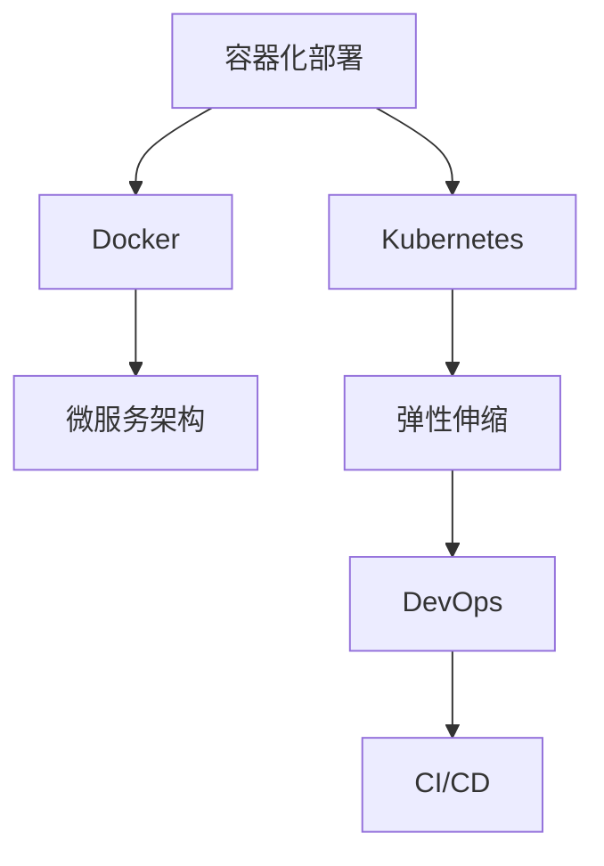

                 

# 容器化部署与弹性伸缩原理与代码实战案例讲解

> 关键词：容器化部署, 弹性伸缩, Kubernetes, Docker, 微服务架构, DevOps, 持续集成/持续部署(CI/CD)

## 1. 背景介绍

在当今快速发展的互联网时代，应用程序的规模和复杂性不断提升，对软件部署、运维和扩展能力提出了新的挑战。容器化部署与弹性伸缩技术是应对这些挑战的关键手段，通过将应用程序打包为容器镜像，并利用容器编排工具管理容器集群，实现快速、高效、可扩展的自动化部署与运维。本文将全面介绍容器化部署与弹性伸缩的核心原理，并通过具体的代码实战案例，展示如何在生产环境中应用这些技术。

## 2. 核心概念与联系

### 2.1 核心概念概述

为更好地理解容器化部署与弹性伸缩技术，本节将介绍几个密切相关的核心概念：

- **容器化部署**：指将应用程序和其依赖项打包到可移植、可重复使用的容器中，每个容器运行独立且相互隔离的过程。容器化部署简化了应用程序的部署和管理，提高了系统的稳定性和可移植性。
- **弹性伸缩**：指根据系统负载的变化动态调整容器数量，以应对流量激增或减少的需求，确保系统在高负载下仍能稳定运行，同时避免资源浪费。
- **Kubernetes**：一个开源的容器编排系统，用于自动化部署、扩展和管理容器化应用程序，是现代云原生应用的关键组件。
- **Docker**：一个开源的容器引擎，用于创建、分发和管理容器镜像，是容器化部署的基础工具。
- **微服务架构**：一种架构风格，将应用程序分解为一组独立、自治的微服务，每个微服务独立运行、松散耦合，增强了系统的可扩展性和灵活性。
- **DevOps**：结合软件开发(Software Development)和信息技术运营(Operations)的实践，旨在提升软件交付速度和质量，缩短开发周期，提高系统可靠性和效率。
- **持续集成/持续部署(CI/CD)**：通过自动化测试和部署流程，持续将代码变更快速、可靠地交付到生产环境，提高软件开发效率和系统稳定性。

这些核心概念之间的逻辑关系可以通过以下Mermaid流程图来展示：



这个流程图展示了一些核心概念及其之间的关系：

1. 容器化部署通过Docker等工具实现，是微服务架构的基础。
2. Kubernetes用于容器编排，提供弹性伸缩和自动部署能力。
3. DevOps实践贯穿于软件开发和运维全过程，推动CI/CD流程的自动化。
4. 弹性伸缩是Kubernetes的核心特性，支持系统动态扩展和收缩。
5. CI/CD流程自动化是DevOps的重要组成部分，保障了微服务架构的快速迭代和稳定部署。

这些概念共同构成了容器化部署与弹性伸缩技术的应用框架，使得应用程序能够在各种场景下快速、可靠地部署和扩展。

## 3. 核心算法原理 & 具体操作步骤
### 3.1 算法原理概述

容器化部署与弹性伸缩技术主要依赖于两个关键组件：容器编排系统和容器运行环境。容器编排系统如Kubernetes通过调度、编排和监控容器集群，实现应用程序的自动化部署和扩展；容器运行环境如Docker则提供了一个轻量级的、独立运行的环境，用于封装和管理应用及其依赖。

容器化部署的核心原理是将应用程序及其依赖打包到Docker镜像中，然后通过Kubernetes等容器编排工具，自动化地将镜像部署到指定节点，启动和管理容器实例。容器编排系统负责资源分配、负载均衡、服务发现等任务，确保容器集群的高可用性和性能。

弹性伸缩的核心原理是根据系统负载的变化动态调整容器数量。Kubernetes通过水平Pod自动扩展(HPA)、垂直Pod自动扩展(VPA)等机制，根据系统性能指标（如CPU、内存使用率）自动调整容器实例数量，实现系统的负载均衡和资源优化。

### 3.2 算法步骤详解

容器化部署和弹性伸缩的具体操作步骤如下：

#### 容器化部署

1. **容器镜像构建**：使用Dockerfile定义应用及其依赖的打包规则，构建Docker镜像。Dockerfile包含了所有打包所需的信息，如基础镜像、环境配置、依赖安装、应用打包等步骤。

2. **容器镜像存储**：将构建的Docker镜像推送到Docker仓库，如Docker Hub、Harbor等，方便后续部署使用。

3. **容器实例部署**：在Kubernetes集群中创建Deployment，指定容器镜像、运行参数等，Kubernetes会自动创建Pod，并在指定节点上启动容器实例。

#### 弹性伸缩

1. **负载监控**：通过Prometheus等监控工具，实时监控系统性能指标，如CPU、内存使用率、请求响应时间等。

2. **自动扩展**：当性能指标超出预设阈值时，触发HPA或VPA机制，根据预设策略自动增加或减少容器实例数量。

3. **水平扩展**：增加新的Pod实例，分散负载，提高系统的吞吐量和稳定性。

4. **垂直扩展**：升级现有Pod实例的资源限制，提高计算能力，优化性能。

### 3.3 算法优缺点

容器化部署与弹性伸缩技术具有以下优点：

1. **高效部署**：容器化部署简化了应用程序的打包和部署过程，提高了系统的部署效率。
2. **快速迭代**：基于微服务的架构风格，容器化部署支持快速迭代和灵活扩展，适应需求变化。
3. **资源优化**：弹性伸缩机制可以根据负载自动调整资源，避免资源浪费，提高资源利用率。
4. **高可用性**：通过容器编排系统，实现容器的自动化管理，保障系统的高可用性和稳定性。

同时，这些技术也存在一些局限性：

1. **复杂性**：容器化部署和弹性伸缩技术需要一定的技术积累，对运维团队的要求较高。
2. **管理复杂度**：容器编排系统复杂，需要维护和管理大量的配置和监控信息。
3. **容器镜像管理**：需要管理和维护大量的Docker镜像，可能会占用较多的存储空间。
4. **依赖关系**：依赖关系管理复杂，需要确保容器间的数据和状态一致性。

尽管存在这些局限性，但容器化部署与弹性伸缩技术凭借其高效的部署和扩展能力，已经成为现代云原生应用的基础架构。

### 3.4 算法应用领域

容器化部署与弹性伸缩技术已经广泛应用于各种场景，包括但不限于以下领域：

- **云计算平台**：如AWS、Google Cloud、阿里云等，提供弹性伸缩和容器编排服务。
- **微服务架构**：如Netflix、Dropbox等，采用微服务架构，通过容器化部署和弹性伸缩实现系统扩展。
- **DevOps实践**：如GitLab、Jenkins等，提供CI/CD自动化部署流程，加速软件交付。
- **企业内部系统**：如金融、电商、社交媒体等，利用容器化部署和弹性伸缩技术提升系统效率和可用性。

## 4. 数学模型和公式 & 详细讲解 & 举例说明

### 4.1 数学模型构建

在本节中，我们将通过一个简单的例子来展示如何构建一个基本的容器化部署与弹性伸缩模型。

假设我们有一个简单的Web应用，使用Django框架，依赖Python和MySQL。我们使用Dockerfile进行打包，如下所示：

```Dockerfile
FROM python:3.8-slim
COPY requirements.txt /app/
RUN pip install -r requirements.txt
COPY app /app
WORKDIR /app
CMD ["python", "manage.py", "runserver", "0.0.0.0:8000"]
```

构建完成后，我们将Docker镜像推送到Docker Hub，并使用Kubernetes进行部署。在Kubernetes中，我们创建一个Deployment，如下所示：

```yaml
apiVersion: apps/v1
kind: Deployment
metadata:
  name: web-app
spec:
  replicas: 3
  selector:
    matchLabels:
      app: web-app
  template:
    metadata:
      labels:
        app: web-app
    spec:
      containers:
      - name: web-app
        image: <your-docker-username>/web-app:latest
        ports:
        - containerPort: 8080
```

### 4.2 公式推导过程

在实际应用中，我们会使用一些自动化的工具来帮助我们进行容器编排和资源管理。例如，Prometheus用于监控系统性能指标，HPA用于自动扩展容器实例。这些工具的具体公式推导过程较为复杂，但总体思路是基于实时监控数据，结合预设的策略和阈值，自动调整容器数量。

以HPA为例，其核心公式为：

$$
\Delta k = k_{max} - k_{min}
$$

其中，$k$表示当前容器实例数量，$k_{max}$和$k_{min}$分别为最大和最小容器实例数量。根据CPU和内存使用率等性能指标，HPA会动态调整容器数量，确保系统负载均衡。

### 4.3 案例分析与讲解

假设我们有一个线上电商平台的Web应用，预计在双11期间访问量会大幅增加。根据历史数据，我们预计流量峰值将达到当前负载的5倍。为了应对流量激增，我们采用容器化部署和弹性伸缩技术。

1. **容器化部署**：我们将应用及其依赖打包到Docker镜像中，并将镜像推送到Docker Hub。

2. **Kubernetes部署**：在Kubernetes集群中创建Deployment，指定容器镜像和运行参数，启动3个Pod实例。

3. **监控与报警**：通过Prometheus实时监控CPU和内存使用率，当负载超出预设阈值时，触发HPA机制。

4. **弹性伸缩**：HPA自动增加Pod实例，分散负载，提高系统的吞吐量和稳定性。

通过这些步骤，我们实现了应用程序的快速部署和弹性伸缩，确保系统在高负载下仍能稳定运行。

## 5. 项目实践：代码实例和详细解释说明
### 5.1 开发环境搭建

在进行容器化部署与弹性伸缩实践前，我们需要准备好开发环境。以下是使用Kubernetes和Docker进行容器编排和部署的环境配置流程：

1. **安装Docker**：根据操作系统安装Docker引擎。

2. **安装Kubernetes**：安装Kubernetes集群，可以通过Minikube或EKS等工具快速搭建集群。

3. **安装Prometheus**：安装Prometheus监控系统，用于监控Kubernetes集群的性能指标。

4. **安装Grafana**：安装Grafana仪表盘，展示Prometheus的监控数据。

5. **安装HPA和VPA**：安装HPA和VPA扩展，用于自动扩展容器实例。

完成上述步骤后，即可在Kubernetes集群上开始容器编排和部署实践。

### 5.2 源代码详细实现

下面我们以一个简单的Web应用为例，展示如何在Kubernetes上实现容器化部署和弹性伸缩。

首先，定义Dockerfile和requirements.txt文件：

```bash
# Dockerfile
FROM python:3.8-slim
COPY requirements.txt /app/
RUN pip install -r requirements.txt
COPY app /app
WORKDIR /app
CMD ["python", "manage.py", "runserver", "0.0.0.0:8000"]

# requirements.txt
flask>=1.1.2
gunicorn>=20.1.0
```

然后，构建Docker镜像并推送到Docker Hub：

```bash
docker build -t <your-docker-username>/web-app .
docker push <your-docker-username>/web-app:latest
```

接下来，在Kubernetes中创建Deployment和HPA：

```yaml
apiVersion: apps/v1
kind: Deployment
metadata:
  name: web-app
spec:
  replicas: 3
  selector:
    matchLabels:
      app: web-app
  template:
    metadata:
      labels:
        app: web-app
    spec:
      containers:
      - name: web-app
        image: <your-docker-username>/web-app:latest
        ports:
        - containerPort: 8080

apiVersion: autoscaling/v2beta2
kind: HorizontalPodAutoscaler
metadata:
  name: web-app-hpa
spec:
  scaleTargetRef:
    apiVersion: v1
    kind: Deployment
    name: web-app
  minReplicas: 1
  maxReplicas: 10
  targetCPUUtilizationPercentage: 70
```

最后，启动Kubernetes集群，访问应用：

```bash
kubectl apply -f deployment.yaml
kubectl apply -f hpa.yaml
kubectl apply -f prometheus.yaml
kubectl apply -f grafana.yaml
kubectl apply -f hpa-ext.yaml
```

### 5.3 代码解读与分析

让我们再详细解读一下关键代码的实现细节：

**Dockerfile**：
- 使用Python 3.8的轻量级镜像作为基础。
- 安装Flask和Gunicorn等依赖。
- 将应用程序和requirements.txt文件复制到容器中。
- 设置运行参数，启动Flask应用。

**Deployment.yaml**：
- 定义Deployment对象，指定容器镜像和运行参数。
- 设置副本数量为3，确保高可用性。

**HorizontalPodAutoscaler.yaml**：
- 定义HPA对象，指定目标Pod和资源限制。
- 设置最小和最大副本数量。
- 根据CPU使用率自动扩展Pod数量。

**prometheus.yaml和grafana.yaml**：
- 配置Prometheus和Grafana，用于监控Kubernetes集群的性能指标。

**hpa-ext.yaml**：
- 配置HPA扩展，支持更精细的资源限制和自定义策略。

### 5.4 运行结果展示

在完成上述步骤后，通过Kubernetes控制台或kubectl命令行查看容器状态和HPA状态：

```bash
kubectl get pods
kubectl get hpa
```

可以看到，HPA自动根据CPU使用率调整Pod数量，确保系统的负载均衡和资源优化。

## 6. 实际应用场景
### 6.1 智能客服系统

基于容器化部署与弹性伸缩技术的智能客服系统，可以支持大规模、高并发的在线客服需求。智能客服系统通过容器化部署快速响应客户咨询，通过弹性伸缩机制在高峰期自动扩容，确保系统稳定运行。

在技术实现上，可以采用微服务架构，将客服功能分解为多个微服务，如用户管理、问题解答、语音识别等。每个微服务独立运行，通过容器编排系统自动部署和扩展，实现高效稳定的客服服务。

### 6.2 金融交易系统

金融交易系统对稳定性和性能要求极高，需要实时处理大量的交易数据，支持高并发的交易请求。通过容器化部署和弹性伸缩技术，金融交易系统可以在高峰期快速响应，处理海量交易请求，同时保持系统的稳定性和可靠性。

在技术实现上，可以采用分布式架构，将交易逻辑分解为多个微服务，如订单管理、清算、风控等。每个微服务独立运行，通过容器编排系统自动部署和扩展，实现高可用和高性能的交易处理。

### 6.3 社交媒体平台

社交媒体平台需要处理大量的用户请求，支持实时消息推送、用户互动等复杂功能。通过容器化部署和弹性伸缩技术，社交媒体平台可以在用户激增时快速扩容，确保系统的稳定性和用户体验。

在技术实现上，可以采用微服务架构，将社交功能分解为多个微服务，如用户管理、消息推送、内容审核等。每个微服务独立运行，通过容器编排系统自动部署和扩展，实现高可靠和高性能的社交媒体服务。

### 6.4 未来应用展望

随着容器化部署与弹性伸缩技术的不断发展，未来将有更多行业应用这些技术，为各行各业带来新的变革。

在智慧城市治理中，通过容器化部署和弹性伸缩技术，可以实现城市事件监测、舆情分析、应急指挥等环节的自动化管理，提高城市管理的效率和响应速度。

在智慧医疗领域，通过容器化部署和弹性伸缩技术，可以实现医疗问答、病历分析、药物研发等应用的快速迭代和扩展，提升医疗服务的智能化水平。

在智慧教育领域，通过容器化部署和弹性伸缩技术，可以实现教育资源的自动化部署和扩展，提升教学质量和效率。

未来，容器化部署与弹性伸缩技术将广泛应用于更多场景，推动各行各业的数字化转型升级。

## 7. 工具和资源推荐
### 7.1 学习资源推荐

为了帮助开发者系统掌握容器化部署与弹性伸缩技术的理论基础和实践技巧，这里推荐一些优质的学习资源：

1. **Kubernetes官方文档**：Kubernetes官方文档，提供了完整的部署和操作指南，是学习容器编排的基础。

2. **Docker官方文档**：Docker官方文档，提供了Docker容器化的详细说明，是学习容器部署的必备资料。

3. **《Kubernetes权威指南》**：一本系统介绍Kubernetes的书籍，详细介绍了Kubernetes的架构、部署和运维。

4. **《Docker实战指南》**：一本实战性较强的Docker书籍，介绍了Docker容器化的实际应用案例。

5. **《DevOps实践指南》**：一本系统介绍DevOps的书籍，涵盖持续集成、持续部署、监控和自动化运维等方面的内容。

6. **《微服务架构实践》**：一本系统介绍微服务的书籍，介绍了微服务的架构设计、开发和运维实践。

通过对这些资源的学习实践，相信你一定能够快速掌握容器化部署与弹性伸缩技术的精髓，并用于解决实际的部署和运维问题。

### 7.2 开发工具推荐

高效的开发离不开优秀的工具支持。以下是几款用于容器化部署与弹性伸缩开发的常用工具：

1. **Kubernetes**：一个开源的容器编排系统，用于自动化部署、扩展和管理容器化应用程序。

2. **Docker**：一个开源的容器引擎，用于创建、分发和管理容器镜像。

3. **Prometheus**：一个开源的监控系统，用于实时监控Kubernetes集群的性能指标。

4. **Grafana**：一个开源的仪表盘系统，展示Prometheus的监控数据。

5. **Helm**：一个Kubernetes包管理工具，用于快速部署和管理Kubernetes应用。

6. **Jenkins**：一个开源的CI/CD工具，支持自动化测试和部署流程。

合理利用这些工具，可以显著提升容器化部署与弹性伸缩任务的开发效率，加快创新迭代的步伐。

### 7.3 相关论文推荐

容器化部署与弹性伸缩技术的发展源于学界的持续研究。以下是几篇奠基性的相关论文，推荐阅读：

1. **Kubernetes: Container Orchestration for Google's Microservices Architecture**：Kubernetes的论文，介绍了Kubernetes的架构设计和应用实践。

2. **Automatic Scaling of Web Services in Amazon's Architecture**：AWS的自动扩展论文，介绍了AWS的自动扩展机制和应用案例。

3. **Deploying Distributed Microservices Using Docker Swarm**：Docker Swarm的论文，介绍了Docker Swarm的架构设计和应用实践。

4. **Microservices Deployment with Kubernetes and Docker Swarm**：Kubernetes和Docker Swarm的对比论文，介绍了两者的部署和扩展机制。

这些论文代表了大规模分布式系统的发展脉络。通过学习这些前沿成果，可以帮助研究者把握学科前进方向，激发更多的创新灵感。

## 8. 总结：未来发展趋势与挑战

### 8.1 总结

本文对容器化部署与弹性伸缩技术进行了全面系统的介绍。首先阐述了容器化部署与弹性伸缩技术的背景和意义，明确了容器化部署与弹性伸缩在现代云原生应用中的重要性。其次，从原理到实践，详细讲解了容器化部署与弹性伸缩的核心步骤，通过具体的代码实例，展示了如何在生产环境中应用这些技术。

通过本文的系统梳理，可以看到，容器化部署与弹性伸缩技术已经成为现代应用的基础架构，极大提升了应用程序的部署效率、扩展能力和系统稳定性。未来，随着云计算、微服务、DevOps等技术的发展，容器化部署与弹性伸缩技术将不断演进，推动应用系统向更高效、更稳定、更智能的方向发展。

### 8.2 未来发展趋势

展望未来，容器化部署与弹性伸缩技术将呈现以下几个发展趋势：

1. **云原生应用普及**：随着云原生应用的发展，越来越多的企业将采用容器化部署与弹性伸缩技术，实现系统的高效扩展和管理。

2. **自动化运维深化**：随着DevOps的普及，自动化运维工具将更加智能化，通过机器学习等技术提升系统调度和故障恢复能力。

3. **服务网格扩展**：随着微服务架构的普及，服务网格技术将得到广泛应用，实现服务间通信的自动化管理和流量控制。

4. **边缘计算融合**：随着边缘计算技术的发展，容器化部署与弹性伸缩技术将与边缘计算技术结合，实现更快速、更灵活的本地部署和扩展。

5. **安全性提升**：随着容器安全性的提升，容器化部署与弹性伸缩技术将进一步增强系统的安全性和稳定性。

以上趋势凸显了容器化部署与弹性伸缩技术的广阔前景。这些方向的探索发展，必将进一步提升应用系统的性能和可用性，为各行各业带来新的机遇。

### 8.3 面临的挑战

尽管容器化部署与弹性伸缩技术已经取得了瞩目成就，但在迈向更加智能化、普适化应用的过程中，它仍面临着诸多挑战：

1. **复杂性**：容器化部署和弹性伸缩技术需要一定的技术积累，对运维团队的要求较高。

2. **管理复杂度**：容器编排系统复杂，需要维护和管理大量的配置和监控信息。

3. **容器镜像管理**：需要管理和维护大量的Docker镜像，可能会占用较多的存储空间。

4. **依赖关系管理**：依赖关系管理复杂，需要确保容器间的数据和状态一致性。

尽管存在这些局限性，但容器化部署与弹性伸缩技术凭借其高效的部署和扩展能力，已经成为现代云原生应用的基础架构。

### 8.4 研究展望

面对容器化部署与弹性伸缩技术所面临的挑战，未来的研究需要在以下几个方面寻求新的突破：

1. **容器编排优化**：开发更轻量级的容器编排系统，优化编排流程，减少资源消耗。

2. **容器镜像压缩**：开发高效的容器镜像压缩技术，减小镜像体积，优化存储和传输。

3. **微服务治理**：开发更完善的服务治理框架，提升服务间的通信和调度效率。

4. **自动运维提升**：引入机器学习、自然语言处理等技术，提升自动化运维能力。

5. **容器安全性**：开发更完善的容器安全机制，增强系统的安全性和稳定性。

这些研究方向的探索，必将引领容器化部署与弹性伸缩技术迈向更高的台阶，为构建高效、稳定、安全的系统提供更多解决方案。

## 9. 附录：常见问题与解答

**Q1：容器化部署与弹性伸缩是否适用于所有应用场景？**

A: 容器化部署与弹性伸缩技术适用于大多数应用场景，特别是在大规模、高并发的环境下表现优异。但对于实时性要求极高的应用，如金融交易、社交媒体等，需要根据具体情况进行优化调整。

**Q2：如何选择合适的容器编排工具？**

A: 选择合适的容器编排工具需要考虑多个因素，如应用架构、系统负载、扩展需求等。Kubernetes和Docker Swarm是目前最流行的两个容器编排工具，适用于不同的应用场景。Kubernetes适用于大规模、复杂的微服务架构，Docker Swarm适用于轻量级、简单的应用。

**Q3：如何优化容器镜像的大小？**

A: 优化容器镜像大小可以通过以下方法：
1. 使用多阶段构建Dockerfile，去除不需要的文件和依赖。
2. 使用容器镜像压缩技术，如Docker Compose的gzip压缩。
3. 使用Docker Trusted Registry等工具，优化镜像的存储和传输效率。

**Q4：如何处理容器间的依赖关系？**

A: 处理容器间的依赖关系可以通过以下方法：
1. 使用容器镜像管理工具，如Docker Hub、Harbor等，管理容器镜像的依赖关系。
2. 使用容器编排系统，如Kubernetes，自动管理和调度容器实例。
3. 使用容器网络技术，如CNI插件，实现容器间的通信和数据共享。

通过这些方法，可以有效管理容器间的依赖关系，确保系统的稳定性和可靠性。

**Q5：如何在生产环境中监控Kubernetes集群的性能？**

A: 在生产环境中监控Kubernetes集群的性能，可以使用Prometheus和Grafana等工具。通过配置Prometheus的节点监控和应用监控，实时收集系统的性能指标。使用Grafana展示Prometheus的监控数据，直观了解系统的运行状态。

通过这些工具，可以实现对Kubernetes集群的全面监控，及时发现和解决系统问题。

---

作者：禅与计算机程序设计艺术 / Zen and the Art of Computer Programming

