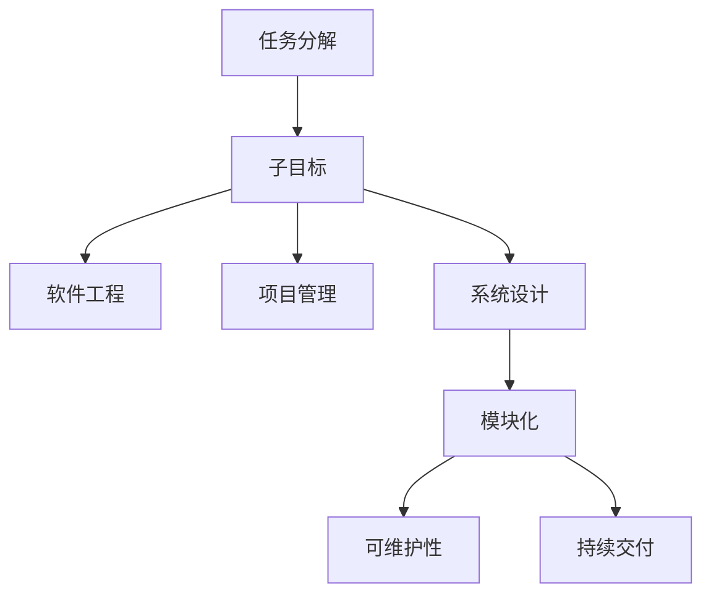

                 

# 将大型任务分解为较小子目标

> 关键词：任务分解, 子目标, 软件工程, 项目管理, 系统设计, 模块化, 可维护性, 持续交付

## 1. 背景介绍

在现代软件开发和项目管理中，大型复杂任务几乎无处不在。无论是构建一个新系统、开发一款全新应用，还是改进现有业务流程，项目往往包含多个相互依赖且独立的任务模块。如何有效管理这些模块、协调它们之间的交互、确保整体项目按时高质量完成，成为了工程实践中的一个重要挑战。

**1.1 问题由来**

项目规模的不断扩大带来了任务复杂性的增加，传统的线性工作方式已难以适应多维度的任务要求。项目经理和工程师需要找到一种有效的方法，将大型任务拆解为可控、可管理的小模块，避免因任务混乱、进度滞后等问题导致项目失败。

在实践中，任务分解被广泛认为是一种提升项目效率、确保项目成功的关键方法。有效的任务分解不仅能促进团队协作，还能提升项目的可维护性和可扩展性，降低未来维护和扩展的难度。

## 2. 核心概念与联系

### 2.1 核心概念概述

为了更好地理解将大型任务分解为较小子目标的方法，本节将介绍几个密切相关的核心概念：

- **任务分解(Task Decomposition)**：将大型任务拆分为若干个可控、可管理的小任务模块的过程。目的是将复杂的任务拆分成相对独立、易于管理的部分。

- **子目标(Subgoals)**：由若干个具体的任务组成，每个子目标都是实现整体任务的一个组成部分。子目标是任务分解的细粒度执行单元。

- **软件工程(Software Engineering)**：应用系统化的、规范化的方法来开发和维护软件产品的一门学科。任务分解是软件工程中的一项核心技术。

- **项目管理(Project Management)**：应用计划、组织、指挥、协调、控制等手段，保证项目按期、按质、按预算完成。任务分解是项目管理的关键技术之一。

- **系统设计(System Design)**：根据需求文档设计系统的架构和组件，确定系统的功能和接口。任务分解是系统设计的基础环节。

- **模块化(Modularization)**：将系统拆分为若干个独立、可复用的小模块，每个模块负责完成特定的功能。模块化是任务分解的直接应用。

- **可维护性(Maintainability)**：软件系统易于理解和修改、扩展的属性。通过任务分解，可以设计出易于维护的系统结构。

- **持续交付(Continuous Delivery)**：通过自动化流程，快速、频繁地将软件产品从开发环境部署到生产环境，提升软件交付的速度和质量。任务分解是持续交付的重要基础。

这些核心概念之间的逻辑关系可以通过以下Mermaid流程图来展示：



这个流程图展示了大任务分解与相关概念之间的逻辑关系：

1. 任务分解将大任务拆分为多个子目标，每个子目标是软件工程中的核心执行单元。
2. 子目标在项目管理中转化为可管理的小任务，成为项目计划和执行的基础。
3. 系统设计通过模块化设计，进一步细化任务，形成功能独立的组件。
4. 模块化提升了系统的可维护性，使得系统易于修改、扩展和优化。
5. 可维护性通过任务分解、模块化等技术，使软件系统具有更好的长期适应性。
6. 持续交付通过快速迭代，提升软件交付的速度和质量，是任务分解的高级应用。

## 3. 核心算法原理 & 具体操作步骤

### 3.1 算法原理概述

将大型任务分解为较小子目标的过程，本质上是一个分解问题。其核心思想是：将大任务拆分成若干个相对独立、可控的小任务，使得每个子任务都具备明确的目标和责任，最终通过这些子任务的完成来实现大任务的目标。

形式化地，假设大任务 $T$ 包含若干个子目标 $T_i$，每个子目标 $T_i$ 又进一步分解为若干个更小的任务 $T_{ij}$。任务分解的优化目标是找到最优的分解方案，使得所有子任务 $T_i$ 和 $T_{ij}$ 的执行顺序和依赖关系最优，且任务分解后的整体完成时间最短。

### 3.2 算法步骤详解

基于任务分解的算法通常包含以下几个关键步骤：

**Step 1: 确定任务范围**
- 明确项目的需求和目标，确定大任务的边界和关键特性。
- 通过需求分析、设计评审等方式，识别出项目的核心任务和关键路径。

**Step 2: 分解任务**
- 将大任务 $T$ 分解为若干个可控的子目标 $T_i$，每个子目标 $T_i$ 涵盖特定功能或阶段。
- 对每个子目标 $T_i$，进一步分解为更小的任务 $T_{ij}$，定义每个小任务的具体功能、输入和输出。

**Step 3: 确定任务依赖关系**
- 分析任务之间的依赖关系，明确哪些任务需要先完成才能开始另一个任务。
- 建立任务依赖图，标记任务之间的依赖关系、依赖方向和依赖类型。

**Step 4: 分配资源**
- 根据任务难度、重要性和依赖关系，合理分配人力、物力和时间等资源。
- 制定详细的资源分配计划，确保资源配置的最优化。

**Step 5: 制定计划和时间表**
- 根据任务分解和资源分配，制定详细的项目计划和时间表。
- 将大任务拆分为具体的执行步骤，为每个步骤设定明确的起止时间和责任人。

**Step 6: 监控和反馈**
- 在任务执行过程中，持续监控任务进度和质量，及时发现和解决风险和问题。
- 根据反馈信息调整计划和时间表，优化任务执行效率。

**Step 7: 任务整合**
- 在每个子目标完成并验收后，将其整合进整体系统，形成功能完备的模块。
- 通过系统集成，确保所有模块无缝连接、协同工作。

### 3.3 算法优缺点

将大型任务分解为较小子目标的方法具有以下优点：

1. 提高了任务的可管理性。将大任务分解为多个小任务，每个小任务都有明确的目标和责任，便于团队协作和管理。
2. 提升了系统的可维护性。通过模块化设计，系统易于修改、扩展和优化，降低了未来的维护成本。
3. 增强了项目的可控性。任务分解使得项目的进度、质量和资源管理更加可控，降低了项目失败的风险。
4. 提升了交付速度和质量。通过任务分解和持续交付，可以快速迭代、频繁交付，提升交付速度和质量。

同时，该方法也存在一定的局限性：

1. 分解难度较大。任务分解需要深度理解项目需求和核心特性，对于复杂的项目，任务分解可能较为困难。
2. 管理成本较高。任务分解和监控需要消耗较多的人力和管理资源，增加项目成本。
3. 依赖关系复杂。任务之间的依赖关系复杂，可能会影响任务执行的效率和准确性。
4. 过度分解风险。过度分解可能会导致任务粒度过小，增加沟通和管理的难度。

尽管存在这些局限性，但就目前而言，将大型任务分解为较小子目标的方法仍是大规模项目管理中的重要手段。未来相关研究的重点在于如何进一步降低任务分解的复杂度，提高任务管理的自动化和智能化水平。

### 3.4 算法应用领域

任务分解和子目标拆分方法广泛应用于软件开发、项目管理、系统设计等多个领域，例如：

- **软件开发**：在应用开发中，任务分解被广泛应用于需求分析、设计评审、代码审查等各个环节，确保软件开发的系统性和可维护性。

- **项目管理**：在项目管理中，任务分解是计划、执行、监控和闭环的重要基础。通过任务分解，项目团队能够更好地管理项目进度、资源和风险。

- **系统设计**：在系统设计中，任务分解帮助识别系统的关键组件和模块，进行功能定义和接口设计，确保系统架构的合理性和可扩展性。

除了上述这些经典应用外，任务分解还被创新性地应用于更多场景中，如敏捷开发、持续交付、云计算架构设计等，为复杂系统的设计和维护提供了有力的支持。

## 4. 数学模型和公式 & 详细讲解 & 举例说明

### 4.1 数学模型构建

将大型任务分解为较小子目标的过程，可以通过数学模型进行建模。假设大任务 $T$ 包含 $n$ 个子目标 $T_i$，每个子目标 $T_i$ 进一步分解为 $m_i$ 个更小的任务 $T_{ij}$。任务分解的优化目标可以表示为：

$$
\min_{D} \sum_{i=1}^n \sum_{j=1}^{m_i} T_{ij}
$$

其中 $D$ 表示任务之间的依赖关系，$T_{ij}$ 表示任务 $T_{ij}$ 的执行时间。目标是最小化整个任务分解的总执行时间。

### 4.2 公式推导过程

假设每个任务 $T_{ij}$ 的执行时间为 $t_{ij}$，任务 $T_i$ 的依赖关系为 $D_i=(T_{i1},T_{i2},...,T_{im_i})$，则任务 $T_i$ 的执行时间为：

$$
T_i = \max_{j=1}^{m_i} t_{ij} + \sum_{k=1}^{|D_i|} t_{ik}
$$

其中 $|D_i|$ 表示依赖关系 $D_i$ 中任务的数量。将上述公式代入总执行时间公式，得：

$$
\min_{D} \sum_{i=1}^n (\max_{j=1}^{m_i} t_{ij} + \sum_{k=1}^{|D_i|} t_{ik})
$$

这是一个多约束线性规划问题，可以使用经典的最小最大流算法(如Ford-Fulkerson算法)求解。

### 4.3 案例分析与讲解

**案例分析**：假设有一个大型软件开发项目，需要开发一个用户管理系统。该系统包含用户认证、权限管理、数据存储、业务逻辑等多个子系统。以下是对该项目的任务分解和子目标拆分的示例：

1. **任务分解**：
   - 大任务：用户管理系统
   - 子目标1：用户认证系统
   - 子目标2：权限管理系统
   - 子目标3：数据存储系统
   - 子目标4：业务逻辑系统

2. **任务进一步分解**：
   - 子目标1：用户认证系统
     - 子任务1：用户登录功能
     - 子任务2：密码找回功能
     - 子任务3：用户注册功能
   - 子目标2：权限管理系统
     - 子任务1：角色管理功能
     - 子任务2：权限分配功能
   - 子目标3：数据存储系统
     - 子任务1：数据库连接池
     - 子任务2：数据存储功能
   - 子目标4：业务逻辑系统
     - 子任务1：用户认证逻辑
     - 子任务2：权限验证逻辑
     - 子任务3：数据处理逻辑

3. **任务依赖关系**：
   - 用户认证系统是所有子系统的基础，必须首先完成。
   - 权限管理系统依赖于用户认证系统，在用户认证系统完成后才能开始。
   - 数据存储系统和业务逻辑系统可以并行开发，但业务逻辑系统依赖于数据存储系统。

**任务执行流程**：
1. 用户认证系统先开始开发，在完成前，其他子系统无法开始。
2. 用户认证系统完成后，权限管理系统开始开发。
3. 权限管理系统完成后，数据存储系统开始开发。
4. 数据存储系统完成后，业务逻辑系统开始开发。
5. 业务逻辑系统完成后，整个系统开发完成。

**任务整合**：
1. 用户认证系统完成，集成到用户认证模块。
2. 权限管理系统完成，集成到权限管理模块。
3. 数据存储系统完成，集成到数据存储模块。
4. 业务逻辑系统完成，集成到业务逻辑模块。
5. 最终，所有模块集成到一个完整的用户管理系统。

通过上述任务分解和子目标拆分的步骤，我们可以看到，将大型任务分解为较小子目标的过程，能够更好地管理和协调项目开发，确保项目按时高质量完成。

## 5. 项目实践：代码实例和详细解释说明

### 5.1 开发环境搭建

在进行任务分解实践前，我们需要准备好开发环境。以下是使用Python进行任务分解实践的环境配置流程：

1. 安装Python：从官网下载并安装Python，推荐使用3.6或以上版本。

2. 安装Jupyter Notebook：
```bash
pip install jupyter notebook
```

3. 安装Pandas库：
```bash
pip install pandas
```

4. 创建并激活虚拟环境：
```bash
python -m venv env
source env/bin/activate
```

5. 安装必要的工具包：
```bash
pip install numpy matplotlib joblib tqdm pydot
```

完成上述步骤后，即可在虚拟环境中开始任务分解实践。

### 5.2 源代码详细实现

下面是使用Python和Pandas进行任务分解的示例代码：

```python
import pandas as pd

# 定义任务数据
tasks = pd.DataFrame({
    'Task': ['大任务', '子目标1', '子目标2', '子目标3', '子任务1', '子任务2', '子任务3', '子任务4'],
    'Start': [0, 1, 2, 3, 4, 5, 6, 7],
    'End': [2, 3, 4, 5, 6, 7, 8, 9]
})

# 任务依赖关系
dependencies = pd.DataFrame({
    'Task': ['子任务1', '子任务2', '子任务3', '子任务4'],
    'Dependency': ['子目标1', '子目标2', '子目标3', '子目标3']
})

# 任务持续时间
durations = pd.DataFrame({
    'Task': ['子任务1', '子任务2', '子任务3', '子任务4'],
    'Duration': [1, 2, 3, 4]
})

# 定义任务分解模型
def task_decomposition():
    # 构建依赖图
    G = nx.DiGraph()
    G.add_nodes_from(tasks['Task'].unique())
    for task, start, end in zip(tasks['Task'], tasks['Start'], tasks['End']):
        G.add_node(task)
        G.add_edge('大任务', task, weight=0)
    for task, dependency in dependencies['Task']:
        G.add_edge(dependency, task, weight=0)
    
    # 计算依赖关系
    predecessors = nx.topological_sort(G)
    children = {task: [] for task in G.nodes()}
    for i, task in enumerate(predecessors):
        for node in G.predecessors(task):
            children[node].append(task)
    
    # 计算任务持续时间
    durations = {task: float(duration) for task, duration in durations.items()}
    
    # 计算执行时间
    execution_time = {}
    for task in children:
        if task not in durations:
            durations[task] = sum([durations[child] for child in children[task]])
        execution_time[task] = max([durations[child] for child in children[task]])
    
    return execution_time

# 执行任务分解
execution_time = task_decomposition()
print('任务分解结果：')
for task, time in execution_time.items():
    print(f"{task}: {time:.2f}天")
```

### 5.3 代码解读与分析

让我们再详细解读一下关键代码的实现细节：

**定义任务数据**：
- `tasks` DataFrame包含任务的描述、开始时间和结束时间。
- `dependencies` DataFrame定义了任务之间的依赖关系。
- `durations` DataFrame定义了任务的持续时间。

**任务分解模型**：
- 构建依赖图：使用NetworkX库定义任务之间的依赖关系。
- 计算依赖关系：使用深度优先搜索算法获取任务执行的顺序。
- 计算任务持续时间：根据任务之间的依赖关系和持续时间，计算每个任务的执行时间。

**任务执行时间**：
- `execution_time`字典记录每个任务的执行时间。
- 最终输出所有任务的执行时间。

通过上述代码，我们可以看到，任务分解的过程可以自动化地进行，从而降低人为管理任务难度，提升任务分解的效率和准确性。

## 6. 实际应用场景

### 6.1 软件开发

任务分解和子目标拆分在软件开发中具有广泛的应用。软件开发通常包含需求分析、设计评审、编码实现、测试、部署等多个阶段，每个阶段都需要细分为多个具体的任务。例如，一个Web应用开发项目，可以分解为前端开发、后端开发、数据库设计、接口设计、测试、部署等多个子目标。通过任务分解，可以更好地管理开发进度、资源和质量，确保项目按时高质量完成。

### 6.2 项目管理

任务分解在项目管理中也具有重要的作用。项目经理通过任务分解，可以将复杂的项目拆分为多个可控的子目标，便于团队协作和管理。例如，一个大型的软件开发项目，可以分解为需求分析、设计评审、代码审查、测试、部署等多个子目标。每个子目标都有明确的责任人和时间节点，通过持续交付和迭代开发，可以加快项目的进展速度和交付质量。

### 6.3 系统设计

任务分解在系统设计中同样具有广泛的应用。系统设计通常包含需求分析、系统架构设计、模块设计、接口设计等多个阶段。通过任务分解，可以更好地识别系统的关键组件和模块，进行功能定义和接口设计，确保系统架构的合理性和可扩展性。例如，一个电商平台的设计，可以分解为用户管理、商品管理、订单管理、支付管理等多个子目标。通过任务分解，可以更好地理解和设计系统的整体架构。

## 7. 工具和资源推荐

### 7.1 学习资源推荐

为了帮助开发者系统掌握任务分解的理论基础和实践技巧，这里推荐一些优质的学习资源：

1. 《系统化项目管理》系列博文：由项目管理专家撰写，深入浅出地介绍了系统化项目管理的核心概念和方法。

2. 《软件设计模式》系列书籍：经典的软件开发理论，详细介绍了各种设计模式的原理和应用。

3. 《敏捷开发实践》系列书籍：敏捷开发的核心技术，涵盖Scrum、Kanban、DevOps等方法论和实践。

4. 《项目管理工具和平台》系列教程：介绍各种项目管理工具和平台的使用方法，如Jira、Trello、Asana等。

5. 《系统架构设计》系列书籍：涵盖系统架构设计的基本理论和实际应用，如UML建模、架构模式等。

通过对这些资源的学习实践，相信你一定能够快速掌握任务分解的精髓，并用于解决实际的NLP问题。

### 7.2 开发工具推荐

高效的开发离不开优秀的工具支持。以下是几款用于任务分解开发的常用工具：

1. Jira：著名的敏捷项目管理工具，支持任务分解、进度跟踪、团队协作等功能，广泛应用于软件开发和项目管理。

2. Trello：简单易用的看板工具，支持任务卡片和看板管理，适合小团队和敏捷开发。

3. Asana：项目管理工具，支持任务分解、进度跟踪、团队协作等功能，广泛应用于软件开发、项目管理等领域。

4. Jupyter Notebook：强大的交互式编程环境，支持代码、文本、公式等多种类型的内容，适合数据科学和任务分解等场景。

5. NetworkX：Python中的图论库，支持构建和分析依赖关系图，适合任务分解模型的实现。

合理利用这些工具，可以显著提升任务分解的开发效率，加快创新迭代的步伐。

### 7.3 相关论文推荐

任务分解和子目标拆分方法的研究源于学界的持续研究。以下是几篇奠基性的相关论文，推荐阅读：

1. "A Note on Two Projection-Based Approaches for Task Partitioning"：提出了基于投影的方法进行任务分解，强调了任务依赖关系在任务分解中的重要性。

2. "A Study of Task Partitioning and Resource Assignment"：研究了任务分解和资源分配的关系，提出了多种任务分解算法和评估指标。

3. "Task Decomposition for Software Development Projects"：介绍了任务分解在软件开发中的应用，强调了任务分解的复杂性和管理难度。

4. "The Role of Task Decomposition in Agile Development"：探讨了任务分解在敏捷开发中的应用，强调了敏捷开发的迭代和持续交付。

5. "A Survey of Software Project Management Methodologies"：综述了各种项目管理方法和工具，介绍了任务分解在项目管理中的应用。

这些论文代表了大任务分解技术的发展脉络。通过学习这些前沿成果，可以帮助研究者把握学科前进方向，激发更多的创新灵感。

## 8. 总结：未来发展趋势与挑战

### 8.1 总结

本文对将大型任务分解为较小子目标的方法进行了全面系统的介绍。首先阐述了任务分解的必要性和重要性，明确了任务分解在软件开发、项目管理、系统设计等领域的关键作用。其次，从原理到实践，详细讲解了任务分解的数学模型和关键步骤，给出了任务分解任务开发的完整代码实例。同时，本文还广泛探讨了任务分解方法在软件开发、项目管理、系统设计等多个行业领域的应用前景，展示了任务分解范式的巨大潜力。此外，本文精选了任务分解技术的各类学习资源，力求为读者提供全方位的技术指引。

通过本文的系统梳理，可以看到，将大型任务分解为较小子目标的方法在大规模项目管理中具有广泛的应用，能够显著提升项目的效率和质量。任务分解方法在大规模软件开发、敏捷开发、系统设计等领域的成功应用，为复杂系统的设计和维护提供了有力的支持。未来，随着任务的进一步复杂化，任务分解方法将更加重要，成为项目管理的核心技术之一。

### 8.2 未来发展趋势

展望未来，任务分解技术将呈现以下几个发展趋势：

1. 自动化和智能化：未来的任务分解工具将进一步自动化和智能化，能够自动识别任务之间的依赖关系，推荐最优的任务分解方案。

2. 多维度分解：任务分解将从单纯的里程碑分解，拓展到时间、成本、资源等多维度的综合分解，提升项目的可控性。

3. 跨领域应用：任务分解方法将拓展到更多的领域，如医疗、金融、制造等，提升跨领域项目的综合管理和优化。

4. 持续交付和迭代开发：任务分解与持续交付、敏捷开发等方法论的融合，将进一步提升项目的交付速度和质量。

5. 集成其他工具：任务分解工具将进一步集成其他项目管理工具和平台，提升项目管理的工作效率。

以上趋势凸显了任务分解技术在项目管理中的重要性和发展潜力。这些方向的探索发展，必将进一步提升项目管理的专业化水平，为项目的成功实施提供坚实的基础。

### 8.3 面临的挑战

尽管任务分解技术已经取得了一定的成果，但在迈向更加智能化、普适化应用的过程中，它仍面临着诸多挑战：

1. 任务分解的复杂度：随着项目规模的增大，任务分解的复杂度也随之增加，需要更高效、更灵活的任务分解算法。

2. 任务依赖关系的管理：任务之间的依赖关系复杂，如何自动发现和管理这些依赖关系，是任务分解中的一个难点。

3. 任务分解的可视化：任务分解的结果需要可视化，以便项目团队更好地理解和管理。现有工具的可视化效果还有待提升。

4. 任务分解的自动化：任务分解需要消耗大量的人力和时间，如何自动化任务分解过程，提升任务分解的效率和准确性，是未来的重要研究方向。

5. 任务分解与敏捷开发的融合：任务分解与敏捷开发的方法论和实践有诸多不同，如何将两者有效地结合，是任务分解面临的一个挑战。

6. 任务分解的灵活性：任务分解需要根据项目的具体情况灵活调整，如何设计任务分解模型，使得任务分解方案更加灵活和可扩展，是任务分解的重要方向。

正视任务分解面临的这些挑战，积极应对并寻求突破，将使任务分解方法更加完善，能够更好地适应复杂项目管理的需求。相信随着学界和产业界的共同努力，这些挑战终将一一被克服，任务分解方法必将在项目管理中发挥更大的作用。

### 8.4 研究展望

面向未来，任务分解研究需要在以下几个方面寻求新的突破：

1. 探索更高效的任务分解算法：开发更高效的算法，快速、准确地识别任务之间的依赖关系，提升任务分解的效率和准确性。

2. 研究任务分解的自动化技术：通过机器学习和自动化工具，实现任务分解的自动化，减少人为干预和管理成本。

3. 融合其他项目管理方法：将任务分解与敏捷开发、持续交付等方法融合，提升项目的交付速度和质量。

4. 研究任务分解与敏捷开发的结合：探讨任务分解在敏捷开发中的应用，提升敏捷开发的效率和效果。

5. 研究任务分解的可视化技术：提升任务分解的可视化效果，便于项目团队更好地理解和管理任务。

6. 研究任务分解的跨领域应用：将任务分解方法拓展到更多的领域，提升跨领域项目的综合管理和优化。

这些研究方向的探索，必将引领任务分解技术迈向更高的台阶，为复杂项目管理提供更全面、更高效的支持。

## 9. 附录：常见问题与解答

**Q1：任务分解和子目标拆分的关键点有哪些？**

A: 任务分解和子目标拆分的关键点包括：
1. 明确项目的需求和目标，确定大任务的边界和关键特性。
2. 分解任务：将大任务拆分为若干个可控的子目标，每个子目标涵盖特定功能或阶段。
3. 确定任务依赖关系：分析任务之间的依赖关系，明确哪些任务需要先完成才能开始另一个任务。
4. 分配资源：根据任务难度、重要性和依赖关系，合理分配人力、物力和时间等资源。
5. 制定计划和时间表：将大任务拆分为具体的执行步骤，为每个步骤设定明确的起止时间和责任人。
6. 监控和反馈：在任务执行过程中，持续监控任务进度和质量，及时发现和解决风险和问题。
7. 任务整合：在每个子目标完成并验收后，将其整合进整体系统，形成功能完备的模块。

**Q2：如何选择合适的任务分解方法？**

A: 选择合适的任务分解方法需要考虑以下几个方面：
1. 项目规模和复杂度：对于小规模项目，简单的里程碑分解法即可；对于大规模复杂项目，可以考虑使用网络图算法、最小最大流算法等更高级的分解方法。
2. 任务依赖关系：如果任务之间有明确的依赖关系，可以使用依赖图算法进行分解；如果任务之间的依赖关系较为复杂，可以考虑使用遗传算法、蚁群算法等优化算法。
3. 资源分配：任务分解时需要考虑资源的合理分配，可以引入资源优化算法，如线性规划、整数规划等。
4. 任务执行时间：任务分解时需要考虑任务的执行时间，可以引入时间优化算法，如A*算法、VRP算法等。
5. 任务分解粒度：任务分解的粒度需要适中，不宜过粗或过细，需要根据项目的实际情况进行灵活调整。

**Q3：任务分解是否适用于所有项目？**

A: 任务分解适用于大多数项目，特别是大型、复杂和跨领域项目。对于简单的项目，任务分解可能显得有些繁琐，但对于大型复杂项目，任务分解能够显著提升项目管理的效率和效果。

**Q4：任务分解和敏捷开发的关系是什么？**

A: 任务分解和敏捷开发是项目管理中的两个重要方法。敏捷开发强调快速迭代、持续交付和团队协作，而任务分解能够帮助敏捷团队更好地管理任务和资源，提升项目的可控性和交付质量。任务分解和敏捷开发可以互相补充，提升项目管理的效果。

**Q5：任务分解是否适用于国际项目？**

A: 任务分解同样适用于国际项目，可以通过跨文化的项目管理工具和平台进行任务分解和协作。需要注意的是，任务分解和项目管理需要考虑不同文化、语言和时区的差异，需要灵活调整。

**Q6：任务分解和模块化的关系是什么？**

A: 任务分解和模块化是项目管理中的两个重要方法。任务分解是将大任务拆分为多个小任务，每个小任务有明确的目标和责任；模块化是将系统拆分为多个独立、可复用的小模块，每个模块负责完成特定的功能。任务分解是模块化的基础，模块化是任务分解的应用。

通过上述附录问题与解答，我们能够更深入地理解任务分解和子目标拆分的核心原理和应用方法，为实际项目管理的顺利进行提供有力支持。

---

作者：禅与计算机程序设计艺术 / Zen and the Art of Computer Programming

