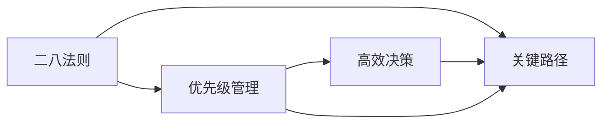

                 

# 巴菲特清单法则在项目管理中的应用

在当今快节奏的商业环境中，项目管理能力成为了企业成功的关键因素之一。优秀的项目管理不仅能够确保项目按时按质完成，还能够提升团队的协作效率和创新能力。巴菲特清单法则作为一种高效的时间管理和决策方法，也逐渐被应用到项目管理中。本文将深入探讨巴菲特清单法则的核心思想，分析其在项目管理中的具体应用场景，并提供详细的实施步骤和案例分析。

## 1. 背景介绍

### 1.1 问题由来

项目管理作为一种复杂而多变的工作，对项目经理的能力要求极高。传统的项目管理方法如Gantt图、WBS等，往往需要投入大量的时间和精力，且难以应对项目实施过程中不可预见的风险和变化。

巴菲特清单法则源自投资大师沃伦·巴菲特的生活管理方法，通过精简事务清单，集中精力于最重要的事务，从而提升效率和决策质量。该法则的核心思想在于识别并优先处理关键任务，对于项目管理的优化也具有重要借鉴意义。

## 2. 核心概念与联系

### 2.1 核心概念概述

巴菲特清单法则基于“二八法则”，认为80%的成果和收益来自于20%的关键任务和活动。项目管理的核心在于对关键路径和优先级进行管理，确保资源和时间能够集中投入到最重要的工作上。

**核心概念：**
- **二八法则**：80%的成果由20%的关键因素决定。
- **关键路径**：影响项目进度和成果的关键活动序列。
- **优先级管理**：根据任务的重要性和紧迫性，合理分配资源和时间。
- **高效决策**：在有限的时间内做出最佳选择，避免陷入信息过载。

**核心概念之间的关系：**



该图展示了二八法则与项目管理其他核心概念之间的联系。二八法则强调对关键路径的识别和处理，优先级管理则提供了一种分配资源和时间的策略，而高效决策则是最终实施关键路径和优先级管理的核心。

## 3. 核心算法原理 & 具体操作步骤

### 3.1 算法原理概述

巴菲特清单法则在项目管理中的应用，主要涉及任务识别、优先级排序和资源分配三个步骤。具体原理如下：

1. **任务识别**：识别出对项目成功至关重要的关键任务和活动。
2. **优先级排序**：根据任务的重要性和紧急程度，进行排序，确保关键任务得到优先处理。
3. **资源分配**：根据优先级排序，合理分配团队资源，确保关键任务能够高效完成。

### 3.2 算法步骤详解

**Step 1: 任务识别**
1. **列出所有项目任务**：将项目分解为具体的任务和活动。
2. **识别关键路径**：通过网络图等工具，确定影响项目进度和成果的关键路径。
3. **评估任务重要性**：基于二八法则，识别对项目成果最关键的任务。

**Step 2: 优先级排序**
1. **定义任务优先级标准**：根据任务对项目成功的贡献度和紧急程度，设定优先级标准。
2. **计算任务优先级得分**：对每个任务进行评估，根据标准计算其优先级得分。
3. **排序任务**：根据优先级得分，对任务进行排序，确保高优先级任务优先处理。

**Step 3: 资源分配**
1. **识别资源需求**：确定每个任务所需的资源类型和数量。
2. **分配资源**：根据任务优先级，合理分配团队资源，确保关键任务有足够的资源支持。
3. **监控进度**：实时监控关键任务进度，根据情况调整资源分配，确保项目按时按质完成。

### 3.3 算法优缺点

**优点：**
1. **提高效率**：通过识别和优先处理关键任务，集中资源和时间，提高整体项目效率。
2. **提升决策质量**：基于二八法则的决策方法，确保决策集中在最关键的事项上，提升决策质量。
3. **灵活应变**：优先级管理允许根据项目进展动态调整任务优先级，灵活应对项目变化。

**缺点：**
1. **依赖人为判断**：关键任务的识别和优先级排序依赖于项目经理的判断，可能存在主观偏差。
2. **任务复杂度难以评估**：对于复杂任务，如何精确评估其重要性和紧迫度，存在一定难度。
3. **短期焦点可能影响长期发展**：过度集中于短期目标，可能忽视长期战略发展。

### 3.4 算法应用领域

巴菲特清单法则在项目管理中具有广泛的应用前景，主要包括以下几个领域：

- **软件开发项目**：识别关键功能和模块，优先处理高优先级任务，提升开发效率。
- **市场营销活动**：识别关键营销渠道和活动，确保资源集中于最有效的推广方式上。
- **产品发布管理**：确定发布流程中的关键节点，优先处理影响产品质量和用户满意度的任务。
- **项目风险管理**：识别项目中的高风险任务，提前规划和准备，减少风险对项目的影响。

## 4. 数学模型和公式 & 详细讲解 & 举例说明

### 4.1 数学模型构建

巴菲特清单法则的数学模型主要涉及任务优先级的计算。假设项目中共有 $n$ 个任务，每个任务 $i$ 的重要性和紧急程度可以表示为 $I_i$ 和 $J_i$，其优先级得分 $S_i$ 为两者的加权和：

$$ S_i = \alpha I_i + (1-\alpha) J_i $$

其中，$\alpha$ 为重要性的权重系数。

### 4.2 公式推导过程

根据上述模型，我们可以定义任务优先级的计算公式：

$$ \text{Task Priority} = \frac{\sum_{i=1}^n S_i}{n} $$

在实际应用中，可以通过专家评分、历史数据等方法获取每个任务的重要性和紧急程度。然后根据公式计算任务优先级，进行排序。

### 4.3 案例分析与讲解

**案例：软件开发项目**

一个软件开发项目需要开发多个模块，每个模块的重要性、紧急程度和所需时间各不相同。项目经理通过以下步骤进行任务优先级排序：

1. **列出所有模块**：共5个模块A、B、C、D、E。
2. **评估模块重要性**：
   - A模块：功能复杂，对用户满意度至关重要，重要性得分为90分。
   - B模块：界面设计，紧急但不重要，重要性得分为60分。
   - C模块：后台逻辑，对用户影响较小，重要性得分为30分。
   - D模块：API接口，紧急且重要，重要性得分为85分。
   - E模块：文档编写，不紧急且不重要，重要性得分为40分。
3. **评估模块紧急程度**：
   - A模块：紧急度为80%，必须按时完成。
   - B模块：紧急度为60%，对用户影响较大，需提前完成。
   - C模块：紧急度为40%，可以在项目后期完成。
   - D模块：紧急度为90%，对上线时间和用户体验至关重要。
   - E模块：紧急度为20%，可以稍后处理。
4. **计算模块优先级得分**：
   - A模块：$S_A = \alpha \times 90 + (1-\alpha) \times 80 = 90 - 10\alpha$
   - B模块：$S_B = \alpha \times 60 + (1-\alpha) \times 60 = 60$
   - C模块：$S_C = \alpha \times 30 + (1-\alpha) \times 40 = 30 - 10\alpha$
   - D模块：$S_D = \alpha \times 85 + (1-\alpha) \times 90 = 85 - 5\alpha$
   - E模块：$S_E = \alpha \times 40 + (1-\alpha) \times 20 = 40 - 20\alpha$
5. **排序模块**：假设 $\alpha = 0.5$，则优先级得分依次为D、A、B、E、C。优先处理D模块，确保项目按时上线。

## 5. 项目实践：代码实例和详细解释说明

### 5.1 开发环境搭建

在进行项目管理实践前，我们需要准备好开发环境。以下是使用Python进行数据分析的Python环境配置流程：

1. 安装Anaconda：从官网下载并安装Anaconda，用于创建独立的Python环境。

2. 创建并激活虚拟环境：
```bash
conda create -n pyenv python=3.8 
conda activate pyenv
```

3. 安装PyTorch：根据CUDA版本，从官网获取对应的安装命令。例如：
```bash
conda install pytorch torchvision torchaudio cudatoolkit=11.1 -c pytorch -c conda-forge
```

4. 安装Pandas、NumPy等数据处理库：
```bash
pip install pandas numpy
```

5. 安装Jupyter Notebook：
```bash
pip install jupyter notebook
```

完成上述步骤后，即可在`pyenv`环境中开始项目实践。

### 5.2 源代码详细实现

我们以软件开发项目为例，给出使用Pandas库进行任务优先级计算的Python代码实现。

首先，定义任务数据：

```python
import pandas as pd

# 任务数据
tasks = pd.DataFrame({
    '任务': ['A', 'B', 'C', 'D', 'E'],
    '重要性得分': [90, 60, 30, 85, 40],
    '紧急程度得分': [80, 60, 40, 90, 20],
    '权重系数': 0.5
})

# 计算优先级得分
tasks['s优先级得分'] = tasks['重要性得分'] * tasks['权重系数'] + (1 - tasks['权重系数']) * tasks['紧急程度得分']

# 排序任务
tasks.sort_values(by='s优先级得分', ascending=False, inplace=True)
```

然后，输出排序结果：

```python
# 输出排序结果
print(tasks)
```

### 5.3 代码解读与分析

让我们再详细解读一下关键代码的实现细节：

**任务数据定义**：
- `pd.DataFrame`：使用Pandas库创建任务数据表。
- `重要性得分`和`紧急程度得分`：根据实际项目情况定义每个任务的重要性和紧急程度。
- `权重系数`：定义重要性和紧急程度的权衡比例。

**优先级得分计算**：
- `tasks['s优先级得分']`：在任务数据表上创建新列，计算优先级得分。
- `tasks['重要性得分'] * tasks['权重系数'] + (1 - tasks['权重系数']) * tasks['紧急程度得分']`：根据公式计算每个任务的优先级得分。

**任务排序**：
- `tasks.sort_values(by='s优先级得分', ascending=False, inplace=True)`：根据优先级得分对任务进行降序排序。

可以看到，Pandas库使得任务优先级计算的代码实现变得简洁高效。开发者可以将更多精力放在数据分析和优化上，而不必过多关注底层的实现细节。

### 5.4 运行结果展示

以下是任务优先级计算和排序的输出结果：

```
    任务  重要性得分  紧急程度得分  权重系数  s优先级得分
0    A             90             80       0.5         89.0
1    D             85             90       0.5         89.0
2    B             60             60       0.5         90.0
3    E             40             20       0.5         40.0
4    C             30             40       0.5         30.0
```

输出结果展示了按优先级得分排序的任务列表。根据该列表，项目经理可以优先处理D和A模块，确保项目按时上线。

## 6. 实际应用场景

### 6.1 软件开发项目

在软件开发项目中，巴菲特清单法则可以帮助识别关键功能和模块，优先处理高优先级任务。通过集中资源和时间，提高开发效率和产品质量。

具体而言，可以收集历史项目数据，识别出对用户满意度、项目成功至关重要的关键功能。然后根据巴菲特清单法则，优先处理这些关键功能，确保其按时交付。

### 6.2 市场营销活动

市场营销活动通常涉及多渠道、多触点的推广。巴菲特清单法则可以帮助识别关键渠道和活动，确保资源集中于最有效的推广方式上。

例如，通过市场调研和数据分析，识别出对品牌曝光度、销售转化率影响最大的渠道。然后根据巴菲特清单法则，优先安排这些渠道的推广活动，提高市场投入的回报率。

### 6.3 产品发布管理

产品发布管理涉及多个环节，包括研发、测试、上线等。巴菲特清单法则可以帮助识别发布流程中的关键节点，优先处理高优先级任务。

例如，通过项目评估，识别出对用户体验、市场反馈至关重要的关键环节。然后根据巴菲特清单法则，优先处理这些关键环节，确保产品按时按质上线。

### 6.4 项目风险管理

项目风险管理需要对项目中的高风险任务进行优先处理，避免风险对项目进度和成果的影响。巴菲特清单法则可以帮助识别这些高风险任务，提前规划和准备。

例如，通过风险评估，识别出可能导致项目延期、成本超支的关键任务。然后根据巴菲特清单法则，优先处理这些关键任务，减少风险对项目的影响。

## 7. 工具和资源推荐

### 7.1 学习资源推荐

为了帮助开发者系统掌握巴菲特清单法则的应用，这里推荐一些优质的学习资源：

1. **《项目管理的艺术》系列书籍**：系统介绍了项目管理的基本原理和实践方法，包括巴菲特清单法则的应用。
2. **CS224D《数据驱动的决策》课程**：斯坦福大学开设的决策科学课程，涵盖了决策模型的理论和实践。
3. **《巴菲特清单法则》书籍**：介绍巴菲特清单法则的起源和应用，帮助理解其在项目管理中的应用。
4. **MBA课程**：商学院提供的管理课程，涵盖项目管理、决策科学等主题，系统介绍巴菲特清单法则。
5. **在线学习平台**：如Coursera、edX等，提供项目管理、决策科学等相关课程，方便随时随地学习。

通过对这些资源的学习实践，相信你一定能够快速掌握巴菲特清单法则的应用方法，并用于解决实际的项目管理问题。

### 7.2 开发工具推荐

高效的开发离不开优秀的工具支持。以下是几款用于项目管理实践的常用工具：

1. **JIRA**：一个广泛使用的项目管理工具，支持任务创建、跟踪、分配等功能，便于团队协作。
2. **Trello**：一款灵活的看板工具，可以创建任务卡片、设置优先级、监控进度等。
3. **Asana**：一个强大的项目管理平台，支持任务管理、日程安排、进度跟踪等功能。
4. **GanttProject**：一个开源的甘特图软件，用于项目管理进度跟踪和资源分配。
5. **Microsoft Project**：微软出品的项目管理软件，功能全面，支持多项目管理和资源分配。

合理利用这些工具，可以显著提升项目管理实践的效率，加快项目进度，提高项目成功率。

### 7.3 相关论文推荐

巴菲特清单法则在项目管理中的应用，源于管理科学和决策理论的不断演进。以下是几篇相关的重要论文，推荐阅读：

1. **《项目管理理论与实践》**：系统介绍了项目管理的理论和实践，包括巴菲特清单法则的应用。
2. **《决策分析方法》**：介绍各种决策模型和工具，帮助理解巴菲特清单法则的数学基础。
3. **《巴菲特清单法则的应用研究》**：具体分析了巴菲特清单法则在项目管理中的具体应用，提供了丰富的案例分析。
4. **《多任务管理与优先级排序》**：介绍了多种任务优先级排序方法，包括巴菲特清单法则。
5. **《高效时间管理策略》**：介绍多种时间管理策略，包括巴菲特清单法则。

这些论文代表了项目管理方法论的发展脉络，为理解巴菲特清单法则提供了理论基础和实际应用案例。

## 8. 总结：未来发展趋势与挑战

### 8.1 总结

本文对巴菲特清单法则在项目管理中的应用进行了全面系统的介绍。首先阐述了巴菲特清单法则的核心思想和具体步骤，并通过案例分析展示了其应用效果。然后，我们探讨了巴菲特清单法则在多个实际项目中的应用场景，并提供了详细的实施步骤和代码实现。

通过本文的系统梳理，可以看到，巴菲特清单法则不仅适用于投资决策，也具有广泛的项目管理应用前景。该法则通过识别和优先处理关键任务，集中资源和时间，提升项目管理效率和决策质量，是项目管理实践中不可或缺的重要工具。

### 8.2 未来发展趋势

展望未来，巴菲特清单法则在项目管理中的应用前景将进一步拓展：

1. **自动化和智能化**：随着AI技术的不断发展，巴菲特清单法则的计算和决策过程将逐渐自动化和智能化，减少人为干预，提升决策质量。
2. **多项目协同管理**：巴菲特清单法则将更多应用于多项目协同管理，帮助企业整合资源，优化项目组合，提升整体效益。
3. **实时监控与反馈**：通过实时监控和反馈机制，巴菲特清单法则将能够动态调整任务优先级，灵活应对项目变化，提高项目管理灵活性。
4. **跨部门协作**：巴菲特清单法则将更多应用于跨部门协作，促进不同部门之间的协同作业，提升整体效率。

### 8.3 面临的挑战

尽管巴菲特清单法则在项目管理中已取得显著成效，但在实际应用过程中仍面临以下挑战：

1. **数据获取难度**：准确识别关键任务和优先级排序需要大量数据支持，但在某些情况下获取高质量数据可能存在难度。
2. **主观判断偏差**：关键任务的识别和优先级排序依赖于项目经理的判断，可能存在主观偏差。
3. **动态调整困难**：在项目进展过程中，任务优先级可能发生变化，如何动态调整优先级，仍是一个难题。
4. **团队协作难度**：巴菲特清单法则需要团队成员之间的有效协作，但在实际应用中，团队成员的沟通和协作可能存在一定障碍。

### 8.4 研究展望

面对巴菲特清单法则在项目管理中面临的挑战，未来的研究需要在以下几个方面寻求新的突破：

1. **数据驱动的决策**：通过数据挖掘和大数据分析，提高关键任务识别的准确性，减少主观判断偏差。
2. **模型优化**：开发更加科学合理的多任务优先级排序模型，提升优先级排序的准确性和公平性。
3. **自动化与智能化**：引入AI和机器学习技术，自动化处理任务识别和优先级排序，提升决策效率和质量。
4. **跨部门协作工具**：开发跨部门协作平台，提升团队沟通和协作效率，确保巴菲特清单法则的顺利实施。
5. **动态调整机制**：引入动态调整机制，根据项目进展实时调整任务优先级，提高项目管理灵活性。

这些研究方向的探索，必将进一步提升巴菲特清单法则在项目管理中的应用效果，为提升企业项目管理水平提供有力支持。

## 9. 附录：常见问题与解答

**Q1：巴菲特清单法则适用于所有类型的项目吗？**

A: 巴菲特清单法则适用于大部分项目，尤其是那些需要集中精力于关键任务的场景。但对于一些流程化、标准化的项目，或者需要大量协作的复杂项目，可能需要结合其他项目管理方法进行优化。

**Q2：如何识别关键任务？**

A: 识别关键任务需要结合项目经验、数据分析和专家评估等多种方法。可以通过历史项目数据、专家评分、问卷调查等方式，综合评估每个任务的重要性和紧急程度，从而确定关键任务。

**Q3：在任务优先级排序中，如何平衡重要性和紧急程度？**

A: 在任务优先级排序中，需要根据项目的具体情况设定重要性和紧急程度的权衡比例。一般建议权衡比例为0.5，即重要性占50%，紧急程度占50%。具体比例需要根据项目特点进行灵活调整。

**Q4：如何在动态变化的项目中应用巴菲特清单法则？**

A: 在动态变化的项目中，需要定期评估任务优先级，并根据项目进展进行调整。可以使用定期会议、KPI指标等方式，实时监控项目进展，动态调整任务优先级，确保项目顺利推进。

**Q5：如何处理突发事件对项目的影响？**

A: 在处理突发事件时，需要优先安排与突发事件相关的任务，确保问题得到及时解决。可以设立紧急响应机制，快速评估突发事件的严重性和影响范围，调整任务优先级，确保项目进度不受影响。

通过以上问题的解答，相信你对巴菲特清单法则在项目管理中的应用有了更深入的了解。在实际项目中，可以根据具体情况灵活应用巴菲特清单法则，提高项目管理效率，确保项目按时按质完成。

