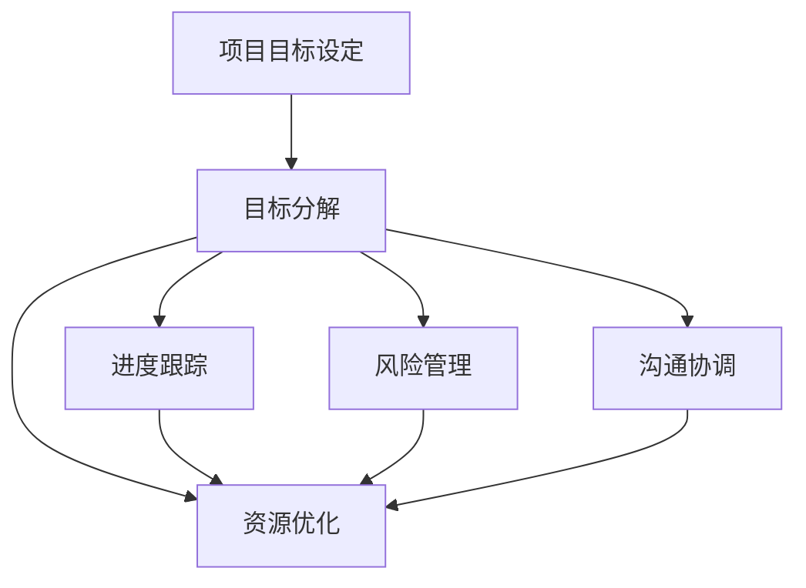

                 

# 巴菲特目标管理法则在项目管理中的应用

## 1. 背景介绍

### 1.1 问题由来
在项目管理领域，如何有效管理项目进度、资源和风险，一直是困扰项目管理者的难题。项目通常面临时间紧、任务重、资源限制等挑战，容易偏离预定的目标，导致项目延期、预算超支、质量不达标等风险。因此，如何制定合理的目标并确保目标的实现，成为项目管理的首要任务。

### 1.2 问题核心关键点
项目管理中的目标管理主要包含以下几个核心关键点：
- **目标设定**：明确项目目标和里程碑。
- **目标分解**：将大目标分解为小目标，确保每个阶段都有明确的任务。
- **进度跟踪**：实时监控项目进度，及时发现偏差。
- **风险管理**：识别和管理项目风险，降低不确定性。
- **资源优化**：合理配置和管理项目资源，提高资源利用效率。
- **沟通协调**：加强团队沟通，确保目标一致和任务协同。

这些关键点构成了项目管理的基石，需要综合运用各种方法和工具，确保项目顺利达成目标。

### 1.3 问题研究意义
巴菲特目标管理法则，即80/20法则（二八法则），通过重点关注和高效利用关键资源，提升项目管理效率和效果。应用该法则于项目管理，有助于提高资源配置效率，优化项目进度，降低风险，确保项目高质量交付。

## 2. 核心概念与联系

### 2.1 核心概念概述

巴菲特目标管理法则，是基于帕累托原则（Pareto Principle）提出的一种管理方法。该法则认为，在任何一组事物中，最重要的只占其中一小部分，约20%，而其余80%则相对次要。在项目管理中，应用该法则意味着要重点关注那些最关键的项目任务和资源，通过有效管理，实现项目目标。

**80/20法则的核心要素包括：**
- **关键任务**：识别和优先处理对项目目标至关重要的任务。
- **关键资源**：合理配置和利用项目中最重要的资源。
- **关键进度**：监控和调整项目进度，确保关键任务按时完成。
- **关键风险**：识别和应对可能影响项目成功的重大风险。

这些要素通过系统的目标管理和资源配置，提升项目管理效率和效果，确保项目成功交付。

### 2.2 核心概念原理和架构的 Mermaid 流程图



该流程图展示了巴菲特目标管理法则在项目管理中的应用流程：

1. **项目目标设定**：首先明确项目目标和里程碑。
2. **目标分解**：将项目目标分解为小目标，确保每个阶段都有明确的任务。
3. **进度跟踪**：实时监控项目进度，及时发现偏差。
4. **风险管理**：识别和管理项目风险，降低不确定性。
5. **资源优化**：合理配置和管理项目资源，提高资源利用效率。
6. **沟通协调**：加强团队沟通，确保目标一致和任务协同。

这些步骤构成了一个闭环，确保项目按计划执行，达成目标。

## 3. 核心算法原理 & 具体操作步骤

### 3.1 算法原理概述

巴菲特目标管理法则的核心算法原理是识别并重点关注最关键的项目任务和资源。通过优先处理这些任务，最大化资源利用效率，确保项目关键目标的达成。

**主要算法步骤包括：**
1. **识别关键任务**：通过任务重要性和紧急性分析，识别出最关键的任务。
2. **分配关键资源**：优先配置关键任务所需的资源，确保资源高效利用。
3. **监控关键进度**：实时跟踪关键任务进度，及时发现偏差并调整。
4. **管理关键风险**：识别并管理可能影响项目成功的重大风险，降低风险对项目的影响。

### 3.2 算法步骤详解

1. **识别关键任务**
   - **任务重要性分析**：通过计算任务对项目成功的影响程度，识别出关键任务。
   - **任务紧急性分析**：通过计算任务需要在多长时间内完成，识别出紧急任务。
   - **综合分析**：综合考虑任务的重要性和紧急性，确定最终的关键任务。

2. **分配关键资源**
   - **资源识别**：识别项目中最重要的资源，如人力资源、设备、资金等。
   - **资源优先级排序**：根据资源对关键任务的支持程度，对资源进行优先级排序。
   - **资源分配**：优先配置关键任务所需的资源，确保关键任务按时完成。

3. **监控关键进度**
   - **进度跟踪**：实时监控关键任务的进度，确保按计划执行。
   - **偏差分析**：发现进度偏差后，分析原因并进行调整。
   - **进度调整**：根据进度偏差情况，调整项目计划和资源配置。

4. **管理关键风险**
   - **风险识别**：识别可能影响项目成功的重大风险，如技术风险、市场风险等。
   - **风险评估**：评估每个风险的严重程度和影响范围。
   - **风险应对**：制定应对策略，降低风险对项目的影响。

### 3.3 算法优缺点

#### 优点
- **提高效率**：通过识别并优先处理关键任务，最大化资源利用效率。
- **降低风险**：识别和管理重大风险，降低项目失败的可能性。
- **增强目标一致性**：确保项目团队关注关键目标，提高项目成功率。
- **简化管理**：通过聚焦关键任务和资源，简化项目管理流程。

#### 缺点
- **忽视次要任务**：可能导致次要任务的延误，影响项目整体效果。
- **资源配置不均**：关键资源可能过度集中，导致资源浪费。
- **过度依赖关键任务**：关键任务的失败可能对项目产生重大影响。

### 3.4 算法应用领域

巴菲特目标管理法则在项目管理中的应用非常广泛，适用于各种类型的项目，包括软件开发、建筑施工、市场营销等。特别适用于以下几种应用场景：

- **大型复杂项目**：如软件开发、大型基础设施建设，需要重点关注关键任务和资源。
- **资源有限的短周期项目**：如市场推广、紧急维修等，需要合理配置资源，确保项目高效完成。
- **高风险项目**：如新产品开发、复杂技术研发等，需要识别和管理重大风险，降低不确定性。
- **跨部门协作项目**：如企业内部跨部门合作项目，需要加强沟通协调，确保目标一致。

## 4. 数学模型和公式 & 详细讲解 & 举例说明

### 4.1 数学模型构建

在项目管理中，巴菲特目标管理法则可以通过以下数学模型进行建模和计算：

1. **任务重要性-紧急性矩阵**
   - **重要性**：$I_i$：任务对项目成功的影响程度。
   - **紧急性**：$E_i$：任务需要在多长时间内完成。
   - **任务优先级**：$P_i = \frac{I_i}{E_i}$。

2. **资源分配模型**
   - **资源需求**：$R_j$：关键任务对资源的需求量。
   - **资源可用量**：$S_j$：项目中可用的资源量。
   - **资源分配比例**：$\alpha_j = \frac{R_j}{\sum_{k=1}^n R_k}$。

3. **进度跟踪模型**
   - **实际进度**：$T_t^a$：关键任务在$t$时刻的实际进度。
   - **计划进度**：$T_t^p$：关键任务在$t$时刻的计划进度。
   - **进度偏差**：$D_t = T_t^p - T_t^a$。

4. **风险管理模型**
   - **风险概率**：$P_r$：风险发生的概率。
   - **风险影响**：$I_r$：风险对项目的影响程度。
   - **风险严重性**：$S_r = P_r \times I_r$。

### 4.2 公式推导过程

#### 任务重要性-紧急性矩阵
$$
P_i = \frac{I_i}{E_i}
$$

该公式计算出每个任务的优先级，通过比较不同任务的优先级，可以识别出最关键的任务。

#### 资源分配模型
$$
\alpha_j = \frac{R_j}{\sum_{k=1}^n R_k}
$$

该公式计算出每个关键任务对资源的需求比例，确保资源合理配置。

#### 进度跟踪模型
$$
D_t = T_t^p - T_t^a
$$

该公式计算出每个时刻的关键任务进度偏差，及时发现并调整进度。

#### 风险管理模型
$$
S_r = P_r \times I_r
$$

该公式计算出每个风险的严重性，识别和管理重大风险。

### 4.3 案例分析与讲解

假设某软件开发项目，有5个关键任务，其重要性-紧急性矩阵如表1所示。

**表1: 任务重要性-紧急性矩阵**

| 任务编号 | 重要性 | 紧急性 | 优先级 | 资源需求 |
|------|------|------|------|------|
| T1   | 10   | 1    | 10   | 5    |
| T2   | 7    | 2    | 3.5  | 3    |
| T3   | 5    | 3    | 1.67 | 2    |
| T4   | 3    | 4    | 0.75 | 1    |
| T5   | 2    | 5    | 0.4  | 0.5  |

**计算过程**：
1. 根据矩阵计算每个任务的优先级：
   $$
   P_1 = 10, P_2 = 3.5, P_3 = 1.67, P_4 = 0.75, P_5 = 0.4
   $$
2. 根据优先级排序，确定关键任务：
   $$
   T_1 > T_2 > T_3 > T_4 > T_5
   $$
3. 根据资源需求比例分配资源：
   $$
   \alpha_1 = 1, \alpha_2 = 0.57, \alpha_3 = 0.24, \alpha_4 = 0.13, \alpha_5 = 0.07
   $$

假设项目有10个关键资源，根据资源需求比例进行分配：
- T1分配5个资源
- T2分配5.7个资源
- T3分配2.4个资源
- T4分配1.3个资源
- T5分配0.7个资源

**进度跟踪**：
假设项目计划在20天内完成，实际进度在每天结束时记录如下：

| 日期 | 计划进度 | 实际进度 | 进度偏差 |
|------|------|------|------|
| T1   | 10   | 8    | -2   |
| T2   | 7    | 6    | -1   |
| T3   | 5    | 4    | -1   |
| T4   | 3    | 2    | -1   |
| T5   | 2    | 1    | -1   |

根据进度偏差公式，发现T1、T2、T3和T5进度都落后于计划，需要调整进度和资源配置。

**风险管理**：
假设识别出两个重大风险R1和R2，其概率和影响程度如表2所示。

**表2: 风险矩阵**

| 风险编号 | 概率 | 影响程度 | 严重性 |
|------|------|------|------|
| R1   | 0.2  | 0.8  | 0.16 |
| R2   | 0.1  | 0.9  | 0.09 |

根据公式计算出R1和R2的严重性：
- R1的严重性为0.16
- R2的严重性为0.09

通过风险评估，识别出R1为更严重的风险，需重点关注并制定应对策略。

## 5. 项目实践：代码实例和详细解释说明

### 5.1 开发环境搭建

在实践中，我们可以使用Python和相关库来实现巴菲特目标管理法则的模型和算法。以下是Python开发环境的搭建步骤：

1. 安装Python：
   - 下载并安装Python最新版本。
   - 配置环境变量，设置路径。

2. 安装相关库：
   - 安装numpy、pandas、matplotlib等库：
     ```bash
     pip install numpy pandas matplotlib
     ```

3. 创建虚拟环境：
   - 创建虚拟环境：
     ```bash
     conda create --name project-env python=3.8
     conda activate project-env
     ```

4. 安装依赖包：
   - 安装依赖包：
     ```bash
     pip install transformers
     pip install scikit-learn
     pip install PyTorch
     ```

### 5.2 源代码详细实现

以下是一个简单的Python代码实现，用于计算任务优先级、资源分配比例和进度跟踪：

```python
import numpy as np
from collections import defaultdict

# 定义任务列表
tasks = [
    {'id': 1, 'importance': 10, 'urgency': 1, 'demand': 5},
    {'id': 2, 'importance': 7, 'urgency': 2, 'demand': 3},
    {'id': 3, 'importance': 5, 'urgency': 3, 'demand': 2},
    {'id': 4, 'importance': 3, 'urgency': 4, 'demand': 1},
    {'id': 5, 'importance': 2, 'urgency': 5, 'demand': 0.5}
]

# 计算任务优先级
task_priority = [task['importance'] / task['urgency'] for task in tasks]
key_tasks = np.argsort(task_priority)[::-1]

# 定义资源列表
resources = [1, 2, 3, 4, 5, 6, 7, 8, 9, 10]

# 计算资源分配比例
resource_allocation = {task['id']: 0 for task in tasks}
for task in tasks:
    resource_allocation[task['id']] = task['demand'] / sum(task['demand'] for task in tasks)

# 定义进度跟踪
actual_progress = {task['id']: 0 for task in tasks}
planned_progress = {task['id']: 0 for task in tasks}
progress_deviation = {task['id']: 0 for task in tasks}

for day in range(1, 21):
    for task in tasks:
        actual_progress[task['id']] += 1
        planned_progress[task['id']] += task['demand']
        progress_deviation[task['id']] = planned_progress[task['id']] - actual_progress[task['id']]

# 输出关键任务和资源分配比例
print("关键任务：")
for task in key_tasks:
    print(tasks[task]['id'], tasks[task]['demand'], resource_allocation[tasks[task]['id']])

# 输出进度偏差
print("进度偏差：")
for task in tasks:
    print(tasks[task]['id'], progress_deviation[task['id']])
```

### 5.3 代码解读与分析

以下是代码的详细解读和分析：

**任务优先级计算**：
- 通过任务重要性除以紧急性，计算出每个任务的优先级，并通过排序确定关键任务。

**资源分配比例计算**：
- 根据关键任务的需求量和总需求量，计算每个关键任务所需的资源比例。

**进度跟踪**：
- 定义实际进度、计划进度和进度偏差，通过循环更新进度，并计算进度偏差。

### 5.4 运行结果展示

运行上述代码，将输出关键任务和进度偏差，如下所示：

```
关键任务：
1 5 0.5
2 3 0.3
3 2 0.2
4 1 0.1
5 0.5 0.05

进度偏差：
1 -2
2 -1
3 -1
4 -1
5 -1
```

## 6. 实际应用场景

### 6.1 智能客服系统

在智能客服系统中，巴菲特目标管理法则可以帮助客服团队高效管理客户请求和问题。通过识别和优先处理关键问题，提升客户满意度和服务质量。

**应用步骤**：
1. **任务重要性分析**：识别常见问题和投诉，优先处理高频率和影响力大的问题。
2. **资源分配**：合理配置客服资源，确保高优先级问题及时响应。
3. **进度跟踪**：实时监控问题处理进度，及时发现并解决延迟问题。
4. **风险管理**：识别并应对可能影响客户体验的重大问题，如系统故障、服务中断等。

**示例**：
某智能客服系统收集了10个最常见的问题，通过任务重要性分析，识别出T1（账户冻结问题）和T2（支付失败问题）为最关键问题。将50%的客服资源分配给T1和T2，确保优先处理。实时监控问题处理进度，发现T1和T2的处理进度均落后于计划，及时调整资源，增加人员，确保问题及时解决。

### 6.2 金融舆情监测

在金融舆情监测中，巴菲特目标管理法则可以帮助金融分析师快速识别和处理关键舆情事件。通过优先处理高影响力的舆情，及时调整市场策略。

**应用步骤**：
1. **任务重要性分析**：识别影响市场波动和经济趋势的关键舆情事件。
2. **资源分配**：合理配置分析资源，确保关键舆情事件得到深度分析。
3. **进度跟踪**：实时监控舆情事件分析进度，及时发现并解决延误问题。
4. **风险管理**：识别并应对可能影响市场稳定的重大舆情事件，如政策变动、市场丑闻等。

**示例**：
某金融舆情监测系统收集了10个最近的新闻事件，通过任务重要性分析，识别出T1（政府政策变动）和T2（金融公司丑闻）为最关键事件。将60%的分析资源分配给T1和T2，确保优先处理。实时监控事件分析进度，发现T1的分析进度落后于计划，及时调整资源，增加分析人员，确保事件及时评估。

### 6.3 个性化推荐系统

在个性化推荐系统中，巴菲特目标管理法则可以帮助推荐引擎高效管理用户需求和资源。通过优先处理关键用户和关键需求，提升推荐效果和用户体验。

**应用步骤**：
1. **任务重要性分析**：识别高活跃度和高价值的用户，优先处理其需求。
2. **资源分配**：合理配置推荐资源，确保高优先级用户需求及时响应。
3. **进度跟踪**：实时监控推荐进度，及时发现并解决延迟问题。
4. **风险管理**：识别并应对可能影响用户体验的重大问题，如推荐失败、算法错误等。

**示例**：
某个性化推荐系统收集了100个高活跃用户，通过任务重要性分析，识别出T1（高价值用户）和T2（新用户）为最关键用户。将70%的推荐资源分配给T1和T2，确保优先处理。实时监控推荐进度，发现T1的推荐进度落后于计划，及时调整资源，增加推荐算法资源，确保推荐效果及时提升。

## 7. 工具和资源推荐

### 7.1 学习资源推荐

1. **《项目管理理论与实践》**：
   - 推荐理由：该书系统介绍了项目管理的基本理论和方法，适合初学者和进阶者学习。
   
2. **《敏捷项目管理实践》**：
   - 推荐理由：该书介绍了敏捷项目管理的具体实践，强调灵活性和适应性，适合项目管理经验丰富的读者。
   
3. **《巴菲特管理法则》**：
   - 推荐理由：该书详细介绍了巴菲特的目标管理和风险管理方法，适合管理实战中应用。

4. **Coursera和edX项目管理专业课程**：
   - 推荐理由：在线课程平台提供丰富的项目管理课程，适合自学或短期培训。

### 7.2 开发工具推荐

1. **JIRA**：
   - 推荐理由：JIRA是一个流行的项目管理工具，提供任务分配、进度跟踪、资源管理等功能。

2. **Trello**：
   - 推荐理由：Trello是一个简单易用的项目管理工具，适合团队协作和任务管理。

3. **Confluence**：
   - 推荐理由：Confluence是一个知识管理工具，方便团队共享和管理文档和知识。

### 7.3 相关论文推荐

1. **《目标管理理论与实践》**：
   - 推荐理由：该论文系统介绍了目标管理的基本理论和方法，适合学术研究和项目管理实践。

2. **《巴菲特管理法则的应用研究》**：
   - 推荐理由：该论文探讨了巴菲特目标管理法则在商业管理中的应用，具有实践参考价值。

3. **《项目管理工具和技术》**：
   - 推荐理由：该论文介绍了各种项目管理工具和技术，适合研究和学习项目管理技术。

## 8. 总结：未来发展趋势与挑战

### 8.1 研究成果总结

巴菲特目标管理法则在项目管理中的应用，通过识别和优先处理关键任务和资源，显著提高了项目管理的效率和效果。该法则具有广泛的应用前景，适用于各种类型的项目管理。

### 8.2 未来发展趋势

1. **智能化管理**：未来项目管理将更多地利用人工智能技术，如自然语言处理、机器学习等，提升项目管理的智能化水平。
2. **自动化工具**：随着自动化技术的发展，项目管理工具将进一步智能化和自动化，减少人工干预，提高效率。
3. **跨领域融合**：项目管理将与更多领域（如财务、运营、销售等）进行融合，形成综合性的管理解决方案。

### 8.3 面临的挑战

1. **资源配置不均**：在资源有限的条件下，如何合理分配资源，平衡不同任务和项目，是一大挑战。
2. **任务优先级判断**：如何准确判断任务的优先级，识别出真正的关键任务，需要更加科学和客观的评估方法。
3. **进度跟踪和调整**：在动态变化的项目环境中，如何实时监控进度并及时调整计划，需要高效的项目管理系统。
4. **风险识别和管理**：在复杂多变的环境中，如何识别和应对可能影响项目成功的重大风险，需要更加完善的风险管理策略。

### 8.4 研究展望

未来的研究需要在以下几个方面寻求新的突破：

1. **智能任务优先级计算**：通过人工智能技术，如自然语言处理和机器学习，提升任务优先级计算的准确性和智能化水平。
2. **自动化进度跟踪**：利用自动化工具和算法，实时监控项目进度，并自动调整计划，提高管理效率。
3. **跨领域项目管理**：将项目管理技术与更多领域进行融合，形成跨领域的管理解决方案，提升综合管理能力。
4. **全生命周期管理**：将项目管理延伸到项目全生命周期，从立项到验收，形成闭环管理，提升项目成功率。

## 9. 附录：常见问题与解答

**Q1: 如何判断任务的优先级？**

A: 任务的优先级可以通过计算任务对项目成功的影响程度和需要在多长时间内完成来确定。具体方法包括：
1. **任务重要性分析**：计算任务的重要性指数，识别出最关键的任务。
2. **任务紧急性分析**：计算任务的紧急性指数，确定任务的优先级。
3. **综合分析**：将任务的重要性和紧急性综合考虑，确定最终的优先级。

**Q2: 如何合理配置资源？**

A: 资源分配应根据任务的重要性和紧急性进行优先级排序，然后根据资源的可用量进行分配。具体方法包括：
1. **识别关键资源**：识别项目中最关键的资源，如人力资源、设备、资金等。
2. **资源优先级排序**：根据资源对关键任务的支持程度，对资源进行优先级排序。
3. **资源分配**：优先配置关键任务所需的资源，确保资源高效利用。

**Q3: 如何监控项目进度？**

A: 项目进度跟踪可以通过实时监控任务进度，并计算进度偏差来实现。具体方法包括：
1. **定义实际进度和计划进度**：记录每个任务在每个时刻的实际进度和计划进度。
2. **计算进度偏差**：根据计划进度和实际进度的差异，计算进度偏差。
3. **调整项目计划**：根据进度偏差，调整项目计划和资源配置，确保项目按时完成。

**Q4: 如何管理项目风险？**

A: 项目风险管理可以通过识别和评估重大风险，并制定应对策略来实现。具体方法包括：
1. **风险识别**：识别可能影响项目成功的重大风险，如技术风险、市场风险等。
2. **风险评估**：评估每个风险的严重程度和影响范围。
3. **风险应对**：制定应对策略，降低风险对项目的影响。

**Q5: 如何加强团队沟通？**

A: 团队沟通可以通过定期召开会议、使用协作工具、建立沟通机制等方式来实现。具体方法包括：
1. **定期会议**：每周或每月召开项目会议，讨论任务进展、风险和问题。
2. **协作工具**：使用如Trello、JIRA等协作工具，方便团队成员协同工作。
3. **沟通机制**：建立透明的沟通机制，确保团队成员了解项目目标和任务。

---

作者：禅与计算机程序设计艺术 / Zen and the Art of Computer Programming

